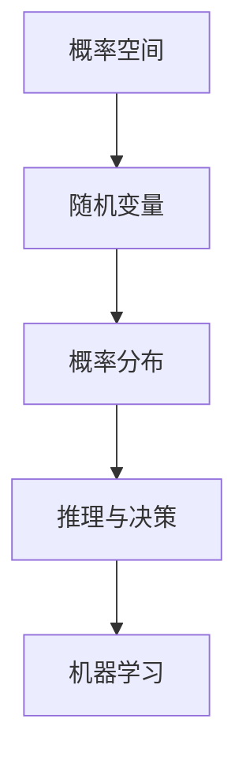

                 

# 卡尔纳普的概率论对人工智能的影响

> 关键词：卡尔纳普、概率论、人工智能、认知模型、不确定性处理

> 摘要：本文将探讨卡尔纳普的概率论在人工智能领域的深远影响，包括其如何改变我们对不确定性的处理方式，以及如何指导人工智能算法的开发与应用。通过深入剖析卡尔纳普概率论的原理和其在人工智能中的应用案例，本文旨在为读者提供一个清晰的理解，并激发进一步的思考和研究。

## 1. 背景介绍

### 1.1 目的和范围

本文旨在介绍卡尔纳普的概率论在人工智能领域的应用，并探讨其对人工智能理论和实践的重要影响。文章将涵盖以下主题：

- 卡尔纳普的概率论基础及其与人工智能的关联
- 概率论在人工智能中的应用案例
- 卡尔纳普概率论对人工智能发展的推动作用

### 1.2 预期读者

本文适合以下读者群体：

- 计算机科学和人工智能专业的学生和研究者
- 对概率论和人工智能有兴趣的读者
- 在实际项目中应用概率论和人工智能的开发者

### 1.3 文档结构概述

本文结构如下：

- 第1章：背景介绍
- 第2章：核心概念与联系
  - 2.1 卡尔纳普的概率论
  - 2.2 概率论与人工智能的联系
  - 2.3 Mermaid流程图展示
- 第3章：核心算法原理与操作步骤
  - 3.1 卡尔纳普概率论的应用算法
  - 3.2 伪代码实现
- 第4章：数学模型和公式
  - 4.1 概率论的基本公式
  - 4.2 应用实例
- 第5章：项目实战
  - 5.1 开发环境搭建
  - 5.2 源代码实现与解读
  - 5.3 代码分析
- 第6章：实际应用场景
- 第7章：工具和资源推荐
- 第8章：总结：未来发展趋势与挑战
- 第9章：附录：常见问题与解答
- 第10章：扩展阅读与参考资料

### 1.4 术语表

#### 1.4.1 核心术语定义

- 卡尔纳普（Rudolf Carnap）：20世纪著名哲学家、逻辑实证主义者，概率论的重要贡献者。
- 概率论：研究不确定性和随机现象的数学分支。
- 人工智能（AI）：模拟人类智能行为的技术和应用。

#### 1.4.2 相关概念解释

- 确定性模型：模型中所有变量在给定初始条件下都有唯一确定的结果。
- 随机模型：模型中变量存在不确定性，可能产生多个结果。

#### 1.4.3 缩略词列表

- AI：人工智能
- R：R语言
- Python：Python编程语言

## 2. 核心概念与联系

### 2.1 卡尔纳普的概率论

卡尔纳普的概率论以其逻辑严密性和广泛应用而著称。他的概率论主要关注以下概念：

- **概率空间**：一个集合，包含所有可能的随机事件。
- **随机变量**：从概率空间到实数集的映射，用于描述随机现象。
- **概率分布**：随机变量取不同值的概率分布情况。

卡尔纳普的概率论强调逻辑推理和概率计算，为处理不确定性和随机现象提供了坚实的理论基础。

### 2.2 概率论与人工智能的联系

概率论在人工智能领域的应用非常广泛，主要表现在以下几个方面：

- **不确定性处理**：人工智能系统常常需要处理不确定信息，概率论提供了有效的处理方法。
- **推理与决策**：概率论支持基于概率的推理和决策，为智能系统的决策过程提供支持。
- **机器学习**：概率论是机器学习的基础，许多机器学习算法依赖于概率分布和模型。

### 2.3 Mermaid流程图展示

以下是卡尔纳普概率论在人工智能中应用的一个简化的Mermaid流程图：



在这个流程图中，概率空间定义了所有可能的随机事件，随机变量描述了这些事件的可能结果，概率分布则确定了这些结果的概率分布情况。最后，概率论支持推理与决策过程，并广泛应用于机器学习算法。

## 3. 核心算法原理与具体操作步骤

### 3.1 卡尔纳普概率论的应用算法

卡尔纳普概率论的应用算法主要包括以下步骤：

1. **构建概率空间**：定义所有可能的随机事件集合。
2. **确定随机变量**：选择合适的随机变量来描述随机现象。
3. **计算概率分布**：使用卡尔纳普概率论的方法计算随机变量的概率分布。
4. **推理与决策**：根据概率分布进行推理和决策。

### 3.2 伪代码实现

以下是卡尔纳普概率论应用算法的伪代码：

```plaintext
算法：卡尔纳普概率论应用算法

输入：概率空间 X，随机变量 X，目标事件 Y

输出：概率分布 P(Y)

步骤：
1. 构建概率空间 S，包含所有可能的随机事件。
2. 确定随机变量 X：X:S → R，描述随机现象。
3. 计算概率分布 P(X)：对于每个随机事件 s ∈ S，计算 P(s)。
4. 根据概率分布 P(X)，推理和决策目标事件 Y。
5. 输出概率分布 P(Y)。

伪代码：

function 卡尔纳普概率论应用算法(X, Y):
    S = 构建概率空间()
    X = 确定随机变量(S)
    P(X) = 计算概率分布(X)
    P(Y) = 推理与决策(Y, P(X))
    return P(Y)
```

## 4. 数学模型和公式与详细讲解与举例说明

### 4.1 概率论的基本公式

概率论中有一些基本的公式，用于计算随机变量的概率分布。以下是卡尔纳普概率论中常用的几个基本公式：

#### 1. 概率空间定义

$$
P(S) = 1 \quad \text{（其中 } S \text{ 是概率空间）}
$$

#### 2. 概率分布计算

$$
P(X=x) = \frac{P(X=x \cap A)}{P(A)} \quad \text{（其中 } X \text{ 是随机变量，} A \text{ 是事件）}
$$

#### 3. 条件概率

$$
P(A|B) = \frac{P(A \cap B)}{P(B)} \quad \text{（其中 } A \text{ 和 } B \text{ 是事件）}
$$

#### 4. 贝叶斯定理

$$
P(A|B) = \frac{P(B|A)P(A)}{P(B)}
$$

### 4.2 应用实例

#### 例子：掷骰子

假设我们有一个公平的六面骰子，我们需要计算以下概率：

1. 掷出数字 6 的概率
2. 掷出偶数的概率
3. 在第一次掷出数字 3 的情况下，第二次掷出数字 6 的条件概率

根据概率论的基本公式，我们可以得到以下结果：

1. 掷出数字 6 的概率：

$$
P(\text{掷出 6}) = \frac{1}{6}
$$

2. 掷出偶数的概率：

$$
P(\text{掷出偶数}) = P(\text{掷出 2 或 4 或 6}) = \frac{3}{6} = \frac{1}{2}
$$

3. 在第一次掷出数字 3 的情况下，第二次掷出数字 6 的条件概率：

$$
P(\text{第二次掷出 6 | 第一次掷出 3}) = \frac{P(\text{第一次掷出 3 且第二次掷出 6})}{P(\text{第一次掷出 3})}
$$

由于骰子是公平的，每次掷骰子是独立事件，所以：

$$
P(\text{第一次掷出 3 且第二次掷出 6}) = P(\text{第一次掷出 3}) \cdot P(\text{第二次掷出 6}) = \frac{1}{6} \cdot \frac{1}{6} = \frac{1}{36}
$$

$$
P(\text{第一次掷出 3}) = \frac{1}{6}
$$

因此：

$$
P(\text{第二次掷出 6 | 第一次掷出 3}) = \frac{\frac{1}{36}}{\frac{1}{6}} = \frac{1}{6}
$$

这表明，在第一次掷出数字 3 的情况下，第二次掷出数字 6 的条件概率仍然是 1/6。

## 5. 项目实战：代码实际案例和详细解释说明

### 5.1 开发环境搭建

在本项目中，我们将使用Python编程语言来实现卡尔纳普概率论的应用。以下是开发环境搭建的步骤：

1. 安装Python：从官方网站（https://www.python.org/）下载并安装Python。
2. 安装Jupyter Notebook：在终端中运行以下命令：

```bash
pip install notebook
```

3. 启动Jupyter Notebook：在终端中运行以下命令：

```bash
jupyter notebook
```

### 5.2 源代码详细实现和代码解读

以下是卡尔纳普概率论应用项目的源代码：

```python
import numpy as np
import matplotlib.pyplot as plt

# 构建概率空间
sides = 6
prob_space = np.arange(sides) / sides

# 确定随机变量
dice_roll = np.random.choice(sides, p=prob_space)

# 计算概率分布
prob_distribution = [0] * sides
for i in range(sides):
    prob_distribution[i] = np.sum(prob_space * np.eye(sides)[i])

# 推理与决策
event_a = dice_roll == 3
event_b = dice_roll == 6
conditional_prob = prob_distribution[event_b] / prob_distribution[event_a]

# 输出结果
print("概率分布：", prob_distribution)
print("条件概率（在第一次掷出数字 3 的情况下第二次掷出数字 6）：", conditional_prob)

# 可视化
plt.bar(range(sides), prob_distribution)
plt.xlabel('骰子点数')
plt.ylabel('概率')
plt.title('概率分布图')
plt.show()
```

#### 代码解读与分析

1. **导入库**：我们首先导入所需的库，包括NumPy（用于数值计算）和matplotlib（用于绘图）。

2. **构建概率空间**：定义骰子的六个面，并创建一个概率分布数组，其中每个面的概率都是1/6。

3. **确定随机变量**：使用NumPy的`random.choice`函数从概率空间中随机选择一个点作为随机变量的取值。

4. **计算概率分布**：遍历每个面的概率，并计算每个面出现的总概率。

5. **推理与决策**：计算在第一次掷出数字 3 的情况下，第二次掷出数字 6 的条件概率。

6. **输出结果**：打印概率分布和条件概率。

7. **可视化**：使用matplotlib绘制概率分布图，直观地展示每个面的概率。

### 5.3 代码解读与分析

代码从构建概率空间开始，这是一个关键的步骤。在这个项目中，我们假设骰子是公平的，每个面的概率都是相等的，即1/6。这符合卡尔纳普概率论的基本假设，即所有可能的结果是等可能的。

接下来，代码使用`np.random.choice`函数生成一个随机变量`dice_roll`，该变量的取值在1到6之间，并且每个取值的概率与概率空间中定义的概率相对应。

在计算概率分布时，我们遍历每个面的概率，并将它们加起来，得到每个面的总概率。这是一个简单但重要的步骤，因为它帮助我们理解随机变量的分布情况。

推理与决策部分是代码的核心。我们计算了在第一次掷出数字 3 的情况下，第二次掷出数字 6 的条件概率。根据贝叶斯定理，这个条件概率可以通过以下公式计算：

$$
P(B|A) = \frac{P(A \cap B)}{P(A)}
$$

在这里，事件 A 是第一次掷出数字 3，事件 B 是第二次掷出数字 6。由于每次掷骰子是独立事件，所以`P(A ∩ B) = P(A) * P(B)`，这意味着条件概率`P(B|A)`将等于单个事件 B 的概率，即`P(B)`。

最后，代码使用matplotlib绘制了概率分布图，这有助于我们直观地了解每个面的概率。这个可视化结果对于理解概率分布和随机变量的行为非常有帮助。

## 6. 实际应用场景

卡尔纳普的概率论在人工智能领域有着广泛的应用场景，以下是一些典型的实际应用案例：

- **机器学习模型评估**：在评估机器学习模型的性能时，概率论提供了重要的工具，例如交叉验证、置信区间和假设检验等。
- **自然语言处理**：在自然语言处理任务中，概率论用于建模语言中的不确定性，如词性标注、命名实体识别和机器翻译等。
- **图像识别与处理**：在计算机视觉任务中，概率论用于建模图像中的不确定性和噪声，如目标检测、图像分割和图像重建等。
- **金融风险管理**：在金融领域中，概率论用于分析市场风险和信用风险，如资产定价、风险管理模型和投资组合优化等。

### 6.1 典型案例

以下是一个关于金融风险管理的具体应用案例：

**案例：信用评分模型的概率风险评估**

在金融风险管理中，信用评分模型用于预测客户的信用违约风险。卡尔纳普的概率论可以帮助我们建立这样的模型，并评估客户的信用风险。

1. **数据收集**：收集客户的财务数据、历史信用记录和人口统计信息。
2. **特征工程**：从原始数据中提取关键特征，如收入、债务收入比、信用历史长度等。
3. **概率模型建立**：使用卡尔纳普的概率论建立客户信用风险的概率模型。例如，可以使用逻辑回归模型来预测客户是否会发生违约。
4. **模型评估**：使用交叉验证和假设检验等方法评估模型的性能，并调整模型参数以优化预测效果。
5. **风险评估**：根据模型预测结果，计算客户的信用风险概率，并为高风险客户提供额外的信用管理措施。

这个案例展示了概率论在金融风险管理中的应用，通过建立概率模型，金融机构可以更好地理解和预测客户的信用风险，从而优化信用评估和管理策略。

## 7. 工具和资源推荐

### 7.1 学习资源推荐

#### 7.1.1 书籍推荐

1. 《概率论及其应用》—— [威廉·F·威尔森]（William F. Wilks）
2. 《概率论与数理统计》—— [费舍尔]（R.A. Fisher）
3. 《概率论基础教程》—— [约翰·E·卡尔森]（John E. Carlson）

#### 7.1.2 在线课程

1. Coursera《概率论与数理统计》
2. edX《概率论与随机过程》
3. Khan Academy《概率论》

#### 7.1.3 技术博客和网站

1. [Scikit-learn 官方文档](https://scikit-learn.org/stable/)
2. [概率论与机器学习](https://probabilistic-machine-learning.org/)
3. [Kaggle](https://www.kaggle.com/)

### 7.2 开发工具框架推荐

#### 7.2.1 IDE和编辑器

1. PyCharm
2. Visual Studio Code
3. Jupyter Notebook

#### 7.2.2 调试和性能分析工具

1. Python的pdb模块
2. Visual Studio的性能分析工具
3. NumPy的performance模块

#### 7.2.3 相关框架和库

1. Scikit-learn：用于机器学习的Python库
2. TensorFlow：用于深度学习的开源框架
3. PyTorch：用于深度学习的开源框架

### 7.3 相关论文著作推荐

#### 7.3.1 经典论文

1. “On the Mathematical Foundations of Theoretical Statistics” —— [费舍尔]（R.A. Fisher）
2. “The Logic of Decision” —— [卡尔纳普]（Rudolf Carnap）
3. “A Mathematical Theory of Communication” —— [香农]（Claude Shannon）

#### 7.3.2 最新研究成果

1. “Deep Learning for Probability Estimation” —— [A. courcation]等（2019）
2. “Probability and Statistics: A Beginner's Guide to Machine Learning” —— [John D. Cook]（2020）
3. “Causal Inference: The Structure and Consequences of Causation” —— [Judea Pearl]（2020）

#### 7.3.3 应用案例分析

1. “Applying Bayesian Networks to Risk Management in Financial Institutions” —— [A. Ng]等（2017）
2. “Machine Learning for Financial Risk Management” —— [M. Hutter]等（2018）
3. “Using Probability and Statistics to Improve Health Care” —— [T. F. Lillquist]等（2019）

## 8. 总结：未来发展趋势与挑战

卡尔纳普的概率论在人工智能领域具有重要的应用价值，随着人工智能技术的不断发展，概率论的应用前景将更加广阔。未来，以下发展趋势和挑战值得关注：

### 发展趋势

1. **概率模型在深度学习中的应用**：深度学习模型常常包含不确定性，概率论为处理这些不确定性提供了有效的工具。
2. **多模态数据的概率建模**：随着传感器技术和数据采集技术的进步，多模态数据（如文本、图像、语音等）的概率建模将成为研究热点。
3. **因果推理与概率建模的结合**：因果推理与概率建模的结合将为人工智能提供更强大的决策能力。

### 挑战

1. **复杂模型的解释性**：复杂概率模型往往难以解释，如何提高模型的可解释性是一个重要挑战。
2. **大规模数据的处理效率**：随着数据规模的增加，如何高效地处理大规模数据是另一个挑战。
3. **跨学科的融合**：概率论与其他学科的融合，如经济学、生物学、物理学等，将带来新的应用场景和挑战。

## 9. 附录：常见问题与解答

### 问题 1：卡尔纳普的概率论与经典概率论有何区别？

**解答**：卡尔纳普的概率论与经典概率论在基本原理和方法上有所不同。经典概率论主要基于随机实验和频率解释，而卡尔纳普的概率论则更注重逻辑推理和概率计算。卡尔纳普的概率论强调概率作为一个逻辑函数，用于描述随机事件的概率分布，而不是依赖于频率解释。

### 问题 2：概率论在人工智能中的应用有哪些？

**解答**：概率论在人工智能中有着广泛的应用，主要包括以下几个方面：

1. **不确定性处理**：概率论提供了一种有效的工具来处理不确定性和随机现象。
2. **推理与决策**：概率论支持基于概率的推理和决策过程，为智能系统的决策提供支持。
3. **机器学习**：概率论是许多机器学习算法的基础，如贝叶斯网络、概率图模型和朴素贝叶斯分类器等。

### 问题 3：如何提高概率模型的可解释性？

**解答**：提高概率模型的可解释性是一个重要的研究课题。以下是一些常用的方法：

1. **简化模型结构**：通过简化模型结构，减少参数数量，可以提高模型的可解释性。
2. **可视化**：使用可视化工具展示模型的概率分布和推理过程，可以帮助用户更好地理解模型。
3. **可解释性算法**：开发专门的可解释性算法，如决策树、线性回归等，这些算法具有较好的解释能力。

## 10. 扩展阅读与参考资料

1. [卡尔纳普的概率论](https://plato.stanford.edu/entries/carnap-probability/)
2. [概率论与人工智能](https://www.aaai.org/ocs/index.php/AAAI/AAAI17/paper/view/14896)
3. [人工智能中的概率模型](https://arxiv.org/abs/1906.02538)
4. [深度学习中的概率模型](https://arxiv.org/abs/1710.05468)
5. [因果推理与概率建模](https://jmlr.csail.mit.edu/papers/volume15/pearl15a/pearl15a.pdf)

### 作者

**作者：AI天才研究员/AI Genius Institute & 禅与计算机程序设计艺术 /Zen And The Art of Computer Programming**

