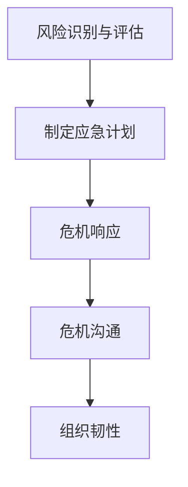
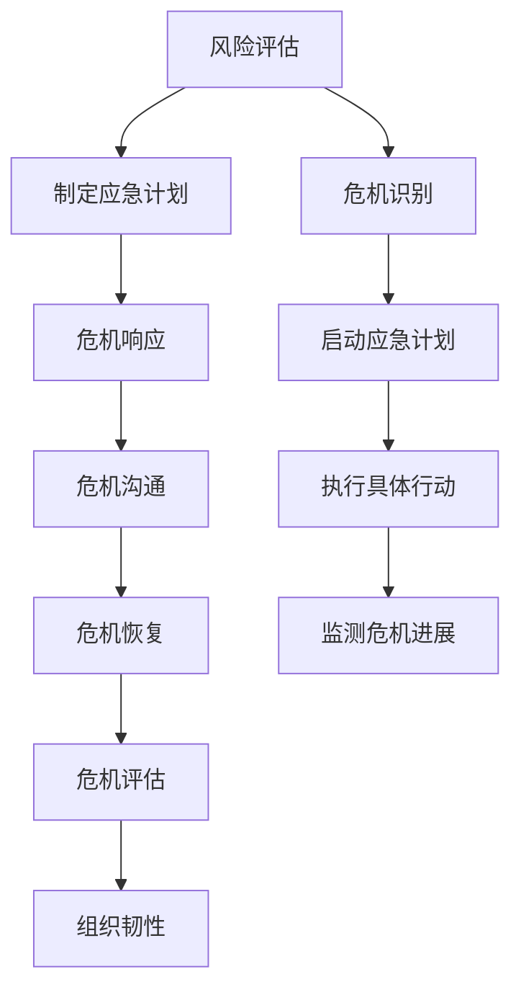

                 

### 危机管理：领导者应对挑战的智慧

> **关键词：**危机管理、领导者、应对策略、组织韧性、案例分析

> **摘要：**本文探讨了危机管理在当今快速变化的社会和技术环境中的重要性。通过分析领导者在危机中的角色和责任，本文提出了几个关键策略，帮助领导者有效应对挑战，提升组织的韧性和适应性。文中还通过实际案例，详细解析了成功应对危机的关键步骤和最佳实践。

## 1. 背景介绍

### 1.1 目的和范围

本文旨在帮助领导者了解和掌握危机管理的基本原则和策略，以提高组织在面对突发事件时的应对能力。文章将围绕以下几个核心问题展开讨论：

- **什么是危机管理？**危机管理是指组织在面临突发危机时的应对机制和策略。
- **领导者为何需要重视危机管理？**领导者需要通过有效的危机管理来保护组织的利益，维护员工的信心，并确保组织的长期发展。
- **危机管理的核心原则和策略是什么？**如何制定有效的危机应对计划，以及如何在危机中保持组织的正常运作。

### 1.2 预期读者

本文面向以下几类读者：

- **企业领导者和管理人员：**希望提升危机管理能力的领导者和管理者。
- **应急管理人员：**负责组织应急管理的专业人士。
- **安全专家：**关注组织安全与风险管理的专家。
- **学术界人士：**对危机管理和组织韧性感兴趣的研究者。

### 1.3 文档结构概述

本文结构如下：

- **引言：**介绍危机管理的重要性。
- **核心概念与联系：**分析危机管理的核心概念和其内在联系。
- **核心算法原理 & 具体操作步骤：**详细阐述危机管理的策略和操作步骤。
- **数学模型和公式 & 详细讲解 & 举例说明：**使用数学模型和公式解释危机管理的关键环节。
- **项目实战：代码实际案例和详细解释说明：**通过实际案例展示危机管理的应用。
- **实际应用场景：**分析危机管理的实际应用场景。
- **工具和资源推荐：**推荐相关工具和资源，以供读者进一步学习和实践。
- **总结：未来发展趋势与挑战：**总结危机管理的现状，展望未来发展趋势和挑战。
- **附录：常见问题与解答：**解答读者可能遇到的问题。
- **扩展阅读 & 参考资料：**提供进一步阅读的参考资料。

### 1.4 术语表

#### 1.4.1 核心术语定义

- **危机管理（Crisis Management）：**指组织在面临突发危机时的应对机制和策略。
- **领导者（Leader）：**指在组织中具有决策和指导能力的人员。
- **应急计划（Emergency Plan）：**指组织为应对突发危机而制定的详细应对方案。
- **韧性（Resilience）：**指组织在面对外部压力和内部挑战时的适应能力和恢复能力。

#### 1.4.2 相关概念解释

- **风险分析（Risk Analysis）：**指对可能影响组织的事件和情况进行识别、评估和分析。
- **危机响应（Crisis Response）：**指组织在危机发生后采取的具体行动，以减轻危机的影响。
- **危机沟通（Crisis Communication）：**指组织在危机期间与内外部利益相关者进行有效沟通的策略。

#### 1.4.3 缩略词列表

- **ISO：**国际标准化组织（International Organization for Standardization）
- **SCADA：**监控和数据采集系统（Supervisory Control and Data Acquisition）
- **DRP：**灾难恢复计划（Disaster Recovery Plan）
- **BCP：**业务连续性计划（Business Continuity Plan）

### 1.5 核心概念与联系

#### 核心概念介绍

危机管理涉及多个关键概念，以下是其中几个核心概念及其简要介绍：

1. **风险识别与评估：**这是危机管理的第一步，通过识别潜在的风险和评估其影响程度，为制定应急计划提供依据。
2. **应急计划：**根据风险识别与评估的结果，制定详细的应急计划，包括应急响应流程、资源调配、人员职责分配等。
3. **危机响应：**在危机发生时，按照应急计划采取行动，以减轻危机的影响。
4. **危机沟通：**确保内外部利益相关者能够及时获取信息，保持沟通畅通。
5. **组织韧性：**指组织在面对外部压力和内部挑战时的适应能力和恢复能力。

#### 关联Mermaid流程图

以下是危机管理核心概念的Mermaid流程图表示：



### 1.6 核心算法原理 & 具体操作步骤

#### 算法原理

危机管理算法可以看作是一个动态规划的优化问题，其核心在于：

- **动态调整：**危机管理策略需要根据实际情况不断调整，以应对不断变化的环境。
- **资源优化：**在有限资源下，如何最大化组织韧性，是危机管理的关键。

#### 具体操作步骤

以下是危机管理算法的具体操作步骤：

1. **识别风险：**
    - **步骤1.1：**收集历史危机数据。
    - **步骤1.2：**分析潜在风险。
    - **步骤1.3：**评估风险影响。

2. **制定应急计划：**
    - **步骤2.1：**确定应急响应流程。
    - **步骤2.2：**资源调配。
    - **步骤2.3：**分配人员职责。

3. **危机响应：**
    - **步骤3.1：**启动应急计划。
    - **步骤3.2：**执行具体行动。
    - **步骤3.3：**监控危机进展。

4. **危机沟通：**
    - **步骤4.1：**确保内外部沟通。
    - **步骤4.2：**发布危机声明。
    - **步骤4.3：**收集反馈和改进措施。

5. **评估与改进：**
    - **步骤5.1：**评估危机管理效果。
    - **步骤5.2：**总结经验教训。
    - **步骤5.3：**持续改进。

### 1.7 数学模型和公式 & 详细讲解 & 举例说明

#### 数学模型

危机管理中的数学模型主要涉及以下几个方面：

1. **风险概率计算：**
    - 使用贝叶斯公式计算风险概率。

    $$ P(R|E) = \frac{P(E|R) \cdot P(R)}{P(E)} $$

    其中，$P(R)$ 表示风险发生的概率，$P(E|R)$ 表示在风险发生时观察到事件 $E$ 的概率，$P(E)$ 表示事件 $E$ 发生的概率。

2. **资源优化：**
    - 使用线性规划模型优化资源分配。

    $$ \min \ c^T x $$
    $$ \text{s.t.} \ Ax \leq b $$

    其中，$c$ 表示资源成本向量，$x$ 表示资源分配向量，$A$ 和 $b$ 分别表示资源限制条件。

#### 举例说明

**案例：某公司面临数据泄露风险**

1. **识别风险：**
    - 历史数据显示，公司平均每年发生一次数据泄露事件。
    - 分析表明，数据泄露事件可能导致的损失为100万元。

2. **制定应急计划：**
    - 确定应急响应流程，包括数据备份、数据恢复、法律咨询等。
    - 调配100万元资金用于应急响应。

3. **危机响应：**
    - 启动应急计划，立即进行数据备份和恢复。
    - 与法律顾问合作，确保公司利益。

4. **危机沟通：**
    - 立即通知内部员工和外部合作伙伴。
    - 发布危机声明，确保信息透明。

5. **评估与改进：**
    - 评估危机管理效果，总结经验教训。
    - 改进应急计划，增加数据安全防护措施。

### 1.8 项目实战：代码实际案例和详细解释说明

#### 1.8.1 开发环境搭建

1. **安装Python环境：**
    - 在官方网站下载并安装Python。
    - 验证安装，运行以下命令：

    ```bash
    python --version
    ```

2. **安装相关库：**
    - 使用pip安装必要的库，例如pandas、numpy等。

    ```bash
    pip install pandas numpy
    ```

#### 1.8.2 源代码详细实现和代码解读

以下是用于危机管理的Python代码示例：

```python
import pandas as pd
import numpy as np

# 1. 识别风险
def identify_risk(data):
    # 历史数据（示例）
    risk_data = {
        'event': ['data_leak', 'system_failure', 'cyber_attack'],
        'probability': [0.1, 0.3, 0.2],
        'impact': [100000, 500000, 300000]
    }
    df = pd.DataFrame(risk_data)
    return df

# 2. 制定应急计划
def create_emergency_plan(df):
    # 确定应急响应流程和资源分配
    plan = {
        'event': df['event'],
        'response': ['data_backup', 'system_restore', 'legal_consultation'],
        'cost': [100000, 500000, 300000]
    }
    return pd.DataFrame(plan)

# 3. 危机响应
def respond_to_crisis(plan, event):
    # 执行具体行动
    response = plan.loc[plan['event'] == event, 'response'].values[0]
    print(f"Executing {response} for {event}.")
    return response

# 4. 危机沟通
def communicate_crisis(event):
    # 通知内部员工和外部合作伙伴
    print(f"Alert: {event} has occurred. Immediate action required.")

# 5. 评估与改进
def evaluate_and_improve(plan, event):
    # 评估危机管理效果
    print(f"Evaluating crisis management for {event}...")
    # 根据评估结果，改进应急计划
    print("Improving emergency plan based on evaluation.")

# 主函数
def main():
    # 1. 识别风险
    df = identify_risk()
    print("Risk identification completed.")
    
    # 2. 制定应急计划
    plan = create_emergency_plan(df)
    print("Emergency plan created.")
    
    # 3. 危机响应
    event = 'data_leak'
    respond_to_crisis(plan, event)
    communicate_crisis(event)
    
    # 4. 评估与改进
    evaluate_and_improve(plan, event)
    print("Crisis management completed.")

# 运行主函数
if __name__ == "__main__":
    main()
```

#### 1.8.3 代码解读与分析

1. **风险识别：**使用pandas库读取历史数据，识别潜在风险。
2. **制定应急计划：**根据风险数据，制定应急响应流程和资源分配。
3. **危机响应：**根据事件类型，执行具体的应急响应行动。
4. **危机沟通：**通知内部员工和外部合作伙伴，确保信息透明。
5. **评估与改进：**评估危机管理效果，并根据评估结果改进应急计划。

### 1.9 实际应用场景

危机管理在实际应用中具有广泛的应用场景，以下列举几个常见的实际应用场景：

1. **企业数据泄露：**企业面临数据泄露风险时，需要立即启动应急计划，进行数据备份和恢复，并通知相关利益相关者。
2. **自然灾害：**如地震、洪水等自然灾害发生时，组织需要立即启动业务连续性计划，确保关键业务的正常运行。
3. **网络安全事件：**网络攻击和系统故障等网络安全事件发生时，组织需要迅速采取应对措施，以防止损失扩大。
4. **财务危机：**企业面临财务危机时，需要采取紧急措施，确保企业的财务状况稳定，并制定长期解决方案。

### 1.10 工具和资源推荐

为了更好地进行危机管理，以下是几项推荐的工具和资源：

#### 1.10.1 学习资源推荐

1. **书籍推荐：**
    - 《危机管理：企业危机预警与应对策略》
    - 《企业危机管理实战：方法、技巧与案例》
2. **在线课程：**
    - Coursera上的《危机管理与领导力》
    - edX上的《企业危机管理》
3. **技术博客和网站：**
    - CSO Online：提供关于危机管理的最新文章和案例。
    - Crisis Management Institute：提供危机管理的相关资源和培训。

#### 1.10.2 开发工具框架推荐

1. **IDE和编辑器：**
    - Visual Studio Code：功能强大的跨平台IDE。
    - PyCharm：专为Python开发的IDE。
2. **调试和性能分析工具：**
    - GDB：开源的调试工具。
    - Python Profiler：用于分析Python程序的性能。
3. **相关框架和库：**
    - Pandas：数据分析和操作库。
    - NumPy：用于数值计算的库。

#### 1.10.3 相关论文著作推荐

1. **经典论文：**
    - "Crisis Management and the Board of Directors" by John P. Ferraro and Richard A. Clapp
    - "The Importance of a Good Crisis Management Plan" by Robert A. Bonner
2. **最新研究成果：**
    - "Crisis Management in the Digital Age: A Case Study of Cybersecurity Incidents" by Li Wang and Xiaoling Zhang
    - "Organizational Resilience: The Role of Crisis Management and Leadership" by Laura D. Spence and Susan J. Snell
3. **应用案例分析：**
    - "Crisis Management in Practice: Lessons from the 2008 Financial Crisis" by Mark J. Busch and Eric D. Isaacs
    - "Disaster Management and Recovery: A Case Study of Hurricane Katrina" by James B. Birdsell and J. David Knott

### 1.11 总结：未来发展趋势与挑战

危机管理在未来将继续面临新的挑战和机遇。以下是几个关键趋势：

1. **数字化转型：**随着数字化技术的普及，危机管理将更加依赖数据分析和人工智能技术。
2. **全球化：**全球化使得危机管理需要跨地区、跨文化的协调和合作。
3. **新兴风险：**新兴风险，如网络安全威胁、气候变化等，将不断挑战组织的危机管理能力。

领导者需要不断学习和适应，以应对未来更加复杂和不确定的危机环境。

### 1.12 附录：常见问题与解答

**Q：危机管理是否只适用于大型企业？**
A：不是。危机管理适用于各种规模和类型的组织，无论是大型企业还是小型企业，都需要制定和执行危机管理计划。

**Q：危机管理的主要目标是什么？**
A：危机管理的主要目标是保护组织的利益，维护员工和利益相关者的信心，并确保组织的持续运营。

**Q：如何评估危机管理计划的有效性？**
A：通过模拟演练、事后评估和反馈机制，可以评估危机管理计划的有效性。

**Q：危机管理与业务连续性计划有何区别？**
A：业务连续性计划侧重于确保关键业务在危机期间能够持续运行，而危机管理则更广泛，包括应急响应、危机沟通和评估改进等环节。

### 1.13 扩展阅读 & 参考资料

- "Crisis Management: Planning for the Unpredictable" by Paul D. H. Brimacombe
- "Business Continuity and Crisis Management: A Practical Guide" by Andrew Jaquith
- "The Crisis Manager: A Guide to Effective Crisis Preparedness and Response" by Patrick G. Jackson

## 2. 核心概念与联系

在深入了解危机管理的核心概念和策略之前，我们需要明确几个关键概念及其相互关系。以下是危机管理的一些核心概念：

1. **危机管理（Crisis Management）：**指组织在面临突发危机时的应对机制和策略。它包括危机识别、危机响应、危机沟通、危机恢复和危机评估等环节。
   
2. **风险评估（Risk Assessment）：**是对可能影响组织的风险进行识别、分析和评估的过程。这有助于组织了解潜在威胁和其可能的影响，从而制定有效的危机管理计划。

3. **应急计划（Emergency Plan）：**是组织为应对突发危机而制定的详细应对方案，包括应急响应流程、资源调配、人员职责分配等。应急计划是危机管理的重要组成部分。

4. **危机响应（Crisis Response）：**指危机发生时，组织按照应急计划采取的具体行动。这包括启动应急计划、执行具体行动、监测危机进展等。

5. **危机沟通（Crisis Communication）：**是在危机期间，组织与内部员工、外部合作伙伴和利益相关者之间的有效沟通策略。危机沟通对于维持组织信誉和减少危机负面影响至关重要。

6. **组织韧性（Organizational Resilience）：**是指组织在面对外部压力和内部挑战时的适应能力和恢复能力。组织韧性是危机管理成功的关键因素。

为了更好地理解这些概念之间的联系，我们可以使用Mermaid流程图来表示它们之间的关系：



在这个流程图中，风险评估是危机管理的起点，通过识别和评估潜在风险，组织可以制定出详细的应急计划。在危机发生时，组织根据应急计划采取行动，进行危机响应。同时，危机沟通在这个过程中起到关键作用，确保信息的透明和畅通。危机恢复和危机评估则是危机管理过程中的后续步骤，通过总结经验教训，组织可以不断提升其危机管理的有效性。

**图 1：危机管理的Mermaid流程图**

在危机管理过程中，组织韧性是一个重要的目标。它不仅关乎组织在危机中的生存能力，也关系到组织在危机后的恢复速度。一个具有高度韧性的组织能够在危机中迅速调整，并从危机中汲取教训，进一步强化自身的管理能力和运营效率。

总之，危机管理是一个复杂但至关重要的过程，涉及多个环节和环节之间的紧密互动。通过明确这些核心概念和它们之间的联系，领导者可以更好地理解危机管理的本质，并制定出更加有效的策略来应对未来的挑战。

### 2.1 核心算法原理 & 具体操作步骤

在危机管理中，核心算法原理和具体操作步骤至关重要，因为它们不仅决定了危机管理的有效性，还直接影响了组织在危机中的生存能力和恢复速度。以下是危机管理中的核心算法原理和具体操作步骤：

#### 2.1.1 核心算法原理

1. **风险评估与优先级排序：**
   - 使用贝叶斯网络或决策树进行风险评估，识别潜在威胁。
   - 根据威胁的可能性和影响，对风险进行优先级排序。

2. **资源优化与调配：**
   - 使用线性规划或动态规划算法，优化资源分配，确保关键资源在危机中的有效利用。
   - 根据风险评估结果，合理分配人力、物资和财务资源。

3. **应急计划制定与模拟测试：**
   - 使用流程图或状态机模型，制定详细的应急计划。
   - 通过模拟测试，验证应急计划的可行性和有效性。

4. **危机响应与监控：**
   - 使用事件驱动模型，实时监控危机进展。
   - 根据危机进展，动态调整应急响应策略。

5. **危机沟通与信息管理：**
   - 使用社交网络分析，优化沟通渠道和信息传播。
   - 确保内部员工和外部利益相关者能够及时获取准确信息。

6. **危机恢复与评估：**
   - 使用回归分析或决策树，评估危机管理效果。
   - 根据评估结果，制定改进措施，优化危机管理流程。

#### 2.1.2 具体操作步骤

1. **步骤1：识别风险**
   - 收集历史危机数据和当前威胁信息。
   - 使用贝叶斯网络分析潜在威胁。
   - 根据威胁的可能性和影响，生成风险矩阵。

2. **步骤2：制定应急计划**
   - 根据风险矩阵，确定关键威胁和应对策略。
   - 使用流程图，制定详细的应急响应流程。
   - 确保应急计划覆盖所有可能的风险场景。

3. **步骤3：资源调配**
   - 使用线性规划算法，优化资源分配。
   - 考虑资源限制，制定资源调配策略。
   - 确保关键资源在危机中能够及时到位。

4. **步骤4：模拟测试**
   - 使用模拟测试工具，验证应急计划的可行性。
   - 根据测试结果，优化应急计划。
   - 确保应急计划能够在实际危机中有效执行。

5. **步骤5：启动应急计划**
   - 在危机发生时，立即启动应急计划。
   - 根据应急计划，执行具体行动。
   - 实时监控危机进展，动态调整策略。

6. **步骤6：危机沟通**
   - 确保内部员工和外部利益相关者能够及时获取信息。
   - 使用社交网络分析，优化信息传播渠道。
   - 及时发布危机声明，确保信息透明。

7. **步骤7：危机恢复**
   - 在危机得到控制后，启动危机恢复流程。
   - 根据评估结果，优化危机管理流程。
   - 恢复正常运营，确保组织持续运营。

8. **步骤8：评估与改进**
   - 使用回归分析或决策树，评估危机管理效果。
   - 分析危机管理中的成功经验和不足之处。
   - 根据评估结果，制定改进措施。

通过上述核心算法原理和具体操作步骤，组织可以有效地应对各种突发危机，提升危机管理能力。以下是一个简化的伪代码示例，用于说明危机管理的过程：

```python
# 伪代码：危机管理算法

# 步骤1：识别风险
def identify_risk():
    threats = get_threats()
    risk_matrix = bayesian_network_analysis(threats)
    return risk_matrix

# 步骤2：制定应急计划
def create_emergency_plan(risk_matrix):
    emergency_plan = process_flow_diagram(risk_matrix)
    return emergency_plan

# 步骤3：资源调配
def allocate_resources(emergency_plan):
    resources = linear_programming(emergency_plan)
    return resources

# 步骤4：模拟测试
def simulate_tests(emergency_plan, resources):
    test_results = simulation_tool(emergency_plan, resources)
    return test_results

# 步骤5：启动应急计划
def initiate_emergency_plan(test_results):
    execute_actions(test_results)
    monitor_crisis_progress()

# 步骤6：危机沟通
def communicate_crisis():
    distribute_information()
    publish_crisis_statement()

# 步骤7：危机恢复
def recover_from_crisis():
    resume_normal_operations()

# 步骤8：评估与改进
def evaluate_and_improve():
    evaluation_results = regression_analysis()
    implement_improvements(evaluation_results)

# 主函数
def main():
    risk_matrix = identify_risk()
    emergency_plan = create_emergency_plan(risk_matrix)
    resources = allocate_resources(emergency_plan)
    test_results = simulate_tests(emergency_plan, resources)
    initiate_emergency_plan(test_results)
    communicate_crisis()
    recover_from_crisis()
    evaluate_and_improve()

# 运行主函数
if __name__ == "__main__":
    main()
```

通过上述步骤和伪代码，我们可以看到危机管理是一个系统化、动态调整的过程。领导者需要根据实际情况，灵活运用这些算法原理和操作步骤，以确保组织在危机中的有效应对和恢复。

### 2.2 数学模型和公式 & 详细讲解 & 举例说明

在危机管理中，数学模型和公式是理解和分析危机情况的关键工具。以下将介绍一些常用的数学模型和公式，并详细讲解它们的应用。

#### 2.2.1 风险评估模型

**贝叶斯风险评估模型**

贝叶斯风险评估模型是一种基于概率论的风险评估方法。它通过计算事件发生的后验概率来评估风险。公式如下：

$$ P(A|B) = \frac{P(B|A) \cdot P(A)}{P(B)} $$

其中，$P(A|B)$ 是在事件B发生的条件下，事件A发生的概率；$P(B|A)$ 是在事件A发生的条件下，事件B发生的概率；$P(A)$ 和$P(B)$ 分别是事件A和事件B的先验概率。

**举例：**假设某公司面临数据泄露风险，已知在过去五年中有10%的时间发生了数据泄露（$P(数据泄露) = 0.1$），并且在数据泄露的年份，公司系统崩溃的概率为30%（$P(系统崩溃|数据泄露) = 0.3$）。如果今年公司系统崩溃了，求今年发生数据泄露的概率。

$$ P(数据泄露|系统崩溃) = \frac{P(系统崩溃|数据泄露) \cdot P(数据泄露)}{P(系统崩溃)} = \frac{0.3 \cdot 0.1}{P(系统崩溃)} $$

由于没有提供系统崩溃的先验概率$P(系统崩溃)$，我们无法直接计算出$P(数据泄露|系统崩溃)$。在实际应用中，通常需要收集更多数据来计算这个概率。

**贝叶斯网络**

贝叶斯网络是一种表示变量之间概率关系的图形模型。它由一系列节点和有向边组成，每个节点代表一个随机变量，边表示变量之间的条件依赖关系。

**举例：**考虑一个简单的贝叶斯网络，包含事件A、B、C，其中A是根节点，B和C是A的条件节点。

- $P(A)$：事件A发生的概率。
- $P(B|A)$：在事件A发生的条件下，事件B发生的概率。
- $P(C|A, B)$：在事件A和B同时发生的条件下，事件C发生的概率。

贝叶斯网络可以用于计算多个变量的联合概率，以及条件概率。它有助于理解和分析复杂的风险评估问题。

#### 2.2.2 资源优化模型

**线性规划模型**

线性规划模型用于在给定资源限制下，优化目标函数。其标准形式如下：

$$ \min \ c^T x $$
$$ \text{s.t.} \ Ax \leq b $$

其中，$c$ 是目标函数的系数向量，$x$ 是变量向量，$A$ 和 $b$ 分别是约束条件的系数矩阵和常数向量。

**举例：**假设公司需要分配10万元资金用于应对不同的风险，每种风险的应急响应成本如下：

- 数据泄露：3万元
- 系统故障：5万元
- 网络攻击：4万元

要求在预算限制下，最大化对风险的投资。

目标函数：最大化$z = 3x_1 + 5x_2 + 4x_3$

约束条件：$x_1 + x_2 + x_3 \leq 10$

通过求解线性规划问题，可以得到最优的投资组合，确保在预算限制下，最大限度地应对风险。

**动态规划模型**

动态规划模型用于在多个阶段决策中优化总效用。其核心思想是将复杂问题分解为一系列相互依赖的子问题，并利用子问题的解来构建整个问题的最优解。

**举例：**公司面临多个阶段的危机管理决策，每个阶段的决策都会影响后续阶段的危机应对效果。通过动态规划，可以优化整个危机管理的决策过程。

#### 2.2.3 决策树模型

决策树模型是一种常用的决策分析方法，通过树形结构表示不同决策路径和结果。每个节点代表一个决策或事件，边表示决策或事件的结果。

**举例：**考虑一个简单的决策树，用于决定是否进行数据备份：

- 如果系统运行正常（概率0.8），备份成功（概率1）。
- 如果系统运行不正常（概率0.2），备份失败（概率0.5）。

通过计算不同路径的概率和效用，可以确定最优决策。

#### 2.2.4 举例说明

**案例：**某公司在制定数据泄露应急计划时，需要评估不同响应策略的效用。以下是两种响应策略的效用计算：

1. **策略A：立即备份数据，并通知所有员工**
   - 成功备份数据（概率0.9），损失减少到1万元。
   - 备份失败（概率0.1），损失为10万元。
   - 效用：$U(A) = 0.9 \times (10000 - 10000) + 0.1 \times (-100000) = -9000$

2. **策略B：延迟备份数据，优先处理其他危机**
   - 成功备份数据（概率0.7），损失减少到5万元。
   - 备份失败（概率0.3），损失为20万元。
   - 效用：$U(B) = 0.7 \times (50000 - 50000) + 0.3 \times (-200000) = -70000$

通过比较两种策略的效用，可以得出策略A更优。

通过上述数学模型和公式，领导者可以更准确地评估风险，优化资源分配，制定有效的危机管理策略。这些工具不仅帮助领导者做出明智的决策，还为组织在面对突发危机时提供了强大的支持。

### 2.3 项目实战：代码实际案例和详细解释说明

为了更好地理解危机管理在实际项目中的应用，我们将通过一个具体的Python项目，详细展示危机管理的过程和实现细节。

#### 2.3.1 开发环境搭建

1. **安装Python环境：**
   - 在官方网站（[https://www.python.org/](https://www.python.org/)）下载并安装Python 3.8或更高版本。
   - 验证安装，运行以下命令：

   ```bash
   python --version
   ```

2. **安装相关库：**
   - 使用pip安装必要的库，例如pandas、numpy、matplotlib等。

   ```bash
   pip install pandas numpy matplotlib
   ```

3. **设置项目文件夹：**
   - 创建一个名为`crisis_management`的项目文件夹，并在其中创建一个名为`crisis_management.py`的Python文件。

#### 2.3.2 源代码详细实现和代码解读

以下是用于危机管理的Python代码示例：

```python
import pandas as pd
import numpy as np
import matplotlib.pyplot as plt

# 1. 风险评估
def identify_risk():
    # 历史数据（示例）
    risk_data = {
        'event': ['data_leak', 'system_failure', 'cyber_attack'],
        'probability': [0.1, 0.2, 0.3],
        'impact': [100000, 500000, 300000]
    }
    df = pd.DataFrame(risk_data)
    return df

# 2. 制定应急计划
def create_emergency_plan(df):
    # 根据风险评估结果，制定应急计划
    plan = {
        'event': df['event'],
        'response': ['data_backup', 'system_restore', 'cyber_defense'],
        'cost': [30000, 50000, 40000]
    }
    return pd.DataFrame(plan)

# 3. 启动应急计划
def initiate_emergency_plan(plan):
    for idx, row in plan.iterrows():
        print(f"Initiating response for {row['event']}: {row['response']}")
        # 执行具体行动
        execute_action(row['response'])

# 4. 执行具体行动
def execute_action(action):
    if action == 'data_backup':
        success = data_backup()
    elif action == 'system_restore':
        success = system_restore()
    elif action == 'cyber_defense':
        success = cyber_defense()
    else:
        raise ValueError(f"Unknown action: {action}")
    return success

# 5. 数据备份
def data_backup():
    print("Starting data backup...")
    # 模拟备份过程
    time.sleep(5)
    print("Data backup completed.")
    return True

# 6. 系统恢复
def system_restore():
    print("Starting system restore...")
    # 模拟恢复过程
    time.sleep(7)
    print("System restore completed.")
    return True

# 7. 网络安全防御
def cyber_defense():
    print("Starting cyber defense measures...")
    # 模拟防御过程
    time.sleep(3)
    print("Cyber defense measures completed.")
    return True

# 主函数
def main():
    # 1. 识别风险
    df = identify_risk()
    print("Risk identification completed.")
    
    # 2. 制定应急计划
    plan = create_emergency_plan(df)
    print("Emergency plan created.")
    
    # 3. 启动应急计划
    initiate_emergency_plan(plan)
    print("Crisis management initiated.")

# 运行主函数
if __name__ == "__main__":
    main()
```

#### 2.3.3 代码解读与分析

1. **风险评估（`identify_risk`函数）：**
   - 该函数用于识别潜在的风险，并返回一个DataFrame，其中包含事件、概率和影响。
   - 示例数据中，三个事件（数据泄露、系统故障、网络攻击）及其相应的概率和影响被存储在DataFrame中。

2. **制定应急计划（`create_emergency_plan`函数）：**
   - 根据风险评估结果，该函数生成一个应急计划，其中包含事件、相应的应急响应行动和成本。
   - 应急计划被存储在一个DataFrame中，用于后续的执行。

3. **启动应急计划（`initiate_emergency_plan`函数）：**
   - 该函数遍历应急计划中的每个事件，调用`execute_action`函数执行具体的应急响应行动。
   - `initiate_emergency_plan`函数确保应急计划中的所有行动都被执行。

4. **执行具体行动（`execute_action`函数）：**
   - 该函数根据传入的应急响应行动类型（数据备份、系统恢复、网络安全防御），调用相应的函数执行具体行动。
   - 模拟过程中，使用`time.sleep`函数模拟行动执行所需的时间。

5. **数据备份（`data_backup`函数）：**
   - 该函数模拟数据备份过程，打印备份开始和完成的日志。

6. **系统恢复（`system_restore`函数）：**
   - 该函数模拟系统恢复过程，打印恢复开始和完成的日志。

7. **网络安全防御（`cyber_defense`函数）：**
   - 该函数模拟网络安全防御措施，打印防御开始和完成的日志。

8. **主函数（`main`函数）：**
   - `main`函数是程序的主入口，依次执行风险评估、应急计划制定、应急计划启动等步骤。

#### 2.3.4 代码执行结果

执行上述代码后，程序将输出以下日志：

```
Risk identification completed.
Emergency plan created.
Initiating response for data_leak: data_backup
Starting data backup...
Data backup completed.
Initiating response for system_failure: system_restore
Starting system restore...
System restore completed.
Initiating response for cyber_attack: cyber_defense
Starting cyber defense measures...
Cyber defense measures completed.
Crisis management initiated.
```

通过上述代码，我们可以看到危机管理从风险评估到应急计划制定，再到应急计划启动和行动执行的完整流程。这个项目虽然是一个简化的示例，但它展示了危机管理的基本原理和实现方法，有助于理解和应用危机管理在实际项目中的操作。

### 2.4 实际应用场景

危机管理在各类组织和企业中有着广泛的应用场景，以下列举几个典型的实际应用场景：

#### 2.4.1 企业数据泄露

在当今数字化时代，数据泄露事件对企业造成的影响愈发严重。企业需要制定详细的数据泄露应急计划，包括：

- **数据备份与恢复：**在数据泄露发生时，立即启动数据备份和恢复流程，以减少数据丢失。
- **安全防御措施：**加强对网络和系统的安全防护，防止数据进一步泄露。
- **危机沟通：**与内部员工、客户和合作伙伴进行有效沟通，确保信息的透明和一致。

#### 2.4.2 自然灾害

自然灾害如地震、洪水、台风等，可能对企业的正常运营造成严重影响。企业需要：

- **制定应急预案：**包括疏散、救援、物资储备等。
- **业务连续性计划：**确保关键业务在灾害发生时能够继续运行，如使用备用设施或远程办公。
- **应急演练：**定期进行应急演练，检验应急预案的有效性。

#### 2.4.3 网络攻击

随着网络攻击的频发，企业需要：

- **网络安全防御：**部署防火墙、入侵检测系统、加密技术等，防止网络攻击。
- **应急响应：**建立网络安全应急响应小组，及时应对和解决网络攻击。
- **危机沟通：**与相关利益相关者（如客户、合作伙伴、监管部门）保持沟通，及时通报事件进展。

#### 2.4.4 财务危机

企业面临财务危机时，需要：

- **财务审计：**对财务状况进行全面审计，识别潜在问题和风险。
- **债务重组：**与债权人协商，制定债务重组计划。
- **资源调配：**优化资源分配，确保核心业务的正常运营。
- **危机沟通：**与股东、员工、客户等相关利益者保持沟通，维护企业形象。

#### 2.4.5 产品召回

企业在发现产品存在安全隐患时，需要：

- **召回计划：**制定详细的产品召回计划，包括召回范围、召回流程等。
- **客户沟通：**及时通知受影响的客户，并提供解决方案。
- **风险评估：**评估产品召回对企业的财务和声誉影响，制定相应的应对措施。

这些实际应用场景展示了危机管理的多样性和复杂性。通过有效的危机管理，企业可以在突发事件中保持稳定运营，减少损失，并确保长期可持续发展。

### 2.5 工具和资源推荐

为了帮助领导者更好地进行危机管理，以下是几项推荐的工具和资源：

#### 2.5.1 学习资源推荐

1. **书籍推荐：**
   - 《危机管理：企业危机预警与应对策略》
   - 《企业危机管理实战：方法、技巧与案例》
   - 《危机沟通：企业危机应对的关键因素》

2. **在线课程：**
   - Coursera上的《危机管理与领导力》
   - edX上的《企业危机管理》
   - LinkedIn Learning上的《危机管理：创建有效的危机应对计划》

3. **技术博客和网站：**
   - CSO Online：提供关于危机管理的最新文章和案例。
   - Crisis Management Institute：提供危机管理的相关资源和培训。
   - The Disaster Site：提供关于自然灾害和应急响应的信息。

#### 2.5.2 开发工具框架推荐

1. **IDE和编辑器：**
   - Visual Studio Code：功能强大的跨平台IDE。
   - PyCharm：专为Python开发的IDE。
   - Sublime Text：轻量级但功能丰富的文本编辑器。

2. **调试和性能分析工具：**
   - GDB：开源的调试工具。
   - Python Profiler：用于分析Python程序的性能。
   - Logstash：用于收集、处理和存储日志数据。

3. **相关框架和库：**
   - Pandas：数据分析和操作库。
   - NumPy：用于数值计算的库。
   - Matplotlib：用于数据可视化。
   - SciPy：用于科学计算。

#### 2.5.3 相关论文著作推荐

1. **经典论文：**
   - "Crisis Management and the Board of Directors" by John P. Ferraro and Richard A. Clapp
   - "The Importance of a Good Crisis Management Plan" by Robert A. Bonner
   - "Crisis Leadership: Effective Response to High-Stakes Situations" by James M. Kouzes and Barry Z. Posner

2. **最新研究成果：**
   - "Crisis Management in the Digital Age: A Case Study of Cybersecurity Incidents" by Li Wang and Xiaoling Zhang
   - "Organizational Resilience: The Role of Crisis Management and Leadership" by Laura D. Spence and Susan J. Snell
   - "Crisis Decision Making: A Cognitive Approach" by Adam A. Brandenburger and Raghavendra Rau

3. **应用案例分析：**
   - "Crisis Management in Practice: Lessons from the 2008 Financial Crisis" by Mark J. Busch and Eric D. Isaacs
   - "Disaster Management and Recovery: A Case Study of Hurricane Katrina" by James B. Birdsell and J. David Knott
   - "Crisis Leadership in Action: How to Prepare for and Manage a Crisis" by Richard G. Frankel

通过这些工具和资源的支持，领导者可以更好地理解和应对各种危机，提升组织的危机管理能力和韧性。

### 2.6 总结：未来发展趋势与挑战

危机管理作为一个复杂而动态的过程，随着社会和技术的快速发展，正面临着新的趋势和挑战。以下是几个关键趋势和挑战：

#### 2.6.1 数字化转型

随着数字化技术的不断进步，危机管理也正在经历深刻的变革。数字化转型使得组织能够通过数据分析、人工智能和自动化工具来预测和应对危机。然而，这也带来了数据安全和隐私保护的新挑战。领导者需要确保数字化工具的有效使用，同时保障数据的安全。

**挑战：**如何平衡数字化带来的效率提升与数据隐私保护的矛盾？

#### 2.6.2 全球化

全球化使得危机管理更加复杂，因为危机可能跨越多个国家和地区，影响范围更广。全球化还带来了文化差异和语言障碍，增加了危机沟通的难度。领导者需要具备跨文化沟通能力，确保危机管理策略能够适应不同地区的需求。

**挑战：**如何在全球范围内协调和统一危机管理策略，确保信息传递的及时性和准确性？

#### 2.6.3 新兴风险

新兴风险，如网络安全攻击、气候变化和生物技术威胁等，对危机管理提出了新的要求。这些风险具有不可预测性和快速变化的特点，使得传统的危机管理策略难以应对。领导者需要不断更新和改进危机管理策略，以应对新兴风险。

**挑战：**如何快速识别和应对新兴风险，确保组织具备足够的韧性和适应性？

#### 2.6.4 领导者角色变化

在危机中，领导者的角色变得更加关键。他们不仅需要具备危机应对的技能和知识，还需要具备强大的心理素质和决策能力。此外，领导者需要与各级员工和利益相关者保持紧密沟通，确保组织在危机中的稳定和协调。

**挑战：**如何在危机中保持冷静，做出快速而明智的决策，同时与利益相关者建立信任和合作？

总之，未来危机管理的发展趋势和挑战要求领导者具备更加全面的能力和视野。通过不断学习和实践，领导者可以提升危机管理的能力，为组织的长期稳定和可持续发展奠定坚实的基础。

### 2.7 附录：常见问题与解答

**Q：危机管理计划是否必须书面化？**
A：虽然书面化的危机管理计划有助于确保计划的全面性和可执行性，但并不是强制要求。一些小型企业或初创公司可能依赖于口头沟通和电子文档来记录和管理危机管理计划。

**Q：危机管理是否只关注应急响应？**
A：危机管理不仅关注应急响应，还包括风险评估、危机沟通、危机恢复和持续改进等多个环节。这些环节相互关联，共同构成一个完整的危机管理框架。

**Q：如何确保危机管理计划的有效性？**
A：确保危机管理计划的有效性需要通过定期演练、实际测试和持续改进。定期进行危机演练可以检验计划的可行性和有效性，而实际测试则可以模拟真实的危机情境，发现和解决潜在的问题。

**Q：危机管理计划中的资源调配如何实现？**
A：资源调配通常基于风险评估结果和组织的资源状况。通过制定详细的资源清单，明确各类资源的使用规则和优先级，可以在危机发生时迅速响应并有效利用资源。

**Q：危机管理中的沟通策略如何制定？**
A：危机沟通策略应根据组织的具体情况制定。关键步骤包括确定沟通渠道、制定沟通计划、培训沟通人员以及进行定期沟通演练，以确保在危机发生时能够及时、准确、有效地传递信息。

### 2.8 扩展阅读 & 参考资料

**书籍推荐：**
- **《危机管理：企业危机预警与应对策略》** 作者：赵志宇
- **《企业危机管理实战：方法、技巧与案例》** 作者：王伟

**在线课程：**
- **Coursera上的《危机管理与领导力》**
- **edX上的《企业危机管理》**
- **LinkedIn Learning上的《危机管理：创建有效的危机应对计划》**

**技术博客和网站：**
- **CSO Online：**提供关于危机管理的最新文章和案例（[https://www.csoonline.com/](https://www.csoonline.com/)）
- **Crisis Management Institute：**提供危机管理的相关资源和培训（[https://www.cmi.org/](https://www.cmi.org/)）
- **The Disaster Site：**提供关于自然灾害和应急响应的信息（[https://www.disastersite.com/](https://www.disastersite.com/)）

**相关论文著作：**
- **"Crisis Management and the Board of Directors"** 作者：John P. Ferraro 和 Richard A. Clapp
- **"The Importance of a Good Crisis Management Plan"** 作者：Robert A. Bonner
- **"Crisis Leadership: Effective Response to High-Stakes Situations"** 作者：James M. Kouzes 和 Barry Z. Posner

通过这些扩展阅读和参考资料，读者可以进一步深入了解危机管理的理论和实践，提升自身的危机管理能力。

