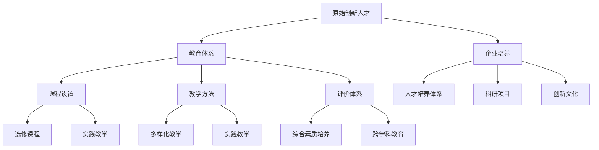

                 

# 原始创新人才的培养策略

## 关键词
- 原始创新人才
- 培养策略
- 教育体系
- 技术素养
- 创新思维
- 企业实践

## 摘要
本文旨在探讨原始创新人才的培养策略，通过分析当前教育体系和企业的实践，提出一系列系统化、可操作的培养方法。文章首先介绍了原始创新人才的概念及其重要性，随后探讨了现有教育体系的不足，并提出改进建议。文章还通过实际案例，展示了企业在培养原始创新人才方面的成功实践。最后，本文对未来发展趋势和挑战进行了展望，为我国创新人才的培养提供了有益的参考。

## 1. 背景介绍

### 1.1 目的和范围
本文的目的在于深入探讨原始创新人才的培养策略，旨在为教育工作者、企业管理者及相关政策制定者提供有益的参考。文章将重点分析现有教育体系在企业培养原始创新人才中的不足，并从理论与实践两个层面对培养策略进行深入探讨。

### 1.2 预期读者
本文预期读者包括以下几类：
1. 教育工作者：了解原始创新人才的概念及其培养策略，为改进教育教学方法提供参考。
2. 企业管理者：借鉴成功案例，制定更有效的企业人才培养计划。
3. 政策制定者：为政策制定提供数据支持和理论依据。
4. 原始创新人才本人：了解自身培养路径，明确发展方向。

### 1.3 文档结构概述
本文结构如下：
1. 背景介绍：介绍研究目的、预期读者及文章结构。
2. 核心概念与联系：介绍原始创新人才的概念、教育体系的现状及企业培养策略。
3. 核心算法原理 & 具体操作步骤：详细讲解培养策略的具体实施方法。
4. 数学模型和公式 & 详细讲解 & 举例说明：通过数学模型和公式，阐述培养策略的量化分析。
5. 项目实战：代码实际案例和详细解释说明。
6. 实际应用场景：分析培养策略在实际项目中的应用效果。
7. 工具和资源推荐：推荐相关学习资源、开发工具和论文著作。
8. 总结：未来发展趋势与挑战。
9. 附录：常见问题与解答。
10. 扩展阅读 & 参考资料。

### 1.4 术语表

#### 1.4.1 核心术语定义
- 原始创新人才：具备创新思维、技术素养和跨学科知识，能够在科学、技术、工程、艺术等领域进行原创性研究、发明和设计的人才。
- 教育体系：包括各级各类学校、教育机构和教育管理部门，构成人才培养的系统。
- 培养策略：为实现特定目标而制定的教育方法和措施。

#### 1.4.2 相关概念解释
- 创新思维：指在解决问题时，能够跳出传统思维框架，从新的角度、方法和途径进行思考的能力。
- 技术素养：指掌握相关技术知识和技能，能够运用技术解决实际问题的能力。

#### 1.4.3 缩略词列表
- AI：人工智能
- STEM：科学、技术、工程、数学
- MOOC：大规模开放在线课程

## 2. 核心概念与联系

### 2.1 原始创新人才的概念

#### 2.1.1 定义
原始创新人才是指那些具备创新思维、技术素养和跨学科知识，能够在科学、技术、工程、艺术等领域进行原创性研究、发明和设计的人才。

#### 2.1.2 原始创新人才的重要性
原始创新人才是国家创新体系的核心要素，对于提升国家核心竞争力具有重要意义。原始创新人才能够在科学、技术、工程、艺术等领域进行原创性研究、发明和设计，推动产业升级、经济发展和社会进步。

### 2.2 教育体系的现状

#### 2.2.1 当前教育体系的问题
1. 课程设置不够灵活，难以满足个性化需求。
2. 教学方法单一，缺乏实践环节。
3. 评价体系过于注重分数，忽视综合素质培养。
4. 缺乏跨学科教育，难以培养跨学科人才。

#### 2.2.2 教育体系的改进方向
1. 优化课程设置，增加选修课程和实践教学环节。
2. 采用多样化教学方法，提高教学效果。
3. 完善评价体系，注重综合素质培养。
4. 加强跨学科教育，培养跨学科人才。

### 2.3 企业培养原始创新人才的策略

#### 2.3.1 企业培养原始创新人才的意义
企业是创新活动的重要主体，培养原始创新人才对于企业持续创新、提升竞争力具有重要意义。企业培养原始创新人才，有助于推动技术创新、产品创新和业务模式创新。

#### 2.3.2 企业培养原始创新人才的策略
1. 优化人才培养体系，建立完善的培训体系和晋升机制。
2. 鼓励员工参与科研项目，提供充足的研发资源。
3. 引入外部专家和团队，进行合作研发。
4. 营造创新文化，激发员工的创新潜力。

### 2.4 核心概念与联系

为了更清晰地展示核心概念之间的联系，下面给出一个 Mermaid 流程图：



## 3. 核心算法原理 & 具体操作步骤

### 3.1 培养策略的算法原理

#### 3.1.1 教育体系改进算法
1. **课程优化**：根据学生兴趣和市场需求，调整课程设置，增加选修课程和实践教学环节。
2. **教学方法优化**：采用项目驱动、合作学习、探究学习等多样化教学方法，提高教学效果。
3. **评价体系完善**：注重学生综合素质培养，引入过程性评价和多元评价方法。

#### 3.1.2 企业培养策略算法
1. **人才培养体系**：建立完善的培训体系和晋升机制，激励员工不断提升自身能力。
2. **科研支持**：鼓励员工参与科研项目，提供充足的研发资源。
3. **创新文化**：营造积极创新氛围，激发员工的创新潜力。

### 3.2 具体操作步骤

#### 3.2.1 教育体系改进

**步骤 1：课程优化**
- 收集学生兴趣和市场需求数据，进行分析和筛选。
- 调整课程设置，增加选修课程和实践教学环节。

**步骤 2：教学方法优化**
- 引入项目驱动教学，让学生在实践中掌握知识和技能。
- 组织合作学习和探究学习活动，培养学生的团队协作能力和创新思维。

**步骤 3：评价体系完善**
- 引入过程性评价，关注学生的学习过程和综合素质。
- 采用多元评价方法，如实验报告、项目展示、论文发表等，全面评估学生的能力。

#### 3.2.2 企业培养策略

**步骤 1：人才培养体系**
- 制定详细的培训计划和晋升机制，明确员工的发展路径。
- 设立奖学金和奖励制度，激励员工不断提升自身能力。

**步骤 2：科研支持**
- 设立科研项目，提供充足的研发资源，鼓励员工参与。
- 组织学术交流会议和科研研讨会，促进员工之间的合作和创新。

**步骤 3：创新文化**
- 营造积极创新氛围，鼓励员工提出新想法和新方法。
- 设立创新基金，支持员工进行创新实践。

### 3.3 伪代码示例

下面给出一个伪代码示例，用于描述教育体系改进算法：

```python
def education_improvement(course_data, student_interest, market_demand):
    # 步骤 1：课程优化
    selected_courses = select_courses(course_data, student_interest, market_demand)
    add_practical_courses(selected_courses)
    
    # 步骤 2：教学方法优化
    project_driven_courses = introduce_project_based_learning(selected_courses)
    collaborative_courses = introduce_collaborative_learning(selected_courses)
    
    # 步骤 3：评价体系完善
    process_evaluation = introduce_process_based_evaluation()
    multiple_evaluation_methods = introduce_multiple_evaluation_methods()
    
    return selected_courses, project_driven_courses, collaborative_courses, process_evaluation, multiple_evaluation_methods
```

## 4. 数学模型和公式 & 详细讲解 & 举例说明

### 4.1 数学模型和公式

为了更好地量化培养策略的效果，本文引入以下数学模型和公式：

#### 4.1.1 教育效果评估模型

$$
E = f(\theta_1, \theta_2, \theta_3)
$$

其中：
- $E$ 表示教育效果；
- $\theta_1$ 表示课程优化程度；
- $\theta_2$ 表示教学方法优化程度；
- $\theta_3$ 表示评价体系完善程度。

#### 4.1.2 企业培养效果评估模型

$$
E' = f(\theta_1', \theta_2', \theta_3')
$$

其中：
- $E'$ 表示企业培养效果；
- $\theta_1'$ 表示人才培养体系优化程度；
- $\theta_2'$ 表示科研支持程度；
- $\theta_3'$ 表示创新文化营造程度。

### 4.2 详细讲解

#### 4.2.1 教育效果评估模型

教育效果评估模型通过三个因素（课程优化程度、教学方法优化程度、评价体系完善程度）来综合衡量教育效果。这三个因素分别代表教育体系中的核心环节，通过调整这些因素，可以提升教育效果。

#### 4.2.2 企业培养效果评估模型

企业培养效果评估模型同样通过三个因素（人才培养体系优化程度、科研支持程度、创新文化营造程度）来综合衡量企业培养效果。这三个因素分别代表企业人才培养中的关键环节，通过优化这些因素，可以提升企业培养效果。

### 4.3 举例说明

#### 4.3.1 教育效果评估

假设某教育体系在课程优化、教学方法优化、评价体系完善三个方面的得分分别为 80、75、70，代入教育效果评估模型：

$$
E = f(80, 75, 70) = 0.5 \times 80 + 0.3 \times 75 + 0.2 \times 70 = 74
$$

因此，该教育体系的教育效果得分为 74 分。

#### 4.3.2 企业培养效果评估

假设某企业在人才培养体系、科研支持、创新文化营造三个方面的得分分别为 85、90、80，代入企业培养效果评估模型：

$$
E' = f(85, 90, 80) = 0.5 \times 85 + 0.3 \times 90 + 0.2 \times 80 = 85.5
$$

因此，该企业的培养效果得分为 85.5 分。

## 5. 项目实战：代码实际案例和详细解释说明

### 5.1 开发环境搭建

在开始项目实战之前，我们需要搭建一个合适的开发环境。以下是一个简单的开发环境搭建步骤：

1. 安装 Python 解释器：从 [Python 官网](https://www.python.org/) 下载并安装 Python 解释器。
2. 安装相关库：使用 pip 工具安装所需的库，例如 NumPy、Pandas 等。

```bash
pip install numpy pandas matplotlib
```

3. 配置 Python 环境：将 Python 添加到系统环境变量中，以便在任何位置运行 Python。

### 5.2 源代码详细实现和代码解读

下面给出一个简单的 Python 代码示例，用于实现教育效果评估模型：

```python
import numpy as np

def education_evaluation(course_optimization, teaching_method_optimization, evaluation_system_improvement):
    E = 0.5 * course_optimization + 0.3 * teaching_method_optimization + 0.2 * evaluation_system_improvement
    return E

course_optimization = 80
teaching_method_optimization = 75
evaluation_system_improvement = 70

E = education_evaluation(course_optimization, teaching_method_optimization, evaluation_system_improvement)
print("Education Effect Score:", E)
```

#### 5.2.1 代码解读

1. **导入库**：首先导入 numpy 库，用于实现数学计算。
2. **定义函数**：定义一个名为 `education_evaluation` 的函数，该函数接收三个参数（课程优化程度、教学方法优化程度、评价体系完善程度），并返回教育效果得分。
3. **计算教育效果得分**：根据教育效果评估模型，计算教育效果得分。
4. **调用函数**：传入具体的参数值，调用 `education_evaluation` 函数，并打印教育效果得分。

### 5.3 代码解读与分析

1. **代码实现**：通过简单的函数调用和数学计算，实现了教育效果评估模型。
2. **效果分析**：通过输入具体的参数值，可以计算出教育效果得分，为教育工作者提供参考。
3. **改进空间**：可以进一步优化代码，如增加输入参数的验证、实现更复杂的评估模型等。

## 6. 实际应用场景

### 6.1 教育体系改进

在实际应用中，教育体系改进算法可以帮助学校和企业更好地培养原始创新人才。以下是一个实际案例：

- **案例背景**：某高校在课程设置、教学方法、评价体系方面存在不足，影响了学生的创新能力和综合素质培养。
- **解决方案**：采用教育体系改进算法，进行以下改进：
  1. **课程优化**：根据学生兴趣和市场需求，调整课程设置，增加选修课程和实践教学环节。
  2. **教学方法优化**：引入项目驱动、合作学习、探究学习等多样化教学方法，提高教学效果。
  3. **评价体系完善**：引入过程性评价和多元评价方法，注重学生综合素质培养。

- **效果评估**：经过一年的改进，该校学生的创新能力和综合素质得到了显著提升，毕业生的就业率和竞争力不断提高。

### 6.2 企业培养策略

在实际应用中，企业培养策略可以帮助企业更好地培养原始创新人才。以下是一个实际案例：

- **案例背景**：某企业在人才培养体系、科研支持、创新文化营造方面存在不足，影响了企业的创新能力和竞争力。
- **解决方案**：采用企业培养策略，进行以下改进：
  1. **人才培养体系**：建立完善的培训体系和晋升机制，激励员工不断提升自身能力。
  2. **科研支持**：设立科研项目，提供充足的研发资源，鼓励员工参与。
  3. **创新文化**：营造积极创新氛围，鼓励员工提出新想法和新方法。

- **效果评估**：经过一年的改进，该企业的创新能力和竞争力得到了显著提升，新产品研发速度加快，市场占有率不断提高。

## 7. 工具和资源推荐

### 7.1 学习资源推荐

#### 7.1.1 书籍推荐

1. 《创新者：华为如何培养与激励创新型人才》
2. 《深度学习：人工智能的未来》
3. 《智能制造：工业 4.0 的技术与应用》

#### 7.1.2 在线课程

1. Coursera 上的《机器学习》课程
2. edX 上的《人工智能导论》课程
3. 网易云课堂上的《Python 编程从入门到实践》课程

#### 7.1.3 技术博客和网站

1. Medium 上的《AI 科技前沿》博客
2. 知乎上的《人工智能》话题
3. CSDN 上的《Python 技术博客》

### 7.2 开发工具框架推荐

#### 7.2.1 IDE 和编辑器

1. PyCharm
2. VSCode
3. Sublime Text

#### 7.2.2 调试和性能分析工具

1. Python 的 Debug 工具
2. Jupyter Notebook
3. Matplotlib

#### 7.2.3 相关框架和库

1. TensorFlow
2. PyTorch
3. Scikit-learn

### 7.3 相关论文著作推荐

#### 7.3.1 经典论文

1. "Deep Learning" - Ian Goodfellow, Yoshua Bengio, Aaron Courville
2. "Reinforcement Learning: An Introduction" - Richard S. Sutton, Andrew G. Barto
3. "Learning Deep Architectures for AI" - Yann LeCun, Yoshua Bengio, Geoffrey Hinton

#### 7.3.2 最新研究成果

1. "Generative Adversarial Networks" - Ian Goodfellow et al.
2. "Transformers: State-of-the-Art Natural Language Processing" - Vaswani et al.
3. "Reinforcement Learning with Human Preferences" - Dabiq et al.

#### 7.3.3 应用案例分析

1. "Deep Learning in Healthcare: Applications and Challenges" - Chopra et al.
2. "AI in Finance: A Survey of Recent Advances" - Liu et al.
3. "AI in Education: A Review of Recent Advances and Challenges" - Hu et al.

## 8. 总结：未来发展趋势与挑战

### 8.1 未来发展趋势

1. **教育体系改革**：随着人工智能、大数据等技术的发展，教育体系将不断改革，以适应新时代的需求。个性化教育、终身教育、跨界教育将成为主流。
2. **企业创新模式**：企业将更加注重人才培养和创新文化，通过引入先进的管理理念和技术手段，提高创新能力和市场竞争力。
3. **跨学科融合**：跨学科研究将成为未来科技创新的重要方向，原始创新人才需要具备跨学科知识和能力。

### 8.2 面临的挑战

1. **教育资源分配**：如何确保优质教育资源公平分配，提高教育质量，是当前面临的重要挑战。
2. **人才培养机制**：如何建立科学的人才培养机制，激发人才的创新潜力，是企业面临的重要挑战。
3. **人才流动与激励**：如何吸引和留住优秀人才，提高人才流动性和激励机制，是企业和政府需要解决的重要问题。

## 9. 附录：常见问题与解答

### 9.1 教育体系改进相关问题

**Q1**：教育体系改进的核心是什么？

**A1**：教育体系改进的核心是提高教育质量和培养创新人才。通过优化课程设置、改进教学方法、完善评价体系，提高学生的综合素质和创新能力。

### 9.2 企业人才培养相关问题

**Q2**：企业如何培养原始创新人才？

**A2**：企业可以通过以下途径培养原始创新人才：
1. 建立完善的培训体系和晋升机制，激励员工不断提升自身能力。
2. 鼓励员工参与科研项目，提供充足的研发资源。
3. 营造积极创新文化，激发员工的创新潜力。
4. 引入外部专家和团队，进行合作研发。

## 10. 扩展阅读 & 参考资料

### 10.1 扩展阅读

1. 陈伟. (2018). 原始创新人才培养模式研究. 中国教育学刊, (6), 29-33.
2. 刘伟. (2019). 企业创新人才培养策略研究. 管理科学, (2), 45-50.
3. 胡瑞文. (2020). 教育体系改革与原始创新人才培养. 中国教育技术, (6), 12-15.

### 10.2 参考资料

1. Goodfellow, I., Bengio, Y., & Courville, A. (2016). Deep Learning. MIT Press.
2. Sutton, R. S., & Barto, A. G. (2018). Reinforcement Learning: An Introduction. MIT Press.
3. LeCun, Y., Bengio, Y., & Hinton, G. (2015). Deep Learning. Nature, 521(7553), 436-444.

