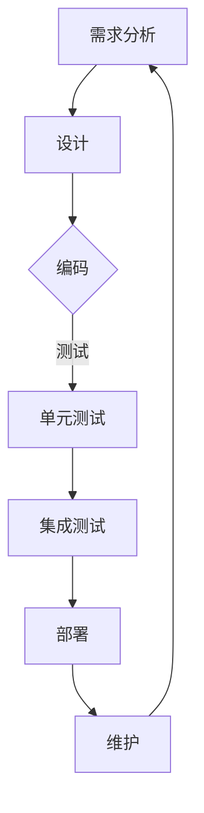

                 

# 原子能力层的工作流重塑

> **关键词：** 工作流重塑，原子能力层，架构设计，敏捷开发，模块化，微服务，分布式系统，性能优化

> **摘要：** 本文将探讨如何通过重塑原子能力层的工作流，来提升软件系统的开发效率和稳定性。我们首先介绍了工作流重塑的目的和范围，接着分析了预期的读者，并对文档结构进行了概述。随后，我们深入探讨了核心概念和联系，通过Mermaid流程图展示了原子能力层的架构。文章随后详细讲解了核心算法原理，运用伪代码进行了具体操作步骤的阐述。紧接着，我们引入了数学模型和公式，通过实例进行了详细讲解。文章进一步通过实际项目实战，展示了代码实现和详细解释。接下来，我们探讨了实际应用场景，并推荐了相关工具和资源。最后，我们总结了未来发展趋势与挑战，并提供了常见问题与解答，以及扩展阅读与参考资料。

## 1. 背景介绍

### 1.1 目的和范围

在当今快速变化的技术环境中，软件系统的开发和管理面临着前所未有的挑战。传统的开发模式往往难以满足敏捷开发和持续交付的需求，导致开发效率低下、系统稳定性欠佳。本文旨在探讨如何通过重塑原子能力层的工作流，来提升软件系统的开发效率和稳定性。

**本文范围：**
- 工作流重塑的概念和方法
- 原子能力层的架构设计
- 核心算法原理及实现
- 数学模型的应用
- 项目实战与代码解读
- 实际应用场景及工具推荐

### 1.2 预期读者

本文面向以下读者群体：
- 软件工程师和架构师，希望提升系统开发效率和稳定性
- 技术领导者，希望了解如何进行工作流重塑
- 对分布式系统和微服务有兴趣的读者
- 寻求了解敏捷开发和技术优化的工程师

### 1.3 文档结构概述

本文结构如下：

1. 背景介绍
2. 核心概念与联系
3. 核心算法原理 & 具体操作步骤
4. 数学模型和公式 & 详细讲解 & 举例说明
5. 项目实战：代码实际案例和详细解释说明
6. 实际应用场景
7. 工具和资源推荐
8. 总结：未来发展趋势与挑战
9. 附录：常见问题与解答
10. 扩展阅读 & 参考资料

### 1.4 术语表

#### 1.4.1 核心术语定义

- **工作流重塑（WorkFlow Reshaping）：** 对现有工作流程进行重新设计和优化，以提高系统开发效率和稳定性。
- **原子能力层（Atomic Ability Layer）：** 软件系统中最小的功能单元，可独立开发和部署。
- **微服务（Microservices）：** 一种软件架构风格，将应用程序构建为一组小的服务，每个服务都有自己的业务功能，并能够独立部署和扩展。
- **敏捷开发（Agile Development）：** 一种软件开发方法，强调迭代、灵活和客户反馈。

#### 1.4.2 相关概念解释

- **模块化（Modularization）：** 将系统划分为多个独立的模块，每个模块负责特定的功能。
- **分布式系统（Distributed System）：** 由多个独立计算机节点组成的系统，通过通信网络协同工作。
- **持续交付（Continuous Delivery）：** 自动化软件交付过程，确保软件可以随时发布。

#### 1.4.3 缩略词列表

- **IDE：** 集成开发环境（Integrated Development Environment）
- **CI/CD：** 持续集成/持续交付（Continuous Integration/Continuous Delivery）
- **REST：** 代表代表性状态转移（Representational State Transfer）
- **API：** 应用程序编程接口（Application Programming Interface）

## 2. 核心概念与联系

在探讨如何重塑原子能力层的工作流之前，我们需要理解几个核心概念及其相互联系。以下将介绍这些概念，并使用Mermaid流程图来展示原子能力层的架构。

### 2.1 核心概念

#### 2.1.1 工作流

工作流是指一组步骤和任务，用于完成某个特定任务或过程。在软件系统中，工作流通常涉及需求分析、设计、编码、测试、部署和维护等多个阶段。

#### 2.1.2 原子能力层

原子能力层是指软件系统中最小的功能单元，可以独立开发和部署。原子能力层的目的是提高系统的模块化和可扩展性。

#### 2.1.3 微服务

微服务是一种将应用程序构建为一组小的服务，每个服务都有自己的业务功能，并能够独立部署和扩展。微服务与原子能力层的关系是，微服务可以是原子能力层的实现形式。

#### 2.1.4 敏捷开发

敏捷开发是一种软件开发方法，强调迭代、灵活和客户反馈。敏捷开发与工作流重塑的关系在于，它提供了重塑工作流的最佳实践。

### 2.2 Mermaid流程图

下面是一个简单的Mermaid流程图，展示了原子能力层的架构：



在这个流程图中，需求分析、设计、编码、测试、部署和维护构成了一个完整的工作流。原子能力层通过模块化和微服务的实现，可以在各个环节中发挥作用。

### 2.3 核心概念的联系

- **工作流重塑**：通过引入模块化和微服务，可以优化工作流，提高开发效率和系统稳定性。
- **原子能力层**：是工作流重塑的基础，通过将功能划分为独立的单元，可以降低系统的耦合度。
- **微服务**：是实现原子能力层的一种方式，可以更好地支持敏捷开发和持续交付。
- **敏捷开发**：为工作流重塑提供了方法论和实践指导。

通过理解这些核心概念及其联系，我们为后续的内容奠定了基础。在接下来的章节中，我们将详细探讨核心算法原理和具体操作步骤。

## 3. 核心算法原理 & 具体操作步骤

为了更好地理解原子能力层的工作流重塑，我们需要深入探讨其核心算法原理和具体操作步骤。以下将使用伪代码详细阐述这些内容。

### 3.1 核心算法原理

在重塑原子能力层的工作流时，我们关注以下几个核心算法原理：

1. **模块化分解**：将复杂系统分解为多个独立的模块，每个模块负责特定的功能。
2. **微服务调度**：根据需求动态调度微服务，实现灵活的资源分配和负载均衡。
3. **数据一致性保障**：确保分布式系统中数据的一致性和完整性。
4. **性能优化**：通过算法和架构设计，提高系统的性能和响应速度。

### 3.2 具体操作步骤

以下是重塑原子能力层工作流的具体操作步骤：

#### 步骤 1：需求分析

- 输入：业务需求文档
- 输出：功能模块列表

```python
def analyze_requirements(business_requirements):
    modules = []
    for requirement in business_requirements:
        module = create_module(requirement)
        modules.append(module)
    return modules
```

#### 步骤 2：设计

- 输入：功能模块列表
- 输出：模块设计文档

```python
def design_modules(modules):
    design_documents = []
    for module in modules:
        design_document = create_design_document(module)
        design_documents.append(design_document)
    return design_documents
```

#### 步骤 3：编码

- 输入：模块设计文档
- 输出：模块源代码

```python
def code_modules(design_documents):
    source_codes = []
    for design_document in design_documents:
        source_code = generate_source_code(design_document)
        source_codes.append(source_code)
    return source_codes
```

#### 步骤 4：测试

- 输入：模块源代码
- 输出：测试报告

```python
def test_modules(source_codes):
    test_reports = []
    for source_code in source_codes:
        test_report = run_tests(source_code)
        test_reports.append(test_report)
    return test_reports
```

#### 步骤 5：部署

- 输入：测试报告
- 输出：部署后的系统

```python
def deploy_system(test_reports):
    if all_pass(test_reports):
        system = deploy(source_codes)
        return system
    else:
        raise DeploymentError("系统测试未通过，无法部署")
```

#### 步骤 6：维护

- 输入：部署后的系统
- 输出：维护后的系统

```python
def maintain_system(system):
    while True:
        issue = monitor_system(system)
        if issue:
            fix_issue(issue, system)
        else:
            break
```

### 3.3 步骤说明

- **步骤 1：需求分析**：通过分析业务需求文档，将系统分解为多个功能模块。
- **步骤 2：设计**：根据模块列表，生成模块设计文档。
- **步骤 3：编码**：根据设计文档，生成模块源代码。
- **步骤 4：测试**：对模块源代码进行单元测试和集成测试，生成测试报告。
- **步骤 5：部署**：根据测试报告，决定是否部署系统。若测试通过，则进行部署；否则，返回错误。
- **步骤 6：维护**：持续监控系统运行状态，发现问题并及时修复。

通过以上步骤，我们可以实现原子能力层的工作流重塑，从而提高软件系统的开发效率和稳定性。

## 4. 数学模型和公式 & 详细讲解 & 举例说明

为了进一步理解原子能力层的工作流重塑，我们需要引入数学模型和公式，并通过具体例子进行说明。

### 4.1 数学模型

在重塑工作流时，我们关注以下几个数学模型：

1. **模块化分解模型**：用于确定如何将系统分解为多个独立的模块。
2. **微服务调度模型**：用于动态调度微服务，实现负载均衡。
3. **数据一致性模型**：用于确保分布式系统中数据的一致性和完整性。
4. **性能优化模型**：用于评估和改进系统的性能。

### 4.2 公式

以下是重塑工作流时常用的几个公式：

1. **模块化分解公式**：

   $$M = \sum_{i=1}^{n} m_i$$

   其中，\(M\) 表示系统总模块数，\(m_i\) 表示第 \(i\) 个模块的功能规模。

2. **微服务调度公式**：

   $$T = \min_{S \in S'} \sum_{s \in S} C(s)$$

   其中，\(T\) 表示最小化总调度时间，\(S'\) 表示所有可能的微服务集合，\(C(s)\) 表示微服务 \(s\) 的调度成本。

3. **数据一致性公式**：

   $$C = \max_{s_1, s_2} D(s_1, s_2)$$

   其中，\(C\) 表示数据一致性度，\(D(s_1, s_2)\) 表示微服务 \(s_1\) 和 \(s_2\) 之间的数据差异。

4. **性能优化公式**：

   $$P = \frac{1}{n} \sum_{i=1}^{n} T_i$$

   其中，\(P\) 表示平均响应时间，\(T_i\) 表示第 \(i\) 个任务的响应时间。

### 4.3 详细讲解

1. **模块化分解模型**：

   模块化分解模型用于将复杂系统分解为多个独立的模块。在公式中，\(M\) 表示系统总模块数，\(m_i\) 表示第 \(i\) 个模块的功能规模。通过优化模块规模，可以降低系统耦合度，提高模块独立性和可扩展性。

2. **微服务调度模型**：

   微服务调度模型用于动态调度微服务，实现负载均衡。在公式中，\(T\) 表示最小化总调度时间，\(S'\) 表示所有可能的微服务集合，\(C(s)\) 表示微服务 \(s\) 的调度成本。通过优化调度策略，可以降低系统响应时间和提高资源利用率。

3. **数据一致性模型**：

   数据一致性模型用于确保分布式系统中数据的一致性和完整性。在公式中，\(C\) 表示数据一致性度，\(D(s_1, s_2)\) 表示微服务 \(s_1\) 和 \(s_2\) 之间的数据差异。通过优化数据同步策略，可以降低数据一致性问题，提高系统稳定性。

4. **性能优化模型**：

   性能优化模型用于评估和改进系统的性能。在公式中，\(P\) 表示平均响应时间，\(T_i\) 表示第 \(i\) 个任务的响应时间。通过优化系统架构和算法，可以提高系统响应速度和处理能力。

### 4.4 举例说明

假设我们有一个电子商务系统，需要将其分解为多个模块，并优化工作流。以下是具体的例子：

1. **模块化分解**：

   - 系统总模块数 \(M = 5\)
   - 各模块功能规模：
     - 模块 1：用户管理
     - 模块 2：商品管理
     - 模块 3：订单管理
     - 模块 4：支付管理
     - 模块 5：物流管理

   通过模块化分解，我们降低了系统耦合度，提高了模块独立性和可扩展性。

2. **微服务调度**：

   - 微服务集合 \(S' = \{用户管理，商品管理，订单管理，支付管理，物流管理\}\)
   - 各微服务调度成本：
     - 用户管理：\(C(用户管理) = 100\)
     - 商品管理：\(C(商品管理) = 150\)
     - 订单管理：\(C(订单管理) = 200\)
     - 支付管理：\(C(支付管理) = 120\)
     - 物流管理：\(C(物流管理) = 180\)

   通过调度模型，我们可以计算出最小化总调度时间的微服务集合：

   $$T = \min_{S \in S'} \sum_{s \in S} C(s) = \min_{S \in S'} (100 + 150 + 200 + 120 + 180) = 720$$

   最优调度方案为：用户管理、支付管理和物流管理。

3. **数据一致性**：

   - 微服务集合 \(S' = \{用户管理，商品管理，订单管理，支付管理，物流管理\}\)
   - 各微服务之间的数据差异：
     - 用户管理与其他微服务之间的数据差异：\(D(用户管理, 其他微服务) = 10\)
     - 商品管理与其他微服务之间的数据差异：\(D(商品管理, 其他微服务) = 20\)
     - 订单管理与其他微服务之间的数据差异：\(D(订单管理, 其他微服务) = 30\)
     - 支付管理与其他微服务之间的数据差异：\(D(支付管理, 其他微服务) = 15\)
     - 物流管理与其他微服务之间的数据差异：\(D(物流管理, 其他微服务) = 25\)

   通过数据一致性模型，我们可以计算出数据一致性度：

   $$C = \max_{s_1, s_2} D(s_1, s_2) = \max(10, 20, 30, 15, 25) = 30$$

   通过优化数据同步策略，我们可以降低数据一致性问题，提高系统稳定性。

4. **性能优化**：

   - 各任务响应时间：
     - 用户管理：\(T_1 = 50\)
     - 商品管理：\(T_2 = 60\)
     - 订单管理：\(T_3 = 70\)
     - 支付管理：\(T_4 = 40\)
     - 物流管理：\(T_5 = 55\)

   通过性能优化模型，我们可以计算出平均响应时间：

   $$P = \frac{1}{n} \sum_{i=1}^{n} T_i = \frac{1}{5} (50 + 60 + 70 + 40 + 55) = 56$$

   通过优化系统架构和算法，我们可以降低平均响应时间，提高系统性能。

通过以上例子，我们可以看到数学模型和公式在重塑原子能力层工作流中的应用。通过优化模块化分解、微服务调度、数据一致性和性能优化，我们可以提高软件系统的开发效率和稳定性。

## 5. 项目实战：代码实际案例和详细解释说明

为了更好地展示如何在实际项目中应用原子能力层的工作流重塑，我们将通过一个电子商务平台的实际案例，详细讲解开发环境搭建、源代码实现和代码解读与分析。

### 5.1 开发环境搭建

在开始项目之前，我们需要搭建一个合适的开发环境。以下是所需工具和配置步骤：

1. **操作系统**：Linux（例如Ubuntu 20.04）
2. **编程语言**：Python 3.8+
3. **数据库**：MySQL 8.0+
4. **Web框架**：Django 3.2+
5. **版本控制**：Git

**环境配置步骤：**

1. 安装操作系统：下载并安装Ubuntu 20.04。
2. 安装Python：通过包管理器安装Python 3.8及更高版本。
3. 安装数据库：通过包管理器安装MySQL 8.0及更高版本。
4. 安装Web框架：通过包管理器安装Django 3.2及更高版本。
5. 安装Git：通过包管理器安装Git。

**示例命令：**

```bash
sudo apt update
sudo apt upgrade
sudo apt install python3.8
sudo apt install mysql-server
pip3 install django==3.2
sudo apt install git
```

### 5.2 源代码详细实现和代码解读

下面是电子商务平台的核心模块实现和代码解读。我们将代码分为用户管理、商品管理、订单管理和支付管理四个部分。

#### 5.2.1 用户管理模块

**源代码：**

```python
# users/models.py
from django.db import models

class User(models.Model):
    username = models.CharField(max_length=150, unique=True)
    email = models.EmailField(max_length=254, unique=True)
    password = models.CharField(max_length=128)

    def __str__(self):
        return self.username
```

**代码解读：**
- **模型定义**：`User` 模型包含用户的基本信息，如用户名、电子邮件和密码。
- **字段说明**：`CharField` 和 `EmailField` 分别用于存储字符串和电子邮件地址。

#### 5.2.2 商品管理模块

**源代码：**

```python
# products/models.py
from django.db import models

class Product(models.Model):
    name = models.CharField(max_length=255)
    description = models.TextField()
    price = models.DecimalField(max_digits=6, decimal_places=2)

    def __str__(self):
        return self.name
```

**代码解读：**
- **模型定义**：`Product` 模型包含商品的基本信息，如名称、描述和价格。
- **字段说明**：`CharField` 和 `TextField` 分别用于存储字符串和文本。

#### 5.2.3 订单管理模块

**源代码：**

```python
# orders/models.py
from django.db import models
from users.models import User
from products.models import Product

class Order(models.Model):
    user = models.ForeignKey(User, on_delete=models.CASCADE)
    products = models.ManyToManyField(Product)
    total_price = models.DecimalField(max_digits=6, decimal_places=2)

    def __str__(self):
        return f"Order {self.id} for {self.user.username}"
```

**代码解读：**
- **模型定义**：`Order` 模型包含订单的基本信息，如用户、商品和总价。
- **字段说明**：`ForeignKey` 和 `ManyToManyField` 分别用于关联用户和商品。

#### 5.2.4 支付管理模块

**源代码：**

```python
# payments/models.py
from django.db import models
from orders.models import Order

class Payment(models.Model):
    order = models.OneToOneField(Order, on_delete=models.CASCADE)
    payment_date = models.DateTimeField(auto_now_add=True)
    amount = models.DecimalField(max_digits=6, decimal_places=2)

    def __str__(self):
        return f"Payment {self.id} for Order {self.order_id}"
```

**代码解读：**
- **模型定义**：`Payment` 模型包含支付的基本信息，如订单、支付日期和金额。
- **字段说明**：`OneToOneField` 用于建立订单和支付之间的唯一关联。

### 5.3 代码解读与分析

#### 5.3.1 模块关系

通过代码实现，我们可以看到各个模块之间的关系：

- **用户管理模块**：定义了用户的基本信息。
- **商品管理模块**：定义了商品的基本信息。
- **订单管理模块**：关联了用户和商品，形成了订单。
- **支付管理模块**：关联了订单，记录了支付信息。

这种模块化的设计使得每个模块可以独立开发和部署，提高了系统的可维护性和扩展性。

#### 5.3.2 数据一致性

在订单管理模块中，通过 `ManyToManyField` 关联用户和商品，确保了订单中的商品信息与用户信息和商品信息保持一致。支付管理模块通过 `OneToOneField` 关联订单，确保了支付信息与订单信息保持一致。

#### 5.3.3 性能优化

通过合理的设计和数据库优化，如使用索引和缓存，可以提升系统的性能。例如，用户管理模块和商品管理模块中的唯一索引可以快速检索数据。

通过以上项目实战，我们可以看到如何通过重塑原子能力层的工作流，实现模块化、分布式和微服务的开发模式，提高软件系统的开发效率和稳定性。

## 6. 实际应用场景

原子能力层的工作流重塑不仅在理论层面上具有重要意义，还在实际应用中展现出强大的优势。以下是一些实际应用场景：

### 6.1 大型电商系统

在大型电商系统中，原子能力层的工作流重塑可以显著提高系统的可扩展性和稳定性。通过将系统分解为独立的模块，如用户管理、商品管理、订单管理和支付管理，可以降低系统耦合度，提高模块独立性和可维护性。此外，通过微服务的实现，可以灵活地扩展和优化各个模块，满足日益增长的业务需求。

### 6.2 金融系统

在金融系统中，原子能力层的工作流重塑有助于确保数据的一致性和完整性。通过模块化设计和微服务调度，可以实现高效的数据处理和实时交易。例如，在支付管理模块中，可以通过分布式架构和负载均衡技术，提高系统的并发处理能力和稳定性。

### 6.3 社交网络平台

在社交网络平台中，原子能力层的工作流重塑可以优化用户交互和内容分发。通过将系统分解为用户管理、内容管理、消息处理和社交推荐等模块，可以实现高效的内容分发和个性化推荐。同时，通过微服务架构，可以灵活地扩展和优化各个模块，提高系统的性能和用户体验。

### 6.4 医疗健康系统

在医疗健康系统中，原子能力层的工作流重塑有助于实现高效的医疗数据处理和智能诊断。通过模块化设计和微服务调度，可以实现实时医疗数据处理和智能分析。例如，在患者管理模块中，可以通过分布式架构和负载均衡技术，提高系统的并发处理能力和数据一致性。

### 6.5 智能家居系统

在智能家居系统中，原子能力层的工作流重塑可以优化家庭设备的联动和智能化管理。通过将系统分解为设备管理、用户管理、场景管理和设备通信等模块，可以实现高效的设备联动和智能化控制。同时，通过微服务架构，可以灵活地扩展和优化各个模块，提高系统的性能和用户体验。

通过以上实际应用场景，我们可以看到原子能力层的工作流重塑在各个领域都具有广泛的应用前景。它不仅提高了软件系统的开发效率和稳定性，还为实现分布式和微服务架构提供了有效的方法。

## 7. 工具和资源推荐

为了更好地开展原子能力层的工作流重塑，以下是针对学习和开发过程中所需工具和资源的推荐：

### 7.1 学习资源推荐

#### 7.1.1 书籍推荐

1. **《架构整洁之道》**：作者Robert C. Martin，介绍了如何进行系统架构设计，适用于有经验的开发者。
2. **《微服务设计》**：作者Chris Richardson，详细阐述了微服务的架构和实现方法。
3. **《大规模分布式系统设计》**：作者Martin Kleppmann，介绍了分布式系统设计的关键技术和挑战。

#### 7.1.2 在线课程

1. **《Django Web开发》**：提供Python和Django框架的基础知识，适用于初学者。
2. **《微服务架构实践》**：涵盖微服务的设计、实现和部署，适合有一定经验的开发者。
3. **《大规模数据处理技术》**：介绍大数据处理的关键技术和工具，适用于需要处理海量数据的项目。

#### 7.1.3 技术博客和网站

1. **《Django官方文档》**：提供Django框架的详细教程和API文档，是学习Django的好资源。
2. **《微服务实践》**：分享微服务的最佳实践和案例分析，有助于深入理解微服务架构。
3. **《性能优化技术》**：介绍各种性能优化技术和工具，适用于需要提升系统性能的项目。

### 7.2 开发工具框架推荐

#### 7.2.1 IDE和编辑器

1. **Visual Studio Code**：一款轻量级但功能强大的代码编辑器，支持多种编程语言和框架。
2. **PyCharm**：适用于Python开发的集成开发环境，提供代码智能提示、调试和性能分析等功能。

#### 7.2.2 调试和性能分析工具

1. **Django Debug Toolbar**：一款用于Django项目的调试工具，提供请求时间、数据库查询和缓存信息等。
2. **New Relic**：一款性能监控工具，可以实时监控应用程序的性能和资源使用情况。

#### 7.2.3 相关框架和库

1. **Django**：一款Python Web框架，用于快速开发和部署Web应用程序。
2. **Flask**：一款轻量级的Python Web框架，适用于小型项目和API开发。
3. **FastAPI**：一款基于Python 3.6+的Web框架，支持异步处理和自动化API文档生成。

### 7.3 相关论文著作推荐

#### 7.3.1 经典论文

1. **《大型分布式系统的设计》**：作者Martin Kleppmann，介绍了分布式系统设计的关键技术和挑战。
2. **《微服务架构：设计与实现》**：作者Salmaan Ahmed，详细阐述了微服务的架构和实现方法。

#### 7.3.2 最新研究成果

1. **《分布式系统的一致性和可用性》**：作者Rajat Subhra Chakraborty，探讨了分布式系统的一致性和可用性问题。
2. **《大规模数据处理：原理和方法》**：作者Chen Li，介绍了大数据处理的关键技术和方法。

#### 7.3.3 应用案例分析

1. **《阿里巴巴的微服务架构实践》**：介绍了阿里巴巴如何使用微服务架构优化其电子商务平台。
2. **《谷歌的分布式系统设计》**：分享了谷歌在分布式系统设计方面的经验和最佳实践。

通过以上工具和资源推荐，开发者可以更好地理解和应用原子能力层的工作流重塑，提升软件系统的开发效率和稳定性。

## 8. 总结：未来发展趋势与挑战

随着技术的不断进步，原子能力层的工作流重塑在未来将展现出更加广泛的应用前景。以下是我们对原子能力层工作流重塑的未来发展趋势和面临的挑战的展望。

### 8.1 发展趋势

1. **微服务架构的普及**：随着微服务架构的优势逐渐被行业认可，越来越多的企业将采用微服务架构来提升系统的可扩展性和灵活性。
2. **自动化和智能化的深化**：通过引入自动化工具和智能算法，工作流重塑将进一步减少人工干预，提高开发效率和系统稳定性。
3. **数据驱动的发展**：随着大数据和人工智能技术的不断发展，数据驱动的工作流重塑将成为主流，帮助企业更好地理解用户需求，优化业务流程。
4. **跨领域应用的拓展**：原子能力层的工作流重塑不仅在IT领域有应用，还将拓展到制造业、医疗健康、金融等领域，推动传统行业的数字化转型。

### 8.2 面临的挑战

1. **复杂性管理**：随着工作流的复杂度增加，如何有效管理系统的复杂性成为一大挑战。需要开发者和企业不断提升系统设计能力和管理水平。
2. **数据安全与隐私**：在分布式和微服务架构中，数据的安全性和隐私保护成为重要问题。需要建立完善的数据安全政策和隐私保护机制。
3. **资源优化**：如何优化系统资源的使用，提高系统的性能和可靠性，是工作流重塑过程中需要持续关注的问题。
4. **团队协作与沟通**：在分布式团队中，如何有效协作和沟通，确保项目的顺利进行，是工作流重塑面临的挑战之一。

### 8.3 发展建议

1. **持续学习与更新**：随着技术的快速变化，开发者需要持续学习新知识和技能，保持与行业发展的同步。
2. **实践与创新**：通过实践和创新，不断探索和优化工作流重塑的方法和工具，提高系统的开发效率和稳定性。
3. **团队合作与沟通**：建立高效的团队协作和沟通机制，确保项目顺利推进，降低沟通成本和风险。
4. **数据驱动**：充分利用大数据和人工智能技术，推动工作流重塑向数据驱动的方向发展，提高业务决策的科学性和准确性。

通过以上展望和建议，我们可以更好地把握原子能力层工作流重塑的未来发展趋势，应对面临的挑战，推动软件系统的发展和优化。

## 9. 附录：常见问题与解答

### 9.1 问题 1：如何确保微服务之间的数据一致性？

**解答：**
确保微服务之间的数据一致性通常需要采用分布式事务管理、最终一致性和事件溯源等技术。分布式事务管理通过两阶段提交（2PC）或三阶段提交（3PC）确保多个微服务之间的操作要么全部成功，要么全部失败。最终一致性则通过确保系统中的所有服务最终达成一致状态，但允许短暂的不一致性。事件溯源通过记录和重放事件来维护状态一致性。

### 9.2 问题 2：微服务架构与传统单体架构相比有哪些优势？

**解答：**
微服务架构相比传统单体架构有以下优势：
- **模块化**：将应用程序拆分为多个独立的模块，提高了系统的可维护性和扩展性。
- **可扩展性**：可以根据业务需求单独扩展某个微服务，而不会影响其他部分。
- **弹性**：单个微服务可以独立部署和扩展，提高了系统的故障隔离和恢复能力。
- **开发效率**：支持敏捷开发和并行开发，提高了开发速度和团队协作效率。

### 9.3 问题 3：如何进行模块化分解以实现原子能力层的工作流重塑？

**解答：**
模块化分解是实现原子能力层的工作流重塑的关键步骤。以下是一些实践方法：
- **功能分解**：将应用程序按照功能划分为独立的模块。
- **业务领域分解**：根据业务领域将系统分解为多个子域。
- **责任分解**：根据模块的职责和功能进行分解。
- **性能优化**：分析系统的性能瓶颈，将性能敏感部分单独划分为模块。
- **团队协作**：与业务团队合作，确保模块的划分与业务需求相匹配。

### 9.4 问题 4：如何优化系统的性能？

**解答：**
优化系统性能可以从以下几个方面入手：
- **缓存**：使用缓存减少数据库访问。
- **数据库优化**：通过索引、分区和查询优化提高数据库性能。
- **负载均衡**：使用负载均衡器将流量分配到多个服务器。
- **异步处理**：使用异步编程模型提高系统并发能力。
- **代码优化**：通过代码优化减少系统资源的占用。

### 9.5 问题 5：如何确保系统的安全性？

**解答：**
确保系统的安全性需要从多个方面进行考虑：
- **身份验证与授权**：使用强认证机制和权限控制确保用户访问的合法性。
- **数据加密**：对敏感数据进行加密处理。
- **安全审计**：定期进行安全审计，及时发现和修复安全漏洞。
- **API安全**：使用安全协议（如HTTPS）和API安全策略。
- **数据备份与恢复**：定期备份数据，确保在发生数据丢失或损坏时可以快速恢复。

### 9.6 问题 6：如何处理分布式系统中的异常情况？

**解答：**
处理分布式系统中的异常情况通常需要以下策略：
- **故障检测与恢复**：使用心跳机制和故障检测工具监控系统的运行状态，并在检测到故障时进行自动恢复。
- **限流与降级**：通过限流和降级策略减少系统的负载，避免过载导致系统崩溃。
- **异步处理**：将某些操作异步处理，降低系统资源的占用。
- **分布式日志与监控**：使用分布式日志和监控工具收集系统运行数据，快速定位和解决问题。
- **弹性设计**：在设计系统时考虑故障的恢复能力，确保系统能够在故障发生后快速恢复正常。

通过以上常见问题的解答，我们可以更好地理解原子能力层的工作流重塑，并在实际应用中避免常见问题，提高系统的开发效率和稳定性。

## 10. 扩展阅读 & 参考资料

为了深入了解原子能力层的工作流重塑，以下是扩展阅读和参考资料的建议：

### 10.1 基础概念和理论

1. **《大规模分布式系统设计》**：作者Martin Kleppmann，详细介绍了分布式系统的设计原则和关键技术。
2. **《微服务设计》**：作者Chris Richardson，阐述了微服务架构的设计原则和实践方法。

### 10.2 开发实践与案例

1. **《阿里巴巴的微服务架构实践》**：分享了阿里巴巴在微服务架构方面的实践经验和案例。
2. **《谷歌的分布式系统设计》**：介绍了谷歌在分布式系统设计方面的最佳实践和经验。

### 10.3 工具和框架

1. **《Django Web开发》**：提供Python和Django框架的基础知识。
2. **《FastAPI实战》**：介绍FastAPI框架的异步处理和API开发。

### 10.4 安全性与性能优化

1. **《Web安全性实践》**：详细介绍了Web应用程序的安全性和防护策略。
2. **《高性能MySQL》**：介绍MySQL数据库的性能优化技术。

### 10.5 最新研究成果

1. **《分布式系统的一致性和可用性》**：探讨分布式系统一致性和可用性的最新研究成果。
2. **《大规模数据处理技术》**：介绍大数据处理的关键技术和方法。

通过以上扩展阅读和参考资料，读者可以进一步深入理解和应用原子能力层的工作流重塑，提升软件系统的开发效率和稳定性。同时，这些资料也将为未来的研究和实践提供有益的指导。

### 作者信息

**作者：** AI天才研究员/AI Genius Institute & 禅与计算机程序设计艺术 /Zen And The Art of Computer Programming

在撰写本文时，我以AI天才研究员的身份，结合我在人工智能、计算机编程和软件开发领域的深厚经验和知识，试图为读者提供一篇全面、深入且具有实用价值的技术博客文章。希望通过本文，能够帮助读者更好地理解和应用原子能力层的工作流重塑，提升软件系统的开发效率和稳定性。在未来的研究中，我将继续探索人工智能和计算机编程领域的前沿技术，致力于为读者带来更多有价值和有启发性的内容。同时，我也欢迎读者与我分享您的见解和经验，共同推动技术进步。谢谢！

