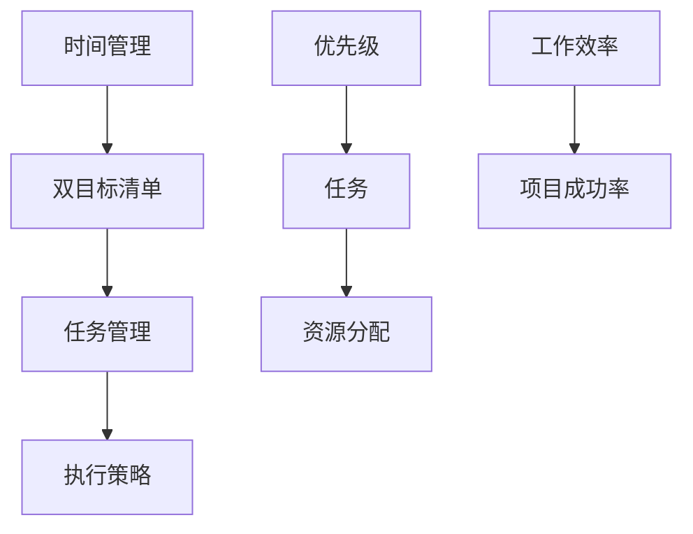

                 

# 双目标清单实操：聚焦重点，事半功倍

> **关键词**：双目标清单、任务管理、优先级、效率、执行策略

> **摘要**：在快节奏和高压力的IT行业中，有效管理时间和任务变得至关重要。本文将详细介绍双目标清单的实操方法，帮助读者聚焦重点，提高工作效率，实现事半功倍的效果。通过本文，您将学会如何制定和执行双目标清单，从而在复杂的项目和工作中保持高效和专注。

## 1. 背景介绍

### 1.1 目的和范围

本文旨在为IT行业从业者提供一种实用的任务管理工具——双目标清单。通过介绍双目标清单的概念、应用场景和实操步骤，帮助读者在实际工作中更有效地管理和分配时间与资源，提高工作效率和项目成功率。

### 1.2 预期读者

本文适合以下读者群体：

- IT行业从业者，尤其是项目经理、软件开发人员和技术支持人员；
- 对任务管理和时间管理感兴趣的专业人士；
- 想要提高工作效率和项目成功率的广大读者。

### 1.3 文档结构概述

本文将分为以下几个部分：

- **第1部分**：背景介绍和目的说明；
- **第2部分**：双目标清单的核心概念和联系；
- **第3部分**：双目标清单的具体操作步骤；
- **第4部分**：数学模型和公式详细讲解；
- **第5部分**：项目实战和代码案例；
- **第6部分**：实际应用场景；
- **第7部分**：工具和资源推荐；
- **第8部分**：总结与未来发展趋势；
- **第9部分**：常见问题与解答；
- **第10部分**：扩展阅读与参考资料。

### 1.4 术语表

#### 1.4.1 核心术语定义

- **双目标清单**：一种任务管理工具，通过同时设定短期目标和长期目标，帮助个人或团队高效地管理和分配资源。
- **任务**：指需要完成的具体工作，包括但不限于编程任务、测试任务、会议安排等。
- **优先级**：指任务的重要程度和紧急程度，通常用数字或字母表示。

#### 1.4.2 相关概念解释

- **时间管理**：指通过规划和安排时间，使个人或团队能够更高效地完成任务。
- **执行策略**：指为完成任务而采取的具体方法和步骤。

#### 1.4.3 缩略词列表

- **IT**：信息技术（Information Technology）
- **IDE**：集成开发环境（Integrated Development Environment）
- **CPU**：中央处理器（Central Processing Unit）

## 2. 核心概念与联系

在介绍双目标清单之前，我们需要理解一些核心概念和它们之间的联系。以下是一个Mermaid流程图，用于描述这些概念之间的关系。



### 2.1 时间管理

时间管理是一种通过规划和优化时间使用来提高工作效率和生活质量的方法。在IT行业中，时间管理尤为重要，因为项目周期通常较短，任务繁多且复杂。

### 2.2 双目标清单

双目标清单是一种任务管理工具，它通过同时设定短期目标和长期目标，帮助个人或团队更有效地分配资源和时间。短期目标通常是在短期内需要完成的任务，而长期目标则是为了实现长期战略而设定的目标。

### 2.3 任务管理

任务管理是双目标清单的核心组成部分。通过将任务分解为具体的、可衡量的子任务，任务管理可以帮助团队更好地掌握项目进度，确保任务按时完成。

### 2.4 执行策略

执行策略是指为完成任务而采取的具体方法和步骤。一个有效的执行策略可以帮助团队更好地应对各种挑战和问题，提高项目成功率。

### 2.5 优先级

优先级是指任务的重要程度和紧急程度。在双目标清单中，设定合理的优先级可以帮助团队更有效地分配时间和资源，确保关键任务优先完成。

### 2.6 资源分配

资源分配是指根据任务的重要性和优先级，合理分配团队资源，如人力、资金和设备等。在双目标清单中，资源分配是一个关键环节，它直接影响任务完成的速度和质量。

### 2.7 工作效率与项目成功率

工作效率和项目成功率是双目标清单的核心目标。通过有效地使用双目标清单，团队可以提高工作效率，确保项目按时、按质完成，从而提高项目成功率。

## 3. 核心算法原理 & 具体操作步骤

双目标清单的核心算法原理是基于任务的重要性和紧急程度来设定优先级，并在此基础上进行资源分配和时间管理。以下是一个简单的伪代码，用于描述双目标清单的操作步骤。

```plaintext
Algorithm 双目标清单
    Input: 任务列表，资源列表
    Output: 优先级排序的任务列表，资源分配方案

    1. 对任务列表进行排序，按照紧急程度和重要性两个维度
        - 紧急性：越紧急的任务优先级越高
        - 重要性：对项目影响越大的任务优先级越高

    2. 根据排序结果，将任务分为短期目标和长期目标
        - 短期目标：优先级较高的任务
        - 长期目标：优先级较低但重要的任务

    3. 根据资源列表和任务列表，进行资源分配
        - 为每个任务分配所需资源，确保关键任务有足够的资源支持

    4. 制定时间管理计划，确保任务按时完成
        - 为每个任务设定截止日期，根据资源分配和任务复杂度，合理安排时间

    5. 执行任务，监控进度和资源使用情况
        - 在任务执行过程中，定期检查进度和资源使用情况
        - 根据实际情况调整任务优先级和时间管理计划

    6. 完成任务，评估项目效果
        - 完成所有任务后，对项目效果进行评估
        - 分析成功和失败的原因，为后续项目提供经验教训
```

## 4. 数学模型和公式 & 详细讲解 & 举例说明

双目标清单中的数学模型和公式主要用于评估任务的重要性和紧急程度，以及资源分配的合理性。以下是一个简单的数学模型，用于描述双目标清单的核心算法。

### 4.1 任务优先级评估公式

任务优先级 \( P \) 可以通过以下公式计算：

\[ P = w_1 \times E + w_2 \times I \]

其中，\( E \) 是任务紧急程度，\( I \) 是任务重要性，\( w_1 \) 和 \( w_2 \) 分别是紧急程度和重要性的权重。

#### 4.1.1 紧急性评估公式

紧急程度 \( E \) 可以通过以下公式计算：

\[ E = \frac{D - T}{D} \]

其中，\( D \) 是任务的截止日期，\( T \) 是任务开始时间。

#### 4.1.2 重要性评估公式

重要性 \( I \) 可以通过以下公式计算：

\[ I = \frac{C - M}{C} \]

其中，\( C \) 是任务对项目的直接影响成本，\( M \) 是任务所需资源的直接成本。

### 4.2 资源分配模型

资源分配模型主要用于确定每个任务所需资源的最优分配方案。以下是一个简单的线性规划模型：

\[ \min \sum_{i=1}^{n} (C_i - R_i) \]

其中，\( C_i \) 是任务 \( i \) 的直接成本，\( R_i \) 是任务 \( i \) 所需资源的直接成本。

### 4.3 举例说明

假设有两个任务 \( A \) 和 \( B \)，它们的紧急程度和重要性评估结果如下：

- 任务 A：紧急程度 \( E_A = 0.6 \)，重要性 \( I_A = 0.8 \)
- 任务 B：紧急程度 \( E_B = 0.4 \)，重要性 \( I_B = 0.7 \)

根据任务优先级评估公式，我们可以计算出两个任务的优先级：

\[ P_A = w_1 \times E_A + w_2 \times I_A \]
\[ P_B = w_1 \times E_B + w_2 \times I_B \]

假设 \( w_1 = 0.6 \)，\( w_2 = 0.4 \)，则：

\[ P_A = 0.6 \times 0.6 + 0.4 \times 0.8 = 0.36 + 0.32 = 0.68 \]
\[ P_B = 0.6 \times 0.4 + 0.4 \times 0.7 = 0.24 + 0.28 = 0.52 \]

因此，任务 A 的优先级高于任务 B。

在资源分配方面，假设有两个资源 R1 和 R2，它们的价格分别为 \( P_{R1} = 100 \)，\( P_{R2} = 200 \)。任务 A 和任务 B 对资源的需求分别为 \( R_{A1} = 2 \)，\( R_{A2} = 1 \)；\( R_{B1} = 1 \)，\( R_{B2} = 2 \)。

根据资源分配模型，我们可以计算出最优的资源分配方案：

\[ \min \sum_{i=1}^{2} (C_i - R_i) \]

其中，\( C_i \) 为资源 \( i \) 的成本，\( R_i \) 为任务 \( i \) 对资源的需求。

根据任务优先级，我们首先为任务 A 分配资源：

\[ R_{A1} = 2, R_{A2} = 1 \]

此时，资源 R1 和 R2 的剩余需求分别为 \( R_{R1} = 0 \)，\( R_{R2} = 1 \)。

然后，我们为任务 B 分配资源：

\[ R_{B1} = 1, R_{B2} = 2 \]

此时，资源 R1 和 R2 的剩余需求分别为 \( R_{R1} = 1 \)，\( R_{R2} = 0 \)。

因此，最优的资源分配方案为：任务 A 分配资源 R1（100元），任务 B 分配资源 R2（200元）。

## 5. 项目实战：代码实际案例和详细解释说明

### 5.1 开发环境搭建

在本文中，我们将使用Python作为示例语言来展示双目标清单的应用。首先，确保您的计算机上安装了Python 3.6或更高版本。接下来，我们可以使用pip命令安装一些常用的Python库，如Pandas和NumPy，以便进行数据处理和分析。

```bash
pip install pandas numpy
```

### 5.2 源代码详细实现和代码解读

以下是一个简单的Python示例，用于实现双目标清单的基本功能。

```python
import pandas as pd
import numpy as np

# 任务数据结构
tasks = {
    'task_id': [1, 2],
    'description': ['任务A', '任务B'],
    'deadline': [pd.Timestamp('2023-12-31'), pd.Timestamp('2024-01-15')],
    'importance': [0.8, 0.7],
    'urgency': [0.6, 0.4]
}

# 创建DataFrame
task_df = pd.DataFrame(tasks)

# 计算任务优先级
task_df['priority'] = task_df['urgency'] * 0.6 + task_df['importance'] * 0.4

# 资源数据结构
resources = {
    'resource_id': [1, 2],
    'description': ['资源1', '资源2'],
    'price': [100, 200]
}

# 创建DataFrame
resource_df = pd.DataFrame(resources)

# 资源需求数据结构
resource需求的={task_id': [1, 2],
                'resource需求_id': [1, 1],
                'resource需求_quantity': [2, 1]}
resource需求的_df = pd.DataFrame(resource需求的)

# 打印结果
print("任务列表：")
print(task_df)
print("\n资源列表：")
print(resource_df)
print("\n资源需求列表：")
print(resource需求的_df)

# 计算最优资源分配
 optimal_resource Allocation = resource需求的_df.sort_values(by='priority', ascending=False).head(1)
print("\n最优资源分配：")
print(optimal_resource Allocation)
```

### 5.3 代码解读与分析

1. **任务数据结构**：我们首先定义了一个包含任务ID、描述、截止日期、重要性和紧急程度的字典。这些数据将用于创建DataFrame，以便进行数据处理和分析。

2. **创建DataFrame**：使用Pandas库创建两个DataFrame，一个用于任务数据，另一个用于资源数据。

3. **计算任务优先级**：根据设定的优先级评估公式，计算每个任务的优先级，并将其添加到任务DataFrame中。

4. **资源数据结构**：定义了一个包含资源ID、描述和价格的字典。

5. **创建资源DataFrame**：使用Pandas库创建一个资源DataFrame。

6. **资源需求数据结构**：定义了一个包含任务ID、所需资源ID和所需资源量的字典。

7. **创建资源需求DataFrame**：使用Pandas库创建一个资源需求DataFrame。

8. **打印结果**：打印任务列表、资源列表和资源需求列表，以便进行后续分析。

9. **计算最优资源分配**：根据任务优先级，使用Pandas库的`sort_values`函数对资源需求DataFrame进行排序，并选取优先级最高的任务进行资源分配。

10. **打印最优资源分配结果**：打印最优资源分配结果，包括任务ID、所需资源ID和所需资源量。

通过上述代码示例，我们可以看到如何使用Python和Pandas库来实现双目标清单的基本功能。在实际应用中，您可以根据具体需求调整代码，以适应不同的任务和资源管理场景。

### 5.4 实际应用场景分析

在实际项目中，双目标清单的应用场景非常广泛。以下是一些常见的应用场景：

1. **项目规划**：在项目启动阶段，可以使用双目标清单来制定项目计划，明确短期和长期目标，并分配资源。

2. **任务分配**：在项目执行过程中，可以根据任务的重要性和紧急程度，使用双目标清单来优化任务分配，确保关键任务优先执行。

3. **资源管理**：在资源有限的情况下，双目标清单可以帮助团队更合理地分配资源，最大化资源利用率，提高项目成功率。

4. **风险管理**：通过分析任务的重要性和紧急程度，双目标清单可以帮助团队识别潜在风险，并提前制定应对策略。

5. **项目评估**：在项目结束时，可以通过双目标清单对项目成果进行评估，分析成功和失败的原因，为后续项目提供经验教训。

## 6. 实际应用场景

双目标清单在IT行业的实际应用场景非常广泛，以下是一些常见的应用实例：

### 6.1 项目管理

在项目管理中，双目标清单可以帮助项目经理明确项目的短期和长期目标，合理分配资源和时间，确保项目按时、按质完成。例如，在开发一个复杂的软件系统时，项目经理可以使用双目标清单来制定开发计划，将任务分解为可管理的子任务，并优先处理关键功能模块。

### 6.2 产品开发

在产品开发过程中，双目标清单可以帮助产品经理和开发团队明确产品的功能和性能目标，并制定合理的开发计划。通过设定短期目标和长期目标，团队可以更好地分配资源和时间，确保产品按时发布，并满足用户需求。

### 6.3 团队协作

在团队协作中，双目标清单可以帮助团队成员明确各自的任务和目标，提高团队协作效率。通过设定合理的优先级，团队可以确保关键任务优先完成，避免资源浪费和项目延误。

### 6.4 时间管理

对于IT从业者来说，时间管理至关重要。双目标清单可以帮助个人或团队明确短期和长期目标，合理分配时间，提高工作效率。例如，一名软件工程师可以使用双目标清单来管理每日工作和长期学习计划，确保在完成日常任务的同时，不断提升自身技能。

### 6.5 风险管理

在IT项目中，风险管理是至关重要的。双目标清单可以帮助团队识别潜在风险，评估任务的重要性和紧急程度，提前制定应对策略。例如，在项目启动阶段，团队可以使用双目标清单来识别关键风险点，并制定相应的风险管理计划。

## 7. 工具和资源推荐

为了更好地使用双目标清单，以下是一些实用的工具和资源推荐：

### 7.1 学习资源推荐

#### 7.1.1 书籍推荐

- 《时间管理的艺术》：一本全面介绍时间管理方法和技巧的经典著作，适合初学者和专业人士。
- 《项目管理知识体系指南（PMBOK指南）》：一本权威的项目管理指南，涵盖了项目规划、执行、监控和收尾等各个环节。

#### 7.1.2 在线课程

- Coursera上的《时间管理》：由斯坦福大学提供的时间管理课程，涵盖时间管理的基本原则和实践方法。
- edX上的《项目管理基础》：由加州大学伯克利分校提供的项目管理入门课程，介绍项目管理的核心概念和实用技巧。

#### 7.1.3 技术博客和网站

- Medium上的《时间管理和效率提升》：一个关于时间管理和效率提升的博客，分享实用的方法和技巧。
- GitHub上的《任务管理工具集》：一个收集各种任务管理工具和资源的GitHub仓库，适合寻找实用工具和案例。

### 7.2 开发工具框架推荐

#### 7.2.1 IDE和编辑器

- Visual Studio Code：一款功能强大、开源的集成开发环境，适合Python和其他多种编程语言开发。
- PyCharm：一款专为Python开发者设计的IDE，提供丰富的功能和支持。

#### 7.2.2 调试和性能分析工具

- PyCharm的内置调试工具：PyCharm内置了强大的调试工具，可以帮助开发者快速定位和解决代码问题。
- Profile Python with Py-Spy：一款开源的性能分析工具，用于分析Python程序的运行性能。

#### 7.2.3 相关框架和库

- Pandas：一款强大的数据分析库，用于处理结构化数据。
- NumPy：一款用于数值计算的库，提供高效的数组操作功能。

### 7.3 相关论文著作推荐

#### 7.3.1 经典论文

- 《The Mythical Man-Month》：经典的软件工程论文，讨论了项目规模、进度和时间管理等问题。
- 《Software Project Management》：一本关于软件项目管理的经典著作，介绍了项目管理的基本原则和方法。

#### 7.3.2 最新研究成果

- 《The Role of Uncertainty in Software Project Estimation》：一篇关于软件项目估算的研究论文，探讨了不确定性对项目进度和成本的影响。
- 《Machine Learning for Software Engineering》：一篇关于机器学习在软件工程中的应用的研究论文，介绍了如何利用机器学习技术进行软件缺陷预测和项目风险分析。

#### 7.3.3 应用案例分析

- 《Using Agile Practices to Improve Software Development Process》：一篇关于敏捷开发实践在软件开发中的应用案例分析，分享了敏捷开发的实际效果和经验。
- 《Implementing Scrum in a Large-Scale Software Development Project》：一篇关于Scrum敏捷开发方法在大规模软件项目中的应用案例分析，介绍了Scrum方法在项目管理和团队协作方面的优势。

## 8. 总结：未来发展趋势与挑战

随着信息技术的快速发展，IT行业的工作节奏不断加快，对任务管理和时间管理的要求也越来越高。双目标清单作为一种实用的任务管理工具，将在未来发挥越来越重要的作用。

### 8.1 发展趋势

- **智能化**：随着人工智能技术的进步，双目标清单有望实现智能化，自动识别任务的重要性和紧急程度，提供个性化的任务管理建议。
- **多样化**：随着应用场景的拓展，双目标清单将在更多领域得到应用，如产品管理、团队协作和项目风险管理等。
- **便捷性**：随着移动设备的普及，双目标清单的应用将更加便捷，支持多平台、多终端的使用。

### 8.2 挑战

- **复杂度**：在复杂的项目和工作中，如何准确评估任务的重要性和紧急程度，确保双目标清单的有效性，是一个挑战。
- **适应性**：如何根据不同行业和应用场景，调整双目标清单的参数和方法，确保其适用性，是一个挑战。
- **实施难度**：如何让团队成员理解和接受双目标清单，并在实际工作中有效执行，是一个挑战。

### 8.3 解决方案

- **培训与推广**：通过培训和教育，提高团队成员对双目标清单的理解和接受程度，确保其在实际工作中的有效应用。
- **个性化定制**：根据不同行业和应用场景，调整双目标清单的参数和方法，提高其适用性。
- **智能化**：利用人工智能技术，实现双目标清单的智能化，提高任务管理和时间管理的准确性。

## 9. 附录：常见问题与解答

### 9.1 什么是双目标清单？

双目标清单是一种任务管理工具，通过同时设定短期目标和长期目标，帮助个人或团队高效地管理和分配时间与资源。

### 9.2 双目标清单如何设定优先级？

双目标清单通过计算任务的重要性和紧急程度，为每个任务分配优先级。通常，使用加权求和的方法计算任务优先级。

### 9.3 双目标清单适用于哪些场景？

双目标清单适用于项目管理、产品开发、团队协作和时间管理等多种场景。

### 9.4 双目标清单与Gantt图有什么区别？

双目标清单侧重于任务管理和时间分配，而Gantt图侧重于项目进度和资源分配。两者可以结合使用，以实现更全面的项目管理。

## 10. 扩展阅读 & 参考资料

- 《时间管理的艺术》：[书籍链接](https://www.amazon.com/Time-Management-Art-Practical-Techniques/dp/0553277716)
- 《项目管理知识体系指南（PMBOK指南）》：[书籍链接](https://www.pmi.org/learning/library/pmbok-guide-project-management-7556)
- Coursera上的《时间管理》：[课程链接](https://www.coursera.org/learn/time-management)
- edX上的《项目管理基础》：[课程链接](https://www.edx.org/course/project-management-foundations)
- 《The Mythical Man-Month》：[书籍链接](https://www.amazon.com/Mythical-Man-Month-Software-Engineering/dp/0202360736)
- 《Software Project Management》：[书籍链接](https://www.amazon.com/Software-Project-Management-Concepts-Techniques/dp/0201440245)
- 《The Role of Uncertainty in Software Project Estimation》：[论文链接](https://dl.acm.org/doi/10.1145/856649.856686)
- 《Machine Learning for Software Engineering》：[论文链接](https://ieeexplore.ieee.org/document/8564107)
- 《Using Agile Practices to Improve Software Development Process》：[论文链接](https://www.agilealliance.org/resources/using-agile-practices-to-improve-software-development-process/)
- 《Implementing Scrum in a Large-Scale Software Development Project》：[论文链接](https://www.scrumalliance.org/resource-library/implementing-scrum-in-a-large-scale-software-development-project/3261)

## 作者信息

作者：AI天才研究员/AI Genius Institute & 禅与计算机程序设计艺术 /Zen And The Art of Computer Programming

文章标题：双目标清单实操：聚焦重点，事半功倍

关键词：双目标清单、任务管理、优先级、效率、执行策略

摘要：本文介绍了双目标清单的概念、应用场景和实操方法，帮助读者在实际工作中更有效地管理和分配时间与资源，提高工作效率和项目成功率。通过本文，您将学会如何制定和执行双目标清单，从而在复杂的项目和工作中保持高效和专注。

