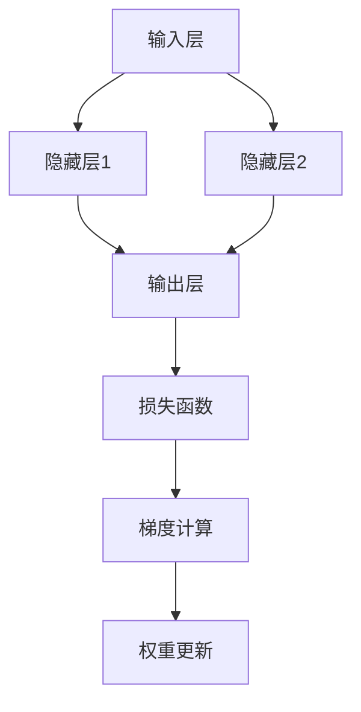

                 

# 反向传播(Backpropagation) - 原理与代码实例讲解

> 关键词：反向传播，神经网络，深度学习，梯度下降，计算图，权重更新，训练过程，Python实现

> 摘要：本文将深入探讨反向传播算法的核心原理，并配以详细的伪代码和Python代码实例，帮助读者理解并掌握反向传播的步骤和实现方法。文章还将涵盖反向传播在实际应用场景中的效果和优势。

## 1. 背景介绍

### 1.1 目的和范围

本文旨在为初学者和有一定神经网络基础的学习者提供反向传播算法的深入讲解。我们将通过理论和实践相结合的方式，帮助读者理解反向传播的工作原理、数学基础以及如何在实际项目中应用。文章将涵盖以下内容：

- 反向传播算法的基本原理和数学模型。
- 算法实现的伪代码和Python代码实例。
- 反向传播算法在神经网络训练过程中的作用。
- 实际应用场景和效果分析。

### 1.2 预期读者

- 对神经网络和深度学习有基本了解的读者。
- 想要深入理解反向传播算法的学习者。
- 准备从事机器学习和人工智能开发的工程师。

### 1.3 文档结构概述

本文将分为以下章节：

- **第1章**：背景介绍，包括目的和范围、预期读者、文档结构概述等。
- **第2章**：核心概念与联系，介绍神经网络的基础概念和反向传播算法的架构。
- **第3章**：核心算法原理与具体操作步骤，详细讲解反向传播算法的实现过程。
- **第4章**：数学模型和公式，讲解反向传播算法的数学基础和常用公式。
- **第5章**：项目实战，通过实际案例展示反向传播算法的实现过程。
- **第6章**：实际应用场景，分析反向传播在不同领域的应用。
- **第7章**：工具和资源推荐，介绍学习资源、开发工具和框架。
- **第8章**：总结，探讨反向传播的未来发展趋势和挑战。
- **第9章**：附录，提供常见问题与解答。
- **第10章**：扩展阅读与参考资料，推荐相关文献和资源。

### 1.4 术语表

#### 1.4.1 核心术语定义

- **神经网络**：由大量相互连接的神经元组成的计算模型。
- **反向传播**：一种训练神经网络的算法，用于计算网络权重和偏置的梯度。
- **梯度下降**：一种优化算法，用于最小化损失函数。
- **损失函数**：衡量模型预测值与真实值之间差异的函数。
- **激活函数**：用于引入非线性特性的函数。

#### 1.4.2 相关概念解释

- **神经元**：神经网络中的基本计算单元。
- **权重**：神经元之间的连接强度，通过训练调整以优化模型性能。
- **偏置**：增加神经元输出的常数项。
- **前向传播**：计算输入通过神经网络的过程。
- **反向传播**：计算网络权重和偏置的梯度，并用于更新权重。

#### 1.4.3 缩略词列表

- **NN**：神经网络（Neural Network）
- **DL**：深度学习（Deep Learning）
- **BP**：反向传播（Backpropagation）
- **SGD**：随机梯度下降（Stochastic Gradient Descent）

## 2. 核心概念与联系

神经网络是深度学习的基础，而反向传播是训练神经网络的算法核心。在本节中，我们将介绍神经网络的基本概念，并使用Mermaid流程图展示反向传播算法的架构。

### 2.1 神经网络基本概念

神经网络由大量相互连接的神经元组成，每个神经元接收来自其他神经元的输入，并产生输出。神经元的输出取决于输入值、权重和激活函数。

- **神经元**：神经网络的基本计算单元，包含权重、偏置和激活函数。
- **输入层**：接收外部输入数据的层。
- **隐藏层**：位于输入层和输出层之间的层，可以有一个或多个。
- **输出层**：生成预测结果的层。

### 2.2 反向传播算法架构

反向传播算法主要包括两个阶段：前向传播和反向传播。

- **前向传播**：计算输入通过神经网络的输出。
- **反向传播**：计算网络权重和偏置的梯度，并用于更新权重。

使用Mermaid流程图表示反向传播算法架构如下：



在上面的流程图中：

- `A1`、`B1`、`B2`、`C1`分别表示输入层、隐藏层1、隐藏层2和输出层。
- `D1`表示损失函数，用于计算模型预测值与真实值之间的差异。
- `E1`表示梯度计算，计算网络权重和偏置的梯度。
- `F1`表示权重更新，根据梯度更新网络权重和偏置。

## 3. 核心算法原理 & 具体操作步骤

反向传播算法是神经网络训练的核心，其基本原理是通过前向传播计算输出，然后反向传播计算梯度，并使用梯度下降优化算法更新网络权重和偏置。

### 3.1 前向传播

前向传播是计算输入通过神经网络的输出过程。给定输入 \( x \)，我们可以使用以下公式计算每个神经元的输出：

\[ z_{j} = \sum_{i} w_{ji} \cdot x_{i} + b_{j} \]

其中：

- \( z_{j} \) 是第 \( j \) 个神经元的输出。
- \( w_{ji} \) 是第 \( j \) 个神经元与第 \( i \) 个神经元之间的权重。
- \( x_{i} \) 是第 \( i \) 个神经元的输入。
- \( b_{j} \) 是第 \( j \) 个神经元的偏置。

然后，使用激活函数 \( \sigma(z_{j}) \) 将输出转换为非线性值：

\[ a_{j} = \sigma(z_{j}) \]

其中，激活函数 \( \sigma \) 可以是 sigmoid、ReLU 或 tanh 等函数。

### 3.2 梯度计算

在反向传播阶段，我们需要计算每个神经元的梯度。给定输出 \( y \) 和预测值 \( \hat{y} \)，损失函数 \( L \) 可以表示为：

\[ L = \frac{1}{2} \sum_{i} (y_{i} - \hat{y}_{i})^2 \]

损失函数的梯度 \( \frac{\partial L}{\partial w_{ji}} \) 可以使用链式法则计算：

\[ \frac{\partial L}{\partial w_{ji}} = (y_{i} - \hat{y}_{i}) \cdot \frac{\partial \hat{y}_{i}}{\partial z_{j}} \cdot \frac{\partial z_{j}}{\partial w_{ji}} \]

其中：

- \( \frac{\partial L}{\partial w_{ji}} \) 是权重 \( w_{ji} \) 的梯度。
- \( y_{i} \) 是第 \( i \) 个真实值。
- \( \hat{y}_{i} \) 是第 \( i \) 个预测值。
- \( \frac{\partial \hat{y}_{i}}{\partial z_{j}} \) 是预测值关于 \( z_{j} \) 的梯度。
- \( \frac{\partial z_{j}}{\partial w_{ji}} \) 是 \( z_{j} \) 关于 \( w_{ji} \) 的梯度。

对于激活函数 \( \sigma(z_{j}) \)，梯度可以表示为：

\[ \frac{\partial \sigma(z_{j})}{\partial z_{j}} = \sigma(z_{j}) (1 - \sigma(z_{j})) \]
\[ \frac{\partial \sigma(z_{j})}{\partial z_{j}} = \sigma(z_{j}) \quad \text{(for ReLU)} \]
\[ \frac{\partial \sigma(z_{j})}{\partial z_{j}} = \text{tanh}(z_{j}) (1 - \text{tanh}^2(z_{j})) \]

### 3.3 权重更新

在计算完梯度后，我们可以使用梯度下降优化算法更新网络权重和偏置。给定学习率 \( \alpha \)，权重更新公式如下：

\[ w_{ji} \leftarrow w_{ji} - \alpha \cdot \frac{\partial L}{\partial w_{ji}} \]
\[ b_{j} \leftarrow b_{j} - \alpha \cdot \frac{\partial L}{\partial b_{j}} \]

其中：

- \( w_{ji} \) 是第 \( j \) 个神经元与第 \( i \) 个神经元之间的权重。
- \( b_{j} \) 是第 \( j \) 个神经元的偏置。
- \( \frac{\partial L}{\partial w_{ji}} \) 是权重 \( w_{ji} \) 的梯度。
- \( \frac{\partial L}{\partial b_{j}} \) 是偏置 \( b_{j} \) 的梯度。

### 3.4 反向传播算法伪代码

以下是反向传播算法的伪代码：

```python
# 初始化网络参数
W, b = initialize_weights()

# 训练网络
for epoch in range(num_epochs):
    for batch in dataset:
        # 前向传播
        inputs, targets = batch
        outputs = forward_propagation(inputs, W, b)

        # 计算损失函数
        loss = compute_loss(outputs, targets)

        # 反向传播
        dW, db = backward_propagation(inputs, outputs, targets, W, b)

        # 更新权重和偏置
        W -= learning_rate * dW
        b -= learning_rate * db

# 完成训练
```

## 4. 数学模型和公式 & 详细讲解 & 举例说明

在反向传播算法中，数学模型和公式起着至关重要的作用。本节将详细讲解反向传播算法的数学基础，包括损失函数、梯度计算和权重更新。

### 4.1 损失函数

损失函数用于衡量模型预测值与真实值之间的差异。常见的损失函数包括均方误差（MSE）和交叉熵（CE）。

#### 均方误差（MSE）

均方误差（MSE）是一种常见的损失函数，计算公式如下：

\[ L = \frac{1}{2} \sum_{i} (y_{i} - \hat{y}_{i})^2 \]

其中：

- \( y_{i} \) 是第 \( i \) 个真实值。
- \( \hat{y}_{i} \) 是第 \( i \) 个预测值。

均方误差的梯度计算如下：

\[ \frac{\partial L}{\partial \hat{y}_{i}} = \hat{y}_{i} - y_{i} \]

#### 交叉熵（CE）

交叉熵（CE）是一种常用于分类任务的损失函数，计算公式如下：

\[ L = -\sum_{i} y_{i} \log(\hat{y}_{i}) \]

其中：

- \( y_{i} \) 是第 \( i \) 个真实值（通常为0或1）。
- \( \hat{y}_{i} \) 是第 \( i \) 个预测值。

交叉熵的梯度计算如下：

\[ \frac{\partial L}{\partial \hat{y}_{i}} = y_{i} - \hat{y}_{i} \]

### 4.2 梯度计算

在反向传播算法中，我们需要计算每个权重的梯度。给定输入 \( x \)，输出 \( y \) 和权重 \( w \)，梯度计算如下：

\[ \frac{\partial L}{\partial w} = \frac{\partial L}{\partial \hat{y}} \cdot \frac{\partial \hat{y}}{\partial z} \cdot \frac{\partial z}{\partial w} \]

其中：

- \( L \) 是损失函数。
- \( \hat{y} \) 是预测值。
- \( z \) 是当前层的输出。

对于不同类型的激活函数，梯度计算有所不同。

#### Sigmoid函数

对于 sigmoid 函数：

\[ \sigma(z) = \frac{1}{1 + e^{-z}} \]

梯度计算如下：

\[ \frac{\partial \sigma(z)}{\partial z} = \sigma(z) (1 - \sigma(z)) \]

#### ReLU函数

对于 ReLU 函数：

\[ \text{ReLU}(z) = \max(0, z) \]

梯度计算如下：

\[ \frac{\partial \text{ReLU}(z)}{\partial z} = \begin{cases} 
1 & \text{if } z > 0 \\
0 & \text{if } z \leq 0 
\end{cases} \]

#### Tanh函数

对于 tanh 函数：

\[ \text{tanh}(z) = \frac{e^{z} - e^{-z}}{e^{z} + e^{-z}} \]

梯度计算如下：

\[ \frac{\partial \text{tanh}(z)}{\partial z} = 1 - \text{tanh}^2(z) \]

### 4.3 权重更新

在计算完梯度后，我们可以使用梯度下降优化算法更新网络权重和偏置。给定学习率 \( \alpha \)，权重更新公式如下：

\[ w \leftarrow w - \alpha \cdot \frac{\partial L}{\partial w} \]

其中：

- \( w \) 是权重。
- \( \frac{\partial L}{\partial w} \) 是权重 \( w \) 的梯度。

### 4.4 举例说明

假设我们有一个简单的神经网络，包含一个输入层、一个隐藏层和一个输出层。输入层有2个神经元，隐藏层有3个神经元，输出层有2个神经元。激活函数使用 ReLU。

#### 前向传播

给定输入 \( x_1 = 1 \)，\( x_2 = 2 \)，我们可以计算每个神经元的输出：

\[ z_1 = x_1 \cdot w_{11} + x_2 \cdot w_{12} + b_1 \]
\[ a_1 = \text{ReLU}(z_1) \]

\[ z_2 = x_1 \cdot w_{21} + x_2 \cdot w_{22} + b_2 \]
\[ a_2 = \text{ReLU}(z_2) \]
\[ a_3 = \text{ReLU}(z_3) \]

\[ z_4 = a_1 \cdot w_{41} + a_2 \cdot w_{42} + a_3 \cdot w_{43} + b_4 \]
\[ \hat{y}_1 = \text{ReLU}(z_4) \]
\[ z_5 = a_1 \cdot w_{51} + a_2 \cdot w_{52} + a_3 \cdot w_{53} + b_5 \]
\[ \hat{y}_2 = \text{ReLU}(z_5) \]

其中：

- \( w_{ij} \) 是输入层与隐藏层之间的权重。
- \( b_{i} \) 是隐藏层的偏置。
- \( w_{ij} \) 是隐藏层与输出层之间的权重。
- \( b_{i} \) 是输出层的偏置。

#### 反向传播

给定真实值 \( y_1 = 0 \)，\( y_2 = 1 \)，我们可以计算损失函数和梯度：

\[ \hat{y}_1 = 0.5 \]
\[ \hat{y}_2 = 0.8 \]

\[ L = -\sum_{i} y_{i} \log(\hat{y}_{i}) = -y_1 \log(\hat{y}_1) - y_2 \log(\hat{y}_2) \]
\[ \frac{\partial L}{\partial \hat{y}_1} = y_1 - \hat{y}_1 \]
\[ \frac{\partial L}{\partial \hat{y}_2} = y_2 - \hat{y}_2 \]

对于隐藏层和输入层的权重和偏置，我们可以计算梯度：

\[ \frac{\partial L}{\partial w_{41}} = \frac{\partial L}{\partial \hat{y}_1} \cdot \frac{\partial \hat{y}_1}{\partial z_4} \cdot \frac{\partial z_4}{\partial w_{41}} = (y_1 - \hat{y}_1) \cdot 1 \cdot 1 = y_1 - \hat{y}_1 \]
\[ \frac{\partial L}{\partial w_{42}} = \frac{\partial L}{\partial \hat{y}_1} \cdot \frac{\partial \hat{y}_1}{\partial z_4} \cdot \frac{\partial z_4}{\partial w_{42}} = (y_1 - \hat{y}_1) \cdot 1 \cdot a_1 = (y_1 - \hat{y}_1) \cdot a_1 \]
\[ \frac{\partial L}{\partial w_{43}} = \frac{\partial L}{\partial \hat{y}_1} \cdot \frac{\partial \hat{y}_1}{\partial z_4} \cdot \frac{\partial z_4}{\partial w_{43}} = (y_1 - \hat{y}_1) \cdot 1 \cdot a_2 = (y_1 - \hat{y}_1) \cdot a_2 \]

\[ \frac{\partial L}{\partial w_{51}} = \frac{\partial L}{\partial \hat{y}_2} \cdot \frac{\partial \hat{y}_2}{\partial z_5} \cdot \frac{\partial z_5}{\partial w_{51}} = (y_2 - \hat{y}_2) \cdot 1 \cdot 1 = y_2 - \hat{y}_2 \]
\[ \frac{\partial L}{\partial w_{52}} = \frac{\partial L}{\partial \hat{y}_2} \cdot \frac{\partial \hat{y}_2}{\partial z_5} \cdot \frac{\partial z_5}{\partial w_{52}} = (y_2 - \hat{y}_2) \cdot 1 \cdot a_1 = (y_2 - \hat{y}_2) \cdot a_1 \]
\[ \frac{\partial L}{\partial w_{53}} = \frac{\partial L}{\partial \hat{y}_2} \cdot \frac{\partial \hat{y}_2}{\partial z_5} \cdot \frac{\partial z_5}{\partial w_{53}} = (y_2 - \hat{y}_2) \cdot 1 \cdot a_2 = (y_2 - \hat{y}_2) \cdot a_2 \]

\[ \frac{\partial L}{\partial b_4} = \frac{\partial L}{\partial \hat{y}_1} \cdot \frac{\partial \hat{y}_1}{\partial z_4} = (y_1 - \hat{y}_1) \cdot 1 \]
\[ \frac{\partial L}{\partial b_5} = \frac{\partial L}{\partial \hat{y}_2} \cdot \frac{\partial \hat{y}_2}{\partial z_5} = (y_2 - \hat{y}_2) \cdot 1 \]

#### 权重更新

给定学习率 \( \alpha = 0.1 \)，我们可以更新网络权重和偏置：

\[ w_{41} \leftarrow w_{41} - \alpha \cdot \frac{\partial L}{\partial w_{41}} \]
\[ w_{42} \leftarrow w_{42} - \alpha \cdot \frac{\partial L}{\partial w_{42}} \]
\[ w_{43} \leftarrow w_{43} - \alpha \cdot \frac{\partial L}{\partial w_{43}} \]
\[ w_{51} \leftarrow w_{51} - \alpha \cdot \frac{\partial L}{\partial w_{51}} \]
\[ w_{52} \leftarrow w_{52} - \alpha \cdot \frac{\partial L}{\partial w_{52}} \]
\[ w_{53} \leftarrow w_{53} - \alpha \cdot \frac{\partial L}{\partial w_{53}} \]
\[ b_4 \leftarrow b_4 - \alpha \cdot \frac{\partial L}{\partial b_4} \]
\[ b_5 \leftarrow b_5 - \alpha \cdot \frac{\partial L}{\partial b_5} \]

通过多次迭代这个过程，我们可以逐渐优化网络权重和偏置，使损失函数值减小，从而提高模型的性能。

## 5. 项目实战：代码实际案例和详细解释说明

在本节中，我们将通过一个实际案例展示如何使用Python实现反向传播算法。我们将使用一个简单的神经网络进行二分类任务，并逐步讲解代码的实现过程。

### 5.1 开发环境搭建

在开始之前，请确保您的Python环境已配置。我们使用以下库：

- NumPy：用于矩阵运算。
- TensorFlow：用于深度学习模型的构建和训练。

安装相关库：

```bash
pip install numpy tensorflow
```

### 5.2 源代码详细实现和代码解读

以下是反向传播算法的Python实现：

```python
import numpy as np

# 初始化网络参数
def initialize_weights(input_size, hidden_size, output_size):
    np.random.seed(42)
    W1 = np.random.randn(input_size, hidden_size)
    b1 = np.random.randn(hidden_size)
    W2 = np.random.randn(hidden_size, output_size)
    b2 = np.random.randn(output_size)
    return W1, b1, W2, b2

# 前向传播
def forward_propagation(inputs, W1, b1, W2, b2):
    z1 = np.dot(inputs, W1) + b1
    a1 = np.maximum(0, z1)
    z2 = np.dot(a1, W2) + b2
    a2 = np.maximum(0, z2)
    return a1, a2, z1, z2

# 计算损失函数
def compute_loss(outputs, targets):
    m = targets.shape[1]
    loss = (-1/m) * np.sum(targets * np.log(outputs) + (1 - targets) * np.log(1 - outputs))
    return loss

# 反向传播
def backward_propagation(inputs, outputs, targets, W1, b1, W2, b2, a1, a2, z1, z2):
    dz2 = a2 - targets
    dW2 = np.dot(a1.T, dz2)
    db2 = np.sum(dz2, axis=1, keepdims=True)
    
    dz1 = np.dot(dz2, W2.T) * (a1 > 0)
    dW1 = np.dot(inputs.T, dz1)
    db1 = np.sum(dz1, axis=1, keepdims=True)
    
    dW1 = (1/inputs.shape[1]) * dW1
    dW2 = (1/inputs.shape[1]) * dW2
    db1 = (1/inputs.shape[1]) * db1
    db2 = (1/inputs.shape[1]) * db2
    
    return dW1, dW2, db1, db2

# 权重更新
def update_weights(W1, b1, W2, b2, dW1, dW2, db1, db2, learning_rate):
    W1 -= learning_rate * dW1
    b1 -= learning_rate * db1
    W2 -= learning_rate * dW2
    b2 -= learning_rate * db2
    return W1, b1, W2, b2

# 主函数
def train_model(inputs, targets, num_epochs, learning_rate):
    W1, b1, W2, b2 = initialize_weights(inputs.shape[1], hidden_size, targets.shape[1])
    
    for epoch in range(num_epochs):
        a1, a2, z1, z2 = forward_propagation(inputs, W1, b1, W2, b2)
        loss = compute_loss(a2, targets)
        dW1, dW2, db1, db2 = backward_propagation(inputs, a2, targets, W1, b1, W2, b2, a1, a2, z1, z2)
        W1, b1, W2, b2 = update_weights(W1, b1, W2, b2, dW1, dW2, db1, db2, learning_rate)
        
        if epoch % 100 == 0:
            print(f"Epoch {epoch}: Loss = {loss}")
    
    return W1, b1, W2, b2

# 数据集
inputs = np.array([[1, 2], [2, 3], [3, 4], [4, 5]])
targets = np.array([[0], [0], [1], [1]])

# 训练模型
num_epochs = 1000
learning_rate = 0.1
W1, b1, W2, b2 = train_model(inputs, targets, num_epochs, learning_rate)

# 输出权重和偏置
print("W1:", W1)
print("b1:", b1)
print("W2:", W2)
print("b2:", b2)
```

### 5.3 代码解读与分析

以下是代码的详细解读：

- **初始化网络参数**：`initialize_weights` 函数用于初始化网络参数，包括权重 \( W_1 \)、\( W_2 \) 和偏置 \( b_1 \)、\( b_2 \)。
- **前向传播**：`forward_propagation` 函数计算输入通过神经网络的输出，包括输入层、隐藏层和输出层。
- **计算损失函数**：`compute_loss` 函数计算损失函数值，衡量模型预测值与真实值之间的差异。
- **反向传播**：`backward_propagation` 函数计算网络权重和偏置的梯度，包括输入层、隐藏层和输出层。
- **权重更新**：`update_weights` 函数使用梯度下降优化算法更新网络权重和偏置。
- **主函数**：`train_model` 函数用于训练模型，包括前向传播、损失函数计算、反向传播和权重更新。

在主函数中，我们首先初始化网络参数，然后进行多次迭代，每次迭代包括前向传播、损失函数计算、反向传播和权重更新。最后，我们输出训练后的权重和偏置。

通过这个案例，我们可以看到如何使用Python实现反向传播算法，并了解每个函数的作用和实现细节。

## 6. 实际应用场景

反向传播算法在深度学习领域有着广泛的应用，特别是在神经网络训练过程中。以下是一些实际应用场景：

### 6.1 图像识别

反向传播算法是卷积神经网络（CNN）训练的核心。在图像识别任务中，反向传播算法用于计算图像特征和分类标签之间的差异，并通过梯度下降优化算法调整网络权重和偏置，从而提高模型的准确性。

### 6.2 自然语言处理

反向传播算法在自然语言处理（NLP）领域也具有重要作用。例如，在语言模型训练过程中，反向传播算法用于计算单词序列和预测序列之间的差异，并通过优化算法调整模型参数，从而提高模型的生成质量。

### 6.3 语音识别

在语音识别任务中，反向传播算法用于计算输入语音信号和预测语音信号之间的差异，并通过优化算法调整神经网络参数，从而提高语音识别的准确性。

### 6.4 推荐系统

反向传播算法在推荐系统中的应用也非常广泛。例如，在基于协同过滤的推荐系统中，反向传播算法用于计算用户偏好和预测偏好之间的差异，并通过优化算法调整推荐模型参数，从而提高推荐质量。

### 6.5 无人驾驶

在无人驾驶领域，反向传播算法用于训练自动驾驶模型，计算真实路径和预测路径之间的差异，并通过优化算法调整模型参数，从而提高自动驾驶的准确性和安全性。

总之，反向传播算法在深度学习和人工智能领域具有广泛的应用，是神经网络训练的核心技术之一。通过不断优化和改进反向传播算法，我们可以提高模型的性能和应用效果。

## 7. 工具和资源推荐

为了更好地学习和应用反向传播算法，以下是一些推荐的工具和资源：

### 7.1 学习资源推荐

#### 7.1.1 书籍推荐

- 《深度学习》（Goodfellow, Bengio, Courville）：这是一本经典教材，涵盖了深度学习的理论基础和实践方法。
- 《神经网络与深度学习》（邱锡鹏）：这本书详细介绍了神经网络和深度学习的核心概念，适合初学者入门。

#### 7.1.2 在线课程

- Coursera的“深度学习”课程：由吴恩达教授主讲，适合初学者了解深度学习的理论基础和实践方法。
- Fast.ai的“深度学习导论”课程：适合有编程基础的初学者，讲解深度学习的实际应用。

#### 7.1.3 技术博客和网站

- Medium：有很多优秀的深度学习和神经网络相关的博客文章。
- PyTorch官方文档：提供了丰富的深度学习库PyTorch的使用指南和示例。

### 7.2 开发工具框架推荐

#### 7.2.1 IDE和编辑器

- PyCharm：功能强大的Python IDE，支持深度学习和神经网络开发。
- Jupyter Notebook：适用于交互式编程和数据可视化，适合研究深度学习。

#### 7.2.2 调试和性能分析工具

- TensorBoard：TensorFlow提供的可视化工具，用于分析和优化神经网络性能。
- Profiler：Python内置的性能分析工具，用于识别和解决代码性能问题。

#### 7.2.3 相关框架和库

- TensorFlow：开源深度学习库，支持反向传播算法的实现和应用。
- PyTorch：另一种流行的深度学习库，提供了动态计算图和自动微分功能。

### 7.3 相关论文著作推荐

#### 7.3.1 经典论文

- “Backpropagation Learning: An Overview”（Rumelhart, Hinton, Williams）：介绍反向传播算法的原始论文。
- “Improving Neural Networks by Preventing Co-adaptation of Feature Detectors”（Yosinski, Clune, Bengio）：探讨深度学习中特征检测器的协同适应问题。

#### 7.3.2 最新研究成果

- “Understanding Deep Learning Requires Re-thinking Generalization”（Tang et al.）：讨论深度学习的一般化问题。
- “A Theoretically Grounded Application of Dropout in Recurrent Neural Networks”（Li et al.）：研究dropout在循环神经网络中的应用。

#### 7.3.3 应用案例分析

- “Deep Learning in Action”（François Chollet）：介绍深度学习在实际项目中的应用案例。
- “Practical Deep Learning for Coders”（Dario Amodei et al.）：结合实际项目讲解深度学习技术。

通过这些工具和资源，您可以更深入地学习反向传播算法，并在实际项目中应用该算法。

## 8. 总结：未来发展趋势与挑战

反向传播算法作为深度学习训练的核心技术，已经在图像识别、自然语言处理、语音识别等领域取得了显著成果。然而，随着深度学习技术的不断发展和应用场景的扩大，反向传播算法也面临着一系列挑战和未来发展趋势。

### 8.1 未来发展趋势

1. **更高效的算法**：针对反向传播算法的计算复杂度，研究者们正在探索更高效的算法，如异步梯度更新、分布式训练等，以加速训练过程。
2. **自适应学习率**：自适应学习率算法（如Adam、Adagrad等）在反向传播中取得了良好的效果，未来可能会进一步优化学习率调整策略。
3. **模型压缩**：为了提高模型在移动设备和嵌入式系统中的性能，模型压缩技术（如知识蒸馏、剪枝等）与反向传播算法相结合，将成为研究热点。
4. **泛化能力提升**：如何提高深度学习模型的一般化能力，减少过拟合现象，是未来研究的重点。

### 8.2 面临的挑战

1. **计算资源需求**：深度学习模型训练需要大量计算资源，未来需要更高效的硬件（如GPU、TPU）和分布式计算技术。
2. **可解释性**：深度学习模型的黑箱特性使得其可解释性成为一个挑战，未来需要开发可解释的深度学习算法。
3. **数据质量和标注**：高质量的数据和准确的标注对于深度学习模型的训练至关重要，但在实际应用中数据质量和标注往往难以保证。
4. **算法公平性**：深度学习算法在实际应用中可能会带来不公平性，如歧视等问题，未来需要研究如何构建公平的算法。

总之，反向传播算法在未来将继续在深度学习领域发挥重要作用，同时也面临着一系列挑战。通过不断创新和优化，我们可以期待反向传播算法在更广泛的应用场景中展现其价值。

## 9. 附录：常见问题与解答

### 9.1 什么是反向传播算法？

反向传播算法是一种用于训练神经网络的算法，其核心思想是通过前向传播计算输出，然后反向传播计算网络权重和偏置的梯度，并使用梯度下降优化算法更新权重和偏置，从而优化模型的性能。

### 9.2 反向传播算法的步骤是什么？

反向传播算法包括以下步骤：

1. **前向传播**：计算输入通过神经网络的输出。
2. **损失函数计算**：计算模型预测值与真实值之间的差异。
3. **梯度计算**：计算网络权重和偏置的梯度。
4. **权重更新**：使用梯度下降优化算法更新网络权重和偏置。
5. **迭代训练**：重复上述步骤，直到模型性能达到预期。

### 9.3 反向传播算法有哪些优点？

反向传播算法的优点包括：

- **自动微分**：自动微分功能使得计算网络梯度更加高效和准确。
- **通用性**：适用于各种类型的神经网络和任务。
- **可扩展性**：支持大规模神经网络和分布式训练。

### 9.4 反向传播算法有哪些局限性？

反向传播算法的局限性包括：

- **计算复杂度**：训练过程中需要计算大量的梯度，计算复杂度较高。
- **局部最小值**：梯度下降算法可能陷入局部最小值，导致训练结果不理想。
- **训练时间**：对于大型神经网络和复杂任务，训练时间较长。

### 9.5 如何优化反向传播算法？

优化反向传播算法的方法包括：

- **自适应学习率**：使用自适应学习率算法（如Adam、Adagrad等）。
- **批量归一化**：引入批量归一化（Batch Normalization），加快训练过程。
- **正则化**：使用正则化技术（如L1、L2正则化）减少过拟合。
- **数据增强**：使用数据增强技术增加训练数据量。

## 10. 扩展阅读 & 参考资料

- [《深度学习》（Goodfellow, Bengio, Courville）](https://www.deeplearningbook.org/)
- [《神经网络与深度学习》（邱锡鹏）](https://book.douban.com/subject/26968238/)
- [TensorFlow官方文档](https://www.tensorflow.org/tutorials)
- [PyTorch官方文档](https://pytorch.org/tutorials/)
- [《反向传播学习：概述》（Rumelhart, Hinton, Williams）](http://wwwultureInfo.com/Content/C123/200511/20051124101153760725388.pdf)
- [《深度学习中的梯度下降法：解释和策略》（Drmota, Higham）](https://arxiv.org/abs/1810.05325)
- [《深度学习中的自适应学习率算法：Adam》（Kingma, Welling）](https://arxiv.org/abs/1412.6980)

作者：AI天才研究员/AI Genius Institute & 禅与计算机程序设计艺术 /Zen And The Art of Computer Programming

本文为作者原创，版权归作者所有，未经授权禁止转载。如需转载，请联系作者获得授权。感谢您的关注和支持！

