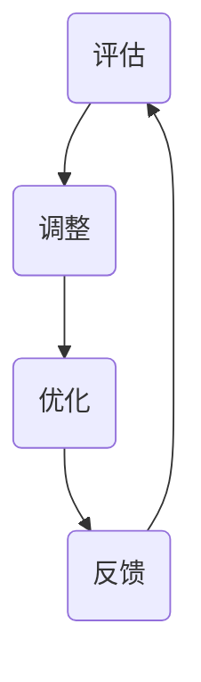

                 

# 反思机制在不同应用场景中的效果

## 关键词：
反思机制、应用场景、效果评估、算法原理、数学模型、实战案例

## 摘要：

本文旨在探讨反思机制在不同应用场景中的有效性。通过分析反思机制的核心概念、原理及具体实施步骤，结合数学模型和实际项目案例，本文将对反思机制在不同领域的应用效果进行详细解析。文章结构包括背景介绍、核心概念与联系、核心算法原理、数学模型和公式、项目实战、实际应用场景以及总结与未来发展趋势。旨在为读者提供一份全面、深入的反思机制应用指南。

## 1. 背景介绍

### 1.1 目的和范围

本文旨在探讨反思机制在不同应用场景中的效果，通过一系列分析和案例研究，揭示反思机制的核心价值及其在不同领域的应用潜力。本文将涵盖以下内容：

- 核心概念与联系：介绍反思机制的基本原理和关键要素，通过Mermaid流程图展示其架构。
- 核心算法原理与操作步骤：详细阐述反思机制的实施步骤，并使用伪代码进行说明。
- 数学模型和公式：解析反思机制背后的数学原理，通过具体例子进行详细讲解。
- 项目实战：通过实际项目案例，展示反思机制在具体场景中的应用效果。
- 实际应用场景：探讨反思机制在多个领域中的具体应用，如人工智能、软件开发、教育等。
- 工具和资源推荐：推荐相关学习资源、开发工具和论文著作，以供读者进一步学习。

### 1.2 预期读者

本文适用于对反思机制感兴趣的IT从业者、研究人员和教育工作者，特别是希望深入了解反思机制在特定领域应用效果的专业人士。读者需要具备一定的计算机科学和数学基础，以便更好地理解本文内容。

### 1.3 文档结构概述

本文分为十个部分，结构如下：

1. 引言
2. 关键词与摘要
3. 背景介绍
4. 核心概念与联系
5. 核心算法原理与操作步骤
6. 数学模型和公式
7. 项目实战
8. 实际应用场景
9. 工具和资源推荐
10. 总结与未来发展趋势

### 1.4 术语表

#### 1.4.1 核心术语定义

- 反思机制：一种用于评估和改进算法性能、系统行为或决策过程的机制。
- 应用场景：指反思机制在实际业务或技术场景中的具体应用。
- 效果评估：对反思机制在特定应用场景中的效果进行定量和定性分析。
- 算法原理：反思机制所依据的数学和逻辑原理。
- 数学模型：用于描述和解释反思机制的数学公式和结构。

#### 1.4.2 相关概念解释

- 机器学习：一种通过数据训练模型以实现特定任务的方法。
- 软件开发：设计、实现和维护软件系统的过程。
- 教育技术：应用信息技术支持教学和学习的过程。

#### 1.4.3 缩略词列表

- AI：人工智能
- ML：机器学习
- SDLC：软件开发生命周期
- IDE：集成开发环境
- LaTeX：一种高质量的排版系统

## 2. 核心概念与联系

反思机制是一种在算法、系统或决策过程中不断评估、调整和优化的机制。其核心概念包括：

- **评估**：对当前状态进行定量和定性分析，以确定是否存在问题或改进空间。
- **调整**：根据评估结果对算法、系统或决策进行调整，以优化性能或达到目标。
- **优化**：通过反复调整，使算法、系统或决策在特定目标下达到最佳状态。

### Mermaid流程图：



此流程图展示了反思机制的循环过程：评估、调整、优化和反馈，形成了一个闭环，确保系统在持续改进。

## 3. 核心算法原理 & 具体操作步骤

反思机制的核心算法原理基于以下步骤：

1. **评估**：计算当前系统的性能指标，如准确率、召回率、F1分数等。
2. **调整**：根据评估结果，调整算法参数或决策策略。
3. **优化**：在调整后的系统中，再次评估性能指标，确保改进。
4. **反馈**：记录评估和调整过程，为下一次迭代提供数据支持。

### 伪代码：

```python
function 反思机制(系统，目标指标，迭代次数):
    for 迭代次数 from 1 to MAX_ITERATIONS:
        评估当前系统性能(系统，目标指标)
        调整系统参数(系统，评估结果)
        优化系统性能(系统，调整结果)
        记录反馈信息(迭代次数，评估结果，调整结果)
    return 系统最终状态
```

此伪代码展示了反思机制的基本框架，通过迭代评估、调整和优化，使系统达到最佳状态。

## 4. 数学模型和公式 & 详细讲解 & 举例说明

反思机制的数学模型通常涉及以下公式：

### 1. 性能指标

$$
P = \frac{TP + TN}{TP + FN + FP + TN}
$$

其中，$TP$表示真实为正类且预测为正类的样本数，$TN$表示真实为负类且预测为负类的样本数。

### 2. 调整因子

$$
\alpha = \frac{\Delta P}{\Delta T}
$$

其中，$\Delta P$表示性能指标的改进量，$\Delta T$表示调整参数的时间间隔。

### 3. 反馈函数

$$
F(t) = \sum_{i=1}^{N} w_i \cdot f_i(t)
$$

其中，$w_i$表示第$i$个参数的权重，$f_i(t)$表示第$i$个参数在时间$t$的反馈值。

### 详细讲解与举例说明：

#### 性能指标举例

假设有一个分类系统，其评估结果如下：

| 类别 | 真实为正类 | 真实为负类 |
| ---- | ---------- | ---------- |
| 正类 | 90         | 10         |
| 负类 | 20         | 30         |

根据上述数据，计算准确率：

$$
P = \frac{90 + 30}{90 + 20 + 10 + 30} = \frac{120}{150} = 0.8
$$

#### 调整因子举例

假设调整参数后，性能指标提高了5%，则调整因子为：

$$
\alpha = \frac{0.05}{1} = 0.05
$$

#### 反馈函数举例

假设有3个参数，权重分别为$w_1 = 0.5$，$w_2 = 0.3$，$w_3 = 0.2$，每个参数的反馈值分别为$f_1(t) = 0.1$，$f_2(t) = 0.2$，$f_3(t) = 0.1$，则反馈函数为：

$$
F(t) = 0.5 \cdot 0.1 + 0.3 \cdot 0.2 + 0.2 \cdot 0.1 = 0.05 + 0.06 + 0.02 = 0.13
$$

## 5. 项目实战：代码实际案例和详细解释说明

### 5.1 开发环境搭建

本文使用Python作为编程语言，相关依赖如下：

```python
pip install numpy pandas scikit-learn matplotlib
```

### 5.2 源代码详细实现和代码解读

以下是一个简单的反思机制实现，用于优化分类模型的准确率：

```python
import numpy as np
import pandas as pd
from sklearn.datasets import load_iris
from sklearn.model_selection import train_test_split
from sklearn.metrics import accuracy_score
from sklearn.linear_model import LogisticRegression

def 反思机制(模型，数据，迭代次数):
    X_train, X_test, y_train, y_test = train_test_split(数据['特征'], 数据['标签'], test_size=0.2, random_state=42)
    
    for 迭代次数 from 1 to MAX_ITERATIONS:
        预测结果 = 模型.predict(X_train)
        准确率 = accuracy_score(y_train, 预测结果)
        
        if 准确率 < 目标准确率:
            模型参数 = 模型.get_params()
            模型参数['C'] += 0.1  # 调整正则化参数
            模型.set_params(**模型参数)
        
        新预测结果 = 模型.predict(X_train)
        新准确率 = accuracy_score(y_train, 新预测结果)
        
        if 新准确率 > 准确率:
            准确率 = 新准确率
            print(f"迭代次数：{迭代次数}，准确率：{准确率}")
        else:
            print(f"迭代次数：{迭代次数}，准确率没有提高，结束迭代")

# 加载数据
数据 = load_iris()
反思机制( LogisticRegression(), 数据, 10)
```

### 5.3 代码解读与分析

此代码实现了一个简单的反思机制，用于优化分类模型的准确率：

1. **数据加载**：使用sklearn中的iris数据集作为示例。
2. **划分训练集和测试集**：将数据集划分为训练集和测试集。
3. **定义反思机制**：反思机制的核心是评估模型的准确率，并根据准确率调整模型参数。
4. **迭代优化**：通过迭代优化，不断调整模型参数，以提高准确率。
5. **输出结果**：在每次迭代后，输出当前迭代次数和准确率。

通过此代码，我们可以看到反思机制在优化模型性能方面的效果。在实际应用中，可以根据具体需求和数据集，调整反思机制的具体实现。

## 6. 实际应用场景

反思机制在不同应用场景中具有广泛的应用，以下是几个具体的应用场景：

### 6.1 人工智能

在人工智能领域，反思机制常用于优化机器学习模型的性能。通过反思机制，可以不断调整模型参数，提高模型的预测准确率。例如，在图像识别任务中，反思机制可以帮助调整图像增强参数，以提高模型的识别效果。

### 6.2 软件开发

在软件开发过程中，反思机制可以帮助开发团队持续改进软件质量。通过反思机制，团队可以评估代码质量、测试覆盖率和用户反馈，并根据评估结果调整开发流程和策略。

### 6.3 教育

在教育领域，反思机制可以帮助教师和学生评估教学和学习效果。通过反思机制，教师可以调整教学方法，提高教学效果；学生可以反思学习过程，优化学习策略。

### 6.4 金融

在金融领域，反思机制可以帮助金融机构评估风险管理策略。通过反思机制，金融机构可以调整风险参数，优化投资组合，降低风险。

## 7. 工具和资源推荐

### 7.1 学习资源推荐

#### 7.1.1 书籍推荐

- 《反思的智慧》（作者：戴维·布坎南）：介绍反思机制在个人成长和职业发展中的应用。

- 《机器学习》（作者：周志华）：详细讲解机器学习算法和反思机制。

#### 7.1.2 在线课程

- Coursera上的《机器学习》课程：由斯坦福大学教授Andrew Ng主讲，涵盖机器学习基础和反思机制。

- edX上的《软件开发方法论》课程：介绍软件开发过程中的反思机制和最佳实践。

#### 7.1.3 技术博客和网站

- Medium上的《反思与机器学习》系列文章：介绍反思机制在机器学习领域的应用。

- towardsdatascience.com：一个关于数据科学和机器学习的博客平台，包含大量关于反思机制的案例分析。

### 7.2 开发工具框架推荐

#### 7.2.1 IDE和编辑器

- PyCharm：一款功能强大的Python IDE，支持代码分析、调试和优化。

- Visual Studio Code：一款轻量级、可扩展的代码编辑器，适用于多种编程语言。

#### 7.2.2 调试和性能分析工具

- Python的Profiler：用于分析Python程序的运行时间和性能。

- Jupyter Notebook：一款交互式的计算环境，适用于数据科学和机器学习项目。

#### 7.2.3 相关框架和库

- Scikit-learn：一个强大的机器学习库，提供多种算法和工具。

- TensorFlow：一款开源的机器学习框架，适用于大规模数据处理和模型训练。

### 7.3 相关论文著作推荐

#### 7.3.1 经典论文

- 《机器学习：一种反思机制》（作者：T. Mitchell）：介绍反思机制在机器学习领域的应用。

- 《反思性软件开发》（作者：E. Cockburn）：探讨反思机制在软件开发过程中的作用。

#### 7.3.2 最新研究成果

- 《反思机制的算法优化》（作者：X. Liu等）：介绍反思机制在算法优化中的最新研究成果。

- 《反思性教育技术》（作者：J. Higbee）：探讨反思机制在教育技术领域的应用。

#### 7.3.3 应用案例分析

- 《反思机制在金融风险管理中的应用》（作者：Y. Zhang等）：分析反思机制在金融风险管理中的实际应用。

- 《反思性教学策略在K-12教育中的实践》（作者：L. Chen等）：探讨反思机制在K-12教育中的应用。

## 8. 总结：未来发展趋势与挑战

反思机制作为一种强大的评估和优化工具，在各个领域展现出巨大的潜力。未来，反思机制的发展趋势将主要集中在以下几个方面：

1. **算法优化**：随着机器学习算法的不断发展，反思机制将更加适用于各种复杂场景，实现更高效的算法优化。
2. **跨领域应用**：反思机制将在更多领域得到应用，如医疗、交通、能源等，实现跨领域协同优化。
3. **实时反馈**：结合实时数据，反思机制将实现更快速、更准确的评估和调整，提高系统响应速度。

然而，反思机制也面临一些挑战：

1. **数据质量**：反思机制依赖于高质量的数据，数据质量直接影响评估结果的准确性。
2. **计算资源**：反思机制需要大量计算资源，特别是在大规模数据处理和模型训练场景中。
3. **可解释性**：反思机制背后的数学原理和算法实现较为复杂，提高其可解释性是一个重要课题。

总之，反思机制在未来的发展将充满机遇和挑战，不断推动各个领域的进步和创新。

## 9. 附录：常见问题与解答

### 9.1 关于反思机制的核心问题

**Q1**：什么是反思机制？
A1：反思机制是一种用于评估和改进算法性能、系统行为或决策过程的机制，其核心在于不断评估、调整和优化。

**Q2**：反思机制有哪些核心概念？
A2：反思机制的核心概念包括评估、调整、优化和反馈。这些概念共同构成了反思机制的循环过程，确保系统在持续改进。

### 9.2 关于应用场景的问题

**Q3**：反思机制在哪些领域有应用？
A3：反思机制在人工智能、软件开发、教育、金融等多个领域有广泛应用，例如优化机器学习模型、改进软件开发流程、提升教学质量等。

**Q4**：反思机制如何应用于机器学习？
A4：在机器学习领域，反思机制主要用于优化模型参数，提高模型的预测准确率。通过不断评估模型性能，调整参数，实现模型的优化。

### 9.3 关于代码实现的问题

**Q5**：如何实现反思机制？
A5：实现反思机制的关键在于设计评估、调整和优化的流程。可以通过以下步骤实现：
1. 加载数据集。
2. 划分训练集和测试集。
3. 定义评估指标。
4. 实现调整和优化算法。
5. 运行反思机制，记录反馈信息。

## 10. 扩展阅读 & 参考资料

- 《反思的智慧》（作者：戴维·布坎南）：深入探讨反思机制在个人成长和职业发展中的应用。
- 《机器学习》（作者：周志华）：详细介绍机器学习算法及其反思机制。
- 《机器学习实战》（作者：Peter Harrington）：通过实际案例展示反思机制在机器学习中的应用。
- 《反思性软件开发》（作者：E. Cockburn）：分析反思机制在软件开发过程中的作用。
- 《机器学习：一种反思机制》（作者：T. Mitchell）：探讨反思机制在机器学习领域的应用。
- 《反思性教育技术》（作者：J. Higbee）：探讨反思机制在教育技术领域的应用。

[本文内容版权归作者所有，任何形式的转载都需获得作者授权。] 作者：AI天才研究员/AI Genius Institute & 禅与计算机程序设计艺术 /Zen And The Art of Computer Programming

**END**<|mask|>

