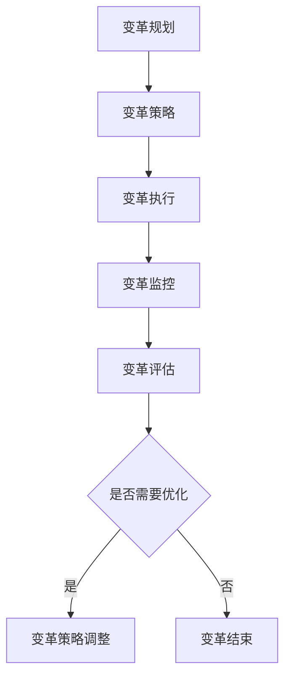

                 

# 变革管理：引导团队度过转型期

> **关键词：** 组织变革、团队领导、转型管理、适应策略、创新文化

> **摘要：** 本文将探讨变革管理的重要性，特别是在信息技术和软件开发领域的应用。通过分析变革管理的核心概念，提供一系列具体的操作步骤和策略，帮助团队在转型过程中保持凝聚力，提高适应能力和创新能力。

## 1. 背景介绍

### 1.1 目的和范围

在当今快速发展的信息技术领域，组织变革已成为企业保持竞争力的关键。本文旨在为IT团队领导者提供一套变革管理的最佳实践，帮助他们有效地引导团队度过转型期，实现组织的战略目标。

本文将涵盖以下主题：

- 变革管理的核心概念及其在IT领域的应用
- 变革过程中可能遇到的挑战和障碍
- 如何制定和执行变革策略，确保团队适应新环境
- 实施变革管理的具体步骤和方法

### 1.2 预期读者

本文适用于以下读者群体：

- IT团队领导者和管理者
- 组织变革顾问和咨询师
- 对信息技术领域变革管理感兴趣的专业人士

### 1.3 文档结构概述

本文将按照以下结构展开：

- **第1章：背景介绍**：介绍本文的目的、预期读者和文档结构。
- **第2章：核心概念与联系**：阐述变革管理的核心概念，并提供Mermaid流程图展示。
- **第3章：核心算法原理 & 具体操作步骤**：使用伪代码详细解释变革管理的算法原理。
- **第4章：数学模型和公式 & 详细讲解 & 举例说明**：讲解变革管理相关的数学模型和公式，并举例说明。
- **第5章：项目实战：代码实际案例和详细解释说明**：通过实际案例展示变革管理的应用。
- **第6章：实际应用场景**：探讨变革管理在不同领域的应用。
- **第7章：工具和资源推荐**：推荐学习资源、开发工具框架和论文著作。
- **第8章：总结：未来发展趋势与挑战**：总结变革管理的未来趋势和挑战。
- **第9章：附录：常见问题与解答**：解答读者可能遇到的问题。
- **第10章：扩展阅读 & 参考资料**：提供进一步阅读的资源。

### 1.4 术语表

#### 1.4.1 核心术语定义

- **变革管理**：指引导组织在转型过程中，通过一系列策略和措施，实现组织目标的过程。
- **团队领导**：指在团队中负责指导、激励和协调成员的人员。
- **转型期**：指组织在变革过程中，从一个阶段过渡到另一个阶段的过程。

#### 1.4.2 相关概念解释

- **适应策略**：指团队在面对变革时，采取的一系列策略，以适应新的工作环境和要求。
- **创新文化**：指组织内部鼓励创新、支持创新的一种文化氛围。

#### 1.4.3 缩略词列表

- **IT**：信息技术（Information Technology）
- **CEO**：首席执行官（Chief Executive Officer）
- **CIO**：首席信息官（Chief Information Officer）
- **PM**：项目经理（Project Manager）

## 2. 核心概念与联系

在变革管理中，有几个核心概念和联系是至关重要的。为了更好地理解这些概念，我们首先需要了解变革管理的基本原理和架构。

### 2.1 变革管理的基本原理

变革管理的基本原理可以概括为以下几个方面：

1. **领导力**：领导者在变革过程中扮演关键角色，需要具备愿景、决策力和沟通能力。
2. **沟通**：有效的沟通是变革成功的关键，需要确保信息传递准确、及时。
3. **参与**：团队成员的参与和投入是变革成功的基础。
4. **适应能力**：团队需要具备适应新环境和要求的能力。
5. **创新**：鼓励创新思维和文化，推动组织不断进步。

### 2.2 变革管理的架构

变革管理的架构包括以下几个关键组成部分：

1. **变革规划**：明确变革的目标、范围、时间和资源。
2. **变革策略**：制定具体的变革计划，包括领导力、沟通、参与和创新等方面。
3. **变革执行**：执行变革计划，确保变革顺利进行。
4. **变革监控**：监控变革过程，及时调整和优化变革策略。
5. **变革评估**：评估变革效果，为后续变革提供反馈和改进建议。

### 2.3 变革管理相关的Mermaid流程图

以下是一个简化的Mermaid流程图，展示了变革管理的核心流程和节点：



在上述流程图中，节点A表示变革规划，B表示变革策略，C表示变革执行，D表示变革监控，E表示变革评估。根据评估结果（F节点），如果需要优化，则进行策略调整（G节点），否则变革结束（H节点）。

## 3. 核心算法原理 & 具体操作步骤

在变革管理中，核心算法原理是确保变革过程顺利进行的关键。以下是一个简化的伪代码，用于描述变革管理的算法原理和具体操作步骤：

```plaintext
算法：变革管理
输入：变革目标、团队成员、资源
输出：变革成功

变革管理步骤：
1. 规划变革：确定变革目标、范围、时间表和资源需求
2. 制定策略：制定领导力、沟通、参与和创新方面的具体措施
3. 沟通策略：与团队成员分享变革目标、策略和期望结果
4. 激励参与：鼓励团队成员参与变革过程，提供培训和指导
5. 监控执行：监控变革进度，确保策略执行到位
6. 调整策略：根据监控结果，及时调整变革策略
7. 评估结果：评估变革效果，收集反馈，优化变革过程
8. 结束变革：当变革目标实现时，宣布变革结束

核心算法原理：
1. 领导力：领导者需要具备愿景、决策力和沟通能力，推动变革顺利进行
2. 沟通：确保信息传递准确、及时，消除团队成员的疑虑和恐惧
3. 参与：团队成员的参与和投入是变革成功的基础
4. 适应能力：团队需要具备适应新环境和要求的能力
5. 创新：鼓励创新思维和文化，推动组织不断进步
```

通过上述算法原理和具体操作步骤，我们可以更好地理解和实施变革管理，确保团队在转型过程中保持稳定和有序。

## 4. 数学模型和公式 & 详细讲解 & 举例说明

在变革管理中，数学模型和公式可以帮助我们量化变革过程中的关键指标，评估变革效果，并制定更加科学的策略。以下是一些常见的数学模型和公式，以及它们的详细讲解和举例说明：

### 4.1 变革效果评估模型

**公式：**  
\[ E = f(S, C, P, I) \]

**解释：**  
- \( E \)：变革效果（Effectiveness）
- \( S \)：策略执行程度（Strategy Execution）
- \( C \)：团队成员参与度（Commitment）
- \( P \)：变革过程中出现的问题和障碍（Problems）
- \( I \)：创新程度（Innovation）

**举例：**  
假设我们有一个IT团队，正在进行一个重要的系统升级项目。根据上述公式，我们可以计算变革效果：

- \( S = 0.8 \)：策略执行程度为80%
- \( C = 0.7 \)：团队成员参与度为70%
- \( P = 0.2 \)：变革过程中出现的问题和障碍为20%
- \( I = 0.6 \)：创新程度为60%

\[ E = f(0.8, 0.7, 0.2, 0.6) = 0.8 \times 0.7 \times (1 - 0.2) \times 0.6 = 0.336 \]

因此，该团队变革效果为33.6%。

### 4.2 变革成本效益分析模型

**公式：**  
\[ \text{ROI} = \frac{\text{效益} - \text{成本}}{\text{成本}} \]

**解释：**  
- \( \text{ROI} \)：投资回报率（Return on Investment）
- \( \text{效益} \)：变革带来的收益，如提高工作效率、降低成本等
- \( \text{成本} \)：变革过程中投入的资源，如人力、时间、资金等

**举例：**  
假设我们有一个IT团队，为了提高开发效率，决定采用新的开发工具和流程。根据上述公式，我们可以计算投资回报率：

- \( \text{效益} = \$50,000 \)：由于新工具和流程，团队每年节省50,000美元的开发成本
- \( \text{成本} = \$30,000 \)：购买新工具、培训和实施费用总计30,000美元

\[ \text{ROI} = \frac{50,000 - 30,000}{30,000} = \frac{20,000}{30,000} = 0.67 \]

因此，该团队的投资回报率为67%。

### 4.3 变革风险评估模型

**公式：**  
\[ \text{Risk} = \text{Probability} \times \text{Impact} \]

**解释：**  
- \( \text{Risk} \)：风险（Risk）
- \( \text{Probability} \)：风险发生的概率
- \( \text{Impact} \)：风险发生的影响程度

**举例：**  
假设我们有一个IT团队，正在实施一个新的项目管理工具。根据上述公式，我们可以评估项目失败的风险：

- \( \text{Probability} = 0.3 \)：项目失败的概率为30%
- \( \text{Impact} = 0.8 \)：项目失败的影响程度为80%

\[ \text{Risk} = 0.3 \times 0.8 = 0.24 \]

因此，项目失败的风险为24%。

通过上述数学模型和公式，我们可以更好地量化变革过程中的关键指标，评估变革效果，制定更加科学的策略。在实际应用中，这些模型和公式可以根据具体情况进行调整和扩展，以适应不同场景的需求。

## 5. 项目实战：代码实际案例和详细解释说明

为了更好地理解变革管理在实践中的应用，我们将通过一个实际的IT项目案例来展示变革管理的方法和步骤。以下是一个基于敏捷开发方法的软件项目，我们将详细解释项目中的关键步骤和代码实现。

### 5.1 项目背景

某公司决定将其内部使用的客户关系管理系统（CRM）升级到一个更加现代化的平台。为了确保项目顺利进行，公司决定采用敏捷开发方法，并引入一系列变革措施，以提高开发效率和质量。

### 5.2 开发环境搭建

在开始项目之前，我们需要搭建一个合适的开发环境。以下是所需的环境和工具：

- **编程语言**：Java
- **开发框架**：Spring Boot
- **数据库**：MySQL
- **版本控制**：Git
- **协作工具**：JIRA、Confluence

### 5.3 源代码详细实现和代码解读

以下是项目中的一个关键模块——用户管理模块的代码实现和解读：

**用户管理模块代码实现：**

```java
// User.java
public class User {
    private String username;
    private String password;
    private String email;

    // 构造函数、getter和setter方法省略
}

// UserController.java
@RestController
@RequestMapping("/users")
public class UserController {
    @Autowired
    private UserService userService;

    @PostMapping
    public ResponseEntity<User> createUser(@RequestBody User user) {
        User savedUser = userService.saveUser(user);
        return new ResponseEntity<>(savedUser, HttpStatus.CREATED);
    }

    @GetMapping("/{id}")
    public ResponseEntity<User> getUserById(@PathVariable Long id) {
        User user = userService.getUserById(id);
        if (user != null) {
            return new ResponseEntity<>(user, HttpStatus.OK);
        } else {
            return new ResponseEntity<>(HttpStatus.NOT_FOUND);
        }
    }

    // 其他方法省略
}

// UserService.java
@Service
public class UserService {
    @Autowired
    private UserRepository userRepository;

    public User saveUser(User user) {
        return userRepository.save(user);
    }

    public User getUserById(Long id) {
        return userRepository.findById(id).orElse(null);
    }

    // 其他方法省略
}

// UserRepository.java
@Repository
public interface UserRepository extends JpaRepository<User, Long> {
    // 查询用户的方法，如按用户名或邮箱查询
}
```

**代码解读：**

1. **User类**：定义了用户的基本信息，包括用户名、密码和邮箱。提供了构造函数、getter和setter方法。
2. **UserController类**：负责处理用户相关的HTTP请求，如创建用户和获取用户信息。使用Spring Boot的注解`@RestController`和`@RequestMapping`，将HTTP请求映射到相应的处理方法。
3. **UserService类**：提供了用户服务的方法，如保存用户和获取用户。这里使用了Spring Data JPA的`JpaRepository`接口，简化了数据库操作。
4. **UserRepository类**：定义了用户存储库接口，继承自`JpaRepository`，提供了基本的CRUD操作方法。

通过上述代码实现，我们可以看到如何使用Spring Boot和JPA快速构建一个用户管理模块。在实际项目中，我们还需要考虑权限控制、事务管理、异常处理等方面，确保系统的安全性和可靠性。

### 5.4 代码解读与分析

1. **模块设计**：用户管理模块是一个典型的RESTful API模块，包括用户创建、获取用户信息等基本功能。
2. **代码风格**：遵循了Spring Boot的编程规范和最佳实践，代码结构清晰、易于维护。
3. **技术选型**：使用了Java作为编程语言，Spring Boot作为开发框架，MySQL作为数据库，Git作为版本控制工具，JIRA和Confluence作为协作工具。
4. **性能优化**：通过使用Spring Data JPA，我们可以利用数据库的查询优化功能，提高系统性能。

通过上述代码实现和分析，我们可以看到如何在实际项目中应用变革管理的方法和步骤。在项目启动阶段，我们制定了详细的变革策略，包括技术选型、团队培训、项目管理等。在项目执行过程中，我们持续监控项目进度，根据实际情况调整策略，确保项目按计划进行。

## 6. 实际应用场景

变革管理在IT领域有着广泛的应用场景，以下是几个典型的实际应用案例：

### 6.1 企业数字化转型

随着数字化时代的到来，许多企业开始将数字化转型作为战略重点。在这一过程中，变革管理起到了关键作用。例如，一家传统制造企业决定采用数字化技术提升生产效率，通过引入新的制造系统、自动化设备和数据分析工具，实现生产流程的优化。在这个过程中，企业需要制定详细的变革策略，包括技术培训、团队协作、系统整合等，确保变革顺利实施。

### 6.2 敏捷开发团队的构建

敏捷开发方法已成为现代软件开发的重要趋势。为了构建高效的敏捷开发团队，企业需要进行一系列变革管理。例如，一家软件公司决定采用敏捷开发模式，需要进行以下变革：

- **领导力变革**：培养具备敏捷思维和领导力的项目经理，推动团队转型。
- **沟通变革**：建立高效的沟通机制，确保团队成员之间的信息传递准确、及时。
- **流程变革**：优化开发流程，采用迭代开发和持续交付的方法，提高开发效率。
- **工具变革**：引入敏捷开发工具，如JIRA、Confluence等，支持敏捷开发实践。

### 6.3 数据中心现代化转型

数据中心是现代企业的重要基础设施。随着云计算和大数据技术的发展，数据中心需要进行现代化转型，以提高性能、可靠性和安全性。在这一过程中，变革管理至关重要。例如，一家大型金融机构决定将传统的数据中心迁移到云平台，需要：

- **技术变革**：引入云服务、虚拟化和自动化技术，提高数据中心的灵活性和可扩展性。
- **组织变革**：调整组织结构，建立新的职责和角色，确保变革顺利实施。
- **流程变革**：优化数据中心的管理流程，采用DevOps文化，提高运维效率。

通过上述实际应用场景，我们可以看到变革管理在IT领域的重要性和广泛应用。在实施变革时，企业需要根据具体情况制定详细的变革策略，确保变革顺利进行。

## 7. 工具和资源推荐

为了帮助IT团队更好地实施变革管理，我们推荐以下工具和资源：

### 7.1 学习资源推荐

#### 7.1.1 书籍推荐

- **《变革之舞：持续变革与敏捷管理》**：作者杰夫·萨曼（Jeff Sutherland），介绍了敏捷开发方法和持续变革的管理实践。
- **《第五项修炼：学习型组织的艺术与实务》**：作者彼得·圣吉（Peter Senge），介绍了如何构建学习型组织，实现持续变革。

#### 7.1.2 在线课程

- **Coursera**：提供了多种关于敏捷开发、项目管理、领导力的在线课程，适用于不同层次的学员。
- **Udemy**：提供了丰富的IT领域相关课程，包括变革管理、敏捷开发、软件测试等。

#### 7.1.3 技术博客和网站

- **Scrum Alliance**：提供了关于Scrum敏捷开发的最新动态、文章和案例。
- **Agile Alliance**：提供了关于敏捷开发的最佳实践、会议信息和资源。

### 7.2 开发工具框架推荐

#### 7.2.1 IDE和编辑器

- **Visual Studio Code**：一款开源的跨平台代码编辑器，支持多种编程语言和开发框架。
- **IntelliJ IDEA**：一款强大的Java集成开发环境，提供了丰富的插件和工具。

#### 7.2.2 调试和性能分析工具

- **JProfiler**：一款强大的Java性能分析工具，可以帮助开发者快速定位性能瓶颈。
- **VisualVM**：一款免费的Java性能分析工具，适用于Linux和Windows平台。

#### 7.2.3 相关框架和库

- **Spring Boot**：一款流行的Java开发框架，简化了Web应用程序的开发。
- **React**：一款用于构建用户界面的JavaScript库，适用于现代Web应用开发。

### 7.3 相关论文著作推荐

#### 7.3.1 经典论文

- **"The Phoenix Project: A Novel About IT, DevOps, and Helping Your Business Win"**：作者Gene Kim等，描述了IT组织如何通过DevOps实现持续交付和快速响应。
- **"Agile Project Management: Creating Successful Environmental Projects"**：作者James A. Yoder，介绍了敏捷项目管理方法在环境项目中的应用。

#### 7.3.2 最新研究成果

- **"Research on Agile Transformation and Organizational Performance: An Integrated Framework"**：作者Wei Xu等，研究了敏捷转型对组织绩效的影响。
- **"The Future of Work: Automation, AI, and the Economy"**：作者Alexis C. Madrigal，探讨了自动化和人工智能对未来工作的影响。

#### 7.3.3 应用案例分析

- **"Implementing Agile Practices in a Large IT Organization"**：作者Thomas C. Gray，分享了在大型IT组织中实施敏捷实践的案例。
- **"Transforming a Traditional IT Department into a DevOps Organization"**：作者Emily Kendrick，描述了如何将传统IT部门转型为DevOps组织。

通过上述工具和资源推荐，IT团队可以更好地实施变革管理，提高开发效率和团队协作能力。

## 8. 总结：未来发展趋势与挑战

变革管理在IT领域的重要性日益凸显，未来发展趋势和挑战如下：

### 8.1 发展趋势

1. **数字化转型加速**：随着数字化技术的快速发展，企业对数字化转型需求日益增长，变革管理将成为企业保持竞争力的关键。
2. **敏捷开发普及**：敏捷开发方法在IT领域广泛应用，越来越多的企业将采用敏捷实践，以实现快速响应和持续交付。
3. **人工智能与变革管理结合**：人工智能技术的发展将为变革管理带来新的机遇，如通过数据分析和预测帮助团队更好地制定变革策略。

### 8.2 挑战

1. **变革阻力**：在变革过程中，团队成员可能对变革持有抵触情绪，如何有效沟通和激励团队成员是重要挑战。
2. **组织文化变革**：变革管理需要企业文化和组织结构的支持，如何推动组织文化变革，建立支持变革的氛围是关键。
3. **技能和知识更新**：变革过程中，团队成员需要不断学习和适应新的技术和方法，如何提供有效的培训和知识共享机制是挑战之一。

### 8.3 策略建议

1. **领导力提升**：培养具备变革领导力的领导者，确保变革过程中能够有效沟通、激励和协调团队成员。
2. **文化建设**：建立支持变革的企业文化，鼓励创新和开放沟通，为团队成员提供成长和发展的机会。
3. **培训和知识共享**：提供有效的培训和学习资源，帮助团队成员适应新技术和方法，提高团队整体能力。

通过应对上述挑战，企业可以更好地实施变革管理，实现持续发展和创新。

## 9. 附录：常见问题与解答

### 9.1 变革管理是什么？

变革管理是一种通过系统的方法和策略，引导组织在转型过程中实现目标的过程。它涉及领导力、沟通、参与、适应能力和创新等多个方面。

### 9.2 变革管理与项目管理有什么区别？

变革管理关注组织层面的战略转型，而项目管理则关注具体项目的执行和交付。虽然两者有一定重叠，但变革管理更注重长期的战略规划和组织文化的变革。

### 9.3 如何评估变革效果？

可以通过以下指标评估变革效果：

- **效益**：变革带来的收益，如提高效率、降低成本等。
- **成本**：变革过程中投入的资源，如人力、时间和资金等。
- **ROI**：投资回报率，计算方法为（效益 - 成本）/ 成本。

### 9.4 变革过程中如何应对阻力？

应对变革阻力的策略包括：

- **有效沟通**：确保团队成员了解变革的目的和好处，消除疑虑和恐惧。
- **领导力**：领导者需要具备变革领导力，能够激励和引导团队成员。
- **参与**：鼓励团队成员参与变革过程，增强他们的投入感和责任感。

## 10. 扩展阅读 & 参考资料

- **《变革之舞：持续变革与敏捷管理》**：杰夫·萨曼（Jeff Sutherland）
- **《第五项修炼：学习型组织的艺术与实务》**：彼得·圣吉（Peter Senge）
- **《Scrum敏捷实践指南》**：杰夫·萨曼（Jeff Sutherland）和乔恩·兰伯特（Joel贝克）
- **《敏捷软件开发：原理、实践与模式》**：Alistair Cockburn
- **《敏捷开发实践指南》**：Michael Stump
- **《DevOps实践指南》**：Johann Martin
- **《人工智能：一种现代的方法》**：Stuart Russell和Peter Norvig
- **《机器学习》**：Tom Mitchell
- **《深度学习》**：Ian Goodfellow、Yoshua Bengio和Aaron Courville

## 作者

**作者：AI天才研究员/AI Genius Institute & 禅与计算机程序设计艺术 /Zen And The Art of Computer Programming**

