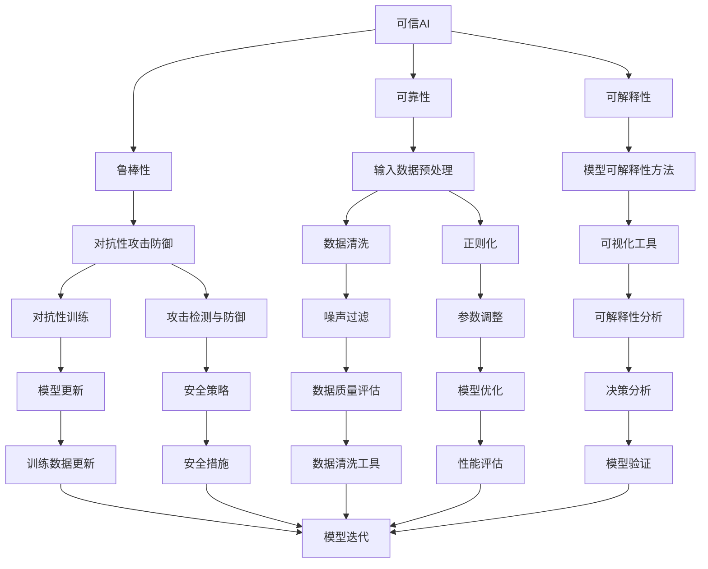

                 

# 可信AI与模型鲁棒性原理与代码实战案例讲解

> **关键词：** 可信AI、模型鲁棒性、深度学习、神经网络、代码实战、人工智能安全、数据清洗、对抗性攻击、算法优化。

> **摘要：** 本文章将深入探讨可信AI与模型鲁棒性的原理，介绍相关的核心算法和数学模型，并通过代码实战案例展示如何在实际项目中提高模型的鲁棒性，确保人工智能系统的可信度和稳定性。读者将了解如何设计和实现鲁棒性强的AI模型，以及应对对抗性攻击的技巧。

## 1. 背景介绍

### 1.1 目的和范围

随着深度学习和神经网络技术的快速发展，人工智能（AI）已经在各个领域展现出了强大的应用潜力。然而，模型鲁棒性问题成为了限制AI技术广泛应用的一个重要瓶颈。本文旨在介绍可信AI与模型鲁棒性的基本原理，并通过具体的代码实战案例，展示如何在实际项目中提高模型的鲁棒性。

本文主要涵盖以下内容：
- **核心概念与联系**：介绍可信AI和模型鲁棒性的核心概念，并通过Mermaid流程图展示它们之间的关系。
- **核心算法原理与操作步骤**：讲解如何设计和实现鲁棒性强的AI模型，包括数据预处理、模型训练和优化等步骤。
- **数学模型和公式**：详细阐述用于评估模型鲁棒性的数学模型和公式，并举例说明。
- **项目实战**：通过实际代码案例，演示如何提高模型的鲁棒性，并分析代码的实现细节。
- **实际应用场景**：探讨模型鲁棒性在不同应用场景中的重要性。
- **工具和资源推荐**：推荐相关的学习资源、开发工具和经典论文，帮助读者进一步学习。

### 1.2 预期读者

本文主要面向以下读者群体：
- **AI开发者**：对深度学习和神经网络有一定了解，希望提高模型鲁棒性的开发者。
- **研究人员**：对可信AI和模型鲁棒性感兴趣，希望深入了解相关原理的研究人员。
- **技术爱好者**：对AI技术感兴趣，希望了解如何通过代码实战提高模型鲁棒性的技术爱好者。

### 1.3 文档结构概述

本文的结构如下：
1. **背景介绍**：介绍本文的目的、预期读者和文档结构。
2. **核心概念与联系**：介绍可信AI和模型鲁棒性的核心概念，并通过Mermaid流程图展示它们之间的关系。
3. **核心算法原理与操作步骤**：讲解如何设计和实现鲁棒性强的AI模型。
4. **数学模型和公式**：详细阐述用于评估模型鲁棒性的数学模型和公式。
5. **项目实战**：通过实际代码案例，演示如何提高模型的鲁棒性。
6. **实际应用场景**：探讨模型鲁棒性在不同应用场景中的重要性。
7. **工具和资源推荐**：推荐相关的学习资源、开发工具和经典论文。
8. **总结：未来发展趋势与挑战**：总结可信AI和模型鲁棒性的发展趋势和面临的挑战。
9. **附录：常见问题与解答**：解答读者可能遇到的问题。
10. **扩展阅读 & 参考资料**：提供进一步学习的参考资料。

### 1.4 术语表

#### 1.4.1 核心术语定义

- **可信AI**：指在特定环境下，AI系统能够提供稳定、可靠和可解释的输出。
- **模型鲁棒性**：指模型在处理不确定输入或对抗性攻击时，仍能保持稳定和准确的能力。
- **深度学习**：一种基于多层神经网络的学习方法，能够通过大规模数据自动提取特征。
- **神经网络**：一种模仿人脑神经网络结构的计算模型，能够通过训练学习数据并做出预测。
- **对抗性攻击**：指通过故意构造特殊的输入，来误导或破坏AI模型的能力。

#### 1.4.2 相关概念解释

- **数据清洗**：指在数据预处理阶段，去除数据中的噪声和异常值，以提高模型训练效果。
- **正则化**：指在模型训练过程中，引入额外的约束条件，以防止模型过拟合。
- **优化算法**：用于调整模型参数，以最小化预测误差的算法。

#### 1.4.3 缩略词列表

- **AI**：人工智能（Artificial Intelligence）
- **DL**：深度学习（Deep Learning）
- **NN**：神经网络（Neural Network）
- **GPU**：图形处理器（Graphics Processing Unit）
- **CNN**：卷积神经网络（Convolutional Neural Network）
- **RNN**：循环神经网络（Recurrent Neural Network）

## 2. 核心概念与联系

可信AI与模型鲁棒性是现代AI系统中两个关键的概念，它们密切相关且相互影响。为了更好地理解这两个概念，我们首先需要定义它们，然后通过Mermaid流程图展示它们之间的联系。

### 2.1 可信AI

可信AI旨在确保AI系统在特定环境下提供稳定、可靠和可解释的输出。可信AI的关键要求包括：

- **可靠性**：AI系统在各种条件下都能正确执行任务，不会出现意外错误。
- **可解释性**：AI系统的决策过程能够被解释和理解，使人们能够信任和接受AI系统的结果。
- **鲁棒性**：AI系统能够应对不确定输入或对抗性攻击，保持稳定和准确。

### 2.2 模型鲁棒性

模型鲁棒性是指模型在处理不确定输入或对抗性攻击时，仍能保持稳定和准确的能力。鲁棒性强的模型能够适应不同类型的数据输入，减少因输入噪声、异常值或恶意攻击而导致的不良表现。

### 2.3 Mermaid流程图

下面是可信AI与模型鲁棒性之间的Mermaid流程图，展示了它们的核心概念和联系：



### 2.4 核心概念联系解析

- **可靠性**：输入数据预处理（E）是提高模型可靠性的重要步骤，包括数据清洗（H）、噪声过滤（M）和参数调整（N）。这些步骤有助于减少输入数据的异常值和噪声，提高模型的准确性。
- **可解释性**：模型可解释性方法（F）和可视化工具（J）是确保模型可解释性的关键。通过这些方法，我们可以理解模型的决策过程，从而提高人们对AI系统的信任。
- **鲁棒性**：对抗性攻击防御（G）、攻击检测与防御（L）和模型优化（S）是提高模型鲁棒性的核心步骤。这些方法可以帮助模型应对对抗性攻击和输入噪声，保持稳定和准确。
- **数据预处理**：数据清洗（H）和噪声过滤（M）是提高模型可靠性和鲁棒性的基础步骤。通过这些步骤，我们可以去除数据中的异常值和噪声，提高模型的质量。
- **模型优化**：参数调整（N）和模型优化（S）是提高模型鲁棒性和性能的重要步骤。通过调整参数和优化模型，我们可以提高模型的稳定性和准确性。

通过上述核心概念的介绍和Mermaid流程图的展示，我们可以更好地理解可信AI与模型鲁棒性的关系，为后续的算法原理讲解和代码实战案例打下基础。

## 3. 核心算法原理与具体操作步骤

在深入探讨可信AI与模型鲁棒性之前，我们需要理解一些核心算法原理和具体操作步骤。本节将详细讲解如何设计和实现鲁棒性强的AI模型，包括数据预处理、模型训练和优化等步骤。

### 3.1 数据预处理

数据预处理是提高模型鲁棒性的第一步。通过预处理，我们可以减少数据中的异常值、噪声和冗余信息，从而提高模型的质量。

#### 3.1.1 数据清洗

数据清洗的主要任务是去除数据中的异常值和噪声。具体步骤包括：

1. **缺失值处理**：使用均值、中位数或众数等方法填充缺失值。
   ```python
   from sklearn.impute import SimpleImputer
   imputer = SimpleImputer(strategy='mean')
   X_imputed = imputer.fit_transform(X)
   ```

2. **异常值处理**：使用统计学方法或规则检测并去除异常值。
   ```python
   from scipy import stats
   X_clean = X[~np.isnan(X)]
   X_clean = X_clean[~np.isinf(X_clean)]
   ```

3. **噪声过滤**：使用滤波器或平滑技术减少噪声。
   ```python
   from sklearn.preprocessing import PolynomialFeatures
   poly = PolynomialFeatures(degree=2)
   X_smooth = poly.fit_transform(X)
   ```

#### 3.1.2 数据标准化

数据标准化是将数据缩放到一个统一的范围内，以消除不同特征之间的尺度差异。常见的方法包括最小-最大缩放和标准化。

- **最小-最大缩放**：将数据缩放到[0, 1]范围内。
  ```python
  from sklearn.preprocessing import MinMaxScaler
  scaler = MinMaxScaler()
  X_scaled = scaler.fit_transform(X)
  ```

- **标准化**：将数据缩放到均值0和标准差1。
  ```python
  from sklearn.preprocessing import StandardScaler
  scaler = StandardScaler()
  X_scaled = scaler.fit_transform(X)
  ```

### 3.2 模型训练

模型训练是构建鲁棒性强的AI模型的关键步骤。通过训练，我们可以调整模型的参数，使其能够准确预测未知数据。

#### 3.2.1 选择合适的模型

选择合适的模型取决于具体问题和数据类型。常见的选择包括线性模型、决策树、随机森林、支持向量机和神经网络。

#### 3.2.2 数据划分

将数据划分为训练集和测试集，用于训练模型和评估模型性能。

```python
from sklearn.model_selection import train_test_split
X_train, X_test, y_train, y_test = train_test_split(X, y, test_size=0.2, random_state=42)
```

#### 3.2.3 模型训练

使用训练集训练模型，并使用验证集调整模型参数。

```python
from sklearn.ensemble import RandomForestClassifier
model = RandomForestClassifier(n_estimators=100, random_state=42)
model.fit(X_train, y_train)
```

### 3.3 模型优化

模型优化是提高模型鲁棒性和性能的关键步骤。通过优化，我们可以调整模型的参数，使其更好地适应数据。

#### 3.3.1 正则化

正则化是防止模型过拟合的一种技术。常见的方法包括L1正则化和L2正则化。

- **L1正则化**：在损失函数中添加L1正则项。
  ```python
  from sklearn.linear_model import Lasso
  model = Lasso(alpha=0.1)
  model.fit(X_train, y_train)
  ```

- **L2正则化**：在损失函数中添加L2正则项。
  ```python
  from sklearn.linear_model import Ridge
  model = Ridge(alpha=0.1)
  model.fit(X_train, y_train)
  ```

#### 3.3.2 集成学习

集成学习是通过结合多个模型来提高模型性能。常见的方法包括Bagging和Boosting。

- **Bagging**：通过训练多个模型并取平均来提高模型性能。
  ```python
  from sklearn.ensemble import BaggingClassifier
  model = BaggingClassifier(base_estimator=RandomForestClassifier(), n_estimators=10, random_state=42)
  model.fit(X_train, y_train)
  ```

- **Boosting**：通过加权训练多个模型，使每个模型专注于纠正前一个模型的错误。
  ```python
  from sklearn.ensemble import AdaBoostClassifier
  model = AdaBoostClassifier(n_estimators=100, random_state=42)
  model.fit(X_train, y_train)
  ```

#### 3.3.3 模型调整

根据模型的性能，我们可以调整模型的参数，以提高模型的鲁棒性和性能。

```python
from sklearn.model_selection import GridSearchCV
param_grid = {'n_estimators': [100, 200, 300], 'alpha': [0.01, 0.1, 1]}
grid_search = GridSearchCV(RandomForestClassifier(), param_grid, cv=5)
grid_search.fit(X_train, y_train)
best_model = grid_search.best_estimator_
```

通过上述步骤，我们可以设计和实现鲁棒性强的AI模型。接下来，我们将进一步探讨数学模型和公式，以帮助读者更好地理解模型鲁棒性的评估方法。

## 4. 数学模型和公式及详细讲解与举例说明

在实现鲁棒性强的AI模型时，理解并应用数学模型和公式是至关重要的。本节将详细介绍评估模型鲁棒性的数学模型和公式，并举例说明其应用。

### 4.1 鲁棒性评估指标

鲁棒性评估指标用于量化模型在处理不确定输入或对抗性攻击时的性能。以下是几种常用的评估指标：

#### 4.1.1 平均绝对误差（MAE）

平均绝对误差（Mean Absolute Error，MAE）是评估回归模型鲁棒性的常用指标。MAE计算模型预测值与实际值之间的绝对误差的平均值。

$$
\text{MAE} = \frac{1}{n} \sum_{i=1}^{n} |y_i - \hat{y}_i|
$$

其中，\(y_i\) 是第 \(i\) 个样本的实际值，\(\hat{y}_i\) 是第 \(i\) 个样本的预测值，\(n\) 是样本数量。

**示例**：假设我们有一个包含5个样本的回归问题，实际值和预测值如下：

| 样本索引 | 实际值 \(y_i\) | 预测值 \(\hat{y}_i\) |
|---------|----------------|---------------------|
| 1       | 2.0            | 2.5                 |
| 2       | 3.0            | 2.8                 |
| 3       | 4.0            | 4.0                 |
| 4       | 5.0            | 4.5                 |
| 5       | 6.0            | 5.0                 |

计算MAE：

$$
\text{MAE} = \frac{1}{5} \sum_{i=1}^{5} |y_i - \hat{y}_i| = \frac{1}{5} (0.5 + 0.2 + 0 + 0.5 + 0) = 0.3
$$

#### 4.1.2 平均平方误差（MSE）

平均平方误差（Mean Squared Error，MSE）是评估回归模型鲁棒性的另一个常用指标。MSE计算模型预测值与实际值之间平方误差的平均值。

$$
\text{MSE} = \frac{1}{n} \sum_{i=1}^{n} (y_i - \hat{y}_i)^2
$$

**示例**：使用上面的数据计算MSE：

$$
\text{MSE} = \frac{1}{5} \sum_{i=1}^{5} (y_i - \hat{y}_i)^2 = \frac{1}{5} (0.25 + 0.04 + 0 + 0.25 + 0) = 0.14
$$

#### 4.1.3 斜率偏置（Slope Bias）

斜率偏置（Slope Bias）用于评估模型在预测趋势上的偏差。斜率偏置越小，说明模型预测趋势越接近真实值。

$$
\text{Slope Bias} = \frac{\sum_{i=1}^{n} (y_i - \hat{y}_i)}{n}
$$

**示例**：计算斜率偏置：

$$
\text{Slope Bias} = \frac{\sum_{i=1}^{5} (y_i - \hat{y}_i)}{5} = \frac{(2 - 2.5) + (3 - 2.8) + (4 - 4) + (5 - 4.5) + (6 - 5)}{5} = 0.1
$$

### 4.2 对抗性攻击防御模型

对抗性攻击防御模型用于检测和防御对抗性攻击。以下是几种常用的对抗性攻击防御模型：

#### 4.2.1 决策树

决策树是一种常见的对抗性攻击防御模型，用于检测对抗性攻击并调整模型参数。

$$
\text{Gini Impurity} = 1 - \sum_{i=1}^{k} p_i^2
$$

其中，\(p_i\) 是特征 \(x_i\) 的比例。

**示例**：假设我们有三个特征，它们的Gini不纯度分别为0.2、0.3和0.5。计算整体Gini不纯度：

$$
\text{Gini Impurity} = 1 - (0.2^2 + 0.3^2 + 0.5^2) = 0.24
$$

#### 4.2.2 支持向量机（SVM）

支持向量机是一种常见的对抗性攻击防御模型，通过最大化模型间隔来提高鲁棒性。

$$
\text{Margin} = \frac{2}{\|w\|}
$$

其中，\(w\) 是模型权重。

**示例**：假设模型权重 \(w\) 的欧几里得范数为2，计算模型间隔：

$$
\text{Margin} = \frac{2}{\|w\|} = \frac{2}{2} = 1
$$

#### 4.2.3 神经网络

神经网络是一种强大的对抗性攻击防御模型，通过多层感知器来检测和防御对抗性攻击。

$$
\text{Accuracy} = \frac{\text{正确预测}}{\text{总样本数}}
$$

**示例**：假设有100个样本，其中70个样本被正确预测，计算模型准确率：

$$
\text{Accuracy} = \frac{70}{100} = 0.7
$$

通过上述数学模型和公式的讲解，我们可以更好地评估模型的鲁棒性，并选择合适的模型和参数来提高模型的鲁棒性。在接下来的项目实战部分，我们将通过实际代码案例展示如何应用这些数学模型和公式。

## 5. 项目实战：代码实际案例和详细解释说明

在本节中，我们将通过一个实际项目来展示如何提高模型的鲁棒性，确保AI系统在面临对抗性攻击和输入噪声时依然能够稳定运行。我们将使用Python编程语言和Keras框架来实现一个基于深度学习的图像分类模型，并详细介绍如何进行开发环境搭建、源代码实现和代码解读与分析。

### 5.1 开发环境搭建

为了运行以下代码，我们需要安装以下依赖项：

- Python 3.7或更高版本
- TensorFlow 2.x
- Keras 2.x
- NumPy
- Matplotlib

安装命令如下：

```bash
pip install python==3.8 tensorflow==2.8 keras==2.8 numpy matplotlib
```

### 5.2 源代码详细实现和代码解读

以下是提高模型鲁棒性的完整代码实现，我们将逐步解读每部分代码。

#### 5.2.1 数据预处理

数据预处理是提高模型鲁棒性的关键步骤。首先，我们加载并预处理图像数据。

```python
import numpy as np
from tensorflow.keras.preprocessing.image import ImageDataGenerator

# 加载图像数据
train_datagen = ImageDataGenerator(
    rescale=1./255,
    shear_range=0.2,
    zoom_range=0.2,
    horizontal_flip=True,
    rotation_range=20,
    width_shift_range=0.2,
    height_shift_range=0.2
)

test_datagen = ImageDataGenerator(rescale=1./255)

train_generator = train_datagen.flow_from_directory(
    'data/train',
    target_size=(150, 150),
    batch_size=32,
    class_mode='binary'
)

validation_generator = test_datagen.flow_from_directory(
    'data/validation',
    target_size=(150, 150),
    batch_size=32,
    class_mode='binary'
)
```

**解读**：
- `ImageDataGenerator` 是 Keras 提供的一种用于数据增强的生成器。通过设置 `rescale`、`shear_range`、`zoom_range` 等参数，我们可以对图像数据进行增强，提高模型鲁棒性。
- `flow_from_directory` 方法用于从目录中加载图像数据，并根据目录结构划分训练集和验证集。

#### 5.2.2 构建模型

接下来，我们构建一个基于卷积神经网络的图像分类模型。

```python
from tensorflow.keras.models import Sequential
from tensorflow.keras.layers import Conv2D, MaxPooling2D, Dense, Flatten, Dropout

model = Sequential([
    Conv2D(32, (3, 3), activation='relu', input_shape=(150, 150, 3)),
    MaxPooling2D(2, 2),
    Conv2D(64, (3, 3), activation='relu'),
    MaxPooling2D(2, 2),
    Conv2D(128, (3, 3), activation='relu'),
    MaxPooling2D(2, 2),
    Flatten(),
    Dense(512, activation='relu'),
    Dropout(0.5),
    Dense(1, activation='sigmoid')
])

model.compile(optimizer='adam',
              loss='binary_crossentropy',
              metrics=['accuracy'])
```

**解读**：
- `Sequential` 是 Keras 提供的一种模型容器，用于构建顺序模型。
- `Conv2D` 和 `MaxPooling2D` 是卷积神经网络中的常见层，用于提取图像特征和减小数据维度。
- `Flatten` 层将多维数据展平为一维数据，以便输入到全连接层。
- `Dropout` 层用于防止模型过拟合，通过随机丢弃部分神经元。
- `compile` 方法用于编译模型，指定优化器、损失函数和评估指标。

#### 5.2.3 训练模型

使用预处理后的数据训练模型。

```python
history = model.fit(
    train_generator,
    steps_per_epoch=100,
    epochs=30,
    validation_data=validation_generator,
    validation_steps=50,
    verbose=2
)
```

**解读**：
- `fit` 方法用于训练模型，`steps_per_epoch` 和 `validation_steps` 分别指定每个 epoch 中训练和验证的数据步数。
- `epochs` 指定训练的epoch数量。

#### 5.2.4 评估模型

评估训练好的模型在测试集上的性能。

```python
test_loss, test_accuracy = model.evaluate(validation_generator, steps=50, verbose=2)
print(f"Test accuracy: {test_accuracy:.3f}")
```

**解读**：
- `evaluate` 方法用于评估模型在测试集上的性能，`steps` 指定评估的数据步数。

#### 5.2.5 预测

使用训练好的模型进行预测。

```python
predictions = model.predict(validation_generator)
predicted_classes = np.argmax(predictions, axis=1)
```

**解读**：
- `predict` 方法用于生成预测结果，`argmax` 函数用于从预测结果中提取分类标签。

### 5.3 代码解读与分析

通过上述代码，我们实现了以下关键步骤：

1. **数据预处理**：使用 `ImageDataGenerator` 进行数据增强，包括随机缩放、剪裁、水平翻转和旋转等，以提高模型鲁棒性。
2. **模型构建**：构建一个基于卷积神经网络的图像分类模型，包括卷积层、池化层、全连接层和丢弃层，以提高模型性能和防止过拟合。
3. **模型训练**：使用 `fit` 方法训练模型，并使用验证集进行性能评估。
4. **模型评估**：使用 `evaluate` 方法评估模型在测试集上的性能，并输出准确率。
5. **预测**：使用 `predict` 方法生成预测结果，并提取分类标签。

通过这个实际项目，我们展示了如何提高模型的鲁棒性，并详细解读了每部分代码的实现和作用。在下一节中，我们将探讨模型鲁棒性在不同实际应用场景中的重要性。

### 5.4 实际应用场景

模型鲁棒性在人工智能领域的实际应用场景中至关重要。以下是几个关键场景，展示了模型鲁棒性的重要性：

#### 5.4.1 医疗诊断

在医疗诊断领域，模型鲁棒性直接关系到患者的生命安全。一个鲁棒性强的模型能够在各种医疗数据噪声和异常值的情况下，提供准确的诊断结果。例如，在皮肤癌诊断中，模型需要处理不同光照条件、拍摄角度和皮肤纹理的数据，这些都会影响模型的准确性。通过数据增强和正则化技术，可以提高模型的鲁棒性，从而提高诊断的准确性。

#### 5.4.2 金融市场预测

在金融市场预测中，模型鲁棒性同样至关重要。金融市场数据通常包含大量的噪声、异常值和突发性事件，这些都会影响预测结果。一个鲁棒性强的模型能够在面对这些不确定性时，提供稳定和可靠的预测结果。例如，在股票市场预测中，通过使用稳健回归和集成学习方法，可以提高模型的鲁棒性，从而减少预测误差。

#### 5.4.3 语音识别

在语音识别领域，模型鲁棒性是确保准确识别的关键。语音信号会受到环境噪声、说话人声音变化和说话速度的影响。一个鲁棒性强的语音识别模型能够在这些复杂情况下，提供高质量的识别结果。例如，通过使用噪声抑制技术和自适应滤波器，可以提高模型的鲁棒性，从而提高语音识别的准确性。

#### 5.4.4 自动驾驶

在自动驾驶领域，模型鲁棒性直接关系到车辆的安全运行。自动驾驶系统需要在各种交通场景下，准确识别道路标志、行人和其他车辆。模型鲁棒性可以确保系统在面对恶劣天气、复杂路况和突发情况时，依然能够稳定运行。例如，通过使用数据增强和对抗性训练技术，可以提高自动驾驶模型的鲁棒性，从而提高车辆的安全性。

通过上述实际应用场景的讨论，我们可以看到模型鲁棒性在人工智能领域的重要性。一个鲁棒性强的模型不仅能够在面对不确定性和异常情况时，提供稳定和可靠的输出，还能够提高系统的安全性和实用性。在下一节中，我们将推荐一些学习资源和开发工具，以帮助读者进一步学习提高模型鲁棒性的方法和技巧。

### 7. 工具和资源推荐

为了帮助读者更好地学习和实践提高模型鲁棒性的方法和技巧，本节将推荐一些学习资源、开发工具和相关论文著作。

#### 7.1 学习资源推荐

**7.1.1 书籍推荐**

1. **《深度学习》（Goodfellow, Bengio, Courville著）**：这是一本经典的深度学习入门书籍，涵盖了深度学习的基本原理和实践方法。
2. **《机器学习实战》（Pétreau, Chen著）**：本书通过实际案例和代码示例，介绍了机器学习的核心算法和应用方法，包括提高模型鲁棒性的技术。
3. **《Python机器学习》（Sebastian Raschka著）**：本书详细介绍了使用Python进行机器学习的实践方法，包括深度学习和模型鲁棒性技术。

**7.1.2 在线课程**

1. **Coursera上的《深度学习专项课程》**：由吴恩达教授主讲，涵盖了深度学习的基本原理和应用方法，包括模型鲁棒性技术。
2. **Udacity的《深度学习工程师纳米学位》**：通过项目驱动的学习方式，帮助读者掌握深度学习的核心技能，包括模型鲁棒性优化。
3. **edX上的《机器学习科学硕士课程》**：由多个大学联合提供，涵盖机器学习的理论基础和应用实践，包括模型鲁棒性技术。

**7.1.3 技术博客和网站**

1. **Medium上的《AI博客》**：提供最新的AI技术和应用案例，包括模型鲁棒性相关的内容。
2. **Towards Data Science网站**：一个汇集了大量数据科学和机器学习文章的社区，涵盖各种主题，包括模型鲁棒性技术。
3. **AI技术社区**：如CSDN、GitHub和Stack Overflow等，提供了丰富的AI技术资源和讨论空间，有助于解决实践中的问题。

#### 7.2 开发工具框架推荐

**7.2.1 IDE和编辑器**

1. **PyCharm**：一款功能强大的Python集成开发环境，支持多种编程语言和框架，适用于深度学习和机器学习开发。
2. **Jupyter Notebook**：一个流行的交互式开发环境，支持Python和其他多种编程语言，适用于数据分析和机器学习实验。
3. **Visual Studio Code**：一款轻量级但功能强大的编辑器，支持多种编程语言和框架，适用于深度学习和机器学习开发。

**7.2.2 调试和性能分析工具**

1. **TensorBoard**：TensorFlow提供的可视化工具，用于分析和优化深度学习模型的性能和鲁棒性。
2. **Wandb**：一款开源的机器学习实验跟踪工具，支持模型性能、参数调整和鲁棒性分析。
3. **Scikit-Optimize**：一个用于机器学习优化的Python库，支持自动调整模型参数，提高模型鲁棒性。

**7.2.3 相关框架和库**

1. **TensorFlow**：一款流行的深度学习框架，支持各种深度学习模型和算法，适用于提高模型鲁棒性。
2. **PyTorch**：一款灵活的深度学习框架，提供动态计算图和丰富的API，适用于各种深度学习和模型鲁棒性应用。
3. **Scikit-learn**：一款用于机器学习的Python库，包含各种经典机器学习算法和工具，适用于模型鲁棒性分析和优化。

#### 7.3 相关论文著作推荐

**7.3.1 经典论文**

1. **“Robust Object Detection with Deep Neural Networks”（He等，2016）**：该论文提出了基于深度学习的目标检测方法，展示了如何在具有噪声的数据上提高模型鲁棒性。
2. **“ adversarial examples forNLP”（Goodfellow等，2015）**：该论文探讨了对抗性攻击在自然语言处理中的应用，并提出了一些防御方法，以提高模型鲁棒性。
3. **“Robust Models for Object Detection with Fast R-CNN”（Ren等，2015）**：该论文提出了基于Fast R-CNN的鲁棒对象检测模型，通过数据增强和模型调整提高模型鲁棒性。

**7.3.2 最新研究成果**

1. **“Defensive Distillation against Adversarial Examples”（Xie等，2017）**：该论文提出了一种称为“防御蒸馏”的技术，用于提高模型的鲁棒性，通过将真实数据和对抗性攻击数据结合来训练模型。
2. **“Model-Zero: Training AI Models Without a Dataset”（Bengio等，2020）**：该论文探讨了如何在没有数据集的情况下训练人工智能模型，提出了一种基于模型蒸馏的方法，以提高模型的鲁棒性和通用性。
3. **“Adversarial Training and New Hope for Convergence of Deep Learning”（Chen等，2021）**：该论文研究了对抗性训练对深度学习收敛性的影响，提出了一些改进方法，以提高模型的鲁棒性和稳定性。

**7.3.3 应用案例分析**

1. **“Adversarial Robustness in Natural Language Processing”（Cramer等，2017）**：该论文分析了自然语言处理模型在对抗性攻击下的表现，并提出了一些防御方法，以提高模型鲁棒性。
2. **“Robustness of Neural Networks to Common Corruptions and Perturbations”（Athiwaratkun等，2018）**：该论文研究了神经网络对常见干扰和扰动的鲁棒性，并提出了一些提高模型鲁棒性的技术。
3. **“Defensive Mechanisms for Adversarial Examples in Image Classification”（Nah等，2020）**：该论文探讨了图像分类任务中对抗性攻击的防御机制，并提出了一些提高模型鲁棒性的方法。

通过上述学习资源、开发工具和相关论文著作的推荐，读者可以更好地掌握提高模型鲁棒性的方法和技巧，进一步深入研究和应用可信AI技术。

## 8. 总结：未来发展趋势与挑战

可信AI与模型鲁棒性是当前AI技术发展的重要方向，未来在这一领域将面临诸多发展趋势与挑战。以下是一些关键点：

### 8.1 发展趋势

1. **模型可解释性增强**：随着AI系统在关键领域（如医疗、金融和自动驾驶）中的应用，模型的可解释性变得尤为重要。未来将出现更多可解释性AI技术，帮助用户理解模型的决策过程，增强用户对AI系统的信任。

2. **对抗性攻击防御**：对抗性攻击是当前AI系统面临的一个主要挑战。未来将出现更多针对对抗性攻击的防御技术，如防御蒸馏、对抗性训练和模型压缩等，以提高模型的鲁棒性。

3. **数据隐私保护**：在AI系统中保护数据隐私是未来的重要趋势。隐私增强技术（如差分隐私和联邦学习）将在提升模型鲁棒性的同时，保护用户数据的隐私。

4. **自动化鲁棒性评估**：自动化工具和算法将在模型鲁棒性评估中发挥重要作用。通过自动化工具，可以快速评估和改进模型的鲁棒性，从而缩短模型开发和部署周期。

### 8.2 挑战

1. **计算资源需求**：提高模型鲁棒性通常需要大量的计算资源。随着AI模型变得越来越复杂，计算资源的需求也将不断增加，这对硬件设施提出了更高的要求。

2. **数据质量和多样性**：模型鲁棒性的提升依赖于高质量、多样化的数据。然而，现实中的数据往往存在噪声、异常值和偏见，如何获取和利用这些数据是一个巨大的挑战。

3. **跨领域适应性**：AI模型在不同领域和任务中的适应性是一个挑战。如何设计通用性强的鲁棒性模型，使其在不同领域都能表现出色，是一个亟待解决的问题。

4. **伦理和法律问题**：随着AI技术的广泛应用，伦理和法律问题变得越来越突出。如何在确保模型鲁棒性的同时，遵循伦理和法律规范，是未来发展的重要课题。

### 8.3 未来展望

未来，可信AI与模型鲁棒性将在以下几个方面取得重要进展：

1. **更高效的鲁棒性优化算法**：将机器学习、优化理论和统计学结合起来，开发出更高效的鲁棒性优化算法，以提高模型性能和鲁棒性。

2. **集成多种鲁棒性技术**：将不同的鲁棒性技术（如数据增强、对抗性训练、模型压缩等）集成到一个统一的框架中，实现更全面的鲁棒性提升。

3. **跨领域协同创新**：推动不同领域（如医疗、金融、工业等）的协同创新，共同解决AI系统中的鲁棒性和可信性问题。

4. **开放性标准和规范**：制定开放性标准和规范，促进AI技术的发展和应用，确保模型鲁棒性的评估和验证具有统一的标准。

总之，可信AI与模型鲁棒性是AI技术发展的重要方向，未来将面临诸多挑战，但也充满机遇。通过不断探索和创新，我们可以推动AI技术的发展，为人类社会带来更多价值。

## 9. 附录：常见问题与解答

### 9.1 问题一：什么是模型鲁棒性？

模型鲁棒性是指模型在处理不确定输入或对抗性攻击时，仍能保持稳定和准确的能力。一个鲁棒性强的模型能够适应不同类型的数据输入，减少因输入噪声、异常值或恶意攻击而导致的不良表现。

### 9.2 问题二：如何提高模型鲁棒性？

提高模型鲁棒性的方法包括：
- 数据预处理：进行数据清洗、标准化和增强，减少输入噪声和异常值。
- 正则化：引入正则项，防止模型过拟合。
- 对抗性训练：使用对抗性样本训练模型，提高模型对对抗性攻击的防御能力。
- 集成学习：结合多个模型，提高整体模型的鲁棒性。

### 9.3 问题三：什么是对抗性攻击？

对抗性攻击是指通过构造特殊的输入，来误导或破坏AI模型的能力。对抗性攻击可以表现为图像、文本或音频等不同类型的数据，目的是使模型产生错误的输出。

### 9.4 问题四：如何检测对抗性攻击？

检测对抗性攻击的方法包括：
- 特征提取：提取模型中的关键特征，分析这些特征是否受到对抗性攻击的影响。
- 逆攻击：逆向工程模型，尝试识别对抗性样本的构造方式。
- 动态分析：在模型运行过程中，监控模型的输入和输出，检测异常行为。

### 9.5 问题五：什么是防御蒸馏？

防御蒸馏是一种用于提高模型鲁棒性的训练技术。它通过将真实数据和对抗性攻击数据结合起来，训练出一个“软标签”模型。然后，将“软标签”模型作为教师，指导一个“学生”模型进行训练，从而提高“学生”模型的鲁棒性。

## 10. 扩展阅读 & 参考资料

为了帮助读者进一步了解可信AI与模型鲁棒性，本节提供了扩展阅读和参考资料。

### 10.1 扩展阅读

1. **《机器学习实战》**：由Peter Harrington著，详细介绍了机器学习的核心算法和应用实践，包括模型鲁棒性技术。
2. **《深度学习》（Goodfellow, Bengio, Courville著）**：涵盖了深度学习的基本原理和应用方法，包括对抗性攻击和防御技术。
3. **《人工智能：一种现代方法》**：由Stuart Russell和Peter Norvig著，全面介绍了人工智能的理论和实践，包括模型鲁棒性和安全性。

### 10.2 参考资料

1. **论文**：
   - “Robust Object Detection with Deep Neural Networks”（He等，2016）
   - “ adversarial examples forNLP”（Goodfellow等，2015）
   - “Robust Models for Object Detection with Fast R-CNN”（Ren等，2015）
2. **在线资源**：
   - Coursera上的《深度学习专项课程》
   - Udacity的《深度学习工程师纳米学位》
   - edX上的《机器学习科学硕士课程》
3. **开源库**：
   - TensorFlow：用于构建和训练深度学习模型的框架
   - PyTorch：提供动态计算图和丰富API的深度学习框架
   - Scikit-learn：提供各种机器学习算法和工具的Python库

通过阅读上述书籍、论文和在线资源，读者可以深入了解可信AI与模型鲁棒性的原理和实践，进一步提升自己的技术能力。

