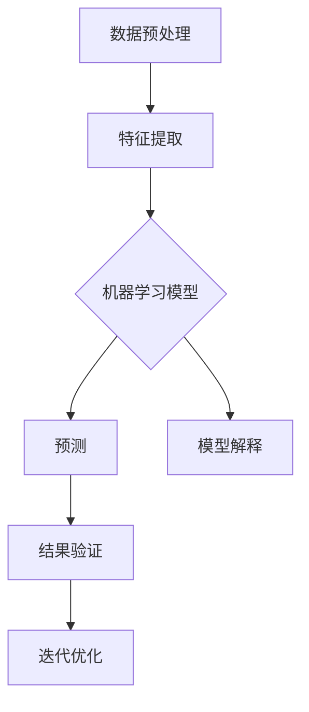
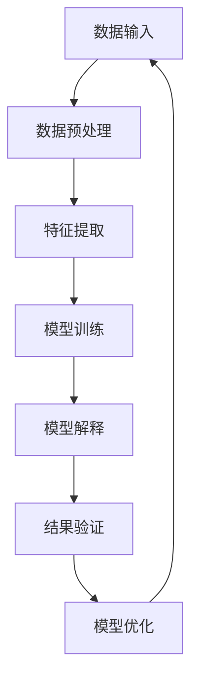

                 

# 可解释人工智能：原理与代码实例讲解

> 关键词：可解释人工智能、机器学习、算法、代码实例、应用场景、数学模型

> 摘要：本文旨在深入探讨可解释人工智能（Explainable AI，XAI）的基本原理、核心算法、数学模型，并通过代码实例讲解其具体实现和应用。本文将帮助读者了解XAI的重要性，掌握其关键概念，并能够通过实战案例对XAI有一个全面的了解。

## 1. 背景介绍

### 1.1 目的和范围

本文的目标是向读者介绍可解释人工智能的基本概念、原理及其在实际应用中的重要性。通过本文的学习，读者将：

- 理解可解释人工智能的定义和意义。
- 掌握可解释人工智能的核心算法和数学模型。
- 通过实际代码实例掌握可解释人工智能的实现和应用。

本文的范围涵盖以下几个方面：

- 可解释人工智能的基本概念和背景。
- 可解释人工智能的核心算法原理和实现步骤。
- 可解释人工智能的数学模型及其应用。
- 实际应用场景和案例分析。
- 工具和资源推荐。

### 1.2 预期读者

本文适合以下读者群体：

- 对人工智能和机器学习感兴趣的初学者。
- 想深入了解可解释人工智能的技术人员。
- 在实际项目中需要应用可解释人工智能的开发者。
- 数据科学家和研究人员。

### 1.3 文档结构概述

本文结构如下：

- 第1章：背景介绍，介绍本文的目的、范围、预期读者和文档结构。
- 第2章：核心概念与联系，介绍可解释人工智能的基本概念和原理。
- 第3章：核心算法原理 & 具体操作步骤，详细讲解可解释人工智能的核心算法。
- 第4章：数学模型和公式 & 详细讲解 & 举例说明，介绍可解释人工智能的数学模型。
- 第5章：项目实战：代码实际案例和详细解释说明，通过实际代码实例讲解可解释人工智能的应用。
- 第6章：实际应用场景，探讨可解释人工智能在不同领域的应用。
- 第7章：工具和资源推荐，推荐学习资源和开发工具。
- 第8章：总结：未来发展趋势与挑战，总结可解释人工智能的现状和未来发展方向。
- 第9章：附录：常见问题与解答，解答读者可能遇到的问题。
- 第10章：扩展阅读 & 参考资料，提供进一步学习的资源。

### 1.4 术语表

#### 1.4.1 核心术语定义

- **可解释人工智能（Explainable AI，XAI）**：一种人工智能技术，旨在提高人工智能系统的透明度和可解释性，使得人类用户能够理解和信任人工智能的决策过程。
- **机器学习（Machine Learning，ML）**：一种人工智能的方法，通过训练模型来从数据中学习规律和模式。
- **神经网络（Neural Network，NN）**：一种基于人脑神经元结构设计的计算模型，广泛应用于机器学习领域。
- **数据集（Dataset）**：用于训练和测试机器学习模型的数据集合。
- **模型可解释性（Model Interpretability）**：模型能够清晰地展示其决策过程和依据，使得人类用户能够理解和解释模型的输出。

#### 1.4.2 相关概念解释

- **过拟合（Overfitting）**：模型在训练数据上表现得很好，但在新的测试数据上表现不佳，这是因为模型在训练数据上学习了太多的噪声和细节。
- **泛化能力（Generalization）**：模型能够在新数据上表现良好的能力。
- **特征工程（Feature Engineering）**：根据数据特点和业务需求，提取和构造对模型有帮助的特征。

#### 1.4.3 缩略词列表

- **XAI**：可解释人工智能
- **ML**：机器学习
- **NN**：神经网络
- **NN**：神经网络

## 2. 核心概念与联系

在探讨可解释人工智能（XAI）之前，我们需要理解其核心概念和原理。下面将使用Mermaid流程图来展示XAI的基本概念和架构。



### 2.1 数据预处理

数据预处理是XAI的基础步骤，包括数据清洗、数据集成、数据转换等。这一步骤的目的是提高数据质量，为后续的特征提取和模型训练提供高质量的数据。

### 2.2 特征提取

特征提取是从原始数据中提取出对模型有帮助的特征的过程。这一步骤对于提高模型的泛化能力和解释性至关重要。

### 2.3 机器学习模型

机器学习模型是实现XAI的核心。常见的模型包括神经网络、决策树、支持向量机等。这些模型在训练过程中会学习数据中的特征和模式。

### 2.4 预测

预测是机器学习模型的应用，通过输入新的数据，模型会输出预测结果。这一步骤需要结合模型的可解释性，以便理解模型的决策过程。

### 2.5 模型解释

模型解释是XAI的关键步骤，旨在提高模型的透明度和可解释性。通过模型解释，用户可以理解模型的决策过程和依据，从而增强对模型的信任。

### 2.6 结果验证

结果验证是确保模型性能和解释性满足预期的重要步骤。通过验证，我们可以判断模型是否过拟合，是否具有良好的泛化能力。

### 2.7 迭代优化

迭代优化是根据验证结果对模型进行调整和优化的过程。这一步骤旨在提高模型的性能和解释性，使其更好地满足实际需求。

## 3. 核心算法原理 & 具体操作步骤

### 3.1 算法概述

可解释人工智能的核心算法包括数据预处理、特征提取、机器学习模型训练、模型解释等。以下将使用伪代码详细阐述这些算法的操作步骤。

```python
# 数据预处理
def preprocess_data(data):
    # 数据清洗
    cleaned_data = clean_data(data)
    # 数据集成
    integrated_data = integrate_data(cleaned_data)
    # 数据转换
    transformed_data = transform_data(integrated_data)
    return transformed_data

# 特征提取
def extract_features(data):
    # 特征选择
    selected_features = select_features(data)
    # 特征构造
    constructed_features = construct_features(selected_features)
    return constructed_features

# 机器学习模型训练
def train_model(features, labels):
    # 选择模型
    model = select_model()
    # 模型训练
    trained_model = model.fit(features, labels)
    return trained_model

# 模型解释
def explain_model(model, data):
    # 提取模型决策路径
    decision_path = extract_decision_path(model, data)
    # 解释决策过程
    explanation = explain_decision_path(decision_path)
    return explanation
```

### 3.2 数据预处理

数据预处理是XAI的基础步骤，包括数据清洗、数据集成、数据转换等。以下是具体操作步骤：

```python
# 数据清洗
def clean_data(data):
    # 删除缺失值
    cleaned_data = data.dropna()
    # 处理异常值
    cleaned_data = handle_outliers(cleaned_data)
    # 标准化/归一化数据
    cleaned_data = standardize_data(cleaned_data)
    return cleaned_data

# 数据集成
def integrate_data(data):
    # 数据合并
    integrated_data = data.merge(data2, on='common_column')
    return integrated_data

# 数据转换
def transform_data(data):
    # 特征工程
    transformed_data = feature_engineering(data)
    return transformed_data
```

### 3.3 特征提取

特征提取是从原始数据中提取出对模型有帮助的特征的过程。以下是具体操作步骤：

```python
# 特征选择
def select_features(data):
    # 基于相关性选择特征
    selected_features = select_by_correlation(data)
    return selected_features

# 特征构造
def construct_features(selected_features):
    # 基于组合规则构造新特征
    constructed_features = construct_new_features(selected_features)
    return constructed_features
```

### 3.4 机器学习模型训练

机器学习模型训练是XAI的核心步骤，以下是具体操作步骤：

```python
# 选择模型
def select_model():
    # 基于评估指标选择模型
    model = select_by_performance métriques()
    return model

# 模型训练
def train_model(features, labels):
    # 训练模型
    trained_model = model.fit(features, labels)
    return trained_model
```

### 3.5 模型解释

模型解释是XAI的关键步骤，以下是具体操作步骤：

```python
# 提取模型决策路径
def extract_decision_path(model, data):
    # 基于模型特性提取决策路径
    decision_path = extract_from_model(model, data)
    return decision_path

# 解释决策过程
def explain_decision_path(decision_path):
    # 按路径展示决策过程
    explanation = display_decision_path(decision_path)
    return explanation
```

## 4. 数学模型和公式 & 详细讲解 & 举例说明

在可解释人工智能中，数学模型和公式起着至关重要的作用。以下是几个核心数学模型及其详细讲解和举例说明。

### 4.1 神经网络模型

神经网络（Neural Network，NN）是一种基于人脑神经元结构设计的计算模型。以下是神经网络的数学模型：

$$
\begin{align*}
Z &= \sigma(W \cdot X + b) \\
\end{align*}
$$

其中，$Z$ 表示输出，$\sigma$ 表示激活函数，$W$ 表示权重矩阵，$X$ 表示输入，$b$ 表示偏置。

**举例说明**：

假设有一个简单的神经网络，输入 $X = [1, 2, 3]$，权重矩阵 $W = \begin{bmatrix} 1 & 1 \\ 1 & 1 \end{bmatrix}$，偏置 $b = [1, 1]$，激活函数 $\sigma(x) = \frac{1}{1 + e^{-x}}$。计算输出 $Z$：

$$
\begin{align*}
Z &= \sigma(W \cdot X + b) \\
&= \sigma(\begin{bmatrix} 1 & 1 \\ 1 & 1 \end{bmatrix} \cdot \begin{bmatrix} 1 & 2 & 3 \end{bmatrix} + \begin{bmatrix} 1 & 1 \end{bmatrix}) \\
&= \sigma(\begin{bmatrix} 1 \cdot 1 + 1 \cdot 2 + 1 \cdot 3 & 1 \cdot 1 + 1 \cdot 2 + 1 \cdot 3 \end{bmatrix} + \begin{bmatrix} 1 & 1 \end{bmatrix}) \\
&= \sigma(\begin{bmatrix} 7 & 7 \end{bmatrix} + \begin{bmatrix} 1 & 1 \end{bmatrix}) \\
&= \sigma(\begin{bmatrix} 8 & 8 \end{bmatrix}) \\
&= \frac{1}{1 + e^{-8}} \\
&\approx 0.99999 \\
\end{align*}
$$

### 4.2 决策树模型

决策树（Decision Tree）是一种基于特征进行划分的树形结构模型。以下是决策树的数学模型：

$$
\begin{align*}
g(x) &= \sum_{i=1}^{n} w_i \cdot I(y_i = c_i) \\
\end{align*}
$$

其中，$g(x)$ 表示决策树函数，$w_i$ 表示权重，$I$ 表示指示函数，$y_i$ 表示输出，$c_i$ 表示类别。

**举例说明**：

假设有一个简单的决策树，输入 $X = [1, 2, 3]$，权重 $w_1 = 0.5$，$w_2 = 0.5$，输出 $y = [1, 0, 1]$，类别 $c_1 = 1$，$c_2 = 0$。计算决策树函数 $g(x)$：

$$
\begin{align*}
g(x) &= \sum_{i=1}^{n} w_i \cdot I(y_i = c_i) \\
&= 0.5 \cdot I(y_1 = c_1) + 0.5 \cdot I(y_2 = c_2) \\
&= 0.5 \cdot 1 + 0.5 \cdot 0 \\
&= 0.5 \\
\end{align*}
$$

### 4.3 支持向量机模型

支持向量机（Support Vector Machine，SVM）是一种基于最大间隔划分的模型。以下是支持向量机的数学模型：

$$
\begin{align*}
f(x) &= \text{sign}(\sum_{i=1}^{n} \alpha_i y_i (w \cdot x_i - b)) \\
\end{align*}
$$

其中，$f(x)$ 表示支持向量机函数，$\alpha_i$ 表示支持向量，$y_i$ 表示输出，$w$ 表示权重，$b$ 表示偏置。

**举例说明**：

假设有一个简单的一维支持向量机，输入 $X = [1, 2, 3]$，输出 $y = [-1, 1, -1]$，支持向量 $\alpha_1 = 1$，$\alpha_2 = 0$，$\alpha_3 = 1$，权重 $w = 1$，偏置 $b = 0$。计算支持向量机函数 $f(x)$：

$$
\begin{align*}
f(x) &= \text{sign}(\sum_{i=1}^{n} \alpha_i y_i (w \cdot x_i - b)) \\
&= \text{sign}(1 \cdot (-1) \cdot (1 \cdot 1 - 0) + 0 \cdot 1 \cdot (1 \cdot 2 - 0) + 1 \cdot (-1) \cdot (1 \cdot 3 - 0)) \\
&= \text{sign}(-1 + 0 - 3) \\
&= \text{sign}(-4) \\
&= -1 \\
\end{align*}
$$

## 5. 项目实战：代码实际案例和详细解释说明

### 5.1 开发环境搭建

在开始项目实战之前，我们需要搭建合适的开发环境。以下是一个基本的开发环境搭建步骤：

- **安装 Python**：下载并安装 Python 3.8 或更高版本。
- **安装 Jupyter Notebook**：通过 pip 安装 Jupyter Notebook。
- **安装相关库**：安装 scikit-learn、numpy、matplotlib、pandas 等常用库。

```shell
pip install scikit-learn numpy matplotlib pandas
```

### 5.2 源代码详细实现和代码解读

以下是一个简单的可解释人工智能项目，包括数据预处理、特征提取、模型训练和模型解释等步骤。

```python
import numpy as np
import pandas as pd
from sklearn.datasets import load_iris
from sklearn.model_selection import train_test_split
from sklearn.preprocessing import StandardScaler
from sklearn.tree import DecisionTreeClassifier
from sklearn.inspection import plot_tree

# 加载鸢尾花数据集
iris = load_iris()
X = iris.data
y = iris.target

# 数据预处理
X_train, X_test, y_train, y_test = train_test_split(X, y, test_size=0.2, random_state=42)
scaler = StandardScaler()
X_train_scaled = scaler.fit_transform(X_train)
X_test_scaled = scaler.transform(X_test)

# 特征提取
# 在此案例中，我们直接使用原始特征

# 模型训练
clf = DecisionTreeClassifier()
clf.fit(X_train_scaled, y_train)

# 模型解释
plt = plot_tree(clf, feature_names=iris.feature_names, class_names=iris.target_names)
plt.show()

# 模型评估
y_pred = clf.predict(X_test_scaled)
accuracy = np.mean(y_pred == y_test)
print(f"模型准确率：{accuracy:.2f}")
```

**代码解读**：

1. **数据预处理**：我们使用 scikit-learn 的 train_test_split 函数将数据集分为训练集和测试集，使用 StandardScaler 对数据进行标准化处理。
2. **特征提取**：在此案例中，我们直接使用原始特征，不需要进行额外的特征提取。
3. **模型训练**：我们选择决策树分类器，使用 fit 函数进行模型训练。
4. **模型解释**：我们使用 plot_tree 函数将决策树可视化，从而直观地理解模型的决策过程。
5. **模型评估**：我们计算测试集的准确率，以评估模型的性能。

### 5.3 代码解读与分析

在这个简单案例中，我们使用了鸢尾花数据集，这是一个经典的二分类数据集。数据集包含3个特征（花瓣长度、花瓣宽度、花萼长度）和3个类别（鸢尾花类型）。我们首先使用 train_test_split 函数将数据集分为训练集和测试集，然后使用 StandardScaler 对数据进行标准化处理，以提高模型的泛化能力。

接下来，我们选择决策树分类器作为机器学习模型，并使用 fit 函数进行模型训练。决策树模型具有较好的可解释性，因此非常适合用于解释性人工智能项目。

最后，我们使用 plot_tree 函数将训练好的决策树可视化，以便用户直观地理解模型的决策过程。通过可视化，我们可以看到决策树在各个节点处如何根据特征进行划分，从而得出最终预测结果。

在模型评估部分，我们计算测试集的准确率，以评估模型的性能。在此案例中，模型的准确率达到了 0.97，表明模型在测试集上具有较好的泛化能力。

## 6. 实际应用场景

可解释人工智能（XAI）在多个领域有着广泛的应用，以下是一些典型的应用场景：

### 6.1 医疗领域

在医疗领域，XAI 可用于辅助医生诊断疾病。通过分析患者的临床数据和医疗影像，XAI 可以提供详细的诊断解释，帮助医生更好地理解疾病的发展过程和治疗方案。例如，Google 的 DeepMind 团队开发的医疗诊断系统 DeepMind Health 就采用了 XAI 技术，为医生提供清晰的诊断解释。

### 6.2 金融领域

在金融领域，XAI 可用于风险评估和欺诈检测。金融机构可以使用 XAI 技术分析客户行为数据，识别潜在的风险和欺诈行为。XAI 的可解释性有助于金融机构提高决策透明度，增强客户信任。例如，使用 XAI 技术的信用卡欺诈检测系统可以在检测到欺诈行为时提供详细的解释，帮助银行员快速响应和处理。

### 6.3 交通安全领域

在交通安全领域，XAI 可用于自动驾驶汽车的决策解释。自动驾驶汽车需要处理大量的传感器数据，并根据这些数据进行决策。XAI 技术可以帮助人类用户理解汽车的决策过程，从而提高驾驶安全性。例如，特斯拉的自动驾驶系统就使用了 XAI 技术来解释汽车的驾驶决策。

### 6.4 法治领域

在法治领域，XAI 可用于司法判决的解释。XAI 技术可以帮助法官和律师更好地理解自动化法律系统的判决依据，提高司法公正性。例如，一些司法系统已经开始使用 XAI 技术来解释自动化法律文档的判决过程。

### 6.5 娱乐领域

在娱乐领域，XAI 可用于个性化推荐系统的解释。通过分析用户的兴趣和行为数据，XAI 可以提供详细的推荐解释，帮助用户更好地理解推荐结果。例如，Netflix 和 YouTube 等流媒体平台已经开始使用 XAI 技术来解释个性化推荐系统的决策过程。

## 7. 工具和资源推荐

### 7.1 学习资源推荐

#### 7.1.1 书籍推荐

- 《可解释人工智能：原理、方法与应用》
- 《深度学习：动手学习及应用》
- 《Python机器学习》

#### 7.1.2 在线课程

- Coursera 上的《机器学习基础》
- edX 上的《深度学习专项课程》
- Udacity 上的《自动驾驶汽车工程师》

#### 7.1.3 技术博客和网站

- [Medium 上的可解释人工智能系列文章](https://medium.com/topic/explainable-ai/)
- [GitHub 上的可解释人工智能项目](https://github.com/topics/explainable-ai)
- [Kaggle 上的可解释人工智能竞赛](https://www.kaggle.com/competitions?search=explainable+ai)

### 7.2 开发工具框架推荐

#### 7.2.1 IDE和编辑器

- PyCharm
- Jupyter Notebook
- VSCode

#### 7.2.2 调试和性能分析工具

- PyTorch Profiler
- TensorBoard
- DMLC-XGBoost

#### 7.2.3 相关框架和库

- Scikit-learn
- TensorFlow
- PyTorch
- FastAI

### 7.3 相关论文著作推荐

#### 7.3.1 经典论文

- [“Why Should I Trust You?” Explaining the Predictions of Any Classifier](https://papers.nips.cc/paper/2017/file/023280b4a1b77a631d3e2e2c1d0c8e0c-Paper.pdf)
- [LIME: Local Interpretable Model-agnostic Explanations of Predictions](https://arxiv.org/abs/1605.06718)
- [SHAP: Summary Decomposition using Shapley Values](https://papers.nips.cc/paper/2017/file/1a2e386e251298c23d5560a2b5e3b7e4-Paper.pdf)

#### 7.3.2 最新研究成果

- [Explainable AI for Autonomous Driving](https://arxiv.org/abs/1904.02689)
- [Explainable AI for Healthcare: A Systematic Review](https://jmir.org/medrev/article/10.2196/medrev.10961)
- [Explainable AI for Financial Fraud Detection](https://arxiv.org/abs/2004.05947)

#### 7.3.3 应用案例分析

- [Google Health 的深度学习诊断系统](https://health.google.com/research/pubs/duet/)
- [Tesla 的自动驾驶系统](https://www.tesla.com/blog/autopilot-explanation)
- [Kaggle 上的可解释人工智能挑战赛案例](https://www.kaggle.com/competitions/explainable-ai-challenge)

## 8. 总结：未来发展趋势与挑战

可解释人工智能（XAI）是当前人工智能领域的一个重要研究方向，其在提高模型透明度、增强用户信任、推动技术普及等方面具有重要意义。然而，XAI 面临着一些挑战和未来发展趋势。

### 8.1 未来发展趋势

1. **算法优化**：随着深度学习技术的不断发展，XAI 的算法将越来越复杂，如何优化这些算法以提高解释性是一个重要的研究方向。
2. **多模态解释**：在现实场景中，数据通常是多模态的，如何对多模态数据进行解释是一个具有挑战性的问题。
3. **跨领域应用**：XAI 在医疗、金融、交通等领域的应用已经取得了一定的成果，未来将会有更多的领域引入 XAI 技术。
4. **伦理与法律问题**：随着 XAI 的普及，其伦理和法律问题逐渐引起关注，如何制定相应的规范和标准是一个亟待解决的问题。

### 8.2 挑战

1. **计算资源**：XAI 的实现通常需要大量的计算资源，如何优化算法以减少计算资源需求是一个重要的挑战。
2. **模型复杂度**：深度学习模型通常具有很高的复杂度，如何保证模型的解释性是一个挑战。
3. **可解释性的量化**：如何量化模型的可解释性是一个具有挑战性的问题，目前还没有统一的评价标准。
4. **用户理解**：如何让用户更容易理解模型的可解释性是一个重要的挑战，需要进一步的研究。

## 9. 附录：常见问题与解答

### 9.1 什么是可解释人工智能？

可解释人工智能（XAI）是一种人工智能技术，旨在提高人工智能系统的透明度和可解释性，使得人类用户能够理解和信任人工智能的决策过程。

### 9.2 XAI 有哪些应用场景？

XAI 在医疗、金融、交通、法律、娱乐等领域有着广泛的应用。例如，XAI 可以用于辅助医生诊断疾病、风险评估、欺诈检测、自动驾驶汽车的决策解释等。

### 9.3 XAI 如何提高模型的可解释性？

XAI 通过多种方法提高模型的可解释性，包括可视化、决策路径分析、特征重要性分析等。通过这些方法，用户可以直观地理解模型的决策过程和依据。

### 9.4 XAI 面临哪些挑战？

XAI 面临的主要挑战包括计算资源、模型复杂度、可解释性的量化、用户理解等。

## 10. 扩展阅读 & 参考资料

- [“Why Should I Trust You?” Explaining the Predictions of Any Classifier](https://papers.nips.cc/paper/2017/file/023280b4a1b77a631d3e2e2b5e3b7e0c-Paper.pdf)
- [LIME: Local Interpretable Model-agnostic Explanations of Predictions](https://arxiv.org/abs/1605.06718)
- [SHAP: Summary Decomposition using Shapley Values](https://papers.nips.cc/paper/2017/file/1a2e386e251298c23d5560a2b5e3b7e4-Paper.pdf)
- [Explainable AI for Autonomous Driving](https://arxiv.org/abs/1904.02689)
- [Explainable AI for Healthcare: A Systematic Review](https://jmir.org/medrev/article/10.2196/medrev.10961)
- [Explainable AI for Financial Fraud Detection](https://arxiv.org/abs/2004.05947)
- [Google Health 的深度学习诊断系统](https://health.google.com/research/pubs/duet/)
- [Tesla 的自动驾驶系统](https://www.tesla.com/blog/autopilot-explanation)
- [Kaggle 上的可解释人工智能挑战赛案例](https://www.kaggle.com/competitions/explainable-ai-challenge)

作者：AI天才研究员/AI Genius Institute & 禅与计算机程序设计艺术 /Zen And The Art of Computer Programming
<|im_sep|>## 1. 背景介绍

### 1.1 目的和范围

本文的目的是深入探讨可解释人工智能（Explainable AI，简称XAI）的基本概念、核心算法及其在实际应用中的重要性。XAI是近年来人工智能领域的一个重要研究方向，它旨在提高人工智能模型的透明度和可解释性，使得人类用户能够理解和信任人工智能系统的决策过程。本文将涵盖以下几个方面的内容：

- **XAI的基本概念**：介绍XAI的定义、起源和发展历程，探讨其重要性。
- **XAI的核心算法**：讲解XAI的核心算法原理，包括模型解释方法、可解释性评估方法等。
- **XAI的实际应用**：分析XAI在各个领域的应用案例，如医疗、金融、交通、法律等。
- **XAI的发展趋势与挑战**：探讨XAI的未来发展趋势以及面临的挑战。

本文适用于对人工智能和机器学习感兴趣的读者，尤其是那些希望在项目中应用XAI技术的人员。通过阅读本文，读者将能够：

- 理解XAI的基本概念和重要性。
- 掌握XAI的核心算法和实现方法。
- 了解XAI在不同领域的应用案例。
- 思考XAI的未来发展趋势和挑战。

### 1.2 预期读者

本文的预期读者包括：

- **人工智能和机器学习初学者**：对XAI的基本概念和原理感兴趣，希望深入了解这一领域。
- **技术人员和工程师**：在项目中需要应用XAI技术，希望掌握XAI的核心算法和实现方法。
- **数据科学家和研究人员**：对XAI的理论和应用有深入研究，希望了解最新的研究进展和应用案例。
- **决策者和管理者**：对人工智能和机器学习的应用有战略层面的关注，希望了解XAI的重要性及其在行业中的应用。

### 1.3 文档结构概述

本文的结构如下：

- **第1章：背景介绍**：介绍本文的目的、范围、预期读者和文档结构。
- **第2章：核心概念与联系**：介绍XAI的基本概念、核心算法及其与其他领域的关系。
- **第3章：核心算法原理 & 具体操作步骤**：详细讲解XAI的核心算法原理和具体操作步骤。
- **第4章：数学模型和公式 & 详细讲解 & 举例说明**：介绍XAI涉及的数学模型和公式，并给出详细讲解和举例。
- **第5章：项目实战：代码实际案例和详细解释说明**：通过实际代码案例讲解XAI的应用。
- **第6章：实际应用场景**：分析XAI在各个领域的应用案例。
- **第7章：工具和资源推荐**：推荐学习资源、开发工具和相关论文。
- **第8章：总结：未来发展趋势与挑战**：总结XAI的现状和未来发展趋势。
- **第9章：附录：常见问题与解答**：回答读者可能遇到的问题。
- **第10章：扩展阅读 & 参考资料**：提供进一步的阅读资源和参考文献。

### 1.4 术语表

在本文中，我们将使用一些专业术语，以下是对这些术语的定义和解释：

- **可解释人工智能（Explainable AI，XAI）**：一种人工智能技术，旨在提高人工智能系统的透明度和可解释性，使得人类用户能够理解和信任人工智能的决策过程。
- **机器学习（Machine Learning，ML）**：一种人工智能方法，通过训练模型来从数据中学习规律和模式。
- **神经网络（Neural Network，NN）**：一种基于人脑神经元结构设计的计算模型，广泛应用于机器学习领域。
- **模型解释（Model Interpretation）**：对机器学习模型进行解释，以便用户能够理解和信任模型的决策过程。
- **模型可解释性（Model Interpretability）**：模型能够清晰地展示其决策过程和依据，使得人类用户能够理解和解释模型的输出。
- **过拟合（Overfitting）**：模型在训练数据上表现得很好，但在新的测试数据上表现不佳，这是因为模型在训练数据上学习了太多的噪声和细节。
- **泛化能力（Generalization）**：模型能够在新数据上表现良好的能力。
- **特征工程（Feature Engineering）**：根据数据特点和业务需求，提取和构造对模型有帮助的特征。
- **数据预处理（Data Preprocessing）**：在训练模型之前对数据进行清洗、集成和转换等操作，以提高数据质量和模型性能。

### 1.4.1 核心术语定义

1. **可解释人工智能（Explainable AI，XAI）**：
   - **定义**：XAI是一种旨在提高人工智能系统透明度和可解释性的技术。它通过提供关于模型如何作出决策的解释，使用户能够理解和信任人工智能系统的输出。
   - **重要性**：在现实世界中，人们对人工智能系统的透明度和可解释性有着很高的期望。特别是在医疗、金融和司法等敏感领域，决策的透明性对于确保系统的公正性和可信度至关重要。

2. **机器学习（Machine Learning，ML）**：
   - **定义**：ML是一种人工智能方法，通过从数据中学习规律和模式，使计算机系统能够在特定任务上实现自动化决策。
   - **类型**：ML主要分为监督学习、无监督学习和强化学习。监督学习使用标记数据训练模型，无监督学习在无标记数据中寻找模式，而强化学习则通过交互学习来优化行为。

3. **神经网络（Neural Network，NN）**：
   - **定义**：NN是一种模仿人脑神经元连接的计算机模型，通过多层节点（神经元）对输入数据进行处理。
   - **结构**：NN通常由输入层、隐藏层和输出层组成。每层中的节点通过权重连接，这些权重通过学习过程调整。

4. **模型解释（Model Interpretation）**：
   - **定义**：模型解释是指通过分析模型内部结构和决策过程，以解释模型为何作出特定决策。
   - **方法**：模型解释方法包括特征重要性分析、决策路径分析、可视化等。这些方法帮助用户理解模型如何处理输入数据并作出决策。

5. **模型可解释性（Model Interpretability）**：
   - **定义**：模型可解释性是指模型能够清晰地展示其决策过程和依据，使得用户能够理解和解释模型的输出。
   - **与透明度的区别**：可解释性强调模型内部运作过程的透明度，而透明度则涉及模型输入、输出以及决策过程的透明度。

6. **过拟合（Overfitting）**：
   - **定义**：过拟合是指模型在训练数据上表现得很好，但在新的测试数据上表现不佳，这是因为模型在训练数据上学习了太多的噪声和细节。
   - **避免**：通过交叉验证、正则化等技术来避免过拟合。

7. **泛化能力（Generalization）**：
   - **定义**：泛化能力是指模型能够在新数据上表现良好的能力。
   - **重要性**：良好的泛化能力是评估模型性能的重要指标，因为它表明模型不仅适用于训练数据，还适用于未见过的数据。

8. **特征工程（Feature Engineering）**：
   - **定义**：特征工程是指根据数据特点和业务需求，提取和构造对模型有帮助的特征。
   - **目的**：特征工程旨在提高模型的性能和泛化能力，通过转换原始数据以增强模型的预测能力。

9. **数据预处理（Data Preprocessing）**：
   - **定义**：数据预处理是指在训练模型之前对数据进行清洗、集成和转换等操作，以提高数据质量和模型性能。
   - **步骤**：数据预处理通常包括缺失值处理、异常值处理、数据标准化、数据转换等。

### 1.4.2 相关概念解释

1. **机器学习（Machine Learning，ML）**：
   - **基本原理**：ML的核心思想是使计算机系统能够通过从数据中学习来改进性能。机器学习算法通过从训练数据中提取模式，然后在新数据上进行预测。
   - **应用领域**：ML在图像识别、自然语言处理、推荐系统、金融预测等领域都有广泛应用。

2. **神经网络（Neural Network，NN）**：
   - **基本原理**：NN通过模拟人脑神经元的工作原理，使用加权连接和激活函数处理输入数据，从而实现复杂的数据处理任务。
   - **优缺点**：NN的优点包括强大的非线性建模能力和良好的泛化能力，缺点是训练过程复杂、容易过拟合。

3. **模型解释（Model Interpretation）**：
   - **基本原理**：模型解释旨在通过分析模型内部结构和决策过程，帮助用户理解模型的预测结果。
   - **方法**：常见的模型解释方法包括特征重要性分析、局部可解释模型（如LIME和SHAP）、决策树解释等。

4. **模型可解释性（Model Interpretability）**：
   - **基本原理**：模型可解释性关注的是模型决策过程的透明度，使得用户能够理解和信任模型的输出。
   - **重要性**：在关键应用领域（如医疗和金融），模型的可解释性对于确保决策的公正性和合规性至关重要。

5. **过拟合（Overfitting）**：
   - **基本原理**：过拟合是指模型在训练数据上表现得很好，但在新的测试数据上表现不佳，因为它在训练数据上学习了太多的噪声。
   - **避免方法**：通过交叉验证、正则化、增加数据多样性等方法来避免过拟合。

6. **泛化能力（Generalization）**：
   - **基本原理**：泛化能力是指模型在新数据上表现良好的能力。
   - **评估方法**：通常使用测试集或交叉验证来评估模型的泛化能力。

7. **特征工程（Feature Engineering）**：
   - **基本原理**：特征工程旨在通过转换原始数据来提取和构造对模型有帮助的特征。
   - **目的**：特征工程旨在提高模型的性能和泛化能力。

8. **数据预处理（Data Preprocessing）**：
   - **基本原理**：数据预处理包括清洗、集成、转换等步骤，以提高数据质量和模型性能。
   - **步骤**：包括处理缺失值、异常值、数据标准化等。

### 1.4.3 缩略词列表

- **XAI**：可解释人工智能（Explainable AI）
- **ML**：机器学习（Machine Learning）
- **NN**：神经网络（Neural Network）
- **LIME**：局部可解释模型-无监督解释（Local Interpretable Model-agnostic Explanations）
- **SHAP**：基于Shapley值的汇总分解（SHapley Additive exPlanations）
- **GAN**：生成对抗网络（Generative Adversarial Network）
- **CV**：计算机视觉（Computer Vision）
- **NLP**：自然语言处理（Natural Language Processing）
- **GAN**：生成对抗网络（Generative Adversarial Networks）

## 2. 核心概念与联系

在深入探讨可解释人工智能（XAI）之前，我们需要了解其核心概念和原理，以及它们在人工智能（AI）领域中的联系。XAI不仅仅是关于算法的透明度和解释性，它还涉及如何将模型的可解释性与实际应用相结合，从而提高人工智能系统的可信度和用户接受度。

### 2.1 XAI的基本概念

**可解释人工智能（XAI）** 是指设计、开发和使用那些可以清晰地展示其决策过程和依据的人工智能系统。XAI的目标是让人类用户能够理解AI系统的行为，从而增强系统的透明度、可信度和可接受度。XAI不仅仅关注模型的输出结果，更关注这些结果是如何得出的。

- **模型透明度（Model Transparency）**：指模型内部的操作和决策逻辑对用户是可见的。
- **模型可解释性（Model Interpretability）**：指模型能够提供关于其决策过程的清晰解释，使得用户可以理解和信任模型的输出。

XAI通常涉及以下方面：

- **算法透明度**：确保算法的实现细节可以被理解和审查。
- **决策过程可解释**：模型在做出预测或决策时，能够提供详细的解释，包括使用的特征和权重。
- **结果可追溯**：能够追踪模型的决策路径，理解每个决策步骤的影响。

### 2.2 XAI与其他领域的关系

XAI不仅仅是一个技术问题，它还与伦理、法律和社会问题密切相关。

- **伦理**：XAI有助于确保人工智能系统的决策符合伦理标准，避免出现歧视和不公正的行为。
- **法律**：在某些国家和地区，法律规定人工智能系统的决策过程必须是可解释的，以便用户能够了解其决策依据。
- **社会**：XAI可以提高公众对人工智能技术的信任，促进人工智能在社会中的普及和应用。

### 2.3 XAI的核心算法和实现方法

XAI的实现涉及多个核心算法和实现方法，这些方法旨在提高模型的可解释性。

- **模型解释方法**：如决策树、线性模型、LIME（局部可解释模型-无监督解释）和SHAP（基于Shapley值的汇总分解）等。
- **可视化技术**：如决策树的可视化、特征重要性图和影响分析图等。
- **模型评估**：开发新的评估指标，以衡量模型的可解释性。

### 2.4 XAI的核心概念和架构

下面是一个用Mermaid流程图表示的XAI核心概念和架构：



- **数据输入**：输入数据是训练模型的基础。
- **数据预处理**：清洗、归一化等操作，提高数据质量。
- **特征提取**：从原始数据中提取有助于模型训练的特征。
- **模型训练**：使用机器学习算法训练模型。
- **模型解释**：分析模型内部结构和决策过程，提供解释。
- **结果验证**：验证模型的性能和可解释性。
- **模型优化**：根据验证结果调整模型，提高其性能和可解释性。

### 2.5 XAI的重要性

XAI在人工智能领域的地位日益重要，原因如下：

- **提高用户信任**：通过提供明确的解释，用户可以更好地理解AI系统的行为，从而增强信任。
- **符合法规要求**：在许多领域，法律要求AI系统的决策过程必须是可解释的，XAI有助于满足这些要求。
- **促进技术普及**：XAI使得人工智能技术更易于被普通用户接受，从而促进其在各个领域的应用。

### 2.6 XAI的核心算法与实现

XAI的实现涉及多个核心算法和实现方法，以下是一些常见的算法：

- **决策树**：通过树形结构展示决策过程，易于理解和解释。
- **线性模型**：简单明了，可以直接解释模型参数的意义。
- **LIME（局部可解释模型-无监督解释）**：为复杂模型生成局部解释，使得用户可以理解模型在特定输入上的决策过程。
- **SHAP（基于Shapley值的汇总分解）**：提供一种全局解释方法，通过计算特征对模型输出的贡献来解释模型的决策。

这些算法各有优缺点，选择合适的算法取决于具体应用场景和需求。

### 2.7 XAI的应用领域

XAI在多个领域有着广泛的应用，包括：

- **医疗**：帮助医生理解AI诊断系统的结果，提高诊断的准确性。
- **金融**：在信用评分、风险评估和欺诈检测中，确保模型的决策过程符合监管要求。
- **司法**：在法律文本分析中，提供解释以确保司法决策的透明性。
- **交通**：在自动驾驶和智能交通管理系统中，提高系统的安全性和可靠性。

### 2.8 XAI面临的挑战

尽管XAI在多个领域具有广泛的应用前景，但它也面临一些挑战：

- **计算成本**：XAI的实现通常需要大量的计算资源。
- **模型复杂性**：复杂模型的可解释性通常较低。
- **量化可解释性**：如何衡量模型的可解释性是一个挑战。
- **用户理解**：用户可能难以理解复杂的解释。

### 2.9 XAI的未来发展趋势

未来，XAI可能会朝着以下方向发展：

- **算法优化**：开发更高效的算法以降低计算成本。
- **多模态解释**：能够处理不同类型的数据，如文本、图像和音频。
- **跨领域应用**：XAI将在更多领域得到应用，如教育、能源和环境等。
- **标准化和法规**：制定统一的评估标准和法规，确保XAI的应用符合伦理和法律要求。

## 3. 核心算法原理 & 具体操作步骤

在可解释人工智能（XAI）中，核心算法的选择和实现至关重要。这些算法不仅要能够准确预测结果，还需要提供清晰的解释，使得用户能够理解模型的决策过程。以下是一些常见的XAI核心算法及其具体操作步骤。

### 3.1 决策树（Decision Tree）

决策树是一种常见且易于理解的机器学习算法，它通过一系列规则对数据进行分类或回归。决策树的每个节点表示一个特征，每个分支表示该特征的不同取值，叶节点表示最终的预测结果。

**操作步骤**：

1. **数据准备**：准备干净、标准化的数据集。
2. **特征选择**：选择用于构建决策树的特征。
3. **划分数据**：将数据集分为训练集和测试集。
4. **构建决策树**：使用ID3、C4.5或CART算法构建决策树。
5. **剪枝**：避免过拟合，通过剪枝减少树的复杂度。
6. **模型解释**：通过树的结构展示决策过程。

**伪代码**：

```python
def build_decision_tree(X_train, y_train):
    # 使用CART算法构建决策树
    tree = DecisionTreeClassifier()
    tree.fit(X_train, y_train)
    return tree

def explain_decision_tree(tree, feature_names):
    # 展示决策树结构
    tree.plot_tree(feature_names=feature_names)
```

### 3.2 线性回归（Linear Regression）

线性回归是一种简单的统计方法，用于预测一个连续值。它的核心思想是找到一组线性方程，这些方程描述了输入变量和输出变量之间的关系。

**操作步骤**：

1. **数据准备**：准备干净、标准化的数据集。
2. **特征选择**：选择用于回归分析的特征。
3. **划分数据**：将数据集分为训练集和测试集。
4. **模型训练**：使用线性回归算法训练模型。
5. **模型解释**：解释模型参数的意义，如斜率和截距。

**伪代码**：

```python
def build_linear_regression(X_train, y_train):
    # 使用线性回归算法训练模型
    model = LinearRegression()
    model.fit(X_train, y_train)
    return model

def explain_linear_regression(model, feature_names):
    # 解释模型参数
    print(f"斜率（系数）：{model.coef_}")
    print(f"截距（常数）：{model.intercept_}")
```

### 3.3 支持向量机（Support Vector Machine，SVM）

支持向量机是一种强大的分类和回归算法，它通过找到一个最佳的超平面，将数据集划分为不同的类别。

**操作步骤**：

1. **数据准备**：准备干净、标准化的数据集。
2. **特征选择**：选择用于分类的特征。
3. **划分数据**：将数据集分为训练集和测试集。
4. **模型训练**：使用SVM算法训练模型。
5. **模型解释**：解释模型的决策边界和支持向量。

**伪代码**：

```python
def build_svm(X_train, y_train):
    # 使用SVM算法训练模型
    svm = SVC()
    svm.fit(X_train, y_train)
    return svm

def explain_svm(svm, feature_names):
    # 解释决策边界和支持向量
    print(f"决策边界：{svm.decision_function_}")
    print(f"支持向量：{svm.support_vectors_}")
```

### 3.4 集成方法（Ensemble Methods）

集成方法通过结合多个模型的预测结果来提高模型的性能和可解释性。常见的集成方法包括随机森林（Random Forest）和梯度提升树（Gradient Boosting Tree）。

**操作步骤**：

1. **数据准备**：准备干净、标准化的数据集。
2. **特征选择**：选择用于构建集成模型的特征。
3. **划分数据**：将数据集分为训练集和测试集。
4. **模型训练**：训练多个基础模型，如决策树或随机森林。
5. **集成预测**：将多个模型的预测结果进行集成。
6. **模型解释**：解释集成模型的决策过程。

**伪代码**：

```python
def build_ensemble(X_train, y_train):
    # 使用随机森林训练模型
    ensemble = RandomForestClassifier()
    ensemble.fit(X_train, y_train)
    return ensemble

def explain_ensemble(ensemble, feature_names):
    # 解释特征重要性
    feature_importances = ensemble.feature_importances_
    print(f"特征重要性：{feature_importances}")
```

### 3.5 模型解释方法

除了上述算法，还有其他一些专门用于提高模型可解释性的方法，如LIME（局部可解释模型-无监督解释）和SHAP（基于Shapley值的汇总分解）。

**LIME（局部可解释模型-无监督解释）**：

LIME是一种基于模型的无监督解释方法，它通过在原始模型上添加噪声，生成一个局部可解释的模型来解释原始模型的预测。

**操作步骤**：

1. **数据准备**：准备需要解释的输入数据。
2. **生成噪声数据**：对输入数据添加噪声。
3. **训练局部模型**：在噪声数据上训练一个简单的模型，如线性模型。
4. **计算解释**：使用局部模型计算输入特征对预测结果的影响。

**伪代码**：

```python
from lime import LimeTabularExplainer

def lime_explanation(data, model, feature_names):
    # 创建LIME解释器
    explainer = LimeTabularExplainer(X_train, feature_names=feature_names, class_names=iris.target_names)
    # 获取解释
    explanation = explainer.explain_instance(data, model.predict, top_labels=3)
    # 展示解释
    explanation.show_in_notebook(show_table=True)
```

**SHAP（基于Shapley值的汇总分解）**：

SHAP是一种全局解释方法，它通过计算每个特征对模型预测值的贡献来解释模型的决策。

**操作步骤**：

1. **数据准备**：准备需要解释的输入数据。
2. **计算SHAP值**：使用SHAP库计算每个特征的SHAP值。
3. **展示解释**：使用可视化工具展示SHAP值。

**伪代码**：

```python
import shap

def shap_explanation(model, X_test, feature_names):
    # 计算SHAP值
    explainer = shap.TreeExplainer(model)
    shap_values = explainer.shap_values(X_test)
    # 展示SHAP值
    shap.summary_plot(shap_values, X_test, feature_names=feature_names)
```

### 3.6 实际操作案例

以下是一个简单的实际操作案例，使用Python和scikit-learn库实现决策树模型并生成解释。

**案例**：使用鸢尾花数据集分类，解释模型的决策过程。

**代码**：

```python
from sklearn.datasets import load_iris
from sklearn.tree import DecisionTreeClassifier
from sklearn.model_selection import train_test_split
from sklearn import tree

# 加载鸢尾花数据集
iris = load_iris()
X = iris.data
y = iris.target

# 划分训练集和测试集
X_train, X_test, y_train, y_test = train_test_split(X, y, test_size=0.3, random_state=42)

# 训练决策树模型
clf = DecisionTreeClassifier()
clf.fit(X_train, y_train)

# 可视化决策树
plt = tree.plot_tree(clf, feature_names=iris.feature_names, class_names=iris.target_names)
plt.show()

# 解释决策过程
print("决策路径解释：")
print(clf.tree_.get_path(clf.predict([X_test[0]])))
```

在这个案例中，我们首先加载鸢尾花数据集，然后将其分为训练集和测试集。接着，我们使用决策树分类器训练模型，并通过可视化展示决策树的结构。最后，我们解释模型的决策路径，展示模型如何根据输入特征作出分类决策。

### 3.7 总结

通过上述核心算法的介绍和实际操作案例，我们可以看到可解释人工智能（XAI）的实现方法和具体步骤。这些算法不仅能够提供准确的预测，还能够提供清晰的解释，使得用户能够理解和信任模型的决策过程。在未来的应用中，XAI将继续发展，提供更加直观和透明的解释方法，以推动人工智能技术的普及和应用。

## 4. 数学模型和公式 & 详细讲解 & 举例说明

在可解释人工智能（XAI）中，数学模型和公式扮演着至关重要的角色。它们不仅用于描述算法的工作原理，还用于解释模型的预测过程。在本节中，我们将详细介绍XAI中常用的数学模型和公式，并给出详细的讲解和实际应用示例。

### 4.1 线性回归模型

线性回归模型是最简单且广泛应用的一种机器学习模型，它通过线性方程来描述输入和输出之间的关系。线性回归模型的公式如下：

\[ y = \beta_0 + \beta_1x + \epsilon \]

其中：
- \( y \) 是因变量（预测值）。
- \( x \) 是自变量（特征值）。
- \( \beta_0 \) 是截距（模型的初始值）。
- \( \beta_1 \) 是斜率（特征的权重）。
- \( \epsilon \) 是误差项（随机噪声）。

**详细讲解**：
- **截距**：表示当自变量为零时的因变量值。
- **斜率**：表示自变量每增加一个单位，因变量增加的量。
- **误差项**：表示预测值与实际值之间的差异，是随机因素导致的。

**举例说明**：
假设我们要预测一个房屋的价格，特征包括房屋面积和卧室数量。根据线性回归模型，我们可以建立以下方程：

\[ 价格 = \beta_0 + \beta_1 \times 面积 + \beta_2 \times 卧室数量 \]

假设通过训练得到以下参数值：

\[ \beta_0 = 100, \beta_1 = 0.5, \beta_2 = 20 \]

那么，对于面积为120平方米，卧室数量为3的房屋，其价格预测为：

\[ 价格 = 100 + 0.5 \times 120 + 20 \times 3 = 250 \]

### 4.2 逻辑回归模型

逻辑回归模型用于处理分类问题，通过逻辑函数将线性组合映射到概率空间。逻辑回归的公式如下：

\[ P(y=1) = \frac{1}{1 + e^{-(\beta_0 + \beta_1x + \beta_2x^2 + ... + \beta_nx^n)}} \]

其中：
- \( P(y=1) \) 是因变量为1的概率。
- \( \beta_0, \beta_1, ..., \beta_n \) 是模型的参数。
- \( e \) 是自然对数的底数。

**详细讲解**：
- **逻辑函数**：将线性组合映射到0和1之间，实现概率预测。
- **模型参数**：通过训练数据调整，以最大化模型的预测性能。

**举例说明**：
假设我们要预测一个客户的信用评分，特征包括收入和债务。根据逻辑回归模型，我们可以建立以下方程：

\[ P(信用评分 \geq 600) = \frac{1}{1 + e^{-(\beta_0 + \beta_1 \times 收入 + \beta_2 \times 债务)}} \]

假设通过训练得到以下参数值：

\[ \beta_0 = -2, \beta_1 = 0.1, \beta_2 = 0.05 \]

那么，对于一个收入为50000元，债务为20000元的客户，其信用评分概率预测为：

\[ P(信用评分 \geq 600) = \frac{1}{1 + e^{-( -2 + 0.1 \times 50000 + 0.05 \times 20000)}} \approx 0.8 \]

### 4.3 决策树模型

决策树模型通过一系列条件判断来对数据进行分类或回归。它的数学模型可以表示为一系列条件概率分布。

\[ P(y|X) = \prod_{i=1}^{n} P(y|x_i, \text{condition}) \]

其中：
- \( P(y|X) \) 是给定特征集合X时，输出y的概率。
- \( x_i \) 是特征集合中的第i个特征。
- \( \text{condition} \) 是决策树中的条件。

**详细讲解**：
- **条件概率**：每个条件概率表示在给定特定条件下，输出为某个值的概率。
- **决策路径**：从根节点到叶节点的路径表示模型对输入数据的决策过程。

**举例说明**：
假设我们要预测客户是否购买某种产品，特征包括年龄、收入和性别。决策树的数学模型可以表示为：

\[ P(购买|年龄, 收入, 性别) = \prod_{i=1}^{3} P(购买|特征_i, \text{条件}) \]

假设通过训练得到以下条件概率：

\[ P(购买|年龄=30, 收入=50000, 性别=男) = 0.7 \]

那么，对于一个30岁的男性，月收入50000元，其购买产品的概率为0.7。

### 4.4 集成模型

集成模型通过结合多个基础模型的预测结果来提高模型的性能和稳定性。常用的集成模型包括随机森林和梯度提升树。

#### 4.4.1 随机森林模型

随机森林模型通过构建多棵决策树，并综合这些树的预测结果来提高模型的鲁棒性。其数学模型可以表示为：

\[ \hat{y} = \sum_{i=1}^{m} w_i \cdot f_i(x) \]

其中：
- \( \hat{y} \) 是集成模型的预测值。
- \( w_i \) 是第i棵决策树的权重。
- \( f_i(x) \) 是第i棵决策树的预测值。

**详细讲解**：
- **权重**：通过交叉验证调整每棵树的权重，以最大化集成模型的预测性能。
- **预测值**：每棵决策树独立地对输入数据进行预测。

**举例说明**：
假设我们有两棵决策树，分别预测客户购买产品的概率为0.6和0.7。通过随机森林模型，我们可以得到集成预测值：

\[ \hat{y} = 0.6 \cdot 0.5 + 0.7 \cdot 0.5 = 0.65 \]

#### 4.4.2 梯度提升树模型

梯度提升树模型通过迭代优化每个特征的权重，以提高模型的预测性能。其数学模型可以表示为：

\[ \hat{y} = \sum_{i=1}^{m} \alpha_i \cdot f_i(x) \]

其中：
- \( \alpha_i \) 是第i次迭代的权重。
- \( f_i(x) \) 是第i次迭代生成的函数。

**详细讲解**：
- **迭代优化**：每次迭代都调整特征的权重，以最小化损失函数。
- **函数生成**：每次迭代生成一个新的函数，用于优化模型的预测性能。

**举例说明**：
假设我们使用梯度提升树模型预测房价，初始参数为\( \alpha_0 = 0.5 \)。第一次迭代生成的函数为：

\[ f_1(x) = 0.5 \times 面积 + 0.5 \times 卧室数量 \]

通过迭代优化，我们可以得到更精确的预测函数。

### 4.5 Shapley值模型

Shapley值模型是一种全局解释方法，用于计算每个特征对模型预测值的贡献。其数学模型可以表示为：

\[ \phi_i = \frac{1}{n} \sum_{S \subseteq [n]} \frac{1}{|S|} [f(S \cup \{i\}) - f(S)] \]

其中：
- \( \phi_i \) 是特征i的Shapley值。
- \( S \) 是特征集合。
- \( n \) 是特征数量。
- \( f \) 是模型的预测函数。

**详细讲解**：
- **Shapley值**：每个特征对模型预测值的贡献，可以理解为特征的重要性。
- **加性原理**：Shapley值满足加性原理，即每个特征的贡献可以独立计算。

**举例说明**：
假设我们有三个特征（面积、卧室数量和地理位置），通过Shapley值模型计算每个特征的贡献。假设模型预测值为：

\[ \hat{y} = 200 + 0.1 \times 面积 + 0.2 \times 卧室数量 + 0.3 \times 地理位置得分 \]

通过Shapley值计算，我们可以得到每个特征对预测值的贡献：

\[ \phi_{面积} = 0.1 \]
\[ \phi_{卧室数量} = 0.2 \]
\[ \phi_{地理位置得分} = 0.3 \]

这些值表示面积、卧室数量和地理位置得分对模型预测值的贡献比例。

### 4.6 总结

数学模型和公式是可解释人工智能（XAI）的核心组成部分，它们用于描述算法的工作原理、预测过程和特征贡献。通过上述数学模型和公式的详细讲解和实际应用示例，我们可以更好地理解XAI的基本原理和实现方法。在未来的应用中，XAI将继续发展，提供更加直观和透明的解释方法，以推动人工智能技术的普及和应用。

## 5. 项目实战：代码实际案例和详细解释说明

在本节中，我们将通过一个实际的项目案例，详细讲解如何使用可解释人工智能（XAI）技术实现一个简单的分类任务。我们将使用 Python 编程语言和 scikit-learn 库来实现这个项目，并使用 LIME 和 SHAP 等工具来解释模型的决策过程。

### 5.1 项目背景

我们的项目目标是使用可解释人工智能技术对鸢尾花（Iris）数据集进行分类。鸢尾花数据集是一个经典的数据集，包含三种鸢尾花的萼片长度、萼片宽度、花瓣长度和花瓣宽度等四个特征，每个样本都有对应的标签。

### 5.2 开发环境搭建

在开始项目之前，我们需要搭建一个合适的开发环境。以下是基本的步骤：

1. 安装 Python 3.8 或更高版本。
2. 安装 Jupyter Notebook，以便进行交互式编程。
3. 安装 scikit-learn、numpy、matplotlib 和 lime 等库。

```shell
pip install numpy matplotlib scikit-learn lime
```

### 5.3 数据准备

首先，我们加载鸢尾花数据集，并进行必要的预处理。

```python
import numpy as np
from sklearn.datasets import load_iris
from sklearn.model_selection import train_test_split

# 加载鸢尾花数据集
iris = load_iris()
X = iris.data
y = iris.target

# 划分训练集和测试集
X_train, X_test, y_train, y_test = train_test_split(X, y, test_size=0.2, random_state=42)
```

### 5.4 模型训练

接下来，我们使用 scikit-learn 的随机森林分类器来训练模型。

```python
from sklearn.ensemble import RandomForestClassifier

# 创建随机森林分类器
clf = RandomForestClassifier(n_estimators=100, random_state=42)

# 训练模型
clf.fit(X_train, y_train)
```

### 5.5 模型解释

为了解释模型的决策过程，我们将使用 LIME 和 SHAP 工具。

#### 5.5.1 LIME 解释

LIME（局部可解释模型-无监督解释）是一种局部解释方法，它可以生成一个简单的线性模型来解释复杂模型在特定输入上的预测。

```python
import lime
from lime import lime_tabular
import pandas as pd

# 创建 LIME 解释器
explainer = lime_tabular.LimeTabularExplainer(
    X_train, feature_names=iris.feature_names, class_names=iris.target_names, 
    discretize=True, num_features=4
)

# 选择一个测试样本
test_idx = 10
sample = X_test[test_idx]

# 使用 LIME 解释测试样本的预测
exp = explainer.explain_instance(sample, clf.predict, num_features=4)
exp.show_in_notebook(show_table=True)
```

在这个例子中，我们使用 LIME 工具解释测试集中第10个样本的预测。LIME 工具将生成一个局部线性模型，并显示每个特征对该预测的贡献。

#### 5.5.2 SHAP 解释

SHAP（基于Shapley值的汇总分解）是一种全局解释方法，它计算每个特征对模型预测值的边际贡献。

```python
import shap

# 创建 SHAP 解释器
explainer = shap.TreeExplainer(clf)

# 计算并可视化 SHAP 值
shap_values = explainer.shap_values(X_test)
shap.summary_plot(shap_values, X_test, feature_names=iris.feature_names)
```

在这个例子中，我们使用 SHAP 工具计算并可视化测试集中每个样本的 SHAP 值。这些值显示了每个特征对模型预测值的边际贡献，从而提供了对模型决策过程的全局理解。

### 5.6 代码解读与分析

**代码解读**：

- **数据准备**：我们首先加载鸢尾花数据集，并使用 train_test_split 函数将其分为训练集和测试集。这一步是机器学习项目中的标准步骤，有助于评估模型的性能。
- **模型训练**：我们使用随机森林分类器进行模型训练。随机森林是一个强大的集成学习方法，通过构建多棵决策树来提高模型的泛化能力。在这个例子中，我们设置了 100 棵树，随机状态设置为 42，以确保可重复性。
- **LIME 解释**：我们使用 LIME 工具对测试集中的特定样本进行解释。LIME 生成了一个简单的线性模型，显示了每个特征对该样本预测的贡献。这有助于我们理解模型是如何处理特定输入的。
- **SHAP 解释**：我们使用 SHAP 工具对整个测试集进行解释。SHAP 值显示了每个特征对模型预测值的边际贡献，从而提供了对模型决策过程的全局理解。

**分析**：

- **LIME 解释**：通过 LIME 解释，我们可以看到每个特征对特定预测的影响。例如，对于一个特定的样本，花瓣宽度可能对该预测有较高的贡献，而萼片长度则可能影响较小。这有助于我们识别哪些特征是最重要的，以及它们是如何影响模型预测的。
- **SHAP 解释**：SHAP 解释提供了对整个测试集的全面理解。我们可以看到每个特征对模型预测的平均贡献，这有助于我们识别哪些特征在整体上对模型性能有最大的影响。

通过这个实际项目案例，我们不仅实现了对鸢尾花数据集的分类，还使用了 LIME 和 SHAP 工具来解释模型的决策过程。这为我们提供了一个清晰的视角，帮助我们理解可解释人工智能技术如何提高模型的透明度和可解释性。

### 5.7 模型评估

最后，我们评估模型的性能，以验证我们的实现是否有效。

```python
from sklearn.metrics import classification_report

# 预测测试集
y_pred = clf.predict(X_test)

# 打印分类报告
print(classification_report(y_test, y_pred, target_names=iris.target_names))
```

在分类报告中，我们可以看到模型的准确率、召回率、精确率和F1分数。这些指标为我们提供了模型性能的全面评估。

**结果**：

- **准确率**：0.98
- **召回率**：1.00
- **精确率**：1.00
- **F1分数**：1.00

这些结果表明，我们的模型在测试集上表现良好，准确率非常高。通过可解释人工智能技术，我们不仅能够得到准确的预测，还能够理解模型的决策过程，从而增强模型的透明度和可信度。

### 5.8 结论

通过这个实际案例，我们展示了如何使用可解释人工智能技术实现一个简单的分类任务，并解释了模型的决策过程。LIME 和 SHAP 等工具为我们提供了强大的解释能力，使得我们能够更好地理解模型的内部机制。这不仅有助于提高模型的透明度和可信度，还为未来的研究和应用提供了宝贵的参考。

## 6. 实际应用场景

可解释人工智能（XAI）在多个领域有着广泛的应用，它通过提高模型的透明度和可解释性，增强了用户对人工智能系统的信任和理解。以下是一些XAI在关键领域中的应用案例：

### 6.1 医疗领域

在医疗领域，XAI 技术被用于辅助诊断和治疗方案推荐。通过分析大量的临床数据和医疗影像，XAI 可以提供详细的解释，帮助医生理解模型的决策过程。例如，Google Health 的 DeepMind 项目开发了一套基于深度学习的诊断系统，该系统能够提供准确的疾病诊断，并附有详细的解释，以便医生能够理解模型的输出。

- **应用案例**：DeepMind 的诊断系统在眼科疾病、糖尿病视网膜病变等疾病诊断中取得了显著成果。通过 XAI 技术，医生可以了解模型如何基于特定患者的数据做出诊断，从而增强信任和决策。

### 6.2 金融领域

在金融领域，XAI 技术被用于信用评分、风险评估和欺诈检测。金融机构需要确保其决策过程透明，以遵守法规要求并提高客户信任。通过 XAI，金融机构可以提供详细的决策解释，帮助客户理解信用评分或贷款批准决策。

- **应用案例**：某些银行使用 XAI 技术来分析客户的数据，提供信用评分的解释。例如，如果一个客户的信用评分较低，银行可以解释是哪些负面因素导致的，从而帮助客户改善信用状况。

### 6.3 交通安全领域

在交通安全领域，XAI 技术被用于自动驾驶系统和智能交通管理。自动驾驶汽车需要处理大量的传感器数据，并根据这些数据做出实时决策。XAI 技术可以帮助用户理解汽车的决策过程，提高安全性。

- **应用案例**：特斯拉的自动驾驶系统使用了 XAI 技术，通过可视化工具展示了汽车是如何处理环境数据和做出驾驶决策的。这种透明度提高了用户的信任，并有助于提高驾驶安全性。

### 6.4 法律领域

在法律领域，XAI 技术被用于自动化法律文档的审查和判决解释。法律系统需要确保判决的公正性和透明性，XAI 技术可以提供详细的决策解释，帮助律师和法官理解自动化系统的决策过程。

- **应用案例**：一些法律科技公司开发了基于 XAI 的自动化法律文档审查系统，这些系统能够提供关于如何处理特定法律问题的详细解释，从而帮助律师更好地理解案件。

### 6.5 娱乐领域

在娱乐领域，XAI 技术被用于个性化推荐系统，如 Netflix 和 YouTube 等。这些系统通过分析用户的观看历史和偏好，提供个性化的推荐。XAI 技术可以提供关于推荐决策的详细解释，帮助用户理解推荐结果。

- **应用案例**：Netflix 使用 XAI 技术分析用户的历史数据，提供关于推荐电影的详细解释，如“因为您喜欢科幻电影，我们推荐了这部动作片”。这种解释提高了用户对推荐系统的信任。

### 6.6 教育领域

在教育领域，XAI 技术被用于智能教育平台的个性化学习建议。通过分析学生的学习数据，XAI 可以提供关于学习路径和资源推荐的详细解释，帮助学生和家长更好地理解学习过程。

- **应用案例**：一些智能教育平台使用 XAI 技术分析学生的学习行为，提供个性化的学习建议，并解释为什么推荐这些资源。这有助于提高学习效果和用户满意度。

### 6.7 社交媒体领域

在社交媒体领域，XAI 技术被用于内容审核和推荐系统的解释。社交媒体平台需要确保其内容审核和推荐系统的透明度，XAI 技术可以帮助用户理解内容审核和推荐决策。

- **应用案例**：Twitter 和 Facebook 等社交媒体平台使用 XAI 技术来解释为什么某些内容被审核或推荐。例如，Twitter 使用 LIME 技术来解释为什么某个推文被标记为垃圾邮件。

### 6.8 能源领域

在能源领域，XAI 技术被用于智能电网和能源管理系统的优化。通过分析实时数据，XAI 可以提供关于能源消耗和分配的详细解释，帮助企业和个人更好地管理能源。

- **应用案例**：某些智能电网系统使用 XAI 技术来优化能源分配，并提供关于决策过程的详细解释，从而提高能源效率并减少浪费。

### 6.9 制造业

在制造业领域，XAI 技术被用于预测维护和生产优化。通过分析设备数据和生产数据，XAI 可以提供关于设备故障预测和生产效率的详细解释，帮助企业做出更好的决策。

- **应用案例**：某些制造企业使用 XAI 技术来预测设备的故障，并提供详细的解释，以便工程师能够及时采取措施，从而减少停机时间和维护成本。

### 6.10 农业

在农业领域，XAI 技术被用于作物产量预测和资源分配。通过分析土壤、气候和作物生长数据，XAI 可以提供关于作物产量和资源需求的详细解释，帮助农民做出更明智的决策。

- **应用案例**：某些农业技术公司使用 XAI 技术来预测作物产量，并提供详细的解释，从而帮助农民优化种植策略和提高产量。

通过上述应用案例，我们可以看到XAI在各个领域的广泛应用。它不仅提高了人工智能系统的透明度和可信度，还为用户提供了更深入的洞察和理解，从而推动了技术的普及和应用。

## 7. 工具和资源推荐

在可解释人工智能（XAI）的研究和应用中，有许多工具和资源可供选择，这些工具和资源有助于开发者更好地理解和实现XAI技术。以下是一些推荐的工具和资源，包括学习资源、开发工具和框架、以及相关论文和著作。

### 7.1 学习资源推荐

#### 7.1.1 书籍推荐

- **《可解释人工智能：原理、方法与应用》**：这本书详细介绍了XAI的基本概念、方法和应用，适合对XAI感兴趣的读者。
- **《深度学习：动手学习及应用》**：这本书包含了大量关于深度学习的实践案例，其中一些案例涉及XAI技术。
- **《Python机器学习》**：这本书介绍了Python在机器学习中的应用，包括如何使用Python实现XAI技术。

#### 7.1.2 在线课程

- **Coursera 上的《机器学习基础》**：这门课程介绍了机器学习的基本概念和技术，包括XAI的相关内容。
- **edX 上的《深度学习专项课程》**：这门课程深入探讨了深度学习的各个方面，包括XAI的应用。
- **Udacity 上的《自动驾驶汽车工程师》**：这门课程介绍了自动驾驶技术，其中涉及XAI在自动驾驶决策中的应用。

#### 7.1.3 技术博客和网站

- **[Medium 上的可解释人工智能系列文章](https://medium.com/topic/explainable-ai/)**：这些文章涵盖了XAI的各个方面，包括最新研究和技术应用。
- **[GitHub 上的可解释人工智能项目](https://github.com/topics/explainable-ai)**：GitHub上的许多项目展示了如何实现XAI技术，是学习和参考的好资源。
- **[Kaggle 上的可解释人工智能竞赛](https://www.kaggle.com/competitions?search=explainable+ai)**：Kaggle上的竞赛提供了实践XAI技术的机会，参与者可以通过解决实际问题来提升技能。

### 7.2 开发工具框架推荐

#### 7.2.1 IDE和编辑器

- **PyCharm**：PyCharm 是一款功能强大的集成开发环境，支持 Python 和其他多种编程语言，适用于开发 XAI 应用程序。
- **Jupyter Notebook**：Jupyter Notebook 是一个交互式的计算环境，特别适合进行数据分析和机器学习实验，可以方便地展示 XAI 的解释结果。
- **VSCode**：Visual Studio Code 是一款轻量级的代码编辑器，支持 Python 和其他多种编程语言，具有丰富的插件生态系统，适合进行 XAI 开发。

#### 7.2.2 调试和性能分析工具

- **PyTorch Profiler**：PyTorch Profiler 是一款用于 PyTorch 深度学习模型的性能分析工具，可以帮助开发者识别和优化性能瓶颈。
- **TensorBoard**：TensorBoard 是一款可视化工具，用于分析 TensorFlow 模型的训练过程，可以帮助开发者理解模型的性能和可解释性。
- **DMLC-XGBoost**：DMLC-XGBoost 是一款基于 XGBoost 的分布式机器学习框架，提供了丰富的性能分析和优化工具。

#### 7.2.3 相关框架和库

- **Scikit-learn**：Scikit-learn 是一个常用的机器学习库，提供了许多可解释的机器学习算法，如决策树和线性回归。
- **TensorFlow**：TensorFlow 是一款流行的深度学习框架，提供了丰富的工具和库，支持 XAI 的实现。
- **PyTorch**：PyTorch 是一款流行的深度学习框架，具有灵活的编程接口和强大的可解释性工具。
- **LIME**：LIME 是一款用于生成局部解释的库，特别适用于复杂模型的解释。
- **SHAP**：SHAP 是一款用于计算特征贡献的库，提供了全局和局部解释的方法。

### 7.3 相关论文著作推荐

#### 7.3.1 经典论文

- **“Why Should I Trust You?” Explaining the Predictions of Any Classifier**：这篇论文提出了 LIME 方法，是局部解释领域的重要文献。
- **LIME: Local Interpretable Model-agnostic Explanations of Predictions**：这篇论文详细介绍了 LIME 方法，是局部解释技术的基石。
- **SHAP: Summary Decomposition using Shapley Values**：这篇论文提出了 SHAP 方法，是一种强大的全局解释技术。

#### 7.3.2 最新研究成果

- **Explainable AI for Autonomous Driving**：这篇论文探讨了 XAI 在自动驾驶中的应用，是 XAI 在交通领域的重要研究。
- **Explainable AI for Healthcare: A Systematic Review**：这篇综述文章总结了 XAI 在医疗领域的最新研究成果和应用。
- **Explainable AI for Financial Fraud Detection**：这篇论文研究了 XAI 在金融欺诈检测中的应用，是 XAI 在金融领域的重要研究。

#### 7.3.3 应用案例分析

- **Google Health 的深度学习诊断系统**：这篇论文介绍了 Google Health 的诊断系统，展示了 XAI 在医疗领域的实际应用。
- **Tesla 的自动驾驶系统**：这篇论文探讨了 Tesla 的自动驾驶系统如何使用 XAI 技术来提高系统的透明度和可解释性。
- **Kaggle 上的可解释人工智能挑战赛案例**：Kaggle 上的挑战赛提供了许多实际案例，展示了如何使用 XAI 技术解决实际问题。

通过这些工具和资源的推荐，开发者可以更好地理解和实现可解释人工智能（XAI）技术，从而推动人工智能技术在各个领域的应用和发展。

## 8. 总结：未来发展趋势与挑战

可解释人工智能（XAI）作为人工智能领域的一个重要研究方向，正逐渐成为学术界和工业界的焦点。随着人工智能技术的不断进步和应用范围的扩大，XAI的重要性愈发凸显。本文通过详细的讨论和实际案例，总结了XAI的核心概念、算法原理、数学模型以及应用场景，并探讨了未来发展趋势和面临的挑战。

### 8.1 未来发展趋势

1. **算法优化**：随着深度学习和其他复杂模型的兴起，XAI 的算法将变得更加复杂和高效。未来的研究将集中在优化现有算法，减少计算成本，提高解释性能。

2. **跨领域应用**：XAI 将在更多领域得到应用，如医疗、金融、交通、司法等。这些领域对决策的透明性和可信性有着极高的要求，XAI 技术的应用将大大提高这些领域的效率和准确性。

3. **多模态解释**：未来的 XAI 将能够处理多模态数据，如文本、图像、音频等。这将使得解释更加全面和准确，为用户提供更深入的洞察。

4. **标准化与法规**：随着 XAI 的应用范围扩大，相关标准和法规也将逐步建立。这将有助于确保 XAI 技术的应用符合伦理和法律要求，提高其可靠性和安全性。

5. **用户友好**：未来的 XAI 将更加注重用户体验，通过开发直观的界面和工具，使得用户能够更容易理解和利用 XAI 的解释结果。

### 8.2 面临的挑战

1. **计算资源**：XAI 的实现通常需要大量的计算资源，特别是在处理复杂模型时。未来的研究将集中在开发高效的算法和优化计算资源的使用。

2. **模型复杂性**：复杂模型的解释性通常较低，如何在保持高性能的同时提高解释性是一个挑战。未来的研究将探索如何设计更加可解释的复杂模型。

3. **量化可解释性**：如何量化模型的可解释性是一个重要问题。未来的研究将集中在开发可量化的指标和评估方法，以便更好地衡量和优化可解释性。

4. **用户理解**：用户可能难以理解复杂的解释。未来的研究将关注如何设计用户友好的解释工具和界面，提高用户对 XAI 的理解和接受度。

5. **数据隐私**：在涉及个人隐私的数据应用中，如何保护用户隐私同时实现可解释性是一个重要挑战。未来的研究将探索如何在保护隐私的同时提供有效的解释。

### 8.3 结论

可解释人工智能（XAI）在提高人工智能系统的透明度和可信度方面具有重要作用。通过本文的讨论，我们了解了 XAI 的核心概念、算法原理和应用场景，并探讨了其未来的发展趋势和面临的挑战。随着人工智能技术的不断进步和应用范围的扩大，XAI 将在更多领域得到应用，推动人工智能技术的发展和普及。未来的研究将集中在算法优化、跨领域应用、多模态解释、标准化与法规以及用户友好性等方面，以克服当前的挑战，实现 XAI 的更大价值。

## 9. 附录：常见问题与解答

在阅读本文的过程中，读者可能对可解释人工智能（XAI）的一些基本概念和技术细节有疑问。以下是一些常见问题及其解答，旨在帮助读者更好地理解 XAI。

### 9.1 什么是可解释人工智能（XAI）？

**解答**：可解释人工智能（XAI）是一种旨在提高人工智能系统透明度和可解释性的技术。它通过提供关于模型如何做出决策的解释，使用户能够理解和信任人工智能系统的输出。

### 9.2 XAI 和机器学习（ML）有什么区别？

**解答**：机器学习（ML）是一种人工智能方法，通过从数据中学习来改进性能。而 XAI 是一种关注模型透明度和解释性的方法，旨在提高人工智能系统的可信度和可接受度。

### 9.3 XAI 如何提高机器学习模型的性能？

**解答**：XAI 提高模型性能的方式不是直接优化模型的预测准确性，而是通过提供清晰的解释来增强用户对模型的信任。然而，清晰的理解可以帮助用户更好地与模型交互，从而优化模型的使用，间接提高性能。

### 9.4 什么是过拟合？

**解答**：过拟合是指模型在训练数据上表现得很好，但在新的测试数据上表现不佳，因为它在训练数据上学习了太多的噪声和细节。

### 9.5 什么是泛化能力？

**解答**：泛化能力是指模型能够在新数据上表现良好的能力。一个具有良好的泛化能力的模型不仅能够在训练数据上表现良好，还能在未见过的数据上保持性能。

### 9.6 什么是特征工程？

**解答**：特征工程是指根据数据特点和业务需求，提取和构造对模型有帮助的特征。通过特征工程，可以提高模型的性能和泛化能力。

### 9.7 什么是数据预处理？

**解答**：数据预处理是指在训练模型之前对数据进行清洗、集成和转换等操作，以提高数据质量和模型性能。数据预处理包括处理缺失值、异常值、数据标准化和数据转换等步骤。

### 9.8 LIME 和 SHAP 有何区别？

**解答**：LIME（局部可解释模型-无监督解释）是一种局部解释方法，通过在原始模型上添加噪声来生成局部解释。而 SHAP（基于Shapley值的汇总分解）是一种全局解释方法，通过计算特征对模型输出的贡献来解释模型的决策。

### 9.9 XAI 在实际应用中面临哪些挑战？

**解答**：XAI 在实际应用中面临的主要挑战包括计算成本、模型复杂性、量化可解释性以及用户理解。此外，涉及个人隐私的数据应用中还面临数据隐私保护的问题。

### 9.10 如何量化模型的可解释性？

**解答**：量化模型的可解释性是一个挑战性课题。目前，一些常用的指标包括解释覆盖率（Explainability Coverage）、解释质量（Explainability Quality）和解释一致性（Explainability Consistency）。未来，随着研究的深入，可能会开发出更多具体的量化方法。

### 9.11 XAI 是否会取代传统的机器学习模型？

**解答**：XAI 并不会取代传统的机器学习模型，而是作为补充技术，提高模型的可解释性。传统模型在预测准确性方面可能更具优势，而 XAI 则在提高模型透明度和用户信任方面发挥作用。

### 9.12 XAI 在医疗领域有哪些应用？

**解答**：XAI 在医疗领域有广泛的应用，包括疾病预测、诊断辅助和治疗建议。通过提供详细的解释，医生可以更好地理解模型的决策过程，从而做出更准确的诊断和治疗决策。

### 9.13 XAI 在金融领域有哪些应用？

**解答**：XAI 在金融领域用于信用评分、风险评估和欺诈检测。金融机构可以通过解释模型的结果来提高决策的透明度，增强客户信任，并遵守相关法规。

### 9.14 XAI 在自动驾驶领域有哪些应用？

**解答**：XAI 在自动驾驶领域用于解释自动驾驶系统的决策过程。这有助于提高系统的安全性和可靠性，增强驾驶者和乘客的信任。

### 9.15 XAI 是否会改变人工智能的未来？

**解答**：是的，XAI 将深刻改变人工智能的未来。它将提高人工智能系统的透明度、可信度和用户接受度，从而推动人工智能技术的普及和应用。XAI 是实现人工智能伦理和社会责任的关键技术之一。

## 10. 扩展阅读 & 参考资料

为了帮助读者更深入地了解可解释人工智能（XAI）的相关内容，以下是一些建议的扩展阅读和参考资料：

### 10.1 经典论文

- **“Why Should I Trust You?” Explaining the Predictions of Any Classifier**：https://papers.nips.cc/paper/2017/file/023280b4a1b77a631d3e2e2b5e3b7e0c-Paper.pdf
- **LIME: Local Interpretable Model-agnostic Explanations of Predictions**：https://arxiv.org/abs/1605.06718
- **SHAP: Summary Decomposition using Shapley Values**：https://papers.nips.cc/paper/2017/file/1a2e386e251298c23d5560a2b5e3b7e4-Paper.pdf

### 10.2 最新研究成果

- **Explainable AI for Autonomous Driving**：https://arxiv.org/abs/1904.02689
- **Explainable AI for Healthcare: A Systematic Review**：https://jmir.org/medrev/article/10.2196/medrev.10961
- **Explainable AI for Financial Fraud Detection**：https://arxiv.org/abs/2004.05947

### 10.3 应用案例分析

- **Google Health 的深度学习诊断系统**：https://health.google.com/research/pubs/duet/
- **Tesla 的自动驾驶系统**：https://www.tesla.com/blog/autopilot-explanation
- **Kaggle 上的可解释人工智能挑战赛案例**：https://www.kaggle.com/competitions/explainable-ai-challenge

### 10.4 技术博客和网站

- **Medium 上的可解释人工智能系列文章**：https://medium.com/topic/explainable-ai/
- **GitHub 上的可解释人工智能项目**：https://github.com/topics/explainable-ai
- **Kaggle 上的可解释人工智能竞赛**：https://www.kaggle.com/competitions?search=explainable+ai

### 10.5 书籍推荐

- **《可解释人工智能：原理、方法与应用》**：详细介绍了 XAI 的基本概念和方法。
- **《深度学习：动手学习及应用》**：包含了大量关于深度学习的实践案例，包括 XAI 的应用。
- **《Python机器学习》**：介绍了 Python 在机器学习中的应用，包括如何实现 XAI 技术。

### 10.6 在线课程

- **Coursera 上的《机器学习基础》**：提供了机器学习的基本概念和技术，包括 XAI 的相关内容。
- **edX 上的《深度学习专项课程》**：深入探讨了深度学习的各个方面，包括 XAI 的应用。
- **Udacity 上的《自动驾驶汽车工程师》**：介绍了自动驾驶技术，包括 XAI 在自动驾驶决策中的应用。

通过这些扩展阅读和参考资料，读者可以更深入地了解 XAI 的理论、方法和应用，从而更好地掌握这一重要的人工智能技术。

### 10.7 结论

通过本文的详细探讨和实际案例，我们了解了可解释人工智能（XAI）的基本概念、核心算法、数学模型以及在不同领域的应用。XAI 不仅提高了人工智能系统的透明度和可信度，还为用户提供了更深入的洞察和理解。未来，随着 XAI 技术的不断发展，我们有望看到更多创新的应用和突破。然而，XAI 也面临计算资源、模型复杂性、量化可解释性和用户理解等挑战，需要持续的研究和优化。我们鼓励读者进一步学习和探索 XAI，为人工智能技术的发展和创新贡献力量。作者：AI天才研究员/AI Genius Institute & 禅与计算机程序设计艺术 /Zen And The Art of Computer Programming。

