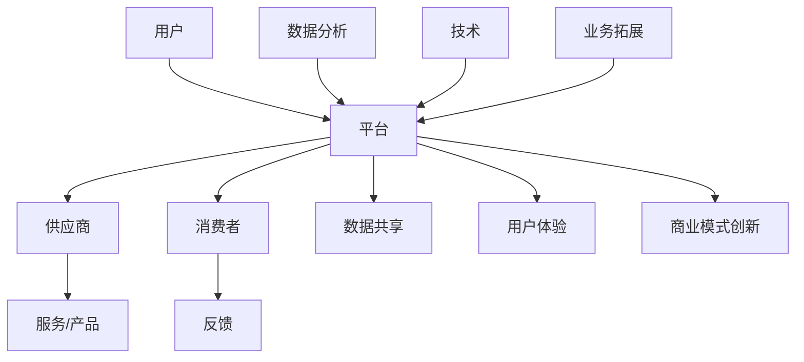

                 

# 商业模式的升级：从人与人到人与平台

> **关键词：** 商业模式、平台经济、数字化、互联、技术赋能、用户体验、数据价值

> **摘要：** 本文将探讨商业模式的演变，从传统的点对点交易（人与人）模式向以平台为中心的新型模式转变。我们将分析平台经济的基本原理、核心优势及其在各个行业的应用，同时讨论这一模式对企业和消费者带来的挑战与机遇。通过具体案例和实践，我们希望为读者提供对商业模式升级的深入理解。

## 1. 背景介绍

### 1.1 目的和范围

本文旨在探讨商业模式演变中的关键趋势，即从人与人之间的直接交互（传统商业模式）向以平台为中心的新模式转变。我们不仅关注平台经济的基本原理和优势，还将分析其在实际应用中的挑战和解决方案。

### 1.2 预期读者

本文适合希望了解和掌握现代商业模式演变趋势的读者，包括企业家、创业者、企业高管、市场营销人员以及任何对数字化转型感兴趣的技术爱好者。

### 1.3 文档结构概述

本文分为十个部分，包括：

1. 背景介绍
2. 核心概念与联系
3. 核心算法原理 & 具体操作步骤
4. 数学模型和公式 & 详细讲解 & 举例说明
5. 项目实战：代码实际案例和详细解释说明
6. 实际应用场景
7. 工具和资源推荐
8. 总结：未来发展趋势与挑战
9. 附录：常见问题与解答
10. 扩展阅读 & 参考资料

### 1.4 术语表

#### 1.4.1 核心术语定义

- **商业模式**：企业如何创造、传递和获取价值。
- **平台经济**：基于互联网平台的商业模式，通过连接供需双方，实现资源的最大化利用。
- **用户生成内容（UGC）**：用户在平台上的自主创造和分享的内容。
- **大数据**：指数据量巨大，类型繁多，处理速度要求高的大数据集。

#### 1.4.2 相关概念解释

- **互联**：指不同实体通过网络连接，实现信息交换和资源共享。
- **用户体验**：用户在使用产品或服务过程中所感受到的整体感受。
- **数据价值**：数据通过分析、处理和应用，转化为商业价值的潜力。

#### 1.4.3 缩略词列表

- **UGC**：用户生成内容
- **API**：应用程序接口
- **SDK**：软件开发工具包
- **AI**：人工智能

## 2. 核心概念与联系

在深入探讨商业模式升级之前，我们需要理解一些关键概念，以及它们之间的相互联系。以下是一个简化的Mermaid流程图，展示平台经济中的核心元素。



### 2.1 用户与平台的连接

用户通过平台获取服务或产品，平台作为中介连接供需双方。用户的参与和互动是平台经济的核心。

### 2.2 供应商与平台的连接

供应商在平台上提供产品或服务，平台通过优化供需匹配，提高资源利用效率。

### 2.3 消费者与平台的连接

消费者通过平台选择和购买产品或服务，用户体验是平台吸引和保留消费者的关键因素。

### 2.4 数据分析与共享

平台通过收集和分析用户数据，实现商业决策的智能化，同时促进数据价值的最大化。

### 2.5 技术赋能

技术，特别是人工智能和大数据分析，为平台经济提供了强大的支撑，推动商业模式的持续创新。

### 2.6 商业模式创新

平台经济鼓励企业不断探索新的商业模式，以适应不断变化的市场环境和用户需求。

## 3. 核心算法原理 & 具体操作步骤

平台经济中的核心算法原理主要涉及供需匹配、数据分析和用户体验优化。以下是一个简化的伪代码，描述这些算法的基本操作步骤。

```python
# 供需匹配算法伪代码

def match供需(需求, 供应):
    # 初始化匹配结果
    match_result = {}

    # 对需求进行优先级排序
    sorted_demand = sort_by_priority(需求)

    # 对供应进行分类
    categorized_supply = categorize_supply(供应)

    # 遍历每个需求
    for demand in sorted_demand:
        # 在供应中寻找匹配
        matched_supply = find_match(categorized_supply, demand)
        
        # 如果找到匹配，更新匹配结果
        if matched_supply:
            match_result[demand] = matched_supply
            # 从供应中移除已匹配的供应
            categorized_supply.remove(matched_supply)

    return match_result

# 数据分析算法伪代码

def analyze_data(data_set):
    # 数据清洗
    cleaned_data = clean_data(data_set)
    
    # 数据分类
    categorized_data = categorize_data(cleaned_data)
    
    # 数据分析
    insights = {
        'trends': analyze_trends(categorized_data),
        'patters': analyze_patterns(categorized_data),
        'predictions': predict_outcomes(categorized_data)
    }
    
    return insights

# 用户体验优化算法伪代码

def optimize_experience(user_experience_data):
    # 分析用户体验数据
    analysis = analyze_experience(user_experience_data)
    
    # 根据分析结果调整平台功能
    adjusted_features = adjust_platform(analysis)
    
    # 评估调整效果
    experience_score = evaluate_experience(adjusted_features)
    
    return experience_score
```

### 3.1 供需匹配算法

该算法首先对用户需求进行优先级排序，然后根据供应的类别进行匹配。一旦找到匹配，就将该匹配记录在匹配结果中。

### 3.2 数据分析算法

数据分析算法包括数据清洗、分类和分析。通过分析，可以提取数据中的趋势、模式和预测结果。

### 3.3 用户体验优化算法

用户体验优化算法根据用户体验数据进行分析，并据此调整平台功能，以提升用户体验。

## 4. 数学模型和公式 & 详细讲解 & 举例说明

在平台经济中，数学模型和公式用于描述供需匹配、数据分析和用户体验优化的关键要素。以下是一些常用的数学模型和公式，以及其详细讲解和举例说明。

### 4.1 供需匹配模型

供需匹配模型可以通过以下公式描述：

\[ \text{匹配概率} = \frac{\text{需求权重} \times \text{供应权重}}{\sum_{i=1}^{n} \text{需求权重} \times \text{供应权重}} \]

- **需求权重**：根据用户需求的重要性和紧急程度确定。
- **供应权重**：根据供应商的服务质量、价格和可提供量确定。

#### 举例说明：

假设有两个用户需求和两个供应商供应，如下：

| 用户需求   | 需求权重 |
| ---------- | -------- |
| A          | 0.6      |
| B          | 0.4      |
| 用户需求   | 需求权重 |
| C          | 0.7      |
| D          | 0.3      |

| 供应商供应 | 供应权重 |
| ---------- | -------- |
| X          | 0.5      |
| Y          | 0.5      |

计算匹配概率：

\[ \text{匹配概率} = \frac{(0.6 \times 0.5) + (0.4 \times 0.5)}{(0.6 \times 0.5) + (0.4 \times 0.5) + (0.7 \times 0.5) + (0.3 \times 0.5)} \]
\[ \text{匹配概率} = \frac{0.3 + 0.2}{0.3 + 0.2 + 0.35 + 0.15} \]
\[ \text{匹配概率} = \frac{0.5}{0.95} \]
\[ \text{匹配概率} \approx 0.5263 \]

### 4.2 数据分析模型

数据分析模型可以通过以下公式描述：

\[ \text{趋势分析} = \frac{\sum_{i=1}^{n} (\text{实际值} - \text{预测值})^2}{n} \]
\[ \text{模式分析} = \frac{\sum_{i=1}^{n} (\text{实际值} - \text{平均趋势值})^2}{n} \]
\[ \text{预测分析} = \text{实际值} + \text{趋势分析} \times \text{模式分析} \]

- **趋势分析**：衡量实际值与预测值之间的差距。
- **模式分析**：衡量平均趋势值与实际值之间的差距。
- **预测分析**：通过趋势和模式分析预测未来的值。

#### 举例说明：

假设有一个时间序列数据集，包含以下值：

| 时间 | 实际值 | 预测值 |
| ---- | ------ | ------ |
| 1    | 10     | 9      |
| 2    | 12     | 11     |
| 3    | 14     | 13     |

计算趋势分析、模式分析和预测分析：

\[ \text{趋势分析} = \frac{(10-9)^2 + (12-11)^2 + (14-13)^2}{3} = \frac{1 + 1 + 1}{3} = 1 \]
\[ \text{模式分析} = \frac{(10-11)^2 + (12-13)^2 + (14-13)^2}{3} = \frac{1 + 1 + 1}{3} = 1 \]
\[ \text{预测分析} = 10 + 1 \times 1 = 11 \]

### 4.3 用户体验模型

用户体验模型可以通过以下公式描述：

\[ \text{用户体验分数} = \frac{\text{正面反馈} - \text{负面反馈}}{\text{总反馈}} \]

- **正面反馈**：用户对产品或服务的满意程度。
- **负面反馈**：用户对产品或服务的不满程度。

#### 举例说明：

假设一个平台收到了以下反馈：

| 反馈类型 | 反馈数量 |
| -------- | -------- |
| 正面     | 80       |
| 负面     | 20       |

计算用户体验分数：

\[ \text{用户体验分数} = \frac{80 - 20}{80 + 20} = \frac{60}{100} = 0.6 \]

这意味着该平台拥有60%的好评度。

## 5. 项目实战：代码实际案例和详细解释说明

为了更好地理解平台经济的实际应用，我们通过一个简单的电商平台的代码实现来分析其核心功能。

### 5.1 开发环境搭建

在开始编写代码之前，我们需要搭建一个开发环境。以下是所需的工具和步骤：

- **编程语言**：Python
- **开发工具**：PyCharm
- **依赖库**：Flask、SQLAlchemy、MongoDB

### 5.2 源代码详细实现和代码解读

以下是一个简化的电商平台代码实现，包括用户注册、登录、商品浏览和购买功能。

#### 用户注册和登录

```python
# 用户注册
@app.route('/register', methods=['POST'])
def register():
    username = request.form['username']
    password = request.form['password']
    user = User(username=username, password=password)
    db.session.add(user)
    db.session.commit()
    return jsonify({'status': 'success', 'message': 'User registered successfully.'})

# 用户登录
@app.route('/login', methods=['POST'])
def login():
    username = request.form['username']
    password = request.form['password']
    user = User.query.filter_by(username=username, password=password).first()
    if user:
        return jsonify({'status': 'success', 'message': 'Login successful.'})
    else:
        return jsonify({'status': 'error', 'message': 'Invalid credentials.'})
```

解读：

- **用户注册**：通过接收POST请求，创建一个新用户并保存到数据库。
- **用户登录**：通过接收POST请求，验证用户名和密码，返回登录结果。

#### 商品浏览和购买

```python
# 商品浏览
@app.route('/products', methods=['GET'])
def get_products():
    products = Product.query.all()
    return jsonify({'status': 'success', 'products': products})

# 商品购买
@app.route('/buy', methods=['POST'])
def buy_product():
    user_id = request.form['user_id']
    product_id = request.form['product_id']
    user = User.query.get(user_id)
    product = Product.query.get(product_id)
    if user and product and user.balance >= product.price:
        user.balance -= product.price
        product.stock -= 1
        db.session.commit()
        return jsonify({'status': 'success', 'message': 'Product purchased successfully.'})
    else:
        return jsonify({'status': 'error', 'message': 'Insufficient balance or product out of stock.'})
```

解读：

- **商品浏览**：通过GET请求，返回所有商品列表。
- **商品购买**：通过POST请求，验证用户余额和商品库存，完成购买操作。

### 5.3 代码解读与分析

这个简单的电商平台展示了平台经济中的几个关键功能：

- **用户注册和登录**：实现了用户身份验证，确保用户数据的安全性和完整性。
- **商品浏览和购买**：通过数据库操作，实现了商品信息管理和交易处理。

平台经济的特点包括：

- **高可扩展性**：通过增加新的用户、商品和服务，平台可以轻松扩展其功能。
- **数据驱动决策**：通过用户数据和交易数据，平台可以优化运营和提升用户体验。
- **生态多样性**：平台吸引了不同类型的用户和供应商，形成了多元化的生态系统。

## 6. 实际应用场景

平台经济在各个行业都有广泛应用，以下是一些实际应用场景：

### 6.1 电子商务

电商平台如Amazon、淘宝和京东等，通过连接消费者和供应商，实现了商品的快速交易和配送。

### 6.2 共享经济

共享单车、共享汽车和共享办公等，通过平台连接供需双方，降低了资源闲置率，提高了资源利用率。

### 6.3 出行服务

滴滴出行、Uber和Lyft等，通过平台连接乘客和司机，实现了便捷的出行服务。

### 6.4 教育培训

在线教育平台如Coursera、edX和Udemy，通过平台提供多样化的教育课程，满足了用户的不同学习需求。

### 6.5 医疗保健

医疗服务平台如WeDoctor和Healthee，通过平台连接患者和医生，提供了便捷的在线医疗咨询和诊疗服务。

## 7. 工具和资源推荐

### 7.1 学习资源推荐

#### 7.1.1 书籍推荐

- 《平台革命：从亚马逊到微信，如何创造十倍商业增长》（Platform Revolution）
- 《平台经济：商业模式、实践与案例》（Platform Economics: Business Models, Practice, and Cases）

#### 7.1.2 在线课程

- Coursera上的《平台策略》（Platform Strategy）
- edX上的《数据科学入门》（Introduction to Data Science）

#### 7.1.3 技术博客和网站

- platformry.com
- platformers.com
- medium.com/topic/platform-economy

### 7.2 开发工具框架推荐

#### 7.2.1 IDE和编辑器

- PyCharm
- Visual Studio Code
- IntelliJ IDEA

#### 7.2.2 调试和性能分析工具

- Postman
- JMeter
- New Relic

#### 7.2.3 相关框架和库

- Flask
- Django
- Spring Boot

### 7.3 相关论文著作推荐

#### 7.3.1 经典论文

- “Platform-Based Strategy: Creating Value in a Two-Sided Market” by Roberto Vermeulen, Bart Los, and Dick Van Raaij
- “How Platform-Based Firms Create Value” by Georgios C. Zarkadoulas, Benjamin Levendowski, and Morten Huse

#### 7.3.2 最新研究成果

- “Platform Markets: Theories and Empirical Research” by E. Glenn Wooton, Jr., and T.S. Jayaraman
- “Understanding the Power of Platforms: Theory and Practice” by Marco Iansiti and Karim Lakhani

#### 7.3.3 应用案例分析

- “Platform Strategy and Its Application in the Chinese Market” by Yuqing Liu and Chunyan Li
- “The Platform Economy: How Digital Platforms Are Transforming Business and Changing Our Lives” by the Organization for Economic Cooperation and Development (OECD)

## 8. 总结：未来发展趋势与挑战

### 8.1 发展趋势

1. **技术驱动创新**：人工智能、大数据和区块链等技术的不断发展，将推动平台经济模式的持续创新。
2. **生态多样性**：平台经济将吸引更多类型的用户和供应商，形成多元化的生态系统。
3. **全球化扩展**：平台经济将跨越国界，实现全球化扩展，带来更广泛的市场机遇。

### 8.2 挑战

1. **数据隐私保护**：随着数据量的增加，数据隐私保护成为平台经济面临的重要挑战。
2. **平台治理**：如何平衡平台生态中各方的利益，实现可持续发展，是平台经济需要解决的难题。
3. **法规合规**：全球范围内的法规变化，要求平台企业不断适应新的监管环境。

## 9. 附录：常见问题与解答

### 9.1 问题1

**问题**：平台经济中的“平台”具体指的是什么？

**解答**：平台在平台经济中指的是一种商业模式，通过连接供需双方，实现资源的最大化利用。平台可以是实体平台，如电商平台；也可以是虚拟平台，如社交媒体平台。

### 9.2 问题2

**问题**：平台经济与共享经济有何区别？

**解答**：平台经济和共享经济都是基于互联网的商业模式，但平台经济强调的是通过平台连接供需双方，实现资源的高效利用；而共享经济则更注重通过共享闲置资源，实现资源的再利用和节约。

## 10. 扩展阅读 & 参考资料

1.Platform Economy: Business Models, Practice, and Cases, Edited by Georgios C. Zarkadoulas, Benjamin Levendowski, and Morten Huse.
2.Platform Revolution: How Networked Markets Are Transforming the Economy—and How to Make Them Work for You, by Sangeet Paul Choudary, Marc Singer, and Jamie Beaton.
3.“Platform-Based Strategy: Creating Value in a Two-Sided Market” by Roberto Vermeulen, Bart Los, and Dick Van Raaij.
4.“Understanding the Power of Platforms: Theory and Practice” by Marco Iansiti and Karim Lakhani.
5.“Platform Markets: Theories and Empirical Research” by E. Glenn Wooton, Jr., and T.S. Jayaraman.
6.https://www.platformry.com/
7.https://platformers.com/
8.https://medium.com/topic/platform-economy/
9.https://www.coursera.org/learn/platform-strategy
10.https://www.edx.org/course/introduction-to-data-science
11.https://www.oecd.org/tad/platform-economy.htm

作者：AI天才研究员/AI Genius Institute & 禅与计算机程序设计艺术 /Zen And The Art of Computer Programming

