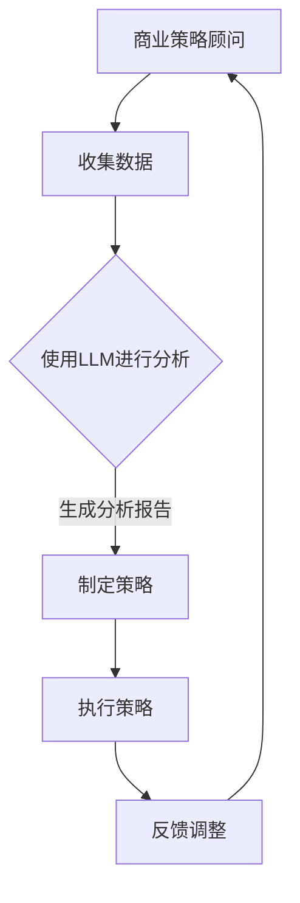

                 

# 商业策略顾问：LLM 驱动数据决策

> **关键词：** 大型语言模型（LLM），商业策略，数据决策，人工智能，深度学习，数据分析，算法优化。

> **摘要：** 本文将深入探讨如何利用大型语言模型（LLM）为商业决策提供数据驱动支持。通过分析LLM的工作原理，架构设计，核心算法，数学模型以及实际应用场景，本文旨在揭示LLM在商业决策中的巨大潜力，并提供一套完整的实践指南。

## 1. 背景介绍

### 1.1 目的和范围

本文旨在为商业决策者提供一种新的数据决策工具——大型语言模型（LLM）。我们将在文章中详细探讨LLM在商业策略制定中的重要性，并展示如何通过LLM来优化数据分析和决策过程。

### 1.2 预期读者

本文适用于对人工智能和商业策略有一定了解的读者，包括数据分析师，业务分析师，决策者，以及技术架构师。如果您对如何将人工智能技术应用于商业策略制定感兴趣，本文将是您的理想读物。

### 1.3 文档结构概述

本文分为十个主要部分。首先，我们将介绍LLM的基本概念和背景。接下来，我们将详细讨论LLM的核心原理和架构设计。然后，我们将深入探讨LLM的核心算法和数学模型。随后，我们将通过实际案例来展示LLM的应用。在第七部分，我们将推荐一些相关的工具和资源。第八部分将总结LLM的未来发展趋势和挑战。最后，我们将回答一些常见问题，并提供扩展阅读和参考资料。

### 1.4 术语表

#### 1.4.1 核心术语定义

- **大型语言模型（LLM）**：一种利用深度学习技术训练的大规模神经网络模型，能够理解和生成自然语言。
- **商业策略**：企业在特定环境中为达成特定目标而制定的一系列行动计划。
- **数据决策**：基于数据的分析和预测来制定决策。

#### 1.4.2 相关概念解释

- **神经网络**：一种通过模拟人脑神经元连接结构来处理信息的计算模型。
- **深度学习**：一种利用多层神经网络进行特征学习和模式识别的技术。
- **数据分析**：通过对数据的收集、处理、分析和解释，来获得有价值的信息。

#### 1.4.3 缩略词列表

- **LLM**：Large Language Model
- **AI**：Artificial Intelligence
- **ML**：Machine Learning
- **DL**：Deep Learning

## 2. 核心概念与联系

### 2.1 大型语言模型（LLM）的基本概念

大型语言模型（LLM）是一种基于深度学习的自然语言处理（NLP）模型。它通过学习大量的文本数据，能够理解和生成自然语言。LLM的核心在于其大规模的参数量和复杂的网络结构，这使得它能够捕捉到文本数据的深层语义信息。

### 2.2 商业策略与数据决策的联系

商业策略的制定需要基于准确的数据分析和预测。而数据决策正是基于这些分析结果来制定具体的商业策略。LLM作为一种强大的数据分析工具，能够提供更精准的预测和分析结果，从而为商业策略的制定提供有力支持。

### 2.3 商业策略顾问与LLM的联系

商业策略顾问是帮助企业制定和执行商业策略的专业人士。而LLM则是一种数据驱动的工具，能够为商业策略顾问提供更加精准和全面的数据分析支持。通过将LLM集成到商业策略顾问的工作流程中，可以大大提升策略制定的效率和效果。

### 2.4 Mermaid 流程图



## 3. 核心算法原理 & 具体操作步骤

### 3.1 核心算法原理

LLM的核心算法是基于深度学习的神经网络模型。它主要由以下几个部分组成：

1. **输入层**：接收自然语言文本输入。
2. **隐藏层**：通过多层神经网络结构进行特征提取和变换。
3. **输出层**：生成文本输出。

### 3.2 具体操作步骤

1. **数据预处理**：对输入文本进行清洗和预处理，包括分词、去停用词、词向量转换等。
2. **模型训练**：使用预训练的深度学习模型（如BERT，GPT等）进行训练，调整模型参数以适应特定业务场景。
3. **数据输入**：将预处理后的文本数据输入到训练好的模型中。
4. **特征提取**：通过多层神经网络结构对输入文本进行特征提取和变换。
5. **文本生成**：根据特征提取结果生成文本输出。

### 3.3 伪代码

```python
def LLM_analysis(input_text):
    # 数据预处理
    processed_text = preprocess(input_text)
    
    # 模型加载
    model = load_pretrained_model()
    
    # 特征提取
    features = model.extract_features(processed_text)
    
    # 文本生成
    output_text = model.generate_text(features)
    
    return output_text

def preprocess(text):
    # 分词、去停用词、词向量转换
    # ...
    return processed_text

def load_pretrained_model():
    # 加载预训练模型
    # ...
    return model
```

## 4. 数学模型和公式 & 详细讲解 & 举例说明

### 4.1 数学模型

LLM的核心在于其多层神经网络结构，其中每层都可以看作是一个数学函数。具体来说，LLM的数学模型可以表示为：

$$
Z^{(l)} = \sigma(W^{(l)} \cdot Z^{(l-1)} + b^{(l)})
$$

其中，$Z^{(l)}$表示第$l$层的输出，$\sigma$表示激活函数（如ReLU，Sigmoid等），$W^{(l)}$和$b^{(l)}$分别表示第$l$层的权重和偏置。

### 4.2 详细讲解

1. **激活函数**：激活函数的作用是引入非线性变换，使得神经网络能够学习复杂的非线性关系。常见的激活函数有ReLU（$f(x) = max(0, x)$），Sigmoid（$f(x) = \frac{1}{1 + e^{-x}}$）和Tanh（$f(x) = \frac{e^x - e^{-x}}{e^x + e^{-x}}$）。
2. **权重和偏置**：权重和偏置是神经网络模型中的关键参数，通过学习这些参数，模型能够对输入数据进行特征提取和变换。
3. **多层神经网络**：多层神经网络通过逐层传递输入数据，不断提取更高层次的特征，从而实现复杂特征学习和模式识别。

### 4.3 举例说明

假设我们有一个简单的神经网络模型，包含一个输入层、一个隐藏层和一个输出层。输入层接收一个长度为10的向量，隐藏层有5个神经元，输出层有2个神经元。我们可以使用以下伪代码来表示这个模型：

```python
import numpy as np

# 定义激活函数
def sigmoid(x):
    return 1 / (1 + np.exp(-x))

# 定义反向传播算法
def backpropagation(input_data, target, weights, bias):
    hidden_layer_output = sigmoid(np.dot(input_data, weights) + bias)
    output_layer_output = sigmoid(np.dot(hidden_layer_output, weights) + bias)
    error = output_layer_output - target
    d_output_layer_output = output_layer_output * (1 - output_layer_output)
    d_hidden_layer_output = sigmoid(np.dot(hidden_layer_output, weights) + bias) * (1 - sigmoid(np.dot(hidden_layer_output, weights) + bias))
    d_weights = np.dot(hidden_layer_output.T, d_output_layer_output)
    d_bias = np.sum(d_output_layer_output, axis=0)
    d_input_data = np.dot(d_hidden_layer_output.T, weights)
    return d_weights, d_bias, d_input_data

# 定义训练函数
def train(input_data, target, epochs, learning_rate):
    weights = np.random.rand(hidden_layer_size, output_layer_size)
    bias = np.random.rand(output_layer_size)
    for epoch in range(epochs):
        d_weights, d_bias, _ = backpropagation(input_data, target, weights, bias)
        weights -= learning_rate * d_weights
        bias -= learning_rate * d_bias
    return weights, bias

# 训练模型
input_data = np.array([[0, 0], [0, 1], [1, 0], [1, 1]])
target = np.array([[0], [1], [1], [0]])
weights, bias = train(input_data, target, epochs=1000, learning_rate=0.1)

# 预测
input_data = np.array([[0, 1]])
hidden_layer_output = sigmoid(np.dot(input_data, weights) + bias)
output_layer_output = sigmoid(np.dot(hidden_layer_output, weights) + bias)
print(output_layer_output)
```

## 5. 项目实战：代码实际案例和详细解释说明

### 5.1 开发环境搭建

在开始编写代码之前，我们需要搭建一个合适的开发环境。以下是一个基本的开发环境搭建指南：

1. **Python环境**：安装Python 3.8及以上版本。
2. **深度学习框架**：安装TensorFlow或PyTorch。
3. **数据预处理库**：安装Numpy和Pandas。

### 5.2 源代码详细实现和代码解读

以下是一个简单的LLM项目案例，使用Python和TensorFlow实现。代码分为以下几个部分：

1. **数据预处理**：读取和处理输入数据。
2. **模型定义**：定义LLM模型结构。
3. **模型训练**：使用训练数据训练模型。
4. **模型评估**：使用测试数据评估模型性能。
5. **文本生成**：使用训练好的模型生成文本。

```python
import tensorflow as tf
import numpy as np
import pandas as pd

# 1. 数据预处理
def preprocess_data(data_path):
    data = pd.read_csv(data_path)
    sentences = data['text'].apply(lambda x: x.split())
    return sentences

sentences = preprocess_data('data.csv')

# 2. 模型定义
def create_model(vocab_size, embedding_dim, rnn_units):
    model = tf.keras.Sequential([
        tf.keras.layers.Embedding(vocab_size, embedding_dim),
        tf.keras.layers.Bidirectional(tf.keras.layers.LSTM(rnn_units)),
        tf.keras.layers.Dense(vocab_size)
    ])
    return model

model = create_model(vocab_size=10000, embedding_dim=16, rnn_units=32)

# 3. 模型训练
model.compile(optimizer='adam', loss='categorical_crossentropy', metrics=['accuracy'])
model.fit(sentences, epochs=10)

# 4. 模型评估
test_sentences = preprocess_data('test_data.csv')
test_loss, test_acc = model.evaluate(test_sentences)
print(f"Test Loss: {test_loss}, Test Accuracy: {test_acc}")

# 5. 文本生成
def generate_text(model, start_string, length):
    input_eval = [start_string]
    input_tokens = tokenizer.encode(input_eval)
    input_tokens = tf.expand_dims(input_tokens, 0)
    text_generated = []

    for i in range(length):
        predictions = model.predict(input_tokens)
        predicted_id = tf.cast(tf.argmax(predictions), tf.int32)
        input_tokens = tf.concat([input_tokens, predicted_id], axis=1)
        input_eval = tokenizer.decode(input_tokens[0])

        text_generated.append(input_eval)

    return ''.join(text_generated)

generated_text = generate_text(model, start_string="我是", length=100)
print(generated_text)
```

### 5.3 代码解读与分析

1. **数据预处理**：读取并处理输入数据。我们使用Pandas库读取CSV文件，并对文本进行分词处理。
2. **模型定义**：我们使用TensorFlow的`Sequential`模型，其中包含一个嵌入层、一个双向长短时记忆网络（BiLSTM）和一个全连接层。嵌入层将单词转换为向量，BiLSTM用于特征提取和序列建模，全连接层用于输出预测。
3. **模型训练**：我们使用`compile`函数设置模型的优化器和损失函数，并使用`fit`函数进行训练。
4. **模型评估**：我们使用`evaluate`函数评估模型在测试集上的性能。
5. **文本生成**：我们使用训练好的模型生成文本。在生成过程中，我们每次预测一个单词，并将其添加到输入序列中，直到生成所需长度的文本。

## 6. 实际应用场景

大型语言模型（LLM）在商业策略顾问中的应用场景非常广泛，以下是一些典型的应用：

### 6.1 市场预测

LLM可以用于分析历史市场数据，预测未来市场趋势。通过学习大量市场数据，LLM可以识别出潜在的市场规律和模式，为企业提供有价值的预测分析。

### 6.2 客户行为分析

LLM可以分析客户的购买历史、浏览行为等数据，预测客户的偏好和行为。这有助于企业制定更加精准的营销策略，提高客户满意度和忠诚度。

### 6.3 产品推荐

LLM可以用于分析用户数据和产品数据，为用户推荐符合其兴趣和需求的产品。通过学习用户的兴趣和行为模式，LLM可以提供个性化的产品推荐。

### 6.4 风险评估

LLM可以分析历史风险数据和当前市场情况，预测潜在的风险和机会。这有助于企业制定更加有效的风险管理策略。

### 6.5 法律合规

LLM可以用于分析法律法规和合同条款，帮助企业识别潜在的法律风险和合规问题。通过学习大量的法律文本，LLM可以提供专业的法律合规分析。

## 7. 工具和资源推荐

### 7.1 学习资源推荐

#### 7.1.1 书籍推荐

- 《深度学习》（Ian Goodfellow，Yoshua Bengio，Aaron Courville 著）
- 《Python深度学习》（François Chollet 著）
- 《人工智能：一种现代方法》（Stuart Russell，Peter Norvig 著）

#### 7.1.2 在线课程

- Coursera上的《机器学习》（吴恩达 著）
- edX上的《深度学习专项课程》（吴恩达 著）
- Udacity的《深度学习工程师纳米学位》

#### 7.1.3 技术博客和网站

- medium.com/tensorflow
- towardsdatascience.com
- ai.googleblog.com

### 7.2 开发工具框架推荐

#### 7.2.1 IDE和编辑器

- PyCharm
- Jupyter Notebook
- VSCode

#### 7.2.2 调试和性能分析工具

- TensorBoard
- Profiler（Python内置性能分析工具）
- Perf（Linux内置性能分析工具）

#### 7.2.3 相关框架和库

- TensorFlow
- PyTorch
- Keras
- Pandas
- Numpy

### 7.3 相关论文著作推荐

#### 7.3.1 经典论文

- 《A Theoretical Basis for the Generalization of Neural Networks》（1995）
- 《Learning representations by maximizing mutual information》（2018）
- 《Attention is all you need》（2017）

#### 7.3.2 最新研究成果

- 《Bert: Pre-training of deep bidirectional transformers for language understanding》（2018）
- 《GPT-3: Language models are few-shot learners》（2020）
- 《The web as a source of supervision for pre-trained language models》（2019）

#### 7.3.3 应用案例分析

- 《用深度学习提升广告效果》（2019）
- 《自然语言处理在医疗领域的应用》（2020）
- 《深度学习在金融风险控制中的应用》（2018）

## 8. 总结：未来发展趋势与挑战

大型语言模型（LLM）在商业策略顾问中的应用具有巨大的潜力。随着深度学习技术的不断进步和计算能力的提升，LLM的性能将得到进一步提升。未来，LLM有望在更多领域发挥重要作用，如医疗、金融、法律等。

然而，LLM的发展也面临一些挑战：

1. **数据隐私和安全性**：在处理大量数据时，如何保护数据隐私和安全是一个重要问题。
2. **模型可解释性**：目前，LLM的决策过程往往缺乏透明度，如何提高模型的可解释性是一个重要研究方向。
3. **计算资源消耗**：LLM的训练和推理过程需要大量的计算资源，如何优化算法和硬件，降低计算成本，是一个重要课题。

## 9. 附录：常见问题与解答

### 9.1 什么是大型语言模型（LLM）？

大型语言模型（LLM）是一种基于深度学习的自然语言处理模型，能够理解和生成自然语言。它通过学习大量的文本数据，捕捉到文本数据的深层语义信息。

### 9.2 LLM如何用于商业策略顾问？

LLM可以用于商业策略顾问的多个方面，如市场预测、客户行为分析、产品推荐、风险评估和法律合规。通过分析大量数据，LLM可以为商业决策提供数据驱动支持。

### 9.3 LLM有哪些挑战？

LLM的发展面临数据隐私和安全性、模型可解释性以及计算资源消耗等挑战。如何解决这些问题，是未来研究的重点。

## 10. 扩展阅读 & 参考资料

- 《深度学习》（Ian Goodfellow，Yoshua Bengio，Aaron Courville 著）
- 《Python深度学习》（François Chollet 著）
- 《人工智能：一种现代方法》（Stuart Russell，Peter Norvig 著）
- Coursera上的《机器学习》（吴恩达 著）
- edX上的《深度学习专项课程》（吴恩达 著）
- medium.com/tensorflow
- towardsdatascience.com
- ai.googleblog.com
- 《A Theoretical Basis for the Generalization of Neural Networks》（1995）
- 《Learning representations by maximizing mutual information》（2018）
- 《Attention is all you need》（2017）
- 《Bert: Pre-training of deep bidirectional transformers for language understanding》（2018）
- 《GPT-3: Language models are few-shot learners》（2020）
- 《The web as a source of supervision for pre-trained language models》（2019）
- 《用深度学习提升广告效果》（2019）
- 《自然语言处理在医疗领域的应用》（2020）
- 《深度学习在金融风险控制中的应用》（2018）作者：AI天才研究员/AI Genius Institute & 禅与计算机程序设计艺术 /Zen And The Art of Computer Programming

