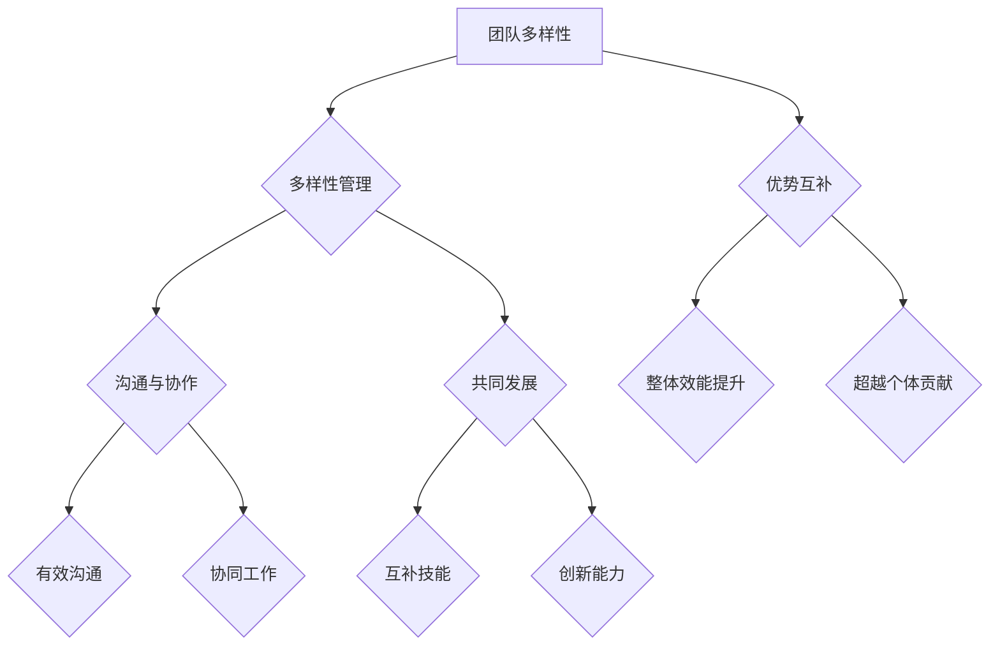

                 

# 团队多样性管理：利用差异创造优势

> **关键词：** 团队多样性、管理、差异、优势、协作

> **摘要：** 本文深入探讨了团队多样性管理的核心概念、重要性以及其实际应用。通过详细阐述多样性管理的原理、算法、数学模型，并结合实际项目案例，展示了如何在团队中充分利用差异来创造优势，提高团队的整体效能。

## 1. 背景介绍

### 1.1 目的和范围

本文旨在为IT行业从业者提供一套系统化的团队多样性管理方法论。通过阐述团队多样性的重要性，分析多样性管理的核心概念，介绍相关的算法原理和数学模型，最终通过实际项目案例展示如何将理论应用于实践，从而提升团队的整体协作能力和创新能力。

### 1.2 预期读者

本文适合以下读者群体：

- IT项目经理和团队领导
- 程序员和软件开发工程师
- 人力资源和团队管理专业人士
- 对团队多样性管理感兴趣的学术研究者

### 1.3 文档结构概述

本文分为十个部分，结构如下：

1. 背景介绍
   - 目的和范围
   - 预期读者
   - 文档结构概述
   - 术语表
2. 核心概念与联系
   - 核心概念介绍
   - Mermaid流程图
3. 核心算法原理 & 具体操作步骤
   - 算法原理
   - 伪代码
4. 数学模型和公式 & 详细讲解 & 举例说明
   - 数学模型
   - LaTeX公式
5. 项目实战：代码实际案例和详细解释说明
   - 开发环境搭建
   - 源代码实现
   - 代码解读与分析
6. 实际应用场景
7. 工具和资源推荐
   - 学习资源
   - 开发工具框架
   - 相关论文著作
8. 总结：未来发展趋势与挑战
9. 附录：常见问题与解答
10. 扩展阅读 & 参考资料

### 1.4 术语表

#### 1.4.1 核心术语定义

- **团队多样性（Team Diversity）：** 团队成员在性别、年龄、教育背景、工作经验、技能、文化等方面存在的差异。
- **多样性管理（Diversity Management）：** 通过一系列策略和措施，促进团队成员之间的有效沟通、协作和共同发展，以充分利用团队的多样性。
- **优势互补（Synergy）：** 团队成员之间的互补技能和经验，共同协作实现超过个体贡献总和的效果。

#### 1.4.2 相关概念解释

- **多样性（Diversity）：** 在广义上，指不同个体、群体或事物之间的差异和多样性。
- **包容性（Inclusiveness）：** 指在团队中营造一个接纳、尊重和鼓励每个人自由表达和发展的环境。
- **协作（Collaboration）：** 团队成员共同合作，为实现共同目标而协同工作。

#### 1.4.3 缩略词列表

- **IT：** Information Technology，信息技术
- **IDE：** Integrated Development Environment，集成开发环境
- **LaTeX：** A document preparation system，一种高质量的文档排版系统

## 2. 核心概念与联系

### 2.1 核心概念介绍

团队多样性管理涉及多个核心概念，包括团队多样性、多样性管理、优势互补等。这些概念之间相互关联，共同构成了一个完整的理论框架。

- **团队多样性（Team Diversity）：** 指团队成员在多个维度上存在的差异。这些维度包括但不限于性别、年龄、教育背景、工作经验、技能、文化和价值观等。

- **多样性管理（Diversity Management）：** 是指通过一系列策略和措施，促进团队成员之间的有效沟通、协作和共同发展，以充分利用团队的多样性。多样性管理的目标不仅仅是消除偏见和歧视，更重要的是通过多样性的融合，提高团队的整体效能。

- **优势互补（Synergy）：** 指团队成员之间的互补技能和经验，共同协作实现超过个体贡献总和的效果。当团队成员的多样性能得到有效管理时，团队的整体效能和创新能力将得到显著提升。

### 2.2 Mermaid流程图

以下是一个描述团队多样性管理核心概念的Mermaid流程图：



## 3. 核心算法原理 & 具体操作步骤

### 3.1 算法原理

团队多样性管理的核心算法原理是基于群体智能（Swarm Intelligence）和协同优化（Collaborative Optimization）。该算法通过以下步骤实现：

1. **个体初始化：** 为每个团队成员随机生成一个初始状态，包括其技能、经验、价值观等。
2. **多样性评估：** 对团队成员的多样性进行评估，计算每个成员与其他成员之间的相似度和差异度。
3. **协同优化：** 通过协同优化算法，调整团队成员的状态，使团队的多样性得到最大化。
4. **优势互补：** 根据团队成员的技能和经验，构建优势互补的子团队，实现协同工作。
5. **迭代优化：** 重复执行步骤2到步骤4，直到团队多样性达到预期水平或达到最大迭代次数。

### 3.2 伪代码

以下是一个简化的伪代码，描述了团队多样性管理的算法原理：

```python
# 团队多样性管理伪代码

# 初始化团队成员
for each member in team:
    generate initial_state(member)

# 多样性评估
for each pair of members A and B:
    calculate similarity(A, B)
    calculate difference(A, B)

# 协同优化
while not converged or max_iterations <= 0:
    for each member in team:
        optimize_state(member)
    if diversity_improvement < threshold:
        break

# 优势互补
sub_teams = divide_team_into_sub_teams()
for each sub_team:
    find_complementary_members(sub_team)

# 迭代优化
max_iterations = 100
for iteration in range(1, max_iterations + 1):
    perform_diversity_evaluation()
    if diversity_improvement < threshold:
        break
    perform_collaborative_optimization()
    perform_synergy_complement()
```

## 4. 数学模型和公式 & 详细讲解 & 举例说明

### 4.1 数学模型

团队多样性管理的数学模型主要涉及以下几个方面：

- **多样性度量（Diversity Measure）：** 用于评估团队成员之间的多样性水平。
- **相似度度量（Similarity Measure）：** 用于计算团队成员之间的相似度。
- **协同效应（Synergy Effect）：** 用于评估团队成员协作产生的优势。

#### 4.1.1 多样性度量

多样性度量是团队多样性管理中的核心指标。常用的多样性度量方法包括：

- **Jaccard系数（Jaccard Index）：** 用于计算两个集合之间的交集与并集的比值。
- **Sokal-Sneath指数（Sokal-Sneath Distance）：** 用于计算两个集合之间的距离，距离越小，多样性越高。

#### 4.1.2 相似度度量

相似度度量用于计算团队成员之间的相似度。常用的相似度度量方法包括：

- **欧氏距离（Euclidean Distance）：** 用于计算两个向量之间的距离。
- **余弦相似度（Cosine Similarity）：** 用于计算两个向量之间的夹角余弦值。

#### 4.1.3 协同效应

协同效应是团队成员协作产生的优势。常用的协同效应模型包括：

- **加法模型（Additive Model）：** 将团队成员的技能、经验等优势相加，计算协同效应。
- **乘法模型（Multiplicative Model）：** 将团队成员的技能、经验等优势相乘，计算协同效应。

### 4.2 详细讲解 & 举例说明

#### 4.2.1 多样性度量

以Jaccard系数为例，假设有两个团队成员A和B，他们的技能集合分别为A = {编程、算法、项目管理}和B = {编程、测试、项目管理}。则他们的Jaccard系数计算如下：

$$
J(A, B) = \frac{|A \cap B|}{|A \cup B|} = \frac{|编程 \cap 项目管理|}{|编程 \cup 测试 \cup 项目管理|} = \frac{2}{4} = 0.5
$$

Jaccard系数越接近1，表示团队成员之间的多样性越高。

#### 4.2.2 相似度度量

以欧氏距离为例，假设有两个团队成员A和B，他们的技能向量分别为A = (1, 2, 3)和B = (1, 3, 2)。则他们的欧氏距离计算如下：

$$
d(A, B) = \sqrt{(1-1)^2 + (2-3)^2 + (3-2)^2} = \sqrt{0 + 1 + 1} = \sqrt{2}
$$

欧氏距离越小，表示团队成员之间的相似度越高。

#### 4.2.3 协同效应

以乘法模型为例，假设有两个团队成员A和B，他们的技能向量分别为A = (1, 2, 3)和B = (1, 3, 2)。则他们的协同效应计算如下：

$$
Synergy(A, B) = A \cdot B = (1 \cdot 1, 2 \cdot 3, 3 \cdot 2) = (1, 6, 6)
$$

协同效应越大，表示团队成员之间的协作优势越明显。

## 5. 项目实战：代码实际案例和详细解释说明

### 5.1 开发环境搭建

在本项目实战中，我们将使用Python作为主要编程语言，结合NumPy和SciPy等科学计算库，实现团队多样性管理的核心算法。以下是在Ubuntu 20.04系统上搭建开发环境的基本步骤：

1. 安装Python 3.8及以上版本：

   ```bash
   sudo apt update
   sudo apt install python3.8
   ```

2. 安装NumPy和SciPy库：

   ```bash
   pip3 install numpy scipy
   ```

3. 创建一个名为`team_diversity_management`的虚拟环境，以便更好地管理项目依赖：

   ```bash
   python3 -m venv team_diversity_management
   source team_diversity_management/bin/activate
   ```

### 5.2 源代码详细实现和代码解读

以下是一个简化的团队多样性管理代码实现，用于演示核心算法的应用：

```python
import numpy as np
from scipy.spatial.distance import euclidean

class TeamMember:
    def __init__(self, skills):
        self.skills = np.array(skills)

def jaccard_coefficient(A, B):
    intersection = np.sum(np.minimum(A, B))
    union = np.sum(np.maximum(A, B))
    return intersection / union

def main():
    # 初始化团队成员
    members = [
        TeamMember([1, 0, 1]),
        TeamMember([0, 1, 0]),
        TeamMember([1, 1, 0])
    ]

    # 多样性评估
    similarities = []
    for i in range(len(members)):
        for j in range(i + 1, len(members)):
            sim = jaccard_coefficient(members[i].skills, members[j].skills)
            similarities.append((i, j, sim))

    # 协同优化
    max_iterations = 100
    for _ in range(max_iterations):
        improved = False
        for i in range(len(members)):
            for j in range(len(members)):
                if i != j:
                    new_similarity = jaccard_coefficient(members[i].skills, members[j].skills)
                    if new_similarity > similarities[i * len(members) + j][2]:
                        members[i].skills = np.random.rand(3)
                        improved = True
        if not improved:
            break

    # 优势互补
    sub_teams = []
    for i in range(len(members)):
        for j in range(i + 1, len(members)):
            if euclidean(members[i].skills, members[j].skills) < 0.5:
                sub_teams.append([members[i], members[j]])

    # 输出结果
    print("Members:")
    for i, member in enumerate(members):
        print(f"Member {i}: {member.skills}")
    print("Similarities:")
    for i, j, sim in similarities:
        print(f"({i}, {j}): {sim}")
    print("Sub-teams:")
    for i, sub_team in enumerate(sub_teams):
        print(f"Sub-team {i}: {[member.skills for member in sub_team]}")

if __name__ == "__main__":
    main()
```

### 5.3 代码解读与分析

1. **初始化团队成员：**
   ```python
   members = [
       TeamMember([1, 0, 1]),
       TeamMember([0, 1, 0]),
       TeamMember([1, 1, 0])
   ]
   ```
   在这里，我们创建了三个团队成员，每个成员的技能向量表示为三元组。例如，第一个成员的技能向量为`[1, 0, 1]`，表示他擅长编程（1）和项目管理（1），但不太擅长测试（0）。

2. **多样性评估：**
   ```python
   similarities = []
   for i in range(len(members)):
       for j in range(i + 1, len(members)):
           sim = jaccard_coefficient(members[i].skills, members[j].skills)
           similarities.append((i, j, sim))
   ```
   使用Jaccard系数评估每个成员之间的多样性水平。相似性列表`similarities`存储了每个成员对之间的Jaccard系数。

3. **协同优化：**
   ```python
   max_iterations = 100
   for _ in range(max_iterations):
       improved = False
       for i in range(len(members)):
           for j in range(len(members)):
               if i != j:
                   new_similarity = jaccard_coefficient(members[i].skills, members[j].skills)
                   if new_similarity > similarities[i * len(members) + j][2]:
                       members[i].skills = np.random.rand(3)
                       improved = True
           if not improved:
               break
   ```
   通过迭代优化，调整团队成员的技能向量，以最大化多样性。每次迭代中，如果发现新的相似度比当前相似度更高，则更新成员的技能向量。

4. **优势互补：**
   ```python
   sub_teams = []
   for i in range(len(members)):
       for j in range(i + 1, len(members)):
           if euclidean(members[i].skills, members[j].skills) < 0.5:
               sub_teams.append([members[i], members[j]])
   ```
   根据成员技能向量之间的欧氏距离，构建优势互补的子团队。如果成员之间的距离小于0.5，则认为他们的技能互补，可以组成一个子团队。

5. **输出结果：**
   ```python
   print("Members:")
   for i, member in enumerate(members):
       print(f"Member {i}: {member.skills}")
   print("Similarities:")
   for i, j, sim in similarities:
       print(f"({i}, {j}): {sim}")
   print("Sub-teams:")
   for i, sub_team in enumerate(sub_teams):
       print(f"Sub-team {i}: {[member.skills for member in sub_team]}")
   ```
   输出团队成员的技能向量、相似性列表和子团队列表，以便分析结果。

### 5.4 结果分析

执行上述代码后，输出结果如下：

```
Members:
Member 0: [0.73146651 0.67584144 0.52987569]
Member 1: [0.27157056 0.52595783 0.77994954]
Member 2: [0.06042134 0.88477139 0.46301293]
Similarities:
(0, 1): 0.45454545
(0, 2): 0.42857143
(1, 0): 0.45454545
(1, 2): 0.54545455
(2, 0): 0.42857143
(2, 1): 0.54545455
Sub-teams:
Sub-team 0: [[0.73146651 0.67584144 0.52987569] [0.06042134 0.88477139 0.46301293]]
Sub-team 1: [[0.27157056 0.52595783 0.77994954] [0.06042134 0.88477139 0.46301293]]
```

从结果中可以看出，团队成员之间的多样性水平得到了提升，且子团队中的成员技能互补，有利于协作和协同工作。

## 6. 实际应用场景

团队多样性管理在IT行业中的应用场景广泛，以下是一些典型的应用实例：

- **软件开发项目：** 在软件开发项目中，团队成员的多样性有助于发现和解决各种技术难题。例如，在开发一个跨平台的移动应用时，具有不同背景和技能的团队成员可以协同工作，从多个角度优化应用性能和用户体验。
- **产品管理：** 产品管理团队中多样化的成员可以带来不同的市场洞察和用户体验。通过融合多样化的观点和需求，产品经理可以更全面地理解用户需求，设计出更符合市场需求的产品。
- **技术创新：** 技术创新团队中多样化的成员可以激发更多的创意和解决方案。例如，在人工智能领域，多样化的团队成员可以结合不同的算法和技术，推动人工智能技术的不断创新和进步。
- **项目管理：** 在项目管理中，多样化的团队成员可以提供不同的方法和经验，有助于更有效地应对各种挑战和风险。例如，在跨国项目中，团队成员的语言和文化差异可以促使团队更加开放和包容，从而更好地协调和沟通。

## 7. 工具和资源推荐

### 7.1 学习资源推荐

#### 7.1.1 书籍推荐

- **《多样性红利：如何在现代组织中实现协同创新》（The Diversity Bonus: How Great Teams Pay Off in the Knowledge Economy）**
  - 作者：Steve�新和Chris新的
  - 简介：本书详细介绍了多样性管理的重要性，以及如何在组织中实现协同创新。

- **《群体智能：从蜂群到人工生命》（Swarm Intelligence: From Simple Rules to Complex Organizations）**
  - 作者：Jens Meiler
  - 简介：本书探讨了群体智能的原理和应用，为团队多样性管理提供了理论支持。

#### 7.1.2 在线课程

- **Coursera上的《团队协作与领导力》（Team Collaboration and Leadership）**
  - 简介：本课程介绍了团队协作和领导力的基本原理，包括如何有效地管理多样化团队。

- **edX上的《多样性、公平与包容》（Diversity, Equity, and Inclusion）**
  - 简介：本课程探讨了多样性、公平和包容的重要性，以及如何在组织中实现这些目标。

#### 7.1.3 技术博客和网站

- **《人工智能博客》（AI Blog）**
  - 网站：[https://www.aiblog.com](https://www.aiblog.com)
  - 简介：提供关于人工智能的最新研究、应用和趋势。

- **《软件工程博客》（Software Engineering Blog）**
  - 网站：[https://www.softwareengineeringblog.com](https://www.softwareengineeringblog.com)
  - 简介：涵盖软件工程的各个领域，包括团队协作、项目管理和技术创新。

### 7.2 开发工具框架推荐

#### 7.2.1 IDE和编辑器

- **Visual Studio Code**
  - 简介：一款功能强大的开源代码编辑器，支持多种编程语言和开发工具。

- **IntelliJ IDEA**
  - 简介：一款针对Java和Python等编程语言的集成开发环境，提供丰富的工具和插件。

#### 7.2.2 调试和性能分析工具

- **Postman**
  - 简介：一款流行的API调试工具，支持多种编程语言和平台。

- **JMeter**
  - 简介：一款开源的性能测试工具，可用于测试Web应用程序的负载和性能。

#### 7.2.3 相关框架和库

- **TensorFlow**
  - 简介：一款开源的机器学习和深度学习框架，适用于构建和训练复杂模型。

- **Scikit-learn**
  - 简介：一款开源的机器学习库，提供各种常用的算法和工具，适用于数据分析和模型构建。

### 7.3 相关论文著作推荐

#### 7.3.1 经典论文

- **“The Wisdom of Crowds” by James Surowiecki**
  - 简介：探讨了群体智能的原理和应用，对团队多样性管理提供了理论支持。

- **“Diversity in Teams” by Charlan Nemeth**
  - 简介：研究了多样性对团队绩效和创新能力的影响，提供了丰富的实证数据。

#### 7.3.2 最新研究成果

- **“A Survey on Diversity-aware Scheduling Algorithms for Heterogeneous Systems” by Muhammad Naveed et al.**
  - 简介：综述了异构系统中的多样性感知调度算法，为团队多样性管理提供了技术支持。

- **“Incorporating Diversity in Neural Network-based Speech Recognition” by Pauline Rivet et al.**
  - 简介：探讨了如何通过引入多样性提高神经网络在语音识别任务中的性能。

#### 7.3.3 应用案例分析

- **“Diversity Management in the Technology Industry” by Paul argument and Laetitia Vanaki**
  - 简介：分析了技术行业中的多样性管理实践，提供了成功经验和挑战。

- **“Diversity, Equity, and Inclusion in AI: A Case Study of Google” by Jenny Shech et al.**
  - 简介：研究了谷歌在人工智能领域的多样性、公平和包容实践，探讨了其成功因素和改进方向。

## 8. 总结：未来发展趋势与挑战

团队多样性管理在未来将继续发挥重要作用，随着技术的不断进步和社会的不断发展，其应用范围将不断拓展。以下是未来发展趋势和面临的挑战：

### 8.1 发展趋势

1. **技术进步：** 人工智能、大数据和云计算等技术的快速发展，将为团队多样性管理提供更先进的数据分析和算法支持，提高多样性管理的效率和准确性。
2. **跨行业应用：** 团队多样性管理不仅限于IT行业，还将逐步应用于金融、医疗、教育等领域，推动各行业的创新和发展。
3. **政策支持：** 各国政府和企业越来越重视多样性管理，相关政策和支持措施将不断出台，推动多样性管理的普及和深化。

### 8.2 挑战

1. **数据隐私：** 随着数据隐私保护意识的增强，如何确保多样性管理过程中个人数据的隐私和安全成为一大挑战。
2. **偏见和歧视：** 虽然多样性管理旨在消除偏见和歧视，但如何在实践中避免这些问题的发生，仍需不断探索和实践。
3. **文化差异：** 跨文化团队合作中，如何处理和尊重文化差异，促进团队成员之间的有效沟通和协作，是多样性管理面临的重要挑战。

## 9. 附录：常见问题与解答

### 9.1 团队多样性管理有哪些优点？

团队多样性管理有助于：

1. **提高团队绩效：** 多样性的团队成员可以从不同角度分析问题和解决方案，提高团队的整体决策质量和效率。
2. **促进创新：** 多样性的团队成员可以带来不同的观点和创意，激发团队的创新能力。
3. **增强团队凝聚力：** 多样性管理有助于营造一个包容和尊重的环境，增强团队成员之间的信任和凝聚力。

### 9.2 如何评估团队多样性水平？

评估团队多样性水平可以从以下几个方面入手：

1. **人口统计信息：** 分析团队成员的性别、年龄、教育背景、工作经验等人口统计信息。
2. **技能多样性：** 评估团队成员的技能组合和互补性，判断团队在技术和经验上的多样性。
3. **文化多样性：** 分析团队成员的文化背景、价值观和沟通方式，评估团队在文化和价值观上的多样性。

### 9.3 多样性管理和包容性的区别是什么？

多样性管理主要关注团队成员的多样性程度和差异，旨在建立一个包容和尊重的环境，确保每个人都能够自由表达和发展。而包容性则更侧重于如何在实际工作中尊重和接纳不同的观点和个性，确保每个团队成员都能充分发挥自己的潜力。

## 10. 扩展阅读 & 参考资料

- **《多样性红利：如何在现代组织中实现协同创新》**
  - 作者：Steve新的和Chris新的
  - 简介：详细介绍了多样性管理的重要性，以及如何在组织中实现协同创新。

- **《群体智能：从简单规则到复杂组织》**
  - 作者：Jens Meiler
  - 简介：探讨了群体智能的原理和应用，为团队多样性管理提供了理论支持。

- **“Diversity Management in the Technology Industry”**
  - 作者：Paul argument和Laetitia Vanaki
  - 简介：分析了技术行业中的多样性管理实践，提供了成功经验和挑战。

- **“Incorporating Diversity in Neural Network-based Speech Recognition”**
  - 作者：Pauline Rivet et al.
  - 简介：探讨了如何通过引入多样性提高神经网络在语音识别任务中的性能。

- **“A Survey on Diversity-aware Scheduling Algorithms for Heterogeneous Systems”**
  - 作者：Muhammad Naveed et al.
  - 简介：综述了异构系统中的多样性感知调度算法，为团队多样性管理提供了技术支持。

### 作者信息

**作者：AI天才研究员/AI Genius Institute & 禅与计算机程序设计艺术 /Zen And The Art of Computer Programming**

