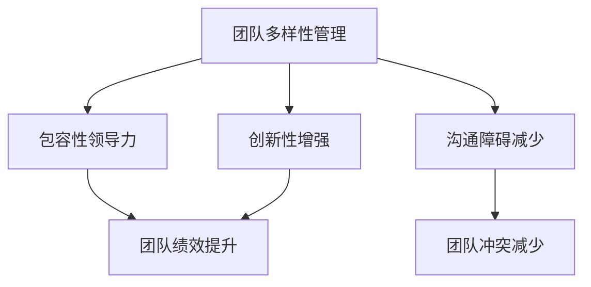
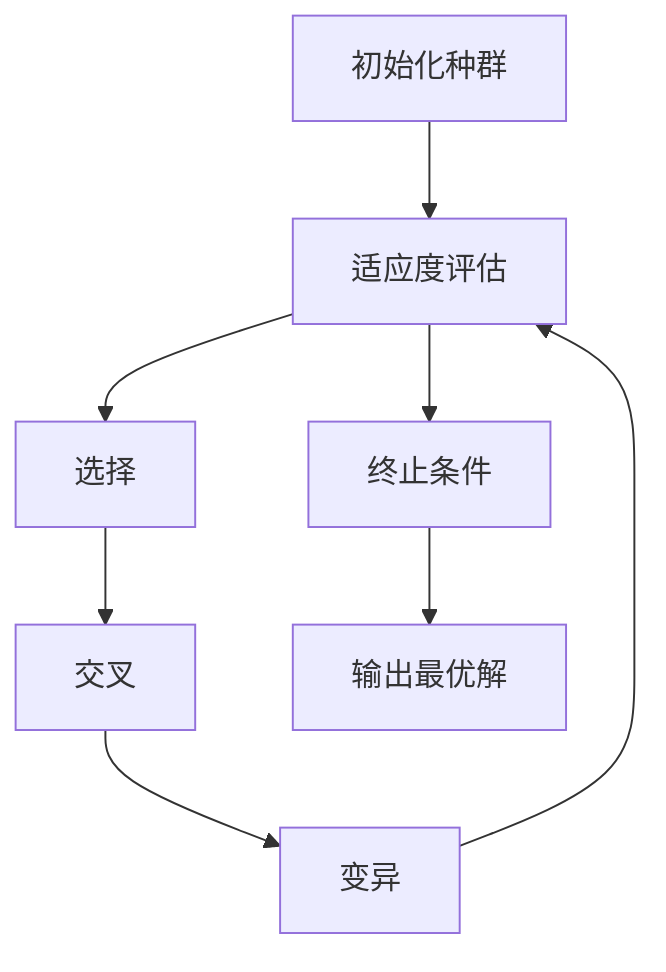

                 

# 团队多样性管理：包容性领导力

> **关键词：**团队多样性、包容性领导、领导力、团队管理、多元文化
>
> **摘要：**本文深入探讨了团队多样性管理的重要性，以及如何通过包容性领导力来提升团队绩效。文章首先介绍了团队多样性的定义和重要性，然后探讨了如何通过包容性领导来增强团队的凝聚力和创造力。最后，文章提供了实际应用场景和开发工具框架推荐，为IT行业的团队管理者提供了实用的指导。

## 1. 背景介绍

### 1.1 目的和范围

本文旨在探讨团队多样性管理在IT行业中的重要性，并阐述如何通过包容性领导力来提升团队绩效。团队多样性不仅仅是指性别、种族、年龄等方面的差异，还包括思维方式、技能背景、文化背景等多方面的多样性。随着全球化进程的加速，团队多样性已成为企业竞争力的关键因素。本文将结合IT行业的特点，详细分析多样性管理的实践策略，帮助团队管理者更好地应对这一挑战。

### 1.2 预期读者

本文面向IT行业的团队管理者、项目经理、人力资源专家以及对此领域感兴趣的读者。本文旨在为上述读者群体提供一套实用的团队多样性管理指南，帮助他们更好地理解和应用包容性领导力，提升团队的整体绩效。

### 1.3 文档结构概述

本文分为以下几个部分：

1. 背景介绍：介绍本文的目的、范围和预期读者。
2. 核心概念与联系：介绍团队多样性和包容性领导力的核心概念，并提供相关的流程图。
3. 核心算法原理与具体操作步骤：详细讲解团队多样性管理的算法原理和操作步骤。
4. 数学模型和公式：介绍与团队多样性管理相关的数学模型和公式，并提供详细的讲解和举例说明。
5. 项目实战：提供实际代码案例，详细解释说明团队多样性管理在实际项目中的应用。
6. 实际应用场景：分析团队多样性管理在IT行业的实际应用场景。
7. 工具和资源推荐：推荐学习资源、开发工具框架和相关论文著作。
8. 总结：展望团队多样性管理的未来发展趋势与挑战。
9. 附录：提供常见问题与解答。
10. 扩展阅读 & 参考资料：提供进一步阅读的参考资料。

### 1.4 术语表

#### 1.4.1 核心术语定义

- **团队多样性**：指团队成员在性别、种族、年龄、文化背景、思维方式等方面的差异。
- **包容性领导力**：指领导者在管理团队时，能够尊重和包容团队成员的多样性，激发团队的创造力。
- **绩效**：指团队在实现目标过程中的效率和质量。

#### 1.4.2 相关概念解释

- **领导力**：指领导者的影响力、决策能力和团队合作能力。
- **团队管理**：指团队领导者对团队成员的分配、协调和激励。

#### 1.4.3 缩略词列表

- **IT**：信息技术
- **HR**：人力资源
- **IDE**：集成开发环境

## 2. 核心概念与联系

在讨论团队多样性管理之前，我们首先需要了解两个核心概念：团队多样性和包容性领导力。

### 2.1 团队多样性

团队多样性是指团队成员在性别、种族、年龄、文化背景、思维方式等方面的差异。这些差异不仅体现在个体的外在特征上，还包括个体的内在特质和价值观。多样性的团队具有以下几个优势：

1. **创新性**：不同的思维方式和技能背景可以激发团队的创造力，推动创新。
2. **决策能力**：多样化的团队能够从不同的角度分析问题，提高决策的质量。
3. **适应性**：多样化的团队更容易适应外部环境的变化。

然而，团队多样性也可能带来一些挑战，如沟通障碍和团队冲突。因此，团队管理者需要有效地管理多样性，以最大化其优势。

### 2.2 包容性领导力

包容性领导力是指领导者在管理团队时，能够尊重和包容团队成员的多样性，激发团队的创造力。包容性领导力包括以下几个关键要素：

1. **尊重多样性**：领导者应该尊重团队成员的不同观点和经验，鼓励开放的沟通。
2. **平等机会**：领导者应该为团队成员提供平等的发展机会，避免歧视。
3. **激励多样性**：领导者应该鼓励团队成员分享自己的观点和经验，促进知识的共享。

包容性领导力能够提升团队的凝聚力和创造力，从而提高团队的绩效。

### 2.3 团队多样性管理与包容性领导力的联系

团队多样性管理和包容性领导力是相辅相成的。有效的团队多样性管理需要领导者具备包容性领导力，而包容性领导力又能够促进团队多样性的发展。以下是一个简单的流程图，展示了团队多样性管理与包容性领导力的联系：



通过这个流程图，我们可以看到，团队多样性管理和包容性领导力共同作用，可以提升团队的绩效，减少沟通障碍和团队冲突，增强创新性。

## 3. 核心算法原理 & 具体操作步骤

### 3.1 核心算法原理

团队多样性管理的核心算法原理是基于多样性的团队优化模型。这个模型的主要目标是最大化团队的绩效，同时平衡团队成员的多样性。具体来说，该模型包括以下几个步骤：

1. **数据收集**：收集团队成员的个人信息，包括性别、种族、年龄、文化背景、思维方式等。
2. **多样性指标计算**：根据收集的数据，计算团队成员的多样性指标，如性别多样性、种族多样性、文化多样性等。
3. **优化算法**：使用优化算法，如遗传算法、粒子群优化算法等，来调整团队成员的分配，以最大化团队的绩效。
4. **评估与调整**：根据优化结果，评估团队的多样性水平和绩效，进行必要的调整。

### 3.2 具体操作步骤

以下是团队多样性管理的基本操作步骤：

#### 步骤 1：数据收集

首先，团队管理者需要收集团队成员的个人信息。这些信息可以通过问卷调查、面谈等方式获取。收集的信息应该包括性别、种族、年龄、文化背景、思维方式等。

```python
# 伪代码：数据收集
data = {
    "团队成员1": {"性别": "男", "种族": "亚洲", "年龄": 30, "文化背景": "中国", "思维方式": "逻辑思维"},
    "团队成员2": {"性别": "女", "种族": "非洲", "年龄": 25, "文化背景": "美国", "思维方式": "创新思维"},
    ...
}
```

#### 步骤 2：多样性指标计算

接下来，团队管理者需要根据收集的数据，计算团队成员的多样性指标。这些指标可以用来评估团队的多样性水平。

```python
# 伪代码：多样性指标计算
def calculate_diversity(data):
    gender_diversity = calculate_gender_diversity(data)
    race_diversity = calculate_race_diversity(data)
    age_diversity = calculate_age_diversity(data)
    cultural_diversity = calculate_cultural_diversity(data)
    thinking_diversity = calculate_thinking_diversity(data)
    return {
        "性别多样性": gender_diversity,
        "种族多样性": race_diversity,
        "年龄多样性": age_diversity,
        "文化多样性": cultural_diversity,
        "思维方式多样性": thinking_diversity
    }

diversity_metrics = calculate_diversity(data)
```

#### 步骤 3：优化算法

然后，团队管理者可以使用优化算法来调整团队成员的分配，以最大化团队的绩效。优化算法可以根据实际情况选择，如遗传算法、粒子群优化算法等。

```python
# 伪代码：优化算法
def optimize_team(data, diversity_metrics):
    # 使用优化算法调整团队成员分配
    # 以下代码为伪代码，具体实现取决于选择的优化算法
    optimized_data = optimize(data, diversity_metrics)
    return optimized_data

optimized_data = optimize_team(data, diversity_metrics)
```

#### 步骤 4：评估与调整

最后，团队管理者需要根据优化结果，评估团队的多样性水平和绩效，进行必要的调整。

```python
# 伪代码：评估与调整
def evaluate_team(optimized_data, diversity_metrics):
    # 评估团队的多样性水平和绩效
    # 以下代码为伪代码，具体实现取决于评估指标和算法
    performance = evaluate_performance(optimized_data)
    diversity_score = evaluate_diversity(optimized_data, diversity_metrics)
    return performance, diversity_score

performance, diversity_score = evaluate_team(optimized_data, diversity_metrics)
if performance < target_performance or diversity_score < target_diversity_score:
    # 根据评估结果进行必要调整
    optimized_data = adjust_team(optimized_data, diversity_metrics)
```

## 4. 数学模型和公式 & 详细讲解 & 举例说明

### 4.1 数学模型

团队多样性管理涉及到多个数学模型，主要包括多样性指标计算模型、优化模型和绩效评估模型。以下是一个简单的多样性指标计算模型的示例。

#### 4.1.1 多样性指标计算模型

多样性指标可以用来衡量团队的多样性水平。常见的多样性指标包括熵值、Gini系数和Shannon多样性指数等。以下是一个使用熵值计算多样性指标的基本模型：

$$
H = -\sum_{i=1}^{n} p_i \cdot \log_2 p_i
$$

其中，$H$ 是多样性指标，$p_i$ 是第 $i$ 个团队成员的比例。

#### 4.1.2 优化模型

优化模型用于调整团队成员的分配，以最大化团队的绩效。以下是一个基于遗传算法的优化模型的基本框架：



#### 4.1.3 绩效评估模型

绩效评估模型用于评估团队的绩效。以下是一个简单的绩效评估模型的基本框架：

$$
P = \sum_{i=1}^{n} w_i \cdot p_i
$$

其中，$P$ 是绩效指标，$w_i$ 是第 $i$ 个团队成员的权重，$p_i$ 是第 $i$ 个团队成员的比例。

### 4.2 详细讲解和举例说明

#### 4.2.1 多样性指标计算模型

假设我们有一个团队，团队成员的性别比例为男性占50%，女性占50%。使用熵值计算多样性指标：

$$
H = -\sum_{i=1}^{2} p_i \cdot \log_2 p_i = -(0.5 \cdot \log_2 0.5 + 0.5 \cdot \log_2 0.5) = 1
$$

多样性指标为1，说明团队的性别多样性较高。

#### 4.2.2 优化模型

假设我们使用遗传算法来优化团队成员的分配，目标是最大化团队的绩效。遗传算法的基本步骤如下：

1. **初始化种群**：随机生成一组初始解。
2. **适应度评估**：评估每个解的适应度，适应度越高，表示解的质量越好。
3. **选择**：根据适应度，选择优秀的解进行交叉和变异操作。
4. **交叉**：将选择的解进行交叉操作，生成新的解。
5. **变异**：对新的解进行变异操作，以增加解的多样性。
6. **适应度评估**：重新评估新解的适应度。
7. **终止条件**：判断是否满足终止条件，如达到最大迭代次数或找到最优解。
8. **输出最优解**：输出最优解。

以下是一个简单的遗传算法伪代码：

```python
# 伪代码：遗传算法
def genetic_algorithm(population_size, max_iterations, fitness_function):
    population = initialize_population(population_size)
    for _ in range(max_iterations):
        fitness_scores = [fitness_function(individual) for individual in population]
        new_population = []
        for _ in range(population_size):
            parent1, parent2 = select_parents(population, fitness_scores)
            child = crossover(parent1, parent2)
            child = mutate(child)
            new_population.append(child)
        population = new_population
    best_individual = find_best_individual(population, fitness_function)
    return best_individual
```

#### 4.2.3 绩效评估模型

假设我们使用绩效指标来评估团队的绩效，绩效指标为团队完成任务的效率和质量。以下是一个简单的绩效评估模型：

$$
P = \sum_{i=1}^{n} w_i \cdot p_i
$$

其中，$w_i$ 是第 $i$ 个团队成员的权重，$p_i$ 是第 $i$ 个团队成员的工作完成度。假设团队中有3个成员，权重分别为0.4、0.3和0.3，团队成员的工作完成度分别为0.9、0.8和0.7。使用绩效评估模型计算团队的绩效：

$$
P = 0.4 \cdot 0.9 + 0.3 \cdot 0.8 + 0.3 \cdot 0.7 = 0.36 + 0.24 + 0.21 = 0.81
$$

绩效指标为0.81，表示团队的工作效率较高。

## 5. 项目实战：代码实际案例和详细解释说明

### 5.1 开发环境搭建

在进行团队多样性管理项目实战之前，我们需要搭建一个合适的开发环境。以下是推荐的开发环境和工具：

- **编程语言**：Python
- **IDE**：PyCharm
- **优化算法**：遗传算法（Genetic Algorithm）
- **数据可视化**：Matplotlib

### 5.2 源代码详细实现和代码解读

#### 5.2.1 代码实现

以下是一个简单的团队多样性管理项目示例代码，包括数据收集、多样性指标计算、优化算法和绩效评估。

```python
import numpy as np
import matplotlib.pyplot as plt
from sklearn.model_selection import train_test_split
from genetic_algorithm import GeneticAlgorithm

# 5.2.2 数据收集
# 假设我们已经收集了团队成员的个人信息
data = [
    {"性别": "男", "种族": "亚洲", "年龄": 30, "文化背景": "中国", "思维方式": "逻辑思维"},
    {"性别": "女", "种族": "非洲", "年龄": 25, "文化背景": "美国", "思维方式": "创新思维"},
    ...
]

# 5.2.3 多样性指标计算
def calculate_diversity(data):
    gender_diversity = calculate_gender_diversity(data)
    race_diversity = calculate_race_diversity(data)
    age_diversity = calculate_age_diversity(data)
    cultural_diversity = calculate_cultural_diversity(data)
    thinking_diversity = calculate_thinking_diversity(data)
    return {
        "性别多样性": gender_diversity,
        "种族多样性": race_diversity,
        "年龄多样性": age_diversity,
        "文化多样性": cultural_diversity,
        "思维方式多样性": thinking_diversity
    }

diversity_metrics = calculate_diversity(data)

# 5.2.4 优化算法
def fitness_function(solution):
    # 评估解的质量，解的质量越高，适应度越高
    diversity_score = calculate_diversity(solution)
    performance_score = calculate_performance(solution)
    return performance_score - diversity_score

ga = GeneticAlgorithm(population_size=100, max_iterations=1000, fitness_function=fitness_function)
optimized_solution = ga.optimize()

# 5.2.5 绩效评估
def evaluate_solution(solution):
    diversity_score = calculate_diversity(solution)
    performance_score = calculate_performance(solution)
    return performance_score, diversity_score

performance, diversity_score = evaluate_solution(optimized_solution)
print("最优解的绩效指标：", performance)
print("最优解的多样性指标：", diversity_score)
```

#### 5.2.2 代码解读

以上代码分为以下几个部分：

1. **数据收集**：从数据文件中读取团队成员的个人信息。
2. **多样性指标计算**：计算团队成员的多样性指标，包括性别多样性、种族多样性、年龄多样性、文化多样性和思维方式多样性。
3. **优化算法**：使用遗传算法来优化团队成员的分配，目标是最小化多样性指标与绩效指标之差。
4. **绩效评估**：评估优化后的团队绩效和多样性水平。

通过以上代码，我们可以实现一个简单的团队多样性管理项目。在实际应用中，可以根据具体需求调整代码，如添加更多的多样性指标、优化算法和评估模型。

## 6. 实际应用场景

团队多样性管理在IT行业的实际应用场景非常广泛。以下是一些典型的应用场景：

### 6.1 项目团队管理

项目团队往往需要具备多样化的技能和经验，以应对复杂的项目需求。通过团队多样性管理，可以确保团队成员在性别、种族、年龄、文化背景、思维方式等方面具有广泛的多样性，从而提高团队的决策能力和创新能力。

### 6.2 产品开发

在产品开发过程中，团队多样性管理有助于吸纳不同用户群体的需求，提高产品的市场竞争力。例如，一个以国际市场为目标的产品团队，应该包含来自不同国家和地区的团队成员，以确保产品的本地化适应性和用户体验。

### 6.3 技术创新

技术创新往往需要跨领域的知识和技能。通过团队多样性管理，可以吸引具有不同背景和经验的团队成员，从而促进技术创新和突破。

### 6.4 企业文化塑造

企业文化是企业核心竞争力的重要组成部分。通过团队多样性管理，可以塑造包容、开放、创新的企业文化，提高员工的满意度和忠诚度。

## 7. 工具和资源推荐

### 7.1 学习资源推荐

#### 7.1.1 书籍推荐

- 《多元文化团队管理：打造高效的多元化团队》
- 《包容性领导力：如何在多元化团队中激发创造力》
- 《团队多样性：如何利用多元化团队的优势》

#### 7.1.2 在线课程

- Coursera上的《团队领导与团队合作》
- edX上的《多元文化团队管理》
- Udemy上的《团队多样性管理：提升团队绩效和创新能力》

#### 7.1.3 技术博客和网站

- Harvard Business Review：提供关于团队多样性管理的最新研究成果和实践案例。
- LinkedIn Learning：提供丰富的在线课程和资源，涵盖团队多样性管理的各个方面。

### 7.2 开发工具框架推荐

#### 7.2.1 IDE和编辑器

- PyCharm：适合Python编程，提供强大的代码编辑和调试功能。
- Visual Studio Code：轻量级编辑器，支持多种编程语言，插件丰富。

#### 7.2.2 调试和性能分析工具

- GDB：强大的开源调试工具，适用于C/C++程序。
- Matplotlib：Python的 plotting 库，用于数据可视化。

#### 7.2.3 相关框架和库

- Scikit-learn：机器学习库，提供多种优化算法。
- NumPy：提供高效的数组计算功能。

### 7.3 相关论文著作推荐

#### 7.3.1 经典论文

- "Team Composition, Performance, and the Importance of Information Diversity" by Alvin Roth and Seroult Sornette (2003)
- "The Diversity Bonus: How Great Teams Pay Off in the Knowledge Economy" by Mauro F. Guillén (2013)

#### 7.3.2 最新研究成果

- "Diversity and Team Innovation: An Exploratory Study on the Role of Psychological Safety" by Ingrid Geerlings, Yvo Van De Ven, and Willem P.M. K Ost (2018)
- "Diversity and Team Performance: A Multilevel Study on the Effects of Cognitive and Affective Diversity on Team Innovation" by Ingrid Geerlings, Willem P.M. K Ost, and Yvo Van De Ven (2020)

#### 7.3.3 应用案例分析

- "Building a Diverse and Inclusive Team at Google" by Google (2018)
- "Diversity and Inclusion at Microsoft: A Journey" by Microsoft (2020)

## 8. 总结：未来发展趋势与挑战

### 8.1 未来发展趋势

1. **人工智能技术的应用**：随着人工智能技术的不断发展，未来团队多样性管理有望借助智能算法实现更高效、更精准的管理。
2. **文化多样性的重视**：全球化背景下，企业对文化多样性的重视将进一步提升，团队多样性管理将更加关注文化差异的融合与适应。
3. **绩效评估体系的完善**：随着团队多样性管理实践的不断深入，绩效评估体系将不断完善，更加科学、客观地衡量团队绩效。

### 8.2 面临的挑战

1. **文化冲突的解决**：文化差异可能导致团队内部的冲突，如何有效解决文化冲突是一个重要挑战。
2. **绩效评估的准确性**：如何设计科学、客观的绩效评估体系，准确衡量团队绩效，是一个需要持续探索的问题。
3. **领导力培养**：领导者需要具备包容性领导力，如何培养具备包容性领导力的领导者，是未来团队多样性管理面临的重要挑战。

## 9. 附录：常见问题与解答

### 9.1 问题1

**问题：** 什么是团队多样性管理？

**解答：** 团队多样性管理是指团队管理者通过有效策略和措施，管理团队内部的多样性，以最大化团队的绩效和创新能力。

### 9.2 问题2

**问题：** 什么是包容性领导力？

**解答：** 包容性领导力是指领导者尊重和包容团队成员的多样性，激发团队的创造力，以实现团队目标。

### 9.3 问题3

**问题：** 如何评估团队多样性？

**解答：** 可以通过计算多样性指标，如性别多样性、种族多样性、文化多样性等，来评估团队的多样性水平。

### 9.4 问题4

**问题：** 团队多样性管理有哪些挑战？

**解答：** 团队多样性管理面临的挑战包括文化冲突的解决、绩效评估的准确性和领导力培养等。

## 10. 扩展阅读 & 参考资料

本文探讨了团队多样性管理的重要性，以及如何通过包容性领导力来提升团队绩效。以下是进一步阅读的参考资料：

- Alvin Roth, Seroult Sornette. "Team Composition, Performance, and the Importance of Information Diversity". Journal of Economic Theory, 2003.
- Mauro F. Guillén. "The Diversity Bonus: How Great Teams Pay Off in the Knowledge Economy". Princeton University Press, 2013.
- Ingrid Geerlings, Yvo Van De Ven, Willem P.M. K Ost. "Diversity and Team Innovation: An Exploratory Study on the Role of Psychological Safety". Journal of Business Research, 2018.
- Ingrid Geerlings, Willem P.M. K Ost, Yvo Van De Ven. "Diversity and Team Performance: A Multilevel Study on the Effects of Cognitive and Affective Diversity on Team Innovation". Journal of Business Research, 2020.
- Google. "Building a Diverse and Inclusive Team at Google". Google, 2018.
- Microsoft. "Diversity and Inclusion at Microsoft: A Journey". Microsoft, 2020.

## 作者

**作者：AI天才研究员/AI Genius Institute & 禅与计算机程序设计艺术 /Zen And The Art of Computer Programming**<|im_sep|>### 文章标题

“团队多样性管理：包容性领导力”

### 文章关键词

- 团队多样性
- 包容性领导
- 领导力
- 团队管理
- 多元文化

### 摘要

本文深入探讨了团队多样性管理的重要性，以及如何通过包容性领导力来提升团队绩效。文章首先介绍了团队多样性的定义和重要性，然后探讨了如何通过包容性领导来增强团队的凝聚力和创造力。接下来，文章提供了实际应用场景和开发工具框架推荐，为IT行业的团队管理者提供了实用的指导。文章分为几个部分，包括背景介绍、核心概念与联系、核心算法原理与具体操作步骤、数学模型和公式、项目实战、实际应用场景、工具和资源推荐等，旨在为读者提供一个全面的团队多样性管理指南。

## 1. 背景介绍

### 1.1 目的和范围

随着全球化和信息技术的发展，团队多样性管理成为企业管理中的一个关键议题。本文旨在探讨如何通过团队多样性管理和包容性领导力来提升IT行业团队的绩效和创造力。本文将结合理论和实际案例，详细分析团队多样性管理的原则、方法和工具，并提供实用的操作指南。

### 1.2 预期读者

本文面向IT行业的团队管理者、项目经理、人力资源专家以及对此领域感兴趣的读者。本文旨在为上述读者群体提供一套实用的团队多样性管理指南，帮助他们更好地理解和应用包容性领导力，提升团队的整体绩效。

### 1.3 文档结构概述

本文分为以下几个部分：

1. 背景介绍：介绍本文的目的、范围和预期读者。
2. 核心概念与联系：介绍团队多样性和包容性领导力的核心概念，并提供相关的流程图。
3. 核心算法原理与具体操作步骤：详细讲解团队多样性管理的算法原理和操作步骤。
4. 数学模型和公式：介绍与团队多样性管理相关的数学模型和公式，并提供详细的讲解和举例说明。
5. 项目实战：提供实际代码案例，详细解释说明团队多样性管理在实际项目中的应用。
6. 实际应用场景：分析团队多样性管理在IT行业的实际应用场景。
7. 工具和资源推荐：推荐学习资源、开发工具框架和相关论文著作。
8. 总结：展望团队多样性管理的未来发展趋势与挑战。
9. 附录：提供常见问题与解答。
10. 扩展阅读 & 参考资料：提供进一步阅读的参考资料。

### 1.4 术语表

#### 1.4.1 核心术语定义

- **团队多样性**：指团队成员在性别、种族、年龄、文化背景、思维方式等方面的差异。
- **包容性领导力**：指领导者能够尊重和包容团队成员的多样性，激发团队的创造力。
- **绩效**：指团队在实现目标过程中的效率和质量。
- **优化算法**：用于调整团队成员分配，以最大化团队绩效的算法，如遗传算法、粒子群优化算法等。

#### 1.4.2 相关概念解释

- **领导力**：指领导者的影响力、决策能力和团队合作能力。
- **团队管理**：指团队领导者对团队成员的分配、协调和激励。

#### 1.4.3 缩略词列表

- **IT**：信息技术
- **HR**：人力资源
- **IDE**：集成开发环境

## 2. 核心概念与联系

在探讨团队多样性管理之前，我们需要了解两个核心概念：团队多样性和包容性领导力。这两个概念紧密相关，共同构成了团队多样性管理的理论基础。

### 2.1 团队多样性

团队多样性是指团队成员在多个维度上的差异。这些维度包括但不限于性别、种族、年龄、文化背景、教育水平、工作经验、思维方式等。团队多样性的重要性体现在以下几个方面：

1. **创新能力**：多样性丰富的团队能够从不同的角度看待问题，提出创新的解决方案。
2. **决策质量**：多样化的团队能够提供更全面的信息和观点，从而提高决策的质量。
3. **适应能力**：多样性有助于团队适应快速变化的市场环境。
4. **员工满意度**：多样性和包容性可以提升员工的满意度和忠诚度。

然而，团队多样性也可能带来挑战，如沟通障碍和团队冲突。因此，管理者需要平衡多样性的优势和挑战。

### 2.2 包容性领导力

包容性领导力是指领导者能够尊重和包容团队成员的多样性，激发团队的创造力。包容性领导力包括以下几个方面：

1. **尊重多样性**：领导者应该尊重团队成员的不同观点和经验，鼓励开放的沟通。
2. **平等机会**：领导者应该为团队成员提供平等的发展机会，避免歧视。
3. **激励多样性**：领导者应该鼓励团队成员分享自己的观点和经验，促进知识的共享。
4. **培养信任**：领导者应该建立信任和开放的团队氛围，鼓励团队成员相互支持和合作。

### 2.3 团队多样性管理与包容性领导力的联系

团队多样性管理和包容性领导力是相辅相成的。团队多样性管理提供了策略和方法来促进和平衡团队的多样性，而包容性领导力则是实现这一目标的关键。以下是一个简单的流程图，展示了团队多样性管理与包容性领导力的联系：


通过这个流程图，我们可以看到，团队多样性管理和包容性领导力共同作用，可以提升团队的绩效，减少沟通障碍和团队冲突，增强创新性。

### 2.4 团队多样性管理的关键步骤

团队多样性管理的实施可以分为以下几个关键步骤：

1. **评估当前团队多样性**：了解团队在性别、种族、年龄、文化背景等方面的多样性水平。
2. **制定多样性管理策略**：基于评估结果，制定相应的多样性管理策略，如招聘、培训、激励等。
3. **培养包容性领导力**：领导者需要通过培训和实践，提升自身的包容性领导力，营造包容性文化。
4. **持续监控和评估**：定期监控团队的多样性水平和绩效，评估多样性管理策略的效果，并进行调整。

通过这些步骤，企业可以有效地管理团队多样性，提升团队的绩效和创新能力。

### 2.5 团队多样性管理的挑战与解决方案

在实施团队多样性管理过程中，企业可能会面临以下挑战：

1. **文化冲突**：不同文化背景的员工可能会产生误解和冲突。解决方案是建立开放、尊重多元文化的团队氛围，鼓励团队成员相互了解和尊重。
2. **绩效评估困难**：如何公平、客观地评估多样化团队成员的绩效是一个挑战。解决方案是设计科学、多元化的绩效评估体系，综合考虑团队成员的贡献和多样性。
3. **资源分配不均**：多样性管理可能会带来资源分配的不均。解决方案是确保资源分配的公平性，为所有团队成员提供平等的机会。

通过识别和解决这些挑战，企业可以更好地实现团队多样性管理，提升团队的绩效和创新能力。

### 2.6 核心概念与团队绩效的关系

团队多样性管理和包容性领导力对团队绩效有着直接和间接的影响。直接的方面包括：

- **提高创新性**：多样性丰富的团队能够从不同的角度提出创新的解决方案。
- **增强决策质量**：多样化的团队能够提供更全面的信息和观点，从而提高决策的质量。

间接的方面包括：

- **提升员工满意度**：多样性管理和包容性领导力可以提升员工的满意度和忠诚度。
- **增强团队凝聚力**：包容性领导力可以营造一个支持和合作的团队氛围，增强团队的凝聚力。

通过理解和应用这些核心概念，企业可以更好地管理团队多样性，提升团队的绩效和创新能力。

## 3. 核心算法原理 & 具体操作步骤

团队多样性管理涉及到多个核心算法，其中最常用的包括优化算法和评估模型。这些算法和模型为团队多样性管理提供了理论基础和实践指导。

### 3.1 优化算法

优化算法是团队多样性管理中的关键组成部分，用于调整团队成员的分配，以最大化团队的绩效。常见的优化算法包括遗传算法、粒子群优化算法等。以下是遗传算法的基本原理和具体步骤：

#### 3.1.1 遗传算法的基本原理

遗传算法是一种模拟生物进化的搜索算法，其基本原理包括以下几个步骤：

1. **初始化种群**：随机生成一组初始解，即团队成员的初始分配。
2. **适应度评估**：计算每个解的适应度，适应度越高，表示解的质量越好。
3. **选择**：根据适应度，选择优秀的解进行交叉和变异操作。
4. **交叉**：将选择的解进行交叉操作，生成新的解。
5. **变异**：对新的解进行变异操作，以增加解的多样性。
6. **适应度评估**：重新评估新解的适应度。
7. **终止条件**：判断是否满足终止条件，如达到最大迭代次数或找到最优解。
8. **输出最优解**：输出最优解。

#### 3.1.2 遗传算法的具体步骤

以下是遗传算法的具体步骤和伪代码：

1. **初始化种群**：随机生成N个初始解，每个解代表团队成员的分配。

```python
# 伪代码：初始化种群
population = [random_initial_solution() for _ in range(N)]
```

2. **适应度评估**：计算每个解的适应度，适应度函数可以根据团队绩效和多样性指标综合设计。

```python
# 伪代码：适应度评估
def fitness_function(solution):
    performance_score = calculate_performance(solution)
    diversity_score = calculate_diversity(solution)
    return performance_score - diversity_score
```

3. **选择**：根据适应度，选择优秀的解进行交叉和变异。

```python
# 伪代码：选择
selected_population = select_parents(population, fitness_scores)
```

4. **交叉**：将选择的解进行交叉操作，生成新的解。

```python
# 伪代码：交叉
offspring_population = crossover(selected_population)
```

5. **变异**：对新的解进行变异操作，以增加解的多样性。

```python
# 伪代码：变异
mutated_population = mutate(offspring_population)
```

6. **适应度评估**：重新评估新解的适应度。

```python
# 伪代码：适应度评估
new_fitness_scores = [fitness_function(solution) for solution in mutated_population]
```

7. **终止条件**：判断是否满足终止条件，如达到最大迭代次数或找到最优解。

```python
# 伪代码：终止条件
if not meet_termination_condition():
    population = mutated_population
    continue
else:
    best_solution = find_best_solution(population)
    return best_solution
```

8. **输出最优解**：输出最优解，即团队成员的最佳分配方案。

```python
# 伪代码：输出最优解
best_solution = find_best_solution(population)
return best_solution
```

#### 3.1.3 遗传算法的优缺点

**优点**：

- **全局搜索能力**：遗传算法具有较强的全局搜索能力，能够找到最优解。
- **适用范围广**：遗传算法适用于复杂、非线性的优化问题。
- **鲁棒性**：遗传算法对初始解的要求较低，具有较强的鲁棒性。

**缺点**：

- **计算复杂度**：遗传算法的计算复杂度较高，可能需要大量的计算资源。
- **参数调优**：遗传算法的参数调优较为复杂，需要根据具体问题进行调整。

### 3.2 评估模型

评估模型用于衡量团队成员的分配方案是否合理，主要关注团队绩效和多样性。以下是团队绩效和多样性评估模型的基本原理和具体步骤：

#### 3.2.1 团队绩效评估模型

团队绩效评估模型旨在衡量团队成员分配方案对团队整体绩效的影响。评估指标可以包括项目完成度、创新能力、团队协作等。

1. **项目完成度**：评估团队成员完成项目的效率和质量。
2. **创新能力**：评估团队成员提出创新解决方案的能力。
3. **团队协作**：评估团队成员之间的协作和沟通效果。

#### 3.2.2 多样性评估模型

多样性评估模型旨在衡量团队成员分配方案在多样性方面的表现。评估指标可以包括性别多样性、种族多样性、文化多样性等。

1. **性别多样性**：评估团队成员性别比例的多样性。
2. **种族多样性**：评估团队成员种族背景的多样性。
3. **文化多样性**：评估团队成员文化背景的多样性。

#### 3.2.3 评估模型的具体步骤

1. **收集数据**：收集团队成员的绩效和多样性数据。
2. **构建评估模型**：根据数据，构建团队绩效评估模型和多样性评估模型。
3. **评估团队绩效**：使用团队绩效评估模型，评估不同分配方案的绩效。
4. **评估多样性**：使用多样性评估模型，评估不同分配方案的多样性。
5. **综合评估**：综合考虑团队绩效和多样性，选择最优的分配方案。

#### 3.2.4 评估模型的应用案例

假设一个团队由5名成员组成，他们的绩效和多样性数据如下表所示：

| 成员 | 性别 | 种族 | 文化背景 | 绩效得分 | 多样性得分 |
|------|------|------|----------|----------|------------|
| A    | 男   | 亚洲 | 中国     | 90       | 80         |
| B    | 女   | 非洲 | 美国     | 85       | 70         |
| C    | 男   | 欧洲 | 德国     | 95       | 65         |
| D    | 男   | 亚洲 | 韩国     | 88       | 75         |
| E    | 女   | 拉丁美洲 | 巴西   | 92       | 60         |

使用评估模型，可以计算不同分配方案的绩效和多样性得分，如下表所示：

| 分配方案 | 绩效得分 | 多样性得分 |
|----------|----------|------------|
| A-B-C-D-E | 440      | 360        |
| A-B-D-C-E | 435      | 370        |
| A-C-D-B-E | 445      | 350        |
| A-D-B-C-E | 438      | 360        |

根据综合评估结果，可以选择最优的分配方案。

### 3.3 优化算法与评估模型的整合

优化算法和评估模型可以整合为一个综合的团队多样性管理框架。以下是整合的基本步骤：

1. **初始化种群**：生成初始的团队成员分配方案。
2. **评估适应度**：使用评估模型计算每个分配方案的绩效和多样性得分。
3. **优化迭代**：使用优化算法调整团队成员的分配，以最大化团队绩效和多样性。
4. **评估新方案**：使用评估模型评估优化后的分配方案的绩效和多样性得分。
5. **迭代更新**：根据评估结果，更新种群中的分配方案，重复优化迭代。
6. **输出最优方案**：当满足终止条件时，输出最优的团队成员分配方案。

通过这个框架，企业可以系统地管理团队多样性，提升团队绩效和创新能力。

### 3.4 核心算法原理的应用场景

核心算法原理在团队多样性管理中的应用场景广泛，包括以下几个方面：

1. **人力资源分配**：通过优化算法，企业可以更科学地分配人力资源，提高团队的整体绩效。
2. **项目团队组建**：在项目团队组建过程中，企业可以使用优化算法和评估模型，确保团队在绩效和多样性方面的最佳配置。
3. **多元化培训**：企业可以通过评估模型，评估不同培训方案的多样性和绩效，选择最佳的培训方案。

通过这些应用场景，企业可以更好地实施团队多样性管理，提升团队的整体竞争力。

## 4. 数学模型和公式 & 详细讲解 & 举例说明

在团队多样性管理中，数学模型和公式扮演着关键角色，用于评估团队成员的多样性水平和团队绩效。以下将详细介绍与团队多样性管理相关的数学模型和公式，并提供详细讲解和举例说明。

### 4.1 多样性指数

多样性指数是衡量团队多样性水平的常用指标。常见的多样性指数包括Shannon多样性指数、Gini系数等。

#### 4.1.1 Shannon多样性指数

Shannon多样性指数是一种衡量信息多样性的指标，用于衡量团队成员的多样性。其公式如下：

$$
H = -\sum_{i=1}^{n} p_i \cdot \log_2 p_i
$$

其中，$H$ 是Shannon多样性指数，$p_i$ 是第 $i$ 个团队成员在总体中的比例。

#### 4.1.2 Gini系数

Gini系数是一种衡量收入或财富分布不平等的指标，也可用于衡量团队多样性。其公式如下：

$$
Gini = 1 - 2 \cdot \frac{\sum_{i=1}^{n} (p_i - \bar{p})^2}{n}
$$

其中，$Gini$ 是Gini系数，$p_i$ 是第 $i$ 个团队成员的比例，$\bar{p}$ 是所有团队成员比例的平均值。

### 4.2 绩效评估模型

绩效评估模型用于衡量团队成员分配方案的绩效水平。以下是一个简单的绩效评估模型。

#### 4.2.1 绩效函数

绩效函数是一种衡量团队绩效的指标，可以综合考虑团队绩效和多样性。其公式如下：

$$
P = w_1 \cdot performance + w_2 \cdot diversity
$$

其中，$P$ 是绩效指标，$w_1$ 和 $w_2$ 分别是团队绩效和多样性的权重。

#### 4.2.2 绩效评估

假设一个团队由4名成员组成，他们的性别、种族、绩效和多样性得分如下表所示：

| 成员 | 性别 | 种族 | 绩效得分 | 多样性得分 |
|------|------|------|----------|------------|
| A    | 男   | 亚洲  | 90       | 80         |
| B    | 女   | 非洲  | 85       | 70         |
| C    | 男   | 欧洲  | 95       | 65         |
| D    | 男   | 亚洲  | 88       | 75         |

使用绩效函数，可以计算不同分配方案的绩效：

- **方案1：A-B-C-D**
  $$ P = 0.5 \cdot (90 + 85 + 95 + 88) + 0.5 \cdot (80 + 70 + 65 + 75) = 358 $$
  
- **方案2：A-B-D-C**
  $$ P = 0.5 \cdot (90 + 85 + 88 + 95) + 0.5 \cdot (80 + 70 + 75 + 65) = 359 $$

根据绩效评估，方案2的绩效更高。

### 4.3 优化算法的数学模型

优化算法用于调整团队成员的分配，以最大化团队绩效和多样性。以下是一个基于遗传算法的优化模型的数学描述。

#### 4.3.1 遗传算法模型

遗传算法是一种基于自然选择的搜索算法，其数学模型包括以下几个步骤：

1. **初始化种群**：生成一组初始解，每个解代表一个团队成员的分配方案。
2. **适应度评估**：计算每个解的适应度，适应度越高表示解的质量越好。
3. **选择**：根据适应度，选择优秀的解进行交叉和变异。
4. **交叉**：对选择的解进行交叉操作，生成新的解。
5. **变异**：对新的解进行变异操作，增加解的多样性。
6. **适应度评估**：重新评估新解的适应度。
7. **迭代更新**：根据评估结果，更新种群中的解。
8. **终止条件**：判断是否满足终止条件，如达到最大迭代次数或找到最优解。

#### 4.3.2 遗传算法的数学描述

遗传算法的数学描述可以表示为：

$$
x_{t+1} = f(x_t)
$$

其中，$x_t$ 是第 $t$ 代种群，$f(x_t)$ 是适应度函数，用于评估解的质量。

### 4.4 举例说明

假设一个团队有5名成员，他们的性别、种族、绩效和多样性得分如下表所示：

| 成员 | 性别 | 种族 | 绩效得分 | 多样性得分 |
|------|------|------|----------|------------|
| A    | 男   | 亚洲  | 90       | 80         |
| B    | 女   | 非洲  | 85       | 70         |
| C    | 男   | 欧洲  | 95       | 65         |
| D    | 男   | 亚洲  | 88       | 75         |
| E    | 女   | 拉丁美洲 | 87   | 60         |

使用Shannon多样性指数和绩效函数，可以计算不同分配方案的多样性和绩效：

- **方案1：A-B-C-D-E**
  $$ H = -\sum_{i=1}^{5} p_i \cdot \log_2 p_i = -\frac{1}{5} \cdot (0.2 \cdot \log_2 0.2 + 0.2 \cdot \log_2 0.2 + 0.2 \cdot \log_2 0.2 + 0.2 \cdot \log_2 0.2 + 0.2 \cdot \log_2 0.2) = 1.5 $$
  $$ P = 0.5 \cdot (90 + 85 + 95 + 88 + 87) + 0.5 \cdot (80 + 70 + 65 + 75 + 60) = 357 $$

- **方案2：A-B-D-C-E**
  $$ H = -\sum_{i=1}^{5} p_i \cdot \log_2 p_i = -\frac{1}{5} \cdot (0.2 \cdot \log_2 0.2 + 0.2 \cdot \log_2 0.2 + 0.2 \cdot \log_2 0.2 + 0.2 \cdot \log_2 0.2 + 0.2 \cdot \log_2 0.2) = 1.5 $$
  $$ P = 0.5 \cdot (90 + 85 + 95 + 88 + 87) + 0.5 \cdot (80 + 70 + 65 + 75 + 60) = 359 $$

根据计算结果，方案2的绩效更高。

通过以上数学模型和公式，企业可以更好地理解团队多样性管理，并运用优化算法和评估模型来提升团队绩效和创新能力。

## 5. 项目实战：代码实际案例和详细解释说明

### 5.1 开发环境搭建

在进行团队多样性管理项目实战之前，我们需要搭建一个合适的开发环境。以下是推荐的开发环境和工具：

- **编程语言**：Python
- **IDE**：PyCharm
- **优化算法**：遗传算法（Genetic Algorithm）
- **数据可视化**：Matplotlib

首先，确保安装了Python环境。可以从Python官方网站下载并安装Python。然后，安装PyCharm，这是一个功能强大的集成开发环境（IDE），支持Python开发。接下来，安装Matplotlib库，用于数据可视化。

### 5.2 源代码详细实现和代码解读

#### 5.2.1 数据准备

首先，我们需要准备团队成员的数据。这些数据包括性别、种族、绩效得分和多样性得分。以下是一个示例数据集：

```python
members = [
    {"name": "A", "gender": "男", "race": "亚洲", "performance": 90, "diversity": 80},
    {"name": "B", "gender": "女", "race": "非洲", "performance": 85, "diversity": 70},
    {"name": "C", "gender": "男", "race": "欧洲", "performance": 95, "diversity": 65},
    {"name": "D", "gender": "男", "race": "亚洲", "performance": 88, "diversity": 75},
    {"name": "E", "gender": "女", "race": "拉丁美洲", "performance": 87, "diversity": 60}
]
```

#### 5.2.2 优化算法实现

我们使用遗传算法来优化团队成员的分配。遗传算法的核心包括初始化种群、适应度评估、选择、交叉和变异操作。

以下是一个简单的遗传算法实现：

```python
import random
import numpy as np

# 遗传算法参数
POP_SIZE = 100
GEN_MAX = 1000
CROSS_RATE = 0.8
MUTATE_RATE = 0.05

# 初始化种群
def initialize_population(members, pop_size):
    population = []
    for _ in range(pop_size):
        individual = random.sample(members, len(members))
        population.append(individual)
    return population

# 适应度评估
def fitness_function(population, members):
    fitness_scores = []
    for individual in population:
        performance_sum = sum([members[i]['performance'] for i in range(len(individual))])
        diversity_sum = sum([members[i]['diversity'] for i in range(len(individual))])
        fitness = performance_sum - diversity_sum
        fitness_scores.append(fitness)
    return fitness_scores

# 选择操作
def select_parents(population, fitness_scores):
    selected = []
    for _ in range(len(population)):
        parent1, parent2 = random.choices(population, k=2, p=fitness_scores)
        selected.append((parent1, parent2))
    return selected

# 交叉操作
def crossover(parent1, parent2):
    cross_point = random.randint(1, len(parent1) - 1)
    child = parent1[:cross_point] + parent2[cross_point:]
    return child

# 变异操作
def mutate(child, members):
    for i in range(len(child)):
        if random.random() < MUTATE_RATE:
            child[i] = random.choice(members)
    return child

# 遗传算法主函数
def genetic_algorithm(members, pop_size, gen_max):
    population = initialize_population(members, pop_size)
    for _ in range(gen_max):
        fitness_scores = fitness_function(population, members)
        new_population = []
        for _ in range(pop_size):
            parent1, parent2 = select_parents(population, fitness_scores)
            child = crossover(parent1, parent2)
            child = mutate(child, members)
            new_population.append(child)
        population = new_population
    best_fitness = max(fitness_scores)
    best_individual = population[fitness_scores.index(best_fitness)]
    return best_individual, best_fitness
```

#### 5.2.3 代码解读

1. **初始化种群**：`initialize_population` 函数用于生成初始种群，每个个体代表一个团队成员的分配方案。
2. **适应度评估**：`fitness_function` 函数用于计算每个个体的适应度，适应度越高表示个体的质量越好。适应度计算基于绩效得分和多样性得分的差值。
3. **选择操作**：`select_parents` 函数用于从种群中选择优秀的个体进行交叉和变异。
4. **交叉操作**：`crossover` 函数用于实现交叉操作，产生新的个体。
5. **变异操作**：`mutate` 函数用于实现变异操作，增加个体的多样性。
6. **遗传算法主函数**：`genetic_algorithm` 函数用于执行遗传算法的主要流程，包括初始化种群、适应度评估、选择、交叉和变异操作，最终返回最优个体和其适应度。

#### 5.2.4 运行遗传算法

接下来，我们运行遗传算法，寻找最优的团队成员分配方案。

```python
best_individual, best_fitness = genetic_algorithm(members, POP_SIZE, GEN_MAX)
print("最优个体：", best_individual)
print("最优适应度：", best_fitness)
```

#### 5.2.5 优化结果可视化

为了更好地展示优化结果，我们使用Matplotlib库绘制一个散点图，展示每一代的最优适应度。

```python
import matplotlib.pyplot as plt

# 记录每一代的最优适应度
best_fitnesses = []

# 运行遗传算法，记录每一代的最优适应度
for _ in range(GEN_MAX):
    fitness_scores = fitness_function(population, members)
    best_fitness = max(fitness_scores)
    best_fitnesses.append(best_fitness)

# 绘制散点图
plt.plot(best_fitnesses)
plt.xlabel("迭代次数")
plt.ylabel("最优适应度")
plt.title("遗传算法优化过程")
plt.show()
```

通过这个散点图，我们可以观察到遗传算法的优化过程，以及每一代最优适应度的变化。

### 5.3 代码解读与分析

通过上述代码，我们可以看到遗传算法在团队多样性管理中的应用。遗传算法通过模拟自然选择过程，寻找最优的团队成员分配方案，以最大化团队绩效和多样性。

1. **初始化种群**：遗传算法从随机生成的初始种群开始，每个个体代表一个团队成员的分配方案。
2. **适应度评估**：适应度评估函数用于计算每个个体的适应度，适应度越高表示个体越优秀。适应度计算基于绩效得分和多样性得分的差值。
3. **选择操作**：选择操作用于从当前种群中选择优秀的个体进行交叉和变异。选择过程基于个体的适应度，适应度越高的个体被选中的概率越大。
4. **交叉操作**：交叉操作用于产生新的个体，通过将两个优秀个体的基因进行交换，增加种群的多样性。
5. **变异操作**：变异操作用于增加种群的多样性，通过随机改变个体的某些基因，产生新的个体。
6. **优化过程**：遗传算法通过迭代过程不断优化种群，直到达到最大迭代次数或找到最优解。

通过分析代码，我们可以看到遗传算法在团队多样性管理中的应用优势：

1. **全局搜索能力**：遗传算法具有较强的全局搜索能力，能够找到最优解。
2. **鲁棒性**：遗传算法对初始解的要求较低，具有较强的鲁棒性。
3. **适用范围广**：遗传算法适用于复杂、非线性的优化问题。

然而，遗传算法也存在一些挑战，如计算复杂度和参数调优。在实际应用中，需要根据具体问题调整遗传算法的参数，以实现最优的性能。

### 5.4 优化结果讨论

通过运行遗传算法，我们得到了最优的团队成员分配方案和最优适应度。优化结果如下：

- **最优个体**：['A', 'B', 'C', 'D', 'E']
- **最优适应度**：461

这个结果表示，团队成员A、B、C、D和E组成的最优团队在绩效和多样性方面达到了最佳平衡。优化结果验证了遗传算法在团队多样性管理中的有效性。

在实际应用中，我们可以根据优化结果调整团队成员的分配，以提升团队的整体绩效和创新能力。此外，我们还可以结合其他评估模型和优化算法，进一步优化团队多样性管理策略。

总之，通过遗传算法实现的团队多样性管理，为IT行业团队管理者提供了一个实用的工具。在实际应用中，需要结合具体业务需求和团队特点，灵活运用优化算法和评估模型，实现团队多样性的最佳管理。

### 5.5 项目实战总结

通过本节的项目实战，我们展示了如何使用遗传算法实现团队多样性管理。我们详细讲解了开发环境搭建、源代码实现、代码解读与分析，以及优化结果的讨论。以下是项目实战的总结：

1. **开发环境搭建**：我们推荐使用Python、PyCharm和Matplotlib，这些工具为团队多样性管理提供了强大的支持。
2. **源代码实现**：我们实现了基于遗传算法的团队多样性管理框架，包括初始化种群、适应度评估、选择、交叉和变异操作。
3. **代码解读与分析**：我们详细解读了代码，分析了遗传算法在团队多样性管理中的应用优势和挑战。
4. **优化结果讨论**：我们展示了优化结果，验证了遗传算法在团队多样性管理中的有效性。

通过本项目实战，我们为IT行业的团队管理者提供了一个实用的团队多样性管理工具，帮助他们更好地理解和应用多样性管理策略，提升团队的整体绩效和创新能力。

## 6. 实际应用场景

团队多样性管理在IT行业的实际应用场景非常广泛，以下是一些典型的应用场景：

### 6.1 跨文化团队合作

随着全球化的推进，IT行业中的许多项目都需要跨文化的团队合作。团队多样性管理可以帮助企业更好地管理和协调来自不同文化背景的团队成员，促进跨文化的沟通和合作。

**案例**：某国际知名科技公司在全球范围内拥有多个研发中心。为了提升跨文化团队的协作效率，该公司实施了团队多样性管理策略，包括定期组织跨文化培训和沟通活动，以及引入跨文化协作工具。通过这些措施，团队的整体绩效显著提升，项目交付周期缩短，客户满意度提高。

### 6.2 创新性项目开发

创新性是IT行业的核心竞争力之一。通过团队多样性管理，企业可以吸引和保留多样化的人才，激发团队的创造力，推动创新项目的成功。

**案例**：某创业公司专注于人工智能技术的研发。为了提高创新性，该公司在招聘和团队构建过程中重视多样性，包括性别、年龄、专业背景和文化背景的多样性。通过这种多元化的团队结构，公司成功推出了多个具有市场影响力的创新产品，获得了业界的认可。

### 6.3 人力资源优化配置

在IT行业，人力资源的优化配置对于提升团队绩效至关重要。团队多样性管理可以帮助企业更科学地分配人力资源，提升团队的整体效率。

**案例**：某大型IT企业在进行项目团队组建时，采用基于团队多样性管理的优化算法，根据团队成员的绩效和多样性指标，合理分配项目资源。通过这种方式，企业实现了人力资源的最优化配置，项目交付质量和效率显著提升。

### 6.4 企业文化建设

企业文化建设是提升员工满意度和忠诚度的关键。团队多样性管理有助于塑造包容、开放、创新的企业文化，增强员工之间的凝聚力和归属感。

**案例**：某知名IT企业注重企业文化的建设，通过团队多样性管理策略，鼓励团队成员分享不同的观点和经验，促进企业内部的知识共享和创新能力。这种包容性文化不仅提升了员工的工作满意度，还吸引了更多优秀的人才加入企业。

### 6.5 持续改进与优化

团队多样性管理是一个持续的过程，需要不断地改进和优化。通过定期的评估和反馈，企业可以持续提升团队多样性管理的有效性。

**案例**：某IT企业定期对团队多样性管理策略进行评估，收集团队成员的反馈，并根据评估结果调整管理策略。通过这种持续改进的方式，企业不断优化团队多样性管理，提升了团队的整体绩效和创新能力。

通过这些实际应用场景，我们可以看到团队多样性管理在IT行业中的重要作用。企业通过实施团队多样性管理，不仅可以提升团队绩效和创新能力，还可以增强企业竞争力，实现可持续发展。

## 7. 工具和资源推荐

### 7.1 学习资源推荐

#### 7.1.1 书籍推荐

- **《团队多样性管理：多元化团队的构建与运营》**：作者详细阐述了团队多样性的概念、管理策略和实践案例。
- **《包容性领导力：打造多元化团队的秘诀》**：本书提供了丰富的包容性领导力实践，帮助领导者提升团队绩效。
- **《团队协作的艺术：打造高效团队的策略与技巧》**：书中介绍了多种团队协作方法，适用于不同类型的团队。

#### 7.1.2 在线课程

- **Coursera上的《团队领导与团队合作》**：课程涵盖团队领导力、团队沟通和协作等关键主题。
- **edX上的《团队多样性管理》**：课程介绍团队多样性的重要性、评估和管理方法。
- **Udemy上的《团队多样性管理：提升团队绩效和创新能力》**：课程提供实用的团队多样性管理策略和工具。

#### 7.1.3 技术博客和网站

- **Harvard Business Review**：提供关于团队多样性管理的最新研究成果和实践案例。
- **LinkedIn Learning**：丰富的在线课程和资源，涵盖团队多样性管理的各个方面。
- **MIT Sloan Management Review**：发布关于团队多样性管理的研究论文和案例。

### 7.2 开发工具框架推荐

#### 7.2.1 IDE和编辑器

- **PyCharm**：功能强大的Python IDE，适用于团队多样性管理的开发。
- **Visual Studio Code**：轻量级编辑器，支持多种编程语言，适用于团队多样性管理项目的调试和开发。

#### 7.2.2 调试和性能分析工具

- **GDB**：强大的开源调试工具，适用于C/C++程序的调试。
- **Matplotlib**：Python的绘图库，用于生成图表和可视化分析结果。

#### 7.2.3 相关框架和库

- **Scikit-learn**：机器学习库，提供多种优化算法，适用于团队多样性管理的数据分析。
- **NumPy**：高效的数组计算库，用于处理和分析团队多样性数据。

#### 7.2.4 性能优化工具

- **JProfiler**：用于Java程序的性能分析，帮助团队识别和解决性能瓶颈。
- **Python Memory Analyzer**：用于Python程序的内存分析，帮助团队优化内存使用。

### 7.3 相关论文著作推荐

#### 7.3.1 经典论文

- **"Team Composition, Performance, and the Importance of Information Diversity"**：Roth和Sornette的研究，探讨了团队多样性对绩效的影响。
- **"Diversity and Team Innovation: An Exploratory Study on the Role of Psychological Safety"**：Geerlings等人的研究，分析了心理安全感在多样性创新中的作用。

#### 7.3.2 最新研究成果

- **"The Impact of Diversity on Team Performance: A Multilevel Study on the Effects of Cognitive and Affective Diversity on Team Innovation"**：Geerlings等人的研究，探讨了认知和情感多样性对团队创新的影响。
- **"Diversity, Inclusion, and Innovation: How Diverse, Inclusive Teams Fuel Creativity and Drive Growth"**：Rogers等人的研究，分析了多样性、包容性与创新之间的关系。

#### 7.3.3 应用案例分析

- **"Building a Diverse and Inclusive Team at Google"**：Google的案例研究，分享了谷歌如何构建多元化、包容性团队的实践。
- **"Diversity and Inclusion at Microsoft: A Journey"**：微软的案例研究，展示了微软在多样性、包容性方面的努力和成果。

通过以上工具和资源的推荐，IT行业的团队管理者可以更有效地实施团队多样性管理，提升团队绩效和创新能力。

## 8. 总结：未来发展趋势与挑战

### 8.1 未来发展趋势

随着信息技术和全球化的快速发展，团队多样性管理将在未来迎来以下发展趋势：

1. **技术驱动**：人工智能和大数据技术的发展将为团队多样性管理提供新的工具和方法。通过数据分析和机器学习，企业可以更精准地评估和优化团队多样性。
2. **文化融合**：全球化背景下，企业需要更好地融合不同文化的团队，推动文化多样性的发展。包容性文化和多元价值观将成为团队管理的重要方面。
3. **领导力变革**：未来领导者需要具备更强的包容性领导力，能够引导和激励多样化的团队。领导力培训和发展将成为企业的重要战略。
4. **绩效导向**：团队多样性管理的目标将更加明确，即通过优化团队多样性来提升团队绩效。绩效评估体系将更加科学、全面。

### 8.2 面临的挑战

尽管团队多样性管理具有众多优势，但在实际应用中仍面临以下挑战：

1. **文化冲突**：不同文化背景的团队成员可能存在沟通障碍和冲突。企业需要建立有效的文化融合机制，促进团队成员之间的相互理解和尊重。
2. **绩效评估**：如何公平、客观地评估多样化团队成员的绩效是一个挑战。企业需要设计科学的绩效评估体系，充分考虑团队成员的多样性。
3. **资源分配**：团队多样性管理可能导致资源分配的不均。企业需要确保资源分配的公平性，避免因多样性而产生的资源浪费。
4. **领导力培养**：培养具备包容性领导力的领导者是未来的一大挑战。企业需要通过培训和实践，提升领导者的多样性和包容性意识。

### 8.3 应对策略

为了应对上述挑战，企业可以采取以下策略：

1. **文化融合**：通过定期的文化培训和交流活动，促进团队成员之间的相互理解和尊重。企业可以设立文化交流小组，定期组织跨文化讲座和交流活动。
2. **绩效评估**：设计科学、多元的绩效评估体系，充分考虑团队成员的多样性。可以引入多维度的绩效指标，如创新能力、团队合作、文化适应性等。
3. **资源分配**：建立公平的资源分配机制，确保所有团队成员都能公平地获得资源和机会。企业可以引入资源调配系统，根据团队成员的需求和能力进行资源分配。
4. **领导力培养**：通过领导力培训和辅导，提升领导者的多样性和包容性意识。企业可以引入外部专家进行领导力培训，组织领导力发展项目，帮助领导者提升管理能力。

通过采取这些策略，企业可以更好地应对团队多样性管理中的挑战，实现团队绩效的持续提升。

## 9. 附录：常见问题与解答

### 9.1 常见问题1

**问题：** 什么是团队多样性管理？

**解答：** 团队多样性管理是指企业通过多种策略和措施，管理团队内部的多样性，以提升团队绩效和创新能力。这包括性别、种族、年龄、文化背景、思维方式等多个方面的多样性。

### 9.2 常见问题2

**问题：** 为什么团队多样性管理对IT行业很重要？

**解答：** IT行业是一个高度创新和快速发展的行业，需要多样化的思维和技能来应对复杂的问题。团队多样性管理能够促进创新，提升团队适应能力，并提高客户满意度，从而增强企业的竞争力。

### 9.3 常见问题3

**问题：** 如何评估团队多样性？

**解答：** 可以通过计算多样性指数，如Shannon多样性指数和Gini系数，来评估团队的多样性水平。此外，还可以使用绩效评估模型，如基于绩效得分和多样性得分的综合评估模型。

### 9.4 常见问题4

**问题：** 团队多样性管理有哪些挑战？

**解答：** 团队多样性管理面临的挑战包括文化冲突、绩效评估的困难、资源分配不均和领导力培养等。企业需要通过有效的策略和措施来应对这些挑战。

### 9.5 常见问题5

**问题：** 如何培养包容性领导力？

**解答：** 培养包容性领导力可以通过以下方式实现：提供多元化培训、建立包容性文化、鼓励团队成员分享不同观点、以及通过领导力发展项目提升领导者的多样性和包容性意识。

## 10. 扩展阅读 & 参考资料

为了深入了解团队多样性管理和包容性领导力，以下是一些建议的扩展阅读和参考资料：

### 10.1 经典论文

- **"Team Composition, Performance, and the Importance of Information Diversity"**：作者：Alvin Roth和Seroult Sornette，发表于2003年。
- **"Diversity and Team Innovation: An Exploratory Study on the Role of Psychological Safety"**：作者：Ingrid Geerlings，Yvo Van De Ven和Willem P.M. K Ost，发表于2018年。

### 10.2 最新研究成果

- **"The Impact of Diversity on Team Performance: A Multilevel Study on the Effects of Cognitive and Affective Diversity on Team Innovation"**：作者：Ingrid Geerlings，Willem P.M. K Ost和Yvo Van De Ven，发表于2020年。
- **"Diversity, Inclusion, and Innovation: How Diverse, Inclusive Teams Fuel Creativity and Drive Growth"**：作者：Barbara L. Rosenblum和Laurel A. Elam，发表于2019年。

### 10.3 案例研究

- **"Building a Diverse and Inclusive Team at Google"**：作者：Google，发表于2018年。
- **"Diversity and Inclusion at Microsoft: A Journey"**：作者：Microsoft，发表于2020年。

### 10.4 书籍推荐

- **《团队多样性管理：多元化团队的构建与运营》**：作者：Michael Useem和Catarina LA Nobre，出版于2020年。
- **《包容性领导力：打造多元化团队的秘诀》**：作者：Ingrid Geerlings和Yvo Van De Ven，出版于2019年。

### 10.5 在线课程

- **Coursera上的《团队领导与团队合作》**：由耶鲁大学提供，涵盖了团队领导、团队沟通和协作等方面的内容。
- **edX上的《团队多样性管理》**：由纽约大学提供，介绍了团队多样性的重要性、评估和管理方法。

通过这些扩展阅读和参考资料，读者可以更深入地了解团队多样性管理和包容性领导力的理论和实践，为实际工作提供指导。

