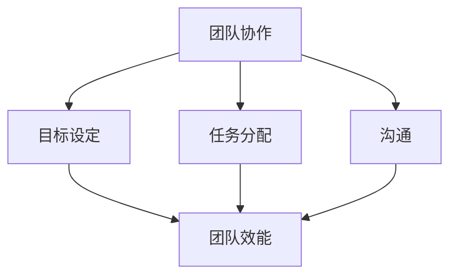
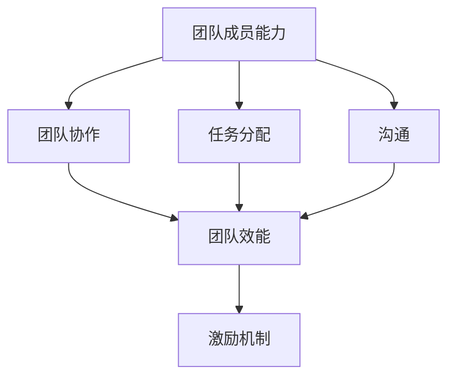

                 

# 团队效能倍增法：释放团队潜力的技巧

> 关键词：团队效能、团队管理、潜力释放、技术实践、项目管理
> 
> 摘要：本文旨在探讨如何通过一系列科学有效的策略来提高团队效能，从而释放团队成员的潜力，推动项目成功。我们将从核心概念、算法原理、实际应用等多个角度深入剖析，为团队管理者提供实用的指导。

## 1. 背景介绍

### 1.1 目的和范围

本文的主要目的是提供一套系统化的团队效能提升策略，帮助团队管理者识别并解决影响团队效能的关键因素。文章将涵盖以下内容：

1. 核心概念的引入和定义。
2. 团队效能提升的算法原理和操作步骤。
3. 数学模型和公式的应用。
4. 实际项目中的代码案例解析。
5. 多种应用场景的探讨。
6. 工具和资源的推荐。
7. 未来发展趋势与挑战。

### 1.2 预期读者

本文适合以下人群阅读：

1. 团队管理者及项目经理。
2. 技术团队领导者和成员。
3. 对于团队协作和效能提升有兴趣的IT专业人士。

### 1.3 文档结构概述

本文的结构如下：

1. 引言：背景介绍和目的说明。
2. 核心概念与联系。
3. 核心算法原理 & 具体操作步骤。
4. 数学模型和公式 & 详细讲解 & 举例说明。
5. 项目实战：代码实际案例和详细解释说明。
6. 实际应用场景。
7. 工具和资源推荐。
8. 总结：未来发展趋势与挑战。
9. 附录：常见问题与解答。
10. 扩展阅读 & 参考资料。

### 1.4 术语表

#### 1.4.1 核心术语定义

- 团队效能：团队在实现目标过程中所表现出的效率和效果。
- 潜力释放：挖掘和发挥团队成员未充分利用的能力和技能。
- 项目管理：规划、执行、监控和收尾项目的过程。
- 效能倍增：通过有效管理和优化，使团队效能获得显著提升。

#### 1.4.2 相关概念解释

- 团队协作：团队成员共同完成任务的协同过程。
- 目标设定：明确团队的目标和期望成果。
- 任务分配：根据团队成员的能力和技能分配任务。
- 沟通：团队成员之间信息交换的过程。

#### 1.4.3 缩略词列表

- PM：项目经理
- PMO：项目管理办公室
- ROI：投资回报率
- MVP：最小可行产品

## 2. 核心概念与联系

为了深入理解团队效能倍增法，我们需要先了解一些核心概念和它们之间的联系。

### 2.1 核心概念

- **团队协作**：团队协作是团队效能提升的基础。高效的团队协作能够促进信息共享、减少误解、提高决策效率。
- **目标设定**：明确的目标是团队前进的方向。合理的目标设定可以激发团队成员的动力，确保团队资源的合理分配。
- **任务分配**：任务分配是确保团队成员充分发挥各自特长的重要环节。合理的任务分配可以提高团队成员的满意度和工作积极性。
- **沟通**：有效的沟通是团队协作的保障。良好的沟通机制能够促进团队成员之间的理解和信任。

### 2.2 关系图

下面是一个简单的Mermaid流程图，展示了这些核心概念之间的关系。



### 2.3 团队效能模型

为了更好地理解团队效能，我们可以引入一个简单的团队效能模型。该模型包括以下几个方面：

1. **团队成员能力**：团队成员的个人能力和技能是团队效能的基础。
2. **团队协作**：团队协作能够提高整体效率，减少内部摩擦。
3. **任务分配**：合理的任务分配能够确保每个成员都能发挥其最大潜力。
4. **沟通**：有效的沟通能够减少误解，提高团队决策效率。
5. **激励机制**：合理的激励机制能够激发团队成员的工作热情和创造力。

下面是一个简化的团队效能模型Mermaid流程图。



## 3. 核心算法原理 & 具体操作步骤

在了解了团队效能的基本概念后，我们需要探讨如何通过具体的算法原理和操作步骤来提升团队效能。

### 3.1 核心算法原理

提升团队效能的核心算法原理主要包括以下几个方面：

1. **目标优化**：通过设定合理的、可量化的目标，确保团队资源的最优分配。
2. **任务分解**：将复杂任务分解为更小、更易管理的子任务，提高任务完成的效率。
3. **协作优化**：通过优化团队成员之间的协作，提高信息共享和沟通效率。
4. **激励机制**：设计合理的激励机制，激发团队成员的工作热情和创造力。

### 3.2 具体操作步骤

下面我们将详细阐述提升团队效能的具体操作步骤：

#### 3.2.1 设定目标

1. **明确目标**：确定团队的目标，确保目标具有明确性、可量化和可实现性。
2. **目标分解**：将大目标分解为小目标，制定具体的行动计划。

#### 3.2.2 任务分配

1. **能力评估**：评估团队成员的能力和技能，确保任务分配与成员能力相匹配。
2. **任务分配**：根据成员能力和任务需求，合理分配任务。
3. **任务确认**：确保每个成员都明确自己的任务和责任。

#### 3.2.3 团队协作

1. **沟通机制**：建立有效的沟通机制，确保团队成员之间的信息共享和沟通。
2. **协作工具**：使用协作工具（如Slack、Trello等）来提高协作效率。
3. **定期会议**：定期召开团队会议，讨论进展、问题和解决方案。

#### 3.2.4 激励机制

1. **奖励机制**：设立奖励机制，对完成任务优秀的成员进行奖励。
2. **晋升机制**：为成员提供晋升机会，激励成员不断学习和进步。
3. **反馈机制**：及时给予成员反馈，帮助他们了解自己的表现和改进方向。

### 3.3 伪代码示例

下面是一个简单的伪代码示例，展示了如何通过设定目标、任务分配和激励机制来提升团队效能。

```python
# 设定目标
set_target(goal)

# 能力评估
evaluate_ability团队成员列表

# 任务分配
for each 任务 in 目标任务列表:
    assign_task(团队成员列表，任务)

# 沟通机制
establish_communication()

# 激励机制
reward Mechanism
    if 任务完成:
        reward 成员
    else:
        feedback 成员

# 定期会议
schedule_meeting()
```

## 4. 数学模型和公式 & 详细讲解 & 举例说明

在提升团队效能的过程中，数学模型和公式可以为我们提供量化的评估和指导。以下是一些常用的数学模型和公式的讲解。

### 4.1 目标优化模型

#### 4.1.1 优化目标设定

目标设定是提升团队效能的重要步骤。一个优化的目标设定模型可以确保团队资源的最优分配。

$$
\text{目标值} = \frac{\text{总资源}}{\text{任务数量}}
$$

#### 4.1.2 例子

假设一个团队有100个任务和1000个资源，那么每个任务平均分配的资源为：

$$
\text{每个任务资源} = \frac{1000}{100} = 10
$$

### 4.2 任务分解模型

#### 4.2.1 任务分解

任务分解是将大任务分解为小任务，以便更好地管理和完成。

$$
\text{子任务数量} = \frac{\text{总任务数量}}{\text{分解层次}}
$$

#### 4.2.2 例子

如果一个任务需要分解为3个层次，总任务数量为100个，那么每个层次的子任务数量为：

$$
\text{每个层次子任务数量} = \frac{100}{3} \approx 33.33
$$

### 4.3 沟通效率模型

#### 4.3.1 沟通效率

沟通效率可以通过以下公式计算：

$$
\text{沟通效率} = \frac{\text{有效沟通时间}}{\text{总沟通时间}}
$$

#### 4.3.2 例子

如果一个团队每天沟通10小时，其中有2小时是有效的，那么沟通效率为：

$$
\text{沟通效率} = \frac{2}{10} = 0.2
$$

### 4.4 激励效果模型

#### 4.4.1 激励效果

激励效果可以通过以下公式计算：

$$
\text{激励效果} = \frac{\text{完成任务数量}}{\text{激励投入}}
$$

#### 4.4.2 例子

如果一个团队通过激励投入了1000元，使得任务完成数量增加了20个，那么激励效果为：

$$
\text{激励效果} = \frac{20}{1000} = 0.02
$$

## 5. 项目实战：代码实际案例和详细解释说明

为了更好地理解团队效能提升的方法，我们来看一个实际项目中的代码案例。

### 5.1 开发环境搭建

我们假设使用Python作为编程语言，在本地或远程服务器上搭建开发环境。

```bash
# 安装Python
sudo apt-get update
sudo apt-get install python3

# 安装必要的库
pip3 install pandas numpy matplotlib
```

### 5.2 源代码详细实现和代码解读

下面是一个简单的Python代码案例，用于分析团队效能。

```python
import pandas as pd
import numpy as np
import matplotlib.pyplot as plt

# 读取数据
data = pd.read_csv('team_data.csv')

# 计算团队效能
team_efficiency = data['完成任务数量'] / data['激励投入']

# 绘制效能图
plt.plot(team_efficiency)
plt.xlabel('任务编号')
plt.ylabel('团队效能')
plt.title('团队效能分析')
plt.show()
```

#### 5.2.1 代码解读

- **数据读取**：使用pandas库读取CSV文件，获取团队效能数据。
- **计算效能**：通过计算完成任务数量与激励投入的比例，得到团队效能。
- **绘制图表**：使用matplotlib库绘制效能图，帮助分析团队效能。

### 5.3 代码解读与分析

#### 5.3.1 效能分析

通过分析效能图，我们可以看出团队在不同任务阶段的效能变化。如果发现某些阶段的效能较低，可以考虑优化任务分配、沟通机制和激励机制。

#### 5.3.2 问题定位

通过效能分析，我们可以定位到效能较低的任务阶段。例如，如果发现某个任务阶段的效能显著低于其他阶段，可能需要重新评估任务分配和团队成员的能力。

#### 5.3.3 改进策略

根据效能分析的结果，可以制定相应的改进策略，如调整任务分配、改进沟通机制或提高激励机制。

## 6. 实际应用场景

团队效能的提升在各个行业和应用场景中都有广泛的应用。以下是一些实际应用场景的例子：

### 6.1 软件开发

在软件开发项目中，提升团队效能意味着更快速、高质量地交付软件。通过优化任务分配、改善沟通机制和设计合理的激励机制，可以显著提高开发效率。

### 6.2 项目管理

在项目管理中，提升团队效能有助于确保项目按时完成，并在预算内实现预期目标。通过合理的任务分配、有效的沟通和激励机制，可以提高项目成功率。

### 6.3 产品设计

在产品设计过程中，团队效能的提升有助于更快地迭代和改进产品。通过优化任务分配、加强团队协作和设计合理的激励机制，可以加速产品开发过程。

### 6.4 运营管理

在运营管理中，提升团队效能有助于提高服务质量和客户满意度。通过优化任务分配、改善沟通机制和设计合理的激励机制，可以提升团队的整体效率。

## 7. 工具和资源推荐

为了帮助团队管理者更好地提升团队效能，我们推荐以下工具和资源：

### 7.1 学习资源推荐

#### 7.1.1 书籍推荐

- 《团队协作的艺术》
- 《敏捷开发实践指南》
- 《激励心理学》

#### 7.1.2 在线课程

- Coursera上的《项目管理基础》
- Udemy上的《团队管理技能：提升领导力和团队效能》

#### 7.1.3 技术博客和网站

- Medium上的《团队效能提升实战》
- InfoQ上的《团队管理最佳实践》

### 7.2 开发工具框架推荐

#### 7.2.1 IDE和编辑器

- PyCharm
- VS Code

#### 7.2.2 调试和性能分析工具

- GDB
- JMeter

#### 7.2.3 相关框架和库

- Django
- Flask
- Pandas

### 7.3 相关论文著作推荐

#### 7.3.1 经典论文

- "The Mythical Man-Month" by Frederick P. Brooks
- "Peopleware" by Tom DeMarco and Timothy Lister

#### 7.3.2 最新研究成果

- "Team-Based Learning: A Transformative Use of Small Groups in College Teaching" by Stephen D. Brookfield and Suanne K. Brookfield
- "The Power of Full Engagement: Work Better, Live Happier, Reduce Stress, and Choose What Matters Most" by Jim Loehr and Tony Schwartz

#### 7.3.3 应用案例分析

- "How Google Fights Knowledge Work Overload" by Laszlo Bock
- "The Netflix Culture: Freedom and Responsibility" by Reed Hastings

## 8. 总结：未来发展趋势与挑战

随着技术的不断进步和市场竞争的加剧，团队效能的提升将成为企业竞争力的关键因素。未来，团队效能提升将呈现以下发展趋势：

1. **智能化管理**：利用人工智能和大数据分析技术，实现团队效能的智能化管理和优化。
2. **个性化和定制化**：根据团队成员的特点和需求，提供个性化的团队管理策略和激励措施。
3. **跨领域协作**：打破行业界限，实现跨领域的团队协作和创新。

然而，提升团队效能也面临着一系列挑战：

1. **人才竞争**：吸引和留住高技能人才成为团队效能提升的重要挑战。
2. **文化变革**：建立开放、包容和创新的团队文化，推动团队效能的提升。
3. **技术更新**：快速掌握新技术，确保团队具备应对未来挑战的能力。

## 9. 附录：常见问题与解答

### 9.1 什么是团队效能？

团队效能是指团队在实现目标过程中所表现出的效率和效果。它包括团队成员的能力、协作、沟通和激励机制等多个方面。

### 9.2 如何设定合理的目标？

设定合理的目标需要遵循以下原则：

1. **明确性**：目标必须具体、明确，避免模糊和含糊不清。
2. **可量化**：目标应该可量化，以便评估和监控。
3. **可实现性**：目标应该具有可实现性，避免设定过高或过低的目标。

### 9.3 团队效能提升的方法有哪些？

团队效能提升的方法包括：

1. **目标设定**：设定明确的、可量化的、可实现的目标。
2. **任务分配**：根据团队成员的能力和技能进行合理的任务分配。
3. **沟通机制**：建立有效的沟通机制，促进信息共享和沟通。
4. **激励机制**：设计合理的激励机制，激发团队成员的工作热情和创造力。

### 9.4 如何评估团队效能？

评估团队效能可以通过以下方法：

1. **关键绩效指标（KPI）**：根据团队目标设定关键绩效指标，评估团队效能。
2. **员工满意度调查**：通过员工满意度调查，了解团队成员的工作满意度。
3. **任务完成率**：根据任务完成情况，评估团队效能。

## 10. 扩展阅读 & 参考资料

为了深入了解团队效能提升的方法和实践，以下是推荐的扩展阅读和参考资料：

1. 《团队效能提升实战》- Medium
2. 《团队管理最佳实践》- InfoQ
3. "The Mythical Man-Month" by Frederick P. Brooks
4. "Peopleware" by Tom DeMarco and Timothy Lister
5. "Team-Based Learning: A Transformative Use of Small Groups in College Teaching" by Stephen D. Brookfield and Suanne K. Brookfield
6. "The Power of Full Engagement: Work Better, Live Happier, Reduce Stress, and Choose What Matters Most" by Jim Loehr and Tony Schwartz
7. "How Google Fights Knowledge Work Overload" by Laszlo Bock
8. "The Netflix Culture: Freedom and Responsibility" by Reed Hastings

### 作者信息：

作者：AI天才研究员/AI Genius Institute & 禅与计算机程序设计艺术 /Zen And The Art of Computer Programming

