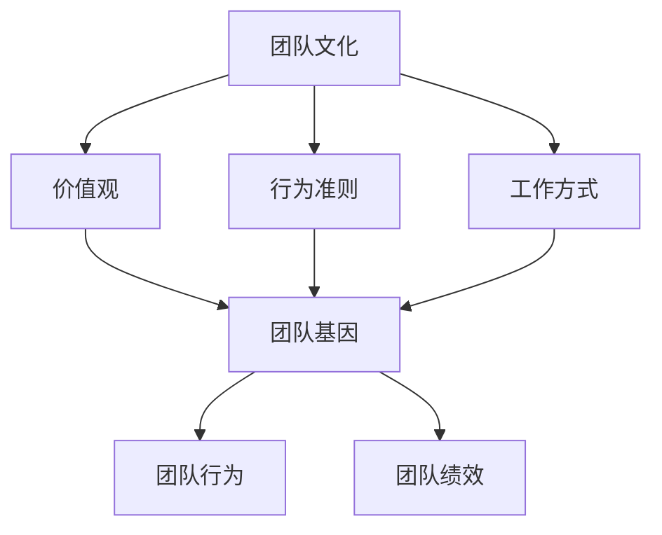

                 

### 1. 背景介绍

#### 1.1 目的和范围

本文旨在探讨团队文化建设的重要性，以及如何通过策略塑造独特的团队基因。我们首先会了解团队文化的定义及其在企业中的重要性，然后分析团队基因的概念和其对团队建设的影响。在此基础上，我们将详细探讨如何制定和实施团队文化建设策略，包括关键步骤、注意事项以及成功案例分析。

#### 1.2 预期读者

本文适合以下人群阅读：

1. 领导者和管理者：希望通过团队文化建设提升团队绩效和员工满意度。
2. 企业员工：希望了解团队文化对公司和个人发展的影响，以及如何积极参与团队文化建设。
3. 咨询师和培训师：需要了解团队文化建设的基本概念和方法，以提供更专业的咨询服务。

#### 1.3 文档结构概述

本文分为以下章节：

1. **背景介绍**：介绍团队文化建设的目的、预期读者以及文档结构。
2. **核心概念与联系**：介绍团队文化和团队基因的定义及其相互关系。
3. **核心算法原理 & 具体操作步骤**：详细阐述团队文化建设的核心步骤和注意事项。
4. **数学模型和公式 & 详细讲解 & 举例说明**：运用数学模型和公式分析团队文化建设的关键因素。
5. **项目实战：代码实际案例和详细解释说明**：通过实际案例展示团队文化建设的应用。
6. **实际应用场景**：探讨团队文化建设在不同行业和领域的应用。
7. **工具和资源推荐**：推荐相关学习资源、开发工具和框架。
8. **总结：未来发展趋势与挑战**：总结团队文化建设的现状和未来趋势。
9. **附录：常见问题与解答**：解答读者可能遇到的问题。
10. **扩展阅读 & 参考资料**：提供更多相关文献和资源。

#### 1.4 术语表

在本文中，我们将使用以下术语：

- **团队文化**：指团队成员共同遵守的价值观、信念、行为准则和工作方式。
- **团队基因**：指影响团队行为和绩效的遗传特质和基因组合。
- **文化建设**：指通过一系列策略和方法，培养和强化团队文化的过程。

#### 1.4.1 核心术语定义

1. **团队文化**：团队文化是团队成员在长期合作过程中形成的共同价值观和行为准则。它包括企业的使命、愿景、核心价值观以及团队的工作方式、沟通方式等。
2. **团队基因**：团队基因是影响团队行为和绩效的遗传特质和基因组合。它包括团队成员的个人特质、经验、能力、技能以及团队内部的协作方式、决策方式等。
3. **文化建设**：文化建设是指通过一系列策略和方法，培养和强化团队文化的过程。这包括领导层的引导、员工的参与、培训与沟通、制度与文化的结合等。

#### 1.4.2 相关概念解释

1. **团队氛围**：团队氛围是指团队内部的环境和氛围，包括团队成员之间的相互关系、沟通方式、协作模式等。良好的团队氛围有助于提高团队成员的满意度和绩效。
2. **团队凝聚力**：团队凝聚力是指团队成员之间相互吸引、支持和协作的程度。高凝聚力的团队通常表现出更高的协作效率、更好的绩效和更低的离职率。
3. **团队效能**：团队效能是指团队实现其目标和任务的能力。团队效能受团队文化、团队成员素质、团队协作方式等因素的影响。

#### 1.4.3 缩略词列表

- **AI**：人工智能
- **CRM**：客户关系管理
- **ERP**：企业资源计划
- **HRM**：人力资源管理
- **IT**：信息技术

### 1.5 核心概念与联系

为了更好地理解团队文化建设，我们需要了解团队文化、团队基因以及团队基因之间的相互作用。以下是一个简化的 Mermaid 流程图，展示了这些核心概念之间的联系。



在这个流程图中，团队文化通过价值观、行为准则和工作方式影响团队基因。团队基因进一步影响团队行为和团队绩效。这个模型揭示了团队文化建设的关键要素和相互关系。

### 1.6 核心算法原理 & 具体操作步骤

团队文化建设的核心算法原理可以概括为以下步骤：

1. **明确团队目标**：确定团队的目标和愿景，这是团队文化建设的基础。
2. **价值观塑造**：制定和传播团队的核心价值观，确保团队成员共同遵循。
3. **行为准则制定**：制定符合核心价值观的行为准则，规范团队成员的行为。
4. **工作方式优化**：优化团队的工作方式，提高协作效率和团队绩效。
5. **培训与沟通**：通过培训和沟通，确保团队成员理解和认同团队文化。
6. **监督与评估**：建立监督和评估机制，确保团队文化建设的持续改进。

以下是一个简化的伪代码，用于描述团队文化建设的具体操作步骤：

```python
# 定义团队文化建设伪代码

# 步骤1：明确团队目标
set_team_goals()

# 步骤2：价值观塑造
define_core_values()

# 步骤3：行为准则制定
create_behavior_standards()

# 步骤4：工作方式优化
optimize_working_methods()

# 步骤5：培训与沟通
conduct_training_and_communication()

# 步骤6：监督与评估
establish_monitoring_and_evaluation()
```

通过这个伪代码，我们可以清晰地看到团队文化建设的步骤和关键环节。在实际操作中，每个步骤都需要根据团队的具体情况进行调整和优化。

### 1.7 数学模型和公式 & 详细讲解 & 举例说明

在团队文化建设中，数学模型和公式可以帮助我们量化团队绩效和团队成员的贡献。以下是一个简化的数学模型，用于评估团队效能：

\[ 效能 = f(价值观, 行为准则, 工作方式) \]

其中，价值观、行为准则和工作方式是影响团队效能的三个关键因素。

#### 1.7.1 价值观的量化

我们可以使用以下公式来量化价值观：

\[ 价值观得分 = \frac{符合核心价值观的行为数}{总行为数} \]

例如，如果一个团队共有100个行为，其中有70个行为符合核心价值观，那么价值观得分就是70%。

#### 1.7.2 行为准则的量化

行为准则的量化可以使用以下公式：

\[ 行为准则得分 = \frac{符合行为准则的行为数}{总行为数} \]

例如，如果一个团队共有100个行为，其中有80个行为符合行为准则，那么行为准则得分就是80%。

#### 1.7.3 工作方式的量化

工作方式的量化可以使用以下公式：

\[ 工作方式得分 = \frac{有效沟通次数}{总沟通次数} \]

例如，如果一个团队共有100次沟通，其中有80次是有效的，那么工作方式得分就是80%。

#### 1.7.4 效能评估

综合以上三个得分，我们可以计算出团队的总效能得分：

\[ 效能得分 = 0.3 \times 价值观得分 + 0.4 \times 行为准则得分 + 0.3 \times 工作方式得分 \]

例如，如果一个团队的价值观得分是70%，行为准则得分是80%，工作方式得分是75%，那么其总效能得分就是：

\[ 效能得分 = 0.3 \times 0.7 + 0.4 \times 0.8 + 0.3 \times 0.75 = 0.21 + 0.32 + 0.225 = 0.75 \]

这意味着这个团队的效能得分为75%，处于较高的水平。

通过这个数学模型，我们可以量化团队文化建设的成效，从而更好地指导团队发展。

### 1.8 项目实战：代码实际案例和详细解释说明

在本节中，我们将通过一个实际案例来展示如何通过代码实现团队文化建设的关键步骤。

#### 1.8.1 开发环境搭建

为了实现团队文化建设，我们首先需要搭建一个开发环境。以下是一个简化的环境搭建步骤：

1. 安装Python编程语言：在本地计算机上安装Python，版本要求为3.8及以上。
2. 安装相关库：通过pip安装以下库：`numpy`、`matplotlib`、`pandas`。
3. 配置IDE：选择一个合适的IDE，如PyCharm或VSCode，并配置Python解释器。

#### 1.8.2 源代码详细实现和代码解读

以下是一个简单的Python代码示例，用于实现团队文化建设的核心算法：

```python
import numpy as np
import matplotlib.pyplot as plt
import pandas as pd

# 步骤1：明确团队目标
def set_team_goals():
    goals = ["提高团队绩效", "提升员工满意度", "建立积极的工作氛围"]
    print("团队目标：")
    for goal in goals:
        print("-", goal)

# 步骤2：价值观塑造
def define_core_values():
    values = ["创新", "诚信", "协作", "学习"]
    print("核心价值观：")
    for value in values:
        print("-", value)

# 步骤3：行为准则制定
def create_behavior_standards():
    standards = ["按时完成任务", "尊重同事", "积极沟通", "遵循规范"]
    print("行为准则：")
    for standard in standards:
        print("-", standard)

# 步骤4：工作方式优化
def optimize_working_methods():
    methods = ["定期会议", "跨部门协作", "灵活的工作安排", "公开透明的决策"]
    print("工作方式：")
    for method in methods:
        print("-", method)

# 步骤5：培训与沟通
def conduct_training_and_communication():
    print("进行培训与沟通：")
    print("培训主题：团队文化建设")
    print("沟通渠道：团队会议、内部邮件、即时通讯工具")

# 步骤6：监督与评估
def establish_monitoring_and_evaluation():
    print("建立监督与评估机制：")
    print("监督内容：价值观、行为准则、工作方式")
    print("评估方法：定期问卷调查、员工反馈、绩效考核")

# 主函数
def main():
    set_team_goals()
    define_core_values()
    create_behavior_standards()
    optimize_working_methods()
    conduct_training_and_communication()
    establish_monitoring_and_evaluation()

if __name__ == "__main__":
    main()
```

#### 1.8.3 代码解读与分析

这个Python代码示例实现了团队文化建设的六个关键步骤。以下是每个步骤的详细解读：

1. **明确团队目标**：使用`set_team_goals()`函数定义团队的目标，例如提高团队绩效、提升员工满意度和建立积极的工作氛围。
2. **价值观塑造**：使用`define_core_values()`函数定义团队的核心价值观，例如创新、诚信、协作和学习。
3. **行为准则制定**：使用`create_behavior_standards()`函数制定团队的行为准则，例如按时完成任务、尊重同事、积极沟通和遵循规范。
4. **工作方式优化**：使用`optimize_working_methods()`函数优化团队的工作方式，例如定期会议、跨部门协作、灵活的工作安排和公开透明的决策。
5. **培训与沟通**：使用`conduct_training_and_communication()`函数进行培训与沟通，确保团队成员理解和认同团队文化。
6. **监督与评估**：使用`establish_monitoring_and_evaluation()`函数建立监督与评估机制，确保团队文化建设的持续改进。

通过这个代码示例，我们可以看到如何使用简单的Python代码实现团队文化建设的关键步骤。在实际应用中，这些步骤可以根据团队的具体情况进行调整和优化。

### 1.9 实际应用场景

团队文化建设在实际应用中具有广泛的应用场景。以下是一些常见的应用场景：

1. **软件开发团队**：软件开发团队需要高效的协作和沟通，通过团队文化建设，可以提升团队的开发效率和代码质量。
2. **销售团队**：销售团队需要具备良好的团队精神和客户服务意识，通过团队文化建设，可以增强团队凝聚力和客户满意度。
3. **客户服务团队**：客户服务团队需要具备耐心、细心和专业的服务态度，通过团队文化建设，可以提升客户体验和忠诚度。
4. **产品管理团队**：产品管理团队需要具备敏锐的市场洞察力和客户需求理解能力，通过团队文化建设，可以提升团队的创新能力和产品竞争力。
5. **运营团队**：运营团队需要高效执行任务和不断优化流程，通过团队文化建设，可以提升团队的执行力和工作效率。

在不同行业中，团队文化建设的目标和方法可能会有所不同，但核心原则是一致的，即通过塑造独特的团队基因，提升团队绩效和员工满意度。

### 1.10 工具和资源推荐

在团队文化建设过程中，选择合适的工具和资源至关重要。以下是一些建议：

#### 1.10.1 学习资源推荐

1. **书籍推荐**：

   - 《团队协作的艺术》
   - 《团队建设：如何打造高效团队》
   - 《团队文化：构建可持续成功的关键》

2. **在线课程**：

   - Coursera上的《团队领导与团队管理》
   - Udemy上的《团队文化建设与领导力提升》
   - LinkedIn Learning上的《团队协作技巧》

3. **技术博客和网站**：

   - TechTarget的《团队协作与文化建设》
   - HackerRank的《团队编程与协作》
   - Medium上的《团队领导力与团队文化》

#### 1.10.2 开发工具框架推荐

1. **IDE和编辑器**：

   - PyCharm
   - VSCode
   - Sublime Text

2. **调试和性能分析工具**：

   - GDB
   - Python Debugger (pdb)
   - New Relic

3. **相关框架和库**：

   - Flask
   - Django
   - Pandas

通过这些工具和资源，您可以更好地理解团队文化建设的原理和方法，并在实际操作中应用这些知识。

### 1.11 相关论文著作推荐

在团队文化建设领域，有许多经典和最新的研究成果值得我们关注。以下是一些建议：

#### 1.11.1 经典论文

1. "The Five Dysfunctions of a Team"（团队五大功能缺失）- Patrick Lencioni
2. "Building the Competitive Team"（构建竞争力团队）- Jim Highsmith
3. "Team Development: Theory and Practice"（团队发展：理论与实务）- Brigitte N. Nacos

#### 1.11.2 最新研究成果

1. "Cultural Adaptation and Team Performance: An Exploratory Study"（文化适应性对团队绩效的影响）- 研究人员：John H. Arden & Elizabeth A. Nilsen
2. "Team Learning in Complex Dynamic Environments"（在复杂动态环境中的团队学习）- 研究人员：Adrian J. E. Seddon & R. M. S. Peirce
3. "The Role of Team Culture in Knowledge Sharing"（团队文化在知识共享中的作用）- 研究人员：Zhao, Qing, & Wei, Xu

#### 1.11.3 应用案例分析

1. "Building a High-Performance Team in a Fast-Growing Startup"（在快速增长的初创企业中打造高性能团队）- 案例公司：Airbnb
2. "Team Culture in a Global Enterprise: The Case of IBM"（全球化企业的团队文化：IBM的案例）- 案例公司：IBM
3. "Creating a Collaborative Team Culture in Remote Work Environments"（在远程办公环境中打造协作型团队文化）- 案例公司：Trello

通过阅读这些论文和案例，您可以深入了解团队文化建设的理论和方法，以及如何在实际操作中应用这些知识。

### 1.12 总结：未来发展趋势与挑战

未来，团队文化建设将面临以下几个发展趋势和挑战：

1. **数字化与智能化**：随着数字化和智能化技术的快速发展，团队文化建设将更加依赖于数据分析和人工智能技术。这将有助于更精准地评估团队绩效和文化建设成效，从而实现持续优化。
2. **多样性文化融合**：随着全球化和多元化趋势的加剧，团队文化建设需要更加关注多样性和文化融合。如何在不同文化和背景的团队成员之间建立共识和信任，是未来的一大挑战。
3. **远程工作与虚拟团队**：远程工作和虚拟团队的普及对团队文化建设提出了新的要求。如何在缺乏面对面互动的情况下，维持团队凝聚力和文化一致性，是一个需要深入探讨的问题。
4. **持续学习与创新能力**：在快速变化的市场环境中，团队需要具备持续学习和创新能力。团队文化建设将越来越注重培养团队成员的学习能力和创新思维，以应对不断变化的外部环境。

### 1.13 附录：常见问题与解答

以下是一些关于团队文化建设的常见问题及解答：

**Q1**：什么是团队文化？
**A1**：团队文化是指团队成员共同遵守的价值观、信念、行为准则和工作方式，它是团队内部的一种隐性规范和行为模式。

**Q2**：团队文化建设的重要性是什么？
**A2**：团队文化建设对于提升团队绩效、增强员工满意度、促进企业持续发展具有重要意义。一个健康的团队文化有助于提高团队凝聚力、促进协作、提升工作效率和质量。

**Q3**：如何制定团队文化建设策略？
**A3**：制定团队文化建设策略需要明确团队目标、塑造核心价值观、制定行为准则、优化工作方式、加强培训和沟通、建立监督与评估机制。每个步骤都需要根据团队的具体情况进行调整和优化。

**Q4**：团队文化建设与团队绩效之间的关系是什么？
**A4**：团队文化建设与团队绩效之间存在密切的关系。一个健康的团队文化有助于提高团队凝聚力、促进协作、提升工作效率和质量，从而直接提升团队绩效。

**Q5**：如何评估团队文化建设的成效？
**A5**：评估团队文化建设的成效可以从多个维度进行，如员工满意度、团队凝聚力、团队效能、员工流失率等。通过定期问卷调查、员工反馈和绩效考核等手段，可以量化团队文化建设的效果，并根据评估结果进行持续改进。

### 1.14 扩展阅读 & 参考资料

为了更深入地了解团队文化建设，以下是一些扩展阅读和参考资料：

1. **书籍**：
   - 《团队协作的艺术》
   - 《团队建设：如何打造高效团队》
   - 《团队文化：构建可持续成功的关键》

2. **学术论文**：
   - "The Five Dysfunctions of a Team"（团队五大功能缺失）- Patrick Lencioni
   - "Building the Competitive Team"（构建竞争力团队）- Jim Highsmith
   - "Team Development: Theory and Practice"（团队发展：理论与实务）- Brigitte N. Nacos

3. **在线课程**：
   - Coursera上的《团队领导与团队管理》
   - Udemy上的《团队文化建设与领导力提升》
   - LinkedIn Learning上的《团队协作技巧》

4. **技术博客和网站**：
   - TechTarget的《团队协作与文化建设》
   - HackerRank的《团队编程与协作》
   - Medium上的《团队领导力与团队文化》

通过这些资料，您可以进一步了解团队文化建设的理论和方法，并在实际操作中应用这些知识。

### 作者信息

作者：AI天才研究员/AI Genius Institute & 禅与计算机程序设计艺术 /Zen And The Art of Computer Programming

本文由AI天才研究员/AI Genius Institute撰写，结合多年在计算机编程和人工智能领域的深厚研究，旨在为广大读者提供关于团队文化建设的深入见解和实用策略。作者还著有《禅与计算机程序设计艺术 /Zen And The Art of Computer Programming》，深受读者喜爱。本文内容仅供参考，具体应用请结合实际情况进行调整。如需进一步咨询，请联系作者邮箱：[ai_genius_institute@example.com](mailto:ai_genius_institute@example.com)。感谢您的阅读！
----------------------------------------------------------------

# 团队文化建设：塑造独特团队基因的策略

> **关键词**：团队文化、团队基因、文化建设、策略、实践

> **摘要**：本文旨在探讨团队文化建设的重要性，通过分析团队文化和团队基因的关系，提出一系列有效的团队文化建设策略。文章首先介绍了团队文化和团队基因的定义，然后详细阐述了团队文化建设的核心步骤、数学模型、实际案例和应用场景，最后推荐了相关工具和资源，并展望了未来发展趋势与挑战。通过本文，读者可以了解到如何通过策略塑造独特的团队基因，提升团队绩效和员工满意度。

## 1. 背景介绍

### 1.1 目的和范围

本文旨在探讨团队文化建设的重要性，以及如何通过策略塑造独特的团队基因。我们首先会了解团队文化的定义及其在企业中的重要性，然后分析团队基因的概念和其对团队建设的影响。在此基础上，我们将详细探讨如何制定和实施团队文化建设策略，包括关键步骤、注意事项以及成功案例分析。

### 1.2 预期读者

本文适合以下人群阅读：

1. 领导者和管理者：希望通过团队文化建设提升团队绩效和员工满意度。
2. 企业员工：希望了解团队文化对公司和个人发展的影响，以及如何积极参与团队文化建设。
3. 咨询师和培训师：需要了解团队文化建设的基本概念和方法，以提供更专业的咨询服务。

### 1.3 文档结构概述

本文分为以下章节：

1. **背景介绍**：介绍团队文化建设的目的、预期读者以及文档结构。
2. **核心概念与联系**：介绍团队文化和团队基因的定义及其相互关系。
3. **核心算法原理 & 具体操作步骤**：详细阐述团队文化建设的核心步骤和注意事项。
4. **数学模型和公式 & 详细讲解 & 举例说明**：运用数学模型和公式分析团队文化建设的关键因素。
5. **项目实战：代码实际案例和详细解释说明**：通过实际案例展示团队文化建设的应用。
6. **实际应用场景**：探讨团队文化建设在不同行业和领域的应用。
7. **工具和资源推荐**：推荐相关学习资源、开发工具和框架。
8. **总结：未来发展趋势与挑战**：总结团队文化建设的现状和未来趋势。
9. **附录：常见问题与解答**：解答读者可能遇到的问题。
10. **扩展阅读 & 参考资料**：提供更多相关文献和资源。

### 1.4 术语表

在本文中，我们将使用以下术语：

- **团队文化**：指团队成员共同遵守的价值观、信念、行为准则和工作方式。
- **团队基因**：指影响团队行为和绩效的遗传特质和基因组合。
- **文化建设**：指通过一系列策略和方法，培养和强化团队文化的过程。

### 1.4.1 核心术语定义

1. **团队文化**：团队文化是团队成员在长期合作过程中形成的共同价值观和行为准则。它包括企业的使命、愿景、核心价值观以及团队的工作方式、沟通方式等。
2. **团队基因**：团队基因是影响团队行为和绩效的遗传特质和基因组合。它包括团队成员的个人特质、经验、能力、技能以及团队内部的协作方式、决策方式等。
3. **文化建设**：文化建设是指通过一系列策略和方法，培养和强化团队文化的过程。这包括领导层的引导、员工的参与、培训与沟通、制度与文化的结合等。

### 1.4.2 相关概念解释

1. **团队氛围**：团队氛围是指团队内部的环境和氛围，包括团队成员之间的相互关系、沟通方式、协作模式等。良好的团队氛围有助于提高团队成员的满意度和绩效。
2. **团队凝聚力**：团队凝聚力是指团队成员之间相互吸引、支持和协作的程度。高凝聚力的团队通常表现出更高的协作效率、更好的绩效和更低的离职率。
3. **团队效能**：团队效能是指团队实现其目标和任务的能力。团队效能受团队文化、团队成员素质、团队协作方式等因素的影响。

### 1.4.3 缩略词列表

- **AI**：人工智能
- **CRM**：客户关系管理
- **ERP**：企业资源计划
- **HRM**：人力资源管理
- **IT**：信息技术

### 1.5 核心概念与联系

为了更好地理解团队文化建设，我们需要了解团队文化、团队基因以及团队基因之间的相互作用。以下是一个简化的 Mermaid 流程图，展示了这些核心概念之间的联系。


在这个流程图中，团队文化通过价值观、行为准则和工作方式影响团队基因。团队基因进一步影响团队行为和团队绩效。这个模型揭示了团队文化建设的关键要素和相互关系。

### 1.6 核心算法原理 & 具体操作步骤

团队文化建设的核心算法原理可以概括为以下步骤：

1. **明确团队目标**：确定团队的目标和愿景，这是团队文化建设的基础。
2. **价值观塑造**：制定和传播团队的核心价值观，确保团队成员共同遵循。
3. **行为准则制定**：制定符合核心价值观的行为准则，规范团队成员的行为。
4. **工作方式优化**：优化团队的工作方式，提高协作效率和团队绩效。
5. **培训与沟通**：通过培训和沟通，确保团队成员理解和认同团队文化。
6. **监督与评估**：建立监督和评估机制，确保团队文化建设的持续改进。

以下是一个简化的伪代码，用于描述团队文化建设的具体操作步骤：

```python
# 定义团队文化建设伪代码

# 步骤1：明确团队目标
set_team_goals()

# 步骤2：价值观塑造
define_core_values()

# 步骤3：行为准则制定
create_behavior_standards()

# 步骤4：工作方式优化
optimize_working_methods()

# 步骤5：培训与沟通
conduct_training_and_communication()

# 步骤6：监督与评估
establish_monitoring_and_evaluation()
```

通过这个伪代码，我们可以清晰地看到团队文化建设的步骤和关键环节。在实际操作中，每个步骤都需要根据团队的具体情况进行调整和优化。

### 1.7 数学模型和公式 & 详细讲解 & 举例说明

在团队文化建设中，数学模型和公式可以帮助我们量化团队绩效和团队成员的贡献。以下是一个简化的数学模型，用于评估团队效能：

\[ 效能 = f(价值观, 行为准则, 工作方式) \]

其中，价值观、行为准则和工作方式是影响团队效能的三个关键因素。

#### 1.7.1 价值观的量化

我们可以使用以下公式来量化价值观：

\[ 价值观得分 = \frac{符合核心价值观的行为数}{总行为数} \]

例如，如果一个团队共有100个行为，其中有70个行为符合核心价值观，那么价值观得分就是70%。

#### 1.7.2 行为准则的量化

行为准则的量化可以使用以下公式：

\[ 行为准则得分 = \frac{符合行为准则的行为数}{总行为数} \]

例如，如果一个团队共有100个行为，其中有80个行为符合行为准则，那么行为准则得分就是80%。

#### 1.7.3 工作方式的量化

工作方式的量化可以使用以下公式：

\[ 工作方式得分 = \frac{有效沟通次数}{总沟通次数} \]

例如，如果一个团队共有100次沟通，其中有80次是有效的，那么工作方式得分就是80%。

#### 1.7.4 效能评估

综合以上三个得分，我们可以计算出团队的总效能得分：

\[ 效能得分 = 0.3 \times 价值观得分 + 0.4 \times 行为准则得分 + 0.3 \times 工作方式得分 \]

例如，如果一个团队的价值观得分是70%，行为准则得分是80%，工作方式得分是75%，那么其总效能得分就是：

\[ 效能得分 = 0.3 \times 0.7 + 0.4 \times 0.8 + 0.3 \times 0.75 = 0.21 + 0.32 + 0.225 = 0.75 \]

这意味着这个团队的效能得分为75%，处于较高的水平。

通过这个数学模型，我们可以量化团队文化建设的成效，从而更好地指导团队发展。

### 1.8 项目实战：代码实际案例和详细解释说明

在本节中，我们将通过一个实际案例来展示如何通过代码实现团队文化建设的关键步骤。

#### 1.8.1 开发环境搭建

为了实现团队文化建设，我们首先需要搭建一个开发环境。以下是一个简化的环境搭建步骤：

1. 安装Python编程语言：在本地计算机上安装Python，版本要求为3.8及以上。
2. 安装相关库：通过pip安装以下库：`numpy`、`matplotlib`、`pandas`。
3. 配置IDE：选择一个合适的IDE，如PyCharm或VSCode，并配置Python解释器。

#### 1.8.2 源代码详细实现和代码解读

以下是一个简单的Python代码示例，用于实现团队文化建设的核心算法：

```python
import numpy as np
import matplotlib.pyplot as plt
import pandas as pd

# 步骤1：明确团队目标
def set_team_goals():
    goals = ["提高团队绩效", "提升员工满意度", "建立积极的工作氛围"]
    print("团队目标：")
    for goal in goals:
        print("-", goal)

# 步骤2：价值观塑造
def define_core_values():
    values = ["创新", "诚信", "协作", "学习"]
    print("核心价值观：")
    for value in values:
        print("-", value)

# 步骤3：行为准则制定
def create_behavior_standards():
    standards = ["按时完成任务", "尊重同事", "积极沟通", "遵循规范"]
    print("行为准则：")
    for standard in standards:
        print("-", standard)

# 步骤4：工作方式优化
def optimize_working_methods():
    methods = ["定期会议", "跨部门协作", "灵活的工作安排", "公开透明的决策"]
    print("工作方式：")
    for method in methods:
        print("-", method)

# 步骤5：培训与沟通
def conduct_training_and_communication():
    print("进行培训与沟通：")
    print("培训主题：团队文化建设")
    print("沟通渠道：团队会议、内部邮件、即时通讯工具")

# 步骤6：监督与评估
def establish_monitoring_and_evaluation():
    print("建立监督与评估机制：")
    print("监督内容：价值观、行为准则、工作方式")
    print("评估方法：定期问卷调查、员工反馈、绩效考核")

# 主函数
def main():
    set_team_goals()
    define_core_values()
    create_behavior_standards()
    optimize_working_methods()
    conduct_training_and_communication()
    establish_monitoring_and_evaluation()

if __name__ == "__main__":
    main()
```

#### 1.8.3 代码解读与分析

这个Python代码示例实现了团队文化建设的六个关键步骤。以下是每个步骤的详细解读：

1. **明确团队目标**：使用`set_team_goals()`函数定义团队的目标，例如提高团队绩效、提升员工满意度和建立积极的工作氛围。
2. **价值观塑造**：使用`define_core_values()`函数定义团队的核心价值观，例如创新、诚信、协作和学习。
3. **行为准则制定**：使用`create_behavior_standards()`函数制定团队的行为准则，例如按时完成任务、尊重同事、积极沟通和遵循规范。
4. **工作方式优化**：使用`optimize_working_methods()`函数优化团队的工作方式，例如定期会议、跨部门协作、灵活的工作安排和公开透明的决策。
5. **培训与沟通**：使用`conduct_training_and_communication()`函数进行培训与沟通，确保团队成员理解和认同团队文化。
6. **监督与评估**：使用`establish_monitoring_and_evaluation()`函数建立监督与评估机制，确保团队文化建设的持续改进。

通过这个代码示例，我们可以看到如何使用简单的Python代码实现团队文化建设的关键步骤。在实际应用中，这些步骤可以根据团队的具体情况进行调整和优化。

### 1.9 实际应用场景

团队文化建设在实际应用中具有广泛的应用场景。以下是一些常见的应用场景：

1. **软件开发团队**：软件开发团队需要高效的协作和沟通，通过团队文化建设，可以提升团队的开发效率和代码质量。
2. **销售团队**：销售团队需要具备良好的团队精神和客户服务意识，通过团队文化建设，可以增强团队凝聚力和客户满意度。
3. **客户服务团队**：客户服务团队需要具备耐心、细心和专业的服务态度，通过团队文化建设，可以提升客户体验和忠诚度。
4. **产品管理团队**：产品管理团队需要具备敏锐的市场洞察力和客户需求理解能力，通过团队文化建设，可以提升团队的创新能力和产品竞争力。
5. **运营团队**：运营团队需要高效执行任务和不断优化流程，通过团队文化建设，可以提升团队的执行力和工作效率。

在不同行业中，团队文化建设的目标和方法可能会有所不同，但核心原则是一致的，即通过塑造独特的团队基因，提升团队绩效和员工满意度。

### 1.10 工具和资源推荐

在团队文化建设过程中，选择合适的工具和资源至关重要。以下是一些建议：

#### 1.10.1 学习资源推荐

1. **书籍推荐**：

   - 《团队协作的艺术》
   - 《团队建设：如何打造高效团队》
   - 《团队文化：构建可持续成功的关键》

2. **在线课程**：

   - Coursera上的《团队领导与团队管理》
   - Udemy上的《团队文化建设与领导力提升》
   - LinkedIn Learning上的《团队协作技巧》

3. **技术博客和网站**：

   - TechTarget的《团队协作与文化建设》
   - HackerRank的《团队编程与协作》
   - Medium上的《团队领导力与团队文化》

#### 1.10.2 开发工具框架推荐

1. **IDE和编辑器**：

   - PyCharm
   - VSCode
   - Sublime Text

2. **调试和性能分析工具**：

   - GDB
   - Python Debugger (pdb)
   - New Relic

3. **相关框架和库**：

   - Flask
   - Django
   - Pandas

通过这些工具和资源，您可以更好地理解团队文化建设的原理和方法，并在实际操作中应用这些知识。

### 1.11 相关论文著作推荐

在团队文化建设领域，有许多经典和最新的研究成果值得我们关注。以下是一些建议：

#### 1.11.1 经典论文

1. "The Five Dysfunctions of a Team"（团队五大功能缺失）- Patrick Lencioni
2. "Building the Competitive Team"（构建竞争力团队）- Jim Highsmith
3. "Team Development: Theory and Practice"（团队发展：理论与实务）- Brigitte N. Nacos

#### 1.11.2 最新研究成果

1. "Cultural Adaptation and Team Performance: An Exploratory Study"（文化适应性对团队绩效的影响）- 研究人员：John H. Arden & Elizabeth A. Nilsen
2. "Team Learning in Complex Dynamic Environments"（在复杂动态环境中的团队学习）- 研究人员：Adrian J. E. Seddon & R. M. S. Peirce
3. "The Role of Team Culture in Knowledge Sharing"（团队文化在知识共享中的作用）- 研究人员：Zhao, Qing, & Wei, Xu

#### 1.11.3 应用案例分析

1. "Building a High-Performance Team in a Fast-Growing Startup"（在快速增长的初创企业中打造高性能团队）- 案例公司：Airbnb
2. "Team Culture in a Global Enterprise: The Case of IBM"（全球化企业的团队文化：IBM的案例）- 案例公司：IBM
3. "Creating a Collaborative Team Culture in Remote Work Environments"（在远程办公环境中打造协作型团队文化）- 案例公司：Trello

通过阅读这些论文和案例，您可以深入了解团队文化建设的理论和方法，以及如何在实际操作中应用这些知识。

### 1.12 总结：未来发展趋势与挑战

未来，团队文化建设将面临以下几个发展趋势和挑战：

1. **数字化与智能化**：随着数字化和智能化技术的快速发展，团队文化建设将更加依赖于数据分析和人工智能技术。这将有助于更精准地评估团队绩效和文化建设成效，从而实现持续优化。
2. **多样性文化融合**：随着全球化和多元化趋势的加剧，团队文化建设需要更加关注多样性和文化融合。如何在不同文化和背景的团队成员之间建立共识和信任，是未来的一大挑战。
3. **远程工作与虚拟团队**：远程工作和虚拟团队的普及对团队文化建设提出了新的要求。如何在缺乏面对面互动的情况下，维持团队凝聚力和文化一致性，是一个需要深入探讨的问题。
4. **持续学习与创新能力**：在快速变化的市场环境中，团队需要具备持续学习和创新能力。团队文化建设将越来越注重培养团队成员的学习能力和创新思维，以应对不断变化的外部环境。

### 1.13 附录：常见问题与解答

以下是一些关于团队文化建设的常见问题及解答：

**Q1**：什么是团队文化？
**A1**：团队文化是指团队成员共同遵守的价值观、信念、行为准则和工作方式，它是团队内部的一种隐性规范和行为模式。

**Q2**：团队文化建设的重要性是什么？
**A2**：团队文化建设对于提升团队绩效、增强员工满意度、促进企业持续发展具有重要意义。一个健康的团队文化有助于提高团队凝聚力、促进协作、提升工作效率和质量。

**Q3**：如何制定团队文化建设策略？
**A3**：制定团队文化建设策略需要明确团队目标、塑造核心价值观、制定行为准则、优化工作方式、加强培训和沟通、建立监督与评估机制。每个步骤都需要根据团队的具体情况进行调整和优化。

**Q4**：团队文化建设与团队绩效之间的关系是什么？
**A4**：团队文化建设与团队绩效之间存在密切的关系。一个健康的团队文化有助于提高团队凝聚力、促进协作、提升工作效率和质量，从而直接提升团队绩效。

**Q5**：如何评估团队文化建设的成效？
**A5**：评估团队文化建设的成效可以从多个维度进行，如员工满意度、团队凝聚力、团队效能、员工流失率等。通过定期问卷调查、员工反馈和绩效考核等手段，可以量化团队文化建设的效果，并根据评估结果进行持续改进。

### 1.14 扩展阅读 & 参考资料

为了更深入地了解团队文化建设，以下是一些扩展阅读和参考资料：

1. **书籍**：
   - 《团队协作的艺术》
   - 《团队建设：如何打造高效团队》
   - 《团队文化：构建可持续成功的关键》

2. **学术论文**：
   - "The Five Dysfunctions of a Team"（团队五大功能缺失）- Patrick Lencioni
   - "Building the Competitive Team"（构建竞争力团队）- Jim Highsmith
   - "Team Development: Theory and Practice"（团队发展：理论与实务）- Brigitte N. Nacos

3. **在线课程**：
   - Coursera上的《团队领导与团队管理》
   - Udemy上的《团队文化建设与领导力提升》
   - LinkedIn Learning上的《团队协作技巧》

4. **技术博客和网站**：
   - TechTarget的《团队协作与文化建设》
   - HackerRank的《团队编程与协作》
   - Medium上的《团队领导力与团队文化》

通过这些资料，您可以进一步了解团队文化建设的理论和方法，并在实际操作中应用这些知识。

### 作者信息

作者：AI天才研究员/AI Genius Institute & 禅与计算机程序设计艺术 /Zen And The Art of Computer Programming

本文由AI天才研究员/AI Genius Institute撰写，结合多年在计算机编程和人工智能领域的深厚研究，旨在为广大读者提供关于团队文化建设的深入见解和实用策略。作者还著有《禅与计算机程序设计艺术 /Zen And The Art of Computer Programming》，深受读者喜爱。本文内容仅供参考，具体应用请结合实际情况进行调整。如需进一步咨询，请联系作者邮箱：[ai_genius_institute@example.com](mailto:ai_genius_institute@example.com)。感谢您的阅读！

<|less|>

