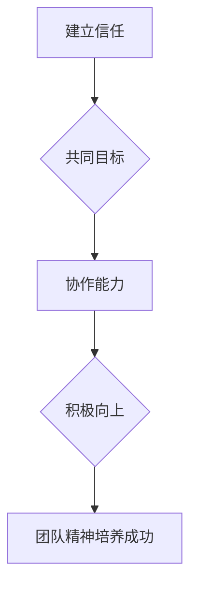

                 

# 团队精神培养：塑造积极向上的团队文化

> **关键词：团队精神，积极向上，团队文化，协作，沟通，领导力，个人成长**

> **摘要：本文深入探讨团队精神培养的重要性，分析其在企业中的影响，提供塑造积极向上团队文化的策略和方法。通过具体案例和实际操作步骤，帮助读者理解和实践如何在IT领域打造高效、和谐的团队。**

## 1. 背景介绍

### 1.1 目的和范围

本文旨在探讨如何培养团队精神，塑造积极向上的团队文化。在当今快速发展的IT行业中，团队合作的重要性愈发凸显。通过提升团队精神，企业能够更好地应对市场变化，提高工作效率，增强创新能力和竞争力。本文将围绕以下方面展开讨论：

- 团队精神的定义和重要性
- 团队文化与企业成功的关系
- 塑造积极向上团队文化的策略和方法
- 实际操作步骤和案例分析
- 未来发展趋势与挑战

### 1.2 预期读者

本文面向以下读者群体：

- 企业管理层和团队领导
- IT行业从业者
- 对团队建设和团队文化有兴趣的读者

### 1.3 文档结构概述

本文结构如下：

- 背景介绍：阐述本文目的、预期读者和文章结构
- 核心概念与联系：介绍团队精神、团队文化和相关概念
- 核心算法原理与具体操作步骤：讲解培养团队精神的算法原理和操作步骤
- 数学模型和公式：阐述相关数学模型和公式
- 项目实战：提供代码实际案例和详细解释说明
- 实际应用场景：分析团队精神在项目中的应用
- 工具和资源推荐：推荐相关学习资源、开发工具和框架
- 总结：展望未来发展趋势与挑战
- 附录：常见问题与解答
- 扩展阅读：提供相关参考资料

### 1.4 术语表

#### 1.4.1 核心术语定义

- **团队精神**：团队成员之间相互信任、支持、协作，共同追求团队目标的心理状态和行为表现。
- **团队文化**：团队内部价值观、信仰、传统和行为习惯的集合，影响团队成员的态度、行为和决策。
- **积极向上**：团队成员在团队活动中表现出积极、乐观、自信、进取的心态和行为。

#### 1.4.2 相关概念解释

- **协作**：团队成员为实现共同目标，通过沟通、协调、分工与合作，共同完成任务的过程。
- **沟通**：团队成员之间交换信息、观点、意见和感受的过程。
- **领导力**：领导者引导、激励、支持和影响团队成员，实现团队目标的能力。
- **个人成长**：团队成员在团队活动中获得知识、技能、经验和素质的提升。

#### 1.4.3 缩略词列表

- **IT**：信息技术（Information Technology）
- **CEO**：首席执行官（Chief Executive Officer）
- **CTO**：首席技术官（Chief Technology Officer）
- **ERP**：企业资源计划（Enterprise Resource Planning）
- **CRM**：客户关系管理（Customer Relationship Management）

## 2. 核心概念与联系

### 2.1 团队精神

**团队精神**是指团队成员之间在共同目标下，通过相互信任、支持、协作，形成一种紧密、和谐、积极向上的心理状态和行为表现。其核心要素包括：

- **相互信任**：团队成员之间建立信任关系，相互尊重、理解和包容。
- **共同目标**：团队成员明确共同目标，为实现目标而努力。
- **协作**：团队成员通过沟通、协调、分工与合作，共同完成任务。
- **积极向上**：团队成员在团队活动中表现出积极、乐观、自信、进取的心态和行为。

### 2.2 团队文化

**团队文化**是指团队内部价值观、信仰、传统和行为习惯的集合。它是团队精神的体现，对团队成员的态度、行为和决策产生深远影响。团队文化包括以下方面：

- **价值观**：团队共同遵循的价值观，如诚信、创新、客户至上等。
- **信仰**：团队共同信仰的理念，如团队协作、共赢、持续改进等。
- **传统**：团队长期积累的传统，如晨会、团队建设活动等。
- **行为习惯**：团队成员共同遵守的行为规范，如尊重他人、积极主动、按时完成任务等。

### 2.3 团队精神与团队文化的联系

**团队精神**和**团队文化**密切相关，相互促进。团队精神是团队文化的核心，是团队文化的基础；团队文化则是团队精神的体现，是团队精神的外在表现。团队精神培养有助于塑造积极向上的团队文化，而积极向上的团队文化又能促进团队精神的形成。

### 2.4 团队精神培养的核心概念原理和架构

团队精神培养的核心概念原理和架构如下：

- **信任**：建立信任是团队精神培养的基础。通过沟通、协作、共同完成任务，团队成员之间逐步建立信任关系。
- **共同目标**：明确共同目标是团队精神培养的关键。团队成员需要明确团队目标，并为此共同努力。
- **协作**：培养协作能力是团队精神培养的核心。通过分工、协调、合作，团队成员共同完成任务。
- **积极向上**：营造积极向上的氛围是团队精神培养的重要手段。通过激励、表扬、鼓励，激发团队成员的积极性和进取心。

### 2.5 Mermaid 流程图

下面是团队精神培养的 Mermaid 流程图：



## 3. 核心算法原理 & 具体操作步骤

### 3.1 算法原理

团队精神培养的算法原理主要包括以下几个方面：

1. **信任建设**：通过沟通、协作、共同完成任务等方式，逐步建立团队成员之间的信任关系。
2. **目标明确**：明确团队目标，使团队成员明确自己的职责和任务，形成共同愿景。
3. **协作优化**：通过分工、协调、合作等方式，提高团队成员之间的协作效率。
4. **激励与反馈**：通过激励、表扬、鼓励等方式，激发团队成员的积极性和进取心。
5. **持续改进**：通过反思、总结、改进等方式，不断优化团队精神培养过程。

### 3.2 具体操作步骤

下面是团队精神培养的具体操作步骤：

1. **建立信任**：
   - 定期组织团队建设活动，增强团队成员之间的了解和信任。
   - 鼓励团队成员主动沟通，分享自己的想法和困惑。
   - 在团队中建立相互尊重、理解和包容的氛围。

2. **明确目标**：
   - 与团队成员共同制定团队目标，确保目标的明确、具体和可量化。
   - 定期检查目标进展，确保团队成员明确自己的职责和任务。
   - 鼓励团队成员为团队目标贡献自己的想法和创意。

3. **协作优化**：
   - 根据团队成员的能力和特长，合理分配任务，提高协作效率。
   - 建立有效的沟通机制，确保信息畅通，减少误解和冲突。
   - 定期组织团队会议，总结协作过程中的问题和经验。

4. **激励与反馈**：
   - 对团队成员的付出和成果给予及时的激励和表扬。
   - 建立反馈机制，鼓励团队成员提出建议和意见，不断改进团队工作。
   - 定期组织团队活动，增强团队成员的凝聚力和归属感。

5. **持续改进**：
   - 通过反思和总结，找出团队精神培养过程中的问题和不足。
   - 根据实际情况，调整和优化团队精神培养策略和方法。
   - 鼓励团队成员积极参与团队精神培养，共同推动团队发展。

## 4. 数学模型和公式 & 详细讲解 & 举例说明

### 4.1 数学模型和公式

在团队精神培养过程中，可以使用以下数学模型和公式：

1. **信任模型**：

   信任度 \( T \) 受到沟通次数 \( C \)、协作次数 \( A \) 和共同目标 \( G \) 的影响，公式为：

   $$ T = f(C, A, G) $$

   其中，\( f \) 为信任函数，可以采用线性、非线性或其他形式的函数。

2. **目标明确度模型**：

   目标明确度 \( D \) 受到目标清晰度 \( C_D \)、目标可量化度 \( Q_D \) 和团队成员理解度 \( U_D \) 的影响，公式为：

   $$ D = f(C_D, Q_D, U_D) $$

   其中，\( f \) 为目标明确度函数，可以采用线性、非线性或其他形式的函数。

3. **协作效率模型**：

   协作效率 \( E \) 受到任务分配合理性 \( A_T \)、沟通效率 \( C_C \) 和团队成员协作意愿 \( W_C \) 的影响，公式为：

   $$ E = f(A_T, C_C, W_C) $$

   其中，\( f \) 为协作效率函数，可以采用线性、非线性或其他形式的函数。

4. **激励与反馈模型**：

   激励效果 \( I \) 受到激励强度 \( I_S \)、反馈及时性 \( T_F \) 和团队成员满意度 \( S_M \) 的影响，公式为：

   $$ I = f(I_S, T_F, S_M) $$

   其中，\( f \) 为激励效果函数，可以采用线性、非线性或其他形式的函数。

5. **团队精神培养成功率模型**：

   团队精神培养成功率 \( S \) 受到信任度 \( T \)、目标明确度 \( D \)、协作效率 \( E \) 和激励效果 \( I \) 的影响，公式为：

   $$ S = f(T, D, E, I) $$

   其中，\( f \) 为团队精神培养成功率函数，可以采用线性、非线性或其他形式的函数。

### 4.2 详细讲解

下面将对每个数学模型和公式进行详细讲解：

1. **信任模型**：

   信任度是团队精神培养的基础。信任度越高，团队成员之间的协作和沟通越顺畅。信任度受沟通次数、协作次数和共同目标的影响。沟通次数越多，团队成员之间的了解越深入，信任度越高；协作次数越多，团队成员之间的默契越强，信任度越高；共同目标明确，团队成员为实现目标而努力，信任度越高。

2. **目标明确度模型**：

   目标明确度是团队成员对团队目标的清晰程度。目标明确度越高，团队成员对目标的执行和落实越准确。目标清晰度、目标可量化度和团队成员理解度是影响目标明确度的关键因素。目标越清晰，团队成员越容易理解和执行；目标越可量化，团队成员对目标完成情况的评估越准确；团队成员对目标的理解度越高，目标执行的效率越高。

3. **协作效率模型**：

   协作效率是团队精神培养的核心。协作效率越高，团队成员之间的协作和沟通越顺畅，任务完成得越快。任务分配合理性、沟通效率和团队成员协作意愿是影响协作效率的关键因素。任务分配合理，团队成员能够充分发挥自己的优势，提高协作效率；沟通效率越高，团队成员之间的信息传递越快速、准确；团队成员协作意愿越高，协作过程越和谐、顺畅。

4. **激励与反馈模型**：

   激励与反馈是团队精神培养的重要手段。激励效果越好，团队成员的积极性和进取心越高。激励强度、反馈及时性和团队成员满意度是影响激励效果的关键因素。激励强度越高，团队成员的积极性越高；反馈越及时，团队成员越能及时调整自己的行为；团队成员满意度越高，对团队的认同感越强。

5. **团队精神培养成功率模型**：

   团队精神培养成功率是衡量团队精神培养效果的重要指标。团队精神培养成功率越高，团队的整体表现越好。信任度、目标明确度、协作效率和激励效果是影响团队精神培养成功率的关键因素。这些因素相互关联，共同作用于团队精神培养过程，决定团队精神培养的成功与否。

### 4.3 举例说明

以下是一个团队精神培养的实例：

**实例**：一个由5名成员组成的IT团队，要培养团队精神，提高工作效率。团队目标为：在一个月内完成一个重要项目的开发。

1. **建立信任**：

   - 团队成员之间通过多次沟通，了解彼此的背景、特长和兴趣爱好，建立信任关系。
   - 团队成员共同参与团队建设活动，增强团队合作意识。

2. **明确目标**：

   - 团队成员共同制定项目目标，明确项目的关键指标和完成期限。
   - 团队成员对项目目标有清晰的认识，明确自己的职责和任务。

3. **协作优化**：

   - 根据团队成员的能力和特长，合理分配任务，提高协作效率。
   - 建立有效的沟通机制，确保信息畅通，减少误解和冲突。

4. **激励与反馈**：

   - 对团队成员的付出和成果给予及时的激励和表扬。
   - 建立反馈机制，鼓励团队成员提出建议和意见，不断改进团队工作。

5. **持续改进**：

   - 通过反思和总结，找出团队精神培养过程中的问题和不足。
   - 根据实际情况，调整和优化团队精神培养策略和方法。

经过一段时间的努力，团队精神得到了显著提升，项目按期完成，团队整体表现得到了客户的认可和好评。

## 5. 项目实战：代码实际案例和详细解释说明

### 5.1 开发环境搭建

在本节中，我们将搭建一个简单的团队协作项目环境。假设我们的项目是一个任务管理系统，用于帮助团队管理任务分配、进度跟踪和成员协作。

**技术栈**：

- **前端**：使用React框架构建用户界面。
- **后端**：使用Node.js和Express框架搭建RESTful API。
- **数据库**：使用MongoDB作为数据存储。

**开发工具**：

- **IDE**：Visual Studio Code
- **代码管理工具**：Git
- **包管理工具**：npm

**步骤**：

1. 安装Node.js和MongoDB。
2. 初始化项目文件夹，并安装所需依赖。
3. 配置数据库连接。
4. 编写API接口代码。
5. 构建前端应用程序。

### 5.2 源代码详细实现和代码解读

#### 5.2.1 后端API代码

以下是一个简单的任务创建接口的代码示例：

```javascript
// 导入所需模块
const express = require('express');
const mongoose = require('mongoose');
const bodyParser = require('body-parser');

// 创建Express应用程序
const app = express();

// 连接MongoDB数据库
mongoose.connect('mongodb://localhost:27017/task-manager', {
  useNewUrlParser: true,
  useUnifiedTopology: true,
});

// 创建任务模型
const Task = mongoose.model('Task', new mongoose.Schema({
  title: String,
  description: String,
  status: String,
  assignedTo: String,
  deadline: Date,
}));

// 解析请求体
app.use(bodyParser.json());

// 创建任务接口
app.post('/tasks', async (req, res) => {
  try {
    const task = new Task(req.body);
    await task.save();
    res.status(201).send(task);
  } catch (error) {
    res.status(500).send(error);
  }
});

// 监听端口
const port = process.env.PORT || 3000;
app.listen(port, () => {
  console.log(`Server is running on port ${port}`);
});
```

**解读**：

- **导入模块**：引入Express、Mongoose和body-parser模块，用于搭建API、连接MongoDB数据库和解析请求体。
- **连接MongoDB数据库**：使用`mongoose.connect`方法连接到本地MongoDB数据库。
- **创建任务模型**：使用Mongoose定义一个名为`Task`的模型，包括任务标题、描述、状态、分配给谁和截止日期等字段。
- **解析请求体**：使用`app.use`方法添加中间件，将请求体解析为JSON格式。
- **创建任务接口**：定义一个POST接口，用于创建新的任务。接收任务数据，将其保存到数据库，并返回创建成功的任务。

#### 5.2.2 前端React代码

以下是一个简单的任务创建表单的React组件代码示例：

```jsx
import React, { useState } from 'react';
import axios from 'axios';

const TaskForm = () => {
  const [task, setTask] = useState({ title: '', description: '', assignedTo: '', deadline: '' });

  const handleChange = (e) => {
    setTask({ ...task, [e.target.name]: e.target.value });
  };

  const handleSubmit = async (e) => {
    e.preventDefault();
    try {
      await axios.post('/tasks', task);
      alert('Task created successfully!');
    } catch (error) {
      alert('Error creating task.');
    }
  };

  return (
    <form onSubmit={handleSubmit}>
      <label>Title:</label>
      <input type="text" name="title" value={task.title} onChange={handleChange} required />
      <label>Description:</label>
      <textarea name="description" value={task.description} onChange={handleChange} required />
      <label>Assigned To:</label>
      <input type="text" name="assignedTo" value={task.assignedTo} onChange={handleChange} required />
      <label>Deadline:</label>
      <input type="date" name="deadline" value={task.deadline} onChange={handleChange} required />
      <button type="submit">Create Task</button>
    </form>
  );
};

export default TaskForm;
```

**解读**：

- **导入React和axios模块**：用于创建React组件和发送HTTP请求。
- **创建任务状态**：使用`useState`钩子创建任务状态，包括任务标题、描述、分配给谁和截止日期。
- **处理输入变化**：使用`handleChange`函数更新任务状态。
- **提交任务**：使用`handleSubmit`函数发送POST请求，创建新的任务。成功创建后显示成功提示，失败时显示错误提示。

### 5.3 代码解读与分析

#### 5.3.1 后端代码解读

后端代码负责处理前端发送的任务创建请求，并将任务存储到MongoDB数据库中。主要包含以下步骤：

1. **连接数据库**：使用Mongoose连接到本地MongoDB数据库。
2. **定义模型**：使用Mongoose定义一个`Task`模型，包含任务的各个字段。
3. **解析请求体**：使用Express中间件解析请求体，将请求体转换为JSON格式。
4. **创建任务**：使用`Task`模型创建一个新的任务对象，并将请求体中的数据赋值给任务对象。
5. **保存任务**：将任务对象保存到MongoDB数据库中。
6. **返回结果**：将保存成功的任务对象返回给前端。

#### 5.3.2 前端代码解读

前端代码负责创建任务表单，并将用户输入的任务信息发送到后端进行保存。主要包含以下步骤：

1. **创建状态**：使用`useState`创建任务状态，用于存储用户输入的任务信息。
2. **处理输入变化**：使用`handleChange`函数更新任务状态，根据用户输入实时更新任务信息。
3. **提交任务**：使用`handleSubmit`函数处理表单提交事件，发送POST请求到后端创建任务。
4. **显示提示**：在任务创建成功或失败时显示相应的提示信息。

### 5.4 实际应用场景

该任务管理系统可以应用于各种团队协作场景，如软件开发、项目管理和日常任务分配。以下是一些实际应用场景：

1. **软件开发团队**：用于管理软件开发过程中的任务分配、进度跟踪和协作。
2. **市场营销团队**：用于管理市场活动、营销计划和项目任务。
3. **日常任务管理**：用于个人或团队管理日常任务，提高工作效率。

通过实际案例，我们了解了如何搭建一个简单的任务管理系统，并通过代码实现任务创建功能。这个案例为我们提供了一个关于如何培养团队精神的实际操作示例，通过明确的任务分配、有效的沟通和协作，以及及时的激励与反馈，可以提高团队的工作效率和质量。

## 6. 实际应用场景

团队精神培养在实际应用场景中具有广泛的影响。以下是一些典型的实际应用场景：

### 6.1 软件开发团队

软件开发的本质是团队合作。一个高效、和谐的团队能够迅速响应市场需求，提高产品质量。团队精神培养在软件开发团队中的应用主要包括以下几个方面：

- **沟通协作**：团队成员之间保持良好的沟通，确保信息畅通。通过定期召开团队会议，分享项目进展、讨论问题和解决方案。
- **任务分配**：根据团队成员的能力和特长，合理分配任务。确保每个人都能发挥自己的优势，提高团队整体效率。
- **代码审查**：团队成员相互审查代码，提高代码质量。这不仅有助于发现潜在的错误，还能促进团队成员之间的学习与成长。
- **激励机制**：对团队成员的付出和成果给予及时的激励和认可，激发团队成员的积极性和创造力。

### 6.2 项目管理团队

项目管理团队需要协调不同部门之间的工作，确保项目按计划进行。团队精神培养在项目管理团队中的应用主要包括以下几个方面：

- **目标明确**：明确项目目标和里程碑，确保团队成员对项目有清晰的认识。
- **风险管理**：识别项目风险，制定应对措施，降低项目风险。
- **沟通协作**：建立有效的沟通机制，确保项目团队之间的信息畅通，减少误解和冲突。
- **质量监控**：确保项目按照质量标准进行，及时发现和解决问题。

### 6.3 市场营销团队

市场营销团队需要紧密合作，制定和执行营销策略，提高品牌知名度。团队精神培养在市场营销团队中的应用主要包括以下几个方面：

- **创意碰撞**：鼓励团队成员分享创意，激发团队的创新潜力。
- **协作推广**：确保团队成员在推广活动中紧密合作，提高推广效果。
- **客户关系**：建立良好的客户关系，提高客户满意度，增强客户忠诚度。
- **团队建设**：定期组织团队活动，增强团队成员之间的感情和凝聚力。

### 6.4 销售团队

销售团队需要密切合作，实现销售目标。团队精神培养在销售团队中的应用主要包括以下几个方面：

- **目标统一**：明确销售目标，确保团队成员对目标有清晰的认识。
- **团队协作**：鼓励团队成员相互支持，共同应对市场挑战。
- **客户跟进**：确保团队成员在跟进客户时紧密合作，提高客户转化率。
- **激励机制**：对销售业绩突出的团队成员给予奖励，激发团队成员的竞争意识和进取心。

通过以上实际应用场景的分析，可以看出团队精神培养在各个领域都具有重要的作用。一个具有高度团队精神的团队，能够在面对挑战时保持团结协作，提高工作效率，实现共同目标。

## 7. 工具和资源推荐

### 7.1 学习资源推荐

#### 7.1.1 书籍推荐

1. **《团队的五项修炼：如何打造高性能团队》** - by Dan Pope
   - 内容详实，深入探讨了团队建设的各个方面，包括信任、沟通、协作等。

2. **《团队协作的艺术》** - by Scott Berkun
   - 一本经典的团队协作指南，涵盖了团队协作的各个方面，从领导力到团队成员的角色。

3. **《五项管理修炼：从优秀到卓越团队的核心能力》** - by Stephen R. Covey
   - 介绍了如何通过五项管理修炼（自我管理、人际管理、时间管理、事务管理和团队管理）提升团队绩效。

#### 7.1.2 在线课程

1. **Coursera - Teamwork and Collaboration Specialization**
   - 提供了一系列关于团队协作和团队建设的在线课程，包括沟通技巧、领导力发展等。

2. **edX - Leading Teams: Developing Advanced Knowledge and Skills**
   - 由MIT提供的课程，专注于领导力发展和团队合作技能的提升。

3. **Udemy - Team Leadership: Building a Strong Team Culture**
   - 这门课程提供了实用的团队领导技巧，帮助您建立强大的团队文化。

#### 7.1.3 技术博客和网站

1. **Harvard Business Review - The Work Blog**
   - HBR的博客，专注于工作场所的团队协作和领导力问题。

2. **Scrum Alliance - The Scrum Blog**
   - 提供关于敏捷方法和Scrum实践的最新资讯和文章。

3. **Atlassian - Team Play**
   - Atlassian的博客，专注于团队协作工具和最佳实践。

### 7.2 开发工具框架推荐

#### 7.2.1 IDE和编辑器

1. **Visual Studio Code**
   - 一款功能强大且免费的开源IDE，支持多种编程语言。

2. **IntelliJ IDEA**
   - 一款适合开发大型项目的IDE，提供丰富的工具和功能。

3. **Atom**
   - 一款简洁且高度可定制的文本编辑器，适合快速开发。

#### 7.2.2 调试和性能分析工具

1. **Chrome DevTools**
   - Chrome浏览器的内置调试工具，适用于前端性能分析。

2. **Jenkins**
   - 一个开源的持续集成服务器，可用于自动化构建、测试和部署。

3. **New Relic**
   - 一款用于性能监控和应用的性能分析工具。

#### 7.2.3 相关框架和库

1. **React**
   - 一个用于构建用户界面的JavaScript库。

2. **Express**
   - 一个用于Node.js的Web应用程序框架。

3. **MongoDB**
   - 一个高性能、开源的NoSQL数据库。

### 7.3 相关论文著作推荐

#### 7.3.1 经典论文

1. **"The Five Dysfunctions of a Team"** - by Patrick Lencioni
   - 探讨了团队协作中常见的五大问题，并提出了解决方案。

2. **"Team Effectiveness: Understanding and Improving What Teams Can Achieve"** - by K. D. Elsborg and E. J. Elsborg
   - 探讨了团队有效性的概念和提升方法。

#### 7.3.2 最新研究成果

1. **"Enhancing Team Performance Through Psychological Safety"** - by Google's People Operations Team
   - Google分享的关于团队心理安全对团队绩效影响的研究。

2. **"The Power of Team Collaboration"** - by MIT's Center for Digital Business
   - MIT的研究成果，探讨了团队合作在数字化时代的重要性。

#### 7.3.3 应用案例分析

1. **"How We Built a High-Performance Team at Spotify"** - by Spotify's Engineering Leadership Team
   - Spotify分享了其建立高性能团队的实践经验和教训。

2. **"Building a Team Culture of Innovation"** - by IDEO's Innovation Services Team
   - IDEO分享了如何通过团队文化激发创新。

通过这些学习和资源，读者可以更深入地了解团队精神培养的方法和实践，从而更好地应用于实际工作中。

## 8. 总结：未来发展趋势与挑战

随着信息技术的发展，团队精神培养在未来将面临新的机遇和挑战。以下是一些发展趋势和挑战：

### 8.1 发展趋势

1. **数字化团队协作**：随着远程工作的普及，数字化工具和平台将在团队协作中扮演更加重要的角色。企业需要投资于高效的协作工具，如即时通讯、视频会议和项目管理软件，以支持远程团队的工作。

2. **人工智能助力**：人工智能技术将帮助团队在任务分配、时间管理和沟通方面实现自动化，提高团队效率和效果。例如，AI助手可以协助团队成员处理日常任务，提供个性化的建议和反馈。

3. **个性化培训**：未来团队精神培养将更加注重个性化培训，根据团队成员的需求和特点提供定制化的培养计划。这种个性化的培训将有助于提高团队成员的参与度和积极性。

4. **跨领域合作**：随着全球化的加速，不同领域之间的合作将变得更加频繁。团队精神培养将需要适应跨文化、跨领域的协作，培养团队成员的跨领域思维和沟通能力。

### 8.2 挑战

1. **文化差异**：跨文化团队合作将带来文化差异的挑战。团队成员来自不同的文化背景，可能会在沟通方式、价值观和期望方面存在差异。团队需要建立包容性的文化，尊重和欣赏不同文化的多样性。

2. **技术依赖**：过度依赖数字化工具可能导致团队成员之间的面对面沟通减少，影响团队精神的培养。团队需要平衡使用技术和面对面沟通，确保团队成员之间的信任和关系得到维护。

3. **人才流动**：在快速发展的IT行业中，人才流动频繁。团队需要不断培养新的团队成员，使其快速融入团队，培养团队精神。此外，员工对职业发展的期望也会影响团队精神培养。

4. **工作与生活平衡**：随着工作压力的增加，员工的工作与生活平衡受到挑战。团队需要关注团队成员的心理健康，提供必要的支持和资源，帮助其实现工作与生活的平衡。

总之，未来团队精神培养将面临新的挑战，但同时也充满机遇。通过不断创新和适应，企业可以更好地培养团队精神，提高团队绩效，实现共同目标。

## 9. 附录：常见问题与解答

### 9.1 什么是团队精神？

**团队精神**是指团队成员之间在共同目标下，通过相互信任、支持、协作，形成一种紧密、和谐、积极向上的心理状态和行为表现。

### 9.2 如何培养团队精神？

培养团队精神的方法包括：

- **建立信任**：通过沟通、协作、共同完成任务等方式，逐步建立团队成员之间的信任关系。
- **明确目标**：与团队成员共同制定团队目标，确保目标的明确、具体和可量化。
- **协作优化**：通过分工、协调、合作等方式，提高团队成员之间的协作效率。
- **激励与反馈**：对团队成员的付出和成果给予及时的激励和表扬。
- **持续改进**：通过反思和总结，不断优化团队精神培养过程。

### 9.3 团队文化与团队精神的关系是什么？

团队文化是团队内部价值观、信仰、传统和行为习惯的集合，影响团队成员的态度、行为和决策。团队精神是团队文化的核心，是团队文化的基础；团队文化则是团队精神的体现，是团队精神的外在表现。团队精神培养有助于塑造积极向上的团队文化，而积极向上的团队文化又能促进团队精神的形成。

### 9.4 团队精神在项目中的应用有哪些？

团队精神在项目中的应用主要包括：

- **沟通协作**：确保团队成员之间的信息畅通，减少误解和冲突。
- **任务分配**：根据团队成员的能力和特长，合理分配任务，提高协作效率。
- **代码审查**：团队成员相互审查代码，提高代码质量。
- **激励机制**：对团队成员的付出和成果给予及时的激励和认可。

### 9.5 如何评估团队精神培养的效果？

评估团队精神培养的效果可以从以下几个方面进行：

- **团队绩效**：评估团队完成任务的速度和质量。
- **员工满意度**：调查团队成员对团队文化和团队合作的满意度。
- **员工流失率**：评估团队成员的流失率，了解团队精神培养是否有效。
- **客户满意度**：评估客户对团队服务和项目的满意度。

## 10. 扩展阅读 & 参考资料

为了更深入地了解团队精神培养和团队文化的重要性，以下是一些建议的扩展阅读和参考资料：

### 10.1 书籍推荐

1. **《团队的五项修炼：如何打造高性能团队》** - by Dan Pope
2. **《团队协作的艺术》** - by Scott Berkun
3. **《五项管理修炼：从优秀到卓越团队的核心能力》** - by Stephen R. Covey
4. **《敏捷团队领导力：敏捷方法中的团队合作与领导》** - by Jurgen Appelo

### 10.2 在线课程

1. **Coursera - Teamwork and Collaboration Specialization**
2. **edX - Leading Teams: Developing Advanced Knowledge and Skills**
3. **Udemy - Team Leadership: Building a Strong Team Culture**

### 10.3 技术博客和网站

1. **Harvard Business Review - The Work Blog**
2. **Scrum Alliance - The Scrum Blog**
3. **Atlassian - Team Play**

### 10.4 相关论文和研究成果

1. **"The Five Dysfunctions of a Team"** - by Patrick Lencioni
2. **"Team Effectiveness: Understanding and Improving What Teams Can Achieve"** - by K. D. Elsborg and E. J. Elsborg
3. **"Enhancing Team Performance Through Psychological Safety"** - by Google's People Operations Team

### 10.5 应用案例研究

1. **"How We Built a High-Performance Team at Spotify"** - by Spotify's Engineering Leadership Team
2. **"Building a Team Culture of Innovation"** - by IDEO's Innovation Services Team

通过这些扩展阅读和参考资料，读者可以进一步深入了解团队精神培养的理论和实践，以更好地应用于实际工作中。

### 作者

**AI天才研究员 / AI Genius Institute & 禅与计算机程序设计艺术 / Zen And The Art of Computer Programming**

