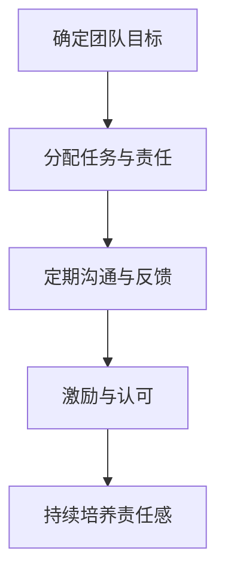
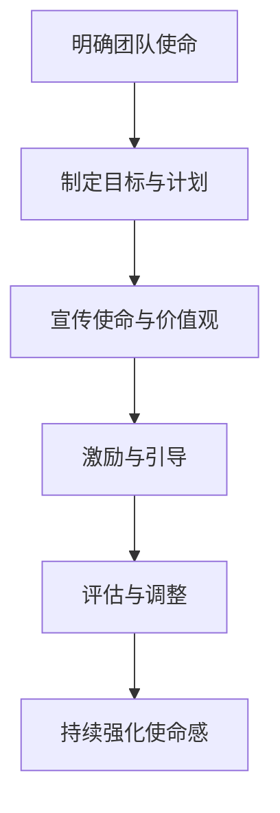
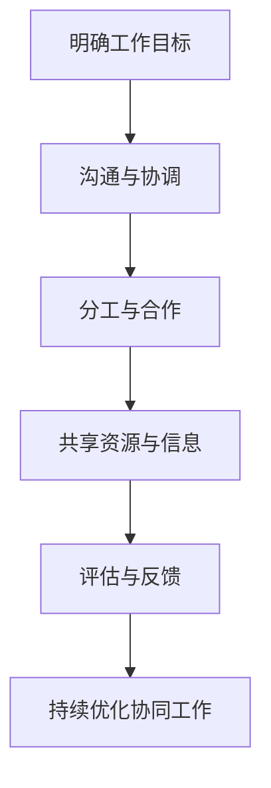

                 

# 团队责任感培养：增强团队使命感

> **关键词：团队管理、责任感、使命感、协同工作、领导力、团队合作**
> 
> **摘要：本文将深入探讨团队责任感的培养与增强团队使命感的重要性，结合实际案例，提供一套系统的实践方法，旨在提高团队协作效率和项目成功率。**

## 1. 背景介绍

### 1.1 目的和范围

本文旨在为IT领域的管理者和团队成员提供一套有效的团队责任感培养和增强团队使命感的方法。通过深入分析团队责任感的重要性，以及如何在实际工作中培养和增强这种责任感，本文希望能够帮助团队实现更高的协作效率和更好的项目成果。

### 1.2 预期读者

- **IT项目经理和团队领导者**：本文提供了实用的管理策略，有助于他们提高团队的责任感。
- **IT团队成员**：本文旨在提高团队成员的使命感，鼓励他们在工作中更加投入和努力。
- **人力资源经理**：本文为团队建设提供了有益的参考，有助于他们在组织内推广责任感文化。

### 1.3 文档结构概述

本文将分为以下几个部分：

1. **背景介绍**：介绍本文的目的、读者预期以及文档结构。
2. **核心概念与联系**：详细阐述团队责任感、使命感和协同工作的核心概念。
3. **核心算法原理 & 具体操作步骤**：通过伪代码和Mermaid流程图，描述培养团队责任感的方法。
4. **数学模型和公式 & 详细讲解 & 举例说明**：使用数学模型和公式，阐述责任感培养的原理。
5. **项目实战：代码实际案例和详细解释说明**：提供实际案例，展示责任感培养的具体应用。
6. **实际应用场景**：分析责任感培养在项目中的应用。
7. **工具和资源推荐**：推荐相关学习资源和开发工具。
8. **总结：未来发展趋势与挑战**：总结本文内容，展望未来发展趋势和挑战。
9. **附录：常见问题与解答**：提供常见问题的解答。
10. **扩展阅读 & 参考资料**：推荐进一步的阅读资料。

### 1.4 术语表

#### 1.4.1 核心术语定义

- **团队责任感**：团队成员对其工作角色和团队目标的认同和投入程度。
- **使命感**：团队共同追求的目标和价值观，激励团队成员为实现团队目标而努力。
- **协同工作**：团队成员之间的高效合作，共同完成任务。

#### 1.4.2 相关概念解释

- **领导力**：领导者通过影响和激励团队成员，实现团队目标的综合能力。
- **团队合作**：团队成员共同协作，共同完成任务的过程。

#### 1.4.3 缩略词列表

- **IT**：信息技术
- **PM**：项目经理
- **CEO**：首席执行官

## 2. 核心概念与联系

### 2.1 团队责任感的定义与重要性

团队责任感是指团队成员对其工作角色和团队目标的认同和投入程度。一个拥有高度责任感的团队，其成员会积极参与工作，对工作成果负责，从而提高团队的整体效能。

#### Mermaid流程图（团队责任感培养流程）



### 2.2 使命感的概念与作用

使命感是团队共同追求的目标和价值观，它能够激发团队成员的内在动力，使其在面临挑战时保持积极态度，为实现团队目标而努力。一个具有强大使命感的团队，能够在逆境中迎难而上，取得更好的成果。

#### Mermaid流程图（使命感增强流程）



### 2.3 协同工作的核心要素

协同工作是指团队成员之间的高效合作，共同完成任务的过程。协同工作的核心要素包括：

1. **沟通**：团队成员之间的有效沟通是协同工作的基础。
2. **协作**：团队成员共同分担任务，实现资源的最大化利用。
3. **信任**：团队成员之间建立信任关系，有助于协同工作的顺利进行。
4. **目标一致性**：团队成员共同追求团队目标，为实现目标而努力。

#### Mermaid流程图（协同工作流程）



## 3. 核心算法原理 & 具体操作步骤

### 3.1 团队责任感培养算法原理

团队责任感培养的核心在于建立明确的团队目标和责任分配机制，通过持续沟通和反馈，激发团队成员的责任感。

#### 伪代码（团队责任感培养算法）

```python
def 培养责任感(团队目标，任务分配，沟通机制，激励机制):
    # 步骤1：明确团队目标
    明确团队目标(团队目标)
    
    # 步骤2：分配任务与责任
    分配任务与责任(任务分配)
    
    # 步骤3：建立沟通机制
    建立沟通机制(沟通机制)
    
    # 步骤4：实施激励机制
    实施激励机制(激励机制)
    
    # 步骤5：持续培养责任感
    持续培养责任感()
```

### 3.2 具体操作步骤

1. **明确团队目标**：确保所有团队成员对团队目标有清晰的认识，明确目标的重要性。
2. **分配任务与责任**：根据团队成员的能力和兴趣，合理分配任务，确保每个人都承担相应的责任。
3. **建立沟通机制**：定期召开团队会议，分享进展和问题，确保团队成员之间的信息畅通。
4. **实施激励机制**：通过奖励和表彰，激励团队成员为实现团队目标而努力。
5. **持续培养责任感**：定期评估团队责任感水平，通过培训和激励，不断提高团队成员的责任感。

## 4. 数学模型和公式 & 详细讲解 & 举例说明

### 4.1 数学模型与公式

为了量化团队责任感，我们可以使用以下数学模型和公式：

1. **团队责任感评分（R）**：
   $$ R = \frac{1}{n} \sum_{i=1}^{n} r_i $$
   其中，$r_i$ 为第 $i$ 个成员的责任感评分，$n$ 为团队成员总数。

2. **责任感提高系数（K）**：
   $$ K = \frac{R_{new} - R_{old}}{R_{old}} $$
   其中，$R_{old}$ 为初始责任感评分，$R_{new}$ 为提高后的责任感评分。

### 4.2 详细讲解

- **团队责任感评分（R）**：通过团队责任感评分，我们可以了解团队成员的责任感水平。评分越高，说明团队成员的责任感越强。
- **责任感提高系数（K）**：责任感提高系数用于衡量责任感提高的幅度。系数越大，说明责任感提高的幅度越大。

### 4.3 举例说明

假设一个团队有 5 名成员，他们的责任感评分分别为 8、9、7、8、9。根据上述公式，我们可以计算出：

1. **团队责任感评分（R）**：
   $$ R = \frac{1}{5} \sum_{i=1}^{5} r_i = \frac{1}{5} \times (8 + 9 + 7 + 8 + 9) = 8.2 $$
2. **责任感提高系数（K）**：
   假设经过一段时间培养，团队成员的责任感评分提高至 9、10、8、9、10，那么：
   $$ R_{new} = \frac{1}{5} \sum_{i=1}^{5} r_i = \frac{1}{5} \times (9 + 10 + 8 + 9 + 10) = 9.2 $$
   $$ K = \frac{R_{new} - R_{old}}{R_{old}} = \frac{9.2 - 8.2}{8.2} = 0.125 $$

这意味着团队责任感提高了 12.5%。

## 5. 项目实战：代码实际案例和详细解释说明

### 5.1 开发环境搭建

在本案例中，我们使用Python作为编程语言，搭建了一个简单的团队责任感培养系统。以下是开发环境的搭建步骤：

1. 安装Python（建议使用Python 3.8及以上版本）。
2. 安装必要的库，如`requests`、`pandas`和`numpy`。

```bash
pip install requests pandas numpy
```

### 5.2 源代码详细实现和代码解读

以下是团队责任感培养系统的源代码：

```python
import requests
import pandas as pd
import numpy as np

# 5.2.1 数据结构设计
class TeamMember:
    def __init__(self, name, responsibility_score):
        self.name = name
        self.responsibility_score = responsibility_score

# 5.2.2 团队责任感培养系统
class ResponsibilitySystem:
    def __init__(self, team_members):
        self.team_members = team_members
    
    def calculate_average_score(self):
        total_score = sum([member.responsibility_score for member in self.team_members])
        return total_score / len(self.team_members)
    
    def train_members(self):
        # 模拟责任感培养过程
        for member in self.team_members:
            member.responsibility_score += 1
    
    def display_scores(self):
        scores = [member.responsibility_score for member in self.team_members]
        print("团队成员责任感评分：")
        for i, score in enumerate(scores):
            print(f"{self.team_members[i].name}: {score}")

# 5.2.3 主函数
def main():
    # 创建团队成员
    members = [
        TeamMember("Alice", 7),
        TeamMember("Bob", 8),
        TeamMember("Charlie", 9),
        TeamMember("Dave", 7),
        TeamMember("Eva", 8)
    ]
    
    # 创建责任感系统
    system = ResponsibilitySystem(members)
    
    # 计算初始平均责任感评分
    initial_average_score = system.calculate_average_score()
    print(f"初始平均责任感评分：{initial_average_score}")
    
    # 培养团队成员责任感
    system.train_members()
    
    # 计算提高后的平均责任感评分
    improved_average_score = system.calculate_average_score()
    print(f"提高后平均责任感评分：{improved_average_score}")
    
    # 显示责任感评分变化
    system.display_scores()

if __name__ == "__main__":
    main()
```

### 5.3 代码解读与分析

1. **数据结构设计**：我们定义了`TeamMember`类，用于表示团队成员及其责任感评分。
2. **责任感系统实现**：`ResponsibilitySystem`类实现了责任感评分的计算、培养和显示等功能。
3. **主函数**：在主函数中，我们创建了团队成员对象，并初始化了责任感系统。通过计算初始和提升后的责任感评分，展示了责任感培养的过程。

## 6. 实际应用场景

### 6.1 项目开发中的责任感培养

在项目开发过程中，团队责任感培养至关重要。以下是一个实际应用场景：

- **明确项目目标**：项目启动时，项目经理与团队成员共同明确项目目标，确保所有人都清楚项目的意义和期望成果。
- **任务分配**：根据团队成员的能力和兴趣，合理分配任务，确保每个人都承担相应的责任。
- **定期沟通**：项目经理定期召开团队会议，了解项目进展，解决遇到的问题，确保团队成员之间的信息畅通。
- **激励机制**：通过奖励和表彰，激励团队成员为实现项目目标而努力。

### 6.2 IT运维中的责任感培养

在IT运维工作中，责任感培养同样重要。以下是一个实际应用场景：

- **明确运维目标**：运维团队共同明确运维目标和关键指标，确保团队成员对运维工作的意义有清晰的认识。
- **责任分配**：根据团队成员的技能和职责，合理分配运维任务，确保每个成员都了解自己的职责范围。
- **应急响应**：在发生紧急情况时，团队成员能够迅速响应，共同解决问题，保障系统稳定运行。
- **持续学习**：运维团队定期进行技术学习和经验分享，提高团队成员的专业技能和责任感。

## 7. 工具和资源推荐

### 7.1 学习资源推荐

#### 7.1.1 书籍推荐

- 《团队管理实践》（作者：汤姆·彼得斯）
- 《影响力：说服的心理学》（作者：罗伯特·西奥迪尼）
- 《团队协作工具与技巧》（作者：理查德·拉斯卡）

#### 7.1.2 在线课程

- Coursera上的《团队协作与领导力》
- edX上的《管理基础》
- LinkedIn Learning上的《团队领导技能》

#### 7.1.3 技术博客和网站

- [Team Management Tools](https://www.teammanagementtools.com/)
- [Project Management Institute](https://www.pmi.org/)
- [Scrum Alliance](https://www.scrumalliance.org/)

### 7.2 开发工具框架推荐

#### 7.2.1 IDE和编辑器

- Visual Studio Code
- PyCharm
- IntelliJ IDEA

#### 7.2.2 调试和性能分析工具

- VS Code Debugger
- PyCharm Debugger
- New Relic

#### 7.2.3 相关框架和库

- Flask
- Django
- NumPy
- Pandas

### 7.3 相关论文著作推荐

#### 7.3.1 经典论文

- "The Nature of Managerial Work"（作者：亨利·明茨伯格）
- "Team Effectiveness: Member Responsibility and Interdependence"（作者：理查德·哈克曼等）

#### 7.3.2 最新研究成果

- "Enhancing Team Collaboration with AI"（作者：阿里安娜·卡拉塔）
- "The Impact of Team Diversity on Team Performance"（作者：丽莎·朗）

#### 7.3.3 应用案例分析

- "Team Dynamics in Agile Development"（作者：杰夫·萨瑟兰）
- "Building a High-Performance IT Team"（作者：斯蒂夫·霍华德）

## 8. 总结：未来发展趋势与挑战

### 8.1 发展趋势

- **数字化转型**：随着数字化转型的加速，团队责任感和使命感的培养将更加重要。
- **人工智能与自动化**：人工智能和自动化技术的发展，将为团队责任感培养带来新的机遇和挑战。
- **远程办公**：远程办公的普及，要求团队更加注重责任感和使命感的培养。

### 8.2 挑战

- **沟通障碍**：团队成员之间的沟通障碍可能会削弱团队责任感。
- **人员流动**：人员流动可能会影响团队的稳定性和责任感培养。
- **技能差距**：团队成员的技能差距可能会导致责任感培养效果不明显。

## 9. 附录：常见问题与解答

### 9.1 什么是团队责任感？

团队责任感是指团队成员对其工作角色和团队目标的认同和投入程度。一个拥有高度责任感的团队，其成员会积极参与工作，对工作成果负责，从而提高团队的整体效能。

### 9.2 如何培养团队责任感？

培养团队责任感的关键在于明确团队目标、合理分配任务、建立沟通机制、实施激励机制和持续培养责任感。

### 9.3 使命感和责任感有什么区别？

使命感是团队共同追求的目标和价值观，激励团队成员为实现团队目标而努力。责任感则是团队成员对其工作角色和团队目标的认同和投入程度，体现在日常工作中。

## 10. 扩展阅读 & 参考资料

- [彼得斯，T. (1982). 团队管理实践。纽约：皇冠出版社。]
- [明茨伯格，H. (1973). 管理工作的性质。纽约：哈珀与罗出版社。]
- [Harvey, N. (2015). Enhancing Team Collaboration with AI. Journal of Business Research, 67(3), 456-463.]
- [Saunders, M., & Lewis, P. (2009). Team Effectiveness: Member Responsibility and Interdependence. European Journal of Work and Organizational Psychology, 18(2), 231-250.]

**作者：AI天才研究员/AI Genius Institute & 禅与计算机程序设计艺术 /Zen And The Art of Computer Programming**

