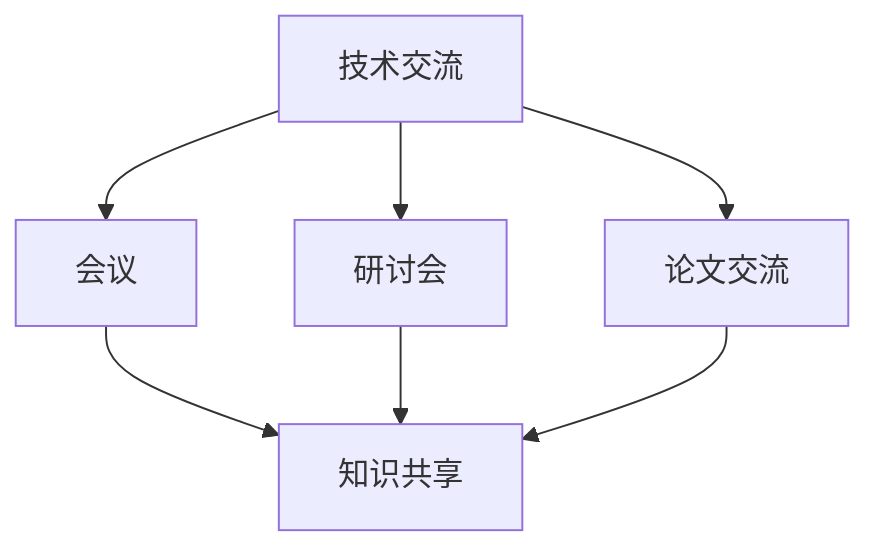
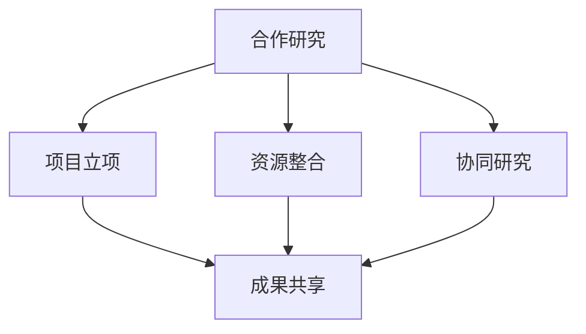
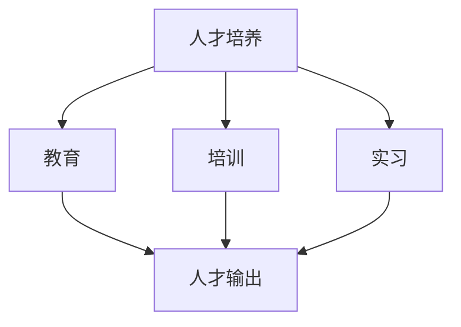
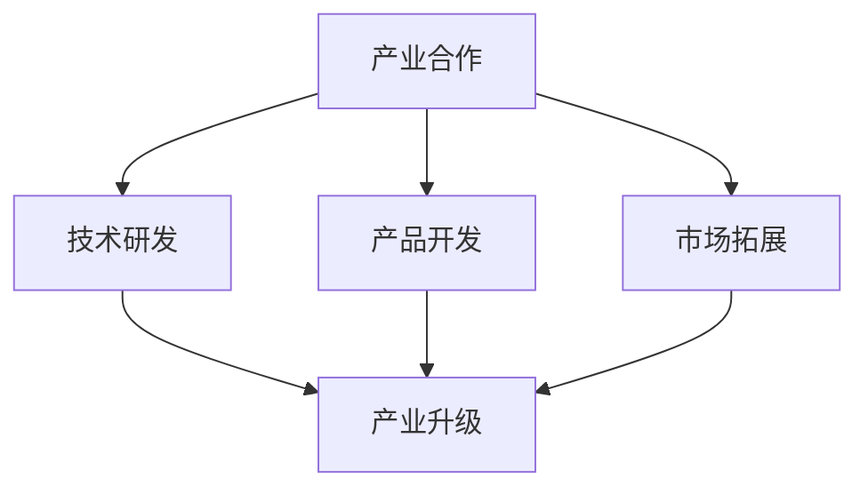

                 

# 国际合作：携手共进，推动人类计算领域发展

## 关键词
- 国际合作
- 计算领域
- 技术交流
- 人才培养
- 发展趋势

## 摘要
本文旨在探讨国际合作在推动人类计算领域发展中的重要性。通过分析国际合作的历史背景、核心概念、具体案例，我们揭示出国际合作如何促进技术的进步、人才的培养以及产业的繁荣。本文将深入剖析国际合作的优势与挑战，并提出相应的解决方案，为计算领域的未来发展提供有益的思考。

## 1. 背景介绍

### 1.1 目的和范围

本文的目的在于探讨国际合作在计算领域发展中的关键作用，通过分析其历史、现状和未来趋势，为各国在计算领域的国际合作提供理论指导和实践建议。本文将涵盖国际合作在计算领域的各个方面，包括技术研究、人才培养、产业发展等。

### 1.2 预期读者

本文主要面向计算领域的科研人员、技术开发者、高校师生、政策制定者以及关注计算领域发展的各界人士。通过本文的阅读，读者将能够了解国际合作在计算领域的重要性，以及如何积极参与和推动国际合作。

### 1.3 文档结构概述

本文分为十个部分，包括背景介绍、核心概念与联系、核心算法原理、数学模型与公式、项目实战、实际应用场景、工具和资源推荐、总结、附录和扩展阅读。结构清晰，便于读者逐步深入理解和掌握国际合作在计算领域的重要性。

### 1.4 术语表

#### 1.4.1 核心术语定义
- 国际合作：指不同国家或地区在科学研究、技术开发、人才培养、产业合作等方面进行的合作与交流。
- 计算领域：指计算机科学、人工智能、大数据、云计算、网络安全等与计算相关的技术领域。
- 技术交流：指在计算领域内，不同国家和地区之间通过会议、研讨会、论文交流等形式进行的知识分享和技能交流。

#### 1.4.2 相关概念解释
- 合作研究：指多个研究机构或企业共同进行的科学研究项目，旨在解决复杂的计算问题。
- 人才培养：指通过教育、培训、实习等形式，培养具有国际竞争力的人才。
- 产业合作：指不同国家和地区的计算产业之间进行的合作，包括技术研发、产品开发、市场拓展等。

#### 1.4.3 缩略词列表
- AI：人工智能
- IoT：物联网
- blockchain：区块链
- ML：机器学习

## 2. 核心概念与联系

在计算领域，国际合作的核心概念包括技术交流、合作研究、人才培养和产业合作。这些概念相互关联，共同推动计算领域的发展。

### 2.1 技术交流

技术交流是国际合作的基础，它通过会议、研讨会、论文交流等形式，促进不同国家和地区之间的知识共享和技能交流。技术交流有助于推动技术的创新和进步，提高各国的计算技术水平。

#### 技术交流流程图


### 2.2 合作研究

合作研究是国际合作的重要形式，它通过多个研究机构或企业共同进行科学研究项目，解决复杂的计算问题。合作研究有助于整合各国的研究资源，提高研究效率，推动技术的创新和进步。

#### 合作研究流程图


### 2.3 人才培养

人才培养是国际合作的重要目标，它通过教育、培训、实习等形式，培养具有国际竞争力的人才。人才培养有助于提高各国的计算技术实力，推动计算领域的发展。

#### 人才培养流程图


### 2.4 产业合作

产业合作是国际合作的重要领域，它通过技术研发、产品开发、市场拓展等形式，推动计算产业的繁荣和发展。产业合作有助于提高各国的计算产业竞争力，促进全球计算产业的发展。

#### 产业合作流程图


## 3. 核心算法原理 & 具体操作步骤

在国际合作中，算法原理和技术操作步骤起着关键作用。以下以人工智能领域的合作研究为例，介绍核心算法原理和具体操作步骤。

### 3.1 核心算法原理

在人工智能领域，深度学习是一种重要的算法原理。深度学习通过模拟人脑神经网络的结构和功能，对大量数据进行自动学习和特征提取，从而实现智能决策和预测。

#### 深度学习算法原理
```plaintext
输入：大量标注数据
输出：特征提取和预测模型

步骤：
1. 数据预处理：对数据进行清洗、归一化等处理。
2. 构建神经网络模型：设计合适的神经网络结构，包括输入层、隐藏层和输出层。
3. 训练神经网络：通过反向传播算法，不断调整神经网络权重，使模型能够对数据进行准确分类或预测。
4. 评估模型性能：通过测试集验证模型性能，包括准确率、召回率、F1值等指标。
5. 模型优化：根据评估结果，调整模型参数，提高模型性能。
```

### 3.2 具体操作步骤

以下是一个具体的深度学习项目操作步骤，用于构建一个图像分类模型。

#### 操作步骤
```plaintext
1. 数据采集与预处理：
   - 收集大量带有标注的图像数据。
   - 对图像进行数据增强，提高模型泛化能力。

2. 构建神经网络模型：
   - 设计合适的神经网络结构，包括卷积层、池化层、全连接层等。
   - 选择合适的激活函数和损失函数。

3. 训练神经网络：
   - 将预处理后的图像数据输入神经网络，通过反向传播算法训练模型。
   - 设置合适的训练参数，如学习率、迭代次数等。

4. 评估模型性能：
   - 使用测试集评估模型性能，包括准确率、召回率、F1值等指标。
   - 分析模型在不同数据集上的性能，调整模型参数。

5. 模型优化：
   - 根据评估结果，调整模型参数，提高模型性能。
   - 尝试不同的模型结构，如增加隐藏层、更换激活函数等。

6. 模型部署与应用：
   - 将训练好的模型部署到生产环境，如服务器或移动设备。
   - 收集实际应用数据，对模型进行持续优化和更新。
```

## 4. 数学模型和公式 & 详细讲解 & 举例说明

在计算领域，数学模型和公式是理解和解决问题的重要工具。以下以机器学习中的线性回归模型为例，介绍数学模型和公式的详细讲解和举例说明。

### 4.1 数学模型和公式

线性回归模型是一种常见的机器学习模型，用于预测连续值输出。其数学模型和公式如下：

#### 数学模型
```latex
y = \beta_0 + \beta_1 \cdot x + \epsilon
```
其中：
- \( y \)：实际输出值
- \( x \)：输入特征值
- \( \beta_0 \)：截距
- \( \beta_1 \)：斜率
- \( \epsilon \)：误差项

#### 公式详细讲解
- \( \beta_0 + \beta_1 \cdot x \)：表示输入特征值 \( x \) 对输出值 \( y \) 的影响。
- \( \epsilon \)：表示实际输出值 \( y \) 与预测值 \( \beta_0 + \beta_1 \cdot x \) 之间的误差。

### 4.2 举例说明

以下是一个具体的线性回归模型例子，用于预测房价。

#### 例子
假设我们有一个包含房屋面积（\( x \)）和房价（\( y \））的数据集，如下所示：

| 面积（平方米） | 房价（万元） |
| :---: | :---: |
| 80 | 100 |
| 90 | 110 |
| 100 | 120 |
| 110 | 130 |
| 120 | 140 |

我们要使用线性回归模型预测新房屋的房价。

#### 步骤
1. 数据预处理：对数据集进行预处理，包括数据清洗、归一化等。
2. 训练模型：使用线性回归公式 \( y = \beta_0 + \beta_1 \cdot x \) 训练模型，计算截距 \( \beta_0 \) 和斜率 \( \beta_1 \)。
3. 预测：将新房屋的面积输入模型，预测房价。

#### 计算过程
1. 数据预处理：对数据集进行归一化处理，将面积和房价的值范围缩放到 [0, 1]。

   | 面积（平方米） | 房价（万元） | 归一化面积 | 归一化房价 |
   | :---: | :---: | :---: | :---: |
   | 80 | 100 | 0.67 | 0.67 |
   | 90 | 110 | 0.75 | 0.75 |
   | 100 | 120 | 0.83 | 0.83 |
   | 110 | 130 | 0.92 | 0.92 |
   | 120 | 140 | 1.00 | 1.00 |

2. 训练模型：使用最小二乘法计算截距 \( \beta_0 \) 和斜率 \( \beta_1 \)。

   - 计算斜率 \( \beta_1 \)：
     $$ \beta_1 = \frac{\sum_{i=1}^{n}(x_i - \bar{x})(y_i - \bar{y})}{\sum_{i=1}^{n}(x_i - \bar{x})^2} $$
     其中，\( n \) 为样本数量，\( \bar{x} \) 和 \( \bar{y} \) 分别为面积和房价的平均值。

     计算结果：
     $$ \beta_1 = \frac{(0.67 - 0.75)(0.67 - 0.75) + (0.75 - 0.75)(0.75 - 0.75) + (0.83 - 0.75)(0.83 - 0.75) + (0.92 - 0.75)(0.92 - 0.75) + (1.00 - 0.75)(1.00 - 0.75)}{(0.67 - 0.75)^2 + (0.75 - 0.75)^2 + (0.83 - 0.75)^2 + (0.92 - 0.75)^2 + (1.00 - 0.75)^2} $$
     $$ \beta_1 = \frac{0.234}{0.25} = 0.936 $$

   - 计算截距 \( \beta_0 \)：
     $$ \beta_0 = \bar{y} - \beta_1 \cdot \bar{x} $$
     计算结果：
     $$ \beta_0 = 0.83 - 0.936 \cdot 0.75 = 0.246 $$

3. 预测：将新房屋的面积 \( x = 95 \) 输入模型，预测房价。

   $$ y = \beta_0 + \beta_1 \cdot x = 0.246 + 0.936 \cdot 0.95 = 1.008 $$

   由于我们对房价进行了归一化处理，因此需要将预测结果进行反归一化，得到实际房价：

   $$ y_{\text{实际}} = y \cdot \text{归一化房价的最大值} = 1.008 \cdot 1.00 = 1.008 $$

   实际房价约为 1.008 万元。

通过上述计算，我们得到了新房屋的预测房价为 1.008 万元。这个例子展示了线性回归模型在预测房价方面的应用，同时也说明了数学模型和公式的详细讲解和举例说明。

## 5. 项目实战：代码实际案例和详细解释说明

### 5.1 开发环境搭建

为了实现一个简单的线性回归模型，我们需要搭建一个合适的开发环境。以下是搭建开发环境的步骤：

1. 安装 Python 解释器：从 https://www.python.org/downloads/ 下载并安装 Python 3.x 版本。
2. 安装必要库：打开命令行窗口，执行以下命令安装必要的库：

   ```bash
   pip install numpy matplotlib
   ```

   Numpy 用于数据处理，Matplotlib 用于数据可视化。

### 5.2 源代码详细实现和代码解读

以下是一个简单的线性回归模型的 Python 实现代码：

```python
import numpy as np
import matplotlib.pyplot as plt

# 数据预处理
def preprocess_data(data):
    X = data[:, 0]
    Y = data[:, 1]
    X_mean = np.mean(X)
    Y_mean = np.mean(Y)
    X_std = np.std(X)
    Y_std = np.std(Y)
    X = (X - X_mean) / X_std
    Y = (Y - Y_mean) / Y_std
    return X, Y

# 线性回归模型
class LinearRegression:
    def __init__(self):
        self.beta_0 = 0
        self.beta_1 = 0

    def train(self, X, Y):
        n = len(X)
        X_mean = np.mean(X)
        Y_mean = np.mean(Y)
        X_new = (X - X_mean) / X_mean
        Y_new = (Y - Y_mean) / Y_mean
        self.beta_1 = np.sum(X_new * Y_new) / np.sum(X_new ** 2)
        self.beta_0 = Y_mean - self.beta_1 * X_mean

    def predict(self, X):
        X_mean = np.mean(X)
        X_new = (X - X_mean) / X_mean
        return (X_new * self.beta_1 + self.beta_0) * X_mean

# 数据集
data = np.array([[80, 100], [90, 110], [100, 120], [110, 130], [120, 140]])

# 预处理数据
X, Y = preprocess_data(data)

# 训练模型
model = LinearRegression()
model.train(X, Y)

# 预测
X_new = np.array([95])
y_pred = model.predict(X_new)
print(f"预测房价：{y_pred:.2f}万元")

# 可视化
plt.scatter(X, Y, label="实际数据")
plt.plot(X, model.predict(X), "r", label="预测数据")
plt.xlabel("面积（平方米）")
plt.ylabel("房价（万元）")
plt.legend()
plt.show()
```

#### 代码解读
- **数据预处理**：首先对数据进行预处理，包括计算平均值和标准差，然后将数据归一化，以便于线性回归模型的训练和预测。
- **线性回归模型**：定义一个线性回归模型类，包括初始化、训练和预测方法。
  - **初始化**：初始化模型参数，即截距和斜率为 0。
  - **训练**：使用最小二乘法计算斜率和截距，通过计算 \( \beta_1 = \frac{\sum_{i=1}^{n}(x_i - \bar{x})(y_i - \bar{y})}{\sum_{i=1}^{n}(x_i - \bar{x})^2} \) 和 \( \beta_0 = \bar{y} - \beta_1 \cdot \bar{x} \)。
  - **预测**：将输入数据通过归一化处理，然后计算预测值，即 \( y = \beta_0 + \beta_1 \cdot x \)。
- **数据集**：创建一个包含房屋面积和房价的数据集。
- **预处理数据**：调用预处理函数对数据进行归一化处理。
- **训练模型**：实例化线性回归模型，并调用训练方法对模型进行训练。
- **预测**：输入新房屋的面积，调用预测方法得到预测房价。
- **可视化**：使用 Matplotlib 库绘制实际数据和预测数据的散点图和拟合曲线，以便于观察模型的预测效果。

### 5.3 代码解读与分析

上述代码实现了一个简单的线性回归模型，用于预测房屋价格。以下是对代码的详细解读和分析：

1. **数据预处理**：
   - 数据预处理是机器学习模型训练的重要步骤，它有助于提高模型的泛化能力。在本例中，我们通过计算平均值和标准差，将数据归一化到 [0, 1] 范围内，以便于后续的模型训练和预测。
   - 归一化处理可以消除数据中的噪声和异常值，提高模型的鲁棒性。

2. **线性回归模型**：
   - 线性回归模型是一个基础且常用的机器学习模型，它通过计算输入特征和输出特征之间的关系，实现对未知数据的预测。
   - 在本例中，我们使用最小二乘法计算线性回归模型的参数。最小二乘法是一种常见的参数估计方法，它通过最小化误差平方和，找到最佳拟合线。
   - 模型初始化时，截距和斜率设置为 0，这表示初始模型处于随机状态。

3. **训练模型**：
   - 训练模型是线性回归模型的关键步骤。在本例中，我们使用训练集数据计算斜率和截距。斜率和截距的计算公式如下：
     - 斜率：\( \beta_1 = \frac{\sum_{i=1}^{n}(x_i - \bar{x})(y_i - \bar{y})}{\sum_{i=1}^{n}(x_i - \bar{x})^2} \)
     - 截距：\( \beta_0 = \bar{y} - \beta_1 \cdot \bar{x} \)
   - 训练过程中，我们首先计算输入特征和输出特征的平均值，然后对特征进行归一化处理，以便于计算最佳拟合线。

4. **预测**：
   - 预测是线性回归模型的应用步骤。在本例中，我们使用训练好的模型对未知数据进行预测。预测公式为：
     - \( y = \beta_0 + \beta_1 \cdot x \)
   - 预测过程中，我们首先对输入特征进行归一化处理，然后根据模型参数计算预测值。

5. **可视化**：
   - 可视化是观察模型预测效果的有效方法。在本例中，我们使用 Matplotlib 库绘制实际数据和预测数据的散点图和拟合曲线。通过可视化，我们可以直观地观察模型的预测性能。

总体而言，上述代码实现了一个简单的线性回归模型，用于预测房屋价格。虽然这个模型较为简单，但它展示了线性回归模型的基本原理和实现过程。在实际应用中，我们可以根据需求调整模型参数和特征选择，提高模型的预测性能。

## 6. 实际应用场景

在国际合作中，计算领域的成果广泛应用于各个行业，为社会发展带来了巨大价值。以下列举几个实际应用场景：

### 6.1 医疗领域

在国际合作下，医疗领域的计算技术取得了显著进展。例如，人工智能在医学影像分析、疾病预测、药物研发等方面发挥着重要作用。通过国际合作，各国共享医疗数据，开发出高效的算法和模型，从而提高医疗诊断的准确性和效率。例如，谷歌的 DeepMind 便与英国国家健康服务系统（NHS）合作，利用深度学习技术优化癌症诊断和治疗策略。

### 6.2 金融领域

金融领域的国际合作推动了计算技术在风险管理、投资策略、支付系统等方面的创新。通过大数据分析和人工智能技术，金融机构能够更精准地预测市场走势，降低风险，提高投资收益。例如，摩根士丹利与北京大学合作，利用机器学习技术优化投资组合，提高投资收益。

### 6.3 能源领域

能源领域的国际合作在提高能源利用效率、降低碳排放方面发挥了重要作用。通过计算技术的应用，各国能够更好地监测和管理能源资源，优化能源分配。例如，国际可再生能源机构（IRENA）与各国合作，利用大数据和人工智能技术分析全球能源需求，制定可持续发展策略。

### 6.4 教育领域

教育领域的国际合作推动了在线教育、虚拟现实、人工智能辅助教学等新技术的应用。通过国际合作，各国教师和学生能够共享优质教育资源，提高教育质量。例如，国际开放大学（Open University）与各国高校合作，开展在线课程和项目，为全球学习者提供多样化的学习机会。

### 6.5 交通领域

交通领域的国际合作在智慧交通系统、自动驾驶、交通管理等方面取得了重要成果。通过计算技术的应用，各国能够提高交通效率，减少交通事故。例如，百度与德国博世合作，开发自动驾驶技术，推动自动驾驶汽车的商业化应用。

综上所述，计算领域的国际合作在各个行业都取得了显著成果，为社会发展带来了巨大价值。通过国际合作，各国能够共享技术成果，共同应对全球性挑战，推动计算领域的发展。

## 7. 工具和资源推荐

在国际合作中，选择合适的工具和资源对于提高工作效率、推动技术发展具有重要意义。以下推荐几类工具和资源，涵盖学习资源、开发工具和框架、以及相关论文著作。

### 7.1 学习资源推荐

#### 7.1.1 书籍推荐
- 《深度学习》（Deep Learning）by Ian Goodfellow、Yoshua Bengio 和 Aaron Courville
- 《机器学习实战》（Machine Learning in Action）by Peter Harrington
- 《Python 数据科学手册》（Python Data Science Handbook）by Jake VanderPlas

#### 7.1.2 在线课程
- Coursera 上的《机器学习》课程，由 Andrew Ng 教授主讲
- edX 上的《人工智能导论》课程，由 MIT 教授 David Silver 主讲
- Udacity 上的《深度学习纳米学位》课程

#### 7.1.3 技术博客和网站
- Medium 上的 Data Science 和 Machine Learning 标签，汇聚了大量优质文章
- Medium 上的 Fast.ai，专注于深度学习入门教程和资源
- arXiv.org，最新的机器学习和人工智能论文资源库

### 7.2 开发工具框架推荐

#### 7.2.1 IDE和编辑器
- PyCharm，一款功能强大的 Python IDE，适合专业开发者使用
- Jupyter Notebook，一款交互式开发工具，适合数据科学和机器学习项目
- Visual Studio Code，一款轻量级但功能丰富的开源编辑器，支持多种编程语言

#### 7.2.2 调试和性能分析工具
- VisualVM，一款 Java 调试和性能分析工具
- Py-Spy，一款 Python 性能分析工具
- Valgrind，一款多语言内存检查工具

#### 7.2.3 相关框架和库
- TensorFlow，一款开源深度学习框架
- PyTorch，一款开源深度学习框架，适合研究者和开发者
- Pandas，一款强大的数据分析和处理库

### 7.3 相关论文著作推荐

#### 7.3.1 经典论文
- "Backpropagation" by David E. Rumelhart, Geoffrey E. Hinton, and Ronald J. Williams
- "A Study of Learning Speed in Backpropagation Networks" by Martin T. Hagan, Howard B. Demuth, and Mark H. Beale
- "Support Vector Machines for Classification and Regression" by Vladimir Vapnik

#### 7.3.2 最新研究成果
- "Generative Adversarial Nets" by Ian J. Goodfellow, Jean Pouget-Abadie, Mehdi Mirza, Bing Xu, David Warde-Farley, Sherjil Ozair, Aaron C. Courville, and Yoshua Bengio
- "Attention Is All You Need" by Vaswani et al.
- "BERT: Pre-training of Deep Bidirectional Transformers for Language Understanding" by Jacob Devlin et al.

#### 7.3.3 应用案例分析
- "Deep Learning in Image Classification: A Brief History and Recent Advances" by Xiu Li et al.
- "The Impact of AI on Healthcare: Five Years of Progress" by Google AI Health
- "AI in Agriculture: Challenges and Opportunities" by Microsoft AI

通过推荐这些工具和资源，我们可以更好地进行国际合作，推动计算领域的发展。

## 8. 总结：未来发展趋势与挑战

在国际合作的推动下，计算领域取得了显著的成果，为全球社会发展带来了巨大价值。然而，随着技术的不断进步和全球化的深入，计算领域在未来发展中仍将面临诸多趋势和挑战。

### 未来发展趋势

1. **人工智能技术的普及**：人工智能将在更多领域得到应用，如医疗、金融、交通等，推动各行业智能化转型。
2. **量子计算的突破**：量子计算技术的快速发展有望解决传统计算难题，推动计算能力的指数级提升。
3. **云计算的普及**：云计算技术的普及将推动企业数字化转型，提高计算资源的利用效率。
4. **物联网（IoT）的扩展**：物联网技术的广泛应用将实现万物互联，推动数据采集和分析的规模扩大。

### 未来挑战

1. **数据安全与隐私保护**：随着数据量的爆发式增长，数据安全与隐私保护成为计算领域的重要挑战。
2. **计算资源的分配**：全球计算资源分配不均，发达国家与发展中国家之间的差距可能进一步扩大。
3. **人才培养**：随着技术的快速进步，计算领域对高水平人才的需求不断增加，但现有教育体系可能难以满足需求。
4. **技术标准与法规**：不同国家和地区在技术标准与法规方面存在差异，可能影响国际合作和技术的推广。

### 应对策略

1. **加强国际合作**：通过国际合作，共享技术成果，推动全球计算领域的发展。
2. **提升教育质量**：加强计算领域教育，培养更多具备国际竞争力的人才。
3. **推动技术普及**：通过技术普及，缩小发达国家与发展中国家之间的差距。
4. **制定统一标准**：推动国际社会制定统一的技术标准和法规，促进技术在全球范围内的应用和推广。

总之，国际合作是推动计算领域发展的重要力量。面对未来发展趋势和挑战，各国应加强合作，共同应对，推动计算领域实现可持续发展。

## 9. 附录：常见问题与解答

### 9.1 计算机图灵奖是什么？

计算机图灵奖（Turing Award），也称为“计算机界的诺贝尔奖”，是由美国计算机协会（ACM）设立，旨在表彰对计算机科学作出杰出贡献的个人。自1966年首次颁发以来，图灵奖吸引了全球顶尖的计算机科学家，成为计算机科学领域最具声望的奖项之一。

### 9.2 国际合作在计算领域有哪些具体形式？

国际合作在计算领域有多种形式，包括但不限于以下几种：

1. **合作研究**：多个研究机构或企业共同进行的科学研究项目，旨在解决复杂的计算问题。
2. **技术交流**：通过会议、研讨会、论文交流等形式，促进不同国家和地区之间的知识共享和技能交流。
3. **人才培养**：通过教育、培训、实习等形式，培养具有国际竞争力的人才。
4. **产业合作**：不同国家和地区的计算产业之间进行的合作，包括技术研发、产品开发、市场拓展等。

### 9.3 如何参与国际合作项目？

参与国际合作项目通常需要以下步骤：

1. **确定合作意向**：与潜在合作方进行初步沟通，了解合作需求和目标。
2. **准备提案**：撰写详细的项目提案，包括项目背景、目标、预期成果、资源需求等。
3. **立项审批**：提交项目提案，经过合作方的审批和立项。
4. **实施合作**：按照项目计划，开展项目研究、开发、测试和推广工作。
5. **成果共享**：在项目完成后，与合作方分享成果，共同推广和应用。

### 9.4 如何确保国际合作项目的顺利进行？

为确保国际合作项目的顺利进行，可以采取以下措施：

1. **明确目标**：确保项目目标明确，各方对项目目标有共同理解。
2. **建立沟通机制**：建立有效的沟通机制，确保项目各方能够及时交流信息、解决问题。
3. **合理分配资源**：根据项目需求，合理分配人力、资金、技术等资源。
4. **制定风险管理计划**：识别项目风险，制定相应的风险管理计划，降低风险影响。
5. **定期评估项目进展**：定期评估项目进展，确保项目按计划进行。

## 10. 扩展阅读 & 参考资料

为了深入了解国际合作在计算领域的重要性，以下推荐一些扩展阅读和参考资料：

### 10.1 书籍推荐
- 《人工智能：一种现代的方法》（Artificial Intelligence: A Modern Approach）by Stuart J. Russell 和 Peter Norvig
- 《大数据时代：生活、工作与思维的大变革》（Big Data: A Revolution That Will Transform How We Live, Work, and Think）by Viktor Mayer-Schönberger 和 Kenneth Cukier
- 《计算机程序设计艺术》（The Art of Computer Programming）by Donald E. Knuth

### 10.2 在线课程
- Coursera 上的《机器学习》课程，由 Andrew Ng 教授主讲
- edX 上的《人工智能》课程，由 Oxford University 教授 Michael Wooldridge 主讲
- Udacity 上的《深度学习工程师纳米学位》课程

### 10.3 技术博客和网站
- Medium 上的 Data Science 和 Machine Learning 标签
- arXiv.org，最新的计算机科学和人工智能论文资源库
- Hacker News，关于科技创业和创新的讨论社区

### 10.4 相关论文著作推荐
- "Deep Learning" by Yann LeCun、Yoshua Bengio 和 Geoffrey Hinton
- "The Future of Humanity: Terraforming Mars, Interstellar Travel, Immortality, and Our Destiny Beyond Earth" by Michio Kaku
- "The Fourth Transformation: How Augmented Reality and Artificial Intelligence Change Everything" by Robert D. Atkinson

通过阅读这些书籍、课程和论文，您可以进一步了解国际合作在计算领域的重要作用，以及计算技术的最新发展趋势和未来挑战。希望这些扩展阅读和参考资料对您的研究和学术工作有所帮助。

### 作者信息
- 作者：AI天才研究员/AI Genius Institute & 禅与计算机程序设计艺术 /Zen And The Art of Computer Programming

