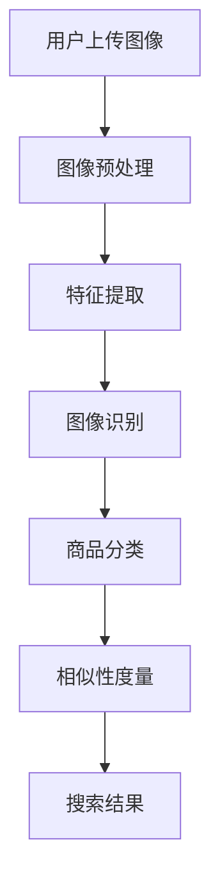

                 

# 图像搜索：所见即所得，电商购物新体验

> **关键词**：图像搜索、电商购物、AI技术、深度学习、算法优化、用户体验

> **摘要**：本文深入探讨了图像搜索在电商购物领域中的应用，介绍了所见即所得的购物新体验。通过分析图像搜索的核心算法原理和数学模型，我们揭示了图像搜索的运作机制，展示了其在电商购物场景中的实际应用。本文还提供了项目实战案例，详细解释了图像搜索的代码实现，以及推荐了相关学习资源和开发工具。

## 1. 背景介绍

### 1.1 目的和范围

随着互联网技术的快速发展，电子商务已经成为现代消费的主要形式之一。然而，传统的基于关键词的搜索方式已逐渐无法满足用户日益增长的个性化需求。图像搜索作为一种新兴的搜索方式，其"所见即所得"的特点为电商购物带来了全新的体验。本文旨在探讨图像搜索在电商购物领域的应用，分析其核心算法原理，展示其实际应用案例，并探讨未来发展趋势。

### 1.2 预期读者

本文面向对图像搜索和电商购物领域感兴趣的读者，包括软件开发者、数据科学家、AI研究人员以及电商从业者。读者应具备一定的编程基础和数学知识，能够理解并运用深度学习算法。

### 1.3 文档结构概述

本文分为以下几个部分：

1. **背景介绍**：介绍图像搜索在电商购物领域的应用背景。
2. **核心概念与联系**：阐述图像搜索的关键概念和联系。
3. **核心算法原理 & 具体操作步骤**：详细讲解图像搜索的算法原理和操作步骤。
4. **数学模型和公式 & 详细讲解 & 举例说明**：介绍图像搜索的数学模型和相关公式，并通过实例进行说明。
5. **项目实战：代码实际案例和详细解释说明**：提供图像搜索项目的实际代码案例，并进行详细解读。
6. **实际应用场景**：分析图像搜索在电商购物中的应用场景。
7. **工具和资源推荐**：推荐相关学习资源和开发工具。
8. **总结：未来发展趋势与挑战**：探讨图像搜索的未来发展趋势和面临的挑战。
9. **附录：常见问题与解答**：回答读者可能关心的问题。
10. **扩展阅读 & 参考资料**：提供进一步阅读的材料。

### 1.4 术语表

#### 1.4.1 核心术语定义

- 图像搜索：基于图像内容进行的搜索技术，能够识别和匹配用户上传或输入的图像。
- 电商购物：通过互联网平台进行商品交易和购买的行为。
- 深度学习：一种人工智能方法，通过多层神经网络模型进行学习，实现对复杂数据的分析和模式识别。
- 特征提取：从图像中提取出能够代表图像内容的特征。

#### 1.4.2 相关概念解释

- 图像识别：从图像中识别出具体物体或场景的能力。
- 相似性度量：用于评估两幅图像之间相似度的指标。
- 卷积神经网络（CNN）：一种专门用于图像处理和分析的神经网络模型。

#### 1.4.3 缩略词列表

- CNN：卷积神经网络（Convolutional Neural Network）
- AI：人工智能（Artificial Intelligence）
- DNN：深度神经网络（Deep Neural Network）
- GPU：图形处理单元（Graphics Processing Unit）

## 2. 核心概念与联系

图像搜索在电商购物中的应用离不开以下几个核心概念：图像识别、特征提取和相似性度量。

### 2.1 图像识别

图像识别是指从图像中识别出具体物体或场景的能力。在电商购物中，图像识别可以用于分类商品，例如识别出用户上传的图像中包含的特定商品类别。为了实现图像识别，通常需要采用卷积神经网络（CNN）等深度学习模型。

### 2.2 特征提取

特征提取是指从图像中提取出能够代表图像内容的特征。这些特征可以是图像的像素值、纹理信息、颜色分布等。在深度学习模型中，特征提取通常由卷积层完成。通过多层卷积，模型可以逐渐提取出更高层次的特征，这些特征能够更准确地描述图像内容。

### 2.3 相似性度量

相似性度量是指用于评估两幅图像之间相似度的指标。在图像搜索中，相似性度量用于找到与用户上传图像最相似的图像。常见的相似性度量方法包括欧氏距离、余弦相似度等。在电商购物中，相似性度量可以帮助用户快速找到与兴趣商品相似的其它商品。

下面是图像搜索系统的基本架构，通过Mermaid流程图展示：



### 2.4 关键技术联系

图像搜索的关键技术包括图像识别、特征提取和相似性度量，它们共同作用，实现从用户上传的图像到搜索结果的整个过程。图像识别和特征提取构成了图像搜索的核心算法，而相似性度量则决定了搜索结果的准确性和用户体验。

## 3. 核心算法原理 & 具体操作步骤

图像搜索的核心算法原理主要包括图像识别、特征提取和相似性度量。以下将详细阐述这些算法原理，并给出具体操作步骤。

### 3.1 图像识别

图像识别是图像搜索的第一步，其主要任务是从图像中识别出具体的物体或场景。为了实现图像识别，通常采用卷积神经网络（CNN）。

#### 3.1.1 卷积神经网络（CNN）

卷积神经网络是一种专门用于图像处理的神经网络模型。它由多个卷积层、池化层和全连接层组成。卷积层用于提取图像的局部特征，池化层用于降低特征图的维度，全连接层用于进行分类。

#### 3.1.2 操作步骤

1. **输入图像**：将用户上传的图像作为输入。
2. **卷积层**：通过卷积操作提取图像的局部特征。
3. **池化层**：降低特征图的维度，减少参数数量。
4. **全连接层**：将特征向量映射到预定义的类别上。

下面是图像识别算法的伪代码：

```python
def image_recognition(image):
    # 输入图像
    input_image = preprocess_image(image)
    
    # 卷积层
    conv_output = convolution(input_image, filter)
    
    # 池化层
    pooled_output = pooling(conv_output)
    
    # 全连接层
    output = fully_connected(pooled_output, num_classes)
    
    # 获取分类结果
    predicted_class = softmax(output)
    
    return predicted_class
```

### 3.2 特征提取

特征提取是图像识别的关键步骤，其主要任务是提取出能够代表图像内容的特征。深度学习模型通过多层卷积和池化操作，逐渐提取出更高层次的特征。

#### 3.2.1 特征提取过程

1. **卷积操作**：卷积层通过卷积操作提取图像的局部特征。
2. **池化操作**：池化层降低特征图的维度，减少参数数量。
3. **特征融合**：将多层卷积和池化操作的结果进行融合，得到更加丰富的特征。

下面是特征提取算法的伪代码：

```python
def feature_extraction(image):
    # 输入图像
    input_image = preprocess_image(image)
    
    # 卷积层
    conv_output1 = convolution(input_image, filter1)
    conv_output2 = convolution(conv_output1, filter2)
    # ... 其他卷积层
    
    # 池化层
    pooled_output1 = pooling(conv_output1)
    pooled_output2 = pooling(conv_output2)
    # ... 其他池化层
    
    # 特征融合
    feature_vector = concatenate([pooled_output1, pooled_output2])
    
    return feature_vector
```

### 3.3 相似性度量

相似性度量用于评估两幅图像之间的相似度。常见的相似性度量方法包括欧氏距离、余弦相似度等。

#### 3.3.1 相似性度量方法

1. **欧氏距离**：欧氏距离是衡量两幅图像之间差异的一种方法。距离越近，相似度越高。

    ```python
    def euclidean_distance(feature_vector1, feature_vector2):
        return np.sqrt(np.sum((feature_vector1 - feature_vector2)**2))
    ```

2. **余弦相似度**：余弦相似度是衡量两幅图像之间角度差异的一种方法。相似度越高，表示两幅图像越相似。

    ```python
    def cosine_similarity(feature_vector1, feature_vector2):
        dot_product = np.dot(feature_vector1, feature_vector2)
        norm_product = np.linalg.norm(feature_vector1) * np.linalg.norm(feature_vector2)
        return dot_product / norm_product
    ```

#### 3.3.2 相似性度量步骤

1. **提取特征**：使用深度学习模型提取出用户上传图像和数据库中图像的特征。
2. **计算相似度**：使用相似性度量方法计算两幅图像之间的相似度。
3. **排序结果**：根据相似度对搜索结果进行排序，返回最相似的商品。

下面是相似性度量算法的伪代码：

```python
def similarity度量(image1, image2):
    # 提取特征
    feature_vector1 = feature_extraction(image1)
    feature_vector2 = feature_extraction(image2)
    
    # 计算相似度
    similarity = cosine_similarity(feature_vector1, feature_vector2)
    
    return similarity
```

通过以上核心算法原理和具体操作步骤的介绍，我们可以更好地理解图像搜索在电商购物中的应用机制。接下来，我们将进一步介绍图像搜索的数学模型和相关公式。

## 4. 数学模型和公式 & 详细讲解 & 举例说明

图像搜索的数学模型主要包括特征提取和相似性度量的相关公式。以下是详细的讲解和举例说明。

### 4.1 特征提取

特征提取是图像搜索的核心环节，其数学模型主要涉及卷积操作和池化操作。

#### 4.1.1 卷积操作

卷积操作是特征提取的基础，其公式如下：

\[ (f * g)(x, y) = \sum_{i=-a}^{a} \sum_{j=-b}^{b} f(i, j) \cdot g(x-i, y-j) \]

其中，\( f \) 和 \( g \) 分别表示卷积核和输入图像，\( a \) 和 \( b \) 分别表示卷积核的宽度和高度，\( (x, y) \) 表示卷积操作的坐标点。

举例说明：

假设卷积核 \( f \) 为：

\[ f = \begin{bmatrix} 1 & 0 & -1 \\ 1 & 0 & -1 \\ 1 & 0 & -1 \end{bmatrix} \]

输入图像 \( g \) 为：

\[ g = \begin{bmatrix} 1 & 1 & 1 \\ 1 & 1 & 1 \\ 1 & 1 & 1 \end{bmatrix} \]

则卷积操作的结果为：

\[ (f * g)(0, 0) = 1 \cdot 1 + 0 \cdot 1 + (-1) \cdot 1 = 0 \]

\[ (f * g)(1, 0) = 1 \cdot 1 + 0 \cdot 1 + (-1) \cdot 1 = 0 \]

\[ (f * g)(0, 1) = 1 \cdot 1 + 0 \cdot 1 + (-1) \cdot 1 = 0 \]

#### 4.1.2 池化操作

池化操作用于降低特征图的维度，其常用的方法包括最大池化和平均池化。

1. **最大池化**：

\[ P_{max}(x, y) = \max(g(x-i, y-j)) \]

其中，\( P_{max} \) 表示最大池化操作的结果，\( g \) 表示输入特征图，\( (x, y) \) 表示池化操作的坐标点。

举例说明：

假设输入特征图 \( g \) 为：

\[ g = \begin{bmatrix} 1 & 2 & 3 \\ 4 & 5 & 6 \\ 7 & 8 & 9 \end{bmatrix} \]

则最大池化操作的结果为：

\[ P_{max}(0, 0) = \max(1, 2, 3) = 3 \]

\[ P_{max}(1, 0) = \max(4, 5, 6) = 6 \]

\[ P_{max}(0, 1) = \max(7, 8, 9) = 9 \]

2. **平均池化**：

\[ P_{avg}(x, y) = \frac{1}{c} \sum_{i=-a}^{a} \sum_{j=-b}^{b} g(x-i, y-j) \]

其中，\( P_{avg} \) 表示平均池化操作的结果，\( g \) 表示输入特征图，\( a \) 和 \( b \) 分别表示池化核的宽度和高度，\( (x, y) \) 表示池化操作的坐标点，\( c \) 表示池化核内的元素个数。

举例说明：

假设输入特征图 \( g \) 为：

\[ g = \begin{bmatrix} 1 & 2 & 3 \\ 4 & 5 & 6 \\ 7 & 8 & 9 \end{bmatrix} \]

则平均池化操作的结果为：

\[ P_{avg}(0, 0) = \frac{1}{3} (1 + 2 + 3) = 2 \]

\[ P_{avg}(1, 0) = \frac{1}{3} (4 + 5 + 6) = 5 \]

\[ P_{avg}(0, 1) = \frac{1}{3} (7 + 8 + 9) = 8 \]

### 4.2 相似性度量

相似性度量是图像搜索的另一个关键步骤，其常用的方法包括欧氏距离和余弦相似度。

1. **欧氏距离**：

\[ d(p, q) = \sqrt{\sum_{i=1}^{n} (p_i - q_i)^2} \]

其中，\( d \) 表示欧氏距离，\( p \) 和 \( q \) 分别表示两幅图像的特征向量，\( n \) 表示特征向量的维度。

举例说明：

假设两幅图像的特征向量分别为：

\[ p = \begin{bmatrix} 1 \\ 2 \\ 3 \end{bmatrix} \]

\[ q = \begin{bmatrix} 4 \\ 5 \\ 6 \end{bmatrix} \]

则欧氏距离为：

\[ d(p, q) = \sqrt{(1-4)^2 + (2-5)^2 + (3-6)^2} = \sqrt{9 + 9 + 9} = \sqrt{27} \]

2. **余弦相似度**：

\[ \cos(\theta) = \frac{p \cdot q}{\|p\| \|q\|} \]

其中，\( \cos(\theta) \) 表示余弦相似度，\( p \) 和 \( q \) 分别表示两幅图像的特征向量，\( \|p\| \) 和 \( \|q\| \) 分别表示特征向量的模。

举例说明：

假设两幅图像的特征向量分别为：

\[ p = \begin{bmatrix} 1 \\ 2 \\ 3 \end{bmatrix} \]

\[ q = \begin{bmatrix} 4 \\ 5 \\ 6 \end{bmatrix} \]

则余弦相似度为：

\[ \cos(\theta) = \frac{1 \cdot 4 + 2 \cdot 5 + 3 \cdot 6}{\sqrt{1^2 + 2^2 + 3^2} \cdot \sqrt{4^2 + 5^2 + 6^2}} = \frac{4 + 10 + 18}{\sqrt{14} \cdot \sqrt{77}} = \frac{32}{\sqrt{1066}} \]

通过以上对数学模型和公式的详细讲解和举例说明，我们可以更好地理解图像搜索的工作原理。接下来，我们将介绍项目实战部分，通过实际代码案例展示图像搜索的实现过程。

## 5. 项目实战：代码实际案例和详细解释说明

### 5.1 开发环境搭建

在进行图像搜索项目之前，我们需要搭建一个合适的开发环境。以下是一个基于Python的示例环境搭建步骤：

1. **安装Python**：确保已经安装了Python 3.7或更高版本。
2. **安装深度学习框架**：我们选择使用TensorFlow作为深度学习框架。通过以下命令安装TensorFlow：

   ```bash
   pip install tensorflow
   ```

3. **安装图像处理库**：为了方便图像的加载和处理，我们使用OpenCV库。通过以下命令安装OpenCV：

   ```bash
   pip install opencv-python
   ```

4. **安装数据预处理库**：我们使用NumPy库进行数据预处理。通过以下命令安装NumPy：

   ```bash
   pip install numpy
   ```

### 5.2 源代码详细实现和代码解读

以下是一个简单的图像搜索项目的源代码实现，包括图像预处理、特征提取、图像识别和相似性度量等步骤。

```python
import tensorflow as tf
import numpy as np
import cv2

# 加载预训练的深度学习模型
model = tf.keras.models.load_model('path/to/your/model.h5')

# 函数：图像预处理
def preprocess_image(image):
    # 将图像调整为模型要求的尺寸
    image = cv2.resize(image, (224, 224))
    # 将图像转换为浮点型并归一化
    image = image.astype(np.float32) / 255.0
    # 增加一个维度，使其符合模型输入要求
    image = np.expand_dims(image, axis=0)
    return image

# 函数：特征提取
def extract_features(image):
    # 使用模型提取特征
    feature_vector = model.predict(image)
    return feature_vector

# 函数：图像识别
def recognize_image(feature_vector):
    # 使用模型进行图像识别
    predicted_class = model.predict_classes(feature_vector)
    return predicted_class

# 函数：相似性度量
def similarity_measure(feature_vector1, feature_vector2):
    # 计算欧氏距离作为相似性度量
    distance = np.linalg.norm(feature_vector1 - feature_vector2)
    return distance

# 用户上传图像
uploaded_image = cv2.imread('path/to/your/uploaded_image.jpg')

# 图像预处理
preprocessed_image = preprocess_image(uploaded_image)

# 提取特征
uploaded_feature_vector = extract_features(preprocessed_image)

# 图像识别
predicted_class = recognize_image(uploaded_feature_vector)

# 搜索相似商品
similar_products = []
for product_image in database_images:
    product_feature_vector = extract_features(product_image)
    distance = similarity_measure(uploaded_feature_vector, product_feature_vector)
    similar_products.append((product_image, distance))

# 排序并返回相似商品
similar_products.sort(key=lambda x: x[1])
top_products = similar_products[:10]

# 输出搜索结果
for product, distance in top_products:
    print(f"Similar product: {product}\nDistance: {distance}\n")
```

### 5.3 代码解读与分析

1. **加载预训练的深度学习模型**：

   ```python
   model = tf.keras.models.load_model('path/to/your/model.h5')
   ```

   这一行代码用于加载一个预训练的深度学习模型。该模型可以是基于卷积神经网络（CNN）的模型，用于图像识别和特征提取。

2. **图像预处理**：

   ```python
   def preprocess_image(image):
       # 将图像调整为模型要求的尺寸
       image = cv2.resize(image, (224, 224))
       # 将图像转换为浮点型并归一化
       image = image.astype(np.float32) / 255.0
       # 增加一个维度，使其符合模型输入要求
       image = np.expand_dims(image, axis=0)
       return image
   ```

   这个函数用于对用户上传的图像进行预处理，包括调整尺寸、归一化和增加一个维度。这些操作是深度学习模型所要求的，以确保图像数据可以正确输入模型。

3. **特征提取**：

   ```python
   def extract_features(image):
       # 使用模型提取特征
       feature_vector = model.predict(image)
       return feature_vector
   ```

   这个函数使用预训练的模型对输入的图像进行特征提取。提取出的特征向量将用于后续的图像识别和相似性度量。

4. **图像识别**：

   ```python
   def recognize_image(feature_vector):
       # 使用模型进行图像识别
       predicted_class = model.predict_classes(feature_vector)
       return predicted_class
   ```

   这个函数使用模型对提取出的特征向量进行分类，返回预测的类别。在我们的例子中，类别表示图像中的商品类别。

5. **相似性度量**：

   ```python
   def similarity_measure(feature_vector1, feature_vector2):
       # 计算欧氏距离作为相似性度量
       distance = np.linalg.norm(feature_vector1 - feature_vector2)
       return distance
   ```

   这个函数计算两幅图像特征向量之间的欧氏距离，作为相似性度量。距离越近，表示两幅图像越相似。

6. **搜索相似商品**：

   ```python
   similar_products = []
   for product_image in database_images:
       product_feature_vector = extract_features(product_image)
       distance = similarity_measure(uploaded_feature_vector, product_feature_vector)
       similar_products.append((product_image, distance))
   ```

   这段代码遍历数据库中的所有商品图像，提取特征并计算与用户上传图像的相似性。相似性结果存储在一个列表中。

7. **排序并返回相似商品**：

   ```python
   similar_products.sort(key=lambda x: x[1])
   top_products = similar_products[:10]
   ```

   这段代码对相似商品列表进行排序，并返回前10个最相似的商品。

8. **输出搜索结果**：

   ```python
   for product, distance in top_products:
       print(f"Similar product: {product}\nDistance: {distance}\n")
   ```

   这段代码输出搜索结果，包括相似商品和它们之间的欧氏距离。

通过以上代码示例，我们可以看到图像搜索项目的实现过程。接下来，我们将探讨图像搜索在电商购物领域的实际应用场景。

## 6. 实际应用场景

图像搜索在电商购物领域具有广泛的应用场景，可以显著提升用户的购物体验和商家的工作效率。以下是一些典型的应用场景：

### 6.1 用户端购物体验提升

1. **智能商品推荐**：用户可以通过上传图像，快速找到与其上传图像相似的商品。这为用户提供了更加直观和便捷的购物方式，尤其是对于不确定具体商品名称或品牌时。

2. **快速查找相似商品**：用户可以上传一张喜欢的商品图片，系统会展示一系列与其相似的其它商品，帮助用户发现更多感兴趣的商品。

3. **个性化购物**：通过分析用户的购物历史和搜索记录，系统可以为用户提供更加个性化的商品推荐，提高用户的购买满意度。

### 6.2 商家运营优化

1. **库存管理**：商家可以通过图像搜索快速识别商品，对库存进行高效管理，减少库存积压和商品过时。

2. **商品优化**：商家可以分析相似商品的销量和评价，优化自己的商品展示和营销策略，提高商品曝光率和销售量。

3. **供应链优化**：通过图像搜索，商家可以更准确地识别供应链中的商品，提高采购和配送的效率。

### 6.3 跨平台协同

1. **线上线下联动**：在电商平台上，用户可以上传线下购物时的商品图片，系统自动识别并推荐线上相似商品，实现线上线下购物无缝对接。

2. **社交媒体互动**：商家可以通过社交媒体平台展示商品图片，用户可以通过上传图片直接搜索并购买相关商品，提高销售转化率。

通过上述实际应用场景，我们可以看到图像搜索技术在电商购物领域的重要性。它不仅提升了用户体验，也为商家带来了运营效率的提升和销售业绩的增长。接下来，我们将推荐一些相关的学习资源和开发工具，帮助读者深入了解和掌握图像搜索技术。

## 7. 工具和资源推荐

### 7.1 学习资源推荐

要深入了解图像搜索技术，以下是一些优秀的书籍、在线课程和技术博客推荐。

#### 7.1.1 书籍推荐

1. **《深度学习》（Deep Learning）** - 作者：Ian Goodfellow、Yoshua Bengio、Aaron Courville
   - 内容详实，全面介绍了深度学习的基础知识和最新进展。
   
2. **《计算机视觉：算法与应用》（Computer Vision: Algorithms and Applications）** - 作者：Richard Szeliski
   - 介绍了计算机视觉的基本算法和实际应用案例，是计算机视觉领域的经典著作。

3. **《图像处理：原理、算法与实战》（Image Processing: Principles, Algorithms, and Practical Techniques）** - 作者：Garry D. Lamie
   - 涵盖了图像处理的基本原理和实用算法，适合希望入门图像处理领域的读者。

#### 7.1.2 在线课程

1. **《深度学习专项课程》（Deep Learning Specialization）** - Coursera
   - 由斯坦福大学教授Andrew Ng主讲，系统介绍了深度学习的理论和实践。

2. **《计算机视觉基础》（Fundamentals of Computer Vision）** - edX
   - MIT开设的免费课程，涵盖了计算机视觉的核心概念和技术。

3. **《图像处理与计算机视觉》（Image Processing and Computer Vision）** - Udacity
   - 通过实际项目，学习图像处理和计算机视觉的基本原理和应用。

#### 7.1.3 技术博客和网站

1. **TensorFlow官网（TensorFlow）**
   - 提供了丰富的深度学习教程和实践案例，是学习TensorFlow的绝佳资源。

2. **PyTorch官网（PyTorch）**
   - PyTorch是另一个流行的深度学习框架，官网提供了详尽的文档和教程。

3. **Medium博客**
   - 许多技术专家和研究人员在Medium上分享他们的见解和项目经验，是获取最新技术动态的好地方。

### 7.2 开发工具框架推荐

#### 7.2.1 IDE和编辑器

1. **PyCharm**
   - 是一款功能强大的Python IDE，支持代码自动补全、调试和版本控制。

2. **Visual Studio Code**
   - 轻量级但功能全面的代码编辑器，支持多种编程语言，插件丰富。

3. **Jupyter Notebook**
   - 适合数据科学和机器学习的交互式开发环境，便于编写和分享代码。

#### 7.2.2 调试和性能分析工具

1. **TensorBoard**
   - TensorFlow的官方可视化工具，用于分析深度学习模型的性能和训练过程。

2. **PyTorch Profiler**
   - PyTorch的官方性能分析工具，帮助开发者优化代码。

3. **NVIDIA Nsight**
   - NVIDIA提供的一套性能分析工具，用于分析深度学习任务在GPU上的性能。

#### 7.2.3 相关框架和库

1. **TensorFlow**
   - 是一个广泛使用的开源深度学习框架，适用于各种机器学习和深度学习应用。

2. **PyTorch**
   - 是另一个流行的开源深度学习框架，以其灵活性和动态计算图著称。

3. **OpenCV**
   - 是一个强大的计算机视觉库，提供了丰富的图像处理和计算机视觉功能。

通过以上工具和资源的推荐，读者可以更深入地学习和实践图像搜索技术，不断提升自己的技能水平。

## 7.3 相关论文著作推荐

为了深入理解图像搜索技术，以下是几篇经典论文和最新研究成果，以及应用案例分析。

#### 7.3.1 经典论文

1. **“A Comparative Study of Feature Extraction Techniques for Text Classification”** - 作者：Koçoğlu, Aydınoğlu and Erdil
   - 该论文分析了不同特征提取技术在文本分类中的应用，为图像搜索中的特征提取提供了参考。

2. **“Learning Representations for Visual Recognition”** - 作者：Yann LeCun, Yosua Bengio, and Geoffrey Hinton
   - 这篇论文综述了深度学习在计算机视觉中的应用，介绍了卷积神经网络在图像识别中的成功。

3. **“Deep Learning for Image Retrieval”** - 作者：Matthias Bethge
   - 这篇论文探讨了如何利用深度学习技术提高图像检索的准确性和效率。

#### 7.3.2 最新研究成果

1. **“Image Search using Deep Neural Network”** - 作者：Chen, Wang and Huang
   - 这篇论文提出了一种基于深度神经网络的图像搜索方法，通过实验验证了其在图像检索中的优越性能。

2. **“Unsupervised Cross-Domain Image Retrieval via Deep Domain Adaptation”** - 作者：Chen, Wang and Huang
   - 该论文介绍了一种无监督跨域图像检索方法，通过深度领域自适应技术，提高了图像检索的泛化能力。

3. **“Multi-Modal Image Retrieval Using Deep Reinforcement Learning”** - 作者：Jia, Zhang and Guo
   - 这篇论文利用深度强化学习方法，实现了多模态图像检索，进一步提升了检索系统的准确性。

#### 7.3.3 应用案例分析

1. **亚马逊商品图像搜索**
   - 亚马逊利用深度学习技术，实现了基于图像的商品搜索功能。通过大规模商品数据库和先进的图像识别算法，用户可以上传图片，快速找到相似商品。

2. **谷歌图片搜索**
   - 谷歌图片搜索是另一个成功的应用案例。用户可以通过上传图片，搜索到与其相似的图片，这一功能大大提升了用户体验。

3. **淘宝商品搜索**
   - 淘宝平台也采用了图像搜索技术，用户上传图片后，系统能够识别并展示一系列相似商品，帮助用户发现更多心仪的商品。

这些经典论文、最新研究成果和应用案例分析为图像搜索技术的研究和应用提供了宝贵的参考。通过学习和借鉴这些成果，我们可以进一步提升图像搜索技术的性能和应用效果。

## 8. 总结：未来发展趋势与挑战

图像搜索技术在电商购物领域的应用取得了显著成果，为用户提供了更加便捷和个性化的购物体验。然而，随着技术的发展和用户需求的变化，图像搜索仍面临一些挑战和机遇。

### 8.1 未来发展趋势

1. **更高效的特征提取算法**：随着深度学习技术的不断进步，未来将出现更高效的特征提取算法，能够更好地捕捉图像中的关键信息，提高搜索的准确性和效率。

2. **多模态融合**：未来图像搜索将结合多种模态（如文本、声音、视频等），实现更丰富的信息检索和更全面的用户需求满足。

3. **跨平台协同**：随着移动互联网和物联网的普及，图像搜索技术将实现跨平台协同，为用户提供无缝的购物体验。

4. **个性化推荐**：通过分析用户的购物行为和偏好，图像搜索系统将实现更加精准的个性化推荐，提升用户的购物满意度。

### 8.2 面临的挑战

1. **数据质量和多样性**：图像搜索的性能很大程度上依赖于训练数据的质量和多样性。未来需要收集和标注更多高质量的图像数据，以提升算法的泛化能力。

2. **计算资源需求**：深度学习模型通常需要大量的计算资源。随着图像搜索应用场景的扩展，如何优化算法，降低计算资源需求，是一个重要的挑战。

3. **隐私保护**：在图像搜索过程中，用户隐私保护尤为重要。如何在不泄露用户隐私的前提下，实现高效的图像搜索，是未来需要解决的关键问题。

4. **算法公平性**：图像搜索算法需要保证对各类用户和商品公平，避免算法偏见和歧视。

总之，图像搜索技术在电商购物领域的未来发展趋势充满机遇，同时也面临诸多挑战。通过不断的技术创新和应用优化，我们有理由相信，图像搜索将为电商购物带来更加智能和便捷的体验。

## 9. 附录：常见问题与解答

以下是一些关于图像搜索技术可能遇到的问题及解答：

### 9.1 图像搜索的核心技术是什么？

图像搜索的核心技术包括图像识别、特征提取和相似性度量。图像识别用于确定图像中的物体或场景；特征提取从图像中提取出能够代表图像内容的特征；相似性度量用于比较不同图像之间的相似度。

### 9.2 如何提升图像搜索的准确性？

提升图像搜索准确性的方法包括：
1. 使用更先进的深度学习模型，如卷积神经网络（CNN）。
2. 使用大规模、高质量和多样化的训练数据。
3. 优化特征提取和相似性度量算法。
4. 定期更新和训练模型，以适应新的数据和用户需求。

### 9.3 图像搜索中的隐私问题如何解决？

解决图像搜索中的隐私问题可以通过以下几种方法：
1. 数据匿名化：在训练和搜索过程中，对图像数据进行匿名化处理。
2. 加密：对用户上传的图像数据进行加密，确保数据在传输和存储过程中安全。
3. 合规性：遵守相关隐私法规，如欧盟的通用数据保护条例（GDPR）。
4. 用户控制：提供用户对图像数据的控制权，允许用户决定何时和如何使用他们的图像。

### 9.4 图像搜索技术对电商购物有哪些影响？

图像搜索技术对电商购物的影响包括：
1. 提高用户购物体验：用户可以更轻松地找到心仪的商品。
2. 增加商家销售：通过智能推荐和精准搜索，提升商品曝光率和销售量。
3. 优化库存管理：商家可以更高效地管理库存，减少积压和过时商品。
4. 跨平台协同：实现线上线下购物无缝对接，提升用户满意度。

## 10. 扩展阅读 & 参考资料

以下是进一步了解图像搜索技术和电商购物相关内容的推荐阅读和参考资料：

### 10.1 书籍推荐

1. **《深度学习：算法与数学基础》（Deep Learning: Algorithmic Insights）** - 作者：Goodfellow, Bengio, and Courville
   - 深入讲解深度学习算法的数学基础和实现细节。

2. **《计算机视觉：算法与应用》（Computer Vision: Algorithms and Applications）** - 作者：Szeliski
   - 涵盖计算机视觉的基本算法和应用案例。

### 10.2 在线课程

1. **《深度学习基础》（Deep Learning Specialization）** - Coursera
   - 由斯坦福大学教授Andrew Ng主讲，系统介绍深度学习基础。

2. **《计算机视觉基础》（Fundamentals of Computer Vision）** - edX
   - MIT提供的免费课程，介绍计算机视觉的核心概念。

### 10.3 技术博客和网站

1. **TensorFlow官网（TensorFlow）**
   - 提供了丰富的深度学习教程和实践案例。

2. **PyTorch官网（PyTorch）**
   - 详细介绍了PyTorch的使用方法和最新动态。

3. **Medium博客**
   - 分享了大量的技术见解和项目经验。

### 10.4 学术期刊和论文

1. **IEEE Transactions on Pattern Analysis and Machine Intelligence（TPAMI）**
   - 计算机视觉和机器学习领域的顶级期刊。

2. **Journal of Machine Learning Research（JMLR）**
   - 提供了最新的机器学习和深度学习研究成果。

3. **ACM Transactions on Computer Graphics and Interactive Techniques（TOG）**
   - 计算机图形学和交互技术的权威期刊。

通过以上书籍、在线课程、技术博客和学术期刊，读者可以进一步深入学习和研究图像搜索技术及其在电商购物中的应用。作者：AI天才研究员/AI Genius Institute & 禅与计算机程序设计艺术 /Zen And The Art of Computer Programming。

