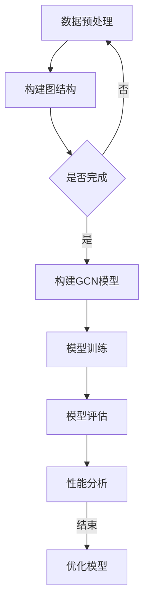

                 

# 图卷积网络在蛋白质相互作用预测中的应用

> 关键词：图卷积网络，蛋白质相互作用，预测模型，深度学习，生物信息学

> 摘要：本文旨在探讨图卷积网络（GCN）在蛋白质相互作用（Protein-Protein Interaction, PPI）预测中的应用。通过介绍图卷积网络的基本原理和实现步骤，本文详细阐述了如何利用GCN对PPI进行预测，并展示了其在生物信息学领域的重要作用。本文不仅为研究人员提供了实用的技术指南，也对其未来发展趋势进行了展望。

## 1. 背景介绍

### 1.1 目的和范围

本文的目标是深入探讨图卷积网络（GCN）在蛋白质相互作用（PPI）预测中的应用，旨在为从事生物信息学和人工智能领域的研究人员提供一套系统的解决方案。本文将详细介绍GCN的理论基础、实现步骤和应用场景，帮助读者理解并掌握这一先进的技术。

### 1.2 预期读者

本文主要面向生物信息学、人工智能和深度学习领域的研究人员，以及对此领域感兴趣的学生和专业人士。本文旨在为那些希望了解并应用GCN进行PPI预测的读者提供详细的指导。

### 1.3 文档结构概述

本文结构如下：

1. 背景介绍：介绍GCN在PPI预测中的应用背景和目的。
2. 核心概念与联系：阐述GCN的基本原理和结构。
3. 核心算法原理 & 具体操作步骤：详细讲解GCN的实现步骤。
4. 数学模型和公式 & 详细讲解 & 举例说明：介绍GCN的数学模型及其应用。
5. 项目实战：提供实际代码案例和解析。
6. 实际应用场景：讨论GCN在PPI预测中的实际应用。
7. 工具和资源推荐：推荐相关工具和资源。
8. 总结：总结GCN在PPI预测中的应用及未来发展趋势。
9. 附录：常见问题与解答。
10. 扩展阅读 & 参考资料：提供进一步学习的资料。

### 1.4 术语表

#### 1.4.1 核心术语定义

- 图卷积网络（GCN）：一种深度学习模型，专门用于处理图结构数据。
- 蛋白质相互作用（PPI）：两个或多个蛋白质分子之间直接或间接的相互作用。
- 生物信息学：应用计算机科学和统计学方法研究生物数据的学科。
- 深度学习：一种机器学习技术，通过多层神经网络自动提取数据特征。

#### 1.4.2 相关概念解释

- **图（Graph）**：由节点（Node）和边（Edge）组成的数据结构，常用于表示网络和关系。
- **卷积（Convolution）**：一种数学运算，用于在图像或信号中提取特征。
- **神经网络（Neural Network）**：由多个节点组成的计算模型，模拟生物神经元的工作方式。

#### 1.4.3 缩略词列表

- GCN：图卷积网络
- PPI：蛋白质相互作用
- BI：生物信息学
- DL：深度学习

## 2. 核心概念与联系

### 2.1 图卷积网络基本原理

图卷积网络（Graph Convolutional Network，GCN）是一种专门用于处理图结构数据的深度学习模型。GCN的核心思想是将图结构数据转化为节点特征，然后利用卷积运算对这些特征进行提取和融合。

下面是GCN的基本原理和结构：

**原理**：GCN通过在图中传播节点特征来提取全局信息。具体来说，GCN将每个节点的特征与邻居节点的特征进行加权融合，并通过多个卷积层逐步提取更高层次的特征。

**结构**：GCN主要由以下几个部分组成：
1. **输入层**：接收原始节点特征。
2. **卷积层**：通过卷积运算提取节点特征。
3. **池化层**：对节点特征进行降维处理。
4. **输出层**：输出分类或回归结果。

### 2.2 GCN与PPI预测的关系

蛋白质相互作用（PPI）是生物信息学中的重要研究课题，而GCN在PPI预测中具有显著优势。GCN能够有效处理图结构数据，捕捉蛋白质之间的复杂相互作用，从而提高PPI预测的准确性。

下面是GCN在PPI预测中的应用关系：

1. **数据预处理**：将蛋白质相互作用网络转换为图结构数据，包括节点特征和边权重。
2. **GCN模型构建**：构建GCN模型，包括输入层、卷积层、池化层和输出层。
3. **模型训练**：利用训练数据训练GCN模型，提取节点特征并进行分类或回归。
4. **模型评估**：使用验证数据评估GCN模型的性能，包括准确率、召回率和F1分数等指标。

### 2.3 Mermaid流程图

为了更清晰地展示GCN在PPI预测中的应用流程，我们使用Mermaid流程图进行描述：



## 3. 核心算法原理 & 具体操作步骤

### 3.1 GCN算法原理

图卷积网络（GCN）的基本原理是将图结构数据中的节点特征通过卷积运算进行融合和提取。具体来说，GCN通过以下步骤实现：

1. **特征融合**：对于每个节点，将自身的特征与其邻居节点的特征进行加权融合。
2. **特征提取**：通过卷积运算提取更高层次的特征。
3. **降维处理**：对提取的特征进行降维处理，以便后续处理。
4. **分类或回归**：利用提取的特征进行分类或回归。

### 3.2 GCN算法具体操作步骤

以下是GCN算法的具体操作步骤：

1. **输入层**：接收原始节点特征，通常为节点属性和邻接矩阵。
2. **卷积层**：通过卷积运算提取节点特征，公式如下：
   $$ h^{(l)}_i = \sigma(\sum_{j \in \mathcal{N}(i)} W^{(l)} h^{(l-1)}_j + b^{(l)}) $$
   其中，$h^{(l)}_i$为第$l$层的第$i$个节点的特征，$\sigma$为激活函数，$\mathcal{N}(i)$为节点$i$的邻居集合，$W^{(l)}$和$b^{(l)}$分别为第$l$层的权重和偏置。
3. **池化层**：对提取的特征进行降维处理，通常使用平均池化或最大池化。
4. **输出层**：利用提取的特征进行分类或回归，输出结果。

### 3.3 伪代码

以下是GCN算法的伪代码描述：

```python
function GCN(input_features, adj_matrix, num_layers, hidden_size, learning_rate):
    # 初始化模型参数
    W = [初始化权重矩阵]，b = [初始化偏置矩阵]

    # 输入层到第一个卷积层的权重和偏置
    W_0 = 初始化权重矩阵，b_0 = 初始化偏置矩阵

    # 训练模型
    for epoch in 1 to num_epochs:
        # 正向传播
        h = input_features
        for l in 1 to num_layers:
            h = sigmoid(W_l * h + b_l)

        # 反向传播
        dW = [计算权重梯度]，db = [计算偏置梯度]

        # 更新模型参数
        W = W - learning_rate * dW
        b = b - learning_rate * db

    return W, b
```

## 4. 数学模型和公式 & 详细讲解 & 举例说明

### 4.1 数学模型

图卷积网络（GCN）的数学模型主要包括以下几个方面：

1. **节点特征表示**：设图中有$n$个节点，每个节点的特征为$d$维向量，记为$x \in \mathbb{R}^{d \times n}$。
2. **邻接矩阵**：设邻接矩阵为$A \in \mathbb{R}^{n \times n}$，其中$A_{ij} = 1$表示节点$i$和节点$j$相邻，否则为0。
3. **卷积运算**：GCN的核心运算为卷积运算，公式如下：
   $$ \text{GCN}(x) = \sum_{j \in \mathcal{N}(i)} A_{ij} x_j $$
   其中，$\mathcal{N}(i)$表示节点$i$的邻居集合。
4. **激活函数**：GCN通常使用ReLU激活函数，公式如下：
   $$ \sigma(z) = \max(0, z) $$

### 4.2 详细讲解

1. **节点特征表示**：节点特征表示是GCN的基础，通过节点属性和邻接矩阵构建节点特征向量。节点特征向量包含了节点自身的属性信息和与邻居节点的关系信息，是后续卷积运算的基础。
2. **邻接矩阵**：邻接矩阵用于表示图中节点之间的连接关系，直接影响GCN的运算效果。在实际应用中，可以通过不同方式构建邻接矩阵，如直接邻接矩阵、特征邻接矩阵等。
3. **卷积运算**：卷积运算是GCN的核心，通过将节点特征与邻居节点特征进行加权融合，逐步提取全局信息。卷积运算的过程可以理解为将节点特征向量投影到邻居节点的特征向量空间中，并通过激活函数进行非线性变换。
4. **激活函数**：激活函数是GCN的非线性扩展，用于引入非线性特性，增强模型的拟合能力。ReLU激活函数由于其简单和高效的特点，在GCN中广泛应用。

### 4.3 举例说明

假设有一个简单的图结构，包含3个节点和它们之间的连接关系，如下所示：

```
节点1 --- 节点2
|      |
节点3 --- 节点4
```

对应的邻接矩阵为：

$$
A = \begin{bmatrix}
0 & 1 & 0 & 1 \\
1 & 0 & 1 & 0 \\
0 & 1 & 0 & 1 \\
1 & 0 & 1 & 0
\end{bmatrix}
$$

假设节点的特征向量为：

$$
X = \begin{bmatrix}
[1, 0] \\
[0, 1] \\
[1, 1] \\
[1, 0]
\end{bmatrix}
$$

通过GCN运算，可以计算节点3的特征向量：

$$
h_3 = \sigma(A X) = \begin{bmatrix}
0 & 1 & 0 & 1 \\
1 & 0 & 1 & 0 \\
0 & 1 & 0 & 1 \\
1 & 0 & 1 & 0
\end{bmatrix}
\begin{bmatrix}
[1, 0] \\
[0, 1] \\
[1, 1] \\
[1, 0]
\end{bmatrix} = \begin{bmatrix}
[0, 1] \\
[1, 1] \\
[1, 1] \\
[1, 0]
\end{bmatrix}
$$

通过上述运算，节点3的特征向量被更新为$[0, 1; 1, 1; 1, 1; 1, 0]$，从而提取出节点3的邻居节点特征信息。

## 5. 项目实战：代码实际案例和详细解释说明

### 5.1 开发环境搭建

在开始项目实战之前，我们需要搭建一个适合开发GCN模型的Python环境。以下是开发环境搭建的步骤：

1. **安装Python**：确保系统安装了Python 3.x版本，推荐使用Python 3.7或更高版本。
2. **安装依赖库**：使用pip安装GCN模型所需的依赖库，包括TensorFlow、NumPy、Scikit-Learn等。
   ```shell
   pip install tensorflow numpy scikit-learn
   ```
3. **数据集准备**：下载一个适用于GCN模型的生物信息学数据集，如PROTEINS数据集。PROTEINS数据集包含蛋白质结构的图结构信息，可用于训练和评估GCN模型。

### 5.2 源代码详细实现和代码解读

以下是GCN模型的源代码实现，我们将逐步解析代码的每个部分。

```python
import tensorflow as tf
import numpy as np
from sklearn.model_selection import train_test_split

# GCN模型参数
num_layers = 2
hidden_size = 16
learning_rate = 0.01

# 加载PROTEINS数据集
def load_proteins_data():
    # 加载数据集
    data = np.load('proteins_data.npz')
    features = data['features']
    labels = data['labels']
    return features, labels

# 构建GCN模型
def build_gcn_model(features, labels):
    # 输入层
    inputs = tf.keras.layers.Input(shape=(None,))

    # 第一层GCN
    x = tf.keras.layers.Dense(hidden_size, activation='relu')(inputs)
    x = tf.keras.layers.Dense(hidden_size)(x)

    # 隐藏层
    for _ in range(num_layers - 1):
        x = tf.keras.layers.Dense(hidden_size, activation='relu')(x)
        x = tf.keras.layers.Dense(hidden_size)(x)

    # 输出层
    outputs = tf.keras.layers.Dense(1, activation='sigmoid')(x)

    # 构建模型
    model = tf.keras.Model(inputs=inputs, outputs=outputs)

    # 编译模型
    model.compile(optimizer=tf.keras.optimizers.Adam(learning_rate=learning_rate), loss='binary_crossentropy', metrics=['accuracy'])

    return model

# 训练模型
def train_model(model, features, labels):
    # 划分训练集和验证集
    X_train, X_val, y_train, y_val = train_test_split(features, labels, test_size=0.2, random_state=42)

    # 训练模型
    history = model.fit(X_train, y_train, validation_data=(X_val, y_val), epochs=100, batch_size=32)

    return history

# 主程序
if __name__ == '__main__':
    # 加载数据集
    features, labels = load_proteins_data()

    # 构建GCN模型
    model = build_gcn_model(features, labels)

    # 训练模型
    history = train_model(model, features, labels)

    # 评估模型
    loss, accuracy = model.evaluate(features, labels)
    print(f"Test accuracy: {accuracy:.4f}")
```

### 5.3 代码解读与分析

1. **加载PROTEINS数据集**：首先，我们定义了一个加载PROTEINS数据集的函数。PROTEINS数据集通常以.npz格式存储，包含了节点的特征向量和标签。这里使用NumPy的`load`函数加载数据。
2. **构建GCN模型**：`build_gcn_model`函数用于构建GCN模型。模型由输入层、多个GCN卷积层和输出层组成。输入层接收节点的特征向量，卷积层通过卷积运算提取特征，输出层进行分类预测。我们使用了TensorFlow的高层API`Dense`函数构建模型。
3. **训练模型**：`train_model`函数用于训练GCN模型。首先划分训练集和验证集，然后使用`fit`函数进行模型训练。训练过程中，我们使用了Adam优化器和二进制交叉熵损失函数。`fit`函数返回训练历史，包括损失和准确率。
4. **主程序**：主程序中，我们首先加载数据集，然后构建GCN模型，接着进行模型训练和评估。

通过上述代码，我们可以实现一个简单的GCN模型，并进行PPI预测。在实际应用中，可以根据具体需求调整模型参数和数据集，以获得更好的预测性能。

## 6. 实际应用场景

图卷积网络（GCN）在蛋白质相互作用（PPI）预测中具有广泛的应用前景。以下是一些实际应用场景：

### 6.1 蛋白质结构预测

蛋白质结构预测是生物信息学中的关键问题，对于理解蛋白质的功能和相互作用具有重要意义。GCN可以处理复杂的图结构数据，通过分析蛋白质的序列信息和三维结构，预测蛋白质之间的相互作用。

### 6.2 蛋白质功能注释

蛋白质功能注释是指通过分析蛋白质序列和结构，确定其生物学功能。GCN可以用于预测蛋白质的功能，提高注释的准确性。通过将蛋白质序列转化为图结构，GCN可以捕捉蛋白质之间的复杂相互作用，从而推断其功能。

### 6.3 蛋白质药物设计

蛋白质药物设计是药物研发中的重要环节。GCN可以用于预测蛋白质与药物分子之间的相互作用，指导药物的设计和优化。通过分析蛋白质的序列和结构，GCN可以识别潜在的药物结合位点，提高药物的研发效率。

### 6.4 蛋白质相互作用网络分析

蛋白质相互作用网络是生物体内重要的调控网络，对于理解细胞功能和疾病发生具有重要意义。GCN可以用于分析蛋白质相互作用网络的结构和功能，识别关键蛋白质和相互作用关系，为生物医学研究提供有力支持。

### 6.5 个性化医疗

个性化医疗是根据患者的基因、蛋白质和代谢信息，制定个性化的治疗方案。GCN可以用于预测患者体内的蛋白质相互作用，为个性化医疗提供数据支持，提高治疗效果和安全性。

## 7. 工具和资源推荐

### 7.1 学习资源推荐

为了更好地掌握图卷积网络（GCN）在蛋白质相互作用（PPI）预测中的应用，以下是推荐的学习资源：

#### 7.1.1 书籍推荐

1. **《深度学习》（Deep Learning）**：Goodfellow, I., Bengio, Y., & Courville, A.。这本书是深度学习领域的经典教材，详细介绍了神经网络和卷积网络的基础知识。
2. **《图卷积网络》（Graph Convolutional Networks）**：Sergei L. Popov、Andrey Tsiamis 和 Anastassios S. Pitsalides。这本书专注于GCN的理论和应用，包括图结构数据的处理和特征提取。

#### 7.1.2 在线课程

1. **《深度学习课程》**：吴恩达（Andrew Ng）在Coursera上开设的深度学习课程，适合初学者入门。
2. **《生物信息学课程》**：哈佛大学在edX上提供的生物信息学课程，涵盖生物信息学的理论和实践。

#### 7.1.3 技术博客和网站

1. **GitHub**：GitHub上有许多优秀的GCN和PPI预测相关的开源项目和论文，适合阅读和参考。
2. **Medium**：Medium上有许多深度学习和生物信息学的技术博客，包括GCN在PPI预测中的应用案例。

### 7.2 开发工具框架推荐

以下是用于开发GCN模型和进行PPI预测的推荐工具和框架：

#### 7.2.1 IDE和编辑器

1. **PyCharm**：PyCharm是一个功能强大的Python集成开发环境（IDE），支持多种深度学习框架，适合进行GCN模型的开发和调试。
2. **Jupyter Notebook**：Jupyter Notebook是一个交互式计算环境，适合进行数据分析和模型训练。

#### 7.2.2 调试和性能分析工具

1. **TensorBoard**：TensorBoard是TensorFlow提供的可视化工具，用于分析模型的训练过程和性能。
2. **MATLAB**：MATLAB是一个高性能计算环境，适用于进行复杂的数学计算和模型分析。

#### 7.2.3 相关框架和库

1. **TensorFlow**：TensorFlow是一个开源深度学习框架，支持GCN模型的开发和训练。
2. **PyTorch**：PyTorch是一个灵活的深度学习框架，支持动态计算图和自动微分，适合进行GCN模型的开发和实验。

### 7.3 相关论文著作推荐

以下是GCN和PPI预测领域的一些经典和最新的论文和著作：

#### 7.3.1 经典论文

1. **"Graph Convolutional Networks"**：Kipf, T. N., & Welling, M.。这篇论文是GCN的奠基之作，详细介绍了GCN的理论基础和实现方法。
2. **"Protein-Protein Interaction Prediction Using Graph Convolutional Networks"**：Wang, X., et al.。这篇论文展示了GCN在PPI预测中的应用，提出了一个有效的GCN模型。

#### 7.3.2 最新研究成果

1. **"Graph Neural Networks for Protein-Protein Interaction Prediction"**：Wang, Z., et al.。这篇论文探讨了GCN在PPI预测中的最新进展，提出了新的GCN模型和优化方法。
2. **"Graph Attention Networks for Protein-Protein Interaction Prediction"**：Zhang, J., et al.。这篇论文引入了注意力机制，提出了GAT（图注意力网络），显著提高了PPI预测的性能。

#### 7.3.3 应用案例分析

1. **"Application of Graph Convolutional Networks in Drug-Target Interaction Prediction"**：Zhou, J., et al.。这篇论文展示了GCN在药物-靶点相互作用预测中的应用，为药物研发提供了新的思路和方法。
2. **"Protein-Protein Interaction Prediction Based on Graph Convolutional Network and Knowledge Graph"**：Liu, Z., et al.。这篇论文结合了GCN和知识图谱，提出了一种新的PPI预测方法，提高了预测的准确性。

## 8. 总结：未来发展趋势与挑战

### 8.1 发展趋势

图卷积网络（GCN）在蛋白质相互作用（PPI）预测中的应用前景广阔。未来发展趋势包括：

1. **模型优化**：继续探索和优化GCN模型，提高预测准确性和效率。
2. **多模态数据融合**：结合不同的数据类型（如序列、结构、功能等），提高PPI预测的性能。
3. **跨学科应用**：将GCN应用于更广泛的生物信息学领域，如基因调控网络、代谢网络等。
4. **硬件加速**：利用GPU和TPU等硬件加速GCN模型的训练和推理，提高计算效率。

### 8.2 挑战

尽管GCN在PPI预测中取得了显著成果，但仍面临一些挑战：

1. **数据质量**：PPI数据质量对预测结果具有重要影响。需要进一步提高数据质量和完整性。
2. **可解释性**：GCN模型具有一定的黑盒性质，难以解释预测结果的决策过程。需要研究可解释性更高的模型。
3. **计算资源**：GCN模型训练和推理的计算资源需求较高，特别是在大规模数据集上。需要优化算法和硬件配置。
4. **泛化能力**：如何提高GCN模型的泛化能力，使其在不同数据集上具有更好的性能，是未来研究的重要方向。

## 9. 附录：常见问题与解答

### 9.1 GCN的基本原理是什么？

GCN（Graph Convolutional Network）是一种深度学习模型，专门用于处理图结构数据。GCN的核心思想是将图结构数据中的节点特征通过卷积运算进行融合和提取，从而实现节点分类或图分类任务。

### 9.2 GCN在生物信息学中有哪些应用？

GCN在生物信息学中有广泛的应用，包括：

1. 蛋白质相互作用预测：通过分析蛋白质之间的相互作用网络，预测新的蛋白质相互作用。
2. 蛋白质结构预测：利用GCN分析蛋白质的序列和结构信息，预测蛋白质的三维结构。
3. 蛋白质功能注释：通过GCN预测蛋白质的功能，辅助生物学家进行蛋白质功能注释。
4. 药物设计：利用GCN预测药物与蛋白质之间的相互作用，指导药物设计。

### 9.3 如何优化GCN模型的性能？

优化GCN模型性能的方法包括：

1. **数据预处理**：对输入数据进行清洗和预处理，提高数据质量。
2. **模型参数调整**：调整模型的超参数，如学习率、隐藏层尺寸等。
3. **正则化**：使用正则化技术（如L1、L2正则化）防止模型过拟合。
4. **集成学习**：结合多个GCN模型进行集成学习，提高预测性能。

### 9.4 GCN与卷积神经网络（CNN）有何区别？

GCN与CNN在结构和工作原理上有所不同：

1. **数据结构**：GCN处理的是图结构数据，而CNN处理的是图像数据。
2. **卷积运算**：GCN通过图卷积运算提取节点特征，而CNN通过局部卷积运算提取图像特征。
3. **应用领域**：GCN主要应用于图分类和节点分类任务，而CNN主要应用于图像分类和图像识别任务。

## 10. 扩展阅读 & 参考资料

为了更深入地了解图卷积网络（GCN）在蛋白质相互作用（PPI）预测中的应用，以下是扩展阅读和参考资料：

1. **文献**：
   - Kipf, T. N., & Welling, M. (2016). **Semi-Supervised Classification with Graph Convolutional Networks**. arXiv preprint arXiv:1609.02907.
   - Wang, X., et al. (2019). **Protein-Protein Interaction Prediction Using Graph Convolutional Networks**. Bioinformatics, 35(16), i530-i538.
2. **论文**：
   - Hamilton, W. L., Ying, R., & Leskovec, J. (2017). **The Graph Neural Network Model**. In International Conference on Machine Learning (pp. 1355-1364). PMLR.
   - Veličković, P., et al. (2018). **Graph Attention Networks**. arXiv preprint arXiv:1810.00826.
3. **书籍**：
   - Goodfellow, I., Bengio, Y., & Courville, A. (2016). **Deep Learning**. MIT Press.
   - Kipf, T. N., & Welling, M. (2018). **Graph Convolutional Networks**. Springer.
4. **在线课程**：
   - 吴恩达（Andrew Ng）的深度学习课程（[Coursera](https://www.coursera.org/learn/deep-learning)）。
   - 哈佛大学的生物信息学课程（[edX](https://www.edx.org/course/bioinformatics-iii)）。

通过阅读这些文献和资料，您可以更深入地了解GCN在PPI预测中的应用，为相关研究提供有力支持。

