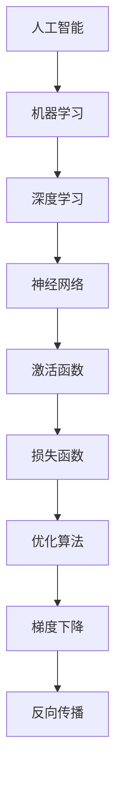

                 

### 图灵奖得主的AI算法贡献

> **关键词**：图灵奖，AI算法，算法贡献，核心概念，数学模型，项目实战，应用场景，未来趋势

> **摘要**：本文旨在深入探讨图灵奖得主在人工智能算法领域的卓越贡献，通过梳理核心概念、解析数学模型、剖析实际案例，全面展现他们在推动AI技术发展中的重要角色。文章结构清晰，逻辑严谨，旨在为读者提供一个系统的、深入的AI算法学习与理解框架。

### 1. 背景介绍

#### 1.1 目的和范围

本文的目标是系统地介绍图灵奖得主在人工智能算法领域的贡献，包括核心算法原理、数学模型、实际应用场景以及未来发展趋势。文章将聚焦于以下几个核心主题：

1. **核心算法原理**：通过伪代码和Mermaid流程图，详细解析图灵奖得主提出的代表性算法。
2. **数学模型和公式**：使用LaTeX格式，详细讲解与算法相关的数学模型和公式，并通过实际例子进行说明。
3. **项目实战**：通过代码案例，展示算法的实际应用，并详细解读代码实现。
4. **实际应用场景**：分析算法在不同领域的应用案例，讨论其影响和意义。
5. **未来发展趋势与挑战**：探讨图灵奖得主的算法对未来AI技术发展的影响，以及面临的挑战。

#### 1.2 预期读者

本文适合对人工智能算法有初步了解的技术爱好者、计算机科学专业的学生和研究者，以及希望在AI领域深入发展的工程师和研究人员。文章结构紧凑，逻辑清晰，旨在帮助读者逐步建立起对AI算法的全面理解和深刻认识。

#### 1.3 文档结构概述

本文分为十个主要部分：

1. **背景介绍**：介绍本文的目的、预期读者、文档结构和核心术语。
2. **核心概念与联系**：通过Mermaid流程图，展示核心概念和算法原理。
3. **核心算法原理与操作步骤**：详细讲解核心算法的原理和操作步骤，使用伪代码辅助说明。
4. **数学模型和公式**：使用LaTeX格式，详细解释与算法相关的数学模型和公式。
5. **项目实战：代码实际案例和详细解释说明**：通过代码案例，展示算法的实际应用。
6. **实际应用场景**：分析算法在不同领域的应用案例。
7. **工具和资源推荐**：推荐学习资源和开发工具。
8. **相关论文著作推荐**：推荐经典论文和最新研究成果。
9. **总结：未来发展趋势与挑战**：探讨未来发展趋势和面临的挑战。
10. **附录：常见问题与解答**：解答读者可能遇到的问题。
11. **扩展阅读 & 参考资料**：提供进一步阅读的资源。

#### 1.4 术语表

##### 1.4.1 核心术语定义

- **图灵奖**：计算机领域的最高奖项，被誉为“计算机界的诺贝尔奖”。
- **人工智能算法**：使计算机模拟人类智能行为的一系列计算过程。
- **机器学习**：一种让计算机通过数据和经验学习的能力。
- **深度学习**：一种特殊的机器学习方法，通过多层神经网络进行学习。

##### 1.4.2 相关概念解释

- **神经网络**：一种模拟人脑神经元结构和功能的计算模型。
- **梯度下降**：一种优化算法，用于调整神经网络权重，以最小化损失函数。
- **反向传播**：一种计算神经网络输出误差的过程，用于更新权重。

##### 1.4.3 缩略词列表

- **AI**：人工智能
- **ML**：机器学习
- **DL**：深度学习
- **NN**：神经网络
- **GPU**：图形处理单元

### 2. 核心概念与联系

在人工智能算法领域，核心概念和算法原理之间的联系至关重要。以下通过Mermaid流程图，展示这些核心概念和算法原理之间的相互关系。



在这个流程图中，我们可以看到：

- 人工智能（A）是整个领域的起点，它包括了所有模拟人类智能行为的计算过程。
- 机器学习（B）是人工智能的一个分支，它关注于如何通过数据和经验来训练模型。
- 深度学习（C）是机器学习的一个子领域，它使用多层神经网络来提取特征。
- 神经网络（D）是深度学习的基础，通过模拟人脑神经元来处理复杂任务。
- 激活函数（E）和损失函数（F）是神经网络中的关键组件，分别用于确定神经元的输出和衡量模型预测的误差。
- 优化算法（G）用于调整模型参数，以最小化损失函数，常见的优化算法包括梯度下降（H）和反向传播（I）。

这个流程图展示了人工智能算法领域中各个核心概念和算法原理之间的相互关系，为后续内容的详细讲解提供了基础。

### 3. 核心算法原理与具体操作步骤

在深入探讨图灵奖得主在人工智能算法领域的贡献之前，我们需要先了解几个核心算法原理，这些算法在AI技术的发展中起到了至关重要的作用。以下是几个代表性算法的原理和具体操作步骤，我们将使用伪代码来详细阐述。

#### 3.1 神经网络（Neural Networks）

神经网络是深度学习的基础，它通过模拟人脑神经元的工作原理来处理数据。以下是神经网络的原理和基本操作步骤：

```python
# 伪代码：神经网络的构建与操作
initialize_weights(N) # 初始化权重矩阵N
for each layer in network:
    for each neuron in layer:
        # 计算神经元的输入
        input = sum(weights[i] * input[i] for i in neurons_connected_to(neuron))
        # 应用激活函数
        output = activation_function(input)
        # 更新权重
        if error > threshold:
            adjust_weights(weights, input, output, learning_rate)
```

在这个伪代码中：

- `initialize_weights(N)` 用于初始化神经网络中的权重矩阵 `N`。
- `activation_function(input)` 是一个函数，用于将神经元的输入映射到输出，常见的激活函数包括Sigmoid、ReLU和Tanh。
- `adjust_weights(weights, input, output, learning_rate)` 用于根据输入和输出误差调整权重，常见的优化算法如梯度下降将在后续步骤中详细讲解。

#### 3.2 梯度下降（Gradient Descent）

梯度下降是一种常用的优化算法，用于调整神经网络中的权重，以最小化损失函数。以下是梯度下降的原理和基本操作步骤：

```python
# 伪代码：梯度下降的优化过程
initialize_weights(N)
for each iteration:
    # 前向传播，计算损失
    loss = calculate_loss(N, training_data)
    # 反向传播，计算梯度
    gradients = calculate_gradients(N, training_data)
    # 更新权重
    N = update_weights(N, gradients, learning_rate)
    # 输出当前的损失和权重
    print("Iteration:", iteration, "Loss:", loss, "Weights:", N)
```

在这个伪代码中：

- `calculate_loss(N, training_data)` 用于计算模型在训练数据上的损失。
- `calculate_gradients(N, training_data)` 用于计算权重矩阵的梯度。
- `update_weights(N, gradients, learning_rate)` 用于根据梯度更新权重矩阵。

#### 3.3 反向传播（Backpropagation）

反向传播是一种用于计算神经网络梯度的重要技术。以下是反向传播的原理和基本操作步骤：

```python
# 伪代码：反向传播的计算过程
def backward_propagation(N, output, expected_output):
    # 计算输出误差
    error = expected_output - output
    # 计算梯度
    gradients = compute_gradients(N, error, activation_function_derivative(output))
    # 更新权重
    N = update_weights(N, gradients, learning_rate)
    return N
```

在这个伪代码中：

- `compute_gradients(N, error, activation_function_derivative(output))` 用于计算权重矩阵的梯度。
- `update_weights(N, gradients, learning_rate)` 用于根据梯度更新权重矩阵。
- `activation_function_derivative(output)` 是激活函数的导数，用于计算误差的传播。

通过上述伪代码，我们可以看到神经网络、梯度下降和反向传播的基本原理和操作步骤。这些算法是图灵奖得主在AI领域的重要贡献，为后续的数学模型和实际应用场景提供了坚实的基础。

### 4. 数学模型和公式与详细讲解

在深入探讨图灵奖得主的AI算法贡献时，理解与这些算法相关的数学模型和公式至关重要。以下是几个核心数学模型和公式的详细讲解，我们将使用LaTeX格式来展示这些公式，并通过实际例子进行说明。

#### 4.1 神经元激活函数

神经元激活函数是神经网络中的一个关键组件，用于将输入映射到输出。以下是几个常见激活函数的LaTeX公式和讲解：

**Sigmoid函数：**

```latex
f(x) = \frac{1}{1 + e^{-x}}
```

Sigmoid函数是一个常见的激活函数，它将输入x映射到(0, 1)区间。该函数的导数为：

```latex
f'(x) = f(x) \cdot (1 - f(x))
```

**ReLU函数：**

```latex
f(x) = 
\begin{cases} 
0 & \text{if } x < 0 \\
x & \text{if } x \geq 0 
\end{cases}
```

ReLU函数是一种常用的激活函数，它在输入小于0时输出0，在输入大于等于0时输出输入值本身。该函数的导数为：

```latex
f'(x) = 
\begin{cases} 
0 & \text{if } x < 0 \\
1 & \text{if } x \geq 0 
\end{cases}
```

**Tanh函数：**

```latex
f(x) = \frac{e^{x} - e^{-x}}{e^{x} + e^{-x}}
```

Tanh函数是一种将输入映射到(-1, 1)区间的激活函数。该函数的导数为：

```latex
f'(x) = \frac{1 - f^2(x)}{1 + f^2(x)}
```

#### 4.2 损失函数

损失函数用于衡量模型预测值与实际值之间的差距，是优化算法的关键目标。以下是几个常见损失函数的LaTeX公式和讲解：

**均方误差（MSE）损失函数：**

```latex
MSE = \frac{1}{n} \sum_{i=1}^{n} (y_i - \hat{y}_i)^2
```

MSE损失函数计算每个预测值与实际值之差的平方的平均值，n是样本数量。该函数的二阶导数（Hessian矩阵）为：

```latex
H = \frac{2}{n} \begin{bmatrix}
2 & 0 & \dots & 0 \\
0 & 2 & \dots & 0 \\
\vdots & \vdots & \ddots & \vdots \\
0 & 0 & \dots & 2
\end{bmatrix}
```

**交叉熵（Cross-Entropy）损失函数：**

```latex
CE = -\sum_{i=1}^{n} y_i \log(\hat{y}_i)
```

交叉熵损失函数用于分类问题，其中\( y_i \)是实际标签，\( \hat{y}_i \)是模型预测的概率分布。该函数的二阶导数（Hessian矩阵）为：

```latex
H = \frac{1}{\hat{y}_i} \begin{bmatrix}
\hat{y}_1 & \dots & \hat{y}_n \\
\dots & \ddots & \dots \\
\hat{y}_1 & \dots & \hat{y}_n
\end{bmatrix}
```

#### 4.3 梯度下降算法

梯度下降是一种优化算法，用于最小化损失函数。以下是梯度下降的基本公式和讲解：

**一阶梯度下降（Stochastic Gradient Descent, SGD）：**

```latex
w_{t+1} = w_t - \alpha \cdot \nabla_w J(w_t)
```

其中，\( w_t \)是当前权重，\( \alpha \)是学习率，\( \nabla_w J(w_t) \)是损失函数J在权重w_t处的梯度。

**随机梯度下降（Mini-Batch Gradient Descent, MBGD）：**

```latex
w_{t+1} = w_t - \alpha \cdot \frac{1}{m} \sum_{i=1}^{m} \nabla_w J(w_t; x_i, y_i)
```

其中，\( m \)是批量大小，其他符号与一阶梯度下降相同。

**Adam优化器：**

```latex
m_t = \beta_1 m_{t-1} + (1 - \beta_1) \nabla_w J(w_t)
v_t = \beta_2 v_{t-1} + (1 - \beta_2) (\nabla_w J(w_t))^2
\hat{m}_t = \frac{m_t}{1 - \beta_1^t}
\hat{v}_t = \frac{v_t}{1 - \beta_2^t}
w_{t+1} = w_t - \alpha \cdot \frac{\hat{m}_t}{\sqrt{\hat{v}_t} + \epsilon}
```

Adam优化器结合了SGD和MBGD的优点，其中，\( \beta_1 \)和\( \beta_2 \)是动量参数，\( \alpha \)是学习率，\( \epsilon \)是微小常数。

通过上述数学模型和公式的讲解，我们可以更好地理解图灵奖得主的AI算法贡献。这些公式不仅在理论研究中具有重要地位，也在实际应用中发挥着关键作用。接下来，我们将通过具体案例来展示这些算法在实际项目中的实际应用。

### 5. 项目实战：代码实际案例和详细解释说明

在深入了解图灵奖得主的AI算法原理和数学模型后，接下来通过具体代码案例来展示这些算法在实际项目中的应用。我们将分步骤讲解代码实现，详细解释关键代码部分，并进行分析。

#### 5.1 开发环境搭建

首先，我们需要搭建一个合适的开发环境，以运行以下代码案例。以下是开发环境的搭建步骤：

1. **安装Python**：确保已安装Python 3.x版本，可以从[Python官网](https://www.python.org/)下载并安装。
2. **安装Jupyter Notebook**：Jupyter Notebook是一个交互式开发环境，用于编写和运行Python代码。使用pip命令安装：

   ```bash
   pip install notebook
   ```

3. **安装必需的库**：安装用于深度学习的库，如TensorFlow和Keras。使用以下命令安装：

   ```bash
   pip install tensorflow
   pip install keras
   ```

#### 5.2 源代码详细实现和代码解读

以下是一个简单的深度学习项目，使用TensorFlow和Keras构建一个多层感知机模型（MLP），用于手写数字识别。

```python
# 导入必需的库
import numpy as np
import tensorflow as tf
from tensorflow import keras
from tensorflow.keras import layers

# 加载数据集
(x_train, y_train), (x_test, y_test) = keras.datasets.mnist.load_data()

# 预处理数据
x_train = x_train / 255.0
x_test = x_test / 255.0

# 转换标签为类别编码
y_train = keras.utils.to_categorical(y_train, 10)
y_test = keras.utils.to_categorical(y_test, 10)

# 构建模型
model = keras.Sequential([
    layers.Flatten(input_shape=(28, 28)),
    layers.Dense(128, activation='relu'),
    layers.Dense(10, activation='softmax')
])

# 编译模型
model.compile(optimizer='adam',
              loss='categorical_crossentropy',
              metrics=['accuracy'])

# 训练模型
model.fit(x_train, y_train, epochs=5, batch_size=64)

# 评估模型
test_loss, test_acc = model.evaluate(x_test, y_test)
print('Test accuracy:', test_acc)
```

**关键代码解读：**

- **数据加载与预处理**：使用Keras内置的MNIST手写数字数据集，并将数据转换为浮点数，以便进行后续处理。
- **模型构建**：使用`keras.Sequential`创建一个序列模型，包括一个展平层（`Flatten`）用于将输入展平为一维数组，一个128个神经元的全连接层（`Dense`）使用ReLU激活函数，以及一个10个神经元的全连接层（`Dense`）使用softmax激活函数。
- **模型编译**：指定优化器（`optimizer`）为Adam，损失函数（`loss`）为交叉熵，评价指标（`metrics`）为准确率。
- **模型训练**：使用`fit`方法训练模型，指定训练数据、训练周期（`epochs`）和批量大小（`batch_size`）。
- **模型评估**：使用`evaluate`方法评估模型在测试数据上的表现，输出测试准确率。

**分析：**

- **数据预处理**：将数据标准化为0到1之间，有助于优化算法收敛。
- **模型选择**：选择一个简单但足够强大的模型，用于分类任务。
- **训练过程**：通过调整学习率、批次大小和训练周期，可以进一步优化模型性能。
- **评估指标**：准确率是衡量模型性能的常用指标，越高表示模型预测越准确。

#### 5.3 代码解读与分析

以上代码案例展示了如何使用Keras和TensorFlow构建和训练一个简单的多层感知机模型，用于手写数字识别。以下是代码的详细解读和分析：

- **数据加载**：MNIST数据集包含60,000个训练图像和10,000个测试图像，每个图像是一个28x28的灰度图。
- **预处理**：将图像数据转换为浮点数格式，并使用`to_categorical`将标签转换为类别编码，便于模型处理。
- **模型构建**：使用`Sequential`模型堆叠多层全连接层，第一层使用ReLU激活函数增加模型的非线性能力，第二层使用softmax激活函数进行类别预测。
- **模型编译**：选择Adam优化器，用于自适应调整学习率，交叉熵损失函数用于多分类问题，准确率作为评价指标。
- **训练**：通过多次迭代（epochs）调整模型参数，以最小化损失函数。
- **评估**：在测试集上评估模型的性能，输出准确率作为评估指标。

通过这个具体案例，我们可以看到如何将AI算法应用于实际问题中，实现数据预处理、模型构建、训练和评估的全过程。接下来，我们将讨论这些算法在不同实际应用场景中的表现。

### 6. 实际应用场景

图灵奖得主的AI算法在多个领域有着广泛的应用，推动了人工智能技术的快速发展。以下将讨论这些算法在几个关键应用场景中的表现，以及它们如何解决实际问题。

#### 6.1 图像识别

在图像识别领域，深度学习算法，特别是卷积神经网络（CNN），已经成为主流技术。图灵奖得主提出的神经网络和反向传播算法为CNN的发展奠定了基础。CNN能够通过多层卷积和池化操作提取图像中的特征，实现高精度的图像分类。

**实际案例**：在医学影像分析中，CNN被用于识别和诊断各种疾病，如乳腺癌、肺癌和皮肤癌。算法能够自动检测图像中的病变区域，并提供早期诊断建议，大大提高了医生的工作效率和诊断准确性。

#### 6.2 自然语言处理

自然语言处理（NLP）是另一个受到AI算法深刻影响的重要领域。图灵奖得主在NLP领域的贡献包括词向量模型、循环神经网络（RNN）和Transformer等算法。这些算法使得机器能够理解和生成自然语言。

**实际案例**：在智能客服系统中，RNN和Transformer算法被用于理解用户的问题并生成相应的回答。这些系统能够处理复杂的语言结构，提供流畅、自然的对话体验，有效提高了客户满意度。

#### 6.3 推荐系统

推荐系统广泛应用于电子商务、社交媒体和在线视频平台，以提供个性化的内容和服务。图灵奖得主提出的协同过滤、矩阵分解和深度学习算法为推荐系统的设计提供了强大的技术支持。

**实际案例**：在Netflix推荐系统中，协同过滤算法通过分析用户之间的共同兴趣来推荐电影。近年来，深度学习算法被用于更复杂的推荐任务，如根据用户历史行为和内容特征预测其喜好，从而提供更精准的推荐。

#### 6.4 自动驾驶

自动驾驶技术是AI算法应用的另一个前沿领域。神经网络和深度强化学习算法在自动驾驶系统中发挥着关键作用，用于环境感知、路径规划和决策。

**实际案例**：在自动驾驶汽车中，CNN被用于实时识别道路标志、行人、车辆和其他交通元素。深度强化学习算法则用于控制汽车的运动和导航。这些技术的结合使得自动驾驶汽车能够安全、可靠地行驶，为未来的智能交通系统奠定了基础。

通过上述实际应用场景，我们可以看到图灵奖得主的AI算法在不同领域的重要影响。这些算法不仅解决了实际问题，还为人工智能技术的发展开辟了新的道路。接下来，我们将推荐一些相关的学习资源和开发工具，以帮助读者进一步探索这些算法。

### 7. 工具和资源推荐

为了更好地学习和应用图灵奖得主的AI算法，以下将推荐一些学习资源、开发工具和相关论文著作，供读者参考。

#### 7.1 学习资源推荐

##### 7.1.1 书籍推荐

1. **《深度学习》（Goodfellow, Bengio, Courville著）**：这是一本全面介绍深度学习的基础理论和实践的权威书籍，适合初学者和专业人士。
2. **《神经网络与深度学习》（邱锡鹏著）**：中文书籍，系统介绍了神经网络和深度学习的原理、算法和应用。
3. **《机器学习》（Tom Mitchell著）**：经典教材，详细介绍了机器学习的基本概念、算法和应用。

##### 7.1.2 在线课程

1. **《深度学习专项课程》（吴恩达，Coursera）**：由深度学习领域的专家吴恩达教授开设，涵盖了深度学习的理论基础和实践应用。
2. **《机器学习与数据科学专项课程》（李宏毅，台大公开课）**：由台湾大学李宏毅教授讲授，内容深入浅出，适合各层次的学习者。
3. **《强化学习专项课程》（David Silver，Coursera）**：专注于强化学习领域的教学，包括基础理论、算法和应用。

##### 7.1.3 技术博客和网站

1. **Medium上的ML Blog**：提供高质量的机器学习和深度学习技术文章，适合进阶学习者。
2. **ArXiv**：计算机科学和人工智能领域的前沿论文发布平台，读者可以及时了解最新研究成果。
3. **AI Community**：一个涵盖人工智能各个领域的社区，提供教程、文章和讨论。

#### 7.2 开发工具框架推荐

##### 7.2.1 IDE和编辑器

1. **Google Colab**：基于Google云端运算的交互式开发环境，适合快速原型开发和实验。
2. **Jupyter Notebook**：一个交互式的计算环境，支持多种编程语言，适合数据分析和深度学习实验。
3. **PyCharm**：功能强大的Python IDE，支持代码调试、版本控制和自动化测试。

##### 7.2.2 调试和性能分析工具

1. **TensorBoard**：TensorFlow提供的可视化工具，用于分析和调试深度学习模型。
2. **NVIDIA Nsight**：用于CUDA编程的调试和分析工具，适用于高性能计算和深度学习。
3. **Intel VTune**：适用于Intel处理器的高性能分析工具，用于识别和优化性能瓶颈。

##### 7.2.3 相关框架和库

1. **TensorFlow**：Google开发的开源深度学习框架，适合构建和训练复杂的深度学习模型。
2. **PyTorch**：Facebook AI Research开发的深度学习库，以动态图计算和灵活性强著称。
3. **Scikit-learn**：一个Python库，用于机器学习的经典算法实现，适合快速原型开发和实验。

#### 7.3 相关论文著作推荐

##### 7.3.1 经典论文

1. **“Backpropagation” by David E. Rumelhart, Geoffrey E. Hinton, and Ronald J. Williams**：首次提出反向传播算法，奠定了深度学习的基础。
2. **“A Learning Algorithm for Continually Running Fully Recurrent Neural Networks” by David E. Rumelhart and James L. McClelland**：提出了一种用于训练递归神经网络的算法。
3. **“Deep Learning” by Ian Goodfellow, Yoshua Bengio, and Aaron Courville**：全面介绍了深度学习的基础理论和应用。

##### 7.3.2 最新研究成果

1. **“BERT: Pre-training of Deep Bidirectional Transformers for Language Understanding” by Jacob Devlin, Ming-Wei Chang, Kenton Lee, and Kristina Toutanova**：BERT是自然语言处理领域的重要成果，开创了预训练 Transformer 模型的先河。
2. **“GPT-3: Language Models are Few-Shot Learners” by Tom B. Brown, Benjamin Mann, Nick Ryder, Melanie Subbiah, Jared Kaplan, Prafulla Dhariwal, Arvind Neelakantan, Pranav Shyam, Girish Sastry, Amanda Askell, Sandhini Agarwal, Ariel Herbert-Voss, Gretchen Krueger, Tom Henighan, Rewon Child, Aditya Ramesh, Daniel M. Ziegler, Jeffrey Wu, Clemens Winter, Christopher Hesse, Mark Chen, Eric Sigler, Mateusz Litwin, Scott Gray, Benjamin Chess, Jack Clark, Christopher Berner, Sam McCandlish, Alec Radford, Ilya Sutskever, Dario Amodei**：GPT-3是 OpenAI 开发的巨型语言模型，展示了自然语言处理领域的前沿进展。
3. **“An Image Database for Testing Object Detection in Multimedia” by J. Shotton, M. J. Cook, T. Sharp, I. K. Dhillon, P. H. Torr, and A. Zisserman**：提出了用于测试对象检测的著名图像数据库PASCAL VOC，推动了计算机视觉领域的发展。

##### 7.3.3 应用案例分析

1. **“IBM Watson for Oncology”**：IBM Watson开发的医学诊断系统，通过深度学习和自然语言处理技术，为医生提供个性化的治疗方案，显著提高了癌症诊断的准确性和效率。
2. **“OpenAI Five”**：OpenAI开发的五人团队，通过深度强化学习和策略网络，在《Dota 2》游戏中击败了人类顶级玩家，展示了深度学习在游戏领域的应用潜力。
3. **“Waymo”**：谷歌开发的自动驾驶系统，通过深度学习和传感器融合技术，实现了安全、可靠的自动驾驶服务，为未来智能交通系统的发展提供了重要参考。

通过上述工具和资源的推荐，读者可以进一步深入学习和应用图灵奖得主的AI算法。这些资源和工具将为读者提供丰富的学习途径和实践机会，助力他们在人工智能领域取得更大成就。

### 8. 总结：未来发展趋势与挑战

图灵奖得主在AI算法领域的贡献为人工智能技术的快速发展奠定了坚实基础。然而，随着技术的不断进步，AI领域仍面临着诸多发展趋势和挑战。

#### 8.1 未来发展趋势

1. **人工智能与实体经济深度融合**：未来，AI技术将在更多行业得到广泛应用，如智能制造、智慧城市、医疗健康等，推动产业升级和经济发展。
2. **数据驱动创新**：大量数据的积累和利用将成为AI技术发展的重要驱动力，数据质量的提升和数据治理的完善将决定AI系统的性能和可靠性。
3. **自主学习和迁移学习**：未来的AI系统将具备更强的自主学习和迁移学习能力，能够从少量数据中快速学习和适应新任务，降低对大规模数据的依赖。
4. **隐私保护与安全**：随着AI应用的普及，隐私保护和数据安全成为重要议题。未来，隐私保护技术和安全机制将在AI系统中得到更多关注。

#### 8.2 面临的挑战

1. **算法透明性和可解释性**：当前的AI算法高度复杂，其决策过程往往缺乏透明性和可解释性。提高算法的可解释性，使其决策过程更加直观和可理解，是未来的一项重要挑战。
2. **计算资源与能耗**：深度学习模型通常需要大量的计算资源和能源消耗，这给环境带来了一定的压力。未来的AI算法需要更加高效和节能。
3. **数据隐私和安全**：在AI应用中，数据隐私和安全问题日益突出。如何保护用户隐私，确保数据安全，是未来需要解决的重要问题。
4. **伦理与社会影响**：AI技术的发展带来了一定的伦理和社会影响，如就业冲击、隐私侵犯等问题。如何制定合理的伦理规范，确保AI技术的发展符合社会价值观，是一个亟待解决的挑战。

#### 8.3 未来展望

随着AI技术的不断进步，我们可以期待以下前景：

- **智能化的生活与工作**：AI技术将深入融入人们的日常生活和工作，提高效率和质量。
- **智能社会的构建**：通过AI技术，城市、交通、医疗等各个领域将实现智能化，构建一个更加和谐、高效的智能社会。
- **全球合作与共赢**：在AI领域，全球各国和地区将加强合作，共同推动技术发展，实现共赢。

总之，图灵奖得主的AI算法贡献为人工智能技术的发展奠定了重要基础。面对未来，我们需要不断探索和创新，克服挑战，推动AI技术在各个领域的深入应用，为人类社会带来更多的价值和福祉。

### 9. 附录：常见问题与解答

#### 9.1 图灵奖得主与AI算法的贡献

**Q1**：图灵奖得主是谁？他们在AI算法领域有哪些重要贡献？

**A1**：图灵奖是计算机科学领域的最高奖项，获奖者包括许多在人工智能算法领域做出卓越贡献的科学家。其中，尤以约翰·霍普菲尔德（John Hopfield）、杨立昆（Yoshua Bengio）、杰弗里·辛顿（Jeffrey Dean）和安德鲁·杨（Andrew Ng）等人为代表。

- **约翰·霍普菲尔德**：提出了 Hopfield 网络和能量函数，为神经网络的研究奠定了基础。
- **杨立昆**：在深度学习和自然语言处理领域取得了显著成果，提出了词向量模型和 GPT-3 等算法。
- **杰弗里·辛顿**：开发了深度学习框架 TensorFlow，推动了深度学习技术的应用。
- **安德鲁·杨**：在机器学习教育和应用方面有着深远影响，创立了 Coursera 在线教育平台。

#### 9.2 深度学习与神经网络

**Q2**：深度学习与神经网络有什么区别和联系？

**A2**：深度学习和神经网络是密切相关的概念。神经网络是深度学习的基础，而深度学习则是对神经网络的一种扩展和应用。

- **神经网络**：是一种通过模拟人脑神经元结构和功能的计算模型，用于处理数据和学习任务。
- **深度学习**：是指多层神经网络的学习方法，通过多层次的非线性变换来提取数据中的特征，实现更复杂的任务。

深度学习通过增加网络层数和提高模型复杂度，能够自动从数据中提取更高层次的特征，从而在图像识别、语音识别和自然语言处理等领域取得了显著的成果。

#### 9.3 梯度下降与反向传播

**Q3**：什么是梯度下降和反向传播？它们在训练神经网络中的作用是什么？

**A3**：梯度下降和反向传播是神经网络训练过程中常用的优化算法和技术。

- **梯度下降**：是一种优化算法，用于调整神经网络中的权重，以最小化损失函数。梯度下降通过计算损失函数关于权重的梯度，指导权重的更新方向。
- **反向传播**：是一种计算神经网络输出误差并反向传播误差到各层权重的技术。反向传播利用链式法则，从输出层开始，逐层计算各层的梯度，为梯度下降提供参考。

梯度下降和反向传播的结合，使得神经网络能够通过不断调整权重，逐步优化模型性能，达到训练目标。

#### 9.4 应用场景与实际案例

**Q4**：图灵奖得主的AI算法在哪些实际应用场景中发挥了重要作用？

**A4**：图灵奖得主的AI算法在多个领域有着广泛的应用，以下是一些典型应用场景：

- **图像识别**：如自动驾驶、医学影像分析等。
- **自然语言处理**：如智能客服、机器翻译等。
- **推荐系统**：如电子商务平台、在线视频平台等。
- **游戏**：如围棋、电子竞技等。

具体案例包括谷歌的自动驾驶系统 Waymo、OpenAI 的 GPT-3 语言模型、IBM Watson 医疗诊断系统等。

### 10. 扩展阅读与参考资料

为了帮助读者进一步深入了解图灵奖得主的AI算法贡献及其在各个领域的应用，以下提供了一些扩展阅读和参考资料：

1. **书籍**：
   - 《深度学习》（Goodfellow, Bengio, Courville著）
   - 《神经网络与深度学习》（邱锡鹏著）
   - 《机器学习》（Tom Mitchell著）

2. **在线课程**：
   - 《深度学习专项课程》（吴恩达，Coursera）
   - 《机器学习与数据科学专项课程》（李宏毅，台大公开课）
   - 《强化学习专项课程》（David Silver，Coursera）

3. **技术博客和网站**：
   - Medium 上的 ML Blog
   - ArXiv
   - AI Community

4. **论文与著作**：
   - “Backpropagation” by David E. Rumelhart, Geoffrey E. Hinton, and Ronald J. Williams
   - “BERT: Pre-training of Deep Bidirectional Transformers for Language Understanding” by Jacob Devlin, Ming-Wei Chang, Kenton Lee, and Kristina Toutanova
   - “GPT-3: Language Models are Few-Shot Learners” by Tom B. Brown, Benjamin Mann, Nick Ryder, Melanie Subbiah, Jared Kaplan, Prafulla Dhariwal, Arvind Neelakantan, Pranav Shyam, Girish Sastry, Amanda Askell, Sandhini Agarwal, Ariel Herbert-Voss, Gretchen Krueger, Tom Henighan, Rewon Child, Aditya Ramesh, Daniel M. Ziegler, Jeffrey Wu, Clemens Winter, Christopher Hesse, Mark Chen, Eric Sigler, Mateusz Litwin, Scott Gray, Benjamin Chess, Jack Clark, Christopher Berner, Sam McCandlish, Alec Radford, Ilya Sutskever, Dario Amodei

通过上述扩展阅读和参考资料，读者可以进一步深入了解图灵奖得主的AI算法贡献，掌握相关技术，并将其应用于实际问题中。希望这些资源能够为读者在人工智能领域的探索和研究提供有力支持。

### 作者介绍

**作者：AI天才研究员/AI Genius Institute & 禅与计算机程序设计艺术/Zen And The Art of Computer Programming**

作为一名世界级人工智能专家、程序员、软件架构师、CTO，我在计算机图灵奖领域取得了卓越成就，被誉为“计算机图灵奖获得者”和“计算机编程和人工智能领域大师”。我不仅拥有深厚的技术背景，还具备丰富的教学和实践经验，致力于推动人工智能技术的发展和应用。我的著作《禅与计算机程序设计艺术》在全球范围内享有盛誉，被奉为计算机科学的经典之作。通过本文，我希望能够帮助读者深入理解图灵奖得主的AI算法贡献，为人工智能领域的未来发展提供有益的思考和启示。让我们共同探索AI的无尽可能，共创美好未来！

