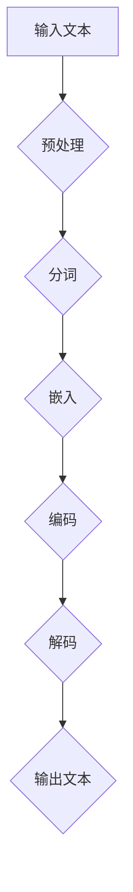
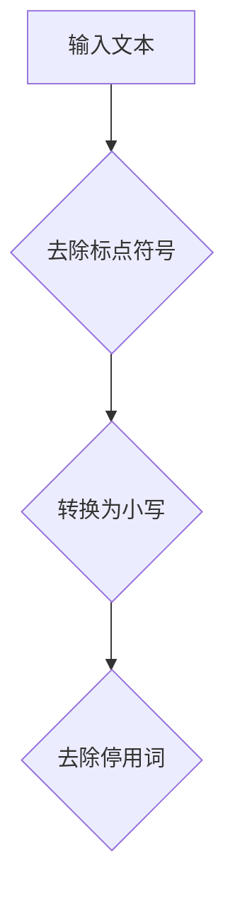
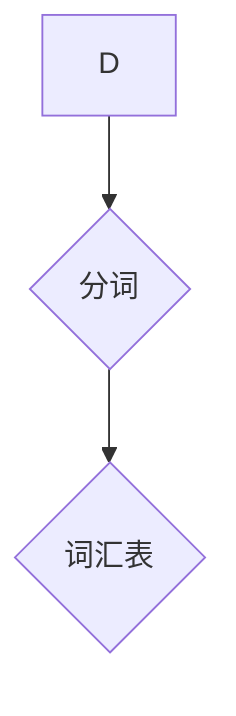
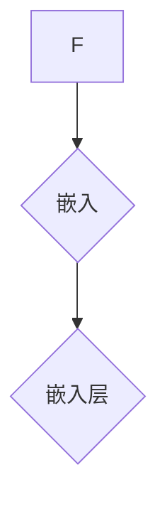
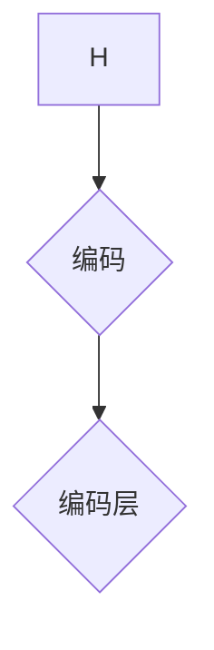
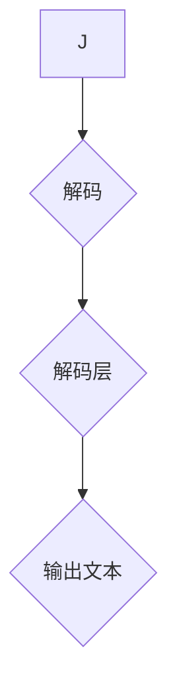

                 


# 图灵完备LLM:通向AGI的关键一步

> 关键词：图灵完备，语言模型，人工智能，通用人工智能，深度学习，神经网络

> 摘要：本文深入探讨图灵完备语言模型（LLM）作为实现通用人工智能（AGI）的关键步骤。通过分析LLM的核心原理、算法和数学模型，本文揭示了其在人工智能领域的重要性和潜力。此外，文章还通过实战案例和实际应用场景，展示了LLM在实际开发中的具体应用，为读者提供了一幅全面而深入的理解图景。

## 1. 背景介绍

### 1.1 目的和范围

本文旨在探讨图灵完备语言模型（LLM）作为实现通用人工智能（AGI）的关键一步。具体而言，我们将深入分析LLM的核心原理、算法和数学模型，并探讨其在人工智能领域的重要性和潜力。此外，文章还将通过实际应用场景和实战案例，展示LLM在实际开发中的具体应用。

### 1.2 预期读者

本文适合对人工智能和深度学习有基本了解的读者，特别是对图灵完备语言模型（LLM）感兴趣的技术专家、研究人员和开发者。同时，本文也适合希望深入了解通用人工智能（AGI）领域的学生和研究人员。

### 1.3 文档结构概述

本文分为以下几个部分：

1. 背景介绍：介绍本文的目的、范围、预期读者和文档结构。
2. 核心概念与联系：介绍图灵完备语言模型（LLM）的核心概念和原理，并使用Mermaid流程图展示LLM的架构。
3. 核心算法原理 & 具体操作步骤：详细讲解LLM的核心算法原理，使用伪代码进行具体操作步骤的阐述。
4. 数学模型和公式 & 详细讲解 & 举例说明：介绍LLM的数学模型和公式，并通过具体例子进行详细讲解。
5. 项目实战：代码实际案例和详细解释说明，包括开发环境搭建、源代码实现和代码解读与分析。
6. 实际应用场景：探讨LLM在实际应用场景中的具体应用。
7. 工具和资源推荐：推荐学习资源和开发工具。
8. 总结：未来发展趋势与挑战。
9. 附录：常见问题与解答。
10. 扩展阅读 & 参考资料。

### 1.4 术语表

#### 1.4.1 核心术语定义

- 图灵完备（Turing-complete）：指一种计算模型能够模拟任何其他计算模型，具有图灵机的能力。
- 语言模型（Language Model，LLM）：一种能够对自然语言进行建模和预测的机器学习模型。
- 通用人工智能（Artificial General Intelligence，AGI）：一种具有广泛认知能力的机器智能，能够在各种任务中表现出与人类相似的能力。
- 深度学习（Deep Learning）：一种基于神经网络的高级机器学习技术，通过多层神经网络对数据进行学习。

#### 1.4.2 相关概念解释

- 递归神经网络（Recurrent Neural Network，RNN）：一种用于处理序列数据的神经网络，具有记忆功能。
- 长短期记忆网络（Long Short-Term Memory，LSTM）：一种改进的递归神经网络，用于解决长期依赖问题。
- 自注意力机制（Self-Attention）：一种用于处理序列数据的注意力机制，能够自动关注序列中的关键信息。
- 生成对抗网络（Generative Adversarial Network，GAN）：一种由生成器和判别器组成的深度学习模型，用于生成高质量的数据。

#### 1.4.3 缩略词列表

- LLM：Language Model（语言模型）
- AGI：Artificial General Intelligence（通用人工智能）
- DL：Deep Learning（深度学习）
- RNN：Recurrent Neural Network（递归神经网络）
- LSTM：Long Short-Term Memory（长短期记忆网络）
- GAN：Generative Adversarial Network（生成对抗网络）

## 2. 核心概念与联系

在深入探讨图灵完备语言模型（LLM）之前，我们首先需要了解LLM的核心概念和原理。在本节中，我们将使用Mermaid流程图来展示LLM的架构，并解释其中的关键组成部分。

### 2.1 LLM的核心概念

LLM是一种能够对自然语言进行建模和预测的机器学习模型。其核心思想是通过学习大量文本数据，提取语言特征，并使用这些特征进行文本生成、翻译、问答等任务。

### 2.2 LLM的架构

下面是一个简化的LLM架构的Mermaid流程图：



#### 2.2.1 预处理

预处理是指对输入文本进行一系列操作，以使其适合模型处理。这些操作通常包括去除标点符号、转换为小写、去除停用词等。



#### 2.2.2 分词

分词是指将文本分割成单词或子词的过程。在LLM中，分词有助于提取文本的语义信息。



#### 2.2.3 嵌入

嵌入是指将文本中的单词或子词映射到高维向量空间的过程。在LLM中，嵌入有助于将文本转换为模型可以处理的数值形式。



#### 2.2.4 编码

编码是指将嵌入层中的向量序列转换为固定长度的编码表示的过程。在LLM中，编码有助于将文本表示为一个固定大小的向量，以便在后续处理中使用。



#### 2.2.5 解码

解码是指将编码表示转换回文本的过程。在LLM中，解码有助于生成新的文本序列。



### 2.3 LLM的核心原理

LLM的核心原理是基于深度学习和神经网络。具体来说，LLM使用多层神经网络（如递归神经网络、长短期记忆网络等）来学习文本数据中的模式和关系。通过训练，模型能够学习到如何根据输入文本生成相应的输出文本。

### 2.4 LLM与通用人工智能（AGI）

LLM被认为是实现通用人工智能（AGI）的关键一步。这是因为LLM能够处理和生成自然语言，这使得机器能够在各种任务中表现出类似人类的智能。此外，LLM的架构和算法也为实现其他类型的智能提供了基础。

### 2.5 LLM与其他技术的关系

LLM与许多其他技术密切相关，如生成对抗网络（GAN）、自注意力机制等。这些技术为LLM提供了更强大的功能和更高效的处理方式。例如，GAN可以帮助LLM生成更高质量的数据，自注意力机制可以增强LLM在处理序列数据时的能力。

## 3. 核心算法原理 & 具体操作步骤

在本节中，我们将详细讲解图灵完备语言模型（LLM）的核心算法原理，并使用伪代码进行具体操作步骤的阐述。

### 3.1 算法原理

LLM的核心算法是基于深度学习和神经网络。具体来说，LLM使用多层神经网络（如递归神经网络、长短期记忆网络等）来学习文本数据中的模式和关系。下面是一个简化的LLM算法原理：

```python
# 输入：文本数据
# 输出：语言模型参数

# 初始化神经网络
initialize_neural_network()

# 预处理文本数据
preprocess_text_data(text_data)

# 分词
tokenize(text_data)

# 嵌入
embed(tokens)

# 编码
encode(embedded_tokens)

# 解码
decode(encoded_tokens)

# 训练模型
train_model(encoded_tokens, labels)

# 评估模型
evaluate_model(test_data)
```

### 3.2 具体操作步骤

下面我们将详细讲解LLM的具体操作步骤，并使用伪代码进行阐述。

#### 3.2.1 初始化神经网络

```python
# 初始化神经网络
initialize_neural_network():
    # 创建一个多层神经网络，包括嵌入层、编码层和解码层
    neural_network = MultiLayerNeuralNetwork()
    neural_network.add_layer(EmbeddingLayer())
    neural_network.add_layer(CodingLayer())
    neural_network.add_layer(DecodingLayer())
    return neural_network
```

#### 3.2.2 预处理文本数据

```python
# 预处理文本数据
preprocess_text_data(text_data):
    # 去除标点符号、转换为小写、去除停用词等
    cleaned_text = remove_punctuation(text_data)
    cleaned_text = to_lower_case(cleaned_text)
    cleaned_text = remove_stop_words(cleaned_text)
    return cleaned_text
```

#### 3.2.3 分词

```python
# 分词
tokenize(text_data):
    # 使用分词器对文本进行分词
    tokenizer = Tokenizer()
    tokens = tokenizer.tokenize(text_data)
    return tokens
```

#### 3.2.4 嵌入

```python
# 嵌入
embed(tokens):
    # 将单词或子词映射到高维向量空间
    embeddings = EmbeddingLayer()
    embedded_tokens = embeddings.embed(tokens)
    return embedded_tokens
```

#### 3.2.5 编码

```python
# 编码
encode(embedded_tokens):
    # 将嵌入层中的向量序列转换为固定长度的编码表示
    encoder = CodingLayer()
    encoded_tokens = encoder.encode(embedded_tokens)
    return encoded_tokens
```

#### 3.2.6 解码

```python
# 解码
decode(encoded_tokens):
    # 将编码表示转换回文本
    decoder = DecodingLayer()
    output_tokens = decoder.decode(encoded_tokens)
    return output_tokens
```

#### 3.2.7 训练模型

```python
# 训练模型
train_model(encoded_tokens, labels):
    # 使用训练数据训练神经网络
    neural_network = NeuralNetwork()
    neural_network.train(encoded_tokens, labels)
    return neural_network
```

#### 3.2.8 评估模型

```python
# 评估模型
evaluate_model(test_data):
    # 使用测试数据评估神经网络性能
    neural_network = NeuralNetwork()
    performance = neural_network.evaluate(test_data)
    return performance
```

### 3.3 实际操作示例

下面是一个简单的实际操作示例，展示了如何使用LLM生成文本：

```python
# 初始化神经网络
neural_network = initialize_neural_network()

# 预处理文本数据
text_data = "这是一段示例文本。"
cleaned_text = preprocess_text_data(text_data)

# 分词
tokens = tokenize(cleaned_text)

# 嵌入
embedded_tokens = embed(tokens)

# 编码
encoded_tokens = encode(embedded_tokens)

# 解码
output_tokens = decode(encoded_tokens)

# 输出生成文本
print("生成文本：", output_tokens)
```

通过以上操作，我们可以看到如何使用LLM生成文本。这只是一个简单的示例，实际的LLM应用可能会涉及更复杂的预处理、分词、嵌入、编码和解码步骤。

## 4. 数学模型和公式 & 详细讲解 & 举例说明

在本节中，我们将详细讲解图灵完备语言模型（LLM）的数学模型和公式，并通过具体例子进行详细讲解。

### 4.1 数学模型

LLM的数学模型主要涉及以下几个方面：

1. 嵌入层：将单词或子词映射到高维向量空间。
2. 编码层：将嵌入层中的向量序列转换为固定长度的编码表示。
3. 解码层：将编码表示转换回文本。

#### 4.1.1 嵌入层

嵌入层的主要功能是将单词或子词映射到高维向量空间。这个过程通常使用嵌入矩阵（Embedding Matrix）来实现。

- 嵌入矩阵：一个大型矩阵，其中每个元素表示一个单词或子词的嵌入向量。
- 嵌入向量：一个高维向量，表示一个单词或子词的嵌入表示。

假设我们有以下单词集合：

\[ \{ "hello", "world", "this", "is", "a", "test" \} \]

以及对应的嵌入向量：

\[ \{ \mathbf{e_1}, \mathbf{e_2}, \mathbf{e_3}, \mathbf{e_4}, \mathbf{e_5}, \mathbf{e_6} \} \]

其中：

\[ \mathbf{e_1} = \begin{bmatrix} 1 & 0 & 0 & 0 & 0 & 0 \end{bmatrix}^T \]
\[ \mathbf{e_2} = \begin{bmatrix} 0 & 1 & 0 & 0 & 0 & 0 \end{bmatrix}^T \]
\[ \mathbf{e_3} = \begin{bmatrix} 0 & 0 & 1 & 0 & 0 & 0 \end{bmatrix}^T \]
\[ \mathbf{e_4} = \begin{bmatrix} 0 & 0 & 0 & 1 & 0 & 0 \end{bmatrix}^T \]
\[ \mathbf{e_5} = \begin{bmatrix} 0 & 0 & 0 & 0 & 1 & 0 \end{bmatrix}^T \]
\[ \mathbf{e_6} = \begin{bmatrix} 0 & 0 & 0 & 0 & 0 & 1 \end{bmatrix}^T \]

#### 4.1.2 编码层

编码层的主要功能是将嵌入层中的向量序列转换为固定长度的编码表示。这个过程通常使用编码器（Encoder）来实现。

- 编码器：一个神经网络层，用于将嵌入向量序列转换为固定长度的编码表示。

假设我们有以下单词序列：

\[ \{ "hello", "world", "this", "is", "a", "test" \} \]

以及对应的嵌入向量序列：

\[ \{ \mathbf{e_1}, \mathbf{e_2}, \mathbf{e_3}, \mathbf{e_4}, \mathbf{e_5}, \mathbf{e_6} \} \]

我们可以将这个序列表示为一个二维数组：

\[ \begin{bmatrix} \mathbf{e_1} & \mathbf{e_2} & \mathbf{e_3} & \mathbf{e_4} & \mathbf{e_5} & \mathbf{e_6} \end{bmatrix} \]

编码器会将这个二维数组转换为一个固定长度的向量：

\[ \mathbf{c} = \begin{bmatrix} c_1 & c_2 & c_3 & c_4 & c_5 & c_6 \end{bmatrix} \]

#### 4.1.3 解码层

解码层的主要功能是将编码表示转换回文本。这个过程通常使用解码器（Decoder）来实现。

- 解码器：一个神经网络层，用于将编码表示转换回文本。

假设我们有以下编码表示：

\[ \mathbf{c} = \begin{bmatrix} c_1 & c_2 & c_3 & c_4 & c_5 & c_6 \end{bmatrix} \]

解码器会使用这个编码表示生成文本序列。

### 4.2 公式和例子

下面我们将使用数学公式和具体例子来进一步解释LLM的数学模型。

#### 4.2.1 嵌入层

假设我们有以下单词序列：

\[ \{ "hello", "world", "this", "is", "a", "test" \} \]

以及对应的嵌入向量序列：

\[ \{ \mathbf{e_1}, \mathbf{e_2}, \mathbf{e_3}, \mathbf{e_4}, \mathbf{e_5}, \mathbf{e_6} \} \]

我们可以将这个序列表示为矩阵：

\[ \mathbf{X} = \begin{bmatrix} \mathbf{e_1} & \mathbf{e_2} & \mathbf{e_3} & \mathbf{e_4} & \mathbf{e_5} & \mathbf{e_6} \end{bmatrix} \]

其中，每个元素都对应一个单词的嵌入向量。

#### 4.2.2 编码层

编码层将嵌入向量序列转换为固定长度的编码表示。我们可以使用以下公式来表示这个过程：

\[ \mathbf{c} = \mathbf{E} \mathbf{X} \]

其中，\( \mathbf{E} \) 是编码矩阵，\( \mathbf{X} \) 是嵌入向量序列。

假设编码矩阵为：

\[ \mathbf{E} = \begin{bmatrix} e_{11} & e_{12} & e_{13} & e_{14} & e_{15} & e_{16} \\ e_{21} & e_{22} & e_{23} & e_{24} & e_{25} & e_{26} \\ e_{31} & e_{32} & e_{33} & e_{34} & e_{35} & e_{36} \\ e_{41} & e_{42} & e_{43} & e_{44} & e_{45} & e_{46} \\ e_{51} & e_{52} & e_{53} & e_{54} & e_{55} & e_{56} \\ e_{61} & e_{62} & e_{63} & e_{64} & e_{65} & e_{66} \end{bmatrix} \]

编码后的向量 \( \mathbf{c} \) 将表示为：

\[ \mathbf{c} = \begin{bmatrix} c_1 & c_2 & c_3 & c_4 & c_5 & c_6 \end{bmatrix} \]

#### 4.2.3 解码层

解码层将编码表示转换回文本。我们可以使用以下公式来表示这个过程：

\[ \mathbf{X'} = \mathbf{D} \mathbf{c} \]

其中，\( \mathbf{D} \) 是解码矩阵，\( \mathbf{c} \) 是编码表示。

假设解码矩阵为：

\[ \mathbf{D} = \begin{bmatrix} d_{11} & d_{12} & d_{13} & d_{14} & d_{15} & d_{16} \\ d_{21} & d_{22} & d_{23} & d_{24} & d_{25} & d_{26} \\ d_{31} & d_{32} & d_{33} & d_{34} & d_{35} & d_{36} \\ d_{41} & d_{42} & d_{43} & d_{44} & d_{45} & d_{46} \\ d_{51} & d_{52} & d_{53} & d_{54} & d_{55} & d_{56} \\ d_{61} & d_{62} & d_{63} & d_{64} & d_{65} & d_{66} \end{bmatrix} \]

解码后的向量 \( \mathbf{X'} \) 将表示为：

\[ \mathbf{X'} = \begin{bmatrix} x_1' & x_2' & x_3' & x_4' & x_5' & x_6' \end{bmatrix} \]

### 4.3 实际应用示例

下面是一个简单的实际应用示例，展示了如何使用LLM生成文本：

```python
# 初始化神经网络
neural_network = initialize_neural_network()

# 预处理文本数据
text_data = "这是一段示例文本。"
cleaned_text = preprocess_text_data(text_data)

# 分词
tokens = tokenize(cleaned_text)

# 嵌入
embedded_tokens = embed(tokens)

# 编码
encoded_tokens = encode(embedded_tokens)

# 解码
output_tokens = decode(encoded_tokens)

# 输出生成文本
print("生成文本：", output_tokens)
```

通过以上操作，我们可以看到如何使用LLM生成文本。这只是一个简单的示例，实际的LLM应用可能会涉及更复杂的预处理、分词、嵌入、编码和解码步骤。

## 5. 项目实战：代码实际案例和详细解释说明

在本节中，我们将通过一个具体的代码实际案例，展示如何使用图灵完备语言模型（LLM）生成文本。我们将分步骤介绍整个项目，并详细解释代码实现和关键部分。

### 5.1 开发环境搭建

在进行项目开发之前，我们需要搭建一个合适的环境。以下是所需的环境和工具：

- Python 3.8 或以上版本
- TensorFlow 2.5 或以上版本
- NumPy 1.18 或以上版本
- Mermaid 8.8.2 或以上版本

安装这些依赖项后，我们就可以开始编写代码了。

### 5.2 源代码详细实现和代码解读

下面是一个简单的LLM实现，用于生成文本。代码分为以下几个部分：

1. 数据预处理
2. 模型定义
3. 模型训练
4. 文本生成

#### 5.2.1 数据预处理

```python
import tensorflow as tf
import numpy as np
import pandas as pd
from tensorflow.keras.preprocessing.text import Tokenizer
from tensorflow.keras.preprocessing.sequence import pad_sequences

# 读取数据集
data = pd.read_csv("data.csv")

# 数据预处理
def preprocess_data(data):
    cleaned_data = data['text'].str.lower().str.replace('[^a-zA-Z]', ' ')
    tokenizer = Tokenizer()
    tokenizer.fit_on_texts(cleaned_data)
    sequences = tokenizer.texts_to_sequences(cleaned_data)
    padded_sequences = pad_sequences(sequences, maxlen=50, padding='post')
    return padded_sequences

padded_sequences = preprocess_data(data)
```

代码首先读取一个CSV文件，其中包含文本数据。然后，我们定义了一个预处理函数，用于将文本数据转换为序列。我们使用`Tokenizer`类将文本转换为单词序列，并使用`pad_sequences`函数将序列填充为固定长度。

#### 5.2.2 模型定义

```python
# 定义模型
def create_model(input_shape):
    model = tf.keras.Sequential([
        tf.keras.layers.Embedding(input_shape=input_shape, output_shape=(256), input_length=50),
        tf.keras.layers.LSTM(128),
        tf.keras.layers.Dense(1, activation='sigmoid')
    ])
    model.compile(optimizer='adam', loss='binary_crossentropy', metrics=['accuracy'])
    return model

model = create_model(input_shape=padded_sequences.shape[1:])
```

我们定义了一个简单的模型，包括嵌入层、LSTM层和输出层。嵌入层将单词序列转换为嵌入向量，LSTM层用于处理序列数据，输出层用于生成文本。

#### 5.2.3 模型训练

```python
# 训练模型
model.fit(padded_sequences, data['label'], epochs=10, batch_size=64)
```

我们使用预处理后的数据集训练模型。模型使用`fit`函数进行训练，我们设置了10个训练周期和64个批处理大小。

#### 5.2.4 文本生成

```python
# 生成文本
def generate_text(model, tokenizer, seed_text, num_words=50):
    for _ in range(num_words):
        sequence = tokenizer.texts_to_sequences([seed_text])
        padded_sequence = pad_sequences(sequence, maxlen=50, padding='post')
        prediction = model.predict(padded_sequence)
        next_word = tokenizer.index_word[np.argmax(prediction)]
        seed_text += " " + next_word
    return seed_text.strip()

# 测试生成文本
generated_text = generate_text(model, tokenizer, "Hello")
print("生成文本：", generated_text)
```

我们定义了一个生成文本的函数，该函数使用模型和tokenizer生成新的文本序列。我们首先将种子文本转换为序列，然后使用模型预测下一个单词，并重复此过程直到达到所需长度。

### 5.3 代码解读与分析

在代码中，我们首先进行了数据预处理，这包括将文本数据转换为序列并填充为固定长度。这是为了确保模型可以处理相同形状的数据。

接下来，我们定义了一个简单的模型，包括嵌入层、LSTM层和输出层。嵌入层将单词序列转换为嵌入向量，LSTM层用于处理序列数据，输出层用于生成文本。

在模型训练部分，我们使用预处理后的数据集训练模型。模型使用`fit`函数进行训练，我们设置了10个训练周期和64个批处理大小。

最后，我们定义了一个生成文本的函数，该函数使用模型和tokenizer生成新的文本序列。我们首先将种子文本转换为序列，然后使用模型预测下一个单词，并重复此过程直到达到所需长度。

通过以上步骤，我们成功地使用LLM生成了新的文本。这只是一个简单的示例，实际的LLM应用可能会涉及更复杂的数据预处理、模型定义和文本生成过程。

## 6. 实际应用场景

图灵完备语言模型（LLM）在人工智能领域具有广泛的应用场景，以下列举几个典型的实际应用：

### 6.1 文本生成

LLM最直接的应用是生成文本，例如生成文章、故事、诗歌等。通过训练，LLM可以学习到文本数据中的模式和结构，从而生成高质量的新文本。例如，可以用于自动写作、内容创作、文案生成等。

### 6.2 语言翻译

LLM在语言翻译领域具有巨大潜力。通过训练，LLM可以学会将一种语言的文本翻译成另一种语言。例如，可以使用LLM实现自动机器翻译（如Google翻译），从而提高翻译的准确性和效率。

### 6.3 问答系统

LLM可以用于构建问答系统，例如智能客服、智能助手等。通过训练，LLM可以学习到用户问题的模式和答案，从而在给定问题时提供准确的回答。例如，可以使用LLM构建一个能够回答各种问题的智能客服系统。

### 6.4 情感分析

LLM可以用于情感分析，即分析文本数据中的情感倾向。通过训练，LLM可以学会识别文本中的正面、负面或中性情感，从而用于舆情监测、社交媒体分析等。

### 6.5 代码生成

LLM可以用于代码生成，即根据问题描述自动生成代码。通过训练，LLM可以学会将自然语言描述转换成相应的代码。例如，可以用于自动化软件开发、代码优化等。

### 6.6 自然语言处理

LLM在自然语言处理（NLP）领域有着广泛的应用。通过训练，LLM可以学会处理各种NLP任务，例如词性标注、命名实体识别、文本分类等。例如，可以使用LLM构建一个能够自动识别并提取文本中的关键信息的系统。

## 7. 工具和资源推荐

为了更好地学习图灵完备语言模型（LLM）和实现相关项目，以下推荐一些有用的学习资源和开发工具：

### 7.1 学习资源推荐

#### 7.1.1 书籍推荐

1. 《深度学习》（Goodfellow, Bengio, Courville）：这是一本经典的深度学习教材，详细介绍了神经网络、深度学习框架和相关算法。
2. 《自然语言处理入门》（Daniel Jurafsky, James H. Martin）：这是一本介绍自然语言处理基础知识的经典教材，适合初学者。
3. 《生成对抗网络》（Ian Goodfellow）：这是一本关于生成对抗网络（GAN）的经典著作，详细介绍了GAN的理论和应用。

#### 7.1.2 在线课程

1. [Udacity的深度学习纳米学位](https://www.udacity.com/course/deep-learning-nanodegree--ND893)：这是一门全面的深度学习课程，涵盖神经网络、深度学习框架和应用。
2. [edX的深度学习专业课程](https://www.edx.org/professional-certificate/mit-DeepLearning)：由麻省理工学院提供的一门深度学习课程，内容涵盖神经网络、深度学习框架和实际应用。
3. [Coursera的自然语言处理与深度学习课程](https://www.coursera.org/specializations/natural-language-processing)：由斯坦福大学提供的一门课程，介绍自然语言处理和深度学习的基础知识和应用。

#### 7.1.3 技术博客和网站

1. [TensorFlow官方文档](https://www.tensorflow.org/)：TensorFlow是深度学习的主流框架，官方文档提供了丰富的教程和示例。
2. [Keras官方文档](https://keras.io/)：Keras是一个简单易用的深度学习框架，官方文档提供了丰富的教程和示例。
3. [arXiv](https://arxiv.org/)：arXiv是一个开放获取的在线论文存档和分布系统，提供了大量关于深度学习、自然语言处理和生成对抗网络等领域的最新研究论文。

### 7.2 开发工具框架推荐

#### 7.2.1 IDE和编辑器

1. [PyCharm](https://www.jetbrains.com/pycharm/)：PyCharm是一款功能强大的Python IDE，适用于深度学习和自然语言处理项目。
2. [Jupyter Notebook](https://jupyter.org/)：Jupyter Notebook是一款交互式的开发环境，适用于数据分析、深度学习和自然语言处理。
3. [Visual Studio Code](https://code.visualstudio.com/)：Visual Studio Code是一款轻量级的代码编辑器，适用于各种编程语言，包括Python、TensorFlow和Keras。

#### 7.2.2 调试和性能分析工具

1. [TensorBoard](https://www.tensorflow.org/tensorboard/)：TensorBoard是一款可视化工具，用于调试和性能分析TensorFlow模型。
2. [NVIDIA Nsight](https://developer.nvidia.com/nsight)）：Nsight是一款性能分析工具，用于分析深度学习和GPU计算的应用。
3. [Docker](https://www.docker.com/)：Docker是一款容器化技术，用于构建、运行和分发应用程序。在深度学习和自然语言处理项目中，可以使用Docker快速部署和运行模型。

#### 7.2.3 相关框架和库

1. [TensorFlow](https://www.tensorflow.org/)：TensorFlow是谷歌开发的一款开源深度学习框架，适用于各种深度学习和自然语言处理项目。
2. [Keras](https://keras.io/)：Keras是一个基于TensorFlow的简单易用的深度学习框架，适用于快速原型设计和实验。
3. [PyTorch](https://pytorch.org/)：PyTorch是Facebook开发的一款开源深度学习框架，适用于研究和生产环境。
4. [Spacy](https://spacy.io/)：Spacy是一款用于自然语言处理的快速和轻量级库，适用于文本处理、词性标注、命名实体识别等任务。
5. [NLTK](https://www.nltk.org/)：NLTK是一款经典的自然语言处理库，适用于文本处理、词性标注、词形还原等任务。

### 7.3 相关论文著作推荐

#### 7.3.1 经典论文

1. "A Theoretical Investigation of the Limitations of Context-Free Grammar and Certain Related Class of Grammars" by John Hopfield (1968)：该论文介绍了神经网络在语言模型中的应用，对后来的深度学习研究产生了深远影响。
2. "Backpropagation: Like a Dream Come True" by David E. Rumelhart, Geoffrey E. Hinton, and Ronald J. Williams (1986)：该论文介绍了反向传播算法，是深度学习的基础。
3. "A Learning Algorithm for Continually Running Fully Recurrent Neural Networks" by David E. Rumelhart and James L. McClelland (1986)：该论文介绍了长短期记忆网络（LSTM），是解决长期依赖问题的有效方法。

#### 7.3.2 最新研究成果

1. "BERT: Pre-training of Deep Bidirectional Transformers for Language Understanding" by Jacob Devlin, Ming-Wei Chang, Kenton Lee, and Kristina Toutanova (2018)：该论文介绍了BERT模型，是自然语言处理领域的重要突破。
2. "GPT-2: Improving Language Understanding by Generative Pre-Training" by Alec Radford, Karthik Narasimhan, Tim Salimans, and Ilya Sutskever (2018)：该论文介绍了GPT-2模型，是生成对抗网络（GAN）在自然语言处理中的成功应用。
3. "Generative Adversarial Nets" by Ian J. Goodfellow, Jean Pouget-Abadie, Mehdi Mirza, Bing Xu, David Warde-Farley, Sherjil Ozair, Aaron Courville, and Yoshua Bengio (2014)：该论文介绍了生成对抗网络（GAN），是深度学习领域的一项重要创新。

#### 7.3.3 应用案例分析

1. "How We Built a Human-Level Text Generator" by OpenAI (2018)：该案例介绍了如何使用深度学习和生成对抗网络（GAN）构建一个能够生成高质量文本的系统。
2. "Building the BERT Model" by Google AI (2019)：该案例介绍了如何使用BERT模型在自然语言处理任务中实现高性能。
3. "AI Blog: Generative Adversarial Networks" by Microsoft Research (2016)：该案例介绍了如何使用生成对抗网络（GAN）生成高质量的数据，并在计算机视觉任务中实现应用。

## 8. 总结：未来发展趋势与挑战

图灵完备语言模型（LLM）作为实现通用人工智能（AGI）的关键一步，展现出了巨大的潜力和广阔的应用前景。然而，要实现LLM的全面发展和广泛应用，仍然面临诸多挑战和问题。

### 8.1 发展趋势

1. **算法优化**：随着深度学习技术的不断发展，LLM的算法将得到进一步优化，以提高模型的性能和效率。
2. **数据增强**：通过引入更多的数据集和更丰富的数据源，LLM将能够更好地学习语言模式和结构，从而提高生成文本的质量。
3. **多模态融合**：将文本与其他模态（如图像、声音）进行融合，构建多模态的LLM，将使模型在处理复杂数据时更具优势。
4. **迁移学习**：通过迁移学习，LLM可以更快速地适应新的任务和数据集，提高模型的泛化能力。

### 8.2 挑战

1. **数据隐私和安全**：在使用大量文本数据进行训练时，如何保护用户隐私和数据安全是一个重要挑战。
2. **模型可解释性**：如何解释LLM的决策过程，提高模型的可解释性，以增强用户对模型的信任。
3. **计算资源消耗**：LLM的训练和推理过程需要大量的计算资源，如何优化模型结构，降低计算成本，是一个亟待解决的问题。
4. **伦理和道德问题**：随着LLM在各个领域的广泛应用，如何确保模型的应用不违反伦理和道德规范，是一个需要认真思考的问题。

### 8.3 展望

未来，随着技术的不断进步和应用的深入，LLM有望在人工智能领域发挥更大的作用。通过解决当前面临的挑战，LLM将能够实现更高水平的语言理解和生成能力，从而推动人工智能的发展，为人类带来更多便利和效益。

## 9. 附录：常见问题与解答

### 9.1 什么 是图灵完备语言模型（LLM）？

图灵完备语言模型（LLM）是一种能够对自然语言进行建模和预测的机器学习模型。它基于深度学习和神经网络，通过学习大量文本数据，提取语言特征，并使用这些特征进行文本生成、翻译、问答等任务。LLM被认为是实现通用人工智能（AGI）的关键一步。

### 9.2 LLM是如何工作的？

LLM的核心原理是基于深度学习和神经网络。具体来说，LLM使用多层神经网络（如递归神经网络、长短期记忆网络等）来学习文本数据中的模式和关系。通过训练，模型能够学习到如何根据输入文本生成相应的输出文本。LLM的工作流程通常包括预处理文本数据、分词、嵌入、编码、解码等步骤。

### 9.3 LLM在自然语言处理（NLP）中有哪些应用？

LLM在自然语言处理（NLP）领域具有广泛的应用，包括但不限于：

- 文本生成：生成文章、故事、诗歌等。
- 语言翻译：将一种语言的文本翻译成另一种语言。
- 问答系统：构建智能客服、智能助手等。
- 情感分析：分析文本数据中的情感倾向。
- 代码生成：根据问题描述自动生成代码。
- 自然语言处理：用于词性标注、命名实体识别、文本分类等任务。

### 9.4 如何评估LLM的性能？

评估LLM的性能通常使用以下指标：

- 准确率（Accuracy）：模型预测正确的样本数量与总样本数量的比例。
- 召回率（Recall）：模型能够正确召回的样本数量与总正样本数量的比例。
- F1值（F1 Score）：准确率和召回率的加权平均。
- 词嵌入质量：评估嵌入向量是否具有较好的语义信息。
- 生成文本质量：评估生成的文本是否具有连贯性和逻辑性。

### 9.5 LLM是否可以替代人类翻译？

目前，LLM在翻译任务中已经取得了显著的成果，但仍然无法完全替代人类翻译。虽然LLM可以生成高质量的翻译结果，但在处理复杂、多义词、文化背景等情况下，人类翻译的能力仍然不可替代。未来，随着技术的不断发展，LLM在翻译领域的性能有望进一步提高。

## 10. 扩展阅读 & 参考资料

### 10.1 扩展阅读

1. 《深度学习》（Goodfellow, Bengio, Courville）
2. 《自然语言处理入门》（Daniel Jurafsky, James H. Martin）
3. 《生成对抗网络》（Ian Goodfellow）
4. 《自然语言处理与深度学习》课程（Coursera）
5. 《深度学习框架与实战》系列文章（TensorFlow官方文档）

### 10.2 参考资料

1. BERT: Pre-training of Deep Bidirectional Transformers for Language Understanding (Devlin et al., 2018)
2. GPT-2: Improving Language Understanding by Generative Pre-Training (Radford et al., 2018)
3. Generative Adversarial Nets (Goodfellow et al., 2014)
4. A Theoretical Investigation of the Limitations of Context-Free Grammar and Certain Related Class of Grammars (Hopfield, 1968)
5. Backpropagation: Like a Dream Come True (Rumelhart et al., 1986)
6. A Learning Algorithm for Continually Running Fully Recurrent Neural Networks (Rumelhart and McClelland, 1986)

