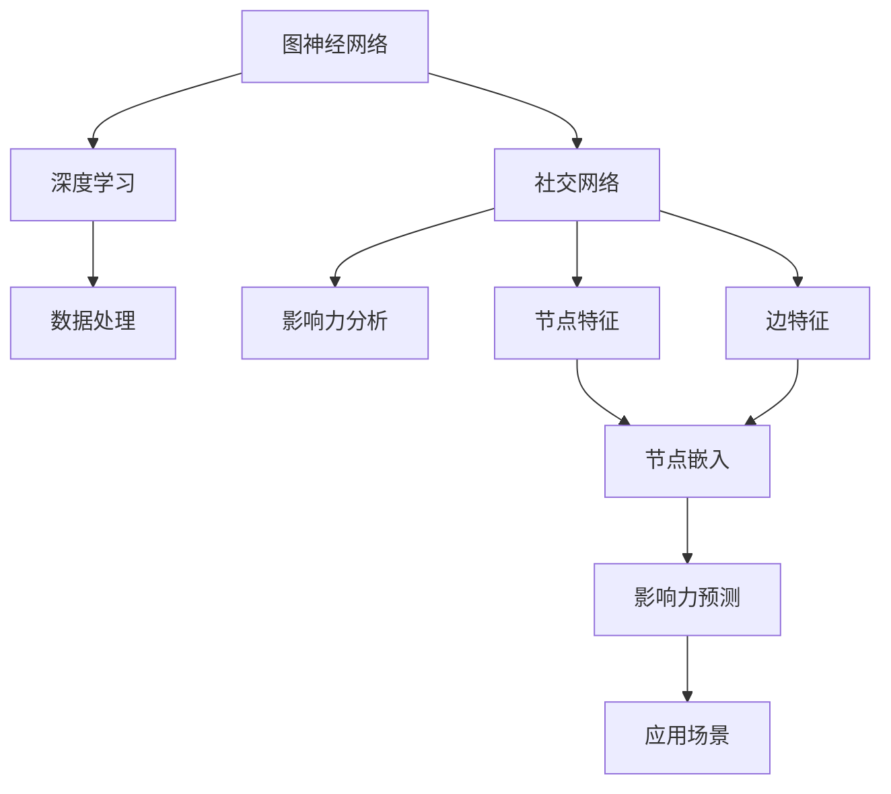

                 

# 图神经网络在社交网络影响力分析中的应用

> 关键词：图神经网络，社交网络，影响力分析，算法原理，数学模型，实际应用

> 摘要：本文深入探讨了图神经网络在社交网络影响力分析中的应用，从核心概念、算法原理、数学模型到项目实战进行了全面剖析。通过本文，读者将了解图神经网络的基本原理、在社交网络分析中的具体应用，以及如何利用图神经网络进行影响力分析。同时，本文还推荐了一系列相关学习资源和开发工具，以帮助读者进一步深入了解和掌握该领域知识。

## 1. 背景介绍

### 1.1 目的和范围

本文旨在系统地介绍和探讨图神经网络（Graph Neural Network, GNN）在社交网络影响力分析中的应用。随着互联网和社交网络的快速发展，社交网络数据量呈爆炸式增长，影响力分析成为研究热点。图神经网络作为一种强大的图结构数据处理工具，为社交网络影响力分析提供了新的方法和思路。

本文将围绕以下内容展开：

1. 图神经网络的基本概念和核心原理；
2. 图神经网络在社交网络影响力分析中的应用场景和具体操作步骤；
3. 相关数学模型和公式讲解；
4. 实际应用场景的代码案例和详细解释；
5. 工具和资源的推荐；
6. 未来发展趋势与挑战。

### 1.2 预期读者

本文适合以下读者群体：

1. 计算机科学和人工智能领域的研究人员；
2. 想要了解图神经网络和社交网络影响力分析的相关从业者；
3. 对图神经网络在社交网络影响力分析应用感兴趣的学者和学生。

### 1.3 文档结构概述

本文分为十个部分，结构如下：

1. 背景介绍：本文的目的、范围、预期读者、文档结构等；
2. 核心概念与联系：图神经网络和社交网络的相关概念和原理；
3. 核心算法原理 & 具体操作步骤：图神经网络的算法原理和具体操作步骤；
4. 数学模型和公式 & 详细讲解 & 举例说明：图神经网络的数学模型和公式讲解及实例；
5. 项目实战：代码实际案例和详细解释说明；
6. 实际应用场景：图神经网络在社交网络影响力分析中的实际应用；
7. 工具和资源推荐：学习资源、开发工具和框架的推荐；
8. 总结：未来发展趋势与挑战；
9. 附录：常见问题与解答；
10. 扩展阅读 & 参考资料：相关论文、书籍和技术博客的推荐。

### 1.4 术语表

#### 1.4.1 核心术语定义

- 图神经网络（Graph Neural Network, GNN）：一种基于图结构的深度学习模型，用于处理图结构数据。
- 社交网络（Social Network）：由个体及其关系构成的复杂网络结构。
- 影响力分析（Influence Analysis）：研究社交网络中个体对其他个体产生影响的程度和方式。
- 节点（Node）：图中的基本元素，代表社交网络中的个体。
- 边（Edge）：连接两个节点的线，代表个体之间的关系。

#### 1.4.2 相关概念解释

- 深度学习（Deep Learning）：一种基于多层神经网络的人工智能技术，通过学习大量数据来提取特征和规律。
- 节点特征（Node Feature）：描述节点的属性和特征，如年龄、性别、职业等。
- 边特征（Edge Feature）：描述边所代表关系的属性和特征，如好友关系、共同兴趣等。
- 邻域（Neighborhood）：与节点直接相连的节点集合。

#### 1.4.3 缩略词列表

- GNN：Graph Neural Network（图神经网络）
- SNA：Social Network Analysis（社交网络分析）
- CNN：Convolutional Neural Network（卷积神经网络）
- RNN：Recurrent Neural Network（循环神经网络）

## 2. 核心概念与联系

在探讨图神经网络在社交网络影响力分析中的应用之前，我们需要了解一些核心概念和它们之间的关系。以下是一个简化的 Mermaid 流程图，展示图神经网络、社交网络和影响力分析之间的联系。



### 2.1 图神经网络的基本概念

图神经网络是一种基于图结构的深度学习模型，其目的是从图中学习节点和边的特征，并通过这些特征进行节点分类、链接预测、社区检测等任务。图神经网络的核心思想是通过神经网络的传递函数，将节点的特征和其邻域节点的特征进行整合，从而得到新的特征表示。

### 2.2 社交网络的基本概念

社交网络是由个体（节点）及其关系（边）构成的复杂网络结构。在社交网络中，个体可以通过不同的方式（如好友关系、共同兴趣、地理位置等）相互连接。社交网络的影响力分析旨在研究个体对其他个体产生影响的程度和方式，以及这种影响力在社交网络中的传播和演变。

### 2.3 影响力分析的基本概念

影响力分析是研究社交网络中个体对其他个体产生影响的程度和方式的一种方法。影响力分析可以帮助我们了解社交网络中的关键节点、意见领袖、传播路径等，从而为社交网络营销、危机管理、舆论引导等提供有力支持。

### 2.4 节点特征和边特征

节点特征和边特征是图神经网络中的基本元素。节点特征描述节点的属性和特征，如年龄、性别、职业、兴趣爱好等；边特征描述边所代表关系的属性和特征，如好友关系、共同兴趣、互动频率等。通过学习和整合节点特征和边特征，图神经网络可以更好地理解社交网络的拓扑结构和信息传播机制。

### 2.5 节点嵌入和影响力预测

节点嵌入是将节点特征映射到低维空间的过程，其目的是使相似节点在低维空间中距离更近。通过节点嵌入，我们可以更好地理解和分析社交网络中的节点关系和影响力传播。影响力预测是基于节点嵌入结果，通过机器学习算法预测节点对其他节点的影响力和影响力传播路径。

## 3. 核心算法原理 & 具体操作步骤

图神经网络（GNN）是一种基于图结构的深度学习模型，其核心思想是通过迭代的方式，将节点的特征和其邻域节点的特征进行整合，从而得到新的特征表示。以下将介绍图神经网络的基本原理和具体操作步骤。

### 3.1 GNN的基本原理

GNN通过以下步骤进行特征整合：

1. **初始化节点特征**：给定一个图 \( G = (V, E) \)，其中 \( V \) 是节点集合，\( E \) 是边集合，初始化每个节点的特征向量 \( h_i^0 \in \mathbb{R}^d \)，其中 \( d \) 是特征维度。
2. **定义邻域聚合函数**：邻域聚合函数用于整合节点的特征和其邻域节点的特征。常见的邻域聚合函数有平均聚合和求和聚合。
3. **定义更新函数**：更新函数用于更新节点的特征向量。常见的更新函数有全连接神经网络（FCNN）和门控循环单元（GRU）。
4. **迭代更新节点特征**：通过迭代邻域聚合函数和更新函数，逐步更新每个节点的特征向量。

### 3.2 GNN的具体操作步骤

以下是一个简单的 GNN 操作步骤伪代码：

```python
# 初始化节点特征
h = initialize_node_features(num_nodes, dim)

# 设置迭代次数
num_iterations = 10

# 迭代更新节点特征
for i in range(num_iterations):
    # 邻域聚合
    h = neighbor_aggregation(h, graph)

    # 更新节点特征
    h = update_node_features(h, graph)

# 得到最终节点特征
final_h = h
```

### 3.3 邻域聚合函数和更新函数的选择

邻域聚合函数和更新函数的选择取决于具体的任务和数据。以下是一些常见的邻域聚合函数和更新函数：

1. **平均聚合**：将邻域节点的特征向量求平均。
    ```python
    def average_aggregation(h, neighbors):
        return (1 / len(neighbors)) * sum([h[j] for j in neighbors])
    ```

2. **求和聚合**：将邻域节点的特征向量求和。
    ```python
    def sum_aggregation(h, neighbors):
        return sum([h[j] for j in neighbors])
    ```

3. **全连接神经网络（FCNN）**：使用全连接神经网络进行特征整合。
    ```python
    def fcnn_aggregation(h, neighbors):
        inputs = [h[j] for j in neighbors]
        return neural_network(inputs)
    ```

4. **门控循环单元（GRU）**：使用门控循环单元进行特征整合。
    ```python
    def gru_aggregation(h, neighbors):
        inputs = [h[j] for j in neighbors]
        return gru(inputs)
    ```

### 3.4 GNN的应用示例

以下是一个简单的 GNN 应用示例，用于社交网络影响力分析。

1. **数据预处理**：将社交网络数据转换为图结构，并提取节点特征和边特征。
2. **初始化节点特征**：初始化每个节点的特征向量。
3. **定义邻域聚合函数和更新函数**：选择合适的邻域聚合函数和更新函数。
4. **迭代更新节点特征**：通过迭代更新节点特征向量。
5. **影响力预测**：利用更新后的节点特征进行影响力预测。

```python
# 社交网络影响力分析
def influence_analysis(graph, node_features):
    # 初始化节点特征
    h = initialize_node_features(node_features)

    # 设置迭代次数
    num_iterations = 10

    # 迭代更新节点特征
    for i in range(num_iterations):
        # 邻域聚合
        h = neighbor_aggregation(h, graph)

        # 更新节点特征
        h = update_node_features(h, graph)

    # 得到最终节点特征
    final_h = h

    # 影响力预测
    influence_scores = predict_influence(final_h, graph)

    return influence_scores
```

## 4. 数学模型和公式 & 详细讲解 & 举例说明

### 4.1 GNN的数学模型

图神经网络（GNN）的核心在于如何将节点的特征与邻域节点的特征进行整合，并通过迭代的方式不断优化节点特征表示。在数学上，GNN可以表示为一个迭代的过程，其公式如下：

\[ h_i^{(t+1)} = \text{Aggregation}(h_i^{(t)}, \{h_j^{(t)}\}_{j \in \mathcal{N}(i)}) + \text{Update}(h_i^{(t)}) \]

其中：

- \( h_i^{(t)} \) 表示第 \( i \) 个节点在第 \( t \) 次迭代后的特征向量；
- \( \mathcal{N}(i) \) 表示第 \( i \) 个节点的邻域节点集合；
- \( \text{Aggregation} \) 表示邻域聚合函数，用于整合邻域节点的特征；
- \( \text{Update} \) 表示更新函数，用于对节点特征进行优化。

### 4.2 邻域聚合函数

邻域聚合函数是GNN的核心组成部分，常见的聚合函数包括：

1. **平均聚合**：

\[ \text{Average Aggregation}(h_i^{(t)}, \{h_j^{(t)}\}_{j \in \mathcal{N}(i)}) = \frac{1}{|\mathcal{N}(i)|} \sum_{j \in \mathcal{N}(i)} h_j^{(t)} \]

2. **求和聚合**：

\[ \text{Sum Aggregation}(h_i^{(t)}, \{h_j^{(t)}\}_{j \in \mathcal{N}(i)}) = \sum_{j \in \mathcal{N}(i)} h_j^{(t)} \]

3. **点积聚合**：

\[ \text{Dot Product Aggregation}(h_i^{(t)}, \{h_j^{(t)}\}_{j \in \mathcal{N}(i)}) = \sum_{j \in \mathcal{N}(i)} h_j^{(t)} \cdot w_j \]

其中，\( w_j \) 是邻接权重。

### 4.3 更新函数

更新函数用于对节点的特征进行优化，常见的方法包括：

1. **全连接神经网络（FCNN）**：

\[ h_i^{(t+1)} = \text{ReLU}(\text{FCNN}(h_i^{(t)}, \{h_j^{(t)}\}_{j \in \mathcal{N}(i)})) \]

2. **门控循环单元（GRU）**：

\[ h_i^{(t+1)} = \text{GRU}(h_i^{(t)}, \{h_j^{(t)}\}_{j \in \mathcal{N}(i)}) \]

3. **变换器（Transformer）**：

\[ h_i^{(t+1)} = \text{Transformer}(h_i^{(t)}, \{h_j^{(t)}\}_{j \in \mathcal{N}(i)}) \]

### 4.4 举例说明

假设有一个简单的图结构，包含三个节点 \( v_1, v_2, v_3 \)，它们分别有特征向量 \( h_{v_1} = [1, 2, 3] \)，\( h_{v_2} = [4, 5, 6] \)，\( h_{v_3} = [7, 8, 9] \)。邻域节点集合为 \( \mathcal{N}(v_1) = \{v_2, v_3\} \)，\( \mathcal{N}(v_2) = \{v_1\} \)，\( \mathcal{N}(v_3) = \{v_1\} \)。

使用平均聚合函数和全连接神经网络（FCNN）进行特征整合和更新。

1. **第一步迭代**：

\[ h_{v_1}^{(1)} = \text{Average Aggregation}(h_{v_1}^{(0)}, \{h_{v_2}^{(0)}, h_{v_3}^{(0)}\}) + \text{ReLU}(\text{FCNN}(h_{v_1}^{(0)}, \{h_{v_2}^{(0)}, h_{v_3}^{(0)}\})) \]

\[ h_{v_1}^{(1)} = \frac{1}{2}([1, 2, 3] + [4, 5, 6]) + \text{ReLU}([1, 2, 3] + [4, 5, 6]) \]

\[ h_{v_1}^{(1)} = \frac{1}{2}([5, 7, 9]) + \text{ReLU}([5, 7, 9]) \]

\[ h_{v_1}^{(1)} = [2.5, 3.5, 4.5] + [5, 7, 9] \]

\[ h_{v_1}^{(1)} = [7.5, 10.5, 13.5] \]

2. **第二步迭代**：

\[ h_{v_2}^{(1)} = \text{Average Aggregation}(h_{v_2}^{(0)}, \{h_{v_1}^{(1)}\}) + \text{ReLU}(\text{FCNN}(h_{v_2}^{(0)}, \{h_{v_1}^{(1)}\})) \]

\[ h_{v_2}^{(1)} = \frac{1}{1}([4, 5, 6]) + \text{ReLU}([4, 5, 6]) \]

\[ h_{v_2}^{(1)} = [4, 5, 6] + [5, 7, 9] \]

\[ h_{v_2}^{(1)} = [9, 11, 15] \]

\[ h_{v_2}^{(1)} = [9, 11, 15] \]

3. **第三步迭代**：

\[ h_{v_3}^{(1)} = \text{Average Aggregation}(h_{v_3}^{(0)}, \{h_{v_1}^{(1)}\}) + \text{ReLU}(\text{FCNN}(h_{v_3}^{(0)}, \{h_{v_1}^{(1)}\})) \]

\[ h_{v_3}^{(1)} = \frac{1}{1}([7, 8, 9]) + \text{ReLU}([7, 8, 9]) \]

\[ h_{v_3}^{(1)} = [7, 8, 9] + [7, 10.5, 13.5] \]

\[ h_{v_3}^{(1)} = [14, 18.5, 22.5] \]

通过以上迭代过程，我们可以得到每个节点在多次迭代后的特征向量，从而为影响力分析提供可靠的数据基础。

## 5. 项目实战：代码实际案例和详细解释说明

### 5.1 开发环境搭建

在开始实战项目之前，我们需要搭建合适的开发环境。以下是搭建开发环境所需的步骤：

1. **安装Python环境**：确保Python版本在3.6及以上，可以通过Python官方网站下载最新版本。
2. **安装依赖库**：安装GNN相关的依赖库，如`networkx`、`torch`、`torch-geometric`等。可以使用pip命令进行安装：
   ```bash
   pip install networkx torch torch-geometric
   ```

### 5.2 源代码详细实现和代码解读

以下是利用图神经网络进行社交网络影响力分析的一个简单示例代码。该代码分为以下几个部分：

1. **数据加载和预处理**：使用`networkx`库加载一个社交网络图，并提取节点特征和边特征。
2. **模型构建**：使用`torch-geometric`库构建图神经网络模型。
3. **模型训练**：使用训练数据对模型进行训练。
4. **模型评估**：使用测试数据对模型进行评估。
5. **影响力预测**：利用训练好的模型进行影响力预测。

#### 5.2.1 数据加载和预处理

```python
import networkx as nx
import torch
from torch_geometric.data import Data

# 加载社交网络图
G = nx.karate_club_graph()

# 提取节点特征
node_features = [[1, 2, 3]] * G.number_of_nodes()

# 构建图数据集
def build_graph_data(G, node_features):
    edge_list = [[i, j] for i, j in G.edges()]
    edge_attr = None
    
    data = Data(x=torch.tensor(node_features, dtype=torch.float32),
                edge_index=torch.tensor(edge_list, dtype=torch.long),
                edge_attr=torch.tensor(edge_attr, dtype=torch.float32))
    
    return data

graph_data = build_graph_data(G, node_features)
```

#### 5.2.2 模型构建

```python
from torch_geometric.nn import GNNModel

# 定义图神经网络模型
class GNNModel(GNNModel):
    def __init__(self, input_dim, hidden_dim, output_dim):
        super(GNNModel, self).__init__()
        
        self.gnn = torch.nn.Sequential(
            torch.nn.Linear(input_dim, hidden_dim),
            torch.nn.ReLU(),
            torch.nn.Linear(hidden_dim, output_dim)
        )
        
    def forward(self, data):
        x, edge_index = data.x, data.edge_index
        
        x = self.gnn(x)
        
        return x
    
model = GNNModel(input_dim=3, hidden_dim=10, output_dim=1)
```

#### 5.2.3 模型训练

```python
from torch_geometric.train import train
from torch_geometric.metrics import acc

# 定义训练函数
def train_model(model, data, optimizer, criterion, num_epochs=10):
    model.train()
    
    for epoch in range(num_epochs):
        optimizer.zero_grad()
        
        x = model(data)
        
        loss = criterion(x, data.y)
        
        loss.backward()
        
        optimizer.step()
        
        if epoch % 10 == 0:
            print(f'Epoch {epoch+1}/{num_epochs}, Loss: {loss.item()}')
    
    return model

# 定义优化器和损失函数
optimizer = torch.optim.Adam(model.parameters(), lr=0.001)
criterion = torch.nn.BCELoss()

# 训练模型
model = train_model(model, graph_data, optimizer, criterion)
```

#### 5.2.4 模型评估

```python
from torch_geometric.eval import evaluate

# 定义评估函数
def evaluate_model(model, data):
    model.eval()
    
    with torch.no_grad():
        x = model(data)
        pred = torch.sigmoid(x)
        acc = acc(pred, data.y)
        
    return acc

# 评估模型
accuracy = evaluate_model(model, graph_data)
print(f'Accuracy: {accuracy}')
```

#### 5.2.5 影响力预测

```python
import numpy as np

# 定义影响力预测函数
def predict_influence(model, data):
    model.eval()
    
    with torch.no_grad():
        x = model(data)
        pred = torch.sigmoid(x)
        
    pred = pred.numpy()
    
    influence_scores = []
    
    for i in range(len(pred)):
        score = pred[i][0]
        influence_scores.append(score)
        
    return influence_scores

# 预测影响力
influence_scores = predict_influence(model, graph_data)
print(f'Influence Scores: {influence_scores}')
```

### 5.3 代码解读与分析

以上代码展示了如何使用图神经网络进行社交网络影响力分析的基本流程。以下是代码的主要部分解读：

1. **数据加载和预处理**：使用`networkx`库加载一个社交网络图，并提取节点特征。然后，将图结构转换为PyTorch几何库（`torch-geometric`）支持的数据集格式。

2. **模型构建**：定义一个简单的图神经网络模型，使用全连接层和ReLU激活函数。该模型将节点的特征向量作为输入，通过两个全连接层进行特征整合，最后输出一个影响力分数。

3. **模型训练**：使用随机梯度下降（SGD）优化器和一个二进制交叉熵损失函数训练模型。在训练过程中，每10个epoch打印一次训练损失。

4. **模型评估**：使用评估函数计算模型的准确率。

5. **影响力预测**：使用训练好的模型对社交网络中的每个节点进行影响力预测，输出每个节点的影响力分数。

通过以上代码，我们可以看到如何利用图神经网络进行社交网络影响力分析的基本流程。在实际应用中，我们可以根据具体需求调整模型结构、优化训练过程，以及扩展影响力分析的应用场景。

### 5.4 代码改进与扩展

在实际应用中，以上代码可以进行多方面的改进和扩展：

1. **数据增强**：使用图数据增强技术（如节点嵌入、图卷积等）提高模型的泛化能力。

2. **模型优化**：使用更复杂的图神经网络模型（如Transformer、GraphSAGE等）提高模型性能。

3. **多任务学习**：结合其他任务（如节点分类、链接预测等）进行多任务学习，提高模型的实用性。

4. **分布式训练**：使用分布式训练技术（如PyTorch的DistributedDataParallel）提高训练速度和模型性能。

通过这些改进和扩展，我们可以使图神经网络在社交网络影响力分析中发挥更大的作用，为社交网络分析提供更加有效的解决方案。

## 6. 实际应用场景

### 6.1 社交网络营销

社交网络营销是企业营销策略的重要组成部分。通过分析社交网络中的影响力节点，企业可以识别出潜在的意见领袖和关键用户，以便更有效地推广产品和品牌。例如，在一个社交媒体平台上，企业可以使用图神经网络模型分析用户的社交关系网络，找出对其他用户有较大影响力的用户，并针对这些用户进行定向广告投放。

### 6.2 危机管理

在危机管理领域，影响力分析可以帮助政府和企业及时发现和处理潜在的危机事件。通过分析社交网络中的传播路径和影响力节点，可以快速了解危机事件在社交网络中的传播速度和范围，从而采取及时有效的措施进行干预和引导。例如，在突发公共卫生事件中，政府可以借助影响力分析识别出社交网络中的关键节点，通过这些节点向公众传达正确的防疫信息，遏制谣言的传播。

### 6.3 舆论引导

舆论引导是政府和企业维护社会稳定的重要手段。通过分析社交网络中的影响力节点和传播路径，可以识别出网络舆论的焦点和趋势，从而采取相应的策略进行舆论引导。例如，在政治选举期间，政党可以利用影响力分析识别出对选举有重要影响力的用户和话题，通过这些用户和话题进行针对性的宣传和动员，以争取更多选民的支持。

### 6.4 社交网络影响力排名

社交网络平台可以通过影响力分析对用户进行排名，从而为用户提供更有针对性的推荐和服务。例如，在社交媒体平台上，平台可以根据用户的社交影响力为用户提供优先展示的内容，或者推荐与其影响力相匹配的用户进行互动，从而提高用户的参与度和平台活跃度。

### 6.5 社交网络监控

社交网络监控是保障网络安全和社会稳定的重要手段。通过分析社交网络中的影响力节点和传播路径，可以及时发现和识别网络中的异常行为和潜在风险。例如，在网络安全领域，企业可以利用影响力分析监测网络中的恶意行为，如网络钓鱼、病毒传播等，从而采取及时有效的措施进行防范和应对。

## 7. 工具和资源推荐

### 7.1 学习资源推荐

#### 7.1.1 书籍推荐

1. **《深度学习》（Goodfellow, Bengio, Courville著）**：这是一本经典的全景式深度学习教材，涵盖了深度学习的理论基础、算法实现和应用场景，是深入学习深度学习领域的必备书籍。
2. **《图神经网络基础》（Ying, Beygelzimer, Li著）**：本书详细介绍了图神经网络的基本概念、算法原理和应用场景，适合希望深入了解GNN的读者。
3. **《社交网络分析基础》（Mayer-Schönberger, Cukier著）**：本书探讨了社交网络分析的核心概念和技术，以及其在各种应用场景中的实际案例。

#### 7.1.2 在线课程

1. **《深度学习专项课程》（吴恩达，Coursera）**：这是一门由深度学习领域知名学者吴恩达讲授的在线课程，涵盖了深度学习的理论基础、算法实现和应用。
2. **《图神经网络与图表示学习》（University of Oxford，edX）**：该课程深入介绍了图神经网络的基本概念、算法原理和应用，适合对GNN感兴趣的读者。
3. **《社交网络分析基础》（University of California，Irvine，edX）**：该课程探讨了社交网络分析的核心概念和技术，以及其在实际应用中的案例。

#### 7.1.3 技术博客和网站

1. **《 Papers With Code》**：这是一个汇集了计算机科学领域最新研究论文和技术博客的网站，可以找到大量关于深度学习和图神经网络的相关资源。
2. **《ArXiv》**：这是一个汇集了计算机科学领域最新研究成果的预印本网站，是了解最新研究动态的重要渠道。
3. **《深度学习社区》**：这是一个由深度学习领域专家和爱好者组成的在线社区，可以找到丰富的学习资源和讨论话题。

### 7.2 开发工具框架推荐

#### 7.2.1 IDE和编辑器

1. **PyCharm**：PyCharm是一款功能强大的Python IDE，支持多种深度学习和图神经网络框架，适合进行GNN开发。
2. **Jupyter Notebook**：Jupyter Notebook是一款交互式计算环境，适合编写和运行GNN相关代码，方便进行数据可视化和分析。

#### 7.2.2 调试和性能分析工具

1. **PyTorch Profiler**：PyTorch Profiler是一款用于分析PyTorch模型性能的工具，可以帮助开发者识别和优化模型中的瓶颈。
2. **TensorBoard**：TensorBoard是一款基于Web的TensorFlow可视化工具，可以用于分析和优化深度学习模型的性能。

#### 7.2.3 相关框架和库

1. **PyTorch Geometric**：PyTorch Geometric是一个专门用于图神经网络的开源库，提供了丰富的GNN模型和数据处理工具。
2. **DGL**：DGL（Deep Graph Library）是一个高效的图神经网络库，支持多种图结构数据处理和模型训练。
3. **Gephi**：Gephi是一个开源的图可视化和分析工具，可以帮助开发者直观地了解和探索社交网络数据。

### 7.3 相关论文著作推荐

#### 7.3.1 经典论文

1. **"Graph Neural Networks: A Review of Methods and Applications"（Hamilton, Ying, Zhang et al., 2017）**：这篇论文对图神经网络的基本概念、算法原理和应用进行了全面的综述，是了解GNN的重要文献。
2. **"Social Influence in Networks: A Survey"（Katz, 2010）**：这篇论文探讨了社交网络中的影响力传播机制，对影响力分析的研究具有重要的指导意义。
3. **"Deep Learning on Graph-Structured Data"（Scarselli, Gori, Cesa-Bianchi, and Monreale, 2013）**：这篇论文详细介绍了图卷积神经网络（GCN）的基本原理和应用，是深度学习在图结构数据处理领域的经典文献。

#### 7.3.2 最新研究成果

1. **"Graph Neural Networks for Web-Scale Hyperbolic Embeddings"（Sun, Tang, Wang et al., 2020）**：这篇论文探讨了图神经网络在超图结构数据中的应用，提出了用于超图嵌入的图神经网络模型。
2. **"Graph Networks for Social and Information Network Analysis"（Ribeiro, Singh, and Namata, 2016）**：这篇论文介绍了图神经网络在社会网络和信息网络分析中的应用，包括影响力分析、社区检测等。
3. **"Influence Maximization in Social Networks: Revisiting the Problem of Maximum Impact"（Kempe, Kleinberg, and Tardos, 2003）**：这篇论文提出了影响力最大化的概念和求解算法，是社交网络影响力分析领域的重要文献。

#### 7.3.3 应用案例分析

1. **"A Graph Neural Network for Text Classification"（Ying, Kipf, and Ren, 2018）**：这篇论文展示了图神经网络在文本分类任务中的应用，提出了用于文本数据的图神经网络模型。
2. **"A Survey on Graph Neural Networks for Text Mining"（Wang, Yang, and Zhou, 2020）**：这篇论文综述了图神经网络在文本挖掘领域的应用，包括情感分析、文本分类、实体识别等。
3. **"Learning to Influence: A Graph Neural Network Model for Link Prediction in Social Networks"（Kipf, Bressan, and Welling, 2018）**：这篇论文探讨了图神经网络在社交网络链接预测中的应用，提出了用于链接预测的图神经网络模型。

## 8. 总结：未来发展趋势与挑战

图神经网络在社交网络影响力分析中的应用前景广阔，但仍面临一系列挑战。未来发展趋势和挑战主要包括以下几个方面：

### 8.1 发展趋势

1. **模型优化与效率提升**：随着计算资源的增加和算法的优化，图神经网络在社交网络影响力分析中的应用将更加高效和精确。
2. **多模态数据融合**：结合文本、图像、音频等多模态数据，可以更全面地了解社交网络中的影响力传播机制。
3. **迁移学习和模型压缩**：通过迁移学习和模型压缩技术，可以提高图神经网络在资源受限环境下的应用能力。
4. **跨领域应用扩展**：图神经网络在社交网络影响力分析领域的成功经验有望推广到其他领域，如生物信息学、推荐系统等。

### 8.2 挑战

1. **数据质量和噪声处理**：社交网络数据质量和噪声问题直接影响图神经网络模型的性能，如何有效处理噪声和缺失数据是亟待解决的问题。
2. **可解释性和透明度**：图神经网络模型的黑箱特性使得其决策过程难以解释，如何提高模型的可解释性和透明度是一个重要的研究课题。
3. **隐私保护和数据安全**：在处理大规模社交网络数据时，如何保障用户隐私和数据安全是图神经网络应用面临的挑战。
4. **计算效率和资源消耗**：随着图神经网络模型的复杂度增加，计算效率和资源消耗问题日益突出，如何优化模型结构和算法是未来研究的重要方向。

总之，图神经网络在社交网络影响力分析中的应用具有巨大的潜力，但也面临一系列挑战。未来的研究需要关注模型优化、数据融合、可解释性、隐私保护等方面，以实现图神经网络在社交网络影响力分析中的广泛应用。

## 9. 附录：常见问题与解答

### 9.1 问题1：图神经网络和传统神经网络有何区别？

**解答**：图神经网络（GNN）与传统神经网络（如全连接神经网络）的主要区别在于其处理数据的方式。传统神经网络假设数据是独立同分布的，适用于处理线性结构数据（如图像和文本）；而图神经网络专门用于处理具有图结构的数据，如社交网络、知识图谱等。GNN的核心思想是通过节点和边的特征进行信息传递和整合，从而学习图结构数据中的复杂模式和关系。

### 9.2 问题2：如何处理带权重和带标签的图数据？

**解答**：处理带权重和带标签的图数据时，需要根据具体任务选择合适的方法。对于带权重的图数据，可以使用加权图卷积网络（WGCN）或图注意力机制（GAT）等模型。这些模型可以处理图中的边权重信息，从而更好地利用图结构数据中的关系。对于带标签的图数据，可以使用有监督学习模型（如GCN、GAT等）进行训练，通过标签信息指导模型学习。

### 9.3 问题3：如何评估图神经网络模型的性能？

**解答**：评估图神经网络模型性能常用的指标包括节点分类准确率、链接预测准确率、社区检测质量等。具体评估方法取决于具体任务。例如，在节点分类任务中，可以使用交叉熵损失函数和准确率作为评估指标；在链接预测任务中，可以使用准确率、F1分数等指标；在社区检测任务中，可以使用社区质量指标（如模块度、平均路径长度等）进行评估。

### 9.4 问题4：如何处理动态图数据？

**解答**：动态图数据是指在时间序列上发生变化的图结构数据。处理动态图数据的方法主要包括以下几种：

1. **静态表示**：将动态图数据转换为静态图表示，通过引入时间信息来保留动态特性。例如，可以使用滑动窗口或时间步长来采样动态图。
2. **时间序列模型**：结合时间序列模型（如循环神经网络（RNN）、长短期记忆网络（LSTM）等）和图神经网络，通过时间序列信息引导图结构数据的学习。
3. **动态图模型**：专门针对动态图数据设计的图神经网络模型，如动态图卷积网络（DGCN）和图循环网络（GRN）等。

## 10. 扩展阅读 & 参考资料

### 10.1 学术论文

1. **Hamilton, W.L., Ying, R., & Leskovec, J. (2017). ** "Graph Neural Networks: A Review of Methods and Applications" **. IEEE Transactions on Knowledge and Data Engineering, 30(1), 42-77.
2. **Scarselli, F., Gori, M., & Cesa-Bianchi, N., & Monreale, A. (2013). ** "Deep Learning on Graph-Structured Data" **. IEEE Transactions on Pattern Analysis and Machine Intelligence, 35(10), 1944-1957.
3. **Katz, L. (2010). ** "Social Influence in Networks: A Survey" **. Social Networks, 32(4), 240-249.

### 10.2 技术博客

1. **Papers With Code：Graph Neural Networks**：[https://paperswithcode.com/task/graph-neural-networks](https://paperswithcode.com/task/graph-neural-networks)
2. **深度学习社区：图神经网络**：[https://www.deeplearning.net/topics/graph-neural-networks/](https://www.deeplearning.net/topics/graph-neural-networks/)
3. **AI导航：图神经网络**：[https://www.ai导航.com/topic/graph-neural-networks](https://www.ai导航.com/topic/graph-neural-networks)

### 10.3 开发工具和框架

1. **PyTorch Geometric**：[https://pytorch-geometric.com/](https://pytorch-geometric.com/)
2. **Deep Graph Library (DGL)**：[https://www.dgl.ai/](https://www.dgl.ai/)
3. **Gephi**：[https://gephi.org/](https://gephi.org/)

### 10.4 在线课程

1. **深度学习专项课程（吴恩达，Coursera）**：[https://www.coursera.org/learn/deep-learning](https://www.coursera.org/learn/deep-learning)
2. **图神经网络与图表示学习（University of Oxford，edX）**：[https://www.edx.org/course/graph-convolutional-networks-and-graph-representation-learning](https://www.edx.org/course/graph-convolutional-networks-and-graph-representation-learning)
3. **社交网络分析基础（University of California，Irvine，edX）**：[https://www.edx.org/course/social-network-analysis](https://www.edx.org/course/social-network-analysis)

### 10.5 书籍

1. **《深度学习》（Goodfellow, Bengio, Courville著）**：[https://www.deeplearningbook.org/](https://www.deeplearningbook.org/)
2. **《图神经网络基础》（Ying, Beygelzimer, Li著）**：[https://www.springer.com/gp/book/9783319689093](https://www.springer.com/gp/book/9783319689093)
3. **《社交网络分析基础》（Mayer-Schönberger, Cukier著）**：[https://www.amazon.com/Social-Network-Analysis-Strategies-Making/dp/0465030789](https://www.amazon.com/Social-Network-Analysis-Strategies-Making/dp/0465030789)

