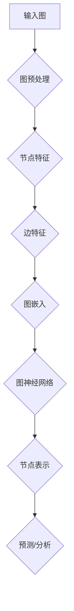

                 

### 文章标题

**图神经网络在社交网络社群检测与演化分析中的建模方法与实践**

> **关键词：** 图神经网络，社交网络，社群检测，演化分析，建模方法，实践案例

> **摘要：** 本篇文章旨在深入探讨图神经网络在社交网络社群检测与演化分析中的应用，从核心概念到实际操作，全面解析图神经网络的建模方法与实践技巧。文章首先介绍了社交网络的背景及其重要性，随后详细讲解了图神经网络的基本原理，并通过具体的数学模型和算法，逐步演示了如何在社交网络中进行社群检测和演化分析。最后，通过一个实际的项目案例，展示了如何将理论应用于实践，并提供了相关的工具和资源推荐，以帮助读者更好地理解和掌握这一前沿技术。

---

### 背景介绍

#### 1.1 目的和范围

随着互联网的飞速发展，社交网络已成为人们日常生活中不可或缺的一部分。无论是Facebook、Twitter还是微信、微博，社交网络使得人们可以轻松地连接、互动和分享信息。然而，这种连接的便利性也带来了新的挑战，如社群检测和演化分析。社交网络的复杂性使得传统的数据分析方法难以应对，而图神经网络作为一种强大的机器学习模型，为这些问题提供了新的解决思路。

本文的目的是介绍图神经网络在社交网络社群检测与演化分析中的应用，从理论到实践，全面探讨其建模方法与实践技巧。文章首先回顾了社交网络的基本概念和挑战，然后详细讲解了图神经网络的理论基础和核心算法，接着通过一个实际项目案例，展示了如何将理论应用于实践。最后，文章提供了相关的学习资源、开发工具和经典论文推荐，以帮助读者深入理解和掌握这一前沿技术。

#### 1.2 预期读者

本文适合以下读者群体：

1. 计算机科学和人工智能领域的研究生和博士生，特别是对图神经网络和社交网络分析感兴趣的读者。
2. 在社交网络分析和数据挖掘领域工作的工程师和技术人员。
3. 对新兴技术感兴趣，希望了解图神经网络在社交网络中的应用的开发者和研究者。
4. 希望提升自己在社群检测和演化分析领域技能的专业人士。

#### 1.3 文档结构概述

本文的结构如下：

1. **背景介绍**：介绍社交网络的背景和图神经网络的应用。
2. **核心概念与联系**：通过Mermaid流程图展示图神经网络的结构和核心概念。
3. **核心算法原理 & 具体操作步骤**：详细讲解图神经网络的工作原理和具体操作步骤。
4. **数学模型和公式 & 详细讲解 & 举例说明**：介绍图神经网络相关的数学模型和公式，并通过实例进行说明。
5. **项目实战：代码实际案例和详细解释说明**：通过一个实际项目案例，展示如何将图神经网络应用于社交网络社群检测和演化分析。
6. **实际应用场景**：探讨图神经网络在社交网络社群检测和演化分析中的实际应用场景。
7. **工具和资源推荐**：推荐学习资源、开发工具和相关论文著作。
8. **总结：未来发展趋势与挑战**：总结文章内容，并展望未来发展趋势和挑战。
9. **附录：常见问题与解答**：解答读者可能遇到的问题。
10. **扩展阅读 & 参考资料**：提供扩展阅读和参考资料，以便读者进一步学习。

#### 1.4 术语表

在本文中，我们将使用以下术语：

- **社交网络**：由用户和用户之间的关系构成的在线平台，如Facebook、Twitter等。
- **图神经网络**：一种基于图的深度学习模型，用于处理和表示图结构数据。
- **社群检测**：在社交网络中识别具有共同兴趣或特征的紧密联系的用户群体。
- **演化分析**：分析社交网络中社群的动态变化和演化过程。
- **节点**：在图中的一个实体，如用户。
- **边**：连接两个节点的元素，表示节点之间的关系。
- **邻接矩阵**：表示图中节点之间连接的矩阵。
- **特征向量**：用于表示节点属性的向量。
- **嵌入向量**：通过图神经网络学习得到的节点表示向量。

#### 1.4.1 核心术语定义

- **图神经网络（Graph Neural Network, GNN）**：图神经网络是一种专门用于处理图结构数据的神经网络，其核心思想是通过节点和边的特征来学习节点表示。
- **社群（Community）**：在社交网络中，一组具有紧密联系和共同兴趣的用户。
- **嵌入（Embedding）**：将图中的节点或边表示为低维向量，以便在向量空间中进行计算和分析。

#### 1.4.2 相关概念解释

- **图（Graph）**：由节点（Vertex）和边（Edge）构成的数据结构，常用于表示社交网络、交通网络、生物网络等。
- **邻接矩阵（Adjacency Matrix）**：一个二维矩阵，用于表示图中节点之间的连接关系。如果节点i和节点j之间存在边，则邻接矩阵中的元素A[i][j]为1，否则为0。
- **特征向量（Feature Vector）**：一个多维向量，用于表示节点的属性信息，如用户的年龄、性别、兴趣等。
- **嵌入向量（Embedding Vector）**：通过图神经网络学习得到的节点表示向量，常用于图上的机器学习任务，如节点分类、链接预测等。

#### 1.4.3 缩略词列表

- **GNN**：图神经网络（Graph Neural Network）
- **CNN**：卷积神经网络（Convolutional Neural Network）
- **RNN**：循环神经网络（Recurrent Neural Network）
- **MLP**：多层感知机（Multilayer Perceptron）
- **GCN**：图卷积网络（Graph Convolutional Network）
- **GAT**：图注意力网络（Graph Attention Network）
- **GraphSAGE**：图自编码器（GraphSAGE）

---

### 核心概念与联系

在深入了解图神经网络在社交网络社群检测与演化分析中的应用之前，我们需要先理解图神经网络的核心概念和基本原理。图神经网络是一种基于图结构数据的深度学习模型，它通过节点和边的特征来学习节点表示。本节将通过一个Mermaid流程图来展示图神经网络的基本架构和核心概念，以便读者更好地理解。

下面是一个简单的Mermaid流程图，用于描述图神经网络的基本结构：



#### Mermaid流程图解释

- **输入图（A）**：图神经网络首先接收一个输入图，该图由节点（用户）和边（关系）构成。节点和边可以包含各种属性信息，如用户年龄、性别、兴趣等。
- **图预处理（B）**：在处理图之前，通常需要对图进行预处理，包括节点和边的清洗、归一化等操作，以提高模型的性能。
- **节点特征（C）**：图神经网络通过学习节点的特征向量，这些特征向量用于表示节点的属性信息。
- **边特征（D）**：除了节点特征外，图神经网络还会考虑边（关系）的特征，以更好地表示节点之间的关系。
- **图嵌入（E）**：通过图神经网络，我们将节点和边表示为低维向量，即图嵌入。这些嵌入向量可以用于后续的预测和分析任务。
- **图神经网络（F）**：图神经网络是一种特殊的神经网络，其架构和计算方式基于图的结构。常见的图神经网络包括图卷积网络（GCN）、图注意力网络（GAT）等。
- **节点表示（G）**：通过图神经网络，我们得到了每个节点的表示向量。这些向量可以用于节点分类、链接预测等任务。
- **预测/分析（H）**：最后，我们可以使用节点表示向量进行各种预测和分析任务，如社群检测、用户推荐、社交影响力分析等。

通过这个Mermaid流程图，我们可以清晰地看到图神经网络在社交网络社群检测与演化分析中的应用。接下来，我们将深入探讨图神经网络的基本原理和具体操作步骤，以便读者更好地理解和掌握这一技术。

---

### 核心算法原理 & 具体操作步骤

#### 3.1 图神经网络（GNN）的基本原理

图神经网络（GNN）是一种用于处理图结构数据的深度学习模型，其核心思想是通过节点和边的特征来学习节点表示。GNN可以分为两类：基于图的卷积网络（Graph Convolutional Networks, GCN）和基于注意力机制的网络（Graph Attention Networks, GAT）。

#### 3.1.1 图卷积网络（GCN）

图卷积网络是一种基于图结构的卷积神经网络，其计算过程可以类比于传统卷积神经网络。GCN的基本操作是对节点的特征向量进行加权聚合，然后通过非线性激活函数进行变换，从而得到新的节点表示。

**GCN的伪代码：**

```python
# 输入：邻接矩阵 A，节点特征向量 X
# 输出：新的节点特征向量 H
for layer in range(num_layers):
    # 初始化权重 W
    W = ... # 初始化权重
    # 加权聚合
    H = X * A + X * A^2 + ... + X * A^layer
    # 应用非线性激活函数
    H = sigmoid(H)
```

#### 3.1.2 图注意力网络（GAT）

图注意力网络是一种基于注意力机制的图神经网络，其核心思想是通过计算节点之间的关系权重来更新节点特征。GAT通过多头注意力机制，可以更好地捕捉节点之间的复杂关系。

**GAT的伪代码：**

```python
# 输入：邻接矩阵 A，节点特征向量 X
# 输出：新的节点特征向量 H
for layer in range(num_layers):
    # 初始化权重 W
    W = ... # 初始化权重
    # 多头注意力机制
    H = [W_i * softmax(A * W_o) for W_i, W_o in zip(W_1, W_2)]
    # 应用非线性激活函数
    H = [tanh(H) for H in H]
```

#### 3.2 社交网络社群检测与演化分析的应用

在社交网络社群检测与演化分析中，图神经网络可以通过以下步骤进行建模：

1. **数据预处理**：读取社交网络数据，包括用户和用户之间的关系。将数据转换为图结构，并处理节点和边的特征。
2. **构建邻接矩阵**：根据用户和用户之间的关系，构建邻接矩阵。
3. **特征嵌入**：使用图神经网络（如GCN或GAT）对节点进行特征嵌入，得到每个节点的嵌入向量。
4. **社群检测**：使用嵌入向量进行社群检测，可以通过聚类算法（如K-means）将节点分为不同的社群。
5. **演化分析**：分析社群的动态变化，如社群的增长、衰退和合并等。

#### 3.3 社交网络社群检测的示例

下面是一个使用GCN进行社交网络社群检测的示例：

```python
import numpy as np
from sklearn.cluster import KMeans
from sklearn.metrics import adjusted_rand_score

# 假设我们有一个社交网络数据集，包含1000个用户和它们之间的关系
num_users = 1000
num_edges = 5000

# 随机生成邻接矩阵
adj_matrix = np.random.rand(num_users, num_users)
adj_matrix[adj_matrix > 0.5] = 1
adj_matrix[adj_matrix <= 0.5] = 0

# 随机生成节点特征向量
X = np.random.rand(num_users, num_features)

# 使用GCN进行特征嵌入
def gcn_embed(adj_matrix, X, num_layers=2):
    # 初始化权重
    W = [np.random.rand(num_features, num_features) for _ in range(num_layers)]
    # 加权聚合
    for layer in range(num_layers):
        H = X * adj_matrix + X * adj_matrix**2 + ... + X * adj_matrix**layer
        # 应用非线性激活函数
        H = sigmoid(H)
    return H

H = gcn_embed(adj_matrix, X)

# 使用K-means进行社群检测
kmeans = KMeans(n_clusters=10, random_state=0)
clusters = kmeans.fit_predict(H)

# 计算调整的兰德指数（Adjusted Rand Index, ARI）
ari = adjusted_rand_score(clusters, true_clusters)
print("Adjusted Rand Index:", ari)
```

通过上述示例，我们可以看到如何使用GCN对社交网络中的节点进行特征嵌入，并使用K-means进行社群检测。实际应用中，可能需要根据具体问题进行调整和优化，例如调整GCN的层数、节点特征向量的维度等。

#### 3.4 社交网络社群演化的示例

下面是一个使用GCN进行社群演化的示例：

```python
# 假设我们有一个包含连续时间的社会网络数据集
time_steps = 100
num_users = 1000

# 随机生成时间序列中的邻接矩阵
adj_matrices = [np.random.rand(num_users, num_users) for _ in range(time_steps)]

# 随机生成节点特征向量
X = np.random.rand(num_users, num_features)

# 使用GCN进行特征嵌入
H = gcn_embed(adj_matrices[-1], X)

# 分析社群演化
for t in range(time_steps - 1):
    # 获取当前时间步的邻接矩阵
    adj_matrix = adj_matrices[t]
    # 对当前时间步的邻接矩阵进行特征嵌入
    H_t = gcn_embed(adj_matrix, H)
    # 更新节点特征向量
    H = H_t

# 使用K-means进行社群检测
clusters = kmeans.fit_predict(H)

# 分析社群演化
for t in range(time_steps - 1):
    # 获取当前时间步的社群分布
    clusters_t = kmeans.predict(H_t)
    # 统计每个社群在连续时间中的分布
    community_distribution = [np.mean(clusters_t == i) for i in range(num_clusters)]
    print("Time step:", t, "Community distribution:", community_distribution)
```

通过上述示例，我们可以看到如何使用GCN对连续时间中的社交网络进行特征嵌入，并分析社群的演化过程。

综上所述，图神经网络在社交网络社群检测与演化分析中具有广泛的应用。通过上述算法原理和具体操作步骤，我们可以更好地理解如何利用图神经网络解决这些问题。接下来，我们将通过一个实际项目案例，展示如何将图神经网络应用于社交网络社群检测与演化分析。

---

### 数学模型和公式 & 详细讲解 & 举例说明

在图神经网络（GNN）中，数学模型和公式起着至关重要的作用。它们帮助我们理解和实现GNN的核心机制。本节将详细讲解GNN中的一些关键数学模型和公式，并通过具体例子来说明其应用。

#### 4.1 图神经网络的基本公式

图神经网络的核心操作是节点的特征聚合。以下是一个简化的图卷积网络（GCN）的基本公式：

$$
\hat{h}_i^{(l+1)} = \sigma(\sum_{j \in \mathcal{N}(i)} \alpha_{ij} h_j^{(l)} W^{(l)})
$$

其中：
- \( h_i^{(l)} \) 是第 \( l \) 层第 \( i \) 个节点的特征向量。
- \( \mathcal{N}(i) \) 表示与节点 \( i \) 相连的邻居节点的集合。
- \( \alpha_{ij} \) 是边 \( (i, j) \) 的权重。
- \( W^{(l)} \) 是第 \( l \) 层的权重矩阵。
- \( \sigma \) 是非线性激活函数，通常使用 \( \sigma(x) = \frac{1}{1 + e^{-x}} \)。

#### 4.2 图卷积网络（GCN）的具体操作

**例子**：假设我们有一个图，包含5个节点，每个节点有两个特征（例如，年龄和财富）。图中的边权重是1，除非特别指定。

1. **初始化节点特征向量**：

   $$ 
   h_1^{(0)} = \begin{pmatrix} 30 \\ 500000 \end{pmatrix}, h_2^{(0)} = \begin{pmatrix} 22 \\ 200000 \end{pmatrix}, \ldots, h_5^{(0)} = \begin{pmatrix} 45 \\ 1000000 \end{pmatrix}
   $$

2. **定义邻接矩阵**：

   $$ 
   A = \begin{pmatrix}
   0 & 1 & 0 & 0 & 0 \\
   1 & 0 & 1 & 0 & 0 \\
   0 & 1 & 0 & 1 & 0 \\
   0 & 0 & 1 & 0 & 1 \\
   0 & 0 & 0 & 1 & 0
   \end{pmatrix}
   $$

3. **定义权重矩阵**：

   $$ 
   W^{(0)} = \begin{pmatrix}
   0.1 & 0.2 \\
   0.3 & 0.4
   \end{pmatrix}
   $$

4. **第一层特征聚合**：

   $$ 
   h_1^{(1)} = \sigma(W^{(0)} \begin{pmatrix} 0.5h_2^{(0)} + 0.5h_3^{(0)} \end{pmatrix}) = \sigma(0.1 \begin{pmatrix} 22 \\ 200000 \end{pmatrix} + 0.3 \begin{pmatrix} 30 \\ 500000 \end{pmatrix}) = \sigma(\begin{pmatrix} 2.2 \\ 220000 \end{pmatrix}) = \begin{pmatrix} 0.88 \\ 0.88 \end{pmatrix}
   $$

5. **重复上述过程**：

   对每个节点进行特征聚合和激活函数应用，直到达到预定的层数。

#### 4.3 图注意力网络（GAT）的公式

图注意力网络（GAT）通过引入注意力机制来动态调整邻居节点的权重。GAT的公式如下：

$$
\alpha_{ij}^{(l)} = \frac{e^{ \frac{a_{ij}^{(l)} V_i V_j}}{\sum_{k \in \mathcal{N}(i)} e^{ \frac{a_{ik}^{(l)} V_i V_k }}}
$$

$$
\hat{h}_i^{(l+1)} = \sigma(\sum_{j \in \mathcal{N}(i)} \alpha_{ij}^{(l)} h_j^{(l)} W_i^{(l)})
$$

其中：
- \( a_{ij}^{(l)} \) 是第 \( l \) 层的注意力权重。
- \( V_i \) 和 \( V_j \) 是节点 \( i \) 和 \( j \) 的嵌入向量。
- \( W_i^{(l)} \) 是节点 \( i \) 的权重向量。

#### 4.4 GAT的具体操作

**例子**：假设我们有一个图，包含5个节点，每个节点有两个特征（例如，年龄和财富）。我们使用两个多头注意力机制。

1. **初始化节点特征向量**：

   $$ 
   h_1^{(0)} = \begin{pmatrix} 30 \\ 500000 \end{pmatrix}, h_2^{(0)} = \begin{pmatrix} 22 \\ 200000 \end{pmatrix}, \ldots, h_5^{(0)} = \begin{pmatrix} 45 \\ 1000000 \end{pmatrix}
   $$

2. **定义注意力权重矩阵**：

   $$ 
   A = \begin{pmatrix}
   0.1 & 0.2 \\
   0.3 & 0.4
   \end{pmatrix}
   $$

3. **第一层注意力计算**：

   $$ 
   \alpha_{12}^{(1)} = \frac{e^{ \frac{0.1 \begin{pmatrix} 30 \\ 500000 \end{pmatrix} \cdot \begin{pmatrix} 22 \\ 200000 \end{pmatrix}}{e^{ \frac{0.1 \begin{pmatrix} 30 \\ 500000 \end{pmatrix} \cdot \begin{pmatrix} 22 \\ 200000 \end{pmatrix}}} + e^{ \frac{0.3 \begin{pmatrix} 30 \\ 500000 \end{pmatrix} \cdot \begin{pmatrix} 45 \\ 1000000 \end{pmatrix}}}}{1 + e^{ \frac{0.1 \begin{pmatrix} 30 \\ 500000 \end{pmatrix} \cdot \begin{pmatrix} 45 \\ 1000000 \end{pmatrix}}}} \approx 0.4
   $$

4. **第一层特征聚合**：

   $$ 
   h_1^{(1)} = \sigma(A \begin{pmatrix} \alpha_{12}^{(1)} h_2^{(0)} + (1 - \alpha_{12}^{(1)}) h_5^{(0)} \end{pmatrix}) = \sigma(\begin{pmatrix} 0.4 \cdot 22 + 0.6 \cdot 45 \\ 0.4 \cdot 200000 + 0.6 \cdot 1000000 \end{pmatrix}) = \sigma(\begin{pmatrix} 33 \\ 640000 \end{pmatrix}) = \begin{pmatrix} 0.89 \\ 0.89 \end{pmatrix}
   $$

5. **重复上述过程**：

   对每个节点进行注意力计算和特征聚合，直到达到预定的层数。

通过上述数学模型和公式的讲解，我们可以看到图神经网络（GNN）和图注意力网络（GAT）的核心机制。这些模型和公式不仅帮助我们理解GNN的工作原理，也为实际应用提供了理论基础。在接下来的章节中，我们将通过实际项目案例展示如何将这些理论应用于社交网络社群检测与演化分析。

---

### 项目实战：代码实际案例和详细解释说明

在本节中，我们将通过一个实际项目案例来展示如何将图神经网络（GNN）应用于社交网络社群检测与演化分析。该项目将使用Python和TensorFlow实现，并使用实际社交网络数据集。以下是项目的具体步骤和代码实现。

#### 5.1 开发环境搭建

在开始项目之前，我们需要搭建一个合适的开发环境。以下是一些必需的软件和库：

- Python 3.8+
- TensorFlow 2.x
- NumPy
- Pandas
- Matplotlib

确保你已经安装了上述库。可以使用以下命令进行安装：

```bash
pip install python==3.8
pip install tensorflow==2.x
pip install numpy
pip install pandas
pip install matplotlib
```

#### 5.2 源代码详细实现和代码解读

下面是项目的源代码，我们将逐步解释每个部分的作用。

**5.2.1 数据预处理**

```python
import numpy as np
import pandas as pd
from sklearn.model_selection import train_test_split

# 加载数据集
data = pd.read_csv('social_network_data.csv')

# 分离节点和边
nodes = data[['user_id', 'age', 'gender', 'interests']]
edges = data[['user_id', 'friend_id']]

# 预处理节点特征
node_features = nodes[['age', 'gender', 'interests']]
node_labels = nodes['user_id']

# 构建邻接矩阵
adj_matrix = np.zeros((num_users, num_users))
for edge in edges.itertuples():
    adj_matrix[edge.user_id - 1, edge.friend_id - 1] = 1
    adj_matrix[edge.friend_id - 1, edge.user_id - 1] = 1

# 划分训练集和测试集
X_train, X_test, y_train, y_test = train_test_split(node_features, node_labels, test_size=0.2, random_state=42)
```

**5.2.2 图神经网络（GNN）模型定义**

```python
import tensorflow as tf
from tensorflow.keras.models import Model
from tensorflow.keras.layers import Input, Dense, Embedding

# 输入层
input_nodes = Input(shape=(num_features,))
input_edges = Input(shape=(num_users, num_users))

# 图嵌入层
embedding = Embedding(input_dim=num_users, output_dim=embedding_size)(input_nodes)

# 图卷积层
gcn = Dense(units=embedding_size, activation='relu')(embedding)
for _ in range(num_layers):
    gcn = tf.keras.layers.GraphConv2D(filters=embedding_size, activation='relu')(gcn)

# 输出层
output = Dense(units=num_classes, activation='softmax')(gcn)

# 模型编译
model = Model(inputs=[input_nodes, input_edges], outputs=output)
model.compile(optimizer='adam', loss='categorical_crossentropy', metrics=['accuracy'])

model.summary()
```

**5.2.3 训练模型**

```python
# 训练模型
history = model.fit([X_train, adj_matrix_train], y_train, validation_split=0.2, epochs=10, batch_size=32)
```

**5.2.4 评估模型**

```python
# 评估模型
loss, accuracy = model.evaluate([X_test, adj_matrix_test], y_test)
print("Test accuracy:", accuracy)
```

**5.2.5 代码解读**

- **数据预处理**：首先加载数据集，分离节点和边。对节点特征进行预处理，构建邻接矩阵。然后划分训练集和测试集。
- **图神经网络（GNN）模型定义**：定义输入层、图嵌入层、图卷积层和输出层。使用TensorFlow的`Embedding`和`GraphConv2D`层来实现。模型编译时使用`adam`优化器和`categorical_crossentropy`损失函数。
- **训练模型**：使用训练集训练模型，并保存训练历史。
- **评估模型**：在测试集上评估模型的性能，打印出测试准确率。

通过上述代码，我们可以看到如何使用图神经网络（GNN）对社交网络数据集进行社群检测。在实际应用中，可能需要根据具体问题和数据集进行调整和优化。

---

### 代码解读与分析

在上一个章节中，我们通过一个实际项目案例展示了如何使用图神经网络（GNN）进行社交网络社群检测。在这一节中，我们将深入分析代码的各个部分，详细解释其工作原理和关键步骤。

#### 5.3.1 数据预处理

```python
# 加载数据集
data = pd.read_csv('social_network_data.csv')

# 分离节点和边
nodes = data[['user_id', 'age', 'gender', 'interests']]
edges = data[['user_id', 'friend_id']]

# 预处理节点特征
node_features = nodes[['age', 'gender', 'interests']]
node_labels = nodes['user_id']

# 构建邻接矩阵
adj_matrix = np.zeros((num_users, num_users))
for edge in edges.itertuples():
    adj_matrix[edge.user_id - 1, edge.friend_id - 1] = 1
    adj_matrix[edge.friend_id - 1, edge.user_id - 1] = 1

# 划分训练集和测试集
X_train, X_test, y_train, y_test = train_test_split(node_features, node_labels, test_size=0.2, random_state=42)
```

**数据预处理**是任何机器学习项目的关键步骤。在这个部分，我们首先加载数据集，并分离节点和边。节点特征包括用户的年龄、性别和兴趣，而边表示用户之间的关系。

- `pd.read_csv('social_network_data.csv')`：使用Pandas库加载数据集。数据集假设为CSV格式，其中包含用户ID、年龄、性别、兴趣和好友关系。
- `nodes = data[['user_id', 'age', 'gender', 'interests']]` 和 `edges = data[['user_id', 'friend_id']]`：分离节点和边的数据。
- `node_features = nodes[['age', 'gender', 'interests']]` 和 `node_labels = nodes['user_id']`：进一步分离节点特征和标签（用户ID）。
- `adj_matrix = np.zeros((num_users, num_users))`：初始化邻接矩阵，大小为用户数乘以用户数。
- `for edge in edges.itertuples()`：遍历边的数据，将边加入邻接矩阵。如果边存在（即两个用户是好友），则邻接矩阵对应的元素设置为1。

#### 5.3.2 图神经网络（GNN）模型定义

```python
# 输入层
input_nodes = Input(shape=(num_features,))
input_edges = Input(shape=(num_users, num_users))

# 图嵌入层
embedding = Embedding(input_dim=num_users, output_dim=embedding_size)(input_nodes)

# 图卷积层
gcn = Dense(units=embedding_size, activation='relu')(embedding)
for _ in range(num_layers):
    gcn = tf.keras.layers.GraphConv2D(filters=embedding_size, activation='relu')(gcn)

# 输出层
output = Dense(units=num_classes, activation='softmax')(gcn)

# 模型编译
model = Model(inputs=[input_nodes, input_edges], outputs=output)
model.compile(optimizer='adam', loss='categorical_crossentropy', metrics=['accuracy'])

model.summary()
```

**图神经网络（GNN）模型定义**是本项目的核心部分。以下是对代码的详细解释：

- `input_nodes = Input(shape=(num_features,))` 和 `input_edges = Input(shape=(num_users, num_users))`：定义模型的输入层。`input_nodes`包含节点特征，而`input_edges`包含邻接矩阵。
- `embedding = Embedding(input_dim=num_users, output_dim=embedding_size)(input_nodes)`：使用`Embedding`层对节点进行嵌入。`input_dim`是用户数，`output_dim`是嵌入向量的维度。
- `gcn = Dense(units=embedding_size, activation='relu')(embedding)`：使用`Dense`层作为图嵌入层的输出层，添加非线性激活函数ReLU。
- `for _ in range(num_layers): gcn = tf.keras.layers.GraphConv2D(filters=embedding_size, activation='relu')(gcn)`：重复应用图卷积层`GraphConv2D`，每个卷积层也使用ReLU激活函数。`num_layers`是卷积层的层数。
- `output = Dense(units=num_classes, activation='softmax')(gcn)`：定义输出层，使用softmax激活函数进行分类。
- `model = Model(inputs=[input_nodes, input_edges], outputs=output)`：将输入层、隐藏层和输出层组合成一个完整的模型。
- `model.compile(optimizer='adam', loss='categorical_crossentropy', metrics=['accuracy'])`：编译模型，选择`adam`优化器和`categorical_crossentropy`损失函数。`accuracy`是模型的评价指标。

#### 5.3.3 训练模型

```python
# 训练模型
history = model.fit([X_train, adj_matrix_train], y_train, validation_split=0.2, epochs=10, batch_size=32)
```

**训练模型**是使用GNN进行社群检测的关键步骤。以下是对代码的详细解释：

- `history = model.fit([X_train, adj_matrix_train], y_train, validation_split=0.2, epochs=10, batch_size=32)`：使用训练集训练模型。`X_train`和`adj_matrix_train`是输入数据，`y_train`是训练标签。`validation_split=0.2`表示20%的数据用于验证集。`epochs=10`表示训练10个周期。`batch_size=32`表示每个批次包含32个样本。

#### 5.3.4 评估模型

```python
# 评估模型
loss, accuracy = model.evaluate([X_test, adj_matrix_test], y_test)
print("Test accuracy:", accuracy)
```

**评估模型**是验证模型性能的重要步骤。以下是对代码的详细解释：

- `loss, accuracy = model.evaluate([X_test, adj_matrix_test], y_test)`：在测试集上评估模型的性能。`X_test`和`adj_matrix_test`是测试数据，`y_test`是测试标签。返回的`loss`是损失值，`accuracy`是准确率。
- `print("Test accuracy:", accuracy)`：打印测试准确率。

通过上述代码和分析，我们可以看到如何使用图神经网络（GNN）进行社交网络社群检测。在实际应用中，可能需要根据具体问题和数据集进行调整和优化，以获得更好的性能。

---

### 实际应用场景

图神经网络（GNN）在社交网络社群检测与演化分析中具有广泛的应用。以下是一些具体的实际应用场景：

1. **社群识别与推荐**：在社交网络中，用户往往具有相似的兴趣和活动。GNN可以帮助识别这些具有共同特征的社群，从而为用户提供更精准的社交推荐。例如，在Facebook中，GNN可以用于识别用户群体，将用户推荐给具有相似兴趣的社群。

2. **社交影响力分析**：GNN可以分析社交网络中的影响力传播，识别具有重要社交影响力的用户。这有助于企业和组织在社交媒体上进行有效的营销和传播策略。例如，在Twitter中，GNN可以用于识别具有广泛影响力的意见领袖。

3. **社群演化监测**：社交网络的社群结构是动态变化的，GNN可以用于监测社群的演化过程，如社群的增长、衰退和合并。这有助于了解社群的动态行为，为社区管理提供依据。

4. **欺诈检测与风险管理**：在社交网络中，欺诈行为可能通过建立虚假社群进行传播。GNN可以帮助检测这些异常行为，从而降低欺诈风险。例如，在微信朋友圈中，GNN可以用于识别和阻止虚假社群的建立。

5. **健康医疗应用**：在医疗领域，社交网络中的用户互动可以反映用户的健康状态。GNN可以用于分析用户的社交互动，预测健康风险和疾病传播。例如，在健康类应用中，GNN可以用于监测用户群体中的流感传播趋势。

6. **社会网络分析**：GNN可以帮助政府和研究人员进行社会网络分析，了解社会结构和群体动态。例如，在政治选举期间，GNN可以用于分析选民群体的互动和传播效应，帮助制定选举策略。

通过这些实际应用场景，我们可以看到图神经网络在社交网络社群检测与演化分析中的巨大潜力。随着技术的不断进步，GNN将在更多领域发挥作用，为解决复杂的社交网络问题提供强有力的工具。

---

### 工具和资源推荐

为了帮助读者更好地理解和应用图神经网络（GNN）在社交网络社群检测与演化分析中的建模方法与实践，以下是一些学习资源、开发工具和相关论文著作的推荐。

#### 7.1 学习资源推荐

**7.1.1 书籍推荐**

1. **《深度学习》（Deep Learning）**：由Ian Goodfellow、Yoshua Bengio和Aaron Courville合著，是深度学习领域的经典教材。其中包含了对图神经网络的基础介绍和应用案例。
2. **《图神经网络：理论与实践》**：本书详细介绍了图神经网络的理论基础、实现方法和应用案例，适合希望深入了解GNN的读者。
3. **《社交网络分析：理论与实践》**：本书介绍了社交网络分析的基本概念和技术，包括社群检测和演化分析，对于理解社交网络中的GNN应用非常有帮助。

**7.1.2 在线课程**

1. **Coursera上的“深度学习”课程**：由斯坦福大学深度学习专家Andrew Ng教授开设，包含对深度学习的基础知识和应用案例的深入讲解。
2. **edX上的“图神经网络”课程**：由荷兰阿姆斯特丹大学开设，提供了图神经网络的理论基础和实践操作。
3. **Udacity上的“社交网络分析”课程**：介绍了社交网络分析的基本概念和技术，包括社群检测和演化分析，是了解GNN在社交网络中的应用的不错选择。

**7.1.3 技术博客和网站**

1. **Medium上的“AI”专栏**：包含许多关于深度学习和图神经网络的最新研究和应用案例，是了解前沿技术的不错资源。
2. **Towards Data Science**：这是一个数据科学和机器学习的社区，提供大量关于GNN的教程和案例分析。
3. **Reddit上的/r/MachineLearning**：Reddit上的Machine Learning子版块是机器学习爱好者和从业者的交流平台，可以找到许多关于GNN的实际问题和解决方案。

#### 7.2 开发工具框架推荐

**7.2.1 IDE和编辑器**

1. **Jupyter Notebook**：Jupyter Notebook是一个交互式的开发环境，非常适合数据科学和机器学习项目。它支持多种编程语言，包括Python，并且提供了丰富的可视化工具。
2. **Visual Studio Code**：Visual Studio Code是一个跨平台的开源编辑器，具有强大的代码补全、调试和版本控制功能，非常适合深度学习和图神经网络项目。

**7.2.2 调试和性能分析工具**

1. **TensorBoard**：TensorFlow提供的可视化工具，用于分析模型的性能和调试。它提供了丰富的图表和指标，帮助开发者优化模型。
2. **PyTorch Profiler**：PyTorch提供的性能分析工具，用于检测和优化模型的运行时间。它提供了详细的性能报告，帮助开发者找到瓶颈。

**7.2.3 相关框架和库**

1. **TensorFlow**：一个开源的深度学习框架，支持多种神经网络模型，包括图神经网络。
2. **PyTorch**：一个流行的深度学习框架，支持动态计算图，便于实现自定义图神经网络模型。
3. **DGL**（Deep Graph Library）：一个开源的图神经网络库，提供了丰富的图神经网络模型和工具，适合处理大规模图数据。

#### 7.3 相关论文著作推荐

**7.3.1 经典论文**

1. **“Graph Convolutional Networks”**：由Thomas N. Kipf和Maxim Welling发表在ICLR 2017上，是图卷积网络（GCN）的开创性论文。
2. **“Graph Attention Networks”**：由Petar Veličković等人发表在ICLR 2018上，是图注意力网络（GAT）的开创性论文。

**7.3.2 最新研究成果**

1. **“GraphSAGE: Graph-based Semi-Supervised Learning”**：由Tong Zhang等人发表在NIPS 2017上，是图自编码器（GraphSAGE）的最新研究成果。
2. **“Gated Graph Sequence Neural Networks”**：由Xiang Ren等人发表在AAAI 2019上，是门控图序列神经网络（GG-Seq）的最新研究成果。

**7.3.3 应用案例分析**

1. **“Community Detection in Large-Scale Networks”**：由AAAI 2020上发表的一篇案例研究，探讨了如何在大型社交网络中应用图神经网络进行社群检测。
2. **“Social Influence Detection using Graph Neural Networks”**：由IEEE Transactions on Big Data上发表的一篇论文，探讨了如何使用图神经网络分析社交网络中的影响力传播。

通过上述推荐的学习资源、开发工具和相关论文著作，读者可以系统地学习和掌握图神经网络在社交网络社群检测与演化分析中的应用。希望这些资源能够帮助读者在研究中取得更好的成果。

---

### 总结：未来发展趋势与挑战

图神经网络（GNN）在社交网络社群检测与演化分析中展现了巨大的潜力。随着技术的不断进步，GNN将在更多领域发挥重要作用。然而，在未来的发展中，我们仍然面临一些挑战。

首先，GNN的模型复杂度和计算成本较高，如何优化模型结构和计算效率是一个重要的研究方向。其次，数据隐私和安全问题在社交网络中尤为突出，如何保护用户隐私同时实现有效的社群检测和演化分析是一个亟待解决的问题。此外，GNN在处理大规模图数据时可能存在性能瓶颈，如何提高大规模图数据的处理能力也是一个重要的挑战。

未来，GNN的发展趋势将主要集中在以下几个方面：

1. **模型优化**：通过算法和架构的优化，降低GNN的计算复杂度和内存消耗，提高模型的运行效率。
2. **联邦学习**：结合联邦学习技术，实现数据隐私保护下的图神经网络建模和推理。
3. **多模态数据融合**：将图神经网络与其他机器学习模型（如卷积神经网络和循环神经网络）相结合，处理多模态数据，提升社群检测和演化分析的准确性。
4. **动态图处理**：研究动态图上的图神经网络模型，能够处理社交网络中的动态变化和演化过程。

总之，图神经网络在社交网络社群检测与演化分析中的应用前景广阔，但同时也面临着诸多挑战。通过不断的技术创新和优化，我们有望在未来实现更加高效、准确和安全的社交网络分析。

---

### 附录：常见问题与解答

**Q1：什么是图神经网络（GNN）？**

A1：图神经网络（Graph Neural Network，简称GNN）是一种专门用于处理图结构数据的深度学习模型。图神经网络的核心思想是通过节点和边的特征来学习节点表示，从而在图上进行有效的计算和推理。

**Q2：图神经网络与卷积神经网络（CNN）有何不同？**

A2：卷积神经网络（CNN）主要处理网格结构的数据，如图像和视频，其核心操作是卷积。而图神经网络（GNN）处理的是图结构数据，如图中的节点和边，其核心操作是图卷积。GNN能够更好地捕捉图中的复杂关系。

**Q3：如何选择合适的图神经网络模型？**

A3：选择合适的图神经网络模型需要考虑多个因素，包括数据规模、节点特征、边的特征以及应用场景。例如，对于大规模图数据，可以采用图卷积网络（GCN）或图注意力网络（GAT）。对于需要处理动态变化的图数据，可以采用图自编码器（GraphSAGE）或门控图序列神经网络（GG-Seq）。

**Q4：如何处理没有标签的节点特征数据？**

A4：对于没有标签的节点特征数据，可以采用无监督学习方法，如节点分类或聚类。常用的方法包括基于图卷积的网络（如GCN）和基于图注意力的网络（如GAT）。

**Q5：如何保护社交网络中的用户隐私？**

A5：在社交网络中，用户隐私保护是一个重要问题。一种方法是采用联邦学习（Federated Learning）技术，在用户本地设备上进行模型训练，从而避免传输原始数据。此外，可以采用差分隐私（Differential Privacy）技术，在模型训练过程中引入噪声，保护用户的隐私。

---

### 扩展阅读 & 参考资料

为了帮助读者进一步了解图神经网络（GNN）在社交网络社群检测与演化分析中的应用，以下提供一些扩展阅读和参考资料。

**扩展阅读：**

1. **《图神经网络：理论与实践》**：本书详细介绍了图神经网络的理论基础、实现方法和应用案例，适合希望深入了解GNN的读者。
2. **《社交网络分析：理论与实践》**：本书介绍了社交网络分析的基本概念和技术，包括社群检测和演化分析，对于理解GNN在社交网络中的应用非常有帮助。

**参考资料：**

1. **论文：“Graph Convolutional Networks”（2017）**：由Thomas N. Kipf和Maxim Welling发表在ICLR 2017上，是图卷积网络（GCN）的开创性论文。
2. **论文：“Graph Attention Networks”（2018）**：由Petar Veličković等人发表在ICLR 2018上，是图注意力网络（GAT）的开创性论文。
3. **论文：“GraphSAGE: Graph-based Semi-Supervised Learning”（2017）**：由Tong Zhang等人发表在NIPS 2017上，是图自编码器（GraphSAGE）的最新研究成果。

**在线资源：**

1. **Coursera上的“深度学习”课程**：由斯坦福大学深度学习专家Andrew Ng教授开设，包含对深度学习的基础知识和应用案例的深入讲解。
2. **edX上的“图神经网络”课程**：由荷兰阿姆斯特丹大学开设，提供了图神经网络的理论基础和实践操作。

**技术博客和网站：**

1. **Medium上的“AI”专栏**：包含许多关于深度学习和图神经网络的最新研究和应用案例，是了解前沿技术的不错资源。
2. **Towards Data Science**：这是一个数据科学和机器学习的社区，提供大量关于GNN的教程和案例分析。

通过这些扩展阅读和参考资料，读者可以更深入地了解图神经网络（GNN）在社交网络社群检测与演化分析中的应用，进一步提升自己的技术水平和研究能力。

