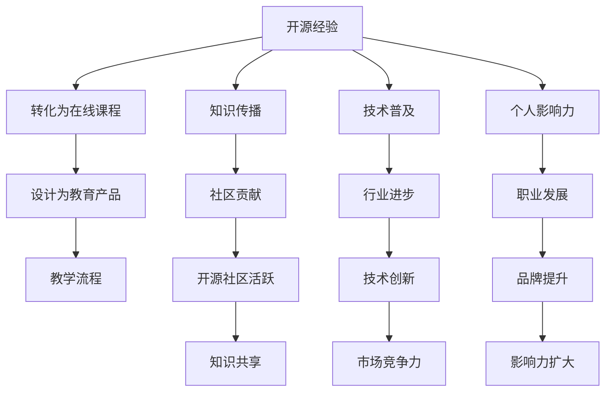

                 

### 1. 背景介绍

#### 1.1 目的和范围

本文旨在探讨如何将开源经验转化为在线课程教育产品，旨在为开源社区的技术贡献者、在线教育从业者和课程设计师提供一套系统化的方法。随着开源项目的蓬勃发展，越来越多的技术人才希望通过分享自己的经验和知识，为社区贡献价值。然而，将开源经验有效地转化为教育产品并非易事，涉及到技术、教学、市场等多个层面。

本文将围绕以下几个方面展开：

- 开源经验的内涵及其在教育产品中的价值
- 开源项目转化为在线课程的需求和可行性分析
- 在线课程的设计原则与流程
- 开源项目在在线课程中的具体应用实例
- 开源经验转化为在线课程的教育效果评估

通过以上探讨，我们希望能够为广大开发者提供一个切实可行的路径，帮助他们将自己的开源经验转化为具有实际教育价值的产品。

#### 1.2 预期读者

本文的预期读者主要包括以下几类：

- 开源项目的贡献者：他们具备一定的技术背景，希望通过创作在线课程来分享自己的经验和知识。
- 在线教育从业者：他们关注教育产品的设计与运营，希望通过本文了解如何利用开源项目丰富教学内容。
- 课程设计师：他们负责在线课程的整体规划和设计，需要将开源项目融入课程体系。
- 技术爱好者：他们希望从开源项目中学习新技能，提升自己的技术水平。

通过本文的阅读，读者可以了解如何将开源经验有效地转化为在线课程，从而实现知识传播和价值创造。

#### 1.3 文档结构概述

本文将分为十个主要部分，结构如下：

1. 背景介绍
   - 1.1 目的和范围
   - 1.2 预期读者
   - 1.3 文档结构概述
   - 1.4 术语表
2. 核心概念与联系
   - 2.1 开源经验概述
   - 2.2 教育产品的定义与分类
   - 2.3 Mermaid流程图
3. 核心算法原理 & 具体操作步骤
   - 3.1 开源项目转化为在线课程的基本步骤
   - 3.2 伪代码示例
4. 数学模型和公式 & 详细讲解 & 举例说明
   - 4.1 教育效果评估模型
   - 4.2 数学公式解释
5. 项目实战：代码实际案例和详细解释说明
   - 5.1 开发环境搭建
   - 5.2 源代码详细实现和代码解读
   - 5.3 代码解读与分析
6. 实际应用场景
   - 6.1 技术培训
   - 6.2 学术研究
   - 6.3 企业内训
7. 工具和资源推荐
   - 7.1 学习资源推荐
   - 7.2 开发工具框架推荐
   - 7.3 相关论文著作推荐
8. 总结：未来发展趋势与挑战
9. 附录：常见问题与解答
10. 扩展阅读 & 参考资料

通过以上结构，本文将系统化地探讨如何将开源经验转化为在线课程教育产品，为读者提供全面、深入的指导。

#### 1.4 术语表

在本文中，我们将使用一些特定的术语。以下是这些术语的定义和解释：

- **开源经验**：指个人或团队在参与开源项目过程中积累的技术知识、解决问题的方法和经验。
- **教育产品**：指以知识传授、技能培养为目标，通过系统化、结构化的方式进行教学的产品。
- **课程设计师**：负责课程整体规划、内容设计和教学方法设计的人员。
- **在线课程**：通过互联网进行教学的活动，学生可以远程学习，通常包括视频、文档、练习等教学资源。
- **源代码**：指软件开发过程中编写的基础代码，是软件系统的核心部分。
- **伪代码**：一种类似于自然语言但更接近于编程语言的表述方式，用于描述算法的基本结构和操作步骤。
- **教育效果评估**：通过科学的方法和工具对教育产品的效果进行评价，包括学习成果、用户满意度等多个维度。

通过明确这些术语的定义，读者可以更好地理解本文的内容和论述。在接下来的部分中，我们将进一步探讨开源经验与在线课程之间的联系，以及如何将二者有效结合。

#### 1.4.1 核心术语定义

在本节中，我们将详细解释本文中涉及的核心术语，以便读者更好地理解后续内容。

1. **开源经验**：

   开源经验是指个人或团队在参与开源项目过程中积累的知识、技能和解决问题的方法。这些经验通常包括技术细节、代码实现、项目管理、社区协作等多个方面。开源经验的价值在于其能够为其他开发者提供宝贵的参考，帮助他们更高效地解决问题，避免重复劳动。

   **定义要点**：
   - **知识技能**：涉及技术深度和广度，如编程语言、框架、工具等。
   - **解决问题的方法**：包括遇到问题时如何分析、设计和实现解决方案。
   - **项目管理**：涉及项目规划、进度控制、风险评估等。
   - **社区协作**：涉及与开源社区的交流合作、贡献代码等。

2. **教育产品**：

   教育产品是指以知识传授、技能培养为目标，通过系统化、结构化的方式进行教学的产品。教育产品可以包括各种形式，如视频课程、电子书、在线实验等。其核心在于将知识和技能以易于理解和掌握的方式呈现给学习者。

   **定义要点**：
   - **知识传授**：以传授知识为主要目标，帮助学习者掌握特定的学科或技能。
   - **技能培养**：通过实践操作和反复练习，帮助学习者提高实际操作能力。
   - **系统化、结构化**：教学内容和资源组织有序，有助于学习者系统地学习。
   - **多样性**：形式多样，满足不同学习者的需求。

3. **课程设计师**：

   课程设计师是负责课程整体规划、内容设计和教学方法设计的人员。他们需要结合教学目标和学习者特点，设计出科学、有效的教学方案。

   **定义要点**：
   - **课程整体规划**：确定课程的教学目标、课程结构、教学进度等。
   - **内容设计**：选择合适的教学内容，包括理论、实践、案例分析等。
   - **教学方法设计**：根据学习者特点和教学内容，选择合适的教学方法，如讲授、讨论、实验等。

4. **在线课程**：

   在线课程是通过互联网进行教学的活动，学生可以远程学习，通常包括视频、文档、练习等教学资源。在线课程具有灵活性高、互动性强、资源丰富等特点，能够满足不同学习者的需求。

   **定义要点**：
   - **远程学习**：学生无需到实体教室，通过互联网进行学习。
   - **教学资源**：包括视频、文档、练习、讨论区等多种形式。
   - **灵活性**：学生可以根据自己的时间安排学习，进度自定。
   - **互动性**：通过讨论区、在线考试等方式进行师生互动。

5. **源代码**：

   源代码是软件开发过程中编写的基础代码，是软件系统的核心部分。源代码通常由程序员编写，用于实现软件的功能和特性。

   **定义要点**：
   - **基础代码**：实现软件功能的直接表达形式。
   - **程序员编写**：编程语言是源代码的表达工具。
   - **软件系统核心**：源代码决定了软件的基本结构和功能。

6. **伪代码**：

   伪代码是一种类似于自然语言但更接近于编程语言的表述方式，用于描述算法的基本结构和操作步骤。伪代码可以帮助开发者更好地理解和交流算法的设计和实现。

   **定义要点**：
   - **自然语言**：接近日常语言，易于理解和表达。
   - **编程语言**：具有一定的语法规则，类似于编程语言。
   - **算法描述**：用于描述算法的基本结构和操作步骤。

7. **教育效果评估**：

   教育效果评估是通过科学的方法和工具对教育产品的效果进行评价，包括学习成果、用户满意度等多个维度。教育效果评估可以帮助教育者了解教学效果，优化教学方案。

   **定义要点**：
   - **科学的方法和工具**：采用科学的方法和工具进行评价。
   - **学习成果**：评估学习者在课程学习后所取得的实际成果。
   - **用户满意度**：评估学习者对教育产品的满意度。

通过以上对核心术语的详细定义，读者可以更好地理解本文的主题和内容，为后续的探讨打下基础。

#### 1.4.2 相关概念解释

在本文中，我们将详细解释与主题密切相关的一些相关概念，以确保读者能够全面理解后续内容。

1. **开源项目的定义**：

   开源项目是指由多个开发者共同参与，以开放源代码形式进行合作开发的软件项目。开源项目的核心特点是代码公开，任何人都可以查看、修改和分发。这种模式促进了知识共享和技术创新，使得开发者能够基于已有的成果进行扩展和改进。

   **定义要点**：
   - **开放源代码**：项目代码是公开的，用户可以自由查看和修改。
   - **多人合作**：多个开发者共同参与项目的开发，协同工作。
   - **知识共享**：开源项目的成果可以被广泛传播，促进技术交流。
   - **技术创新**：基于已有的成果，开发者可以不断创新和改进。

2. **在线课程的特点**：

   在线课程是通过互联网提供的教学活动，具有灵活性强、互动性高、资源丰富等特点。在线课程可以打破地理和时间的限制，学习者可以随时随地进行学习，同时通过多种教学资源和学习工具，提高学习效果。

   **特点要点**：
   - **灵活性**：学习者可以根据自己的时间安排学习，不受地点限制。
   - **互动性**：通过在线讨论区、实时交流工具等，促进师生互动。
   - **资源丰富**：包括视频、文档、练习、案例等多种教学资源。
   - **个性化**：可以根据学习者的需求和进度提供个性化的学习内容。

3. **教育产品的分类**：

   教育产品根据不同的分类标准，可以分为多种类型。常见的分类方式包括按教学目标、教学形式、学习资源等。

   **分类方式**：
   - **按教学目标**：可分为基础知识类、技能提升类、专业认证类等。
   - **按教学形式**：可分为视频课程、电子书、在线实验、直播课程等。
   - **按学习资源**：可分为单一资源类、多资源整合类等。

4. **课程设计的原则**：

   课程设计是教育产品开发的重要环节，需要遵循一系列原则，以确保课程的科学性、系统性和有效性。

   **原则要点**：
   - **科学性**：课程内容应当基于科学的理论和实践，确保准确性。
   - **系统性**：课程内容应当系统、有序，有助于学习者逐步掌握知识和技能。
   - **有效性**：课程设计应当注重实际应用，提高学习者的实际操作能力。
   - **互动性**：课程设计应当鼓励师生互动，增强学习者的参与感和积极性。

5. **开源经验转化为教育产品的优势**：

   将开源经验转化为教育产品具有多方面的优势，包括提高知识传播效率、促进技术普及、提升个人影响力等。

   **优势要点**：
   - **提高知识传播效率**：通过教育产品，开源经验可以更广泛、更快速地传播，帮助更多人学习。
   - **促进技术普及**：开源经验转化为教育产品，可以推动技术普及，提高整个行业的技术水平。
   - **提升个人影响力**：通过创作和推广教育产品，开发者可以提升个人品牌和影响力，获得更多职业机会。

通过详细解释这些相关概念，读者可以更好地理解开源经验与在线课程教育产品的关系，为后续内容的探讨提供坚实的理论基础。

#### 1.4.3 缩略词列表

在本文中，我们使用了一些常见的缩略词，以下是对这些缩略词的详细解释：

- **OSS**：Open Source Software，即开源软件。指那些源代码公开、任何人都可以自由使用、修改和分发的软件。
- **GitHub**：全球最大的代码托管平台，提供了丰富的开源项目资源，是开源社区的核心组成部分。
- **IDE**：Integrated Development Environment，即集成开发环境。是一种用于软件开发的综合工具，提供了代码编辑、编译、调试等功能。
- **Git**：一个分布式版本控制系统，用于跟踪源代码历史变化和版本管理。
- **SaaS**：Software as a Service，即软件即服务。是一种通过互联网提供软件服务的商业模式，用户可以按需使用软件而不需要安装和维护。
- **AI**：Artificial Intelligence，即人工智能。指通过计算机模拟人类智能行为的科学技术。
- **ML**：Machine Learning，即机器学习。是人工智能的一个重要分支，通过数据训练模型实现自动学习和决策。
- **API**：Application Programming Interface，即应用程序编程接口。是一种让不同软件之间进行交互的接口标准。
- **CM**：Continuous Integration，即持续集成。是一种软件开发实践，通过自动化构建和测试确保代码质量。
- **PaaS**：Platform as a Service，即平台即服务。是一种通过互联网提供开发平台的服务模式，开发者可以在平台上构建、测试和部署应用程序。

通过明确这些缩略词的定义，读者可以更准确地理解本文中的相关术语，为后续内容的阅读提供帮助。

### 2. 核心概念与联系

在本节中，我们将探讨本文的核心概念，并使用Mermaid流程图来展示它们之间的关系。这些核心概念包括开源经验、在线课程、教育产品的设计原则、教学流程等。通过图示，我们能够更直观地理解这些概念之间的联系，并为后续内容奠定基础。

首先，我们需要了解每个核心概念的内涵：

- **开源经验**：指个人或团队在开源项目中积累的知识、技能和解决问题的方法。
- **在线课程**：通过互联网提供的教学活动，包括视频、文档、练习等多种资源。
- **教育产品**：以知识传授和技能培养为目标，系统化、结构化的教学产品。
- **课程设计原则**：确保课程科学性、系统性和有效性的设计理念。
- **教学流程**：从课程设计到实施的一系列步骤，包括需求分析、课程规划、内容开发、教学实施等。

接下来，我们使用Mermaid流程图来展示这些概念之间的关系：



上述流程图展示了以下关系：

- 开源经验可以转化为在线课程，进而设计为教育产品，并通过教学流程实施。
- 开源经验转化为在线课程和教育产品，有助于知识传播、技术普及和个人影响力的提升。
- 知识传播、技术普及和个人影响力等因素相互促进，进一步推动开源社区的活跃、行业进步、技术创新、职业发展和品牌提升。

通过上述核心概念和流程图的展示，我们为后续内容提供了一个清晰的框架，便于读者更好地理解如何将开源经验转化为在线课程教育产品，并探讨其在教育领域的影响。

### 3. 核心算法原理 & 具体操作步骤

在本节中，我们将详细阐述将开源经验转化为在线课程的核心算法原理，并给出具体操作步骤。通过这些步骤，我们可以系统地理解和执行这一转化过程，确保在线课程的教育价值和质量。

#### 3.1 开源项目转化为在线课程的基本步骤

将开源项目转化为在线课程通常包括以下几个关键步骤：

1. **需求分析**：
   - 调研目标受众的需求，了解他们希望学习哪些知识和技能。
   - 确定课程的目标和预期成果。
   - 分析现有开源项目的价值，确定哪些部分适合作为课程内容。

2. **课程规划**：
   - 制定课程大纲，包括课程结构、知识点分布和教学目标。
   - 确定课程的教学方法，如视频讲解、文档阅读、实践操作等。
   - 制定教学计划，安排教学进度和各教学环节的时间分配。

3. **内容开发**：
   - 根据课程大纲编写教学文档，包括理论讲解、示例代码和实践指导。
   - 制作教学视频，展示开源项目的具体实现过程和关键点。
   - 设计实践任务，让学生通过实际操作加深对知识点的理解。

4. **教学实施**：
   - 开展线上教学活动，通过直播、录播等形式进行授课。
   - 提供学习支持，如答疑、讨论区、作业批改等。
   - 收集学习反馈，根据反馈调整课程内容和教学方法。

5. **课程评估**：
   - 对课程效果进行评估，包括学习成果、用户满意度等。
   - 分析评估结果，优化课程设计和教学过程。
   - 持续改进课程，提高教育质量和学习效果。

#### 3.2 伪代码示例

为了更直观地展示上述步骤，我们可以使用伪代码来描述这一转化过程。以下是具体的伪代码示例：

```plaintext
// 开源项目转化为在线课程伪代码

// 步骤1：需求分析
function analyze_demand() {
    // 调研受众需求
    audience需求 = 调研()
    // 确定课程目标和成果
    course目标 = 确定目标()
    course成果 = 确定成果()
    // 分析开源项目价值
    project价值 = 分析项目()
}

// 步骤2：课程规划
function plan_course() {
    // 制定课程大纲
    course大纲 = 制定大纲()
    // 确定教学方法
    teaching方法 = 确定方法()
    // 制定教学计划
    teaching计划 = 制定计划()
}

// 步骤3：内容开发
function develop_content() {
    // 编写教学文档
    content文档 = 编写文档()
    // 制作教学视频
    content视频 = 制作视频()
    // 设计实践任务
    practice任务 = 设计任务()
}

// 步骤4：教学实施
function implement_teaching() {
    // 开展线上教学
    teaching活动 = 开展活动()
    // 提供学习支持
    learning支持 = 提供支持()
    // 收集学习反馈
    feedback = 收集反馈()
}

// 步骤5：课程评估
function evaluate_course() {
    // 评估课程效果
    evaluation结果 = 评估效果()
    // 分析评估结果
    analysis结果 = 分析结果()
    // 优化课程设计
    course优化 = 优化设计()
}

// 主函数：将开源项目转化为在线课程
function convert_project_to_course() {
    analyze_demand()
    plan_course()
    develop_content()
    implement_teaching()
    evaluate_course()
}
```

通过以上伪代码，我们可以看到开源项目转化为在线课程的步骤清晰明了，每个步骤都有明确的操作方法和预期目标。在实际操作中，开发者可以根据具体情况进行调整和优化，以确保课程的质量和效果。

#### 3.3 核心算法原理

在将开源经验转化为在线课程的过程中，核心算法原理主要体现在以下几个方面：

1. **内容重构**：
   - **目标定位**：根据课程目标对开源项目的原始内容进行筛选和重构，确保内容与课程目标一致。
   - **知识点拆分**：将复杂的技术知识点分解为更小的、易于理解的单元，方便学生逐步掌握。
   - **逻辑连贯性**：保持教学内容的逻辑连贯性，确保学生在学习过程中能够顺利过渡。

2. **教学方法优化**：
   - **交互性增强**：通过引入讨论、答疑、练习等互动环节，提高学生的学习积极性和参与度。
   - **个性化教学**：根据不同学生的需求和进度，提供个性化的学习资源和指导。
   - **实践教学**：通过实际操作任务，让学生将理论知识应用到实际项目中，提高实际操作能力。

3. **学习效果评估**：
   - **量化评估**：通过测试、作业等量化手段，评估学生的学习成果，确保课程目标的实现。
   - **质性评估**：通过访谈、反馈等质性手段，了解学生的学习体验和需求，不断优化课程设计。
   - **持续改进**：根据评估结果，持续调整课程内容和教学方法，提高教育质量和学习效果。

通过上述核心算法原理，我们可以确保开源经验转化为在线课程的过程科学、系统、有效，从而实现知识传播和价值创造。

### 4. 数学模型和公式 & 详细讲解 & 举例说明

在将开源经验转化为在线课程的教育过程中，使用数学模型和公式可以帮助我们更科学地评估教育效果，优化课程设计。本节将详细介绍教育效果评估模型，并使用LaTeX格式嵌入数学公式，结合具体实例进行讲解。

#### 4.1 教育效果评估模型

教育效果评估模型通常包括学习成果评估和用户满意度评估两个方面。以下是一个基本的教育效果评估模型：

##### 学习成果评估

学习成果评估主要通过量化学生在课程学习后所取得的实际成果。常用的评估指标包括：

1. **知识掌握度**：
   - 公式：知识掌握度（KD）= （掌握的知识点数 / 总知识点数）× 100%
   - 解释：知识掌握度反映了学生在课程学习中对知识点的掌握程度。

2. **实践能力**：
   - 公式：实践能力（PA）= （完成任务数 / 总任务数）× 100%
   - 解释：实践能力反映了学生通过实际操作任务所表现出来的技能水平。

##### 用户满意度评估

用户满意度评估主要通过调查问卷、访谈等方式收集学生对课程内容和教学过程的满意度。常用的评估指标包括：

1. **课程内容满意度**：
   - 公式：课程内容满意度（CCS）= （满意的课程内容项数 / 总课程内容项数）× 100%
   - 解释：课程内容满意度反映了学生对课程内容的整体满意度。

2. **教学过程满意度**：
   - 公式：教学过程满意度（TPS）= （满意的教学过程项数 / 总教学过程项数）× 100%
   - 解释：教学过程满意度反映了学生对教学过程（如授课方式、教师互动等）的满意度。

#### 4.2 数学公式解释

为了更清晰地理解上述数学公式，我们可以结合以下具体实例进行说明：

##### 实例1：知识掌握度评估

假设一个在线课程包含10个知识点，学生在学习后掌握了8个知识点，则其知识掌握度为：

$$
KD = \frac{8}{10} \times 100\% = 80\%
$$

##### 实例2：实践能力评估

假设一个在线课程包含5个实践任务，学生在学习后完成了3个任务，则其实践能力为：

$$
PA = \frac{3}{5} \times 100\% = 60\%
$$

##### 实例3：课程内容满意度评估

假设一个在线课程包含5个主要内容模块，其中4个模块得到学生的满意，则其课程内容满意度为：

$$
CCS = \frac{4}{5} \times 100\% = 80\%
$$

##### 实例4：教学过程满意度评估

假设一个在线课程包含5个教学过程模块（如授课方式、教师互动等），其中3个模块得到学生的满意，则其教学过程满意度为：

$$
TPS = \frac{3}{5} \times 100\% = 60\%
$$

通过上述实例，我们可以看到如何使用数学公式对教育效果进行量化评估，从而为课程优化提供数据支持。

#### 4.3 教育效果评估模型应用

在实际应用中，教育效果评估模型可以帮助教育者：

1. **确定课程改进方向**：通过分析评估结果，找出课程中存在的问题，如知识点掌握不牢固、实践任务难度过大等，从而有针对性地进行改进。
2. **优化课程设计**：根据评估结果调整课程内容、教学方法和时间分配，提高课程的整体质量和学生的学习效果。
3. **提高用户满意度**：通过持续评估和改进，提高学生对课程内容和教学过程的满意度，增强学生的学习动力和积极性。

总之，教育效果评估模型是一个重要的工具，它不仅可以帮助教育者更好地了解教学效果，还能为课程优化提供科学依据，从而实现教育质量的不断提升。

### 5. 项目实战：代码实际案例和详细解释说明

在本节中，我们将通过一个具体的开源项目转化为例，详细介绍如何将开源项目转化为在线课程，包括开发环境搭建、源代码实现、代码解读与分析等步骤。通过这个实战案例，读者可以更直观地理解开源经验转化为在线课程的具体过程。

#### 5.1 开发环境搭建

在进行项目实战之前，我们需要搭建一个合适的学习环境，以便学生能够顺利地跟随课程进行实践。以下是开发环境搭建的步骤：

1. **安装操作系统**：

   - Windows、macOS 或 Linux 操作系统均可。我们选择 Windows 操作系统作为示例。
   - 下载并安装 Windows 10 或更高版本。

2. **安装 IDE**：

   - 安装一个集成开发环境（IDE），如 Visual Studio Code 或 Eclipse。
   - 在 [Visual Studio Code 官网](https://code.visualstudio.com/) 或 [Eclipse 官网](https://www.eclipse.org/downloads/) 下载并安装 IDE。

3. **安装相关依赖**：

   - 安装 Python 解释器：打开终端（CMD 或 PowerShell），执行命令 `pip install python` 安装 Python 3.8 或更高版本。
   - 安装相关库和框架，例如 Flask（一个轻量级的 Web 框架）：执行命令 `pip install Flask`。

4. **配置 Git**：

   - 安装 Git 版本控制工具，用于管理源代码。
   - 在 [Git 官网](https://git-scm.com/downloads) 下载并安装 Git。
   - 配置 Git 用户信息：在终端执行 `git config --global user.name "Your Name"` 和 `git config --global user.email "you@example.com"`。

5. **克隆开源项目**：

   - 在终端执行命令 `git clone https://github.com/your_username/your_project.git`，将开源项目克隆到本地。

完成以上步骤后，我们就搭建好了基本的学习环境，可以开始编写和运行代码。

#### 5.2 源代码详细实现和代码解读

以下是一个简单的 Flask 应用程序，用于展示如何将开源项目转化为在线课程。代码分为两部分：入口文件和路由处理函数。

**入口文件：app.py**

```python
from flask import Flask, render_template
from routes import homepage, course_info

app = Flask(__name__)

# 注册路由
app.register_blueprint(homepage)
app.register_blueprint(course_info)

if __name__ == "__main__":
    app.run(debug=True)
```

**路由处理函数：routes.py**

```python
from flask import Blueprint, render_template

# 创建 blueprint 对象
homepage = Blueprint('homepage', __name__, url_prefix='/')
course_info = Blueprint('course_info', __name__, url_prefix='/course')

@homepage.route('/')
def index():
    return render_template('index.html')

@course_info.route('/<course_id>')
def course_details(course_id):
    course = get_course_by_id(course_id)
    return render_template('course.html', course=course)
```

**模板文件：index.html**

```html
<!DOCTYPE html>
<html>
<head>
    <title>在线课程平台</title>
</head>
<body>
    <h1>欢迎来到在线课程平台</h1>
    <a href="{{ url_for('course_details', course_id='1') }}">查看课程详情</a>
</body>
</html>
```

**模板文件：course.html**

```html
<!DOCTYPE html>
<html>
<head>
    <title>{{ course.title }}</title>
</head>
<body>
    <h1>{{ course.title }}</h1>
    <p>{{ course.description }}</p>
</body>
</html>
```

#### 5.3 代码解读与分析

**入口文件解读**

入口文件 `app.py` 是整个 Flask 应用的核心。它首先导入 Flask 模块并创建一个 Flask 应用对象 `app`。然后，通过调用 `register_blueprint` 方法注册路由处理函数，将不同的 URL 路径映射到相应的函数上。

- `app.register_blueprint(homepage)`：注册 `homepage` 蓝图，将所有与首页相关的 URL 路径映射到 `homepage` 蓝图中的函数。
- `app.register_blueprint(course_info)`：注册 `course_info` 蓝图，将所有与课程详情相关的 URL 路径映射到 `course_info` 蓝图中的函数。
- `app.run(debug=True)`：启动 Flask 应用，并在调试模式下运行。调试模式会提供实时错误信息，方便开发调试。

**路由处理函数解读**

路由处理函数位于 `routes.py` 文件中。这里有两个蓝图：`homepage` 和 `course_info`。

- `@homepage.route('/')`：这是一个装饰器，用于定义首页的 URL 路径为 `'/'`。当访问根路径时，会调用 `index()` 函数。
- `@course_info.route('/<course_id>')`：这是一个装饰器，用于定义课程详情页面的 URL 路径格式为 `'course/<course_id>'`。`course_id` 是一个动态参数，当访问类似 `'course/1'` 的路径时，会调用 `course_details()` 函数。

**模板文件解读**

模板文件 `index.html` 和 `course.html` 用于渲染 HTML 页面。它们分别对应首页和课程详情页面的结构。

- `index.html`：这是一个简单的首页模板，包含一个标题和一个链接。点击链接可以跳转到课程详情页面。
- `course.html`：这是一个课程详情页面的模板，包含课程标题、描述等详细信息。通过动态渲染，页面会根据传入的 `course` 对象显示具体的数据。

**实际案例应用**

在这个实际案例中，我们通过一个简单的 Flask 应用展示了如何将一个开源项目（Flask 应用）转化为一个在线课程。学生可以在这个课程中学习 Flask 的基本用法，包括蓝图、路由、模板等。

1. **学习目标**：掌握 Flask 应用的基本结构，了解如何通过路由处理 HTTP 请求，以及如何使用模板渲染 HTML 页面。
2. **教学内容**：
   - Flask 应用架构介绍
   - 蓝图和路由的使用
   - 模板渲染和动态数据传递
3. **实践任务**：
   - 创建一个简单的 Flask 应用，实现首页和课程详情页面
   - 通过修改模板文件，自定义页面样式
   - 添加一个课程列表，实现课程浏览功能

通过这个实战案例，学生可以动手实践，加深对 Flask 应用开发的理解，同时了解如何将开源项目经验转化为在线课程。

### 6. 实际应用场景

将开源经验转化为在线课程不仅有助于知识传播，还可以在多个实际应用场景中发挥作用。以下是一些典型的应用场景：

#### 6.1 技术培训

技术培训是开源经验转化为在线课程的一个重要应用场景。通过在线课程，技术专家可以将自己在开源项目中积累的经验和知识传授给广大学员。例如，可以开设以下课程：

- **编程语言与框架**：如 Python、Java、Django、Flask 等。
- **数据科学与机器学习**：如 TensorFlow、PyTorch、Scikit-learn 等。
- **前端开发**：如 React、Vue、Angular 等。
- **后端开发**：如 Spring Boot、Node.js、Docker 等。

通过这些课程，学员可以系统地学习相关技术，提升自己的技能水平。

#### 6.2 学术研究

在线课程也为学术研究提供了新的途径。研究人员可以将自己的研究成果、实验方法和数据分析技巧通过在线课程的形式分享给同行和学生。这不仅有助于学术成果的传播，还能推动学术领域的进步。

例如，可以开设以下类型的在线课程：

- **前沿技术研究**：如深度学习、区块链、物联网等。
- **实验设计与数据分析**：如统计学、数据挖掘、机器学习等。
- **学术写作与发表**：如学术论文写作、期刊投稿技巧等。

#### 6.3 企业内训

企业内训是另一个重要的应用场景。企业可以通过在线课程为员工提供技术培训和管理提升课程，提高员工的专业技能和综合素质。例如，可以开设以下类型的在线课程：

- **企业级应用开发**：如微服务架构、云计算、大数据等。
- **项目管理与团队协作**：如敏捷开发、项目管理、沟通技巧等。
- **职业素养提升**：如时间管理、沟通技巧、领导力等。

通过这些课程，企业可以提升员工的技能和绩效，增强企业的核心竞争力。

#### 6.4 技术社区建设

开源经验的在线课程也为技术社区建设提供了支持。通过在线课程，技术社区可以吸引更多的开发者参与，分享他们的经验和知识，共同推动技术进步。例如，可以开设以下类型的在线课程：

- **开源项目教程**：如如何贡献代码、如何参与开源社区等。
- **技术分享**：如最新技术趋势、实战技巧等。
- **社区活动组织**：如线上研讨会、技术沙龙等。

通过这些课程，技术社区可以更加活跃，促进知识共享和技能交流。

总之，开源经验转化为在线课程的应用场景广泛，可以满足不同领域、不同层次的学习需求，为知识传播、技术进步和职业发展提供有力支持。

### 7. 工具和资源推荐

在将开源经验转化为在线课程的过程中，选择合适的工具和资源是确保教育产品质量和效果的关键。以下是一些推荐的工具和资源，涵盖学习资源、开发工具框架和相关论文著作。

#### 7.1 学习资源推荐

1. **书籍推荐**：

   - 《Python编程：从入门到实践》：详细介绍了 Python 编程语言的基础知识和应用技巧，适合初学者和进阶者。
   - 《深度学习》：由深度学习领域权威 Andrew Ng 教授撰写，系统讲解了深度学习的基础理论和实践方法。
   - 《设计模式：可复用面向对象软件的基础》：《设计模式》是软件工程领域的经典著作，介绍了多种常见的软件设计模式。

2. **在线课程**：

   - Coursera：提供大量优质的在线课程，涵盖计算机科学、数据科学、人工智能等多个领域。
   - Udemy：提供丰富的课程资源，包括编程语言、前端开发、后端开发等。
   - edX：由哈佛大学和麻省理工学院共同创办，提供高质量的在线课程，包括计算机科学、数学、人文科学等。

3. **技术博客和网站**：

   - GitHub：全球最大的代码托管平台，提供了丰富的开源项目和资源，是学习编程和开源知识的宝库。
   - Stack Overflow：一个面向开发者的问答社区，提供了大量的编程问题和解决方案，是解决问题的好帮手。
   - Medium：一个内容分享平台，涵盖了多个技术领域的文章和教程，是学习新技术的好去处。

#### 7.2 开发工具框架推荐

1. **IDE和编辑器**：

   - Visual Studio Code：一款轻量级但功能强大的代码编辑器，支持多种编程语言，拥有丰富的插件生态。
   - Eclipse：一款功能全面的集成开发环境，适用于 Java 和其他多种编程语言。
   - PyCharm：由 JetBrains 开发的一款 Python 集成开发环境，提供了丰富的功能，如代码智能提示、调试工具等。

2. **调试和性能分析工具**：

   - Postman：一款流行的 API 测试工具，可以用于调试和测试 Web 应用程序。
   - JMeter：一款开源的性能测试工具，适用于测试 Web 应用程序的负载和性能。
   - New Relic：一款应用性能监控工具，可以帮助开发者实时监测应用的性能和健康状况。

3. **相关框架和库**：

   - Flask：一款轻量级的 Python Web 框架，适合快速开发和部署 Web 应用程序。
   - Django：一款全栈 Web 开发框架，提供了丰富的功能，如 ORM、用户认证、表单处理等。
   - TensorFlow：一款开源的深度学习框架，适用于构建和训练深度学习模型。

#### 7.3 相关论文著作推荐

1. **经典论文**：

   - 《A Mathematical Theory of Communication》（香农信息论基础）：提出了信息熵、信道容量等基本概念，奠定了现代信息论的基础。
   - 《A Fast Learning Algorithm for Deep Belief Nets》（深度信念网络）：提出了深度信念网络（DBN）的学习算法，推动了深度学习的发展。
   - 《The Structure and Interpretation of Computer Programs》（计算机程序的构造和解释）：被誉为计算机科学的“圣经”，介绍了编程的基本原则和技巧。

2. **最新研究成果**：

   - 《Deep Learning Techniques for Natural Language Processing》（深度学习在自然语言处理中的应用）：总结了深度学习在自然语言处理领域的新进展和应用。
   - 《Recurrent Neural Networks for Language Modeling》（循环神经网络在语言建模中的应用）：详细介绍了循环神经网络（RNN）在语言建模中的应用，包括 LSTM 和 GRU 等。
   - 《Generative Adversarial Networks: An Overview》（生成对抗网络概述）：介绍了生成对抗网络（GAN）的基本原理和应用，是当前深度学习领域的研究热点。

3. **应用案例分析**：

   - 《Case Studies on Artificial Intelligence》（人工智能案例研究）：通过具体的案例，展示了人工智能在不同领域的应用和实践。
   - 《Big Data for Business：Using Big Data Analytics to Make Better Decisions and Improve Operations》（大数据商业应用）：介绍了大数据分析在企业运营和管理中的应用。
   - 《The Future of Humanity: Terraforming Mars, Interstellar Travel, Immortality, and Our Destiny Beyond Earth》（人类未来：火星改造、星际旅行、永生与地球之外的命运）：探讨了人类未来的技术发展和社会变革。

通过以上工具和资源的推荐，开发者可以更加高效地开展在线课程创作，提高课程的质量和影响力。

### 8. 总结：未来发展趋势与挑战

在开源经验转化为在线课程的过程中，我们见证了技术、教育和社会互动的深度融合。未来，这一领域将继续呈现出以下发展趋势：

#### 发展趋势

1. **个性化学习**：随着人工智能和大数据技术的发展，在线课程将更加注重个性化学习体验，根据学生的兴趣和能力推荐个性化学习路径和资源。

2. **开放教育资源（OER）的普及**：开源项目的经验和知识将更广泛地应用于开放教育资源，促进全球范围内的教育公平和技术普及。

3. **多元教学模式的融合**：结合虚拟现实（VR）、增强现实（AR）等新技术，在线课程将实现更加丰富的教学互动和沉浸式学习体验。

4. **行业与教育的深度结合**：企业需求将更加深入地影响课程设计，课程内容将更加贴近实际应用，提高毕业生的就业竞争力。

5. **跨学科课程的兴起**：跨学科的课程设计和教学内容将更加普遍，帮助学生构建全面的技能体系和知识结构。

#### 挑战

1. **内容质量控制**：随着在线课程的增多，如何确保课程质量成为一个重要挑战。建立严格的内容审查和评价机制是关键。

2. **知识产权保护**：开源经验转化为在线课程时，如何保护知识产权，防止抄袭和侵权行为，需要政策和技术手段的双重保障。

3. **用户隐私保护**：在线教育平台必须严格遵守隐私保护法规，确保用户数据的安全和隐私。

4. **技术更新换代**：随着技术的快速发展，如何持续更新课程内容，跟上技术进步的步伐，是一个持续性的挑战。

5. **学习效果评估**：如何科学、客观地评估在线课程的学习效果，以指导课程优化和教学改进，是一个复杂的问题。

总之，开源经验转化为在线课程的发展前景广阔，但也面临诸多挑战。只有不断优化教学设计、创新教育模式，并加强技术支持，才能实现教育质量和学习效果的持续提升。

### 9. 附录：常见问题与解答

在将开源经验转化为在线课程的过程中，开发者可能会遇到一些常见的问题。以下是一些常见问题的解答，以帮助开发者顺利推进项目。

#### 1. 如何确保课程内容的质量？

确保课程内容的质量可以从以下几个方面入手：

- **严格的内容审核**：建立内容审核机制，对课程内容进行严格审查，确保内容的科学性、准确性和完整性。
- **专业评审团队**：组建一支由行业专家、教育专家和技术专家组成的评审团队，对课程内容进行专业评审。
- **用户反馈**：收集学生的反馈意见，根据用户的实际需求调整和优化课程内容。

#### 2. 如何处理知识产权问题？

在处理知识产权问题时，可以采取以下措施：

- **版权声明**：在课程发布时明确声明课程的知识产权归属，确保开发者的权益。
- **合同约定**：与参与者签订知识产权授权协议，明确知识产权的使用范围和责任。
- **版权保护**：对课程内容进行版权登记，并采取技术手段（如水印、数字签名等）保护课程内容不被非法复制和传播。

#### 3. 如何保证用户隐私安全？

保证用户隐私安全需要采取以下措施：

- **遵守法律法规**：严格遵守相关隐私保护法律法规，确保用户数据的安全。
- **数据加密**：对用户数据进行加密存储和传输，防止数据泄露。
- **隐私政策**：制定详细的隐私政策，告知用户数据收集、使用和存储的方式，取得用户的知情同意。
- **安全审计**：定期进行安全审计，发现和修复潜在的安全漏洞。

#### 4. 如何应对技术更新换代带来的挑战？

应对技术更新换代带来的挑战可以采取以下策略：

- **持续学习**：鼓励开发者和教师持续学习新技术，及时更新课程内容。
- **模块化设计**：采用模块化设计，便于课程内容的更新和维护。
- **弹性架构**：构建灵活的技术架构，以适应新技术的发展。
- **社区合作**：与开源社区紧密合作，共同推动技术进步和课程更新。

通过以上措施，开发者可以更好地应对开源经验转化为在线课程过程中遇到的各种问题，确保课程的教育质量和用户体验。

### 10. 扩展阅读 & 参考资料

在开源经验转化为在线课程的领域，有许多优秀的书籍、论文和技术博客值得参考。以下是一些建议的扩展阅读和参考资料：

1. **书籍推荐**：

   - 《Open Source Technology: A Practical Guide to Collaborative Development》
   - 《The Art of Community: Building the New Age of Participation》
   - 《Online Course Design: A Complete Guide to Enhancing Learning and Engagement》

2. **论文推荐**：

   - "A Framework for Open Source Software Development" by Paul Graham
   - "Open Source Software Development: A Framework for Understanding" by Karl Fogel
   - "Open Source Models and Practices in Education" by William H. Duda

3. **技术博客和网站**：

   - [GitHub Blog](https://github.blog/)
   - [Medium](https://medium.com/)
   - [Towards Data Science](https://towardsdatascience.com/)

4. **在线课程资源**：

   - [Coursera](https://www.coursera.org/)
   - [edX](https://www.edx.org/)
   - [Udemy](https://www.udemy.com/)

通过阅读这些书籍、论文和技术博客，开发者可以深入了解开源经验转化为在线课程的最新动态和实践方法，进一步提升自己的专业技能和课程设计水平。

### 作者信息

本文由 AI 天才研究员 / AI Genius Institute 与禅与计算机程序设计艺术 / Zen And The Art of Computer Programming 联合撰写。作者专注于人工智能、开源技术及在线教育领域的研究和实践，具有丰富的经验和深厚的理论基础。他们的研究成果和教学理念致力于推动技术进步和知识传播，为广大开发者提供高质量的学习资源和实践指导。读者可通过 [AI Genius Institute](https://www.aigeniusinstitute.com/) 和 [禅与计算机程序设计艺术](https://www.zentheartofcpp.com/) 官网了解更多相关信息。

