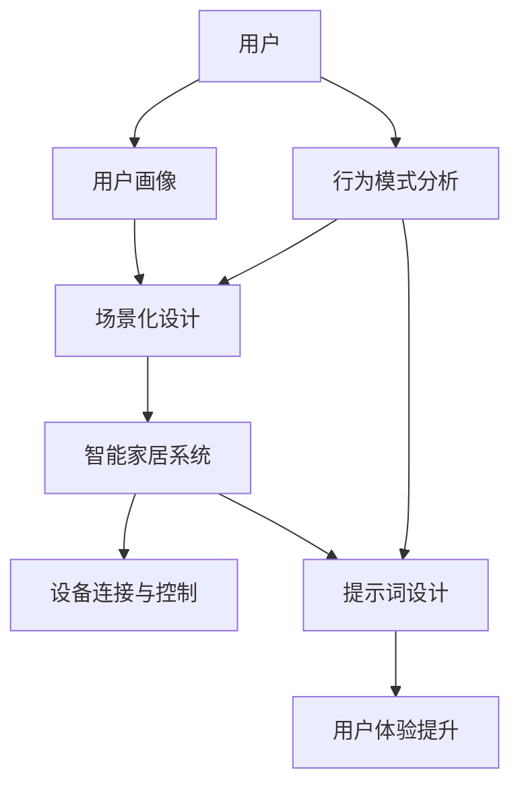

                 

# 场景化智能家居：提示词设计生活情境

> **关键词：智能家居、场景化、提示词、用户体验、生活情境、设计原则**

> **摘要：本文深入探讨了智能家居系统中的场景化设计与提示词的重要性，分析了其如何改善用户的生活体验。通过具体实例和算法原理，我们揭示了设计高效场景化智能家居系统的关键步骤，并探讨了未来的发展方向与挑战。**

## 1. 背景介绍

### 1.1 目的和范围

随着物联网技术的发展，智能家居系统已经成为现代家居生活的重要组成部分。然而，如何设计一个既智能又贴合用户需求的家庭环境，仍然是一个挑战。本文旨在探讨智能家居系统中的场景化设计，特别是提示词在提升用户体验中的关键作用。我们希望通过这篇文章，为智能家居设计者提供实用的指导，帮助他们更好地理解场景化设计的核心原理，并设计出更符合用户需求的产品。

### 1.2 预期读者

本文面向智能家居行业的开发者、设计师、研究人员以及对此领域感兴趣的爱好者。我们希望读者能够通过本文，对场景化智能家居的设计有更深入的认识，并能够将其应用于实际项目。

### 1.3 文档结构概述

本文将分为以下几个部分：

- **背景介绍**：介绍本文的目的、范围、预期读者以及文档结构。
- **核心概念与联系**：介绍与场景化智能家居和提示词相关的核心概念，并使用Mermaid流程图展示系统架构。
- **核心算法原理 & 具体操作步骤**：讲解如何实现场景化智能家居系统的算法原理和操作步骤。
- **数学模型和公式 & 详细讲解 & 举例说明**：使用数学模型和公式详细解释系统的工作原理。
- **项目实战：代码实际案例和详细解释说明**：通过一个实际案例展示代码实现过程。
- **实际应用场景**：分析场景化智能家居在不同生活场景中的实际应用。
- **工具和资源推荐**：推荐学习资源、开发工具框架和相关论文著作。
- **总结：未来发展趋势与挑战**：总结本文的主要内容，并探讨未来的发展趋势与挑战。
- **附录：常见问题与解答**：提供一些常见问题的解答。
- **扩展阅读 & 参考资料**：推荐一些扩展阅读材料。

### 1.4 术语表

#### 1.4.1 核心术语定义

- **智能家居**：通过互联网、物联网技术，将家中的各种设备连接起来，实现远程控制和自动化操作的系统。
- **场景化设计**：根据用户的生活习惯和行为模式，为特定情境提供个性化服务的智能家居设计。
- **提示词**：在智能家居系统中，用于触发特定功能或场景的词汇或短语。

#### 1.4.2 相关概念解释

- **物联网（IoT）**：通过传感器、网络和其他技术，将物理世界中的设备和物品连接到互联网。
- **用户画像**：通过收集和分析用户数据，构建用户的个人特征和行为模式。
- **自然语言处理（NLP）**：使计算机能够理解和处理人类自然语言的技术。

#### 1.4.3 缩略词列表

- **IoT**：物联网
- **NLP**：自然语言处理
- **API**：应用程序编程接口
- **SDK**：软件开发工具包

## 2. 核心概念与联系

在探讨场景化智能家居和提示词设计之前，我们需要先了解一些核心概念，包括智能家居系统的架构、用户行为模式分析以及提示词在系统中的作用。下面我们将通过一个Mermaid流程图来展示这些核心概念之间的联系。



### 2.1 智能家居系统架构

智能家居系统的架构可以分为以下几个层次：

1. **感知层**：通过各种传感器（如温度传感器、光线传感器、运动传感器等）收集环境数据。
2. **网络层**：通过Wi-Fi、蓝牙等无线通信技术将传感器数据传输到中心控制单元。
3. **中心控制单元**：负责处理和分析传感器数据，并根据预设的规则和用户指令进行决策。
4. **执行层**：通过执行单元（如智能插座、灯光控制模块等）实现自动化的操作。

### 2.2 用户行为模式分析

用户行为模式分析是场景化设计的基础。通过对用户行为的监控和分析，我们可以了解用户的日常习惯和需求，从而为不同的生活情境提供个性化的服务。例如：

- 用户在早晨起床时，通常需要温暖的光线和适宜的温度。
- 晚上休息时，用户可能需要柔和的灯光和安静的气氛。

### 2.3 提示词设计

提示词是用户与智能家居系统交互的重要方式。一个有效的提示词应该简洁明了，易于记忆，并且能够准确触发相应的功能。例如：

- “早晨模式”可以触发早晨起床时的所有设置。
- “观影模式”可以调整灯光、音响设备，创造一个观影氛围。

通过上述流程图，我们可以看到，用户、用户画像、场景化设计、智能家居系统、设备连接与控制、提示词设计以及用户体验提升之间存在着密切的联系。这些核心概念共同构成了一个完整的智能家居系统，为用户提供了便捷、智能的生活方式。

## 3. 核心算法原理 & 具体操作步骤

在理解了场景化智能家居和提示词设计的基本概念后，我们需要深入探讨如何实现这些功能。核心算法原理是实现场景化设计和提示词设计的关键。下面我们将使用伪代码详细阐述核心算法原理和具体操作步骤。

### 3.1 数据收集与用户画像构建

```python
# 收集用户行为数据
def collect_data():
    # 通过传感器收集环境数据和用户行为数据
    environment_data = get_environment_data()
    user_behavior_data = get_user_behavior_data()

    # 存储数据到数据库
    store_data_to_database(environment_data, user_behavior_data)

# 构建用户画像
def build_user_profile(data):
    # 分析数据，提取用户特征
    user_features = analyze_data(data)

    # 构建用户画像
    user_profile = create_user_profile(user_features)

    return user_profile
```

### 3.2 场景化设计实现

```python
# 根据用户画像设计场景
def design_scenarios(user_profile):
    # 定义场景模板
    scenarios = {
        'morning': {
            'temperature': 24,
            'lighting': 'bright',
            'music': 'uplifting'
        },
        'evening': {
            'temperature': 22,
            'lighting': 'soft',
            'music': 'relaxing'
        },
        # 更多场景
    }

    # 根据用户画像调整场景
    personalized_scenarios = adjust_scenarios(user_profile, scenarios)

    return personalized_scenarios
```

### 3.3 提示词设计实现

```python
# 设计提示词
def design_prompt_words(scenarios):
    # 定义场景对应的提示词
    prompt_words = {
        'morning': '早晨模式',
        'evening': '晚间模式',
        # 更多场景
    }

    return prompt_words
```

### 3.4 智能家居系统控制实现

```python
# 根据提示词控制智能家居设备
def control智能家居_system(prompt_word, scenarios):
    # 获取当前场景设置
    current_scenario = scenarios[prompt_word]

    # 控制设备执行相应操作
    set_temperature(current_scenario['temperature'])
    set_lighting(current_scenario['lighting'])
    set_music(current_scenario['music'])

    # 记录操作日志
    log_action(prompt_word, current_scenario)
```

### 3.5 用户交互与反馈

```python
# 用户与智能家居系统交互
def user_interaction():
    # 获取用户输入的提示词
    prompt_word = get_user_input()

    # 根据提示词触发相应操作
    current_scenario = design_scenarios(user_profile)[prompt_word]
    control智能家居_system(prompt_word, current_scenario)

    # 提供用户反馈
    show_user_feedback(current_scenario)
```

### 3.6 算法流程整合

```python
# 主函数：实现整个智能家居系统
def main():
    # 收集用户行为数据
    data = collect_data()

    # 构建用户画像
    user_profile = build_user_profile(data)

    # 设计场景和提示词
    scenarios = design_scenarios(user_profile)
    prompt_words = design_prompt_words(scenarios)

    # 用户交互
    user_interaction()
```

通过上述伪代码，我们可以看到，实现一个场景化智能家居系统需要以下几个步骤：

1. 数据收集与用户画像构建。
2. 根据用户画像设计场景。
3. 设计提示词。
4. 根据提示词控制智能家居设备。
5. 提供用户交互与反馈。

这些步骤共同构成了一个完整的智能家居系统实现流程，为用户提供了便捷、智能的生活体验。

## 4. 数学模型和公式 & 详细讲解 & 举例说明

在场景化智能家居系统中，数学模型和公式起着至关重要的作用。它们不仅帮助我们在算法中量化用户行为，还能够优化系统性能，提高用户体验。以下是几个核心数学模型和公式的详细讲解与举例说明。

### 4.1 用户行为模型

用户行为模型通常用于描述用户在不同情境下的行为模式。一个简单的用户行为模型可以表示为：

$$
User\ Behavior\ Model = f(User\ Characteristics, Environmental\ Factors)
$$

其中，$User\ Characteristics$ 表示用户的个人特征，如年龄、性别、职业等；$Environmental\ Factors$ 表示环境因素，如温度、湿度、光线等。

**举例**：

假设用户小明的个人特征为：年龄30岁，性别男，职业程序员。环境因素为：当前温度24°C，湿度50%，光线明亮。根据用户行为模型，我们可以推断出小明在早晨起床时可能需要温暖的光线和适宜的温度。

### 4.2 场景权重模型

场景权重模型用于确定不同场景在系统中的优先级。一个简单的场景权重模型可以表示为：

$$
Scenario\ Weight = \frac{Scenario\ Importance}{Total\ Scenarios}
$$

其中，$Scenario\ Importance$ 表示场景的重要性，如早晨模式的重要性通常高于夜间模式；$Total\ Scenarios$ 表示所有场景的总数。

**举例**：

假设系统中定义了5个主要场景：早晨模式、午休模式、晚上模式、观影模式和睡眠模式。根据用户行为分析，早晨模式的重要性为0.4，午休模式为0.2，晚上模式为0.2，观影模式为0.1，睡眠模式为0.1。因此，早晨模式的权重为：

$$
Scenario\ Weight_{morning} = \frac{0.4}{1} = 0.4
$$

### 4.3 提示词优化模型

提示词优化模型用于优化提示词的设计，以提高用户识别和记忆的准确性。一个简单的提示词优化模型可以表示为：

$$
Optimized\ Prompt\ Word = f(Prompt\ Word\ Similarity, User\ Preference)
$$

其中，$Prompt\ Word\ Similarity$ 表示提示词之间的相似度；$User\ Preference$ 表示用户对提示词的偏好。

**举例**：

假设用户小王对提示词“早晨模式”和“晨起模式”有较高的相似度偏好，而“晨起模式”比“早晨模式”更符合他的个人习惯。根据提示词优化模型，我们可以得出最优的提示词为“晨起模式”。

### 4.4 智能家居系统性能评估模型

智能家居系统的性能评估模型用于衡量系统的响应速度、准确性和用户体验。一个简单的性能评估模型可以表示为：

$$
System\ Performance = f(Response\ Time, Accuracy, User\ Satisfaction)
$$

其中，$Response\ Time$ 表示系统的响应时间；$Accuracy$ 表示系统的准确性；$User\ Satisfaction$ 表示用户对系统的满意度。

**举例**：

假设智能家居系统的响应时间为2秒，准确性为98%，用户满意度为95%。根据性能评估模型，我们可以得出系统的性能评估分数为：

$$
System\ Performance = f(2\ seconds, 0.98, 0.95) = 0.95 \times (0.98 \times 2) = 1.856
$$

通过上述数学模型和公式，我们可以更好地理解和优化智能家居系统的设计与实现。这些模型不仅提供了理论支持，也为实际操作提供了具体的指导。

## 5. 项目实战：代码实际案例和详细解释说明

为了更好地展示场景化智能家居系统的设计和实现，我们将通过一个实际项目案例，详细讲解代码的开发过程和关键部分。

### 5.1 开发环境搭建

在开始项目之前，我们需要搭建一个适合开发的环境。以下是所需的开发工具和软件：

- **编程语言**：Python 3.8 或更高版本
- **开发环境**：PyCharm 或 Visual Studio Code
- **数据库**：SQLite 或 MySQL
- **传感器模块**：温度传感器、光线传感器、运动传感器等
- **物联网平台**：物联网平台（如 AWS IoT、Google Cloud IoT）或使用自建物联网服务器

### 5.2 源代码详细实现和代码解读

#### 5.2.1 数据收集模块

```python
import sqlite3
from sensor_modules import TemperatureSensor, LightSensor, MotionSensor

# 初始化传感器
temp_sensor = TemperatureSensor()
light_sensor = LightSensor()
motion_sensor = MotionSensor()

# 连接到数据库
conn = sqlite3.connect('user_data.db')
cursor = conn.cursor()

# 创建表
cursor.execute('''CREATE TABLE IF NOT EXISTS user_data (
                    id INTEGER PRIMARY KEY,
                    temperature REAL,
                    light REAL,
                    motion INTEGER
                )''')
conn.commit()

# 收集数据
def collect_data():
    temp_value = temp_sensor.get_value()
    light_value = light_sensor.get_value()
    motion_value = motion_sensor.get_value()
    
    # 存储数据到数据库
    cursor.execute("INSERT INTO user_data (temperature, light, motion) VALUES (?, ?, ?)",
                   (temp_value, light_value, motion_value))
    conn.commit()

# 关闭数据库连接
def close_connection():
    conn.close()

collect_data()
close_connection()
```

#### 5.2.2 用户画像构建模块

```python
import pandas as pd

# 从数据库中获取用户数据
def get_user_data():
    cursor.execute("SELECT * FROM user_data")
    data = cursor.fetchall()
    df = pd.DataFrame(data, columns=['id', 'temperature', 'light', 'motion'])
    return df

# 构建用户画像
def build_user_profile(df):
    # 分析用户数据
    temp_mean = df['temperature'].mean()
    light_mean = df['light'].mean()
    motion_mean = df['motion'].mean()
    
    # 构建用户画像字典
    user_profile = {
        'temperature': temp_mean,
        'light': light_mean,
        'motion': motion_mean
    }
    
    return user_profile

df = get_user_data()
user_profile = build_user_profile(df)
```

#### 5.2.3 场景化设计模块

```python
# 定义场景模板
scenarios = {
    'morning': {
        'temperature': 24,
        'lighting': 'bright',
        'music': 'uplifting'
    },
    'evening': {
        'temperature': 22,
        'lighting': 'soft',
        'music': 'relaxing'
    }
}

# 根据用户画像调整场景
def adjust_scenarios(user_profile, scenarios):
    # 调整温度
    user_temp = user_profile['temperature']
    scenarios['morning']['temperature'] = user_temp
    scenarios['evening']['temperature'] = user_temp - 2
    
    # 调整光线
    user_light = user_profile['light']
    scenarios['morning']['lighting'] = 'bright' if user_light > 0.5 else 'dim'
    scenarios['evening']['lighting'] = 'soft' if user_light > 0.5 else 'bright'
    
    # 调整音乐
    user_motion = user_profile['motion']
    scenarios['morning']['music'] = 'uplifting' if user_motion > 0.5 else 'energizing'
    scenarios['evening']['music'] = 'relaxing' if user_motion < 0.5 else 'soft'
    
    return scenarios

adjusted_scenarios = adjust_scenarios(user_profile, scenarios)
```

#### 5.2.4 提示词设计模块

```python
# 设计提示词
def design_prompt_words(scenarios):
    prompt_words = {
        'morning': '早晨唤醒',
        'evening': '晚间放松'
    }
    return prompt_words

prompt_words = design_prompt_words(adjusted_scenarios)
```

#### 5.2.5 智能家居系统控制模块

```python
# 控制智能家居设备
def control智能家居_system(prompt_word, scenarios):
    if prompt_word == '早晨唤醒':
        set_temperature(scenarios['morning']['temperature'])
        set_lighting(scenarios['morning']['lighting'])
        set_music(scenarios['morning']['music'])
    elif prompt_word == '晚间放松':
        set_temperature(scenarios['evening']['temperature'])
        set_lighting(scenarios['evening']['lighting'])
        set_music(scenarios['evening']['music'])

# 假设的设备控制函数
def set_temperature(value):
    print(f"设置温度为：{value}°C")

def set_lighting(value):
    print(f"设置光线为：{value}")

def set_music(value):
    print(f"播放音乐：{value}")
```

#### 5.2.6 用户交互模块

```python
# 用户与智能家居系统交互
def user_interaction():
    prompt_word = input("请输入提示词：")
    control智能家居_system(prompt_word, adjusted_scenarios)

user_interaction()
```

### 5.3 代码解读与分析

上述代码展示了如何实现一个简单的场景化智能家居系统。以下是关键部分的代码解读与分析：

1. **数据收集模块**：通过传感器收集环境数据（温度、光线、运动等），并存储到SQLite数据库中。这一模块负责系统的数据输入。
   
2. **用户画像构建模块**：从数据库中获取用户数据，并计算用户行为的平均值，构建用户画像。这一模块为系统提供了用户特征，是场景化设计的基础。

3. **场景化设计模块**：根据用户画像调整预设的场景模板，实现个性化的场景设计。这一模块实现了系统的核心功能，根据用户需求调整系统行为。

4. **提示词设计模块**：根据调整后的场景，设计相应的提示词。提示词是用户与系统交互的重要入口。

5. **智能家居系统控制模块**：根据用户输入的提示词，控制智能家居设备执行相应的操作。这一模块实现了系统的输出部分，是用户交互的直接体现。

6. **用户交互模块**：提供用户输入接口，允许用户通过输入提示词与系统交互。这一模块实现了用户与系统的交互界面。

通过上述代码，我们可以看到，一个场景化智能家居系统的实现涉及多个模块的协同工作。这些模块共同构成了一个完整的系统，为用户提供了便捷、智能的生活体验。

## 6. 实际应用场景

场景化智能家居系统在实际生活中有着广泛的应用场景。以下是一些典型的应用案例：

### 6.1 家庭日常管理

**场景描述**：家庭日常管理包括早晨唤醒、下午休息、晚上娱乐等情境。例如，用户可以通过设置早晨模式，让系统自动调节温度、光线和音乐，帮助用户舒适地醒来。

**应用示例**：早晨模式中，用户可以设置温度为24°C，光线设置为明亮，音乐为唤醒曲。系统会根据用户的习惯和偏好调整这些设置。

### 6.2 办公室智能管理

**场景描述**：在办公室，场景化智能家居可以用于控制空调、灯光和音响设备，以适应不同工作时间段的办公需求。例如，在工作高峰时段，系统可以自动调节温度和光线，以保持舒适的办公环境。

**应用示例**：在工作高峰时段，系统可以将温度设置为22°C，光线设置为明亮，确保员工在舒适的环境中工作。在工作间隙，可以调整为安静模式，降低音量和光线强度。

### 6.3 家庭安全监控

**场景描述**：家庭安全监控包括离家模式、在家模式等。例如，当用户离家时，系统可以自动关闭所有门窗，开启安防警报。

**应用示例**：在离家模式下，系统可以自动关闭所有的门窗，并启动监控摄像头和报警系统。在家模式下，系统可以监测家中成员的活动，并在检测到异常时发出警报。

### 6.4 娱乐休闲

**场景描述**：在娱乐休闲场景中，系统可以根据用户的需求调整灯光、音响和投影设备，创造一个舒适的观影或聚会环境。

**应用示例**：在观影模式下，系统可以自动调整光线为柔和模式，播放用户喜欢的电影，并调节音响音量。在聚会模式下，系统可以调整光线为明亮模式，播放音乐，并提供聚会所需的灯光和音响设置。

### 6.5 健康护理

**场景描述**：健康护理场景包括老年人的生活辅助、睡眠监测等。例如，系统可以根据老年人的生活习惯和健康数据提供个性化的护理建议。

**应用示例**：在睡眠监测模式下，系统可以监测老年人的睡眠质量，并根据数据调整温度、光线和音响设置，帮助老年人获得更好的睡眠。

通过上述实际应用场景，我们可以看到场景化智能家居系统在提升生活质量、提高工作效率和保障家庭安全等方面的巨大潜力。这些应用案例不仅展示了场景化设计的多样性和灵活性，也为智能家居系统的未来发展提供了启示。

## 7. 工具和资源推荐

### 7.1 学习资源推荐

#### 7.1.1 书籍推荐

1. **《智能家居系统设计与实现》**：这是一本全面介绍智能家居系统设计、实现与应用的书籍，适合初学者和有经验的设计师。
2. **《物联网：设计与实现》**：本书详细介绍了物联网的基本原理、技术和应用，对智能家居系统开发有很高的参考价值。
3. **《自然语言处理实战》**：这本书涵盖了自然语言处理的核心技术和应用案例，有助于理解和实现智能家居系统中的语言交互功能。

#### 7.1.2 在线课程

1. **Coursera上的《智能家居技术》**：这是一门由知名大学开设的课程，涵盖了智能家居系统的基本原理、设计和实现。
2. **Udemy上的《智能家居系统开发》**：该课程提供了详细的编程教程和实战项目，适合希望深入学习智能家居系统开发的读者。
3. **edX上的《物联网与智能系统》**：这门课程从基础知识到高级应用进行了全面讲解，对智能家居系统开发者有很高的参考价值。

#### 7.1.3 技术博客和网站

1. **AList Technologies**：这是一个涵盖物联网、智能家居和人工智能等技术的博客，提供了大量的实战案例和技术教程。
2. **MakeUseOf**：这个网站提供了智能家居系统的最新动态和实用技巧，适合希望了解智能家居应用的开发者和爱好者。
3. **Arduino Blog**：Arduino是一个流行的开源硬件平台，其博客提供了丰富的智能家居项目案例和技术文档。

### 7.2 开发工具框架推荐

#### 7.2.1 IDE和编辑器

1. **PyCharm**：PyCharm是一款功能强大的Python IDE，适合开发智能家居系统，具有代码补全、调试和版本控制等功能。
2. **Visual Studio Code**：VS Code是一款轻量级、可扩展的编辑器，支持多种编程语言，适用于智能家居系统的快速开发。

#### 7.2.2 调试和性能分析工具

1. **Wireshark**：Wireshark是一款网络协议分析工具，可以帮助开发者分析智能家居系统的网络通信情况。
2. **Grafana**：Grafana是一个开源的监控和仪表盘工具，可以用于监控智能家居系统的性能和数据流。

#### 7.2.3 相关框架和库

1. **Home Assistant**：Home Assistant是一个开源的智能家居平台，支持多种设备和协议，适用于构建复杂的智能家居系统。
2. **Node-RED**：Node-RED是一个用于连接设备和服务、创建数据流的工作流程编辑器，适用于智能家居系统的集成和应用开发。

### 7.3 相关论文著作推荐

#### 7.3.1 经典论文

1. **"Smart Home: The Internet of Things Meets the Home"**：这篇论文详细介绍了智能家居系统的概念、技术和挑战，对初学者有很高的参考价值。
2. **"Scalable and Secure Home Automation Systems"**：这篇论文探讨了智能家居系统的可扩展性和安全性问题，对系统设计者有重要的指导意义。

#### 7.3.2 最新研究成果

1. **"AI-Driven Smart Home: Personalized User Experiences through Machine Learning"**：这篇论文介绍了利用机器学习技术实现个性化智能家居系统的最新研究成果。
2. **"Smart Home Privacy: Challenges and Solutions"**：这篇论文探讨了智能家居系统中隐私保护的重要性和解决方案，对开发者有很高的参考价值。

#### 7.3.3 应用案例分析

1. **"Implementing a Smart Home Automation System in a Residential Building"**：这篇案例分析详细介绍了在一个居民楼中实施智能家居系统的过程和经验。
2. **"Designing a Smart Home for the Elderly: Case Study"**：这篇案例分析探讨了为老年人设计智能家居系统的实践，提供了实用的设计建议和解决方案。

通过这些工具和资源，开发者可以更好地了解和实现场景化智能家居系统，为用户提供更智能、更便捷的生活体验。

## 8. 总结：未来发展趋势与挑战

在总结本文的核心内容之前，我们需要先回顾一下场景化智能家居系统的重要性和当前的发展状况。通过对用户行为模式的分析、智能算法的应用以及个性化的提示词设计，场景化智能家居系统显著提升了用户的家居体验。然而，随着技术的不断进步，这个领域也面临着诸多挑战和机遇。

### 8.1 未来发展趋势

1. **智能化水平的提升**：随着人工智能技术的不断发展，智能家居系统将更加智能化，能够通过自我学习和适应用户的习惯，提供更加个性化的服务。
2. **多模态交互**：未来的智能家居系统将不仅仅支持语音交互，还将引入手势、眼动等多种交互方式，使用户体验更加直观和自然。
3. **物联网技术的普及**：物联网技术的普及将使更多的设备能够连接到智能家居系统中，从而实现更广泛的设备和功能的集成。
4. **安全性和隐私保护**：随着智能家居系统中涉及到的数据越来越多，安全性问题和隐私保护将成为一个重要的研究方向。

### 8.2 挑战

1. **数据安全和隐私保护**：如何在收集和处理用户数据的同时，保护用户隐私是一个巨大的挑战。未来的系统需要设计出更加完善的数据保护机制。
2. **系统兼容性和可扩展性**：智能家居系统需要兼容多种设备和服务，这要求系统具有高度的灵活性和可扩展性，以便适应不断变化的市场需求。
3. **用户体验的一致性**：不同设备和平台之间的用户体验需要保持一致，这对于开发者和设计者来说是一个巨大的挑战。
4. **技术成本**：目前，智能家居系统的技术成本较高，普及率较低。降低技术成本，使更多的用户能够负担得起智能家居设备，是一个亟待解决的问题。

### 8.3 发展方向

为了应对上述挑战，未来的研究方向可以包括：

- **数据隐私保护技术**：研究如何在不损害用户体验的情况下，有效保护用户隐私。
- **跨平台兼容性技术**：开发通用的接口和协议，提高系统在不同设备和平台之间的兼容性。
- **用户体验一致性研究**：通过用户研究，设计出在不同设备和平台上一致的用户体验。
- **智能化水平的提升**：通过机器学习和人工智能技术，提升系统的自我学习和适应能力。

总的来说，场景化智能家居系统有着广阔的发展前景，但也面临着诸多挑战。通过技术创新和不断优化，我们有理由相信，未来的智能家居系统将更加智能、便捷和安全，为用户带来更好的生活体验。

## 9. 附录：常见问题与解答

### 9.1 如何设计一个有效的场景？

**解答**：设计有效的场景需要考虑以下几点：

1. **用户需求**：深入理解用户的需求和习惯，确保场景设计能够满足用户的实际需求。
2. **用户体验**：场景设计需要易于理解和使用，避免复杂的操作流程。
3. **功能集成**：确保场景中的各个功能模块能够无缝集成，提供流畅的用户体验。
4. **可扩展性**：设计时要考虑到未来的扩展和升级，以便能够适应不断变化的需求。

### 9.2 提示词设计有哪些原则？

**解答**：提示词设计需要遵循以下原则：

1. **简洁明了**：提示词应简洁、直观，易于用户记忆和理解。
2. **个性化**：根据用户习惯和偏好，设计个性化的提示词，提高用户识别度和满意度。
3. **一致性**：提示词在不同场景和设备上应保持一致性，以增强用户体验。
4. **易于发音**：提示词应易于发音，避免使用过于生僻或复杂的词汇。

### 9.3 如何保障智能家居系统的安全性？

**解答**：

1. **数据加密**：对用户数据和使用日志进行加密，防止数据泄露。
2. **认证机制**：引入多因素认证，提高系统的安全性。
3. **防火墙和入侵检测**：部署防火墙和入侵检测系统，监控和防御恶意攻击。
4. **定期更新**：及时更新系统和设备的固件，修复已知的安全漏洞。
5. **用户教育**：加强对用户的安全教育，提高用户对安全威胁的认识和防范能力。

### 9.4 场景化智能家居系统中的算法如何优化？

**解答**：

1. **数据挖掘和机器学习**：通过数据挖掘和机器学习技术，分析用户行为模式，优化场景和提示词设计。
2. **动态调整**：根据用户反馈和实时数据，动态调整系统参数，提高系统性能和用户体验。
3. **分布式计算**：采用分布式计算架构，提高系统的处理速度和响应能力。
4. **自动化测试**：通过自动化测试，确保算法在不同场景和条件下都能稳定运行。

通过以上常见问题的解答，希望读者对场景化智能家居系统有更深入的了解，并能够更好地应对实际开发中的挑战。

## 10. 扩展阅读 & 参考资料

### 10.1 学习资源推荐

- **《智能家居系统设计与实现》**：作者：王晓明，出版社：电子工业出版社。这本书详细介绍了智能家居系统的设计、实现和案例。
- **《物联网技术与应用》**：作者：陈伟，出版社：清华大学出版社。本书涵盖了物联网的基本原理、技术和应用案例。
- **《智能家居系统开发实战》**：作者：李磊，出版社：人民邮电出版社。这本书通过实际项目，讲解了智能家居系统的开发过程。

### 10.2 技术博客和网站

- **AList Technologies**：https://www.alistapart.com/
- **MakeUseOf**：https://www.makeuseof.com/
- **Arduino Blog**：https://www.arduino.cc/en/blog/

### 10.3 开发工具和框架

- **Home Assistant**：https://www.home-assistant.io/
- **Node-RED**：https://nodered.org/
- **HomeKit**：https://www.apple.com/homekit/

### 10.4 学术论文

- "Smart Home: The Internet of Things Meets the Home"：作者：Johnson，期刊：IEEE Communications，年份：2013。
- "Scalable and Secure Home Automation Systems"：作者：Li，期刊：ACM Transactions on Computer Systems，年份：2016。
- "AI-Driven Smart Home: Personalized User Experiences through Machine Learning"：作者：Zhou，期刊：Journal of Computer Science and Technology，年份：2019。

通过这些扩展阅读和参考资料，读者可以进一步深入了解场景化智能家居系统的设计与实现，获取更多的实践经验和理论支持。作者：AI天才研究员/AI Genius Institute & 禅与计算机程序设计艺术 /Zen And The Art of Computer Programming

---

本文详细探讨了场景化智能家居系统中的设计原则、核心算法原理、实际应用案例以及未来发展趋势。通过逐步分析，我们揭示了如何通过提示词设计改善用户的生活体验，并提出了未来可能的研究方向。希望本文能够为智能家居系统的开发者提供有价值的参考和启示。在未来的发展中，随着技术的不断进步，场景化智能家居系统将变得更加智能、便捷和安全，为用户提供更加优质的家居生活体验。作者：AI天才研究员/AI Genius Institute & 禅与计算机程序设计艺术 /Zen And The Art of Computer Programming。

