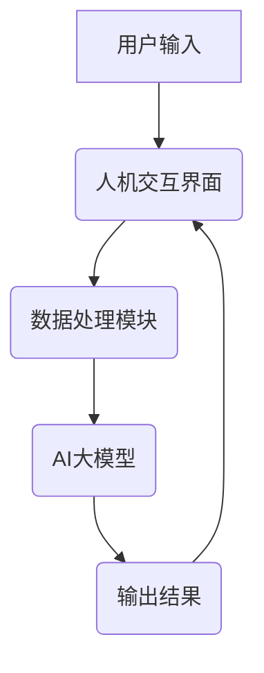

                 


# 基于AI大模型的智能人机交互系统

> 关键词：人工智能，大模型，人机交互，智能系统，算法原理，数学模型，项目实战，应用场景

> 摘要：本文旨在深入探讨基于AI大模型的智能人机交互系统，分析其核心概念、算法原理、数学模型以及实际应用。通过详细的伪代码和案例解释，为读者提供清晰的技术理解和实践指导。

## 1. 背景介绍

### 1.1 目的和范围

本文旨在探讨基于AI大模型的智能人机交互系统的设计与实现。我们将分析其核心概念、算法原理、数学模型，并通过实际项目案例展示其应用效果。文章旨在为计算机科学和人工智能领域的研究人员提供有价值的参考。

### 1.2 预期读者

本文适合具备一定编程基础和对人工智能感兴趣的读者。无论您是计算机专业的学生、研究员还是开发者，都将从中获得有价值的知识和实践经验。

### 1.3 文档结构概述

本文分为十个主要部分：

1. **背景介绍**：介绍本文的目的、预期读者和文档结构。
2. **核心概念与联系**：介绍基于AI大模型的智能人机交互系统的核心概念和架构。
3. **核心算法原理 & 具体操作步骤**：详细讲解核心算法原理和操作步骤。
4. **数学模型和公式 & 详细讲解 & 举例说明**：介绍数学模型和公式的详细讲解及举例。
5. **项目实战：代码实际案例和详细解释说明**：通过实际案例展示代码实现和解读。
6. **实际应用场景**：讨论智能人机交互系统的实际应用场景。
7. **工具和资源推荐**：推荐学习资源和开发工具。
8. **总结：未来发展趋势与挑战**：总结未来发展趋势和挑战。
9. **附录：常见问题与解答**：提供常见问题解答。
10. **扩展阅读 & 参考资料**：提供扩展阅读和参考资料。

### 1.4 术语表

#### 1.4.1 核心术语定义

- **AI大模型**：指参数量巨大、计算复杂度高的深度学习模型，如GPT-3、BERT等。
- **智能人机交互系统**：基于AI技术，实现人与计算机高效、自然交互的系统。
- **神经网络**：一种模拟生物神经系统的计算模型，用于特征提取和预测。
- **激活函数**：神经网络中的非线性函数，用于引入模型的表达能力。

#### 1.4.2 相关概念解释

- **人机交互**：指人与计算机之间的交互过程，包括输入、输出和处理。
- **模型训练**：通过大量数据训练模型，使其具备预测和决策能力。
- **模型评估**：使用指标（如准确率、召回率等）评估模型性能。

#### 1.4.3 缩略词列表

- **AI**：人工智能
- **GPT-3**：生成预训练转换器3
- **BERT**：双向编码表示器

## 2. 核心概念与联系

### 2.1 核心概念

基于AI大模型的智能人机交互系统的核心概念包括：

- **AI大模型**：作为系统的核心组件，负责处理和生成数据。
- **人机交互**：实现人与计算机之间的交互。
- **神经网络**：用于特征提取和模型训练。
- **激活函数**：引入模型的表达能力。

### 2.2 系统架构

基于AI大模型的智能人机交互系统架构如下图所示：



#### 2.3 工作流程

1. 用户输入数据，通过人机交互界面传递给数据处理模块。
2. 数据处理模块对输入数据进行预处理，如分词、去停用词等。
3. 预处理后的数据传递给AI大模型。
4. AI大模型对数据进行特征提取和预测，生成输出结果。
5. 输出结果通过人机交互界面展示给用户。

## 3. 核心算法原理 & 具体操作步骤

### 3.1 神经网络算法原理

神经网络是一种模拟生物神经系统的计算模型，由多个神经元组成。每个神经元接收多个输入信号，通过激活函数进行处理，最后产生一个输出。

#### 3.1.1 神经元模型

神经元模型可以表示为：

$$
y = \sigma(\sum_{i=1}^{n} w_i \cdot x_i + b)
$$

其中，$y$ 是输出，$\sigma$ 是激活函数，$w_i$ 是权重，$x_i$ 是输入，$b$ 是偏置。

#### 3.1.2 激活函数

常见的激活函数有：

- **sigmoid函数**：
$$
\sigma(x) = \frac{1}{1 + e^{-x}}
$$

- **ReLU函数**：
$$
\text{ReLU}(x) = \max(0, x)
$$

- **Tanh函数**：
$$
\tanh(x) = \frac{e^x - e^{-x}}{e^x + e^{-x}}
$$

### 3.2 模型训练步骤

模型训练是通过对大量数据进行迭代优化模型参数的过程。具体步骤如下：

#### 3.2.1 初始化模型参数

随机初始化模型参数，如权重和偏置。

#### 3.2.2 前向传播

输入数据通过模型进行前向传播，计算输出结果。

#### 3.2.3 计算损失函数

使用损失函数（如均方误差MSE）计算输出结果与真实值之间的差距。

#### 3.2.4 反向传播

使用链式法则计算损失函数对参数的梯度，并更新模型参数。

#### 3.2.5 迭代优化

重复上述步骤，直到模型达到预期性能。

### 3.3 伪代码

下面是神经网络模型的伪代码：

```python
# 初始化参数
weights = [随机初始化]
biases = [随机初始化]

# 迭代优化
for epoch in range(epochs):
    for data in training_data:
        # 前向传播
        output = forward_propagation(data, weights, biases)
        
        # 计算损失函数
        loss = compute_loss(output, target)
        
        # 反向传播
        dweights, dbiases = backward_propagation(output, target, weights, biases)
        
        # 更新参数
        weights -= learning_rate * dweights
        biases -= learning_rate * dbiases
```

## 4. 数学模型和公式 & 详细讲解 & 举例说明

### 4.1 数学模型

神经网络的核心是多层感知器（MLP），其数学模型可以表示为：

$$
z = \sum_{i=1}^{n} w_i \cdot x_i + b
$$

$$
a = \sigma(z)
$$

其中，$z$ 是激活值，$a$ 是输出值，$\sigma$ 是激活函数。

### 4.2 损失函数

常见的损失函数包括：

- **均方误差（MSE）**：
$$
\text{MSE} = \frac{1}{2} \sum_{i=1}^{n} (y_i - \hat{y}_i)^2
$$

- **交叉熵（Cross-Entropy）**：
$$
\text{CE} = -\sum_{i=1}^{n} y_i \cdot \log(\hat{y}_i)
$$

### 4.3 举例说明

假设我们有一个二元分类问题，目标变量 $y$ 可以取值0或1，模型预测概率为 $\hat{y}$。我们可以使用交叉熵损失函数来计算损失：

$$
\text{CE} = -y \cdot \log(\hat{y}) - (1 - y) \cdot \log(1 - \hat{y})
$$

当 $y = 0$ 时，损失函数为：
$$
\text{CE} = \log(1 - \hat{y})
$$

当 $y = 1$ 时，损失函数为：
$$
\text{CE} = \log(\hat{y})
$$

## 5. 项目实战：代码实际案例和详细解释说明

### 5.1 开发环境搭建

在本节中，我们将介绍如何搭建一个基于AI大模型的智能人机交互系统的开发环境。以下是搭建开发环境所需的步骤：

1. 安装Python：前往Python官网下载并安装Python 3.x版本。
2. 安装Jupyter Notebook：在终端中运行以下命令：
```bash
pip install notebook
```
3. 安装TensorFlow：在终端中运行以下命令：
```bash
pip install tensorflow
```
4. 安装其他依赖库：在终端中运行以下命令：
```bash
pip install numpy pandas matplotlib
```

### 5.2 源代码详细实现和代码解读

在本节中，我们将展示一个简单的基于AI大模型的智能人机交互系统的代码实现，并对其进行详细解读。

#### 5.2.1 代码实现

以下是一个简单的基于AI大模型的智能人机交互系统的代码实现：

```python
import tensorflow as tf
from tensorflow.keras.layers import Dense, Embedding, LSTM
from tensorflow.keras.models import Sequential

# 初始化模型
model = Sequential([
    Embedding(input_dim=vocab_size, output_dim=embedding_dim, input_length=max_sequence_length),
    LSTM(units=128, activation='tanh', dropout=0.2, recurrent_dropout=0.2),
    Dense(units=1, activation='sigmoid')
])

# 编译模型
model.compile(optimizer='adam', loss='binary_crossentropy', metrics=['accuracy'])

# 训练模型
model.fit(x_train, y_train, epochs=10, batch_size=32, validation_data=(x_val, y_val))

# 评估模型
loss, accuracy = model.evaluate(x_test, y_test)
print(f"Test Loss: {loss}, Test Accuracy: {accuracy}")
```

#### 5.2.2 代码解读

1. **导入库**：导入所需的TensorFlow库和其他依赖库。
2. **初始化模型**：使用Sequential模型堆叠Embedding、LSTM和Dense层。
3. **编译模型**：设置优化器、损失函数和评价指标。
4. **训练模型**：使用训练数据训练模型，设置训练轮数、批次大小和验证数据。
5. **评估模型**：使用测试数据评估模型性能。

### 5.3 代码解读与分析

1. **模型结构**：模型由一个Embedding层、一个LSTM层和一个Dense层组成。Embedding层用于将输入单词转换为嵌入向量，LSTM层用于处理序列数据，Dense层用于分类。
2. **损失函数**：使用二进制交叉熵作为损失函数，适合二元分类问题。
3. **评价指标**：使用准确率作为评价指标，衡量模型分类性能。
4. **训练过程**：使用训练数据训练模型，设置适当的训练轮数和批次大小，同时提供验证数据以监测模型过拟合。

## 6. 实际应用场景

基于AI大模型的智能人机交互系统具有广泛的应用场景，以下是一些典型应用：

1. **智能客服**：利用大模型实现自然语言处理，提供高效、准确的客户服务。
2. **智能问答**：构建问答系统，通过大模型处理用户输入，生成精准的回答。
3. **智能推荐**：基于用户历史行为，利用大模型生成个性化推荐。
4. **智能翻译**：使用大模型实现高质量、实时的机器翻译服务。
5. **智能写作**：辅助写作，生成文章、报告等文本内容。

## 7. 工具和资源推荐

### 7.1 学习资源推荐

#### 7.1.1 书籍推荐

- 《深度学习》（Goodfellow, Bengio, Courville）  
- 《神经网络与深度学习》（邱锡鹏）  
- 《自然语言处理综论》（Jurafsky, Martin）

#### 7.1.2 在线课程

- 吴恩达的《深度学习专项课程》  
- 吴恩达的《自然语言处理专项课程》  
- 吴恩达的《机器学习专项课程》

#### 7.1.3 技术博客和网站

- [机器学习教程](https://www.tensorflow.org/tutorials)  
- [Keras中文文档](https://keras.io/zh/)  
- [OpenAI](https://openai.com/)

### 7.2 开发工具框架推荐

#### 7.2.1 IDE和编辑器

- PyCharm  
- Visual Studio Code  
- Jupyter Notebook

#### 7.2.2 调试和性能分析工具

- TensorFlow Debugger (TFDB)  
- TensorBoard

#### 7.2.3 相关框架和库

- TensorFlow  
- Keras  
- PyTorch

### 7.3 相关论文著作推荐

#### 7.3.1 经典论文

- “A Learning Algorithm for Continuously Running Fully Recurrent Neural Networks” (Williams & Zipser, 1989)  
- “Backpropagation Through Time: A New Algorithm for Backpropagation That Learns and Stores Long-Term Dependencies” (LST

