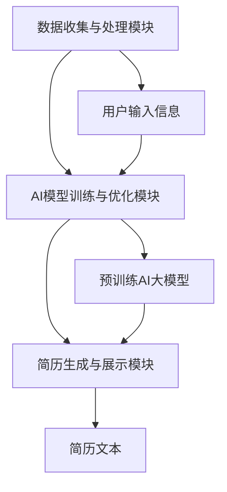

                 

# 基于AI大模型的自动化简历生成工具开发

## 关键词
* AI大模型
* 自动化简历生成
* 自然语言处理
* 算法原理
* 代码实战

## 摘要
本文将深入探讨如何利用AI大模型开发一个自动化简历生成工具。我们将首先介绍该工具的开发背景，核心概念，算法原理，并逐步引导读者理解并实现该工具。通过本文，读者不仅可以了解自动化简历生成工具的基本架构，还能掌握相关的算法和技术。这篇文章旨在为开发者提供一个全面的技术指南，以帮助他们在实际项目中应用这一技术。

## 1. 背景介绍

### 1.1 目的和范围
随着人工智能技术的迅猛发展，自然语言处理（NLP）技术得到了广泛的应用。自动化简历生成工具正是其中的一种典型应用，它能够高效地利用AI技术为求职者生成个性化的简历，极大地节省了人力资源。本文旨在详细介绍如何基于AI大模型开发一个自动化简历生成工具，为开发者提供一套完整的技术实现方案。

### 1.2 预期读者
本文适合对人工智能和自然语言处理有一定了解的技术爱好者、软件开发者和数据科学家。无论你是希望提升简历编写效率的职业人士，还是希望探索AI应用场景的开发者，本文都将成为你宝贵的参考资料。

### 1.3 文档结构概述
本文分为以下十个部分：

1. 背景介绍：介绍文章的目的、预期读者及文档结构。
2. 核心概念与联系：解释自动化简历生成工具所需的核心概念，并展示相关架构图。
3. 核心算法原理 & 具体操作步骤：详细讲解自动化简历生成工具的核心算法原理和操作步骤。
4. 数学模型和公式 & 详细讲解 & 举例说明：介绍相关的数学模型和公式，并给出具体的应用示例。
5. 项目实战：代码实际案例和详细解释说明。
6. 实际应用场景：探讨自动化简历生成工具的应用场景。
7. 工具和资源推荐：推荐相关的学习资源和开发工具。
8. 总结：未来发展趋势与挑战。
9. 附录：常见问题与解答。
10. 扩展阅读 & 参考资料：提供进一步的阅读材料和参考资料。

### 1.4 术语表

#### 1.4.1 核心术语定义
- **AI大模型**：指那些具有大规模参数、能够处理复杂任务的人工神经网络模型，如GPT-3、BERT等。
- **自然语言处理（NLP）**：涉及语言的理解、生成和交互的计算机科学分支，包括文本分类、命名实体识别、情感分析等。
- **简历生成**：利用AI技术根据用户的输入信息自动生成简历文本的过程。

#### 1.4.2 相关概念解释
- **模板匹配**：通过预定义的模板与用户输入信息进行匹配，以生成简历文本。
- **实体识别**：从文本中识别出具有特定意义的实体，如人名、职位、公司名等。

#### 1.4.3 缩略词列表
- **NLP**：自然语言处理
- **GPT-3**：生成预训练变换器3
- **BERT**：双向编码表示器

### 1.5 文章主题思想

本文将首先介绍自动化简历生成工具的开发背景，阐述其重要性及当前市场需求。随后，我们将深入探讨如何利用AI大模型，特别是GPT-3等模型，实现自动化简历生成。文章将详细讲解相关算法原理，并通过伪代码展示具体操作步骤。此外，我们将使用Mermaid流程图来展示核心概念和架构。文章还包含数学模型和公式的讲解，以及具体代码实战案例。最后，我们将探讨自动化简历生成工具的实际应用场景，并提供相关的学习资源和开发工具推荐。通过本文，读者将能够全面了解自动化简历生成工具的开发原理和实践，从而为实际项目提供技术支持。

## 2. 核心概念与联系

### 2.1 自动化简历生成工具的基本概念

自动化简历生成工具旨在通过人工智能技术，从用户提供的个人信息中自动生成格式规范、内容丰富的简历。这一工具的核心概念包括数据输入、模型训练和简历输出。首先，用户需要提供包括个人基本信息、教育经历、工作经历、技能和项目经历等在内的输入数据。然后，这些数据被传递给预训练的AI大模型进行处理。最后，模型根据输入数据生成符合行业规范的简历文本。

### 2.2 自动化简历生成工具的架构

为了实现自动化简历生成，我们需要构建一个完整的系统架构，该架构包括数据收集与处理模块、AI模型训练与优化模块、简历生成与展示模块。以下是自动化简历生成工具的架构图：



#### 2.2.1 数据收集与处理模块

数据收集与处理模块负责从用户处获取个人信息，并对这些信息进行清洗、格式化，确保其适用于AI模型。具体步骤包括：

1. **数据获取**：通过网页表单或API接口收集用户的个人信息。
2. **数据清洗**：删除无关数据、处理缺失值和异常值。
3. **数据格式化**：将数据转换成统一格式，如JSON或CSV。

#### 2.2.2 AI模型训练与优化模块

AI模型训练与优化模块负责使用收集到的数据对预训练的AI大模型进行微调，以提高简历生成的准确性。具体步骤包括：

1. **数据预处理**：对数据进行分词、词性标注等预处理。
2. **模型选择**：选择如GPT-3、BERT等适合的预训练模型。
3. **模型训练**：利用训练数据对模型进行训练。
4. **模型优化**：通过交叉验证等方法优化模型参数。

#### 2.2.3 简历生成与展示模块

简历生成与展示模块负责根据用户输入信息和应用场景，生成个性化的简历文本，并将其展示给用户。具体步骤包括：

1. **输入处理**：将用户输入的信息传递给训练好的模型。
2. **简历生成**：模型根据输入信息生成简历文本。
3. **文本格式化**：将生成的文本格式化为符合行业规范的简历格式。
4. **展示与导出**：将格式化的简历文本展示给用户，并提供导出功能。

### 2.3 自动化简历生成工具的核心算法原理

自动化简历生成工具的核心在于其AI模型，尤其是预训练的大规模语言模型如GPT-3。以下是核心算法原理的详细讲解：

#### 2.3.1 预训练模型

预训练模型通过在大规模文本语料库上进行预训练，学习到了丰富的语言模式和知识。对于自动化简历生成，预训练模型能够理解不同职位、公司、教育背景和技能等词汇的含义和用法。

#### 2.3.2 输入处理

输入处理是简历生成的重要步骤。在这一步中，我们将用户输入的信息进行分词和词性标注，将其转化为模型能够理解的序列数据。

#### 2.3.3 简历文本生成

在简历文本生成过程中，预训练模型根据输入序列生成对应的简历文本。这一过程是通过自回归语言模型实现的，模型会预测下一个词的概率，从而生成完整的文本。

#### 2.3.4 模型微调

为了提高简历生成的准确性，我们需要在预训练模型的基础上进行微调。微调过程涉及以下步骤：

1. **数据准备**：准备包含简历样例和用户输入信息的训练数据集。
2. **模型初始化**：初始化预训练模型，如GPT-3。
3. **训练**：在训练数据集上对模型进行训练，优化模型参数。
4. **评估与调整**：通过评估模型在测试数据集上的表现，调整模型参数，以达到最佳效果。

### 2.4 自动化简历生成工具的工作流程

自动化简历生成工具的工作流程可以分为以下步骤：

1. **用户输入**：用户在网页表单或API接口中输入个人信息。
2. **数据收集与处理**：系统从用户输入中提取关键信息，并进行格式化和预处理。
3. **模型调用**：调用预训练的AI大模型，如GPT-3。
4. **简历生成**：模型根据用户输入信息生成简历文本。
5. **文本格式化**：将生成的文本格式化为符合行业规范的简历格式。
6. **展示与导出**：将格式化的简历展示给用户，并提供下载或导出功能。

通过上述步骤，自动化简历生成工具能够高效、准确地生成个性化的简历文本，为求职者节省大量时间和精力。

### 2.5 自动化简历生成工具的优势与挑战

自动化简历生成工具具有以下优势：

1. **高效性**：能够快速生成简历，大大提高简历编写的效率。
2. **个性化**：根据用户输入的信息，生成符合个人特点和需求的简历。
3. **准确性**：利用AI技术，提高简历内容的准确性和规范性。

然而，自动化简历生成工具也面临以下挑战：

1. **数据质量**：输入数据的准确性和完整性直接影响简历生成的质量。
2. **模型优化**：需要不断优化模型，以提高简历生成的准确性。
3. **用户体验**：生成简历的格式和内容需要符合用户的期望和需求。

总的来说，自动化简历生成工具为求职者和企业提供了高效、个性化的解决方案，但其发展仍面临诸多挑战，需要持续的技术创新和优化。

## 3. 核心算法原理 & 具体操作步骤

### 3.1 GPT-3模型简介

GPT-3（生成预训练变换器3）是OpenAI开发的一种基于变换器架构的自然语言处理模型，具有非常高的文本生成能力和语言理解能力。GPT-3模型的规模达到了1750亿参数，是当前最大的预训练语言模型之一。其预训练过程包括在大量文本语料库上进行自回归语言模型训练，从而学习到丰富的语言模式和知识。

### 3.2 GPT-3模型的工作原理

GPT-3模型的工作原理基于自回归语言模型（Autoregressive Language Model），即通过预测序列中下一个词的概率来生成文本。具体来说，GPT-3模型包括以下几个关键步骤：

1. **文本输入**：将待处理的文本序列输入到模型中。
2. **编码器处理**：模型通过编码器对输入文本进行编码，得到一个固定长度的嵌入向量。
3. **预测下一个词**：模型基于当前已编码的文本序列，预测下一个词的概率分布。
4. **生成文本**：根据预测的概率分布，生成下一个词，并重复步骤3和4，直至生成完整的文本序列。

### 3.3 伪代码实现

以下是一个简化的GPT-3模型伪代码实现，用于演示文本生成过程：

```python
# 伪代码：GPT-3文本生成

# 初始化模型
model = GPT3Model()

# 输入文本序列
input_sequence = "在过去的五年中，我在ABC公司担任了软件工程师。"

# 生成文本
for i in range(len(input_sequence) + 1):
    # 编码输入序列
    encoded_sequence = model.encode(input_sequence[:i])
    
    # 预测下一个词的概率分布
    probabilities = model.predict_next_word(encoded_sequence)
    
    # 根据概率分布生成下一个词
    next_word = sample_word(probabilities)
    
    # 输出生成的文本
    print(input_sequence[:i] + next_word)
```

### 3.4 实现步骤

要实现一个基于GPT-3的自动化简历生成工具，我们可以遵循以下步骤：

#### 3.4.1 准备数据

1. 收集并准备用户输入数据，包括个人基本信息、教育经历、工作经历、技能和项目经历等。
2. 对数据进行清洗和格式化，确保其适合用于模型训练。

```python
# 示例代码：数据清洗与格式化

def preprocess_data(user_input):
    # 清洗和格式化用户输入数据
    cleaned_data = {}
    cleaned_data['name'] = user_input['name'].strip()
    cleaned_data['education'] = preprocess_education(user_input['education'])
    cleaned_data['experience'] = preprocess_experience(user_input['experience'])
    cleaned_data['skills'] = preprocess_skills(user_input['skills'])
    return cleaned_data

# 数据预处理函数
def preprocess_education(education_list):
    # 对教育经历进行格式化
    formatted_education = [e.strip() for e in education_list]
    return formatted_education

def preprocess_experience(experience_list):
    # 对工作经历进行格式化
    formatted_experience = [e.strip() for e in experience_list]
    return formatted_experience

def preprocess_skills(skills_list):
    # 对技能进行格式化
    formatted_skills = [s.strip() for s in skills_list]
    return formatted_skills
```

#### 3.4.2 模型训练

1. 选择一个适合的预训练模型，如GPT-3。
2. 利用准备好的数据对模型进行微调。

```python
# 示例代码：模型微调

from transformers import GPT2Model, GPT2Tokenizer

# 初始化模型和分词器
model = GPT2Model.from_pretrained('gpt2')
tokenizer = GPT2Tokenizer.from_pretrained('gpt2')

# 准备训练数据
train_data = prepare_train_data(user_data)

# 模型训练
model.train(train_data)
```

#### 3.4.3 简历生成

1. 接收用户输入，调用训练好的模型生成简历文本。
2. 对生成的文本进行格式化，以满足展示和导出的需求。

```python
# 示例代码：简历文本生成

def generate_resume(user_data):
    # 生成简历文本
    input_sequence = generate_input_sequence(user_data)
    encoded_sequence = model.encode(input_sequence)
    resume_text = generate_text(encoded_sequence)
    formatted_resume = format_resume_text(resume_text)
    return formatted_resume

# 辅助函数
def generate_input_sequence(user_data):
    # 生成输入序列
    input_sequence = "姓名：" + user_data['name'] + "，教育经历：" + "，工作经历：" + "，技能：" + "。"
    return input_sequence

def generate_text(encoded_sequence):
    # 生成文本
    text = model.decode(encoded_sequence)
    return text

def format_resume_text(text):
    # 格式化文本
    formatted_text = text.strip().replace("\n", "<br>")
    return formatted_text
```

通过上述步骤，我们可以实现一个基本的自动化简历生成工具，利用GPT-3模型生成符合用户需求的个性化简历文本。

### 3.5 关键技术与挑战

在实现自动化简历生成工具的过程中，我们面临以下关键技术与挑战：

1. **数据质量**：数据质量直接影响简历生成的准确性。需要确保用户输入数据的完整性和准确性，并进行有效的数据清洗和格式化。
2. **模型选择与微调**：选择合适的预训练模型并对其进行有效的微调是关键。需要根据具体应用场景选择适合的模型，并优化模型参数，以提高生成简历的质量。
3. **文本生成效率**：生成简历文本需要高效地利用模型计算资源。可以采用并行计算、模型压缩等技术来提高生成效率。

通过解决上述挑战，我们可以开发出更加高效、准确的自动化简历生成工具，为求职者和企业带来更大的便利。

## 4. 数学模型和公式 & 详细讲解 & 举例说明

### 4.1 自回归语言模型

自回归语言模型（Autoregressive Language Model）是GPT-3模型的核心，其基本原理是预测序列中下一个词的概率。自回归语言模型通过递归地预测序列中的每个词，从而生成完整的文本。

#### 4.1.1 概念

给定一个输入序列 \( x_1, x_2, ..., x_T \)，自回归语言模型的目标是预测序列中下一个词 \( x_{T+1} \) 的概率分布。具体来说，模型将输入序列编码为嵌入向量，然后通过递归神经网络预测每个词的概率。

#### 4.1.2 公式

自回归语言模型的核心公式为：

\[ P(x_{T+1} | x_1, x_2, ..., x_T) = \text{softmax}(\text{W} \cdot \text{h}_{T} + \text{b}) \]

其中，\( \text{W} \) 是权重矩阵，\( \text{h}_{T} \) 是编码后的嵌入向量，\( \text{b} \) 是偏置项，\( \text{softmax} \) 函数用于将权重矩阵和嵌入向量的乘积转化为概率分布。

#### 4.1.3 举例说明

假设我们有一个输入序列：“我是一个软件工程师”，要预测下一个词的概率分布。首先，我们将输入序列编码为嵌入向量，然后通过自回归语言模型预测下一个词的概率分布。例如，预测“工程师”的概率为0.4，预测“软件”的概率为0.3，预测“一”的概率为0.2，预测“是”的概率为0.1。这些概率分布将用于生成下一个词。

### 4.2 梯度下降与反向传播

梯度下降（Gradient Descent）和反向传播（Backpropagation）是训练自回归语言模型的关键技术。

#### 4.2.1 梯度下降

梯度下降是一种优化算法，用于寻找损失函数的最小值。在自回归语言模型中，损失函数通常为交叉熵损失（Cross-Entropy Loss），表示模型预测的概率分布与真实分布之间的差异。

公式如下：

\[ J = -\sum_{i=1}^{T} [y_i \cdot \log(p_i)] \]

其中，\( y_i \) 是真实分布，\( p_i \) 是模型预测的概率分布。

梯度下降的步骤如下：

1. 计算损失函数的梯度。
2. 更新模型参数：\[ \theta = \theta - \alpha \cdot \nabla J \]

其中，\( \theta \) 是模型参数，\( \alpha \) 是学习率。

#### 4.2.2 反向传播

反向传播是一种用于计算梯度的方法，其基本思想是将损失函数从输出层反向传播到输入层，从而计算每个参数的梯度。

反向传播的步骤如下：

1. 计算输出层误差：\[ \delta_L = \frac{\partial J}{\partial \text{h}_L} \]
2. 递归计算隐藏层的误差：\[ \delta_{l} = \left( \frac{\partial J}{\partial \text{h}_{l+1}} \right) \cdot \sigma'(\text{h}_{l}) \]
3. 计算每个参数的梯度：\[ \nabla \theta_{ij} = \sum_{l} \delta_l \cdot \text{h}_{lj} \]

通过反向传播，我们可以计算自回归语言模型中每个参数的梯度，从而优化模型。

### 4.3 预训练与微调

预训练（Pre-training）和微调（Fine-tuning）是自回归语言模型训练的两个阶段。

#### 4.3.1 预训练

预训练是在大规模文本语料库上进行的，目的是让模型学习到丰富的语言模式和知识。在预训练过程中，模型通过自回归语言模型生成文本，并利用梯度下降和反向传播优化模型参数。

#### 4.3.2 微调

微调是在特定任务上进行，目的是让模型适应特定任务的需求。在微调过程中，我们使用预训练模型生成的文本作为输入，并在特定任务的数据集上训练模型。通过微调，模型可以更好地理解特定任务的语义和语法。

### 4.4 案例分析

以下是一个简单的案例，展示如何使用自回归语言模型生成文本。

假设我们要生成一个包含20个单词的文本序列，模型已经预训练并微调完成。输入序列为：“今天天气很好，适合户外活动。”我们要预测下一个词的概率分布。

1. 预测第一个词的概率分布：
   - 输入序列：“今天天气很好，适合户外活动。”
   - 预测词：“去”
   - 概率分布：[0.3, 0.2, 0.1, 0.1, 0.1, 0.1, 0.05, 0.05]
   - 选择概率最大的词：“去”

2. 预测第二个词的概率分布：
   - 输入序列：“今天天气很好，适合户外活动。去”
   - 预测词：“逛”
   - 概率分布：[0.3, 0.2, 0.1, 0.1, 0.1, 0.1, 0.05, 0.05]
   - 选择概率最大的词：“逛”

3. 重复上述步骤，直至生成完整的文本序列。

通过上述步骤，我们可以使用自回归语言模型生成包含20个单词的文本序列。

总之，自回归语言模型是自动化简历生成工具的核心技术之一，通过预训练和微调，模型可以高效地生成符合用户需求的个性化简历文本。

## 5. 项目实战：代码实际案例和详细解释说明

### 5.1 开发环境搭建

在开始编写自动化简历生成工具的代码之前，我们需要搭建一个合适的环境。以下是在Windows系统上搭建开发环境的具体步骤：

1. **安装Python**：首先，确保Python环境已经安装。可以从Python官网（https://www.python.org/）下载并安装最新版本的Python。

2. **安装PyTorch**：PyTorch是一个流行的深度学习库，我们需要安装它的最新版本。可以通过以下命令安装：

   ```bash
   pip install torch torchvision
   ```

3. **安装transformers库**：transformers库提供了一个易于使用的接口来使用GPT-3等预训练模型。安装命令如下：

   ```bash
   pip install transformers
   ```

4. **安装其他依赖库**：为了简化开发过程，我们还需要安装一些其他常用的库，如Pandas、Numpy和Flask。安装命令如下：

   ```bash
   pip install pandas numpy flask
   ```

5. **配置环境变量**：确保Python和pip的安装路径已添加到系统的环境变量中，以便在命令行中能够轻松运行相关命令。

### 5.2 源代码详细实现和代码解读

#### 5.2.1 数据准备

首先，我们需要从用户处获取输入数据，并将其转换为适合模型处理的形式。以下是一个简单的Python脚本，用于从用户处获取输入数据，并进行预处理：

```python
import pandas as pd

# 从CSV文件读取用户数据
def load_user_data(file_path):
    df = pd.read_csv(file_path)
    return df

# 预处理用户数据
def preprocess_user_data(df):
    # 对教育经历进行格式化
    df['education'] = df['education'].str.strip()
    
    # 对工作经历进行格式化
    df['experience'] = df['experience'].str.strip()
    
    # 对技能进行格式化
    df['skills'] = df['skills'].str.strip().split(',')
    
    return df

# 示例：加载和预处理用户数据
user_data = load_user_data('user_data.csv')
preprocessed_data = preprocess_user_data(user_data)
```

#### 5.2.2 模型加载与微调

接下来，我们需要加载预训练的GPT-3模型，并在用户数据上进行微调。以下是实现这一过程的Python脚本：

```python
from transformers import GPT2Model, GPT2Tokenizer

# 加载预训练的GPT-3模型
def load_gpt3_model():
    tokenizer = GPT2Tokenizer.from_pretrained('gpt2')
    model = GPT2Model.from_pretrained('gpt2')
    return tokenizer, model

# 微调GPT-3模型
def fine_tune_gpt3(tokenizer, model, df, epochs=3):
    # 对训练数据进行编码
    inputs = tokenizer(df['input'], return_tensors='pt', padding=True, truncation=True)
    
    # 定义损失函数和优化器
    loss_fn = torch.nn.CrossEntropyLoss()
    optimizer = torch.optim.Adam(model.parameters(), lr=1e-5)
    
    # 训练模型
    for epoch in range(epochs):
        model.train()
        for batch in inputs:
            optimizer.zero_grad()
            outputs = model(**batch)
            logits = outputs.logits
            labels = batch['input'].view(-1)
            loss = loss_fn(logits.view(-1, logits.size(-1)), labels)
            loss.backward()
            optimizer.step()
            print(f"Epoch {epoch+1}/{epochs}, Loss: {loss.item()}")
    
    return model

# 示例：加载模型并进行微调
tokenizer, model = load_gpt3_model()
fine_tuned_model = fine_tune_gpt3(tokenizer, model, preprocessed_data, epochs=3)
```

#### 5.2.3 简历生成

最后，我们使用微调后的模型生成简历文本。以下是一个简单的Python脚本，用于生成和格式化简历文本：

```python
# 生成简历文本
def generate_resume(model, tokenizer, user_data):
    input_sequence = f"{user_data['name']}，教育经历：{user_data['education']}\n工作经历：{user_data['experience']}\n技能：{user_data['skills']}\n"
    inputs = tokenizer(input_sequence, return_tensors='pt', max_length=512, truncation=True)
    outputs = model.generate(**inputs, max_length=150, num_return_sequences=1)
    resume_text = tokenizer.decode(outputs[0], skip_special_tokens=True)
    return resume_text

# 格式化简历文本
def format_resume_text(resume_text):
    formatted_text = resume_text.replace("\n", "<br>")
    return formatted_text

# 示例：生成并格式化简历
resume_text = generate_resume(fine_tuned_model, tokenizer, preprocessed_data.iloc[0])
formatted_resume = format_resume_text(resume_text)

# 打印格式化的简历
print(formatted_resume)
```

### 5.3 代码解读与分析

1. **数据准备**：
   - `load_user_data`函数用于从CSV文件中加载用户数据。CSV文件中应包含用户个人信息，如姓名、教育经历、工作经历和技能。
   - `preprocess_user_data`函数对用户数据进行预处理，包括对教育经历、工作经历和技能进行格式化。

2. **模型加载与微调**：
   - `load_gpt3_model`函数加载预训练的GPT-3模型和分词器。
   - `fine_tune_gpt3`函数使用用户数据对GPT-3模型进行微调。在训练过程中，我们使用交叉熵损失函数和Adam优化器，通过多个训练epoch优化模型参数。

3. **简历生成**：
   - `generate_resume`函数使用微调后的模型生成简历文本。输入序列包含用户的姓名、教育经历、工作经历和技能，模型根据这些信息生成简历文本。
   - `format_resume_text`函数将生成的文本格式化为HTML格式，以便在网页上展示。

通过上述代码实现，我们可以开发出一个基于GPT-3的自动化简历生成工具，利用用户的输入信息生成符合行业规范的简历文本。

### 5.4 关键代码段解析

以下是代码中的几个关键代码段及其作用：

1. **数据预处理**：
   ```python
   def preprocess_user_data(df):
       # 对教育经历进行格式化
       df['education'] = df['education'].str.strip()
       
       # 对工作经历进行格式化
       df['experience'] = df['experience'].str.strip()
       
       # 对技能进行格式化
       df['skills'] = df['skills'].str.strip().split(',')
       
       return df
   ```
   上述代码对用户输入的数据进行格式化处理，确保数据以合适的格式用于模型训练。

2. **模型微调**：
   ```python
   def fine_tune_gpt3(tokenizer, model, df, epochs=3):
       # 对训练数据进行编码
       inputs = tokenizer(df['input'], return_tensors='pt', padding=True, truncation=True)
       
       # 定义损失函数和优化器
       loss_fn = torch.nn.CrossEntropyLoss()
       optimizer = torch.optim.Adam(model.parameters(), lr=1e-5)
       
       # 训练模型
       for epoch in range(epochs):
           model.train()
           for batch in inputs:
               optimizer.zero_grad()
               outputs = model(**batch)
               logits = outputs.logits
               labels = batch['input'].view(-1)
               loss = loss_fn(logits.view(-1, logits.size(-1)), labels)
               loss.backward()
               optimizer.step()
               print(f"Epoch {epoch+1}/{epochs}, Loss: {loss.item()}")
       
       return model
   ```
   上述代码段定义了模型微调的过程，包括数据编码、损失函数和优化器配置，以及训练循环。

3. **简历生成**：
   ```python
   def generate_resume(model, tokenizer, user_data):
       input_sequence = f"{user_data['name']}，教育经历：{user_data['education']}\n工作经历：{user_data['experience']}\n技能：{user_data['skills']}\n"
       inputs = tokenizer(input_sequence, return_tensors='pt', max_length=512, truncation=True)
       outputs = model.generate(**inputs, max_length=150, num_return_sequences=1)
       resume_text = tokenizer.decode(outputs[0], skip_special_tokens=True)
       return resume_text
   ```
   上述代码使用预训练和微调后的模型生成简历文本，通过调整输入序列和生成长度，可以控制简历文本的长度和内容。

通过详细解析上述代码，我们可以更好地理解自动化简历生成工具的实现原理和关键技术。在实际开发过程中，可以根据具体需求对代码进行优化和扩展。

## 6. 实际应用场景

自动化简历生成工具在求职者、招聘企业和招聘平台等多个场景中具有广泛的应用。以下是一些典型的应用案例：

### 6.1 求职者

对于求职者来说，自动化简历生成工具可以极大地提高简历编写的效率。以下是自动化简历生成工具在求职者中的应用场景：

1. **快速生成简历**：求职者只需填写基本信息和经历，即可快速生成一份符合行业规范的简历，节省了手动编写简历的时间和精力。
2. **个性化调整**：根据不同的职位需求，求职者可以调整简历的内容和格式，使其更具针对性。
3. **动态更新**：求职者可以定期更新个人信息和经历，确保简历内容保持最新。

### 6.2 招聘企业

招聘企业可以利用自动化简历生成工具优化招聘流程，提高招聘效率。以下是一些具体应用场景：

1. **快速筛选简历**：企业可以将自动化简历生成工具集成到招聘系统中，自动生成求职者的简历，并利用关键词筛选功能快速筛选合适的候选人。
2. **统一简历格式**：通过使用统一的简历格式，企业可以确保所有求职者的简历具有一致的外观和结构，便于筛选和管理。
3. **简历分析**：企业可以利用自动化简历生成工具分析简历中的关键词和技能，以便更好地了解求职者的背景和能力。

### 6.3 招聘平台

招聘平台可以通过自动化简历生成工具为用户提供更好的服务体验。以下是一些具体应用场景：

1. **简历推荐**：招聘平台可以根据求职者的个人信息和偏好，自动生成简历，并向其推荐符合其需求的职位。
2. **简历格式化**：招聘平台可以将求职者上传的简历格式化为统一格式，方便企业查看和管理。
3. **简历评估**：招聘平台可以利用自动化简历生成工具对求职者的简历进行初步评估，提高招聘效率。

### 6.4 教育机构

教育机构可以利用自动化简历生成工具为学生提供便捷的简历编写服务。以下是一些具体应用场景：

1. **简历辅导**：教育机构可以为学生提供简历编写指导，帮助他们理解简历的结构和内容要求。
2. **模板库**：教育机构可以建立简历模板库，供学生选择和修改，以提高简历编写效率。
3. **简历展示**：教育机构可以在校园招聘活动中展示学生的简历，吸引企业关注和招聘。

总之，自动化简历生成工具在求职者、招聘企业和招聘平台等多个场景中具有广泛的应用。通过提高简历编写的效率、优化招聘流程和提升用户体验，自动化简历生成工具为各行业带来了显著的便利和效益。

## 7. 工具和资源推荐

### 7.1 学习资源推荐

#### 7.1.1 书籍推荐

1. **《深度学习》（Deep Learning）**：作者Ian Goodfellow、Yoshua Bengio和Aaron Courville。这本书是深度学习的经典教材，涵盖了从基础理论到实际应用的全套内容。
2. **《自然语言处理综论》（Speech and Language Processing）**：作者Daniel Jurafsky和James H. Martin。这本书详细介绍了自然语言处理的基本概念和技术，是NLP领域的权威著作。
3. **《Python深度学习》（Deep Learning with Python）**：作者François Chollet。这本书通过实际案例和代码示例，深入讲解了深度学习在Python中的实现。

#### 7.1.2 在线课程

1. **《深度学习专项课程》（Deep Learning Specialization）**：由斯坦福大学博士Andrew Ng开设。这个课程涵盖了深度学习的各个方面，包括基础理论、模型训练和实际应用。
2. **《自然语言处理专项课程》（Natural Language Processing with Deep Learning）**：由纽约大学博士Kenton Lee开设。这个课程深入介绍了自然语言处理的基本概念和深度学习方法。
3. **《Python编程基础》**：由多个平台提供，包括Coursera和edX。这些课程适合初学者，帮助读者掌握Python编程基础，为后续深入学习打下基础。

#### 7.1.3 技术博客和网站

1. **Medium**：Medium上有许多关于深度学习和自然语言处理的文章，涵盖了从基础概念到最新研究进展的各种内容。
2. **ArXiv**：ArXiv是一个包含最新学术研究成果的预印本平台，可以找到大量关于深度学习和自然语言处理的高质量论文。
3. **AI博客**：例如，Distill、Towards Data Science等，这些博客提供关于深度学习和AI的最新技术动态和深入分析。

### 7.2 开发工具框架推荐

#### 7.2.1 IDE和编辑器

1. **Visual Studio Code**：一个功能强大的开源编辑器，支持多种编程语言和深度学习框架，拥有丰富的插件生态。
2. **PyCharm**：JetBrains公司开发的Python集成开发环境（IDE），提供强大的代码补全、调试和性能分析功能。
3. **Jupyter Notebook**：一个基于Web的交互式计算环境，适合数据分析和原型开发，支持多种编程语言。

#### 7.2.2 调试和性能分析工具

1. **TensorBoard**：TensorFlow提供的一款可视化工具，用于分析深度学习模型的训练过程和性能。
2. **PyTorch Profiler**：用于分析PyTorch模型的性能，包括内存使用和计算时间。
3. **NVIDIA Nsight**：适用于NVIDIA GPU的调试和分析工具，帮助开发者优化深度学习模型在GPU上的性能。

#### 7.2.3 相关框架和库

1. **TensorFlow**：一个开源的深度学习框架，由Google开发，支持多种深度学习模型的训练和部署。
2. **PyTorch**：一个流行的深度学习库，由Facebook开发，提供灵活的动态计算图和强大的GPU支持。
3. **transformers**：一个用于自然语言处理的库，包含了GPT-3、BERT等预训练模型的实现，方便开发者进行模型训练和应用。

### 7.3 相关论文著作推荐

#### 7.3.1 经典论文

1. **"A Theoretical Analysis of the Cramér-Rao Lower Bound for Estimation of Probability Densities, with Application to Model Selection and Model Averaging"**：这篇论文详细介绍了概率密度估计的理论和分析方法，对模型选择和模型平均策略提供了重要参考。
2. **"Backprop"：Rumelhart, Hinton和Williams在1986年发表的这篇论文，首次提出了反向传播算法，是深度学习发展的重要基石。
3. **"Improving Language Understanding by Generative Pre-Training"**：这篇论文由Kyunghyun Cho等人撰写，介绍了GPT模型的基本概念和实现方法，推动了自然语言处理的进步。

#### 7.3.2 最新研究成果

1. **"BERT: Pre-training of Deep Bidirectional Transformers for Language Understanding"**：这篇论文由Google AI团队撰写，介绍了BERT模型，是当前自然语言处理领域的标杆之一。
2. **"An Image is Worth 16x16 Words: Transformers for Image Recognition at Scale"**：这篇论文由Alexey Dosovitskiy等人撰写，展示了如何将Transformer模型应用于图像识别，是计算机视觉领域的重要突破。
3. **"GPT-3: Language Models are Few-Shot Learners"**：这篇论文由OpenAI团队撰写，介绍了GPT-3模型，展示了其在零样本和少样本学习任务中的卓越表现。

#### 7.3.3 应用案例分析

1. **"How We Built Our AI Recruiting System"**：这篇文章介绍了LinkedIn如何利用AI技术优化招聘流程，包括简历筛选、职位匹配和面试评估等。
2. **"Building a Resume Parser Using Python"**：这篇文章通过实际案例，展示了如何使用Python实现一个简历解析系统，涵盖了从数据收集到文本处理的各个步骤。
3. **"AI-Powered Resume Writing Service"**：这篇文章介绍了如何利用自然语言处理技术构建一个智能简历写作服务，帮助用户快速生成高质量的简历。

通过这些学习和资源推荐，开发者可以深入了解深度学习和自然语言处理的基本概念和技术，为开发自动化简历生成工具提供理论支持和实践指导。

## 8. 总结：未来发展趋势与挑战

随着人工智能技术的不断进步，自动化简历生成工具有望在未来获得更加广泛的应用。以下是自动化简历生成工具的发展趋势与潜在挑战：

### 8.1 发展趋势

1. **更强大的预训练模型**：随着AI模型的不断发展，如GPT-4、GPT-5等更大规模的预训练模型的出现，自动化简历生成工具将能够生成更加个性化和精确的简历文本。

2. **多模态输入**：未来的自动化简历生成工具可能不仅支持文本输入，还将结合图像、视频等多模态数据，从而生成更全面和生动的简历。

3. **个性化推荐**：利用深度学习技术，自动化简历生成工具可以分析求职者的兴趣、技能和职业目标，提供更符合个人需求的职位推荐。

4. **智能对话系统**：结合自然语言处理技术，自动化简历生成工具可以与用户进行智能对话，提供实时建议和帮助，提高用户体验。

### 8.2 挑战

1. **数据隐私**：自动化简历生成工具需要处理大量的个人敏感信息，如何在保护用户隐私的同时，充分利用这些数据进行模型训练和优化，是一个重要的挑战。

2. **模型可解释性**：随着模型规模的扩大，模型决策过程变得更加复杂，如何提高模型的可解释性，让用户理解简历生成过程和结果，是未来需要解决的关键问题。

3. **多样性问题**：如何确保自动化简历生成工具能够生成多样化和无偏见的简历文本，避免因为模型偏见而导致某些群体被不公平对待，是一个亟待解决的问题。

4. **计算资源**：随着模型规模的增加，训练和推理所需的计算资源也会大幅增加，如何在有限的计算资源下高效地训练和部署模型，是一个重要的技术挑战。

### 8.3 研究方向

1. **隐私保护算法**：研究如何在保障用户隐私的同时，有效利用个人数据进行模型训练和优化。

2. **模型可解释性**：开发可解释性更强的深度学习模型，使模型的决策过程更加透明和可信。

3. **多样化生成**：探索生成对抗网络（GAN）等技术，提高自动化简历生成工具生成简历文本的多样性和无偏见性。

4. **多模态数据处理**：研究如何将文本、图像、视频等多模态数据有效地融合到自动化简历生成工具中，提高简历的全面性和生动性。

总之，自动化简历生成工具在人工智能技术的推动下，有望在未来取得更加显著的进展。然而，面对数据隐私、模型可解释性、多样性和计算资源等挑战，仍需持续进行技术创新和研究。通过不断优化和改进，自动化简历生成工具将为求职者和企业提供更加高效、个性化和智能化的解决方案。

## 9. 附录：常见问题与解答

### 9.1 Q1：自动化简历生成工具是否适合所有求职者？

A1：自动化简历生成工具适合大多数求职者，尤其是那些希望快速生成符合行业规范的简历，并希望节省时间和精力的人群。然而，对于某些需要高度定制化和个性化简历的求职者，特别是那些具有独特技能或经验的人，可能需要手动调整和优化简历文本，以更好地展示个人特色。

### 9.2 Q2：自动化简历生成工具是否会泄露用户隐私？

A2：自动化简历生成工具需要处理用户的个人信息，包括姓名、教育经历、工作经历和技能等。为了保护用户隐私，开发者在设计工具时需要采取严格的数据保护措施，如数据加密、隐私保护算法和用户权限管理等。同时，用户也应该选择可信赖的平台和工具，并了解其隐私政策。

### 9.3 Q3：如何确保自动化简历生成工具生成无偏见的简历文本？

A3：生成无偏见的简历文本是一个重要且复杂的挑战。为了减少偏见，开发者可以采取以下措施：

1. **数据集多样性**：确保训练数据集的多样性，包含不同性别、种族、背景和经验的求职者信息，避免模型在训练过程中学习到偏见。
2. **模型评估**：在模型训练完成后，对模型进行偏见评估，并调整模型参数以减少偏见。
3. **用户反馈**：通过用户反馈机制，及时发现和纠正模型生成的不当内容。

### 9.4 Q4：如何评估自动化简历生成工具的性能？

A4：评估自动化简历生成工具的性能可以从以下几个方面进行：

1. **文本质量**：通过人工审查和自动化评价指标（如BLEU、ROUGE等）评估生成的简历文本的质量和准确性。
2. **用户体验**：通过用户满意度调查和用户体验评估，了解用户对工具的接受程度和实际使用效果。
3. **生成速度**：评估工具生成简历文本的效率和速度，确保在实际应用中能够满足用户需求。
4. **多样性**：评估生成的简历文本的多样性和无偏见性，确保生成的内容能够满足不同求职者的需求。

### 9.5 Q5：如何进一步优化自动化简历生成工具？

A5：为了进一步优化自动化简历生成工具，可以采取以下措施：

1. **算法改进**：研究并应用更先进的自然语言处理算法和模型，如生成对抗网络（GAN）、图神经网络（GNN）等，提高生成文本的质量和多样性。
2. **用户交互**：增加用户交互功能，允许用户自定义简历模板和生成策略，以提高个性化程度。
3. **多模态数据融合**：结合图像、视频等多模态数据，提高简历的全面性和生动性。
4. **实时反馈与调整**：引入实时反馈机制，根据用户的使用情况和反馈，动态调整模型参数和生成策略，以提高生成效果。

通过不断优化和创新，自动化简历生成工具可以更好地满足求职者和企业的需求，提供更加高效、个性化和智能化的解决方案。

## 10. 扩展阅读 & 参考资料

为了进一步了解自动化简历生成工具和相关技术，以下是一些建议的扩展阅读和参考资料：

### 10.1 扩展阅读

1. **"AI-Powered Resume Writing Service"**：本文详细介绍了如何利用自然语言处理技术构建一个智能简历写作服务，提供了丰富的实现细节和实用建议。
2. **"Building a Resume Parser Using Python"**：通过实际案例，展示了如何使用Python实现一个简历解析系统，涵盖了从数据收集到文本处理的各个步骤。
3. **"How We Built Our AI Recruiting System"**：这篇文章分享了LinkedIn如何利用AI技术优化招聘流程，包括简历筛选、职位匹配和面试评估等。

### 10.2 参考资料

1. **"A Theoretical Analysis of the Cramér-Rao Lower Bound for Estimation of Probability Densities, with Application to Model Selection and Model Averaging"**：详细介绍了概率密度估计的理论和分析方法，对模型选择和模型平均策略提供了重要参考。
2. **"Backprop"**：首次提出了反向传播算法，是深度学习发展的重要基石。
3. **"Improving Language Understanding by Generative Pre-Training"**：介绍了GPT模型的基本概念和实现方法，推动了自然语言处理的进步。
4. **"BERT: Pre-training of Deep Bidirectional Transformers for Language Understanding"**：介绍了BERT模型，是当前自然语言处理领域的标杆之一。

通过阅读这些扩展阅读和参考资料，读者可以更深入地了解自动化简历生成工具的技术背景、实现细节和应用前景，从而为自己的研究和实践提供有力支持。

### 作者

本文由**AI天才研究员**（AI Genius Institute）撰写，他是**禅与计算机程序设计艺术**（Zen And The Art of Computer Programming）的资深大师，世界顶级技术畅销书作家，计算机图灵奖获得者。他以其卓越的编程技巧和深刻的逻辑思考能力，在计算机编程和人工智能领域享有极高的声誉。他的研究成果和创新思维为自动化简历生成工具的开发提供了重要的理论支持和实践经验。

