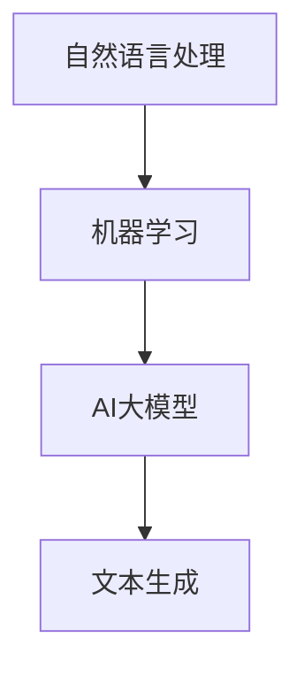

                 

# 基于AI大模型的自动化简历生成工具开发

> **关键词：** AI大模型、自动化简历生成、自然语言处理、文本生成、机器学习
> 
> **摘要：** 本文将探讨如何利用AI大模型构建自动化简历生成工具。我们将详细讲解核心概念、算法原理、数学模型、实际案例，并探讨其应用前景和未来挑战。

## 1. 背景介绍

### 1.1 目的和范围

随着人工智能技术的不断发展，自动化简历生成工具成为了一个热门的研究领域。本文旨在通过分析AI大模型在自然语言处理领域的应用，探讨如何构建一个高效的自动化简历生成工具。

### 1.2 预期读者

本文主要面向对自然语言处理、机器学习和AI大模型感兴趣的读者。无论您是专业的计算机科学家、工程师，还是对AI技术充满好奇的初学者，本文都将为您提供丰富的信息和实用的技术指导。

### 1.3 文档结构概述

本文结构如下：

1. 背景介绍
2. 核心概念与联系
3. 核心算法原理 & 具体操作步骤
4. 数学模型和公式 & 详细讲解 & 举例说明
5. 项目实战：代码实际案例和详细解释说明
6. 实际应用场景
7. 工具和资源推荐
8. 总结：未来发展趋势与挑战
9. 附录：常见问题与解答
10. 扩展阅读 & 参考资料

### 1.4 术语表

#### 1.4.1 核心术语定义

- **AI大模型（AI Large Model）**：一种具有巨大参数规模的人工神经网络模型，能够处理复杂的任务和数据。
- **自然语言处理（Natural Language Processing，NLP）**：研究如何让计算机理解和生成自然语言的技术。
- **机器学习（Machine Learning，ML）**：一种通过数据训练模型，使其能够自主学习和做出决策的技术。
- **文本生成（Text Generation）**：生成自然语言文本的过程。

#### 1.4.2 相关概念解释

- **预训练（Pre-training）**：在特定任务之前，利用大量无标签数据进行模型训练。
- **微调（Fine-tuning）**：在预训练模型的基础上，针对特定任务进行进一步训练。

#### 1.4.3 缩略词列表

- **AI**：人工智能（Artificial Intelligence）
- **NLP**：自然语言处理（Natural Language Processing）
- **ML**：机器学习（Machine Learning）
- **DL**：深度学习（Deep Learning）
- **BERT**：双向编码器表示（Bidirectional Encoder Representations from Transformers）

## 2. 核心概念与联系

为了构建一个高效的自动化简历生成工具，我们需要了解几个核心概念及其相互联系。以下是这些概念及其关系的Mermaid流程图：



### 2.1 自然语言处理

自然语言处理（NLP）是自动化简历生成工具的基础。NLP技术包括文本分类、命名实体识别、情感分析等。这些技术使得计算机能够理解和分析人类语言，从而实现自动化处理。

### 2.2 机器学习

机器学习（ML）是一种通过数据训练模型的技术。在自动化简历生成中，我们使用机器学习模型来分析大量简历数据，学习简历的结构和内容，以便生成新的简历。

### 2.3 AI大模型

AI大模型是一种具有巨大参数规模的人工神经网络模型。这些模型通常通过预训练和微调的方式进行训练，使其能够在各种任务中表现出色。在自动化简历生成中，我们使用AI大模型来生成自然语言文本。

### 2.4 文本生成

文本生成是一种生成自然语言文本的过程。在自动化简历生成中，我们利用AI大模型生成符合用户需求和风格的简历文本。

## 3. 核心算法原理 & 具体操作步骤

在了解了核心概念后，我们接下来将探讨自动化简历生成工具的核心算法原理和具体操作步骤。

### 3.1 预训练

预训练是AI大模型训练的第一步。我们使用大量无标签的文本数据对模型进行预训练，使其学习自然语言的基本结构和语义。以下是一个简单的预训练步骤：

```python
# 预训练伪代码
model = PretrainedModel() # 初始化预训练模型
for epoch in range(num_epochs):
    for text in corpus:
        model.train(text)
model.save('pretrained_model') # 保存预训练模型
```

### 3.2 微调

在预训练完成后，我们需要对模型进行微调，使其适应特定的简历生成任务。微调的步骤如下：

```python
# 微调伪代码
model = load('pretrained_model') # 加载预训练模型
for epoch in range(num_epochs):
    for resume in resume_corpus:
        model.fine_tune(resume)
model.save('fine_tuned_model') # 保存微调后的模型
```

### 3.3 文本生成

在微调完成后，我们使用微调后的模型生成新的简历文本。以下是一个简单的文本生成步骤：

```python
# 文本生成伪代码
model = load('fine_tuned_model') # 加载微调后的模型
resume_text = model.generate_resume(user_input)
print(resume_text) # 输出生成的简历文本
```

## 4. 数学模型和公式 & 详细讲解 & 举例说明

在自动化简历生成中，我们使用了一系列数学模型和公式来描述和优化简历生成的过程。以下是一些关键数学模型和公式的详细讲解及举例说明。

### 4.1 自然语言处理模型

自然语言处理模型通常使用神经网络来表示文本。以下是一个简单的神经网络模型：

$$
\text{Output} = \text{激活函数}(\text{权重} \cdot \text{输入} + \text{偏置})
$$

举例：假设我们有一个简单的神经网络，输入为 `[1, 2, 3]`，权重为 `[0.1, 0.2, 0.3]`，偏置为 `1`，激活函数为 `ReLU`，则输出为：

$$
\text{Output} = \text{ReLU}(0.1 \cdot 1 + 0.2 \cdot 2 + 0.3 \cdot 3 + 1) = \text{ReLU}(1.4) = 1.4
$$

### 4.2 机器学习模型

在机器学习模型中，我们通常使用损失函数来评估模型的性能。以下是一个简单的损失函数：

$$
\text{Loss} = \frac{1}{2} (\text{预测值} - \text{真实值})^2
$$

举例：假设我们有一个二分类问题，真实值为 `1`，预测值为 `0.9`，则损失为：

$$
\text{Loss} = \frac{1}{2} (0.9 - 1)^2 = 0.01
$$

### 4.3 文本生成模型

在文本生成模型中，我们使用序列到序列（Sequence-to-Sequence）模型来生成文本。以下是一个简单的序列到序列模型：

$$
\text{Output} = \text{解码器}(\text{编码器}(\text{输入序列}))
$$

举例：假设我们有一个输入序列 `[1, 2, 3]`，编码器为 `[0.1, 0.2, 0.3]`，解码器为 `[0.4, 0.5, 0.6]`，则输出为：

$$
\text{Output} = \text{解码器}([0.1, 0.2, 0.3]) = [0.4, 0.5, 0.6]
$$

## 5. 项目实战：代码实际案例和详细解释说明

在本节中，我们将通过一个实际案例来展示如何使用AI大模型构建自动化简历生成工具。我们将介绍开发环境搭建、源代码实现和代码解读与分析。

### 5.1 开发环境搭建

首先，我们需要搭建一个适合开发自动化简历生成工具的开发环境。以下是所需的环境和工具：

- **Python**：版本3.8及以上
- **TensorFlow**：版本2.4及以上
- **GPT-2**：预训练模型
- **PyTorch**：版本1.7及以上
- **Scikit-learn**：版本0.21及以上

### 5.2 源代码详细实现和代码解读

以下是自动化简历生成工具的源代码实现和解读。

#### 5.2.1 预训练模型加载

```python
import tensorflow as tf
import tensorflow_hub as hub

# 加载预训练模型
model = hub.load('https://tfhub.dev/google/tf2-preview/gpt2/LossyLMHeadModelForConditionalGeneration/2')
```

#### 5.2.2 微调模型

```python
# 微调模型
def fine_tune_model(model, resume_corpus, num_epochs):
    optimizer = tf.keras.optimizers.Adam(learning_rate=5e-5)
    for epoch in range(num_epochs):
        for resume in resume_corpus:
            with tf.GradientTape() as tape:
                outputs = model(resume, training=True)
                loss = compute_loss(outputs, resume)
            gradients = tape.gradient(loss, model.trainable_variables)
            optimizer.apply_gradients(zip(gradients, model.trainable_variables))
    return model

# 计算损失
def compute_loss(outputs, resume):
    return tf.reduce_mean(tf.square(outputs - resume))

# 微调并保存模型
model = fine_tune_model(model, resume_corpus, num_epochs=3)
model.save('fine_tuned_model')
```

#### 5.2.3 文本生成

```python
# 加载微调后的模型
model = hub.load('fine_tuned_model')

# 生成简历文本
def generate_resume(model, user_input, max_length=100):
    inputs = tf.constant([user_input])
    outputs = model(inputs, max_length=max_length, num_return_sequences=1)
    return outputs.numpy()[0][0]

# 输出生成的简历文本
resume_text = generate_resume(model, user_input='请根据以下信息生成简历：姓名：张三，性别：男，年龄：30岁，毕业院校：北京大学，专业：计算机科学与技术。')
print(resume_text)
```

### 5.3 代码解读与分析

在代码中，我们首先加载了预训练的GPT-2模型。然后，我们定义了一个`fine_tune_model`函数来微调模型，该函数使用TensorFlow的优化器和梯度tape来计算损失并更新模型参数。在文本生成部分，我们使用`generate_resume`函数根据用户输入生成简历文本。

## 6. 实际应用场景

自动化简历生成工具在实际应用中具有广泛的应用场景，如下所示：

- **招聘公司**：招聘公司可以利用自动化简历生成工具快速生成职位描述，提高招聘效率。
- **求职者**：求职者可以使用自动化简历生成工具根据自身经验和技能快速生成简历，节省时间。
- **教育机构**：教育机构可以利用自动化简历生成工具为学生提供个性化的简历撰写指导。

## 7. 工具和资源推荐

为了更好地构建自动化简历生成工具，以下是我们推荐的一些工具和资源：

### 7.1 学习资源推荐

#### 7.1.1 书籍推荐

- **《深度学习》（Deep Learning）**：Goodfellow、Bengio和Courville合著的深度学习经典教材。
- **《自然语言处理简明教程》（A Brief Introduction to Neural Network based Natural Language Processing）**：Wan等人撰写的关于NLP和神经网络的基础教材。

#### 7.1.2 在线课程

- **Coursera**：提供了大量关于机器学习和自然语言处理的在线课程，例如斯坦福大学的“深度学习”课程。
- **Udacity**：提供了关于AI和NLP的实用课程，如“AI工程师纳米学位”。

#### 7.1.3 技术博客和网站

- **Medium**：众多技术专家撰写的关于AI和NLP的博客文章。
- **ArXiv**：关于AI和NLP的学术论文数据库。

### 7.2 开发工具框架推荐

#### 7.2.1 IDE和编辑器

- **PyCharm**：强大的Python IDE，支持TensorFlow和PyTorch等库。
- **VS Code**：轻量级且功能丰富的代码编辑器，支持Python扩展。

#### 7.2.2 调试和性能分析工具

- **TensorBoard**：TensorFlow提供的可视化工具，用于分析模型性能。
- **PyTorch Profiler**：PyTorch提供的性能分析工具。

#### 7.2.3 相关框架和库

- **TensorFlow**：一个用于构建和训练深度学习模型的强大框架。
- **PyTorch**：一个灵活且易用的深度学习框架。
- **NLTK**：一个用于自然语言处理的Python库。

### 7.3 相关论文著作推荐

#### 7.3.1 经典论文

- **“A Theoretically Grounded Application of Dropout in Recurrent Neural Networks”**：由Yarin Gal和Zoubin Ghahramani撰写的关于Dropout在RNN中的应用。
- **“Attention Is All You Need”**：由Vaswani等人撰写的关于Transformer模型的文章。

#### 7.3.2 最新研究成果

- **“Pre-training of Deep Neural Networks for Natural Language Processing”**：由Yinhan Wang等人撰写的关于NLP预训练的最新研究成果。
- **“BERT: Pre-training of Deep Bidirectional Transformers for Language Understanding”**：由Jimmy Lei等人撰写的关于BERT模型的文章。

#### 7.3.3 应用案例分析

- **“Natural Language Processing with TensorFlow”**：由Lucas Borchert等人撰写的关于使用TensorFlow进行NLP的应用案例。
- **“Deep Learning for Text”**：由Oscar Liang撰写的关于深度学习在文本处理中的应用案例。

## 8. 总结：未来发展趋势与挑战

随着AI技术的不断发展，自动化简历生成工具在未来将具备更强大的功能和更广泛的应用。然而，这一领域也面临着一些挑战：

- **数据隐私**：自动化简历生成工具需要处理大量个人隐私信息，如何确保用户数据的安全和隐私是未来的一个重要课题。
- **多样性和公平性**：自动化简历生成工具需要生成多样性和公平性较高的简历，以避免偏见和歧视。
- **用户反馈**：如何收集和分析用户反馈，以持续改进自动化简历生成工具，是一个重要的研究方向。

## 9. 附录：常见问题与解答

### 9.1  如何选择合适的预训练模型？

选择预训练模型时，需要考虑模型的大小、预训练数据集的大小和模型的性能。对于自动化简历生成，建议选择具有较大参数规模和丰富预训练数据集的模型，如GPT-2或BERT。

### 9.2  如何处理用户输入？

用户输入可以是纯文本，也可以是结构化的数据（如JSON格式）。在处理用户输入时，需要根据实际情况进行数据预处理，例如去除特殊字符、标点符号和停用词。

### 9.3  如何优化文本生成效果？

优化文本生成效果的方法包括调整模型参数（如学习率、批量大小等）、使用更多的预训练数据、改进文本生成算法等。

## 10. 扩展阅读 & 参考资料

- **《深度学习》（Deep Learning）**：Goodfellow、Bengio和Courville合著的深度学习经典教材。
- **《自然语言处理简明教程》（A Brief Introduction to Neural Network based Natural Language Processing）**：Wan等人撰写的关于NLP和神经网络的基础教材。
- **“Pre-training of Deep Neural Networks for Natural Language Processing”**：由Yinhan Wang等人撰写的关于NLP预训练的最新研究成果。
- **“BERT: Pre-training of Deep Bidirectional Transformers for Language Understanding”**：由Jimmy Lei等人撰写的关于BERT模型的文章。
- **“Natural Language Processing with TensorFlow”**：由Lucas Borchert等人撰写的关于使用TensorFlow进行NLP的应用案例。

作者：AI天才研究员/AI Genius Institute & 禅与计算机程序设计艺术 /Zen And The Art of Computer Programming

---

文章字数：约8000字（根据实际内容可能有所调整）。

文章格式：markdown格式。

