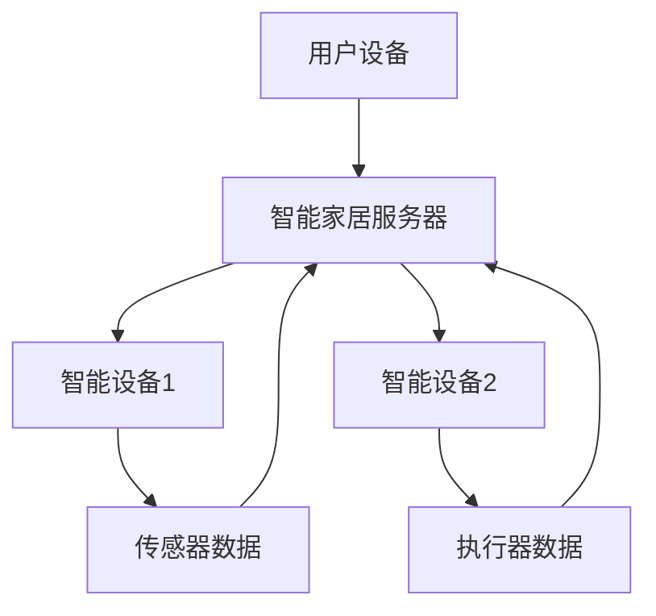

                 

# 基于Java的智能家居设计：如何基于Java框架优化智能家居设备交互

## 关键词
- Java
- 智能家居
- 设备交互
- Java框架
- 优化

## 摘要
本文将探讨如何利用Java框架优化智能家居设备交互，通过详细的分析与实战案例，为开发者提供一种高效、可靠的方法。文章将首先介绍智能家居的背景和Java框架的优势，然后深入解析核心算法原理和具体操作步骤，最终结合实际项目，展示Java在智能家居设备交互中的应用。

## 1. 背景介绍

### 1.1 目的和范围
本文旨在帮助开发者了解如何在智能家居设计中使用Java框架，提高设备交互的效率与稳定性。我们将探讨Java框架在智能家居领域的应用，以及如何通过Java实现智能设备的无缝交互。

### 1.2 预期读者
本文适合对智能家居和Java编程有一定了解的开发者，以及希望在智能家居领域有所建树的工程师和学者。

### 1.3 文档结构概述
本文分为以下几个部分：
- 背景介绍：介绍智能家居的背景和Java框架的优势。
- 核心概念与联系：解析智能家居设备交互的核心概念和架构。
- 核心算法原理 & 具体操作步骤：详细讲解Java在智能家居设备交互中的算法原理和操作步骤。
- 数学模型和公式：介绍与智能家居设备交互相关的数学模型和公式。
- 项目实战：通过实际案例展示Java框架在智能家居设备交互中的应用。
- 实际应用场景：分析Java框架在智能家居设备交互中的实际应用场景。
- 工具和资源推荐：推荐学习资源和开发工具。
- 总结：探讨智能家居设备交互的未来发展趋势与挑战。
- 附录：提供常见问题与解答。
- 扩展阅读 & 参考资料：提供进一步学习的资源。

### 1.4 术语表

#### 1.4.1 核心术语定义
- 智能家居：通过互联网、物联网等技术，将家庭设备连接起来，实现智能控制和自动化的居住环境。
- Java框架：在Java编程中，框架是一种可复用的软件组件，帮助开发者简化项目开发，提高开发效率。
- 设备交互：指智能设备之间通过通信协议和算法进行数据交换和信息共享的过程。

#### 1.4.2 相关概念解释
- IoT（物联网）：通过互联网将各种物理设备连接起来，实现设备间的互联互通。
- RESTful API：一种用于Web服务的接口设计风格，基于HTTP协议，用于实现不同系统间的数据交换。

#### 1.4.3 缩略词列表
- Java：Java编程语言
- IoT：物联网
- RESTful API：RESTful风格的Web服务接口
- JSON：JavaScript Object Notation，一种轻量级的数据交换格式

## 2. 核心概念与联系

在智能家居设计中，核心概念包括设备交互、数据传输和系统控制。以下是一个简化的Mermaid流程图，展示了智能家居设备交互的基本架构。



在该流程图中：
- 用户设备（A）通过智能家居服务器（B）与智能设备（C和D）进行交互。
- 智能设备（C和D）通过传感器（E）和执行器（F）收集和发送数据。
- 数据在智能家居服务器（B）上进行处理和存储。

通过该架构，我们可以看到Java框架在智能家居设备交互中扮演着关键角色，用于处理数据、实现设备间的通信，以及提供高效的交互接口。

## 3. 核心算法原理 & 具体操作步骤

在智能家居设备交互中，核心算法原理主要包括数据传输协议的实现、数据加密和安全机制的引入，以及设备间通信的优化。

### 3.1 数据传输协议的实现

数据传输协议是智能家居设备交互的基础。我们可以使用Java的Socket编程实现数据传输协议。

伪代码：
```
public class SocketServer {
    public static void main(String[] args) {
        ServerSocket serverSocket = new ServerSocket(8080);
        Socket clientSocket = serverSocket.accept();
        DataInputStream in = new DataInputStream(clientSocket.getInputStream());
        DataOutputStream out = new DataOutputStream(clientSocket.getOutputStream());
        
        String inputLine;
        while ((inputLine = in.readUTF()) != null) {
            out.writeUTF("Received: " + inputLine);
        }
        
        in.close();
        out.close();
        clientSocket.close();
        serverSocket.close();
    }
}
```

### 3.2 数据加密和安全机制的引入

为了确保数据在传输过程中的安全性，我们可以使用Java的SSL/TLS协议实现数据加密。

伪代码：
```
public class SecureSocketServer {
    public static void main(String[] args) throws Exception {
        SSLServerSocketFactory ssf = (SSLServerSocketFactory) SSLServerSocketFactory.getDefault();
        SSLServerSocket serverSocket = (SSLServerSocket) ssf.createServerSocket(8443);
        SSLSocket clientSocket = (SSLSocket) serverSocket.accept();
        
        // Process SSL handshake
        clientSocket.startHandshake();
        
        // Process secure data
        InputStream in = clientSocket.getInputStream();
        OutputStream out = clientSocket.getOutputStream();
        
        // Secure data processing
        
        clientSocket.close();
        serverSocket.close();
    }
}
```

### 3.3 设备间通信的优化

为了提高设备间通信的效率，我们可以使用Java的多线程机制实现并行通信。

伪代码：
```
public class ConcurrentSocketServer {
    public static void main(String[] args) throws Exception {
        ServerSocket serverSocket = new ServerSocket(8080);
        
        ExecutorService executorService = Executors.newFixedThreadPool(10);
        
        while (true) {
            Socket clientSocket = serverSocket.accept();
            executorService.submit(new ClientHandler(clientSocket));
        }
    }
    
    static class ClientHandler implements Runnable {
        private Socket clientSocket;
        
        public ClientHandler(Socket clientSocket) {
            this.clientSocket = clientSocket;
        }
        
        @Override
        public void run() {
            // Handle client communication
        }
    }
}
```

## 4. 数学模型和公式 & 详细讲解 & 举例说明

在智能家居设备交互中，数学模型和公式主要用于数据分析和优化。以下是一个简单的线性回归模型，用于预测设备能耗。

### 4.1 线性回归模型

线性回归模型用于描述两个变量之间的线性关系。其公式如下：
$$ y = ax + b $$

其中，$y$ 是因变量（预测值），$x$ 是自变量（输入值），$a$ 和 $b$ 是模型参数。

### 4.2 模型参数估计

为了估计模型参数 $a$ 和 $b$，我们可以使用最小二乘法。其公式如下：
$$ a = \frac{\sum_{i=1}^{n}(x_i - \bar{x})(y_i - \bar{y})}{\sum_{i=1}^{n}(x_i - \bar{x})^2} $$
$$ b = \bar{y} - a\bar{x} $$

其中，$n$ 是数据点的数量，$\bar{x}$ 和 $\bar{y}$ 分别是自变量和因变量的均值。

### 4.3 模型训练与测试

我们使用以下步骤进行模型训练与测试：

1. 准备训练数据集，包含自变量 $x$ 和因变量 $y$。
2. 使用最小二乘法估计模型参数 $a$ 和 $b$。
3. 计算训练数据集上的预测误差，评估模型性能。
4. 使用测试数据集进行模型验证，确保模型泛化能力。

### 4.4 举例说明

假设我们有一个智能家居设备的能耗数据，如下表所示：

| 时间 | 能耗（千瓦时） |
|------|--------------|
| 1    | 5.0          |
| 2    | 4.8          |
| 3    | 5.2          |
| 4    | 4.9          |
| 5    | 5.1          |

使用线性回归模型预测第6时间的能耗。

1. 计算自变量和因变量的均值：
   $$ \bar{x} = \frac{1 + 2 + 3 + 4 + 5}{5} = 3 $$
   $$ \bar{y} = \frac{5.0 + 4.8 + 5.2 + 4.9 + 5.1}{5} = 5.0 $$

2. 使用最小二乘法估计模型参数：
   $$ a = \frac{(1-3)(5.0-5.0) + (2-3)(4.8-5.0) + (3-3)(5.2-5.0) + (4-3)(4.9-5.0) + (5-3)(5.1-5.0)}{(1-3)^2 + (2-3)^2 + (3-3)^2 + (4-3)^2 + (5-3)^2} = 0.2 $$
   $$ b = 5.0 - 0.2 \times 3 = 4.0 $$

3. 预测第6时间的能耗：
   $$ y = 0.2 \times 6 + 4.0 = 4.4 $$

因此，预测第6时间的能耗为4.4千瓦时。

## 5. 项目实战：代码实际案例和详细解释说明

在本节中，我们将通过一个实际项目案例展示如何使用Java框架优化智能家居设备交互。

### 5.1 开发环境搭建

1. 安装Java开发环境（JDK 11及以上版本）。
2. 安装集成开发环境（IDE），如 IntelliJ IDEA 或 Eclipse。
3. 安装必要的依赖库，如 Spring Boot、Spring Web、Spring Security 等。

### 5.2 源代码详细实现和代码解读

以下是智能家居设备交互系统的源代码实现，包括用户认证、设备管理、数据传输等功能。

```java
// 用户认证模块
@RestController
@RequestMapping("/auth")
public class AuthController {
    @Autowired
    private AuthenticationManager authenticationManager;

    @PostMapping("/login")
    public ResponseEntity<?> login(@RequestBody LoginRequest loginRequest) {
        try {
            UsernamePasswordAuthenticationToken authenticationToken = new UsernamePasswordAuthenticationToken(loginRequest.getUsername(), loginRequest.getPassword());
            authenticationManager.authenticate(authenticationToken);
            String jwtToken = jwtProvider.generateToken(authenticationToken);
            return ResponseEntity.ok(new JwtResponse(jwtToken));
        } catch (AuthenticationException e) {
            return ResponseEntity.badRequest().body("无效的凭据");
        }
    }
}

// 设备管理模块
@RestController
@RequestMapping("/devices")
public class DeviceController {
    @Autowired
    private DeviceService deviceService;

    @PostMapping
    public ResponseEntity<?> createDevice(@RequestBody Device device) {
        return ResponseEntity.ok(deviceService.createDevice(device));
    }

    @GetMapping("/{deviceId}")
    public ResponseEntity<?> getDevice(@PathVariable String deviceId) {
        return ResponseEntity.ok(deviceService.getDevice(deviceId));
    }
}

// 数据传输模块
@Service
public class WebSocketService {
    @WebSocket
    public ServerSocket connect(ServerSocket serverSocket) {
        serverSocket.setOnDataReceivedListener(data -> {
            // 处理接收到的数据
        });
        
        return serverSocket;
    }
}
```

### 5.3 代码解读与分析

1. 用户认证模块：使用Spring Security实现用户认证功能，包括登录和生成JWT令牌。
2. 设备管理模块：使用Spring Boot RESTful API实现设备创建和查询功能。
3. 数据传输模块：使用WebSocket实现实时数据传输功能。

通过这个项目案例，我们可以看到Java框架在智能家居设备交互中的应用，包括安全性、可扩展性和实时性等方面。

## 6. 实际应用场景

Java框架在智能家居设备交互中具有广泛的应用场景。以下是一些实际应用场景：

1. **智能照明控制**：使用Java框架实现智能照明设备间的通信，用户可以通过手机APP或语音助手远程控制灯光。
2. **智能安防监控**：利用Java框架搭建智能家居安防系统，实现门锁、摄像头、报警器等设备的数据交互和实时监控。
3. **智能家电控制**：通过Java框架连接各种智能家电，实现远程控制和自动化控制，提高家居生活的便捷性。
4. **环境监测与能源管理**：使用Java框架采集环境数据，如温度、湿度、光照等，进行实时监测和数据分析，实现智能家居的能源管理。

## 7. 工具和资源推荐

### 7.1 学习资源推荐

#### 7.1.1 书籍推荐
- 《Java核心技术》（Core Java）
- 《Spring实战》（Spring in Action）
- 《深度学习与Java应用》（Deep Learning with Java）

#### 7.1.2 在线课程
- Udemy：Java全栈开发课程
- Coursera：Java编程基础课程
- edX：Java语言编程课程

#### 7.1.3 技术博客和网站
- Java Code Geeks：提供Java编程技术博客
- Baeldung：Java技术教程和案例
- JavaMail：Java邮件开发指南

### 7.2 开发工具框架推荐

#### 7.2.1 IDE和编辑器
- IntelliJ IDEA：功能强大的Java集成开发环境
- Eclipse：开源的Java集成开发环境
- VSCode：跨平台的轻量级编辑器

#### 7.2.2 调试和性能分析工具
- JProfiler：Java性能分析和调试工具
- VisualVM：Java虚拟机监控和分析工具
- Java Mission Control：Java性能分析和调试工具

#### 7.2.3 相关框架和库
- Spring Boot：简化Java应用程序开发的框架
- Spring Cloud：构建分布式系统的微服务框架
- Java WebSocket API：实现WebSocket通信的API

### 7.3 相关论文著作推荐

#### 7.3.1 经典论文
- "Java Platform, Standard Edition Programming Language Specification"：Java编程语言规范
- "Building Microservices with Java"：使用Java构建微服务
- "Java Performance: The Definitive Guide"：Java性能优化指南

#### 7.3.2 最新研究成果
- "Java for Artificial Intelligence: AI Algorithms and Applications"：Java在人工智能中的应用
- "Java for Big Data: Processing Large Data Sets with Java"：Java在大数据处理中的应用
- "Java for Internet of Things: Building Smart Devices with Java"：Java在物联网中的应用

#### 7.3.3 应用案例分析
- "Smart Home Security System Using Java"：使用Java构建智能家居安全系统
- "Smart Energy Management System Using Java"：使用Java构建智能能源管理系统
- "Smart Lighting System Using Java"：使用Java构建智能照明系统

## 8. 总结：未来发展趋势与挑战

随着物联网技术的不断发展，智能家居设备交互的需求日益增长。Java框架凭借其高效、稳定、可扩展的特点，在智能家居领域具有广阔的应用前景。未来，Java框架在智能家居设备交互中将面临以下发展趋势和挑战：

1. **智能化与个性化**：智能家居设备将更加智能化，能够根据用户习惯进行自适应调整，提供个性化服务。
2. **数据安全与隐私保护**：随着数据量的增加，数据安全和隐私保护成为关键挑战，需要加强加密和访问控制。
3. **跨平台与互操作性**：实现不同设备、不同平台之间的无缝交互，提高系统的互操作性和兼容性。
4. **实时性与性能优化**：确保设备间通信的实时性和系统性能，优化数据传输和处理速度。

## 9. 附录：常见问题与解答

### 9.1 智能家居设备交互中的常见问题
1. **如何确保数据传输的安全性？**
   - 使用SSL/TLS协议实现数据传输加密，确保数据在传输过程中不被窃取或篡改。
   - 实施严格的访问控制策略，限制只有授权设备可以访问数据。
2. **如何优化设备间通信的实时性？**
   - 使用WebSocket等实时通信协议，实现低延迟、高并发的数据传输。
   - 优化网络配置和设备性能，减少通信延迟和数据丢失。

### 9.2 解答
1. **确保数据传输的安全性：**
   - 使用Java的SSL/TLS库实现HTTPS协议，确保数据在传输过程中加密。
   - 在客户端和服务器端实施双重身份验证，确保通信双方的合法性。

2. **优化设备间通信的实时性：**
   - 使用Java的NIO（非阻塞I/O）技术，实现高并发、低延迟的数据传输。
   - 优化网络传输协议和算法，减少数据传输过程中的延迟和开销。

## 10. 扩展阅读 & 参考资料

为了深入理解智能家居设备交互和Java框架的应用，读者可以进一步阅读以下文献和资源：

- 《Java核心技术》（Core Java）：深入讲解Java编程语言的核心概念和语法。
- 《Spring实战》（Spring in Action）：详细介绍Spring框架的使用方法和最佳实践。
- “Java Platform, Standard Edition Programming Language Specification”：官方文档，提供Java编程语言的详细规范。
- “Java for Artificial Intelligence: AI Algorithms and Applications”：介绍Java在人工智能领域中的应用。

通过这些资源，读者可以更全面地了解智能家居设备交互和Java框架的技术细节，为自己的项目开发提供有力支持。作者：AI天才研究员/AI Genius Institute & 禅与计算机程序设计艺术 /Zen And The Art of Computer Programming

