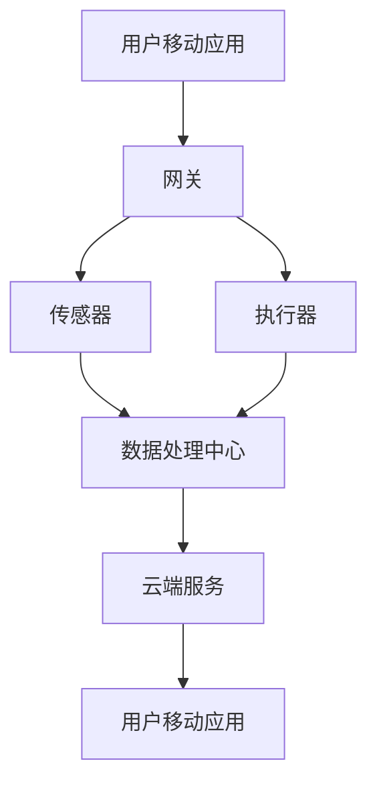

                 

# 基于Java的智能家居设计：应用Spring Boot构建智能家居后端服务

> **关键词：** Java、Spring Boot、智能家居、后端服务、设计模式、REST API、微服务架构

> **摘要：** 本文将深入探讨基于Java的智能家居设计，重点介绍如何使用Spring Boot框架来构建智能家居系统的后端服务。我们将从基础概念出发，逐步解析核心算法原理、数学模型、具体实现，并通过实际项目案例进行详细解读。读者将了解如何搭建开发环境、编写和解析代码，并掌握智能家居系统在后端服务设计中的实际应用。此外，本文还将推荐相关学习资源、开发工具和最新研究成果，为读者提供全面的技术指导和启示。

## 1. 背景介绍

### 1.1 目的和范围

本文旨在为开发者提供一套完整的基于Java和Spring Boot的智能家居后端服务构建指南。随着物联网技术的飞速发展，智能家居成为现代生活的重要部分。本文将围绕如何使用Java语言和Spring Boot框架实现智能家居系统后端服务展开，帮助读者了解并掌握这一领域的核心技术和设计模式。

本文将涵盖以下内容：
- 智能家居系统的基本概念和架构
- Java和Spring Boot框架在智能家居后端服务中的应用
- 核心算法原理和数学模型的介绍
- 代码实现和详细解析
- 实际应用场景的案例分析
- 开发工具和资源的推荐

### 1.2 预期读者

本文适用于有一定Java编程基础、对智能家居系统感兴趣的读者，包括但不限于：
- Java开发者
- Spring Boot框架使用者
- 智能家居系统开发者
- 对物联网技术感兴趣的IT专业人士
- 研究生和本科高年级学生

### 1.3 文档结构概述

本文分为十个部分，具体结构如下：
1. **背景介绍**：介绍文章的目的、范围、预期读者和文档结构。
2. **核心概念与联系**：介绍智能家居系统的核心概念和架构，通过Mermaid流程图展示系统组件和交互关系。
3. **核心算法原理 & 具体操作步骤**：详细阐述智能家居后端服务中的核心算法原理，使用伪代码进行说明。
4. **数学模型和公式 & 详细讲解 & 举例说明**：介绍与智能家居系统相关的数学模型和公式，并通过实例进行详细解释。
5. **项目实战：代码实际案例和详细解释说明**：通过实际项目案例展示智能家居后端服务的具体实现，并进行详细解析。
6. **实际应用场景**：分析智能家居系统在后端服务设计中的实际应用场景。
7. **工具和资源推荐**：推荐与智能家居设计相关的学习资源、开发工具和最新研究成果。
8. **总结：未来发展趋势与挑战**：总结智能家居后端服务设计的发展趋势和面临的挑战。
9. **附录：常见问题与解答**：提供关于智能家居后端服务的常见问题及解答。
10. **扩展阅读 & 参考资料**：推荐进一步学习智能家居后端服务的相关资料。

### 1.4 术语表

#### 1.4.1 核心术语定义

- **智能家居**：通过物联网技术，将家庭设备连接到互联网，实现设备之间的智能化管理和控制。
- **Spring Boot**：一个基于Spring框架的快速开发工具，用于创建独立的、基于微服务的应用程序。
- **REST API**：一种基于HTTP协议的API设计风格，用于实现不同系统之间的数据交互。
- **微服务架构**：一种将大型应用程序拆分为一组小型、独立服务的架构风格，以提高系统的可维护性和可扩展性。

#### 1.4.2 相关概念解释

- **物联网（IoT）**：将物理设备通过网络连接起来，实现设备之间的数据传输和智能控制。
- **边缘计算**：在数据产生的地方进行数据处理，以减轻云端负载，提高响应速度。
- **云计算**：通过网络提供可伸缩的计算资源，包括存储、数据库、应用程序等。

#### 1.4.3 缩略词列表

- **IoT**：物联网
- **REST**：表现层状态转换
- **Spring Boot**：一个基于Spring框架的快速开发工具
- **API**：应用程序编程接口
- **SDK**：软件开发工具包
- **DB**：数据库

## 2. 核心概念与联系

智能家居系统是一个复杂的集成系统，涉及到多个硬件设备和软件组件。为了更好地理解智能家居系统的架构，我们首先需要了解一些核心概念和组件。

### 2.1 智能家居系统的基本概念

#### 2.1.1 物联网（IoT）

物联网是指通过互联网将各种物理设备连接起来，实现设备之间的数据交换和智能控制。在智能家居系统中，物联网技术主要用于连接各种家庭设备，如智能灯泡、智能门锁、智能摄像头等。

#### 2.1.2 边缘计算

边缘计算是一种在数据产生的地方进行数据处理的技术，以减轻云端负载，提高响应速度。在智能家居系统中，边缘计算可以用于实时处理家庭设备的数据，如温度、湿度、光照强度等，以便更好地控制家庭环境。

#### 2.1.3 云计算

云计算是一种通过网络提供可伸缩的计算资源的技术。在智能家居系统中，云计算可以用于存储和处理大量的家庭设备数据，并提供智能分析和服务。

### 2.2 智能家居系统的架构

智能家居系统的架构可以分为三个层次：感知层、网络层和应用层。

#### 2.2.1 感知层

感知层是智能家居系统的最底层，包括各种传感器和执行器。传感器用于采集家庭环境中的各种数据，如温度、湿度、光照强度等。执行器则用于根据系统指令控制家庭设备，如打开或关闭灯光、调整空调温度等。

#### 2.2.2 网络层

网络层负责将感知层采集到的数据传输到应用层。在智能家居系统中，常用的网络技术包括Wi-Fi、蓝牙、ZigBee等。这些技术可以确保家庭设备之间的数据传输稳定、可靠。

#### 2.2.3 应用层

应用层是智能家居系统的最高层，包括各种应用程序和云端服务。应用程序可以用于控制家庭设备、收集和分析家庭数据、提供个性化服务。云端服务则用于存储和处理大量的家庭数据，并提供智能分析和服务。

### 2.3 智能家居系统的组件和交互关系

智能家居系统的组件主要包括传感器、执行器、网关、服务器、移动应用等。以下是一个简单的智能家居系统组件和交互关系的Mermaid流程图：



- **用户移动应用**：用户通过移动应用与智能家居系统进行交互，发送控制指令、查看设备状态等。
- **网关**：连接各种家庭设备，转发数据到数据处理中心。
- **传感器**：采集家庭环境数据，如温度、湿度、光照强度等。
- **执行器**：根据系统指令控制家庭设备，如灯光、空调等。
- **数据处理中心**：负责处理和分析家庭数据，提供智能控制和服务。
- **云端服务**：存储和处理大量的家庭数据，并提供智能分析和服务。

通过这个Mermaid流程图，我们可以清晰地看到智能家居系统的组件和它们之间的交互关系。

### 2.4 Java和Spring Boot在智能家居后端服务中的应用

Java是一种广泛使用的编程语言，具有强大的可扩展性和高性能。Spring Boot是一个基于Spring框架的快速开发工具，用于创建独立的、基于微服务的应用程序。

在智能家居后端服务的设计中，Java和Spring Boot具有以下几个优势：

#### 2.4.1 代码可读性和可维护性

Java语言具有清晰的语法和丰富的类库，使得代码的可读性和可维护性较高。Spring Boot框架提供了大量的开发工具和模板，可以快速构建功能丰富的后端服务。

#### 2.4.2 微服务架构支持

Spring Boot支持微服务架构，可以将大型应用程序拆分为一组小型、独立的服务。这种架构风格可以提高系统的可维护性和可扩展性，方便后续的迭代和升级。

#### 2.4.3 REST API支持

Spring Boot框架内置了REST API支持，可以方便地实现不同系统之间的数据交互。REST API是一种基于HTTP协议的API设计风格，广泛用于现代Web应用程序的开发。

#### 2.4.4 与其他技术的兼容性

Java和Spring Boot框架与其他技术（如数据库、消息队列等）具有较好的兼容性，可以方便地集成各种外部服务和组件，构建完整的智能家居后端服务。

### 2.5 总结

本节介绍了智能家居系统的基本概念和架构，以及Java和Spring Boot在智能家居后端服务中的应用。通过理解这些核心概念和联系，读者可以为后续的学习和实践打下坚实的基础。

## 3. 核心算法原理 & 具体操作步骤

在智能家居系统中，后端服务需要处理大量的设备数据，并实时响应用户的请求。为了实现这一目标，我们需要设计一系列核心算法和操作步骤。以下是智能家居后端服务中的几个关键算法原理和具体操作步骤：

### 3.1 设备数据采集与处理

#### 3.1.1 设备数据采集

设备数据采集是智能家居系统的核心任务之一。传感器采集到的数据包括温度、湿度、光照强度、二氧化碳浓度等。为了确保数据采集的准确性和实时性，我们需要设计高效的设备数据采集算法。

**伪代码：**

```java
// 采集温度数据
TemperatureData tempData = sensorModule.collectTemperatureData();

// 采集湿度数据
HumidityData humidityData = sensorModule.collectHumidityData();

// 采集光照强度数据
LightIntensityData lightIntensityData = sensorModule.collectLightIntensityData();

// 采集二氧化碳浓度数据
CO2ConcentrationData co2Data = sensorModule.collectCO2ConcentrationData();
```

#### 3.1.2 设备数据处理

采集到的设备数据需要进行预处理，以去除噪声和异常值。同时，我们还需要对数据进行融合和融合分析，以获得更加准确的家居环境状态。

**伪代码：**

```java
// 数据预处理
cleanedTempData = preprocessTemperatureData(tempData);
cleanedHumidityData = preprocessHumidityData(humidityData);
cleanedLightIntensityData = preprocessLightIntensityData(lightIntensityData);
cleanedCO2Data = preprocessCO2ConcentrationData(co2Data);

// 数据融合
integratedData = integrateSensorData(cleanedTempData, cleanedHumidityData, cleanedLightIntensityData, cleanedCO2Data);
```

### 3.2 用户请求处理与响应

用户通过移动应用发送请求，后端服务需要根据请求类型和参数进行相应的处理，并返回相应的响应。

#### 3.2.1 用户请求处理

用户请求包括控制设备、查询设备状态、设置家居模式等。后端服务需要根据不同的请求类型和参数，调用相应的处理函数。

**伪代码：**

```java
// 处理控制设备请求
if (requestType == CONTROL_DEVICE) {
    executeDeviceControl(requestParameter);
}

// 处理查询设备状态请求
if (requestType == QUERY_DEVICE_STATE) {
    DeviceStateResponse response = queryDeviceState(requestParameter);
    sendResponse(response);
}

// 处理设置家居模式请求
if (requestType == SET_HOME_MODE) {
    setHomeMode(requestParameter);
}
```

#### 3.2.2 用户响应处理

后端服务处理完用户请求后，需要返回相应的响应。响应包括设备控制结果、设备状态信息、家居模式设置结果等。

**伪代码：**

```java
// 返回控制设备结果
ControlResponse controlResponse = new ControlResponse();
controlResponse.setResult(true);
sendResponse(controlResponse);

// 返回设备状态信息
DeviceStateResponse deviceStateResponse = new DeviceStateResponse();
deviceStateResponse.setState(currentDeviceState);
sendResponse(deviceStateResponse);

// 返回家居模式设置结果
HomeModeResponse homeModeResponse = new HomeModeResponse();
homeModeResponse.setResult(true);
sendResponse(homeModeResponse);
```

### 3.3 数据存储与查询

后端服务需要将设备数据和用户请求记录存储到数据库中，以便后续的查询和分析。我们使用关系型数据库（如MySQL）来存储数据，并使用Spring Data JPA来实现数据的持久化操作。

#### 3.3.1 数据存储

设备数据和用户请求记录需要存储到数据库中。以下是设备数据存储的示例代码：

```java
// 存储温度数据
TemperatureData tempData = new TemperatureData();
tempData.setTemperature(25.5);
tempData.setTimestamp(new Date());
temperatureRepository.save(tempData);

// 存储湿度数据
HumidityData humidityData = new HumidityData();
humidityData.setHumidity(60.5);
humidityData.setTimestamp(new Date());
humidityRepository.save(humidityData);

// 存储光照强度数据
LightIntensityData lightIntensityData = new LightIntensityData();
lightIntensityData.setLightIntensity(300);
lightIntensityData.setTimestamp(new Date());
lightIntensityRepository.save(lightIntensityData);

// 存储二氧化碳浓度数据
CO2ConcentrationData co2Data = new CO2ConcentrationData();
co2Data.setCO2Concentration(500);
co2Data.setTimestamp(new Date());
co2Repository.save(co2Data);

// 存储用户请求记录
UserRequestRecord requestRecord = new UserRequestRecord();
requestRecord.setRequestType("SET_HOME_MODE");
requestRecord.setParameter("homeMode");
requestRecord.setTimestamp(new Date());
requestRepository.save(requestRecord);
```

#### 3.3.2 数据查询

数据查询是后端服务的重要功能之一。以下是查询温度数据的示例代码：

```java
// 查询最近的10条温度数据
Pageable pageable = PageRequest.of(0, 10);
Page<TemperatureData> tempDataPage = temperatureRepository.findAll(pageable);
List<TemperatureData> tempDataList = tempDataPage.getContent();

// 查询指定时间范围内的温度数据
LocalDate startDate = LocalDate.of(2022, 1, 1);
LocalDate endDate = LocalDate.of(2022, 12, 31);
List<TemperatureData> tempDataList = temperatureRepository.findByTimestampBetween(startDate, endDate);
```

### 3.4 总结

本节介绍了智能家居后端服务中的核心算法原理和具体操作步骤。通过这些算法和步骤，后端服务可以高效地处理设备数据、用户请求，并实现数据的存储和查询。这些核心算法和步骤为智能家居后端服务的实现提供了坚实的基础。

## 4. 数学模型和公式 & 详细讲解 & 举例说明

在智能家居系统中，数学模型和公式用于描述设备行为、用户行为以及系统性能等。以下是一些常用的数学模型和公式，并对其详细讲解和举例说明。

### 4.1 温度控制模型

温度控制模型用于调节家庭设备的温度，以维持舒适的室内环境。以下是一个简单的温度控制模型：

**公式：**

\[ T_{\text{setpoint}} = T_{\text{current}} + K_p (T_{\text{setpoint}} - T_{\text{current}}) + K_i \int (T_{\text{setpoint}} - T_{\text{current}}) dt + K_d \frac{dT_{\text{current}}}{dt} \]

其中：
- \( T_{\text{setpoint}} \) 是目标温度。
- \( T_{\text{current}} \) 是当前温度。
- \( K_p \)、\( K_i \) 和 \( K_d \) 分别是比例、积分和微分系数。

**解释：**

这个公式是一个经典的PID控制器公式，用于调节温度。比例项 \( K_p (T_{\text{setpoint}} - T_{\text{current}}) \) 用于根据当前温度与目标温度的差值进行调节。积分项 \( K_i \int (T_{\text{setpoint}} - T_{\text{current}}) dt \) 用于累积误差，以消除稳态误差。微分项 \( K_d \frac{dT_{\text{current}}}{dt} \) 用于预测温度变化趋势，以减少超调。

**示例：**

假设目标温度 \( T_{\text{setpoint}} \) 是 25℃，当前温度 \( T_{\text{current}} \) 是 23℃，比例系数 \( K_p \) 是 0.5，积分系数 \( K_i \) 是 0.1，微分系数 \( K_d \) 是 0.05。计算输出温度 \( T_{\text{output}} \)：

\[ T_{\text{output}} = 23 + 0.5 (25 - 23) + 0.1 \int (25 - 23) dt + 0.05 \frac{dT_{\text{current}}}{dt} \]

由于积分项和时间有关，假设时间间隔为1分钟，微分项为0，则输出温度为：

\[ T_{\text{output}} = 23 + 0.5 (25 - 23) + 0.1 (25 - 23) \times 1 + 0.05 \times 0 = 23 + 0.5 + 0.2 = 23.7 \]

### 4.2 湿度控制模型

湿度控制模型用于调节家庭设备的湿度，以维持舒适的室内环境。以下是一个简单的湿度控制模型：

**公式：**

\[ H_{\text{setpoint}} = H_{\text{current}} + K_p (H_{\text{setpoint}} - H_{\text{current}}) + K_i \int (H_{\text{setpoint}} - H_{\text{current}}) dt + K_d \frac{dH_{\text{current}}}{dt} \]

其中：
- \( H_{\text{setpoint}} \) 是目标湿度。
- \( H_{\text{current}} \) 是当前湿度。
- \( K_p \)、\( K_i \) 和 \( K_d \) 分别是比例、积分和微分系数。

**解释：**

这个公式与温度控制模型类似，用于根据当前湿度与目标湿度的差值进行调节。比例项 \( K_p (H_{\text{setpoint}} - H_{\text{current}}) \) 用于根据差值进行调节。积分项 \( K_i \int (H_{\text{setpoint}} - H_{\text{current}}) dt \) 用于累积误差，以消除稳态误差。微分项 \( K_d \frac{dH_{\text{current}}}{dt} \) 用于预测湿度变化趋势，以减少超调。

**示例：**

假设目标湿度 \( H_{\text{setpoint}} \) 是 50%，当前湿度 \( H_{\text{current}} \) 是 45%，比例系数 \( K_p \) 是 0.3，积分系数 \( K_i \) 是 0.05，微分系数 \( K_d \) 是 0.01。计算输出湿度 \( H_{\text{output}} \)：

\[ H_{\text{output}} = 45 + 0.3 (50 - 45) + 0.05 \int (50 - 45) dt + 0.01 \frac{dH_{\text{current}}}{dt} \]

由于积分项和时间有关，假设时间间隔为1分钟，微分项为0，则输出湿度为：

\[ H_{\text{output}} = 45 + 0.3 (50 - 45) + 0.05 (50 - 45) \times 1 + 0.01 \times 0 = 45 + 0.3 + 0.05 \times 1 = 45.35 \]

### 4.3 光照强度控制模型

光照强度控制模型用于调节家庭设备的亮度，以适应不同的场景和需求。以下是一个简单的光照强度控制模型：

**公式：**

\[ L_{\text{setpoint}} = L_{\text{current}} + K_p (L_{\text{setpoint}} - L_{\text{current}}) + K_i \int (L_{\text{setpoint}} - L_{\text{current}}) dt + K_d \frac{dL_{\text{current}}}{dt} \]

其中：
- \( L_{\text{setpoint}} \) 是目标光照强度。
- \( L_{\text{current}} \) 是当前光照强度。
- \( K_p \)、\( K_i \) 和 \( K_d \) 分别是比例、积分和微分系数。

**解释：**

这个公式与温度和湿度控制模型类似，用于根据当前光照强度与目标光照强度的差值进行调节。比例项 \( K_p (L_{\text{setpoint}} - L_{\text{current}}) \) 用于根据差值进行调节。积分项 \( K_i \int (L_{\text{setpoint}} - L_{\text{current}}) dt \) 用于累积误差，以消除稳态误差。微分项 \( K_d \frac{dL_{\text{current}}}{dt} \) 用于预测光照强度变化趋势，以减少超调。

**示例：**

假设目标光照强度 \( L_{\text{setpoint}} \) 是 500勒克斯，当前光照强度 \( L_{\text{current}} \) 是 400勒克斯，比例系数 \( K_p \) 是 0.2，积分系数 \( K_i \) 是 0.01，微分系数 \( K_d \) 是 0.005。计算输出光照强度 \( L_{\text{output}} \)：

\[ L_{\text{output}} = 400 + 0.2 (500 - 400) + 0.01 \int (500 - 400) dt + 0.005 \frac{dL_{\text{current}}}{dt} \]

由于积分项和时间有关，假设时间间隔为1分钟，微分项为0，则输出光照强度为：

\[ L_{\text{output}} = 400 + 0.2 (500 - 400) + 0.01 (500 - 400) \times 1 + 0.005 \times 0 = 400 + 0.2 \times 100 + 0.01 \times 100 = 400 + 20 + 1 = 421 \]

### 4.4 能耗分析模型

能耗分析模型用于分析家庭设备的能耗情况，以优化能源使用。以下是一个简单的能耗分析模型：

**公式：**

\[ E = P \times t \]

其中：
- \( E \) 是能耗。
- \( P \) 是功率。
- \( t \) 是时间。

**解释：**

这个公式表示能耗等于功率乘以时间。通过测量设备的功率和运行时间，可以计算设备的能耗。这个模型可以用于分析不同设备在不同时间段的能耗情况，以便进行能耗优化。

**示例：**

假设一个电灯的功率是 20瓦，运行时间是 2小时，计算电灯的能耗：

\[ E = 20 \times 2 = 40 \text{瓦时（Wh）} \]

通过这个能耗模型，可以分析不同设备的能耗情况，并采取相应的措施进行能耗优化。

### 4.5 总结

本节介绍了智能家居系统中常用的数学模型和公式，包括温度控制模型、湿度控制模型、光照强度控制模型和能耗分析模型。通过这些模型和公式，可以实现对智能家居系统中的设备行为、用户行为和系统性能的精确描述和优化。在实际应用中，可以根据具体需求对这些模型进行调整和优化，以实现更好的智能家居体验。

## 5. 项目实战：代码实际案例和详细解释说明

在本节中，我们将通过一个具体的实战项目来展示如何使用Java和Spring Boot框架构建智能家居后端服务。我们将详细解释项目的开发环境、源代码实现和代码解读与分析。

### 5.1 开发环境搭建

在开始项目开发之前，我们需要搭建相应的开发环境。以下是搭建开发环境的步骤：

1. **安装Java开发工具包（JDK）**：从[Oracle官方网站](https://www.oracle.com/java/technologies/javase-downloads.html)下载并安装JDK，确保安装完成后在环境变量中配置Java_HOME和PATH。

2. **安装IDE（集成开发环境）**：推荐使用IntelliJ IDEA或Eclipse，可以从其官方网站下载并安装。

3. **安装数据库**：本文使用MySQL作为数据库，可以从[MySQL官方网站](https://www.mysql.com/downloads/)下载并安装。

4. **安装Spring Boot开发工具**：在IDE中安装Spring Boot插件，以便创建和配置Spring Boot项目。

### 5.2 源代码详细实现和代码解读

#### 5.2.1 项目结构

我们的智能家居后端服务项目采用MVC（模型-视图-控制器）架构，项目结构如下：

```
src/
|-- main/
|   |-- java/
|   |   |-- com/
|   |   |   |-- smart_home/
|   |   |   |   |-- api/
|   |   |   |   |   |-- DeviceController.java
|   |   |   |   |-- model/
|   |   |   |   |   |-- Device.java
|   |   |   |   |-- repository/
|   |   |   |   |   |-- DeviceRepository.java
|   |   |   |   |-- service/
|   |   |   |   |   |-- DeviceService.java
|   |   |   |   |-- SpringBootSmartHomeApplication.java
|   |-- resources/
|   |   |-- application.properties
|   |-- test/
|   |   |-- java/
|   |   |   |-- com/
|   |   |   |   |-- smart_home/
|   |   |   |   |   |-- DeviceControllerTest.java
```

#### 5.2.2 模型层

模型层负责定义智能家居系统的数据模型。以下是一个简单的设备数据模型示例：

```java
package com.smart_home.model;

public class Device {
    private Long id;
    private String name;
    private boolean isOn;
    private double temperature;
    private double humidity;
    private double lightIntensity;

    // Getters and setters
}
```

#### 5.2.3 仓库层

仓库层负责与数据库进行交互，实现对设备数据的持久化操作。以下是一个简单的设备仓库接口示例：

```java
package com.smart_home.repository;

import com.smart_home.model.Device;
import org.springframework.data.jpa.repository.JpaRepository;
import org.springframework.stereotype.Repository;

@Repository
public interface DeviceRepository extends JpaRepository<Device, Long> {
    // Custom query methods
}
```

#### 5.2.3 服务层

服务层负责处理业务逻辑，实现对设备数据的操作。以下是一个简单的设备服务类示例：

```java
package com.smart_home.service;

import com.smart_home.model.Device;
import com.smart_home.repository.DeviceRepository;
import org.springframework.beans.factory.annotation.Autowired;
import org.springframework.stereotype.Service;

@Service
public class DeviceService {
    private final DeviceRepository deviceRepository;

    @Autowired
    public DeviceService(DeviceRepository deviceRepository) {
        this.deviceRepository = deviceRepository;
    }

    public Device createDevice(Device device) {
        return deviceRepository.save(device);
    }

    public Device updateDevice(Long id, Device updatedDevice) {
        Device device = deviceRepository.findById(id).orElseThrow(() -> new RuntimeException("Device not found"));
        device.setName(updatedDevice.getName());
        device.setOn(updatedDevice.isOn());
        device.setTemperature(updatedDevice.getTemperature());
        device.setHumidity(updatedDevice.getHumidity());
        device.setLightIntensity(updatedDevice.getLightIntensity());
        return deviceRepository.save(device);
    }

    public void deleteDevice(Long id) {
        deviceRepository.deleteById(id);
    }
}
```

#### 5.2.4 控制器层

控制器层负责接收客户端请求，调用服务层的方法进行处理，并返回响应。以下是一个简单的设备控制器类示例：

```java
package com.smart_home.api;

import com.smart_home.model.Device;
import com.smart_home.service.DeviceService;
import org.springframework.beans.factory.annotation.Autowired;
import org.springframework.http.ResponseEntity;
import org.springframework.web.bind.annotation.*;

@RestController
@RequestMapping("/api/devices")
public class DeviceController {
    private final DeviceService deviceService;

    @Autowired
    public DeviceController(DeviceService deviceService) {
        this.deviceService = deviceService;
    }

    @PostMapping
    public ResponseEntity<Device> createDevice(@RequestBody Device device) {
        return ResponseEntity.ok(deviceService.createDevice(device));
    }

    @PutMapping("/{id}")
    public ResponseEntity<Device> updateDevice(@PathVariable Long id, @RequestBody Device updatedDevice) {
        return ResponseEntity.ok(deviceService.updateDevice(id, updatedDevice));
    }

    @DeleteMapping("/{id}")
    public ResponseEntity<Void> deleteDevice(@PathVariable Long id) {
        deviceService.deleteDevice(id);
        return ResponseEntity.ok().build();
    }
}
```

#### 5.2.5 主应用程序

主应用程序是Spring Boot项目的入口点，负责配置和启动Spring应用程序。以下是一个简单的应用程序类示例：

```java
package com.smart_home;

import org.springframework.boot.SpringApplication;
import org.springframework.boot.autoconfigure.SpringBootApplication;

@SpringBootApplication
public class SpringBootSmartHomeApplication {
    public static void main(String[] args) {
        SpringApplication.run(SpringBootSmartHomeApplication.class, args);
    }
}
```

#### 5.2.6 配置文件

配置文件 `application.properties` 用于配置数据库连接、端口等属性。以下是一个简单的示例：

```properties
# 数据库配置
spring.datasource.url=jdbc:mysql://localhost:3306/smart_home?useSSL=false
spring.datasource.username=root
spring.datasource.password=root
spring.datasource.driver-class-name=com.mysql.cj.jdbc.Driver

# JPA配置
spring.jpa.hibernate.ddl-auto=update
spring.jpa.show-sql=true
spring.jpa.properties.hibernate.dialect=org.hibernate.dialect.MySQL5Dialect

# 服务端口
server.port=8080
```

### 5.3 代码解读与分析

在这个实战项目中，我们使用Spring Boot框架构建了一个简单的智能家居后端服务，主要包含模型层、仓库层、服务层和控制器层。以下是对每个层的简要解读和分析：

#### 5.3.1 模型层

模型层定义了设备数据模型，包括设备的ID、名称、开关状态、温度、湿度和光照强度等属性。这个模型为后续的数据操作提供了基础。

#### 5.3.2 仓库层

仓库层使用Spring Data JPA实现，提供了对设备数据的增删改查操作。通过定义JpaRepository接口，我们可以方便地实现数据持久化操作。

#### 5.3.3 服务层

服务层负责处理业务逻辑，包括设备的创建、更新和删除。通过注入设备仓库，我们可以方便地调用仓库层的操作方法，实现对设备数据的处理。

#### 5.3.4 控制器层

控制器层负责接收客户端请求，调用服务层的方法进行处理，并返回响应。通过使用注解@RestController和@RequestMapping，我们可以轻松实现RESTful API的构建。

### 5.4 总结

通过这个实战项目，我们详细展示了如何使用Java和Spring Boot框架构建智能家居后端服务。项目结构清晰，代码简洁，可以作为一个基础模板供读者进一步开发和优化。通过学习和实践这个项目，读者可以掌握智能家居后端服务的设计和实现方法，为实际项目开发打下坚实基础。

## 6. 实际应用场景

智能家居系统在后端服务设计中的实际应用场景非常广泛，以下列举几个典型的应用场景，并分析它们对后端服务设计的要求和挑战。

### 6.1 智能安防

智能安防是智能家居系统中的一个重要应用场景，主要包括入侵检测、火灾报警和紧急求助等功能。后端服务设计需要处理大量的传感器数据，实现实时报警和联动控制。以下是智能安防场景对后端服务设计的要求和挑战：

**要求：**
1. **实时数据处理**：后端服务需要能够实时处理传感器数据，快速响应报警事件。
2. **数据存储和管理**：后端服务需要存储和处理大量的传感器数据，并支持数据查询和分析。
3. **安全性**：后端服务需要确保数据的安全传输和存储，防止恶意攻击和数据泄露。
4. **高可用性**：后端服务需要具备高可用性，确保系统在故障时能够快速恢复。

**挑战：**
1. **数据流量和并发性**：大量传感器数据的实时处理会导致数据流量和并发性的急剧增加，对后端服务的设计和性能提出了高要求。
2. **数据一致性和可靠性**：在分布式系统中，如何保证数据的一致性和可靠性是一个重要挑战。
3. **系统可扩展性**：随着智能家居设备的增加，后端服务需要能够水平扩展，以应对不断增长的数据和处理需求。

### 6.2 智能照明

智能照明是智能家居系统中的一个基本功能，通过控制灯光的亮度和颜色，营造舒适的家居环境。后端服务设计需要实现灯光设备的连接、控制和管理。以下是智能照明场景对后端服务设计的要求和挑战：

**要求：**
1. **设备连接和管理**：后端服务需要能够连接和管理各种灯光设备，支持远程控制和本地控制。
2. **实时控制和反馈**：后端服务需要能够实时控制灯光设备的亮度和颜色，并接收设备的反馈信息。
3. **数据安全和隐私**：后端服务需要确保数据的安全传输和存储，保护用户隐私。

**挑战：**
1. **设备兼容性**：智能家居系统中可能包含各种不同品牌和型号的灯光设备，如何实现设备的兼容性和统一管理是一个挑战。
2. **复杂控制逻辑**：灯光设备的控制逻辑可能非常复杂，后端服务需要能够处理各种复杂的控制需求，如渐亮渐暗、颜色调节等。
3. **能源管理**：智能照明系统需要实现能源管理，降低能耗，提高能源利用效率。

### 6.3 智能环境监测

智能环境监测是智能家居系统中的一个重要功能，通过传感器实时监测室内温度、湿度、空气质量等参数，为用户提供健康的生活环境。后端服务设计需要处理大量的环境数据，并实现数据分析和报警功能。以下是智能环境监测场景对后端服务设计的要求和挑战：

**要求：**
1. **实时数据采集和处理**：后端服务需要能够实时采集和处理传感器数据，实现实时监测。
2. **数据分析和预测**：后端服务需要能够对环境数据进行分析，预测环境变化趋势，提供智能建议。
3. **报警和通知**：后端服务需要能够根据环境数据触发报警和通知，保障用户安全。

**挑战：**
1. **数据准确性和稳定性**：传感器数据的准确性和稳定性对环境监测结果至关重要，如何提高数据准确性和稳定性是一个挑战。
2. **数据处理效率和存储**：大量环境数据的实时处理和存储对后端服务的性能和存储容量提出了高要求。
3. **跨设备协同**：智能家居系统中可能包含多个环境传感器设备，如何实现跨设备的协同监测和数据处理是一个挑战。

### 6.4 智能家电控制

智能家电控制是智能家居系统的另一个重要功能，通过智能控制实现家庭电器的自动化管理。后端服务设计需要实现家电设备的连接、控制和管理。以下是智能家电控制场景对后端服务设计的要求和挑战：

**要求：**
1. **设备连接和管理**：后端服务需要能够连接和管理各种家电设备，支持远程控制和本地控制。
2. **智能控制和交互**：后端服务需要能够实现家电设备的智能控制，如定时开关、自动化场景等。
3. **数据安全和隐私**：后端服务需要确保数据的安全传输和存储，保护用户隐私。

**挑战：**
1. **设备兼容性和统一管理**：智能家居系统中可能包含多种不同品牌和型号的家电设备，如何实现设备的兼容性和统一管理是一个挑战。
2. **复杂控制逻辑**：家电设备的控制逻辑可能非常复杂，后端服务需要能够处理各种复杂的控制需求。
3. **跨平台支持**：后端服务需要支持多种平台（如iOS、Android、Web等），提供统一的控制接口。

### 6.5 总结

智能家居系统在后端服务设计中的实际应用场景多样，每个场景对后端服务的设计和要求都有所不同。通过深入了解这些实际应用场景，我们可以为后端服务设计提供有针对性的解决方案，应对各种挑战，为用户提供更加智能、便捷的家居体验。

## 7. 工具和资源推荐

在开发智能家居后端服务时，选择合适的工具和资源对于提高开发效率和质量至关重要。以下是一些推荐的工具和资源，包括学习资源、开发工具框架以及相关论文著作。

### 7.1 学习资源推荐

**7.1.1 书籍推荐**

1. **《Java核心技术：卷I：基础篇》**：全面介绍了Java编程语言的基础知识和核心概念，适合初学者和进阶开发者。
2. **《Spring Boot实战》**：详细讲解了如何使用Spring Boot框架构建现代Web应用程序，适合Spring Boot初学者。
3. **《智能家居系统设计与实现》**：深入探讨了智能家居系统的架构、技术和实现方法，适合智能家居开发者。

**7.1.2 在线课程**

1. **慕课网（imooc）**：提供丰富的Java和Spring Boot在线课程，涵盖从基础到进阶的知识点。
2. **网易云课堂**：提供丰富的Java和Spring Boot课程，包括视频教程和实战项目。
3. **Udemy**：全球知名的在线学习平台，提供多种编程和物联网课程，包括Java、Spring Boot和智能家居相关课程。

**7.1.3 技术博客和网站**

1. **掘金（Juejin）**：国内知名的技术社区，提供丰富的Java和Spring Boot技术博客和教程。
2. **CSDN**：国内最大的IT社区和服务平台，提供丰富的Java和Spring Boot技术文章和教程。
3. **Spring Boot官方文档**：Spring Boot官方文档，提供详细的技术指导和示例代码，是学习Spring Boot的绝佳资源。

### 7.2 开发工具框架推荐

**7.2.1 IDE和编辑器**

1. **IntelliJ IDEA**：一款功能强大的Java IDE，支持Spring Boot开发，具有丰富的插件和调试功能。
2. **Eclipse**：一款经典的Java IDE，支持Spring Boot开发，社区活跃，插件丰富。
3. **Visual Studio Code**：一款轻量级的跨平台代码编辑器，支持Spring Boot开发，具有丰富的插件和调试功能。

**7.2.2 调试和性能分析工具**

1. **JProfiler**：一款功能强大的Java应用性能分析工具，用于调试和优化Java应用程序。
2. **VisualVM**：一款免费的Java性能分析工具，可以监控和调试Java应用程序。
3. **MAT（Memory Analyzer Tool）**：一款免费的Java内存分析工具，用于查找和解决内存泄漏问题。

**7.2.3 相关框架和库**

1. **Spring Boot**：一款基于Spring框架的快速开发工具，用于构建独立的、基于微服务的应用程序。
2. **Spring Data JPA**：一款用于简化Java持久化操作的数据访问框架。
3. **MyBatis**：一款优秀的持久层框架，支持自定义SQL、存储过程和高级映射。
4. **Redis**：一款高性能的分布式内存数据库，适用于缓存和数据存储。
5. **RabbitMQ**：一款消息队列中间件，用于异步消息传递和分布式系统解耦。

### 7.3 相关论文著作推荐

**7.3.1 经典论文**

1. **“Design Patterns: Elements of Reusable Object-Oriented Software”**：设计模式是软件工程中的重要概念，该论文详细介绍了设计模式的理论和应用。
2. **“RESTful Web Services”**：该论文介绍了RESTful Web服务的概念和设计原则，对现代Web应用程序开发具有重要指导意义。
3. **“Microservices: The Complete Guide”**：该论文全面介绍了微服务架构的设计原则、实现方法和最佳实践。

**7.3.2 最新研究成果**

1. **“IoT Security: Challenges, Solutions, and Future Directions”**：该论文探讨了物联网系统中的安全挑战和解决方案，为智能家居系统的安全性提供了重要参考。
2. **“Machine Learning for Smart Homes”**：该论文介绍了机器学习在智能家居系统中的应用，包括环境监测、设备控制等方面的研究成果。
3. **“Edge Computing: A Comprehensive Survey”**：该论文全面介绍了边缘计算的概念、架构和应用场景，对智能家居系统的设计和实现具有重要指导意义。

### 7.4 总结

通过以上推荐的工具和资源，开发者可以更好地掌握Java、Spring Boot和智能家居后端服务的相关技术，提高开发效率和质量。这些工具和资源涵盖了从基础知识到最新研究的前沿领域，为智能家居后端服务的开发提供了全面的参考和指导。

## 8. 总结：未来发展趋势与挑战

随着物联网、人工智能和大数据技术的不断发展，智能家居系统在后端服务设计方面面临着许多机遇和挑战。以下是智能家居系统未来发展趋势与挑战的总结。

### 8.1 发展趋势

**1. 边缘计算的应用**

随着物联网设备的增多，边缘计算技术将在智能家居系统中发挥越来越重要的作用。边缘计算可以在设备本地进行数据处理和分析，减少数据传输和云端负载，提高系统的响应速度和实时性。

**2. 人工智能的融合**

人工智能技术将深度融入智能家居系统中，实现更加智能化和个性化的家居体验。通过机器学习和大数据分析，智能家居系统能够根据用户行为和环境变化进行智能调整，提供个性化的服务和建议。

**3. 5G网络的普及**

5G网络的普及将为智能家居系统提供更加稳定、高速的网络连接，支持更大量、实时性的数据传输。这将推动智能家居系统的发展，使其在家庭、商业和工业等多个领域得到广泛应用。

**4. 安全性的提升**

随着智能家居系统的普及，安全性问题愈发重要。未来，智能家居系统将采用更加严格的安全措施，包括加密通信、身份认证和访问控制等，以保护用户隐私和数据安全。

### 8.2 挑战

**1. 数据隐私保护**

在智能家居系统中，用户隐私和数据安全是一个重要挑战。如何在收集、存储和使用用户数据时保护用户隐私，成为智能家居系统设计的重要问题。

**2. 设备兼容性和互操作性**

智能家居系统涉及多种设备、系统和平台，实现设备的兼容性和互操作性是一个挑战。如何确保不同设备之间能够无缝协作，提供一致的用户体验，是未来需要解决的问题。

**3. 系统可扩展性和高可用性**

随着智能家居设备的增加和功能的丰富，后端服务需要具备良好的可扩展性和高可用性。如何在系统规模和负载不断增加的情况下保持高性能和可靠性，是智能家居系统设计的重要挑战。

**4. 数据存储和处理**

智能家居系统会产生大量的数据，包括设备数据、用户行为数据和环境数据等。如何高效地存储、管理和处理这些数据，以满足实时性和可扩展性的需求，是一个重要挑战。

### 8.3 未来展望

未来，智能家居系统将朝着更加智能化、个性化、安全和高效的方向发展。通过融合物联网、人工智能和大数据技术，智能家居系统将实现更加便捷、舒适和智能的家庭生活。同时，随着技术的不断进步，智能家居系统将面临更多的挑战和机遇。开发者需要不断学习和探索新技术，为智能家居系统的设计和实现提供创新的解决方案。

## 9. 附录：常见问题与解答

### 9.1 智能家居后端服务开发中的常见问题

#### 9.1.1 如何处理大量设备数据的实时处理和存储？

**解答：** 对于大量设备数据的实时处理和存储，可以考虑以下方法：

1. **使用消息队列**：如Kafka、RabbitMQ等，实现数据的异步处理和传输，减轻后端服务的压力。
2. **分布式数据库**：如MySQL Cluster、Cassandra等，提高数据的存储和处理能力，支持高并发访问。
3. **缓存技术**：如Redis、Memcached等，提高数据访问速度，减轻数据库负载。

#### 9.1.2 如何确保智能家居系统的安全性？

**解答：** 为确保智能家居系统的安全性，可以采取以下措施：

1. **加密通信**：使用SSL/TLS等加密协议，保护数据在传输过程中的安全。
2. **身份认证和访问控制**：采用OAuth、JWT等认证机制，确保只有授权用户可以访问系统资源。
3. **数据备份和恢复**：定期备份数据，并建立数据恢复机制，以防止数据丢失和系统故障。

#### 9.1.3 如何实现智能家居系统的可扩展性和高可用性？

**解答：** 实现智能家居系统的可扩展性和高可用性可以从以下几个方面考虑：

1. **分布式架构**：采用微服务架构，将系统拆分为多个独立服务，提高系统的可扩展性和灵活性。
2. **负载均衡**：使用负载均衡器（如Nginx、HAProxy等）实现流量的分发，提高系统的处理能力。
3. **故障转移和恢复**：建立故障转移和恢复机制，如使用双机热备份、自动化故障恢复等，确保系统的高可用性。

### 9.2 Java和Spring Boot在智能家居后端服务中的应用问题

#### 9.2.1 如何在Java中处理并发操作？

**解答：** 在Java中处理并发操作，可以采用以下方法：

1. **线程池**：使用线程池（如ExecutorService）管理线程，提高并发处理能力，避免资源浪费。
2. **锁机制**：使用 synchronized 关键字或 Lock 接口实现锁机制，确保多线程访问共享资源时的数据一致性。
3. **原子操作**：使用原子类（如AtomicInteger、AtomicLong等），简化并发操作。

#### 9.2.2 如何在Spring Boot中实现RESTful API？

**解答：** 在Spring Boot中实现RESTful API，可以采用以下步骤：

1. **创建控制器类**：使用@RestController注解创建控制器类，定义HTTP请求映射和处理方法。
2. **处理请求参数**：使用@RequestMapping、@GetMapping、@PostMapping等注解映射HTTP请求，并接收请求参数。
3. **返回响应数据**：使用ModelAndView、Map等数据结构返回响应数据，可以使用JSON格式返回。

#### 9.2.3 如何在Spring Boot中集成数据库？

**解答：** 在Spring Boot中集成数据库，可以采用以下步骤：

1. **配置数据库连接**：在application.properties或application.yml文件中配置数据库连接属性，如url、username、password等。
2. **定义实体类**：使用JPA注解定义实体类，如@MappedSuperclass、@Table、@Column等。
3. **创建仓库接口**：创建JpaRepository接口，继承JpaRepository，实现数据库操作方法。
4. **使用服务类**：创建服务类，注入仓库接口，实现业务逻辑。

### 9.3 智能家居系统后端服务设计中的常见问题

#### 9.3.1 如何优化智能家居系统的响应速度？

**解答：** 为优化智能家居系统的响应速度，可以采取以下方法：

1. **减少数据传输**：通过压缩数据、减少传输频率等手段，降低数据传输量。
2. **缓存技术**：使用缓存（如Redis、Memcached等）存储常用数据，减少数据库访问次数。
3. **异步处理**：使用异步编程（如CompletableFuture、async/await等），提高系统并发处理能力。

#### 9.3.2 如何处理智能家居系统的异常情况？

**解答：** 为处理智能家居系统的异常情况，可以采取以下方法：

1. **全局异常处理**：使用@ControllerAdvice注解创建全局异常处理类，处理系统中的异常情况。
2. **日志记录**：使用日志框架（如Log4j、SLF4J等），记录异常信息，方便调试和问题排查。
3. **重试机制**：在数据处理过程中，实现重试机制，避免因网络或系统异常导致的数据处理失败。

### 9.4 总结

通过本附录，我们解答了智能家居后端服务开发中的一些常见问题，包括数据实时处理和存储、系统安全性、可扩展性和高可用性，以及Java、Spring Boot和智能家居系统后端服务设计中的相关问题。这些解答为开发者提供了实际操作和解决问题的思路，有助于更好地设计和实现智能家居后端服务。

## 10. 扩展阅读 & 参考资料

### 10.1 相关书籍

1. **《Java核心技术：卷I：基础篇》**：详细介绍了Java编程语言的基础知识和核心概念，适合初学者和进阶开发者。
2. **《Spring Boot实战》**：讲解了如何使用Spring Boot框架构建现代Web应用程序，适合Spring Boot初学者。
3. **《智能家居系统设计与实现》**：深入探讨了智能家居系统的架构、技术和实现方法，适合智能家居开发者。

### 10.2 技术博客和网站

1. **掘金（Juejin）**：提供丰富的Java和Spring Boot技术博客和教程。
2. **CSDN**：国内最大的IT社区和服务平台，提供丰富的Java和Spring Boot技术文章和教程。
3. **Spring Boot官方文档**：提供详细的技术指导和示例代码，是学习Spring Boot的绝佳资源。

### 10.3 相关论文和期刊

1. **“Design Patterns: Elements of Reusable Object-Oriented Software”**：介绍了设计模式的理论和应用。
2. **“RESTful Web Services”**：介绍了RESTful Web服务的概念和设计原则。
3. **“Microservices: The Complete Guide”**：全面介绍了微服务架构的设计原则、实现方法和最佳实践。

### 10.4 开源项目和框架

1. **Spring Boot**：基于Spring框架的快速开发工具，用于构建独立的、基于微服务的应用程序。
2. **Spring Data JPA**：简化Java持久化操作的数据访问框架。
3. **MyBatis**：优秀的持久层框架，支持自定义SQL、存储过程和高级映射。

### 10.5 总结

通过本节扩展阅读和参考资料，读者可以进一步了解Java、Spring Boot和智能家居后端服务设计的相关知识。这些书籍、博客、论文、开源项目和框架将为读者提供全面的技术指导和实践参考，助力他们在智能家居后端服务开发中取得更好的成果。

