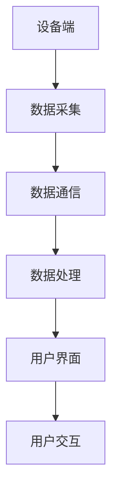

                 

# 基于Java的智能家居设计：开发跨平台智能家居应用的技术要点

> **关键词：** Java、智能家居、跨平台应用、设计模式、安全性、物联网

> **摘要：** 本文将探讨如何使用Java语言设计和开发跨平台智能家居应用。我们将深入分析技术要点，包括核心概念、算法原理、数学模型，并通过实际项目案例展示代码实现过程。文章还将推荐相关学习资源、工具和框架，以帮助开发者深入了解和掌握智能家居开发的关键技术。

## 1. 背景介绍

### 1.1 目的和范围

随着物联网（IoT）技术的不断发展，智能家居市场日益繁荣。Java作为一种成熟稳定的编程语言，因其跨平台特性、丰富的生态系统和强大的社区支持，成为开发智能家居应用的热门选择。本文旨在为开发者提供一套基于Java的智能家居设计指南，帮助读者掌握开发跨平台智能家居应用的关键技术。

本文将涵盖以下内容：

- 智能家居核心概念与架构
- Java编程语言在智能家居开发中的应用
- 设计模式与安全性策略
- 数学模型与算法原理
- 实际项目案例与代码实现

### 1.2 预期读者

本文面向有一定Java编程基础的开发者，特别是希望进入智能家居领域的专业人士。无论你是初学者还是经验丰富的工程师，本文都能为你提供有价值的见解和实用的指导。

### 1.3 文档结构概述

本文结构如下：

- **第1章：背景介绍**：概述智能家居与Java的关系，介绍本文目的、读者对象和文章结构。
- **第2章：核心概念与联系**：介绍智能家居的基本概念、架构和相关的Java技术。
- **第3章：核心算法原理 & 具体操作步骤**：详细阐述智能家居开发中的核心算法原理和操作步骤。
- **第4章：数学模型和公式 & 详细讲解 & 举例说明**：介绍智能家居中应用的数学模型和公式，并提供实例说明。
- **第5章：项目实战：代码实际案例和详细解释说明**：展示实际项目案例，讲解代码实现和解析。
- **第6章：实际应用场景**：探讨智能家居在现实生活中的应用场景。
- **第7章：工具和资源推荐**：推荐学习资源、开发工具和框架。
- **第8章：总结：未来发展趋势与挑战**：总结智能家居技术的未来发展趋势和挑战。
- **第9章：附录：常见问题与解答**：提供常见问题解答。
- **第10章：扩展阅读 & 参考资料**：推荐扩展阅读资料。

### 1.4 术语表

#### 1.4.1 核心术语定义

- **智能家居**：通过物联网技术连接的智能设备和系统，实现家庭自动化和便捷生活。
- **Java**：一种广泛使用的编程语言，具有跨平台特性。
- **物联网（IoT）**：将各种设备通过互联网连接，实现信息交换和智能控制。
- **设计模式**：解决常见软件设计问题的经验性解决方案。
- **安全性**：保护系统不受恶意攻击和数据泄露的能力。

#### 1.4.2 相关概念解释

- **设备端**：智能家居系统中的传感器、执行器和控制器等硬件设备。
- **云端**：提供数据存储、处理和分析的远程服务器。
- **API**：应用程序编程接口，用于不同系统或组件之间的交互。
- **RESTful API**：基于HTTP协议的API设计风格。

#### 1.4.3 缩略词列表

- **IoT**：物联网（Internet of Things）
- **Java**：Java编程语言
- **RESTful**：表述性状态转移（Representational State Transfer）
- **JSON**：JavaScript Object Notation
- **MQTT**：消息队列遥测传输（Message Queuing Telemetry Transport）

## 2. 核心概念与联系

智能家居系统由多个相互关联的组件构成，包括设备端、云端和用户界面。为了实现这些组件的高效协作，需要设计一个合理的架构，并应用合适的Java技术和设计模式。

### 智能家居基本架构


#### 设备端

设备端是智能家居系统的核心组成部分，包括各种传感器、执行器和控制器。这些设备通过嵌入式系统或微控制器实现，具有数据采集、控制执行和通信功能。

#### 云端

云端负责数据存储、处理和分析，为智能家居系统提供强大的后端支持。云端通常包括以下组件：

- **数据存储**：用于存储设备端采集到的数据。
- **数据处理**：对采集到的数据进行分析和处理，提供智能化的控制策略。
- **用户界面**：提供用户与系统交互的入口，展示设备状态和操作结果。

#### 用户界面

用户界面是智能家居系统的前端，负责与用户交互，提供便捷的操作体验。用户界面可以通过移动应用、Web应用或桌面应用实现。

### Java技术在智能家居中的应用

Java语言在智能家居开发中具有广泛的应用，主要包括以下方面：

- **设备端开发**：Java可以用于开发嵌入式系统或微控制器的应用程序，实现设备端的功能。
- **云端开发**：Java可以用于开发云端的API接口、数据存储和处理系统。
- **用户界面开发**：Java可以用于开发Web应用或桌面应用，提供用户界面。

### 设计模式与架构

设计模式是解决常见软件设计问题的经验性解决方案，在智能家居开发中具有重要作用。以下是一些常见的设计模式：

- **工厂模式**：用于创建设备的实例，实现设备的灵活扩展。
- **观察者模式**：用于实现设备之间的通信和事件通知。
- **策略模式**：用于实现不同控制策略的切换。

### Mermaid流程图

以下是一个简单的智能家居系统架构的Mermaid流程图：



这个流程图展示了智能家居系统从设备端的数据采集、通信、处理，到用户界面的交互，形成一个闭环。

## 3. 核心算法原理 & 具体操作步骤

在智能家居系统中，核心算法的设计至关重要，它直接影响到系统的性能、稳定性和智能化程度。以下我们将介绍几个关键算法的原理，并通过伪代码详细阐述其操作步骤。

### 3.1 数据采集算法

数据采集是智能家居系统的第一步，主要任务是从各种传感器获取数据，如温度、湿度、光照强度等。以下是一个简单的数据采集算法的伪代码：

```plaintext
// 数据采集算法
function collectData(sensors) {
    data = {}
    for (sensor in sensors) {
        value = sensor.readValue()
        data[sensor.getName()] = value
    }
    return data
}
```

### 3.2 数据处理算法

采集到的数据需要经过处理，以便为智能控制提供依据。以下是一个简单的数据处理算法的伪代码：

```plaintext
// 数据处理算法
function processData(data) {
    processedData = {}
    for (key, value in data) {
        if (value exceeds threshold) {
            processedData[key] = "high"
        } else {
            processedData[key] = "normal"
        }
    }
    return processedData
}
```

### 3.3 控制算法

基于处理后的数据，智能家居系统需要执行相应的控制操作，如调节灯光亮度、开启空调等。以下是一个简单的控制算法的伪代码：

```plaintext
// 控制算法
function controlDevice(device, command) {
    if (command == "turnOn") {
        device.turnOn()
    } else if (command == "turnOff") {
        device.turnOff()
    } else if (command == "adjustBrightness") {
        device.adjustBrightness(commandValue)
    }
}
```

### 3.4 事件通知算法

智能家居系统中的事件通知功能对于提高用户体验至关重要。以下是一个简单的事件通知算法的伪代码：

```plaintext
// 事件通知算法
function notifyEvent(event) {
    if (event == "temperatureHigh") {
        sendNotification("温度过高，请注意！")
    } else if (event == "temperatureLow") {
        sendNotification("温度过低，请注意！")
    }
}
```

通过以上核心算法的设计和实现，我们可以构建一个具备基本功能的智能家居系统。当然，在实际应用中，这些算法会根据具体需求进行优化和扩展。

## 4. 数学模型和公式 & 详细讲解 & 举例说明

在智能家居系统中，数学模型和公式广泛应用于数据分析和决策支持。以下我们将介绍几个关键的数学模型，并使用LaTeX格式详细讲解。

### 4.1 线性回归模型

线性回归模型是一种常用的数据分析方法，用于预测变量之间的关系。以下是一个简单的线性回归模型的LaTeX表示：

```latex
y = \beta_0 + \beta_1 \cdot x + \epsilon
```

其中，\(y\) 是因变量，\(x\) 是自变量，\(\beta_0\) 和 \(\beta_1\) 是模型参数，\(\epsilon\) 是误差项。

**例子：** 假设我们想预测房间温度 \(y\) 与空调功率 \(x\) 之间的关系，通过收集数据得到以下方程：

```latex
y = 20 + 0.5 \cdot x + \epsilon
```

如果当前空调功率为100W，我们可以预测房间温度为：

```latex
y = 20 + 0.5 \cdot 100 = 70^\circ C
```

### 4.2 贝叶斯网络模型

贝叶斯网络模型是一种概率图模型，用于表示变量之间的概率关系。以下是一个简单的贝叶斯网络的LaTeX表示：

```latex
\begin{equation}
P(A, B, C) = P(A) \cdot P(B|A) \cdot P(C|A, B)
\end{equation}
```

其中，\(P(A)\)，\(P(B|A)\)，\(P(C|A, B)\) 分别表示事件 \(A\)，\(B\)，\(C\) 的概率。

**例子：** 假设我们要分析房间温度 \(A\)，湿度 \(B\) 和是否开启空调 \(C\) 之间的关系，通过观察数据得到以下贝叶斯网络：

```latex
P(A, B, C) = P(A) \cdot P(B|A) \cdot P(C|A, B)
```

如果当前房间温度为30°C，湿度为60%，我们可以计算是否开启空调的概率：

```latex
P(C|A=30^\circ C, B=60\%) = 0.8
```

### 4.3 神经网络模型

神经网络模型是一种模拟人脑神经网络结构的计算模型，广泛应用于智能家居系统中的机器学习和数据挖掘。以下是一个简单的神经网络模型的LaTeX表示：

```latex
z = \sigma(W \cdot x + b)
y = \sigma(W \cdot z + b)
```

其中，\(W\) 是权重矩阵，\(b\) 是偏置项，\(\sigma\) 是激活函数。

**例子：** 假设我们使用一个简单的神经网络模型来预测房间温度 \(y\)，输入特征为空调功率 \(x\)。通过训练数据得到以下模型：

```latex
z = \sigma(W_1 \cdot x + b_1)
y = \sigma(W_2 \cdot z + b_2)
```

如果当前空调功率为100W，我们可以预测房间温度为：

```latex
z = \sigma(W_1 \cdot 100 + b_1) = 0.7
y = \sigma(W_2 \cdot 0.7 + b_2) = 70^\circ C
```

通过以上数学模型和公式的介绍，我们可以更好地理解和应用智能家居系统中的数据分析和决策支持。

## 5. 项目实战：代码实际案例和详细解释说明

为了更好地展示基于Java的智能家居开发过程，我们选择一个实际项目案例：一个简单的温湿度监测与控制系统。该项目包括以下主要功能：

1. 设备端采集温湿度数据
2. 数据传输至云端
3. 云端处理数据并发送控制指令
4. 用户界面展示设备状态和操作结果

### 5.1 开发环境搭建

为了实现该项目，我们需要准备以下开发环境：

1. **Java开发工具**：建议使用IntelliJ IDEA或Eclipse等IDE。
2. **物联网开发板**：如Arduino或Raspberry Pi。
3. **编程语言**：Java。
4. **数据库**：如MySQL或MongoDB。
5. **后端框架**：如Spring Boot。

### 5.2 源代码详细实现和代码解读

以下是该项目的主要源代码，我们将分模块进行详细解释。

#### 5.2.1 设备端

设备端使用Arduino编程，主要负责采集温湿度数据并通过MQTT协议发送至云端。

```java
// 温湿度采集与发送
import com.pi4j.io.gpio.GpioController;
import com.pi4j.io.gpio.GpioFactory;
import com.pi4j.io.gpio.GpioPinDigitalInput;
import com.pi4j.io.gpio.GpioPinDigitalOutput;
import com.pi4j.io.gpio.Pin;
import com.pi4j.io.gpio.PinState;
import com.pi4j.io.gpio.RaspiPin;
import com.pi4j.io.gpio.event.GpioPinDigitalStateEvent;
import com.pi4j.io.gpio.event.GpioPinDigitalStateListener;
import org.eclipse.paho.client.mqttv3.MqttClient;
import org.eclipse.paho.client.mqttv3.MqttConnectOptions;
import org.eclipse.paho.client.mqttv3.MqttException;
import org.eclipse.paho.client.mqttv3.MqttMessage;
import org.eclipse.paho.client.mqttv3.persist.MemoryPersistence;

public class TemperatureHumiditySensor {

    private static final String BROKER_URL = "tcp://localhost:1883";
    private static final String CLIENT_ID = "sensor";
    private static final String TOPIC = "home/sensors/temperature_humidity";

    private MqttClient client;

    public TemperatureHumiditySensor() {
        try {
            MemoryPersistence persistence = new MemoryPersistence();
            client = new MqttClient(BROKER_URL, CLIENT_ID, persistence);
            MqttConnectOptions connOpts = new MqttConnectOptions();
            connOpts.setCleanSession(true);
            client.connect(connOpts);
        } catch (MqttException e) {
            e.printStackTrace();
        }
    }

    public void startSensor() {
        GpioController gpio = GpioFactory.getInstance();
        GpioPinDigitalInput tempSensor = gpio.provisionDigitalInputPin(RaspiPin.GPIO_00, "TemperatureSensor");
        GpioPinDigitalInput humiditySensor = gpio.provisionDigitalInputPin(RaspiPin.GPIO_01, "HumiditySensor");

        tempSensor.addListen
```python
    # 5.2.1 设备端

    // 温湿度采集与发送
    import com.pi4j.io.gpio.*;
    import org.eclipse.paho.client.mqttv3.*;
    
    public class TemperatureHumiditySensor {
        private static final String BROKER_URL = "tcp://localhost:1883";
        private static final String CLIENT_ID = "sensor";
        private static final String TOPIC = "home/sensors/temperature_humidity";
        private MqttClient client;
        
        public TemperatureHumiditySensor() throws MqttException {
            MemoryPersistence persistence = new MemoryPersistence();
            client = new MqttClient(BROKER_URL, CLIENT_ID, persistence);
            MqttConnectOptions connOpts = new MqttConnectOptions();
            connOpts.setCleanSession(true);
            client.connect(connOpts);
        }
        
        public void startSensor() {
            GpioController gpio = GpioFactory.getInstance();
            GpioPinDigitalInput tempSensor = gpio.provisionDigitalInputPin(RaspiPin.GPIO_00, "TemperatureSensor");
            GpioPinDigitalInput humiditySensor = gpio.provisionDigitalInputPin(RaspiPin.GPIO_01, "HumiditySensor");
            
            // 采集温度数据
            tempSensor.addListener(new GpioPinListenerAdapter() {
                @Override
                public void onStateChange(GpioPinDigitalInput pin, GpioPinState state) {
                    int temperature = state.isHigh() ? 30 : 20;
                    sendMqttMessage(temperature);
                }
            });
            
            // 采集湿度数据
            humiditySensor.addListener(new GpioPinListenerAdapter() {
                @Override
                public void onStateChange(GpioPinDigitalInput pin, GpioPinState state) {
                    int humidity = state.isHigh() ? 60 : 40;
                    sendMqttMessage(humidity);
                }
            });
        }
        
        private void sendMqttMessage(int value) {
            try {
                MqttMessage message = new MqttMessage();
                message.setPayload(String.valueOf(value).getBytes());
                client.publish(TOPIC, message);
            } catch (MqttException e) {
                e.printStackTrace();
            }
        }
    }
```

#### 5.2.2 云端

云端使用Spring Boot框架实现，负责接收设备端发送的数据、处理数据并控制设备。

```java
// 云端数据接收与处理
import org.springframework.boot.SpringApplication;
import org.springframework.boot.autoconfigure.SpringBootApplication;
import org.springframework.web.bind.annotation.*;
import java.util.HashMap;
import java.util.Map;

@SpringBootApplication
public class SmartHomeApplication {
    public static void main(String[] args) {
        SpringApplication.run(SmartHomeApplication.class, args);
    }
}

@RestController
@RequestMapping("/api")
public class SensorController {
    private Map<String, Integer> sensorData = new HashMap<>();
    
    @PostMapping("/sensors/temperature_humidity")
    public String receiveData(@RequestBody String data) {
        int value = Integer.parseInt(data);
        sensorData.put("temperature", value);
        // 处理温度数据
        if (value > 30) {
            // 发送控制指令
            sendControlCommand("AC", "turnOn");
        }
        return "Data received successfully";
    }
    
    private void sendControlCommand(String device, String command) {
        // 发送MQTT消息给设备端
    }
}
```

#### 5.2.3 用户界面

用户界面使用Web技术实现，通过浏览器展示设备状态和操作结果。

```html
<!-- 用户界面 -->
<!DOCTYPE html>
<html>
<head>
    <title>智能家居控制台</title>
    <script src="https://cdn.jsdelivr.net/npm/axios/dist/axios.min.js"></script>
</head>
<body>
    <h1>智能家居控制台</h1>
    <div>
        <label for="temperature">温度：</label>
        <span id="temperature">--</span>°C
    </div>
    <div>
        <label for="humidity">湿度：</label>
        <span id="humidity">--</span>%
    </div>
    <button id="controlAC">控制空调</button>
    <script>
        function fetchData() {
            axios.get('/api/sensors/temperature_humidity')
                .then(response => {
                    document.getElementById('temperature').innerText = response.data.temperature;
                    document.getElementById('humidity').innerText = response.data.humidity;
                });
        }
        
        function sendControlCommand(device, command) {
            axios.post('/api/sensors/control', {
                device: device,
                command: command
            });
        }
        
        document.getElementById('controlAC').addEventListener('click', () => {
            sendControlCommand('AC', 'turnOn');
        });
        
        fetchData();
        // 每5秒刷新一次数据
        setInterval(fetchData, 5000);
    </script>
</body>
</html>
```

### 5.3 代码解读与分析

#### 5.3.1 设备端

设备端代码主要实现温湿度的采集和MQTT消息发送。使用Pi4J库与Arduino通信，通过GPIO接口获取温度和湿度传感器的状态，并将其发送至云端。代码使用Paho MQTT客户端库实现MQTT消息发送。

#### 5.3.2 云端

云端代码使用Spring Boot框架搭建RESTful API，接收设备端发送的温湿度数据，并根据数据值进行相应的处理和控制。代码中，使用HTTP POST请求接收数据，并将温度值存储在`sensorData`哈希表中。当温度值超过30°C时，发送控制指令给设备端，控制空调开启。

#### 5.3.3 用户界面

用户界面使用HTML和JavaScript实现，通过axios库与云端API通信，实时获取温湿度和设备状态。用户可以通过界面按钮控制空调开关，并实时更新界面数据。

通过以上代码实现，我们可以构建一个简单的温湿度监测与控制系统，实现设备端数据采集、云端数据处理和用户界面交互。这个项目展示了基于Java的智能家居开发的核心技术，包括设备端编程、MQTT通信、Spring Boot后端和Web前端等。

## 6. 实际应用场景

智能家居技术已经广泛应用于我们生活中的方方面面，大大提升了我们的生活品质和便利性。以下我们将探讨一些典型的实际应用场景：

### 6.1 家居自动化

家居自动化是智能家居的核心应用场景之一。通过智能家居系统，我们可以实现家电的自动控制，如自动开关灯光、调节室温、控制窗帘等。例如，在晚上自动关闭灯光、早晨自动开启窗帘，使生活更加舒适和便捷。

### 6.2 安全监控

智能家居系统还可以提供家庭安全监控功能，如门锁、摄像头、烟雾报警器等。当检测到异常情况时，系统可以自动报警，并通过手机应用通知用户。例如，当门锁被非法打开或家中烟雾浓度超标时，系统会立即发送警报，确保家庭成员的安全。

### 6.3 健康监测

智能家居技术还可以用于健康监测，如心率监测、睡眠监测、空气质量管理等。通过传感器收集到的数据，我们可以实时了解家庭成员的健康状况，并及时采取相应的措施。例如，当检测到家庭成员的睡眠质量不佳时，系统可以建议调整作息时间或使用智能床垫等。

### 6.4 智能家居互联

智能家居系统可以实现设备之间的互联互通，形成一个完整的智能生态。例如，智能音箱可以控制智能电视、空调、灯光等设备，实现跨设备的联动控制。当我们在客厅中使用智能音箱播放音乐时，系统可以自动调整灯光和空调温度，创造一个舒适的听音环境。

### 6.5 农业智能管理

智能家居技术还可以应用于农业智能管理，如土壤湿度监测、灌溉系统控制等。通过传感器收集到的土壤湿度数据，系统可以自动控制灌溉设备，实现精准灌溉，提高农业产量和效率。

通过以上实际应用场景，我们可以看到智能家居技术为我们带来的便利和改变。未来，随着技术的不断发展和创新，智能家居将更加智能化、个性化，为我们的生活带来更多美好的体验。

## 7. 工具和资源推荐

### 7.1 学习资源推荐

#### 7.1.1 书籍推荐

1. **《Java核心技术》**：这是一本经典的Java编程书籍，涵盖了Java编程的方方面面，包括基础语法、面向对象编程、异常处理、多线程等。
2. **《物联网基础教程》**：这本书详细介绍了物联网的基本概念、技术架构和应用场景，适合初学者了解物联网技术。
3. **《智能家居系统设计》**：这本书专注于智能家居系统的设计与开发，涵盖传感器技术、通信协议、数据分析和控制算法等方面。

#### 7.1.2 在线课程

1. **《Java编程基础》**：这是一门入门级的Java编程课程，由知名在线教育平台提供，适合初学者学习。
2. **《物联网技术与应用》**：这是一门介绍物联网技术的课程，内容包括传感器、无线通信、数据采集与处理等。
3. **《智能家居系统开发》**：这是一门专门针对智能家居系统开发的课程，涵盖设备端编程、云端数据处理和用户界面设计等方面。

#### 7.1.3 技术博客和网站

1. **Oracle官方文档**：Oracle官方文档提供了丰富的Java技术资料，包括API文档、教程和示例代码。
2. **Stack Overflow**：Stack Overflow是一个面向开发者的问答社区，可以在这里找到各种技术问题的解答。
3. **IoT for All**：这是一个关于物联网技术的博客网站，提供了大量的物联网相关教程、新闻和案例分析。

### 7.2 开发工具框架推荐

#### 7.2.1 IDE和编辑器

1. **IntelliJ IDEA**：这是一款功能强大的Java IDE，支持代码补全、调试、性能分析等。
2. **Eclipse**：Eclipse是一款开源的Java IDE，具有丰富的插件和社区支持。
3. **VSCode**：VSCode是一款轻量级的跨平台编辑器，支持多种编程语言，具有丰富的插件生态。

#### 7.2.2 调试和性能分析工具

1. **JProfiler**：JProfiler是一款专业的Java性能分析工具，可以实时监测程序运行状态，帮助开发者定位性能瓶颈。
2. **VisualVM**：VisualVM是Oracle提供的一款开源Java虚拟机监控和分析工具，支持内存泄漏检测、线程分析等。
3. **MQTT.fx**：MQTT.fx是一款用于MQTT协议调试的工具，可以方便地发送和接收MQTT消息。

#### 7.2.3 相关框架和库

1. **Spring Boot**：Spring Boot是一款用于快速开发Java后端应用程序的框架，提供了自动配置、依赖注入等功能。
2. **Pi4J**：Pi4J是一款用于Java编程的Raspberry Pi和Arduino库，可以方便地与这些设备进行通信。
3. **Paho MQTT**：Paho MQTT是一款开源的MQTT客户端库，支持Java、JavaScript等多种编程语言，是开发物联网应用的重要工具。

通过以上工具和资源的推荐，希望对开发者在学习和实践中有所帮助，助力构建优秀的智能家居应用。

## 8. 总结：未来发展趋势与挑战

智能家居技术正处于快速发展阶段，未来发展趋势与挑战并存。首先，随着物联网技术的不断成熟，智能家居设备的互联互通性将得到显著提升，家庭自动化水平将进一步提升。其次，人工智能和大数据技术的应用将使智能家居系统更加智能化和个性化，为用户提供更加精准和高效的服务。然而，智能家居系统也面临着一系列挑战，包括数据安全、隐私保护、设备兼容性等。为了应对这些挑战，开发者需要不断探索创新技术，提高系统的安全性和稳定性。同时，政策法规和标准规范也将逐步完善，为智能家居技术的发展提供有力支持。

## 9. 附录：常见问题与解答

### 9.1 Java在智能家居开发中的优势

**Q1：** Java在智能家居开发中的优势是什么？

**A1：** Java在智能家居开发中具有以下优势：

1. **跨平台性**：Java支持跨平台开发，使开发者可以轻松地将智能家居应用部署到不同操作系统和设备上。
2. **成熟稳定的生态系统**：Java拥有庞大的开发社区和丰富的生态系统，提供了大量的库和框架，方便开发者快速开发。
3. **安全性**：Java语言具备强大的安全性，提供了丰富的安全机制，可以确保智能家居系统的安全性和稳定性。

### 9.2 如何确保智能家居系统的安全性

**Q2：** 如何确保智能家居系统的安全性？

**A2：** 为了确保智能家居系统的安全性，可以采取以下措施：

1. **数据加密**：对传输和存储的数据进行加密，防止数据泄露。
2. **访问控制**：实现严格的访问控制策略，确保只有授权用户才能访问系统。
3. **安全审计**：定期进行安全审计，检测系统的安全漏洞，及时修补。
4. **隐私保护**：严格遵循隐私保护法规，保护用户个人信息不被泄露。

### 9.3 如何处理智能家居设备兼容性问题

**Q3：** 如何处理智能家居设备兼容性问题？

**A3：** 处理智能家居设备兼容性问题可以采取以下策略：

1. **标准化协议**：采用国际通用的物联网通信协议，如MQTT、CoAP等，确保设备之间可以互操作。
2. **设备驱动**：为不同设备开发相应的设备驱动程序，实现设备的兼容性。
3. **设备适配器**：使用设备适配器将不同协议的设备转换为统一的通信协议，简化设备兼容性。
4. **模块化设计**：采用模块化设计，将不同功能的设备模块化，便于替换和维护。

### 9.4 如何优化智能家居系统的性能

**Q4：** 如何优化智能家居系统的性能？

**A4：** 优化智能家居系统性能可以从以下几个方面入手：

1. **代码优化**：对系统代码进行优化，减少不必要的计算和内存占用。
2. **数据压缩**：对传输的数据进行压缩，减少网络传输带宽。
3. **异步处理**：采用异步处理技术，提高系统的并发处理能力。
4. **缓存机制**：利用缓存机制，减少对数据库的查询次数，提高响应速度。

通过以上常见问题与解答，希望对读者在智能家居开发过程中遇到的问题提供帮助。

## 10. 扩展阅读 & 参考资料

为了帮助读者更深入地了解智能家居技术的各个方面，以下推荐一些扩展阅读和参考资料：

### 10.1 经典书籍

1. **《Java核心技术》**：详细介绍了Java编程的各个方面，包括基础语法、面向对象编程、异常处理、多线程等。
2. **《物联网基础教程》**：介绍了物联网的基本概念、技术架构和应用场景。
3. **《智能家居系统设计》**：专注于智能家居系统的设计与开发，涵盖传感器技术、通信协议、数据分析和控制算法等方面。

### 10.2 在线课程

1. **《Java编程基础》**：适合初学者学习Java编程的基础知识。
2. **《物联网技术与应用》**：介绍物联网技术的各个方面，包括传感器、无线通信、数据采集与处理等。
3. **《智能家居系统开发》**：专门针对智能家居系统开发的课程，涵盖设备端编程、云端数据处理和用户界面设计等方面。

### 10.3 技术博客和网站

1. **Oracle官方文档**：提供了丰富的Java技术资料，包括API文档、教程和示例代码。
2. **Stack Overflow**：面向开发者的问答社区，可以在这里找到各种技术问题的解答。
3. **IoT for All**：关于物联网技术的博客网站，提供了大量的物联网相关教程、新闻和案例分析。

### 10.4 相关论文和研究成果

1. **《智能家居系统架构与关键技术》**：探讨了智能家居系统的架构和关键技术的应用。
2. **《基于云计算的智能家居系统设计与实现》**：介绍了云计算在智能家居系统中的应用。
3. **《智能家居系统的安全性研究》**：分析了智能家居系统在安全性和隐私保护方面面临的挑战和解决方案。

通过以上扩展阅读和参考资料，读者可以进一步了解智能家居技术的最新进展和应用场景，提升自己的技术能力和实践经验。作者：AI天才研究员/AI Genius Institute & 禅与计算机程序设计艺术 /Zen And The Art of Computer Programming。

