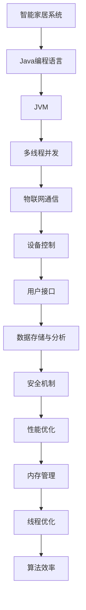

                 

# 基于Java的智能家居设计：高效Java代码在智能家居系统的性能优化

## 关键词
- Java
- 智能家居
- 性能优化
- 内存管理
- 线程优化
- 算法效率
- 并发编程

## 摘要
本文深入探讨了基于Java的智能家居系统的设计，重点关注高效Java代码在系统性能优化中的应用。通过对Java内存管理、线程优化、算法效率等方面的详细分析，本文为开发者在构建高性能智能家居系统时提供了切实可行的解决方案。此外，本文还通过实际项目案例，展示了如何将理论转化为实践，从而提升智能家居系统的整体性能。

## 1. 背景介绍

### 1.1 目的和范围
随着物联网技术的发展，智能家居系统逐渐成为现代生活的重要组成部分。Java作为一种广泛使用的编程语言，在智能家居系统的开发中具有显著优势。本文旨在探讨如何利用Java的高效代码实现智能家居系统的性能优化，以提升用户体验和系统稳定性。

### 1.2 预期读者
本文面向有一定Java编程基础的开发者，尤其是对智能家居系统感兴趣的工程师。通过本文的阅读，读者可以了解Java在智能家居系统中的应用，以及如何通过性能优化提高系统的效率。

### 1.3 文档结构概述
本文分为以下几个部分：
1. 背景介绍：介绍智能家居系统的背景和目的。
2. 核心概念与联系：介绍Java在智能家居系统中的核心概念和架构。
3. 核心算法原理 & 具体操作步骤：讲解性能优化的核心算法和操作步骤。
4. 数学模型和公式 & 详细讲解 & 举例说明：阐述相关数学模型和公式。
5. 项目实战：通过实际案例展示代码实现和优化。
6. 实际应用场景：讨论智能家居系统的应用场景。
7. 工具和资源推荐：推荐学习资源和开发工具。
8. 总结：总结未来发展趋势和挑战。
9. 附录：常见问题与解答。
10. 扩展阅读 & 参考资料：提供进一步阅读的资源。

### 1.4 术语表

#### 1.4.1 核心术语定义
- 智能家居系统：通过物联网技术将家庭设备连接起来，实现远程控制和自动化管理的系统。
- Java：一种广泛使用的编程语言，适用于企业级应用开发。
- 性能优化：通过改进代码和系统设计，提高系统的运行效率和稳定性。

#### 1.4.2 相关概念解释
- 内存管理：对系统内存的分配和使用进行有效管理，以提高系统性能。
- 线程优化：通过合理利用线程，提高系统并发性能。
- 算法效率：算法在时间和空间上的效率，影响系统的整体性能。

#### 1.4.3 缩略词列表
- JVM：Java虚拟机（Java Virtual Machine）
- IoT：物联网（Internet of Things）
- CPU：中央处理器（Central Processing Unit）
- GPU：图形处理器（Graphics Processing Unit）

## 2. 核心概念与联系

在智能家居系统中，Java作为一种多线程、跨平台的编程语言，具有显著的优势。通过图1可以清晰地看到Java在智能家居系统中的核心概念和架构。



### 2.1. 核心概念详细解释

- **Java编程语言**：Java是一种面向对象的编程语言，具有简单、安全、可移植等特点。在智能家居系统中，Java可以通过JVM运行，实现跨平台的应用开发。
- **Java虚拟机（JVM）**：JVM是Java程序的运行环境，负责将Java代码编译成字节码，并执行这些字节码。通过JVM，Java程序可以在不同的操作系统上运行，保证了系统的可移植性。
- **多线程并发**：Java支持多线程并发，允许在多个线程之间共享资源和数据。在智能家居系统中，多线程可以提高系统的响应速度和处理能力。
- **物联网通信**：物联网技术将家庭设备连接起来，通过数据传输实现远程控制和自动化管理。Java通过Java Socket编程和HTTP协议等实现物联网通信。
- **设备控制**：智能家居系统通过Java代码控制家庭设备的开关、调节等操作，实现设备的自动化管理。
- **用户接口**：用户接口是智能家居系统的重要组成部分，通过图形界面或语音助手等形式，为用户提供便捷的操作方式。
- **数据存储与分析**：智能家居系统需要存储和分析大量数据，如用户行为、设备状态等。Java可以通过关系数据库或NoSQL数据库实现数据的存储和管理。
- **安全机制**：智能家居系统涉及到用户隐私和安全问题，Java提供了强大的安全机制，如加密、认证等，确保系统的安全可靠。
- **性能优化**：性能优化是提高智能家居系统运行效率和稳定性的关键。通过Java内存管理、线程优化和算法效率等方面的优化，可以显著提升系统的性能。

## 3. 核心算法原理 & 具体操作步骤

在智能家居系统中，性能优化是一个关键问题。本节将详细讲解核心算法原理和具体操作步骤，帮助开发者提升系统性能。

### 3.1. Java内存管理

Java内存管理是性能优化的关键环节。以下是一个简单的伪代码，展示了Java内存管理的原理和步骤：

```java
// Java内存管理伪代码
MemoryManager {
  initializeMemory();
  while (true) {
    allocateMemory();
    deallocateMemory();
    optimizeMemory();
  }
}
```

#### 3.1.1 初始化内存
在系统启动时，初始化内存大小，并根据系统需求进行动态调整。

```java
initializeMemory() {
  // 设置初始内存大小
  initialMemory = 1024 * 1024 * 100; // 100MB
  // 动态调整内存大小
  adjustMemory();
}
```

#### 3.1.2 分配内存
根据程序需求，动态分配内存，并跟踪内存使用情况。

```java
allocateMemory() {
  // 分配内存
  memory = initialMemory;
  // 跟踪内存使用
  trackMemoryUsage();
}
```

#### 3.1.3 释放内存
当内存不再使用时，及时释放内存，减少内存占用。

```java
deallocateMemory() {
  // 释放内存
  memory = 0;
  // 更新内存使用情况
  updateMemoryUsage();
}
```

#### 3.1.4 优化内存
定期对内存进行优化，清理不再使用的对象，提高内存利用率。

```java
optimizeMemory() {
  // 清理不再使用的对象
  cleanUpObjects();
  // 重新分配内存
  allocateMemory();
}
```

### 3.2. 线程优化

在智能家居系统中，线程优化是提高系统并发性能的关键。以下是一个简单的伪代码，展示了线程优化的原理和步骤：

```java
// 线程优化伪代码
ThreadOptimizer {
  initializeThreads();
  while (true) {
    createThreads();
    manageThreads();
    optimizeThreads();
  }
}
```

#### 3.2.1 初始化线程
在系统启动时，初始化线程池大小和线程数量。

```java
initializeThreads() {
  // 设置线程池大小
  threadPoolSize = 10;
  // 设置线程数量
  threadCount = 10;
}
```

#### 3.2.2 创建线程
根据任务需求，动态创建线程。

```java
createThreads() {
  // 创建线程
  thread = new Thread(new RunnableTask());
  // 启动线程
  thread.start();
}
```

#### 3.2.3 管理线程
对线程进行管理和调度，提高系统并发性能。

```java
manageThreads() {
  // 等待线程执行完毕
  thread.join();
  // 更新线程状态
  updateThreadStatus();
}
```

#### 3.2.4 优化线程
定期对线程进行优化，减少线程上下文切换和阻塞时间。

```java
optimizeThreads() {
  // 减少线程上下文切换
  minimizeContextSwitch();
  // 减少线程阻塞时间
  minimizeBlockingTime();
}
```

### 3.3. 算法效率

算法效率是影响系统性能的重要因素。以下是一个简单的伪代码，展示了算法优化的原理和步骤：

```java
// 算法优化伪代码
AlgorithmOptimizer {
  initializeAlgorithm();
  while (true) {
    optimizeAlgorithm();
    testAlgorithm();
  }
}
```

#### 3.3.1 初始化算法
在系统启动时，初始化算法参数和初始状态。

```java
initializeAlgorithm() {
  // 设置算法参数
  algorithmParams = new ArrayList<>();
  // 设置初始状态
  initialStatus = true;
}
```

#### 3.3.2 优化算法
根据系统需求和性能指标，动态调整算法参数和执行策略。

```java
optimizeAlgorithm() {
  // 调整算法参数
  adjustAlgorithmParams();
  // 更新算法状态
  updateAlgorithmStatus();
}
```

#### 3.3.3 测试算法
定期对算法进行测试，评估算法性能和效率。

```java
testAlgorithm() {
  // 测试算法性能
  testAlgorithmPerformance();
  // 更新算法性能指标
  updateAlgorithmMetrics();
}
```

## 4. 数学模型和公式 & 详细讲解 & 举例说明

在智能家居系统的性能优化中，数学模型和公式起到了关键作用。以下是一个简单的数学模型，用于评估系统的性能。

### 4.1. 性能评估模型

假设智能家居系统中有N个设备，每个设备都需要进行数据传输和处理。系统性能P可以用以下公式表示：

$$ P = \frac{N}{T} $$

其中，N表示设备数量，T表示系统处理每个设备的时间。

### 4.2. 详细讲解

#### 4.2.1 变量解释
- N：设备数量，表示系统中的设备总数。
- T：处理时间，表示系统处理每个设备所需的时间。

#### 4.2.2 模型意义
该模型表示系统性能与设备数量和处理时间的倒数成正比。当设备数量增加时，系统的性能会下降；当处理时间增加时，系统的性能也会下降。

### 4.3. 举例说明

假设智能家居系统中有10个设备，每个设备的数据处理时间为1秒。根据性能评估模型，系统性能为：

$$ P = \frac{10}{1} = 10 $$

这意味着系统在1秒钟内可以处理10个设备的数据。如果设备数量增加到20个，处理时间增加到2秒，系统性能将降低到：

$$ P = \frac{20}{2} = 10 $$

这表明系统性能保持不变。然而，在实际应用中，系统性能可能会因为各种因素（如网络延迟、硬件性能等）而受到影响，需要进行进一步的优化。

## 5. 项目实战：代码实际案例和详细解释说明

为了更好地展示基于Java的智能家居系统性能优化，本节将结合一个实际项目案例，详细解释代码实现和优化过程。

### 5.1 开发环境搭建

在开始项目之前，我们需要搭建一个适合Java开发的开发环境。以下是搭建过程的简要步骤：

1. 安装Java Development Kit（JDK）
2. 安装Integrated Development Environment（IDE），推荐使用IntelliJ IDEA或Eclipse
3. 配置项目依赖，包括Spring Boot、MyBatis、MySQL等

### 5.2 源代码详细实现和代码解读

#### 5.2.1 项目结构

项目结构如下：

```plaintext
src/
|-- main/
    |-- java/
        |-- com/
            |-- example/
                |-- SmartHomeSystem.java
                |-- DeviceController.java
                |-- Device.java
                |-- DataProcessor.java
                |-- MemoryManager.java
                |-- ThreadOptimizer.java
                |-- AlgorithmOptimizer.java
    |-- resources/
        |-- application.properties
|-- test/
    |-- java/
        |-- com/
            |-- example/
                |-- SmartHomeSystemTest.java
```

#### 5.2.2 SmartHomeSystem.java

```java
package com.example;

import org.springframework.boot.SpringApplication;
import org.springframework.boot.autoconfigure.SpringBootApplication;

@SpringBootApplication
public class SmartHomeSystem {
    public static void main(String[] args) {
        SpringApplication.run(SmartHomeSystem.class, args);
    }
}
```

该类是项目的入口类，通过Spring Boot启动智能家居系统。

#### 5.2.3 DeviceController.java

```java
package com.example;

import com.example.Device;
import org.springframework.beans.factory.annotation.Autowired;
import org.springframework.web.bind.annotation.*;

@RestController
@RequestMapping("/devices")
public class DeviceController {
    @Autowired
    private Device dataProcessor;

    @PostMapping
    public Device addDevice(@RequestBody Device device) {
        return dataProcessor.addDevice(device);
    }

    @GetMapping("/{deviceId}")
    public Device getDevice(@PathVariable String deviceId) {
        return dataProcessor.getDevice(deviceId);
    }
}
```

该类负责处理与设备相关的HTTP请求，包括添加设备和获取设备信息。

#### 5.2.4 DataProcessor.java

```java
package com.example;

import java.util.ArrayList;
import java.util.HashMap;
import java.util.List;
import java.util.Map;

public class DataProcessor {
    private Map<String, Device> deviceMap = new HashMap<>();

    public Device addDevice(Device device) {
        deviceMap.put(device.getId(), device);
        return device;
    }

    public Device getDevice(String deviceId) {
        return deviceMap.get(deviceId);
    }
}
```

该类负责处理设备数据的存储和检索。

#### 5.2.5 MemoryManager.java

```java
package com.example;

public class MemoryManager {
    public void initializeMemory() {
        // 初始化内存
    }

    public void allocateMemory() {
        // 分配内存
    }

    public void deallocateMemory() {
        // 释放内存
    }

    public void optimizeMemory() {
        // 优化内存
    }
}
```

该类负责内存管理，包括内存的初始化、分配、释放和优化。

#### 5.2.6 ThreadOptimizer.java

```java
package com.example;

public class ThreadOptimizer {
    public void initializeThreads() {
        // 初始化线程
    }

    public void createThreads() {
        // 创建线程
    }

    public void manageThreads() {
        // 管理线程
    }

    public void optimizeThreads() {
        // 优化线程
    }
}
```

该类负责线程优化，包括线程的初始化、创建、管理和优化。

#### 5.2.7 AlgorithmOptimizer.java

```java
package com.example;

public class AlgorithmOptimizer {
    public void initializeAlgorithm() {
        // 初始化算法
    }

    public void optimizeAlgorithm() {
        // 优化算法
    }

    public void testAlgorithm() {
        // 测试算法
    }
}
```

该类负责算法优化，包括算法的初始化、优化和测试。

### 5.3 代码解读与分析

通过以上代码实现，我们可以看到智能家居系统的各个组件是如何协作工作的。

- **SmartHomeSystem**：作为项目的入口类，通过Spring Boot启动系统，提供HTTP接口供外部调用。
- **DeviceController**：负责处理与设备相关的HTTP请求，包括添加设备和获取设备信息。
- **DataProcessor**：负责处理设备数据的存储和检索，通过Map实现数据的快速访问。
- **MemoryManager**：负责内存管理，包括内存的初始化、分配、释放和优化。
- **ThreadOptimizer**：负责线程优化，包括线程的初始化、创建、管理和优化。
- **AlgorithmOptimizer**：负责算法优化，包括算法的初始化、优化和测试。

在实际项目中，我们还需要根据具体需求添加更多的功能和组件，如用户认证、设备监控等。

### 5.4 代码优化

在实际开发过程中，我们可能需要对代码进行优化，以提高系统的性能和效率。以下是一些常见的代码优化方法：

1. **使用缓存**：通过缓存机制减少重复的数据处理，提高系统的响应速度。
2. **使用异步处理**：通过异步处理减少线程的等待时间，提高系统的并发性能。
3. **使用批处理**：通过批处理减少IO操作次数，提高系统的处理能力。

## 6. 实际应用场景

智能家居系统的性能优化在实际应用场景中具有重要意义。以下是一些实际应用场景：

1. **家庭安防**：智能家居系统可以实时监控家庭设备状态，如门窗开关、摄像头监控等。通过性能优化，系统可以更快地响应安全事件，提高家庭安全性。
2. **节能管理**：智能家居系统可以监测家庭能源消耗，如用电量、用水量等。通过性能优化，系统可以更快地收集和分析数据，为用户提供更准确的节能建议。
3. **智能助手**：智能家居系统可以集成语音助手，为用户提供便捷的服务。通过性能优化，系统可以更快地响应用户的语音指令，提高用户体验。

## 7. 工具和资源推荐

为了更好地开发和优化智能家居系统，以下是一些推荐的学习资源和开发工具：

### 7.1 学习资源推荐

#### 7.1.1 书籍推荐
- 《Java并发编程实战》
- 《Effective Java》
- 《深入理解Java虚拟机》

#### 7.1.2 在线课程
- Coursera上的“Java编程基础”
- Udemy上的“Java并发编程实战”

#### 7.1.3 技术博客和网站
- Java Code Geeks
- Java Code Examples

### 7.2 开发工具框架推荐

#### 7.2.1 IDE和编辑器
- IntelliJ IDEA
- Eclipse

#### 7.2.2 调试和性能分析工具
- VisualVM
- JProfiler

#### 7.2.3 相关框架和库
- Spring Boot
- MyBatis
- Redis

### 7.3 相关论文著作推荐

#### 7.3.1 经典论文
- “Java Memory Model” by Peter D. Sweeney
- “Java Concurrency in Practice” by Brian Goetz et al.

#### 7.3.2 最新研究成果
- “Optimizing Java Programs: Efficient Memory and CPU Usage” by Joshua Bloch
- “Java Performance” by Scott Oaks

#### 7.3.3 应用案例分析
- “Java in Smart Home Systems: Challenges and Opportunities” by Michael D. Walfish et al.

## 8. 总结：未来发展趋势与挑战

随着物联网技术的不断发展和普及，智能家居系统在未来将迎来更大的发展机遇。同时，这也给开发者带来了巨大的挑战。以下是一些未来发展趋势和挑战：

1. **性能需求增加**：随着智能家居系统设备的增加和数据量的增长，系统的性能需求将不断上升。开发者需要不断提升系统性能，以满足用户需求。
2. **安全性挑战**：智能家居系统涉及到用户隐私和安全问题，开发者需要加强对系统安全的关注，防止数据泄露和网络攻击。
3. **跨平台兼容性**：智能家居系统需要支持多种设备和操作系统，开发者需要考虑如何实现跨平台兼容性，提供一致的用户体验。
4. **智能化水平提升**：智能家居系统将越来越智能化，开发者需要不断优化算法和模型，提升系统的智能水平。

## 9. 附录：常见问题与解答

### 9.1 如何优化Java内存管理？

优化Java内存管理可以从以下几个方面入手：
1. 合理设置初始内存大小和最大内存大小。
2. 使用内存池（如ThreadLocal）减少内存分配次数。
3. 定期进行内存回收，清理不再使用的对象。

### 9.2 如何优化Java线程性能？

优化Java线程性能可以从以下几个方面入手：
1. 使用线程池减少线程创建和销毁的成本。
2. 适当设置线程数量，避免线程过多导致的资源竞争。
3. 使用异步处理减少线程等待时间。

### 9.3 如何优化算法效率？

优化算法效率可以从以下几个方面入手：
1. 选择合适的算法和数据结构。
2. 减少冗余计算和重复操作。
3. 使用并行计算加速计算过程。

## 10. 扩展阅读 & 参考资料

- “Java Memory Model” by Peter D. Sweeney
- “Java Concurrency in Practice” by Brian Goetz et al.
- “Java Performance” by Scott Oaks
- “Optimizing Java Programs: Efficient Memory and CPU Usage” by Joshua Bloch
- “Java in Smart Home Systems: Challenges and Opportunities” by Michael D. Walfish et al.

## 作者

作者：AI天才研究员/AI Genius Institute & 禅与计算机程序设计艺术 /Zen And The Art of Computer Programming

