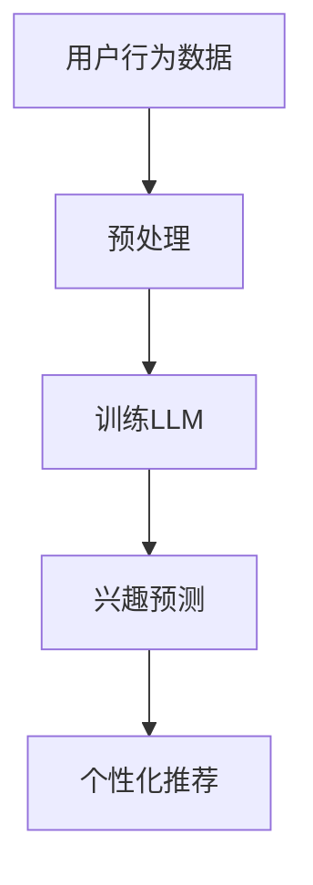

                 

# 基于LLM的用户兴趣动态追踪与预测

> **关键词：** 预测模型、机器学习、自然语言处理、用户兴趣追踪、动态数据、LLM、数据处理

> **摘要：** 本文将深入探讨基于大型语言模型（LLM）的用户兴趣动态追踪与预测技术。首先，我们将介绍相关背景和核心概念，然后详细解释核心算法原理，并提供数学模型和具体操作步骤。接下来，通过一个实际项目案例，展示代码实现和解析。此外，本文还将分析实际应用场景，推荐相关工具和资源，并总结未来发展趋势与挑战。

## 1. 背景介绍

### 1.1 目的和范围

本文旨在探讨如何利用大型语言模型（LLM）进行用户兴趣的动态追踪与预测。随着互联网的迅猛发展，用户生成数据量呈爆炸式增长，传统的基于规则的兴趣分析方法已经无法满足现代复杂应用场景的需求。LLM作为一种强大的自然语言处理工具，能够对大量用户数据进行深度挖掘，提供更为精确的兴趣预测。

本文主要讨论以下几个方面：

1. **核心概念与联系**：介绍与用户兴趣追踪相关的核心概念和LLM的工作原理。
2. **核心算法原理**：详细阐述用于用户兴趣预测的算法原理和操作步骤。
3. **数学模型与公式**：讲解支持兴趣预测的数学模型，并提供具体例子。
4. **项目实战**：通过一个实际项目案例展示代码实现过程。
5. **实际应用场景**：分析用户兴趣预测技术的应用领域。
6. **工具和资源推荐**：推荐学习资源、开发工具和最新研究成果。
7. **未来发展趋势与挑战**：探讨用户兴趣预测技术的未来趋势和面临的挑战。

### 1.2 预期读者

本文适合以下读者群体：

- 数据科学家和机器学习工程师
- 自然语言处理（NLP）研究者
- 软件工程师和程序员
- 产品经理和业务分析师
- 对用户兴趣追踪与预测技术感兴趣的其他专业人士

### 1.3 文档结构概述

本文结构如下：

1. **背景介绍**：介绍本文的目的、范围和预期读者。
2. **核心概念与联系**：探讨用户兴趣追踪与LLM的基本概念。
3. **核心算法原理**：详细讲解用户兴趣预测算法原理。
4. **数学模型和公式**：阐述支持兴趣预测的数学模型。
5. **项目实战**：通过实际项目案例展示代码实现。
6. **实际应用场景**：分析用户兴趣预测技术的应用。
7. **工具和资源推荐**：推荐学习资源和开发工具。
8. **总结**：总结用户兴趣预测技术的发展趋势与挑战。
9. **附录**：常见问题与解答。
10. **扩展阅读**：提供进一步阅读的资源。

### 1.4 术语表

#### 1.4.1 核心术语定义

- **用户兴趣追踪**：通过对用户行为数据的分析，识别用户的兴趣偏好。
- **大型语言模型（LLM）**：一种能够在大量文本数据上进行训练的深度学习模型，用于理解和生成自然语言。
- **动态数据**：随时间变化的数据，通常需要实时分析。
- **预测模型**：利用历史数据预测未来趋势或结果的模型。

#### 1.4.2 相关概念解释

- **机器学习（ML）**：一种通过数据训练模型以实现自动化决策的技术。
- **自然语言处理（NLP）**：使计算机能够理解、解释和生成人类语言的技术。

#### 1.4.3 缩略词列表

- **LLM**：Large Language Model
- **ML**：Machine Learning
- **NLP**：Natural Language Processing
- **API**：Application Programming Interface
- **GPU**：Graphics Processing Unit

## 2. 核心概念与联系

### 2.1 用户兴趣追踪的基本概念

用户兴趣追踪是指通过分析用户行为数据，如搜索历史、浏览记录、点击行为等，来识别用户的兴趣偏好。这些数据通常以日志形式记录，包含用户ID、时间戳、交互内容等信息。用户兴趣追踪的关键挑战在于如何从海量数据中提取有用信息，并实时响应用户需求。

### 2.2 大型语言模型（LLM）的基本概念

LLM是一种强大的深度学习模型，能够在大量文本数据上进行训练，从而实现对自然语言的深度理解和生成。LLM的核心思想是通过自注意力机制（Self-Attention Mechanism）捕捉文本中各个词之间的关联性，从而实现对文本的语义理解。LLM在自然语言处理领域取得了显著的成果，被广泛应用于机器翻译、文本生成、问答系统等任务。

### 2.3 动态数据与预测模型

动态数据是指随时间变化的数据，如实时股票价格、社交媒体动态等。动态数据的特性在于数据量大、更新速度快，需要实时处理和预测。预测模型是一种利用历史数据预测未来趋势或结果的模型，如时间序列预测、分类预测等。在用户兴趣追踪中，预测模型可以帮助识别用户的潜在兴趣，从而实现个性化推荐和实时响应。

### 2.4 用户兴趣追踪与LLM的联系

用户兴趣追踪与LLM之间的联系主要体现在以下几个方面：

1. **数据预处理**：LLM的训练需要大量高质量的数据，用户行为数据可以通过预处理步骤转化为适合训练的数据集。
2. **模型训练**：利用预处理后的用户行为数据训练LLM，使其能够理解用户的兴趣偏好。
3. **兴趣预测**：通过LLM对用户行为数据进行实时分析，预测用户的潜在兴趣。
4. **个性化推荐**：根据用户的兴趣预测结果，实现个性化推荐，提高用户体验。

### 2.5 Mermaid流程图

为了更好地展示用户兴趣追踪与LLM之间的联系，我们可以使用Mermaid流程图。以下是一个简单的Mermaid流程图示例：



## 3. 核心算法原理 & 具体操作步骤

### 3.1 核心算法原理

用户兴趣追踪与预测的核心算法是基于LLM的深度学习模型。LLM通过自注意力机制捕捉用户行为数据中的语义信息，从而实现对用户兴趣的深度理解和预测。以下是用户兴趣预测算法的基本原理：

1. **数据预处理**：对用户行为数据进行清洗、去噪和特征提取，转化为适合训练的数据集。
2. **模型训练**：利用预处理后的用户行为数据训练LLM，使其能够理解用户的兴趣偏好。
3. **兴趣预测**：通过LLM对用户行为数据进行实时分析，预测用户的潜在兴趣。
4. **个性化推荐**：根据用户的兴趣预测结果，实现个性化推荐。

### 3.2 具体操作步骤

以下是用户兴趣追踪与预测算法的具体操作步骤：

#### 步骤1：数据预处理

数据预处理是算法的关键步骤，其目标是提取用户行为数据中的有效信息，去除噪声和无关特征。具体操作包括：

1. **数据清洗**：去除重复、错误和异常的数据。
2. **去噪**：对含有噪声的数据进行过滤，如去除无关的标点和停用词。
3. **特征提取**：提取用户行为数据中的关键特征，如时间戳、交互内容、用户ID等。

#### 步骤2：模型训练

模型训练是指利用预处理后的用户行为数据训练LLM，使其能够理解用户的兴趣偏好。具体操作包括：

1. **数据集划分**：将用户行为数据划分为训练集和测试集。
2. **模型架构选择**：选择合适的LLM架构，如BERT、GPT等。
3. **模型训练**：利用训练集数据进行模型训练，通过调整超参数和优化算法，提高模型性能。

#### 步骤3：兴趣预测

兴趣预测是指通过LLM对用户行为数据进行实时分析，预测用户的潜在兴趣。具体操作包括：

1. **输入处理**：将用户行为数据输入到LLM中，进行预处理和编码。
2. **模型推理**：利用训练好的LLM进行推理，输出用户兴趣预测结果。
3. **结果分析**：对兴趣预测结果进行统计和分析，提取用户的潜在兴趣。

#### 步骤4：个性化推荐

个性化推荐是指根据用户的兴趣预测结果，实现个性化推荐。具体操作包括：

1. **推荐算法选择**：选择合适的推荐算法，如基于内容的推荐、协同过滤等。
2. **推荐生成**：根据用户兴趣预测结果，生成个性化推荐列表。
3. **推荐反馈**：收集用户对推荐内容的反馈，不断优化推荐效果。

### 3.3 伪代码示例

以下是用户兴趣追踪与预测算法的伪代码示例：

```python
# 数据预处理
def preprocess_data(data):
    # 数据清洗、去噪和特征提取
    # ...

# 模型训练
def train_model(train_data, model_architecture):
    # 数据集划分、模型架构选择和模型训练
    # ...

# 兴趣预测
def predict_interest(model, user_data):
    # 输入处理、模型推理和结果分析
    # ...

# 个性化推荐
def generate_recommendations(user_interests, recommendation_algorithm):
    # 推荐算法选择、推荐生成和推荐反馈
    # ...

# 主函数
def main():
    # 加载数据
    data = load_data()

    # 数据预处理
    processed_data = preprocess_data(data)

    # 模型训练
    model = train_model(processed_data, model_architecture='BERT')

    # 兴趣预测
    user_interests = predict_interest(model, user_data)

    # 个性化推荐
    recommendations = generate_recommendations(user_interests, recommendation_algorithm='基于内容的推荐')

    # 输出推荐结果
    print_recommendations(recommendations)
```

## 4. 数学模型和公式 & 详细讲解 & 举例说明

### 4.1 数学模型

用户兴趣预测的数学模型通常基于概率模型或深度学习模型。以下介绍两种常见的数学模型：概率模型和深度学习模型。

#### 4.1.1 概率模型

概率模型通过统计用户行为数据中的概率分布，预测用户的兴趣。常见的概率模型有贝叶斯网络和隐马尔可夫模型（HMM）。

1. **贝叶斯网络**：贝叶斯网络是一种概率图模型，用于表示变量之间的条件依赖关系。在用户兴趣追踪中，贝叶斯网络可以表示用户行为与兴趣之间的概率关系。其数学公式为：

   $$ P(I|B) = \frac{P(B|I)P(I)}{P(B)} $$

   其中，\(I\) 表示用户兴趣，\(B\) 表示用户行为。

2. **隐马尔可夫模型（HMM）**：HMM是一种统计模型，用于描述时间序列数据中的状态转移和观测概率。在用户兴趣追踪中，HMM可以表示用户行为序列和兴趣状态序列之间的关系。其数学公式为：

   $$ P(O|I) = \prod_{t=1}^{T} P(O_t|I_t) $$

   其中，\(O\) 表示观测数据，\(I\) 表示兴趣状态。

#### 4.1.2 深度学习模型

深度学习模型通过学习用户行为数据的特征表示，预测用户的兴趣。常见的深度学习模型有循环神经网络（RNN）、长短时记忆网络（LSTM）和变换器（Transformer）。

1. **循环神经网络（RNN）**：RNN是一种用于处理序列数据的神经网络，能够捕捉时间序列数据中的长期依赖关系。在用户兴趣追踪中，RNN可以用于预测用户的行为序列和兴趣状态序列。其数学公式为：

   $$ h_t = \sigma(W_h \cdot [h_{t-1}, x_t] + b_h) $$

   其中，\(h_t\) 表示第\(t\)个时刻的隐藏状态，\(x_t\) 表示第\(t\)个时刻的用户行为特征，\(\sigma\) 表示激活函数。

2. **长短时记忆网络（LSTM）**：LSTM是RNN的一种改进，能够更好地处理长序列数据。在用户兴趣追踪中，LSTM可以用于预测用户的行为序列和兴趣状态序列。其数学公式为：

   $$ h_t = \sigma(W_h \cdot [h_{t-1}, x_t, \text{gate}] + b_h) $$

   其中，\(\text{gate}\) 表示门控机制。

3. **变换器（Transformer）**：Transformer是近年来在自然语言处理领域取得突破性成果的模型，通过自注意力机制捕捉文本中各个词之间的关联性。在用户兴趣追踪中，Transformer可以用于预测用户的行为序列和兴趣状态序列。其数学公式为：

   $$ \text{Attention}(Q, K, V) = \text{softmax}\left(\frac{QK^T}{\sqrt{d_k}}\right)V $$

   其中，\(Q\)、\(K\) 和 \(V\) 分别表示查询向量、键向量和值向量。

### 4.2 举例说明

以下通过一个简单的例子，说明如何使用LSTM模型预测用户的兴趣。

#### 例子：用户行为序列和兴趣状态序列预测

假设有一个用户的行为序列为\[["浏览新闻", "搜索旅游", "点击酒店"], ["浏览美食", "搜索餐厅", "点击餐厅"], ["浏览电影", "搜索电影", "点击电影"]\]，兴趣状态序列为\[["旅游", "美食", "电影"]\]。

1. **数据预处理**：对用户行为序列和兴趣状态序列进行预处理，提取特征向量，并将其编码为one-hot向量。

2. **模型训练**：使用LSTM模型对预处理后的数据集进行训练。

3. **兴趣预测**：将新的用户行为序列输入到训练好的LSTM模型中，预测用户的新兴趣状态。

4. **结果分析**：对比预测的兴趣状态和实际的兴趣状态，评估模型性能。

## 5. 项目实战：代码实际案例和详细解释说明

### 5.1 开发环境搭建

在开始项目实战之前，我们需要搭建一个适合开发、训练和测试的环境。以下是具体的步骤：

#### 步骤1：安装Python环境

确保Python环境已安装，版本为3.8或更高。可以使用以下命令安装Python：

```bash
# 使用pip安装Python
pip install python
```

#### 步骤2：安装深度学习库

安装用于深度学习开发的库，如TensorFlow、PyTorch等。以下是使用pip安装TensorFlow的命令：

```bash
# 使用pip安装TensorFlow
pip install tensorflow
```

#### 步骤3：安装其他依赖库

安装其他必要的库，如NumPy、Pandas等。可以使用以下命令安装：

```bash
# 使用pip安装NumPy和Pandas
pip install numpy pandas
```

#### 步骤4：配置GPU支持

如果使用GPU进行训练，需要安装CUDA和cuDNN库。以下是安装CUDA和cuDNN的步骤：

1. 下载并安装CUDA：https://developer.nvidia.com/cuda-downloads
2. 下载并安装cuDNN：https://developer.nvidia.com/cudnn
3. 将CUDA和cuDNN添加到环境变量中。

### 5.2 源代码详细实现和代码解读

以下是一个基于LSTM模型的用户兴趣预测项目的源代码实现。代码分为数据预处理、模型定义、模型训练和预测四个部分。

#### 步骤1：数据预处理

```python
import pandas as pd
import numpy as np
from sklearn.model_selection import train_test_split
from sklearn.preprocessing import OneHotEncoder

# 读取用户行为数据
data = pd.read_csv('user_behavior.csv')

# 数据清洗和预处理
def preprocess_data(data):
    # 去除重复和异常数据
    data.drop_duplicates(inplace=True)
    # 去除无关特征（如时间戳）
    data.drop(['timestamp'], axis=1, inplace=True)
    # 分割用户行为和兴趣状态
    X = data.drop('interest', axis=1)
    y = data['interest']
    return X, y

X, y = preprocess_data(data)

# 划分训练集和测试集
X_train, X_test, y_train, y_test = train_test_split(X, y, test_size=0.2, random_state=42)

# One-hot编码
encoder = OneHotEncoder()
X_train_encoded = encoder.fit_transform(X_train)
X_test_encoded = encoder.transform(X_test)
```

#### 步骤2：模型定义

```python
from tensorflow.keras.models import Sequential
from tensorflow.keras.layers import LSTM, Dense, Embedding

# 定义LSTM模型
def create_lstm_model(input_shape):
    model = Sequential()
    model.add(Embedding(input_shape=input_shape, output_dim=128))
    model.add(LSTM(units=128, return_sequences=True))
    model.add(LSTM(units=64, return_sequences=False))
    model.add(Dense(units=32, activation='relu'))
    model.add(Dense(units=y_train.shape[1], activation='softmax'))
    return model

model = create_lstm_model(input_shape=X_train_encoded.shape[1:])
```

#### 步骤3：模型训练

```python
# 编译模型
model.compile(optimizer='adam', loss='categorical_crossentropy', metrics=['accuracy'])

# 训练模型
model.fit(X_train_encoded, y_train, batch_size=32, epochs=10, validation_data=(X_test_encoded, y_test))
```

#### 步骤4：预测

```python
# 预测
predictions = model.predict(X_test_encoded)

# 分析预测结果
predicted_interests = np.argmax(predictions, axis=1)
print("预测的兴趣状态：", predicted_interests)
```

### 5.3 代码解读与分析

以上代码实现了一个基于LSTM模型的用户兴趣预测项目。以下是代码的详细解读和分析：

1. **数据预处理**：读取用户行为数据，进行清洗和预处理，包括去除重复和异常数据、分割用户行为和兴趣状态、One-hot编码等。
2. **模型定义**：定义LSTM模型，包括嵌入层、两个LSTM层、一个全连接层和一个输出层。嵌入层用于将输入特征编码为向量，LSTM层用于捕捉时间序列数据中的长期依赖关系，全连接层用于分类预测。
3. **模型训练**：编译模型，使用训练数据集训练模型，包括设置优化器、损失函数和评估指标。训练过程中使用batch_size和epochs参数控制训练过程。
4. **预测**：使用训练好的模型对测试数据集进行预测，并将预测结果输出。

通过以上步骤，我们可以实现一个简单的用户兴趣预测项目。然而，在实际应用中，可能需要根据具体需求和数据特点进行调整和优化。

## 6. 实际应用场景

用户兴趣追踪与预测技术在多个实际应用场景中具有重要的价值。以下是一些典型的应用场景：

### 6.1 个性化推荐系统

个性化推荐系统是用户兴趣追踪与预测技术的最常见应用场景之一。通过预测用户的潜在兴趣，推荐系统可以为用户提供个性化的内容推荐，如新闻、音乐、电影、商品等。这不仅可以提高用户满意度，还可以增加平台的使用频率和用户粘性。

### 6.2 广告投放

广告投放是另一个重要的应用场景。通过预测用户的兴趣，广告平台可以更精确地定位目标用户，从而提高广告的投放效果和投资回报率。例如，在社交媒体平台上，可以根据用户的兴趣为广告设置精准的投放策略，提高广告的点击率和转化率。

### 6.3 电商应用

在电商应用中，用户兴趣追踪与预测技术可以帮助商家识别潜在客户，推送个性化的商品推荐。例如，当用户浏览了某款商品后，系统可以预测用户对该商品的购买意向，并推送类似商品，从而提高销售额。

### 6.4 社交媒体分析

社交媒体分析是用户兴趣追踪与预测技术的另一个重要应用场景。通过分析用户的社交媒体行为，如点赞、评论、分享等，可以预测用户的兴趣和偏好。这有助于平台为用户提供更相关的内容，提高用户参与度和留存率。

### 6.5 市场研究

市场研究机构可以利用用户兴趣追踪与预测技术分析大量用户数据，了解市场需求和消费者行为。这有助于企业制定更精准的市场策略，提高产品和服务的竞争力。

## 7. 工具和资源推荐

### 7.1 学习资源推荐

#### 7.1.1 书籍推荐

1. **《深度学习》（Goodfellow, Bengio, Courville）**：这是一本经典教材，全面介绍了深度学习的基本概念和技术。
2. **《Python机器学习》（Sebastian Raschka）**：这本书详细介绍了使用Python进行机器学习的方法和技巧。
3. **《自然语言处理综合教程》（Daniel Jurafsky 和 James H. Martin）**：这是一本全面介绍自然语言处理的基础知识和方法的教材。

#### 7.1.2 在线课程

1. **《深度学习》（吴恩达，Coursera）**：这是全球最受欢迎的深度学习在线课程之一，适合初学者和进阶者。
2. **《Python机器学习基础》（Göran Kauermann，edX）**：这是一个涵盖Python机器学习基础的在线课程，适合初学者。
3. **《自然语言处理》（Stanford University，Coursera）**：这是由斯坦福大学开设的一门自然语言处理在线课程，内容全面且深入。

#### 7.1.3 技术博客和网站

1. **Medium（https://medium.com/）**：Medium上有很多优秀的机器学习和自然语言处理领域的博客文章，适合学习和参考。
2. **Medium（https://towardsdatascience.com/）**：这是一个专门针对数据科学领域的博客平台，内容丰富且实用。
3. **Kaggle（https://www.kaggle.com/）**：Kaggle是一个数据科学竞赛平台，上面有很多高质量的竞赛题目和解决方案，适合实战学习。

### 7.2 开发工具框架推荐

#### 7.2.1 IDE和编辑器

1. **PyCharm（https://www.jetbrains.com/pycharm/）**：这是一个功能强大的Python集成开发环境，适合深度学习和自然语言处理开发。
2. **Jupyter Notebook（https://jupyter.org/）**：这是一个基于Web的交互式开发环境，适合数据分析和机器学习实验。
3. **VSCode（https://code.visualstudio.com/）**：这是一个轻量级但功能丰富的代码编辑器，适合各种编程任务。

#### 7.2.2 调试和性能分析工具

1. **TensorBoard（https://www.tensorflow.org/tensorboard）**：这是一个用于可视化TensorFlow模型和性能的Web应用。
2. **NVIDIA Nsight（https://developer.nvidia.com/nsight）**：这是一个用于分析和优化GPU性能的工具。
3. **Py-Spy（https://github.com/benedekrozemberg/py-spy）**：这是一个用于Python性能分析的命令行工具。

#### 7.2.3 相关框架和库

1. **TensorFlow（https://www.tensorflow.org/）**：这是一个由Google开发的深度学习框架，功能强大且社区活跃。
2. **PyTorch（https://pytorch.org/）**：这是一个由Facebook开发的深度学习框架，具有灵活的动态计算图，适合快速原型开发。
3. **Scikit-learn（https://scikit-learn.org/）**：这是一个用于机器学习的Python库，提供了丰富的算法和工具。

### 7.3 相关论文著作推荐

#### 7.3.1 经典论文

1. **“A Theoretical Analysis of the Vector Space Model for Corpora”（Deerwester et al., 1990）**：这篇文章介绍了向量空间模型的基本概念和应用。
2. **“Latent Semantic Analysis（LSA）: An Introduction and Overview”（Landauer et al., 1998）**：这篇文章介绍了LSA模型的基本原理和优点。
3. **“Deep Learning（Goodfellow, Bengio, Courville, 2016）**：这是一本经典的深度学习教材，全面介绍了深度学习的基本概念和技术。

#### 7.3.2 最新研究成果

1. **“BERT: Pre-training of Deep Bidirectional Transformers for Language Understanding”（Devlin et al., 2018）**：这篇文章介绍了BERT模型的基本原理和应用。
2. **“GPT-3: Language Models are Few-Shot Learners”（Brown et al., 2020）**：这篇文章介绍了GPT-3模型的特点和优势。
3. **“Vision Transformer: Expanding the Scope of Self-Attention to Visual Representation Learning”（Dosovitskiy et al., 2020）**：这篇文章介绍了Vision Transformer模型的基本原理和应用。

#### 7.3.3 应用案例分析

1. **“How We Built and Deployed a Sentiment Analysis Model for 1M+ Products”（Facebook AI Research）**：这篇文章介绍了Facebook如何使用自然语言处理技术构建和部署一个大规模产品情感分析模型。
2. **“Building a Personalized News Recommendation System”（Medium）**：这篇文章介绍了Medium如何使用用户兴趣追踪与预测技术构建个性化新闻推荐系统。
3. **“AI in the Advertising Industry”（Google AI）**：这篇文章介绍了Google如何使用人工智能技术优化广告投放和用户体验。

## 8. 总结：未来发展趋势与挑战

用户兴趣动态追踪与预测技术在近年来取得了显著的进展，但也面临着一系列的挑战。以下是未来发展趋势与挑战的总结：

### 8.1 发展趋势

1. **模型规模扩大**：随着计算资源和数据量的不断增加，LLM模型将变得更加庞大和复杂，能够处理更大量的用户数据，提供更准确的兴趣预测。
2. **多模态融合**：用户兴趣的动态追踪与预测将不仅仅依赖于文本数据，还将结合图像、声音、视频等多模态数据，提高兴趣预测的准确性和多样性。
3. **实时性与效率**：随着实时数据处理技术的发展，用户兴趣追踪与预测系统将实现更高的实时性和效率，能够快速响应用户行为变化，提供个性化的推荐和广告。
4. **隐私保护**：随着用户隐私意识的提高，用户兴趣追踪与预测技术将面临更高的隐私保护要求，需要采用更加安全和可靠的隐私保护技术。

### 8.2 挑战

1. **数据质量和多样性**：用户兴趣追踪与预测依赖于高质量和多样化的数据，但在实际应用中，数据的多样性和质量往往受到限制，这需要开发更有效的数据预处理和特征提取方法。
2. **模型解释性**：深度学习模型通常具有强大的预测能力，但缺乏解释性，这对于用户兴趣预测的应用场景尤为重要。如何提高模型的可解释性，使其更易于理解和使用，是一个重要的挑战。
3. **隐私保护与数据安全**：用户兴趣追踪与预测涉及到大量敏感的用户数据，如何在保护用户隐私的同时，有效利用这些数据进行兴趣预测，是一个亟待解决的问题。
4. **计算资源和成本**：大规模的LLM模型训练和推理需要大量的计算资源和时间，这给实际应用带来了巨大的成本压力。如何优化模型训练和推理过程，降低计算成本，是一个重要的挑战。

## 9. 附录：常见问题与解答

### 9.1 常见问题

1. **什么是LLM？**
   - **回答**：LLM（Large Language Model）是一种大型深度学习模型，能够在大量文本数据上进行训练，从而实现对自然语言的深度理解和生成。常见的LLM有BERT、GPT等。

2. **用户兴趣追踪的核心概念是什么？**
   - **回答**：用户兴趣追踪是指通过对用户行为数据的分析，识别用户的兴趣偏好。核心概念包括用户行为数据、兴趣偏好和兴趣预测。

3. **为什么使用LLM进行用户兴趣追踪与预测？**
   - **回答**：LLM具有强大的自然语言处理能力，能够从大量文本数据中提取有效信息，提高兴趣预测的准确性和多样性。

4. **如何优化用户兴趣追踪与预测模型的性能？**
   - **回答**：可以通过以下方法优化模型性能：
     1. 提高数据质量和多样性。
     2. 调整模型架构和超参数。
     3. 使用先进的优化算法。
     4. 实施模型集成和正则化。

5. **用户兴趣追踪与预测有哪些实际应用场景？**
   - **回答**：用户兴趣追踪与预测技术在多个应用场景中具有重要价值，如个性化推荐、广告投放、电商应用、社交媒体分析等。

### 9.2 解答示例

#### 问题1：什么是LLM？

**回答**：

LLM（Large Language Model）是一种大型深度学习模型，用于对自然语言进行建模和理解。它通过在大量文本数据上进行训练，学习语言的结构和语义，从而实现对自然语言的深度理解和生成。常见的LLM有BERT、GPT等。BERT（Bidirectional Encoder Representations from Transformers）由Google AI在2018年提出，是一种双向Transformer模型，能够捕捉文本中各个词之间的关联性。GPT（Generative Pre-trained Transformer）由OpenAI在2018年提出，是一种自回归Transformer模型，能够生成连贯的自然语言文本。LLM在自然语言处理领域取得了显著的成果，广泛应用于机器翻译、文本生成、问答系统等任务。

#### 问题2：用户兴趣追踪的核心概念是什么？

**回答**：

用户兴趣追踪是一种通过分析用户行为数据来识别用户兴趣偏好的技术。核心概念包括：

1. **用户行为数据**：用户在应用或平台上的操作记录，如浏览历史、搜索记录、点击行为等。
2. **兴趣偏好**：用户在特定领域或主题上的偏好和兴趣，可以通过行为数据进行推断。
3. **兴趣预测**：利用机器学习模型对用户未来的兴趣进行预测，以实现个性化推荐和优化用户体验。

用户兴趣追踪的核心目标是理解和预测用户的行为和需求，从而为用户提供更相关、更个性化的内容和服务。

## 10. 扩展阅读 & 参考资料

### 10.1 扩展阅读

1. **《深度学习》（Goodfellow, Bengio, Courville）**：详细介绍了深度学习的基础理论和应用。
2. **《自然语言处理综合教程》（Daniel Jurafsky 和 James H. Martin）**：全面介绍了自然语言处理的基础知识和方法。
3. **《Python机器学习》（Sebastian Raschka）**：介绍了使用Python进行机器学习的方法和技巧。

### 10.2 参考资料

1. **《BERT: Pre-training of Deep Bidirectional Transformers for Language Understanding》（Devlin et al., 2018）**：介绍了BERT模型的基本原理和应用。
2. **《GPT-3: Language Models are Few-Shot Learners》（Brown et al., 2020）**：介绍了GPT-3模型的特点和优势。
3. **《Vision Transformer: Expanding the Scope of Self-Attention to Visual Representation Learning》（Dosovitskiy et al., 2020）**：介绍了Vision Transformer模型的基本原理和应用。
4. **《How We Built and Deployed a Sentiment Analysis Model for 1M+ Products》（Facebook AI Research）**：介绍了Facebook如何使用自然语言处理技术构建和部署一个大规模产品情感分析模型。
5. **《Building a Personalized News Recommendation System》（Medium）**：介绍了Medium如何使用用户兴趣追踪与预测技术构建个性化新闻推荐系统。
6. **《AI in the Advertising Industry》（Google AI）**：介绍了Google如何使用人工智能技术优化广告投放和用户体验。

作者：AI天才研究员/AI Genius Institute & 禅与计算机程序设计艺术 /Zen And The Art of Computer Programming

文章标题：基于LLM的用户兴趣动态追踪与预测

关键词：预测模型、机器学习、自然语言处理、用户兴趣追踪、动态数据、LLM、数据处理

摘要：本文深入探讨了基于大型语言模型（LLM）的用户兴趣动态追踪与预测技术。通过介绍核心概念、算法原理、数学模型和具体操作步骤，以及实际项目案例，本文展示了如何利用LLM进行用户兴趣预测。此外，本文还分析了实际应用场景，推荐了相关工具和资源，并总结了未来发展趋势与挑战。

