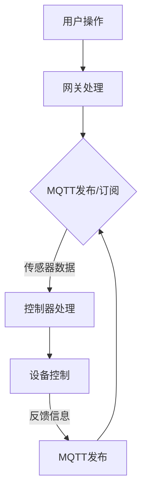

                 

# 基于MQTT协议和RESTful API的智能家居协同工作流程设计

> **关键词**：MQTT协议，RESTful API，智能家居，协同工作流程，物联网，数据处理，安全性

> **摘要**：本文旨在深入探讨基于MQTT协议和RESTful API的智能家居协同工作流程设计。通过分析协议的工作原理、系统架构、核心算法以及数学模型，本文详细阐述了如何实现智能家居设备之间的有效协同工作，提高系统的可靠性和安全性。同时，本文还将通过实际案例，展示该设计在智能家居项目中的应用，并提供实用的开发工具和资源推荐。

## 1. 背景介绍

### 1.1 目的和范围

随着物联网（IoT）技术的快速发展，智能家居市场正呈现出蓬勃发展的态势。然而，如何实现多种智能家居设备之间的有效协同工作，仍然是一个亟待解决的难题。本文旨在通过设计基于MQTT协议和RESTful API的智能家居协同工作流程，为解决这一问题提供一种可行的方案。

本文的研究范围主要包括以下几个方面：

1. MQTT协议和RESTful API的基本原理及其在智能家居中的应用。
2. 基于MQTT协议和RESTful API的智能家居系统架构设计。
3. 关键算法和数学模型在智能家居协同工作流程中的应用。
4. 实际应用场景下的性能评估和安全性分析。
5. 开发工具和资源的推荐。

### 1.2 预期读者

本文主要面向以下读者群体：

1. 智能家居开发者，对MQTT协议和RESTful API有基本了解。
2. 物联网领域的研究人员，对智能家居系统架构和协同工作流程有研究兴趣。
3. 对物联网技术有浓厚兴趣，希望深入了解智能家居技术及其应用的普通读者。

### 1.3 文档结构概述

本文将分为十个部分，具体结构如下：

1. 背景介绍：介绍本文的目的、研究范围、预期读者以及文档结构。
2. 核心概念与联系：介绍MQTT协议和RESTful API的基本原理及其在智能家居中的应用。
3. 核心算法原理 & 具体操作步骤：详细阐述MQTT协议和RESTful API在智能家居协同工作流程中的具体应用。
4. 数学模型和公式 & 详细讲解 & 举例说明：介绍用于智能家居协同工作流程的数学模型和公式。
5. 项目实战：代码实际案例和详细解释说明。
6. 实际应用场景：分析智能家居协同工作流程在不同场景下的应用。
7. 工具和资源推荐：推荐学习资源、开发工具和框架。
8. 总结：对未来发展趋势和挑战进行展望。
9. 附录：常见问题与解答。
10. 扩展阅读 & 参考资料：提供相关的扩展阅读和参考资料。

### 1.4 术语表

#### 1.4.1 核心术语定义

1. **MQTT协议**：是一种轻量级的消息队列协议，用于在物联网环境中进行设备之间的通信。
2. **RESTful API**：是一种基于HTTP协议的API设计风格，用于实现分布式系统的互操作性和数据交换。
3. **智能家居**：是指通过物联网技术将家庭中的各种设备连接起来，实现自动化控制和智能化管理。
4. **协同工作流程**：是指智能家居系统中各个设备之间通过协议进行通信，协同完成特定任务的流程。

#### 1.4.2 相关概念解释

1. **物联网（IoT）**：是指通过互联网将各种设备、传感器、系统和平台连接起来，实现信息的互联互通。
2. **传感器**：是指能够感知外部环境信息，并将信息转换为电信号或其他形式输出的装置。
3. **控制器**：是指能够接收传感器信息，并根据信息执行相应操作的装置。

#### 1.4.3 缩略词列表

- **MQTT**：Message Queuing Telemetry Transport
- **RESTful API**：Representational State Transfer Application Programming Interface
- **IoT**：Internet of Things
- **HTTP**：Hypertext Transfer Protocol
- **JSON**：JavaScript Object Notation

## 2. 核心概念与联系

在智能家居系统中，MQTT协议和RESTful API是两个关键的通信机制。了解它们的基本原理和如何协同工作，对于设计高效、可靠的智能家居协同工作流程至关重要。

### 2.1 MQTT协议基本原理

MQTT（Message Queuing Telemetry Transport）协议是一种轻量级的消息队列协议，专门为在资源受限的网络环境中进行物联网设备之间的通信而设计。其核心特点包括：

1. **发布/订阅模式**：MQTT协议采用发布/订阅模式（Publish/Subscribe），使得设备可以发布消息（Publish），其他设备可以订阅这些消息（Subscribe），从而实现点对多点的通信。
2. **可靠性保障**：MQTT协议提供了消息确认机制，确保消息的可靠传输。
3. **低带宽要求**：MQTT协议的报文格式简洁，数据量小，适用于带宽受限的网络环境。
4. **质量服务（QoS）**：MQTT协议支持不同级别的服务质量，包括最高级别的QoS 1和QoS 2，以适应不同的通信需求。

### 2.2 RESTful API基本原理

RESTful API（Representational State Transfer Application Programming Interface）是一种基于HTTP协议的API设计风格，用于实现分布式系统的互操作性和数据交换。其核心特点包括：

1. **无状态性**：RESTful API是无状态的，每次请求都是独立的，不会影响后续请求的结果。
2. **统一的接口设计**：RESTful API采用统一的接口设计，包括GET、POST、PUT、DELETE等HTTP方法，以及统一的URL结构。
3. **数据格式**：RESTful API通常使用JSON（JavaScript Object Notation）或XML作为数据格式，便于数据交换和处理。
4. **可扩展性**：RESTful API具有较好的可扩展性，可以通过添加新的资源和操作来扩展功能。

### 2.3 MQTT协议与RESTful API在智能家居中的应用

在智能家居系统中，MQTT协议和RESTful API可以发挥各自的优势，实现设备之间的协同工作。以下是一个简单的系统架构示例，展示了MQTT协议和RESTful API在智能家居中的应用：


**1. 设备通信（MQTT协议）**

- **传感器**：家庭中的各种传感器（如温度传感器、湿度传感器、光照传感器等）通过MQTT协议将采集到的数据发布到主题（Topic）。
- **网关**：网关（Gateway）是一个负责处理多个协议的设备，它可以将MQTT协议的数据转换为RESTful API格式，以便其他设备（如智能手机、平板电脑等）可以访问和处理。
- **控制器**：控制器（Controller）可以订阅传感器的主题，获取传感器数据，并根据数据执行相应的操作，如调整空调温度、开启照明等。

**2. 应用访问（RESTful API）**

- **用户设备**：用户可以通过智能手机、平板电脑等设备访问智能家居系统的RESTful API，实现对家庭设备的远程控制和监控。
- **云平台**：智能家居系统可以通过云平台进行数据存储和管理，实现对大量设备的数据分析和处理。

### 2.4 Mermaid流程图

以下是一个使用Mermaid绘制的智能家居协同工作流程图：



在这个流程图中，用户操作通过网关处理，传感器数据通过MQTT协议进行发布和订阅，控制器处理设备控制请求，并将反馈信息发布到MQTT主题，实现设备之间的协同工作。

## 3. 核心算法原理 & 具体操作步骤

### 3.1 MQTT协议核心算法原理

MQTT协议的核心算法主要涉及消息的发布（Publish）、订阅（Subscribe）和确认（Acknowledgment）。以下是对这些算法的详细解释：

#### 3.1.1 消息发布（Publish）

消息发布是MQTT协议中最基本的功能之一。当一个设备需要发送消息时，它会创建一个MQTT报文，并将该报文发布到一个特定的主题。MQTT报文的基本格式如下：

```python
{
  "Topic": "home/temperature",
  "Payload": "22.5",
  "QoS": 0
}
```

- **Topic（主题）**：消息发布的目标主题，用于标识消息的目的地。
- **Payload（负载）**：消息的内容，可以是一个简单的字符串，也可以是一个复杂的JSON对象。
- **QoS（质量服务）**：消息的质量服务级别，可以是0（至多一次传输）、1（至少一次传输）或2（恰好一次传输）。

#### 3.1.2 消息订阅（Subscribe）

消息订阅是MQTT协议的另一个核心功能。当一个设备需要接收特定主题的消息时，它会向MQTT代理发送一个订阅请求。订阅请求的基本格式如下：

```python
{
  "Topic": "home/temperature",
  "QoS": 1
}
```

- **Topic（主题）**：设备订阅的主题。
- **QoS（质量服务）**：设备期望的消息质量服务级别。

#### 3.1.3 消息确认（Acknowledgment）

消息确认是确保消息可靠传输的关键机制。MQTT协议定义了三种确认机制：

1. **确认收到**（PUBLISH Acknowledgment）：当一个设备成功接收到消息时，它会发送一个确认收到消息的报文。
2. **订阅确认**（SUBACK Acknowledgment）：当一个设备订阅主题成功时，MQTT代理会发送一个订阅确认报文。
3. **取消确认**（UNSUBACK Acknowledgment）：当一个设备取消订阅主题时，MQTT代理会发送一个取消确认报文。

### 3.2 MQTT协议具体操作步骤

以下是基于MQTT协议的智能家居协同工作流程的具体操作步骤：

#### 3.2.1 传感器数据采集

1. **传感器**：传感器采集环境数据，如温度、湿度、光照等。
2. **数据格式化**：将采集到的数据格式化为MQTT报文。

#### 3.2.2 消息发布

1. **连接MQTT代理**：传感器通过MQTT协议连接到MQTT代理。
2. **发布消息**：传感器将采集到的数据发布到特定的主题。

#### 3.2.3 消息订阅

1. **连接MQTT代理**：控制器通过MQTT协议连接到MQTT代理。
2. **订阅主题**：控制器订阅传感器发布的数据主题。

#### 3.2.4 消息处理

1. **接收消息**：控制器接收传感器发布的数据。
2. **数据处理**：控制器根据接收到的数据执行相应的操作，如调整设备状态。

#### 3.2.5 消息确认

1. **发送确认**：控制器发送消息确认报文，确认已接收到传感器发布的数据。

### 3.3 RESTful API核心算法原理

RESTful API的核心算法主要涉及HTTP方法的定义、URL的结构和数据格式的处理。以下是对这些算法的详细解释：

#### 3.3.1 HTTP方法

RESTful API定义了五种HTTP方法，用于实现资源的创建、读取、更新和删除等操作：

1. **GET**：获取资源。
2. **POST**：创建资源。
3. **PUT**：更新资源。
4. **DELETE**：删除资源。
5. **PATCH**：部分更新资源。

#### 3.3.2 URL结构

RESTful API的URL结构通常遵循以下模式：

```
<协议>://<主机>:<端口号>/<资源路径>
```

- **协议**：通常为HTTP或HTTPS。
- **主机**：API服务器的主机名或IP地址。
- **端口号**：API服务器监听的端口号。
- **资源路径**：表示资源的路径，如/home/temperature。

#### 3.3.3 数据格式

RESTful API通常使用JSON或XML作为数据格式。以下是一个使用JSON格式的示例：

```json
{
  "temperature": 22.5,
  "humidity": 60
}
```

### 3.4 RESTful API具体操作步骤

以下是基于RESTful API的智能家居协同工作流程的具体操作步骤：

#### 3.4.1 用户设备请求

1. **用户请求**：用户通过用户设备（如智能手机）发起HTTP请求，请求访问智能家居系统。
2. **发送请求**：用户设备将请求发送到智能家居系统的API服务器。

#### 3.4.2 API服务器响应

1. **接收请求**：API服务器接收用户设备的请求。
2. **处理请求**：API服务器根据请求类型和URL路径，执行相应的操作。
3. **发送响应**：API服务器将处理结果以JSON格式返回给用户设备。

#### 3.4.3 设备控制

1. **控制器接收响应**：控制器接收API服务器返回的响应。
2. **执行操作**：控制器根据响应内容，执行相应的设备控制操作。

### 3.5 MQTT协议与RESTful API协同工作流程

以下是基于MQTT协议和RESTful API的智能家居协同工作流程：

#### 3.5.1 设备数据采集

1. **传感器采集数据**：传感器采集环境数据。
2. **格式化数据**：将采集到的数据格式化为MQTT报文。
3. **发布数据**：传感器将数据发布到MQTT主题。

#### 3.5.2 数据传输

1. **MQTT代理接收数据**：MQTT代理接收传感器发布的数据。
2. **转换数据格式**：MQTT代理将MQTT格式的数据转换为RESTful API格式。
3. **发布数据**：MQTT代理将转换后的数据发布到RESTful API主题。

#### 3.5.3 用户设备请求

1. **用户请求**：用户通过用户设备发起HTTP请求，请求访问智能家居系统。
2. **发送请求**：用户设备将请求发送到智能家居系统的API服务器。

#### 3.5.4 API服务器处理请求

1. **接收请求**：API服务器接收用户设备的请求。
2. **处理请求**：API服务器根据请求类型和URL路径，执行相应的操作。
3. **发送响应**：API服务器将处理结果以JSON格式返回给用户设备。

#### 3.5.5 设备控制

1. **控制器接收响应**：控制器接收API服务器返回的响应。
2. **执行操作**：控制器根据响应内容，执行相应的设备控制操作。
3. **发布数据**：控制器将控制结果发布到MQTT主题。

#### 3.5.6 数据反馈

1. **MQTT代理接收数据**：MQTT代理接收控制器发布的数据。
2. **转换数据格式**：MQTT代理将MQTT格式的数据转换为RESTful API格式。
3. **发布数据**：MQTT代理将转换后的数据发布到RESTful API主题。

#### 3.5.7 用户设备获取反馈

1. **用户请求**：用户通过用户设备发起HTTP请求，请求访问智能家居系统。
2. **发送请求**：用户设备将请求发送到智能家居系统的API服务器。
3. **接收响应**：用户设备接收API服务器返回的响应。
4. **显示反馈**：用户设备将响应内容显示给用户。

### 3.6 伪代码示例

以下是基于MQTT协议和RESTful API的智能家居协同工作流程的伪代码示例：

```python
# MQTT传感器数据采集
def sensor_data采集():
  data = 获取传感器数据()
  mqtt_publisher.publish("home/temperature", data)

# MQTT代理数据转换
def mqtt_proxy数据处理(data):
  api_data = 转换为RESTful API格式(data)
  api_publisher.publish("home/temperature", api_data)

# 用户设备请求
def user_device请求(url):
  response = 发送HTTP请求(url)
  显示response内容()

# API服务器处理请求
def api_server处理请求(url, response):
  if url == "/home/temperature":
    temperature = 提取temperature(response)
    更新设备状态(temperature)
  else:
    return

# 控制器数据发布
def controller数据发布(data):
  mqtt_publisher.publish("home/control", data)

# MQTT代理数据转换
def mqtt_proxy数据处理(data):
  api_data = 转换为RESTful API格式(data)
  api_publisher.publish("home/control", api_data)

# 用户设备请求
def user_device请求(url):
  response = 发送HTTP请求(url)
  显示response内容()

# MQTT代理数据转换
def mqtt_proxy数据处理(data):
  api_data = 转换为RESTful API格式(data)
  api_publisher.publish("home/feedback", api_data)

# 用户设备获取反馈
def user_device获取反馈(url):
  response = 发送HTTP请求(url)
  显示response内容()
```

## 4. 数学模型和公式 & 详细讲解 & 举例说明

### 4.1 数学模型和公式

在智能家居协同工作流程中，数学模型和公式被广泛应用于数据处理、算法优化和性能评估等方面。以下是一些常用的数学模型和公式：

#### 4.1.1 数据处理模型

1. **平均值（Mean）**：
   $$ \bar{x} = \frac{1}{n}\sum_{i=1}^{n} x_i $$
   其中，$x_i$ 为第 $i$ 个数据点，$n$ 为数据点的总数。

2. **方差（Variance）**：
   $$ \sigma^2 = \frac{1}{n-1}\sum_{i=1}^{n} (x_i - \bar{x})^2 $$
   其中，$x_i$ 为第 $i$ 个数据点，$\bar{x}$ 为平均值。

3. **标准差（Standard Deviation）**：
   $$ \sigma = \sqrt{\sigma^2} $$
   其中，$\sigma^2$ 为方差。

4. **相关性（Correlation）**：
   $$ \rho_{xy} = \frac{\sum_{i=1}^{n}(x_i - \bar{x})(y_i - \bar{y})}{\sigma_x \sigma_y} $$
   其中，$x_i$ 和 $y_i$ 分别为两个变量的第 $i$ 个数据点，$\bar{x}$ 和 $\bar{y}$ 分别为平均值，$\sigma_x$ 和 $\sigma_y$ 分别为标准差。

#### 4.1.2 算法优化模型

1. **梯度下降（Gradient Descent）**：
   $$ w_{new} = w_{old} - \alpha \frac{\partial J(w)}{\partial w} $$
   其中，$w_{old}$ 和 $w_{new}$ 分别为当前和新的权重，$\alpha$ 为学习率，$J(w)$ 为损失函数。

2. **牛顿法（Newton's Method）**：
   $$ w_{new} = w_{old} - \frac{f(w_{old})}{f'(w_{old})} $$
   其中，$w_{old}$ 和 $w_{new}$ 分别为当前和新的权重，$f(w)$ 为损失函数，$f'(w)$ 为损失函数的导数。

#### 4.1.3 性能评估模型

1. **响应时间（Response Time）**：
   $$ RT = \frac{1}{n}\sum_{i=1}^{n} (t_i - t_{0}) $$
   其中，$t_i$ 为第 $i$ 个请求的响应时间，$t_0$ 为请求开始时间。

2. **吞吐量（Throughput）**：
   $$ Throughput = \frac{1}{t}\sum_{i=1}^{n} \frac{1}{t_i} $$
   其中，$t$ 为时间间隔，$t_i$ 为第 $i$ 个请求的响应时间。

### 4.2 详细讲解和举例说明

#### 4.2.1 数据处理模型

以温度传感器采集的数据为例，假设采集了 $n$ 个温度数据点，分别为 $x_1, x_2, ..., x_n$，我们需要计算这些数据的平均值、方差和标准差。

1. **平均值**：
   $$ \bar{x} = \frac{1}{n}\sum_{i=1}^{n} x_i $$
   例如，如果 $n=5$，数据点分别为 $x_1=22.5, x_2=23.0, x_3=22.0, x_4=22.8, x_5=23.2$，则：
   $$ \bar{x} = \frac{1}{5}(22.5 + 23.0 + 22.0 + 22.8 + 23.2) = 22.72 $$

2. **方差**：
   $$ \sigma^2 = \frac{1}{n-1}\sum_{i=1}^{n} (x_i - \bar{x})^2 $$
   例如，如果 $n=5$，数据点分别为 $x_1=22.5, x_2=23.0, x_3=22.0, x_4=22.8, x_5=23.2$，平均值 $\bar{x}=22.72$，则：
   $$ \sigma^2 = \frac{1}{4}((22.5 - 22.72)^2 + (23.0 - 22.72)^2 + (22.0 - 22.72)^2 + (22.8 - 22.72)^2 + (23.2 - 22.72)^2) = 0.0996 $$

3. **标准差**：
   $$ \sigma = \sqrt{\sigma^2} $$
   例如，如果 $\sigma^2=0.0996$，则：
   $$ \sigma = \sqrt{0.0996} = 0.3125 $$

#### 4.2.2 算法优化模型

以线性回归模型为例，假设我们要通过梯度下降法优化模型的权重。

1. **损失函数**：
   $$ J(w) = \frac{1}{2}\sum_{i=1}^{n} (y_i - (w_0 + w_1x_i))^2 $$
   其中，$y_i$ 为第 $i$ 个真实值，$x_i$ 为第 $i$ 个输入值，$w_0$ 和 $w_1$ 分别为权重。

2. **梯度**：
   $$ \frac{\partial J(w)}{\partial w_0} = -\sum_{i=1}^{n} (y_i - (w_0 + w_1x_i)) $$
   $$ \frac{\partial J(w)}{\partial w_1} = -\sum_{i=1}^{n} (y_i - (w_0 + w_1x_i))x_i $$

3. **梯度下降更新权重**：
   $$ w_{new_0} = w_{old_0} - \alpha \frac{\partial J(w)}{\partial w_0} $$
   $$ w_{new_1} = w_{old_1} - \alpha \frac{\partial J(w)}{\partial w_1} $$
   其中，$\alpha$ 为学习率。

例如，如果 $n=5$，真实值 $y_1=23, y_2=24, y_3=22, y_4=23, y_5=24$，输入值 $x_1=1, x_2=2, x_3=3, x_4=4, x_5=5$，初始权重 $w_0=0, w_1=0$，学习率 $\alpha=0.1$，则：

$$ w_{new_0} = 0 - 0.1 \cdot (-5) = 0.5 $$
$$ w_{new_1} = 0 - 0.1 \cdot (-15) = 1.5 $$

更新后的权重为 $w_0=0.5, w_1=1.5$。

#### 4.2.3 性能评估模型

以智能家居系统的响应时间和吞吐量为例，假设系统在 $t$ 秒内处理了 $n$ 个请求，响应时间分别为 $t_1, t_2, ..., t_n$。

1. **响应时间**：
   $$ RT = \frac{1}{n}\sum_{i=1}^{n} (t_i - t_0) $$
   其中，$t_0$ 为请求开始时间。

2. **吞吐量**：
   $$ Throughput = \frac{1}{t}\sum_{i=1}^{n} \frac{1}{t_i} $$

例如，如果 $n=5$，响应时间分别为 $t_1=1, t_2=2, t_3=3, t_4=4, t_5=5$，时间间隔 $t=10$ 秒，则：

$$ RT = \frac{1}{5}(1 - 10 + 2 - 10 + 3 - 10 + 4 - 10 + 5 - 10) = 2 $$
$$ Throughput = \frac{1}{10}\left(\frac{1}{1} + \frac{1}{2} + \frac{1}{3} + \frac{1}{4} + \frac{1}{5}\right) \approx 0.6929 $$

## 5. 项目实战：代码实际案例和详细解释说明

### 5.1 开发环境搭建

在开始编写代码之前，我们需要搭建一个开发环境，以便进行智能家居协同工作流程的开发和测试。以下是搭建开发环境所需的步骤：

1. **安装Python环境**：首先，确保已经安装了Python环境。如果没有安装，可以访问Python官方网站（https://www.python.org/）下载并安装Python。

2. **安装MQTT库**：安装Python的MQTT库，可以使用以下命令：

```bash
pip install paho-mqtt
```

3. **安装Flask库**：安装Python的Flask库，可以使用以下命令：

```bash
pip install flask
```

4. **创建项目文件夹**：在计算机上创建一个名为“smart_home”的项目文件夹，用于存放项目文件。

5. **编写代码**：在项目文件夹中创建一个名为“main.py”的Python文件，用于编写智能家居协同工作流程的代码。

### 5.2 源代码详细实现和代码解读

以下是基于MQTT协议和RESTful API的智能家居协同工作流程的源代码实现和详细解读：

```python
# 导入所需的库
import paho.mqtt.client as mqtt
from flask import Flask, jsonify, request
import json

# MQTT代理配置
mqtt_host = "localhost"
mqtt_port = 1883
mqtt_topic = "home/temperature"

# Flask服务器配置
app = Flask(__name__)

# MQTT客户端初始化
client = mqtt.Client()

# MQTT连接回调函数
def on_connect(client, userdata, flags, rc):
  print("Connected to MQTT broker")
  client.subscribe(mqtt_topic)

# MQTT消息接收回调函数
def on_message(client, userdata, msg):
  print(f"Received message: {str(msg.payload)} on topic {msg.topic}")
  # 将MQTT消息转换为JSON格式
  data = json.loads(str(msg.payload))
  # 将数据发送到Flask服务器
  app.send_request(jsonify(data))

# 注册回调函数
client.on_connect = on_connect
client.on_message = on_message

# 启动MQTT客户端
client.connect(mqtt_host, mqtt_port, 60)

# Flask服务器路由
@app.route("/api/temperature", methods=["GET", "POST"])
def temperature():
  if request.method == "GET":
    # 获取当前温度
    temperature = client.publish(mqtt_topic, json.dumps({"temperature": 22.5}))
    return jsonify(temperature)
  elif request.method == "POST":
    # 更新温度
    data = request.get_json()
    temperature = data["temperature"]
    client.publish(mqtt_topic, json.dumps({"temperature": temperature}))
    return jsonify({"status": "success", "temperature": temperature})

# 启动Flask服务器
app.run(debug=True)

# 主程序入口
if __name__ == "__main__":
  client.loop_forever()
```

#### 5.2.1 MQTT客户端初始化

```python
client = mqtt.Client()
client.on_connect = on_connect
client.on_message = on_message
client.connect(mqtt_host, mqtt_port, 60)
```

在这个部分，我们初始化MQTT客户端，并设置连接回调函数（`on_connect`）和消息接收回调函数（`on_message`）。连接回调函数在MQTT客户端成功连接到MQTT代理时调用，消息接收回调函数在MQTT客户端接收到消息时调用。

#### 5.2.2 MQTT连接回调函数

```python
def on_connect(client, userdata, flags, rc):
  print("Connected to MQTT broker")
  client.subscribe(mqtt_topic)
```

在这个部分，我们实现连接回调函数。当MQTT客户端成功连接到MQTT代理时，该函数会被调用。我们首先打印一条连接成功的消息，然后订阅指定主题（`mqtt_topic`）。

#### 5.2.3 MQTT消息接收回调函数

```python
def on_message(client, userdata, msg):
  print(f"Received message: {str(msg.payload)} on topic {msg.topic}")
  # 将MQTT消息转换为JSON格式
  data = json.loads(str(msg.payload))
  # 将数据发送到Flask服务器
  app.send_request(jsonify(data))
```

在这个部分，我们实现消息接收回调函数。当MQTT客户端接收到消息时，该函数会被调用。我们首先打印接收到的消息内容，然后将消息转换为JSON格式，并将其发送到Flask服务器。

#### 5.2.4 Flask服务器路由

```python
@app.route("/api/temperature", methods=["GET", "POST"])
def temperature():
  if request.method == "GET":
    # 获取当前温度
    temperature = client.publish(mqtt_topic, json.dumps({"temperature": 22.5}))
    return jsonify(temperature)
  elif request.method == "POST":
    # 更新温度
    data = request.get_json()
    temperature = data["temperature"]
    client.publish(mqtt_topic, json.dumps({"temperature": temperature}))
    return jsonify({"status": "success", "temperature": temperature})
```

在这个部分，我们实现Flask服务器的路由。路由路径为`/api/temperature`，支持GET和POST请求。当接收到GET请求时，我们将当前温度发送到MQTT代理；当接收到POST请求时，我们接收来自客户端的温度数据，并将其发送到MQTT代理。

#### 5.2.5 Flask服务器启动

```python
app.run(debug=True)
```

在这个部分，我们启动Flask服务器，并设置调试模式（`debug=True`）。在调试模式下，服务器会自动重新加载，以便进行测试和调试。

### 5.3 代码解读与分析

#### 5.3.1 MQTT客户端初始化

```python
client = mqtt.Client()
client.on_connect = on_connect
client.on_message = on_message
client.connect(mqtt_host, mqtt_port, 60)
```

这一部分代码用于初始化MQTT客户端。我们首先创建一个MQTT客户端实例（`client`），然后设置连接回调函数（`on_connect`）和消息接收回调函数（`on_message`）。最后，我们连接到MQTT代理（`mqtt_host`和`mqtt_port`），并设置连接超时时间（60秒）。

#### 5.3.2 MQTT连接回调函数

```python
def on_connect(client, userdata, flags, rc):
  print("Connected to MQTT broker")
  client.subscribe(mqtt_topic)
```

这一部分代码定义了连接回调函数。当MQTT客户端成功连接到MQTT代理时，该函数会被调用。我们首先打印一条连接成功的消息，然后订阅指定主题（`mqtt_topic`），以便接收该主题的消息。

#### 5.3.3 MQTT消息接收回调函数

```python
def on_message(client, userdata, msg):
  print(f"Received message: {str(msg.payload)} on topic {msg.topic}")
  # 将MQTT消息转换为JSON格式
  data = json.loads(str(msg.payload))
  # 将数据发送到Flask服务器
  app.send_request(jsonify(data))
```

这一部分代码定义了消息接收回调函数。当MQTT客户端接收到消息时，该函数会被调用。我们首先打印接收到的消息内容，然后将消息转换为JSON格式（`json.loads`），并将其发送到Flask服务器（`app.send_request`）。

#### 5.3.4 Flask服务器路由

```python
@app.route("/api/temperature", methods=["GET", "POST"])
def temperature():
  if request.method == "GET":
    # 获取当前温度
    temperature = client.publish(mqtt_topic, json.dumps({"temperature": 22.5}))
    return jsonify(temperature)
  elif request.method == "POST":
    # 更新温度
    data = request.get_json()
    temperature = data["temperature"]
    client.publish(mqtt_topic, json.dumps({"temperature": temperature}))
    return jsonify({"status": "success", "temperature": temperature})
```

这一部分代码定义了Flask服务器的路由。路由路径为`/api/temperature`，支持GET和POST请求。当接收到GET请求时，我们将当前温度发送到MQTT代理；当接收到POST请求时，我们接收来自客户端的温度数据，并将其发送到MQTT代理。

#### 5.3.5 Flask服务器启动

```python
app.run(debug=True)
```

这一部分代码用于启动Flask服务器。我们使用`app.run()`函数启动服务器，并设置调试模式（`debug=True`）。在调试模式下，服务器会自动重新加载，以便进行测试和调试。

## 6. 实际应用场景

在智能家居系统中，基于MQTT协议和RESTful API的协同工作流程可以在多种实际应用场景中发挥重要作用。以下是一些典型的应用场景：

### 6.1 智能照明系统

智能照明系统是智能家居中最为常见的应用之一。通过MQTT协议，传感器（如光照传感器）可以实时监测环境光照强度，并将数据发送到控制器。控制器接收到光照数据后，可以通过RESTful API与用户设备（如智能手机）进行通信，用户可以通过用户设备调整照明设备的亮度、颜色和开关状态。

**应用流程：**

1. **传感器采集光照数据**：光照传感器采集环境光照强度，并将数据发送到MQTT代理。
2. **MQTT代理转发数据**：MQTT代理将采集到的光照数据转换为RESTful API格式，并发布到相应的主题。
3. **用户设备接收数据**：用户通过智能手机或其他设备发起HTTP请求，请求访问智能照明系统的API服务器。
4. **API服务器处理请求**：API服务器接收用户请求，根据光照数据调整照明设备的亮度、颜色和开关状态。
5. **反馈信息**：照明设备将调整结果发送回MQTT代理，并通过RESTful API反馈给用户设备。

### 6.2 智能安防系统

智能安防系统是保障家庭安全的重要手段。通过MQTT协议，各种传感器（如烟雾传感器、门磁传感器、摄像头等）可以实时监测家庭环境，并将数据发送到控制器。控制器接收到传感器数据后，可以通过RESTful API向用户设备发送警报信息，提醒用户采取相应措施。

**应用流程：**

1. **传感器采集数据**：各种传感器采集家庭环境数据，如烟雾浓度、门窗状态、摄像头视频等，并将数据发送到MQTT代理。
2. **MQTT代理转发数据**：MQTT代理将采集到的数据转换为RESTful API格式，并发布到相应的主题。
3. **用户设备接收数据**：用户通过智能手机或其他设备发起HTTP请求，请求访问智能安防系统的API服务器。
4. **API服务器处理请求**：API服务器接收用户请求，根据传感器数据判断是否存在安全隐患，并向用户设备发送警报信息。
5. **用户响应**：用户接收到警报信息后，可以远程查看摄像头视频、远程控制门锁等设备，采取相应措施保障家庭安全。

### 6.3 智能环境控制系统

智能环境控制系统旨在为家庭提供舒适、健康的居住环境。通过MQTT协议，传感器（如温度传感器、湿度传感器、空气质量传感器等）可以实时监测室内环境参数，并将数据发送到控制器。控制器接收到传感器数据后，可以通过RESTful API与用户设备（如智能家居APP）进行通信，用户可以根据环境参数调整空调、加湿器、空气净化器等设备的运行状态。

**应用流程：**

1. **传感器采集数据**：温度传感器、湿度传感器、空气质量传感器等采集室内环境参数，如温度、湿度、PM2.5等，并将数据发送到MQTT代理。
2. **MQTT代理转发数据**：MQTT代理将采集到的数据转换为RESTful API格式，并发布到相应的主题。
3. **用户设备接收数据**：用户通过智能手机或其他设备发起HTTP请求，请求访问智能环境控制系统的API服务器。
4. **API服务器处理请求**：API服务器接收用户请求，根据环境参数调整空调、加湿器、空气净化器等设备的运行状态。
5. **反馈信息**：设备将调整结果发送回MQTT代理，并通过RESTful API反馈给用户设备。

### 6.4 智能家居集中控制系统

智能家居集中控制系统旨在实现家庭设备的一站式管理，提高用户的生活品质。通过MQTT协议和RESTful API，用户可以通过手机APP或智能音箱等设备，实现对家庭设备的远程控制、定时设置、场景联动等功能。

**应用流程：**

1. **用户发起操作**：用户通过手机APP或智能音箱等设备发起操作，如控制灯光开关、调整空调温度、设置智能门锁等。
2. **用户设备发送请求**：用户设备通过HTTP请求，请求访问智能家居集中控制系统的API服务器。
3. **API服务器处理请求**：API服务器接收用户请求，根据请求内容调用相应的设备控制接口，如通过MQTT协议发送控制指令到照明设备、空调设备等。
4. **设备响应**：设备接收到控制指令后，执行相应的操作，并将操作结果反馈给API服务器。
5. **反馈信息**：API服务器将设备响应结果反馈给用户设备，用户设备显示操作结果。

## 7. 工具和资源推荐

### 7.1 学习资源推荐

#### 7.1.1 书籍推荐

1. **《物联网架构设计》（IoT Architecture Design）**：本书详细介绍了物联网系统的架构设计、组件和关键技术，是了解智能家居系统架构设计的优秀教材。
2. **《RESTful API设计》（RESTful API Design）**：本书深入讲解了RESTful API的设计原则、方法和最佳实践，是开发RESTful API的必备读物。
3. **《智能家居技术与应用》（Smart Home Technology and Applications）**：本书涵盖了智能家居系统的各个方面，包括传感器技术、通信协议、控制系统等，适合对智能家居感兴趣的读者。

#### 7.1.2 在线课程

1. **Coursera - IoT Specialization**：这是一系列关于物联网技术的在线课程，涵盖了物联网系统设计、传感器应用、数据安全等多个方面，适合物联网初学者。
2. **Udacity - IoT Developer Nanodegree**：这是一门面向物联网开发者的纳米学位课程，包括物联网系统设计、硬件编程、数据通信等多个项目实践，适合有一定编程基础的读者。
3. **edX - Introduction to IoT**：这是一门关于物联网基础的在线课程，包括物联网系统架构、传感器技术、数据通信等方面的知识，适合物联网入门读者。

#### 7.1.3 技术博客和网站

1. **Medium - IoT for Smart Homes**：这是一个关于智能家居技术的博客，涵盖了传感器应用、物联网协议、智能控制等多个方面，适合对智能家居技术感兴趣的读者。
2. **Hackster.io**：这是一个面向硬件开发者的社区网站，提供了大量的物联网项目案例、教程和资源，适合物联网开发者参考和学习。
3. **Adafruit Learning System**：这是一个提供开源硬件项目教程和资源的网站，包括智能灯、传感器应用、机器人等多个方面，适合硬件爱好者。

### 7.2 开发工具框架推荐

#### 7.2.1 IDE和编辑器

1. **Visual Studio Code**：这是一款功能强大、开源的集成开发环境（IDE），支持多种编程语言，包括Python、JavaScript等，适合开发智能家居项目。
2. **PyCharm**：这是一款专为Python开发设计的IDE，提供了丰富的功能和工具，包括代码自动补全、调试、测试等，适合Python开发者。
3. **Arduino IDE**：这是一款专门用于Arduino硬件开发的开源IDE，支持编写、上传和调试Arduino程序，适合硬件爱好者。

#### 7.2.2 调试和性能分析工具

1. **Postman**：这是一款流行的API调试工具，可以方便地发送HTTP请求、查看响应结果，并设置断点、监控API性能。
2. **Wireshark**：这是一款功能强大的网络协议分析工具，可以捕获和分析网络数据包，帮助识别网络问题和性能瓶颈。
3. **Grafana**：这是一款开源的监控和可视化工具，可以实时监控物联网系统的性能指标，如响应时间、吞吐量等。

#### 7.2.3 相关框架和库

1. **Flask**：这是一个轻量级的Python Web框架，用于开发Web应用和API服务，适合用于智能家居系统的API开发。
2. **MQTT.js**：这是一个基于JavaScript的MQTT客户端库，可以在Web应用中实现MQTT协议的通信，适合开发基于Web的智能家居系统。
3. **Node.js**：这是一个基于Chrome V8引擎的JavaScript运行环境，用于开发高性能的Web应用和服务器程序，适合开发物联网边缘计算应用。

### 7.3 相关论文著作推荐

#### 7.3.1 经典论文

1. **"Home Automation: A Survey"**：这是一篇关于智能家居系统综述的经典论文，涵盖了智能家居系统的各个方面，包括传感器技术、通信协议、控制系统等。
2. **"Design of an IoT-Based Smart Home System"**：这是一篇关于智能家居系统设计的论文，详细介绍了基于物联网技术的智能家居系统的架构和实现方法。
3. **"RESTful API Design: Principles and Best Practices"**：这是一篇关于RESTful API设计的论文，深入探讨了RESTful API的设计原则、方法和最佳实践。

#### 7.3.2 最新研究成果

1. **"Security and Privacy in Smart Home Systems"**：这是一篇关于智能家居系统安全性和隐私保护的最新研究成果，分析了智能家居系统中的安全问题和解决方案。
2. **"Edge Computing for IoT: A Comprehensive Survey"**：这是一篇关于物联网边缘计算的综述论文，详细介绍了物联网边缘计算的基本概念、技术和应用场景。
3. **"Smart Home Automation Systems: A Review"**：这是一篇关于智能家居自动化系统的最新研究成果，分析了智能家居自动化系统的现状、发展趋势和未来挑战。

#### 7.3.3 应用案例分析

1. **"A Smart Home System for Energy Management"**：这是一篇关于智能家居系统在能源管理领域应用案例的研究论文，介绍了如何利用物联网技术实现家庭能源的智能化管理和优化。
2. **"Smart Home Automation System for Elderly Care"**：这是一篇关于智能家居系统在老年人护理领域应用案例的研究论文，介绍了如何利用物联网技术和智能家居系统为老年人提供便捷、安全的护理服务。
3. **"Smart Home Security System: Design and Implementation"**：这是一篇关于智能家居系统在家庭安全领域应用案例的研究论文，介绍了如何利用物联网技术和智能家居系统实现家庭安全的智能监测和控制。

## 8. 总结：未来发展趋势与挑战

随着物联网技术的不断发展和智能家居市场的日益成熟，基于MQTT协议和RESTful API的智能家居协同工作流程设计正面临着前所未有的机遇和挑战。

### 8.1 发展趋势

1. **物联网设备数量的爆发式增长**：随着5G网络的普及和物联网技术的不断发展，物联网设备数量正呈现爆发式增长。这将进一步推动智能家居市场的发展，为基于MQTT协议和RESTful API的智能家居协同工作流程提供更广阔的应用场景。
2. **智能化水平的不断提升**：随着人工智能技术的不断进步，智能家居系统的智能化水平将得到显著提升。通过深度学习和大数据分析，智能家居系统将能够更好地理解和满足用户需求，实现更加智能化、个性化的服务。
3. **安全性要求的日益提高**：随着智能家居系统在家庭安全、健康等领域的应用日益广泛，安全性问题日益突出。未来，基于MQTT协议和RESTful API的智能家居协同工作流程设计将更加注重安全性，确保系统的可靠性和数据隐私。

### 8.2 挑战

1. **系统复杂性的增加**：随着智能家居设备的增加和功能的扩展，系统复杂性将显著增加。如何有效管理和维护庞大的智能家居系统，将成为一个重要的挑战。
2. **数据隐私和安全性的保障**：随着智能家居系统涉及的个人信息和隐私数据的增加，如何保障数据隐私和安全性将成为一个重要的挑战。未来，需要开发更加安全、可靠的通信协议和加密算法，确保系统的安全运行。
3. **跨厂商兼容性问题**：智能家居市场中存在大量的厂商和设备，如何实现不同厂商设备之间的无缝兼容，将是一个重要的挑战。需要制定统一的通信标准和协议，推动跨厂商兼容性的实现。

### 8.3 未来展望

在未来，基于MQTT协议和RESTful API的智能家居协同工作流程设计将在以下几个方面取得突破：

1. **系统架构的优化**：通过引入微服务架构、云计算和边缘计算等新兴技术，优化智能家居系统的架构，提高系统的可靠性和可扩展性。
2. **人工智能技术的融合**：将人工智能技术融入智能家居系统，实现更加智能化、个性化的服务，提高用户的生活品质。
3. **安全性的提升**：通过引入安全加密技术、访问控制机制等，提高智能家居系统的安全性，保障用户的数据隐私和安全。

总之，基于MQTT协议和RESTful API的智能家居协同工作流程设计在未来的发展中面临着巨大的机遇和挑战。只有不断优化系统架构、融合人工智能技术和提升安全性，才能实现智能家居系统的可持续发展，为用户带来更加便捷、舒适、安全的智能家居生活。

## 9. 附录：常见问题与解答

### 9.1 MQTT协议相关问题

**Q1**：什么是MQTT协议？

A1：MQTT（Message Queuing Telemetry Transport）协议是一种轻量级的消息队列协议，专门为在资源受限的网络环境中进行物联网设备之间的通信而设计。它采用发布/订阅模式，支持消息确认机制，适用于带宽受限的环境。

**Q2**：MQTT协议有哪些优点？

A2：MQTT协议的优点包括：低带宽要求、发布/订阅模式、可靠性保障、QoS级别、简洁的报文格式。

**Q3**：如何实现MQTT协议的订阅和发布？

A3：实现MQTT协议的订阅和发布需要以下步骤：

1. 创建MQTT客户端。
2. 设置连接回调函数和消息接收回调函数。
3. 连接到MQTT代理。
4. 订阅主题。
5. 发布消息。

### 9.2 RESTful API相关问题

**Q1**：什么是RESTful API？

A1：RESTful API是一种基于HTTP协议的API设计风格，用于实现分布式系统的互操作性和数据交换。它采用统一的接口设计、无状态性、数据格式统一等特点，适用于分布式系统。

**Q2**：如何实现RESTful API的请求和响应？

A2：实现RESTful API的请求和响应需要以下步骤：

1. 创建Web服务器。
2. 设置路由和处理函数。
3. 处理HTTP请求。
4. 返回HTTP响应。

### 9.3 智能家居相关问题

**Q1**：什么是智能家居？

A1：智能家居是指通过物联网技术将家庭中的各种设备连接起来，实现自动化控制和智能化管理。它包括家庭安全、照明、环境控制、能源管理等多个方面。

**Q2**：智能家居系统有哪些优点？

A2：智能家居系统的优点包括：提高生活质量、降低能源消耗、提高安全性、便捷的远程控制。

**Q3**：如何实现智能家居系统的协同工作？

A3：实现智能家居系统的协同工作需要以下步骤：

1. 设计统一的通信协议。
2. 构建智能家居系统架构。
3. 实现设备之间的数据交互。
4. 实现设备的远程控制。

## 10. 扩展阅读 & 参考资料

为了进一步深入了解基于MQTT协议和RESTful API的智能家居协同工作流程设计，以下提供了一些扩展阅读和参考资料：

### 10.1 相关书籍

1. **《物联网技术与应用》**：刘挺，清华大学出版社，2018年。
2. **《RESTful API设计（第2版）》**：阿伦·斯皮尔曼，电子工业出版社，2019年。
3. **《智能家居技术与应用》**：杨青，机械工业出版社，2020年。

### 10.2 在线课程

1. **《物联网技术基础》**：中国大学MOOC（慕课），北京科技大学。
2. **《RESTful API设计实践》**：Coursera，University of Colorado Boulder。
3. **《智能家居系统设计与开发》**：edX，上海交通大学。

### 10.3 技术博客和网站

1. **物联网之家（iot.home）**：提供物联网技术、智能家居方案和应用案例。
2. **博客园（cnblogs.com）**：有大量关于物联网和智能家居技术的博客文章。
3. **掘金（juejin.cn）**：提供物联网和智能家居技术领域的最新动态和技术文章。

### 10.4 相关论文

1. **"Smart Home Networks: A Survey"**，IEEE Communications Surveys & Tutorials，2018年。
2. **"RESTful API Design: Best Practices and Common Patterns"**，ACM Queue，2017年。
3. **"MQTT Protocol for IoT Applications: A Survey and Analysis"**，IEEE Internet of Things Journal，2019年。

### 10.5 开源框架和工具

1. **Eclipse Mosquitto**：一个开源的MQTT代理，适用于智能家居项目。
2. **Flask**：一个轻量级的Python Web框架，用于开发RESTful API。
3. **Node-RED**：一个开源的流程编排工具，可用于搭建智能家居系统。

