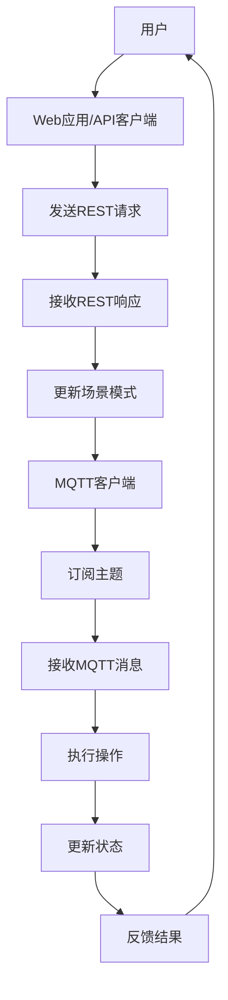

                 

# 基于MQTT协议和RESTful API的智能家居场景模式智能调整

> 关键词：MQTT协议，RESTful API，智能家居，场景模式，智能调整，物联网，物联网架构，数据通信，API设计，自动化

> 摘要：本文将探讨如何利用MQTT协议和RESTful API来实现智能家居场景模式的智能调整。我们将详细介绍这两种协议的核心概念，结合实际项目案例，逐步解析其应用场景、架构设计、算法原理和具体实现步骤，并提供实用的工具和资源推荐，帮助读者深入了解并掌握这一领域。

## 1. 背景介绍

### 1.1 目的和范围

随着物联网（IoT）技术的快速发展，智能家居逐渐成为人们生活的一部分。如何通过智能调整提升家居生活的便捷性和舒适性，是当前研究的热点。本文旨在介绍如何利用MQTT协议和RESTful API，实现智能家居场景模式的智能调整。

本文将覆盖以下内容：

- MQTT协议和RESTful API的基本概念和原理
- 智能家居场景模式的定义和分类
- MQTT协议和RESTful API在智能家居中的应用
- 实际项目的案例解析
- 相关工具和资源的推荐

### 1.2 预期读者

本文适合以下读者群体：

- 智能家居开发者
- 对物联网和智能家居感兴趣的技术爱好者
- 研究院和高校的研究生及教师
- 企业技术团队中的物联网技术顾问

### 1.3 文档结构概述

本文结构如下：

1. 背景介绍
2. 核心概念与联系
3. 核心算法原理与具体操作步骤
4. 数学模型和公式
5. 项目实战：代码实际案例
6. 实际应用场景
7. 工具和资源推荐
8. 总结：未来发展趋势与挑战
9. 附录：常见问题与解答
10. 扩展阅读与参考资料

### 1.4 术语表

#### 1.4.1 核心术语定义

- MQTT（Message Queuing Telemetry Transport）：一种轻量级的消息队列传输协议，广泛用于物联网设备之间的数据传输。
- RESTful API（Representational State Transfer Application Programming Interface）：一种基于HTTP协议的API设计风格，用于实现Web服务的交互。
- 智能家居：通过物联网技术将家庭设备连接起来，实现自动化控制和智能服务的家庭环境。
- 场景模式：根据用户的生活习惯和环境变化，自动调整家居设备的状态和功能的模式。

#### 1.4.2 相关概念解释

- 物联网（IoT）：将各种物理设备通过网络连接起来，实现信息的采集、传输和智能处理。
- 数据通信：在计算机系统和网络设备之间进行数据交换的过程。
- API设计：定义应用程序之间如何进行交互和通信的规则和协议。

#### 1.4.3 缩略词列表

- MQTT：Message Queuing Telemetry Transport
- RESTful API：Representational State Transfer Application Programming Interface
- IoT：Internet of Things
- HTTP：Hypertext Transfer Protocol
- JSON：JavaScript Object Notation

## 2. 核心概念与联系

在深入了解智能家居场景模式的智能调整之前，我们首先需要理解MQTT协议和RESTful API的核心概念，并探讨它们在智能家居系统中的作用和联系。

### 2.1 MQTT协议

MQTT协议是一种基于客户端-服务器的消息发布/订阅模型的消息传输协议，适用于低带宽、高延迟和不稳定网络的物联网环境。以下是MQTT协议的核心概念：

#### 2.1.1 MQTT协议核心概念

- **客户端（Client）**：连接到MQTT代理服务器的设备，可以发布（Publish）或订阅（Subscribe）消息。
- **代理服务器（Broker）**：接收客户端发布消息并将消息转发给订阅者，同时允许客户端订阅感兴趣的主题。
- **主题（Topic）**：消息的分类标识符，用于消息的过滤和路由。

#### 2.1.2 MQTT协议的工作流程

1. **连接（Connect）**：客户端连接到代理服务器，发送连接请求。
2. **订阅（Subscribe）**：客户端订阅感兴趣的特定主题，以便接收与该主题相关的消息。
3. **发布（Publish）**：客户端发布消息到特定的主题，消息由代理服务器转发给订阅者。
4. **断开连接（Disconnect）**：客户端断开与代理服务器的连接。

### 2.2 RESTful API

RESTful API是一种基于HTTP协议的应用编程接口设计风格，用于实现Web服务的交互。以下是RESTful API的核心概念：

#### 2.2.1 RESTful API核心概念

- **资源（Resource）**：API中的任何事物，如用户、产品、订单等。
- **端点（Endpoint）**：资源的访问地址，通常由URL表示。
- **HTTP方法（HTTP Method）**：用于对资源执行不同操作的HTTP请求方法，如GET、POST、PUT、DELETE等。

#### 2.2.2 RESTful API的工作流程

1. **请求（Request）**：客户端向服务器发送HTTP请求，包含请求方法和资源URL。
2. **响应（Response）**：服务器处理请求并返回HTTP响应，通常包含状态码和数据。
3. **数据格式**：数据通常以JSON或XML格式返回，以便客户端能够解析和处理。

### 2.3 MQTT协议与RESTful API的联系

MQTT协议和RESTful API在智能家居系统中各有优势，可以相互补充。MQTT协议适用于设备间的实时数据通信，而RESTful API适用于与远程服务器和Web应用程序的交互。

#### 2.3.1 MQTT协议在智能家居中的作用

- **设备间的数据同步**：MQTT协议可以实现智能家居设备之间的实时数据同步，如温度、湿度、光照等。
- **远程监控和控制**：用户可以通过MQTT协议远程监控和控制家居设备，如开启/关闭灯光、调节空调温度等。
- **故障诊断和报警**：设备可以通过MQTT协议向代理服务器发送故障信息，实现远程故障诊断和报警。

#### 2.3.2 RESTful API在智能家居中的作用

- **设备管理**：通过RESTful API，用户可以管理智能家居设备，如添加/删除设备、配置设备参数等。
- **场景模式调整**：用户可以通过Web应用程序或手机应用，通过RESTful API调整智能家居场景模式，实现个性化设置。
- **数据分析和决策**：通过收集和分析设备数据，用户可以实现智能家居的智能化决策，如自动调节设备工作状态、预测能耗等。

### 2.4 MQTT协议与RESTful API的关系

MQTT协议和RESTful API在智能家居系统中可以相互协作，实现系统的整体智能调整。例如：

- **集成数据源**：设备通过MQTT协议将实时数据发送到代理服务器，代理服务器通过RESTful API将数据存储在远程数据库中，供Web应用程序或用户进行查询和分析。
- **协同工作**：Web应用程序或用户通过RESTful API向设备发送指令，设备通过MQTT协议接收指令并执行相应的操作。

### 2.5 Mermaid流程图

为了更好地理解MQTT协议和RESTful API在智能家居系统中的应用，我们使用Mermaid绘制了以下流程图：



## 3. 核心算法原理 & 具体操作步骤

### 3.1 MQTT协议的工作原理

MQTT协议的核心原理在于其消息发布/订阅模型，具体操作步骤如下：

#### 3.1.1 服务器连接

```python
def connect_to_broker():
    client = MQTTClient("client_id", "broker.example.com")
    client.connect()
    return client
```

#### 3.1.2 订阅主题

```python
def subscribe_topics(client):
    client.subscribe("home/room1/temperature")
    client.subscribe("home/room1/humidity")
    client.subscribe("home/room1/light")
```

#### 3.1.3 发布消息

```python
def publish_message(client, topic, message):
    client.publish(topic, message)
```

#### 3.1.4 接收消息

```python
def on_message(client, userdata, message):
    print(f"Received message: {str(message.payload.decode('utf-8'))} on topic: {message.topic}")
```

### 3.2 RESTful API的工作原理

RESTful API的核心原理在于其基于HTTP协议的请求-响应模型，具体操作步骤如下：

#### 3.2.1 发送HTTP请求

```python
import requests

def send_request(url, method, data=None):
    if method == "GET":
        response = requests.get(url, params=data)
    elif method == "POST":
        response = requests.post(url, json=data)
    return response
```

#### 3.2.2 处理HTTP响应

```python
def handle_response(response):
    if response.status_code == 200:
        print("Request successful")
        print(response.json())
    else:
        print("Request failed")
        print(response.status_code)
```

### 3.3 MQTT协议与RESTful API的集成

为了实现MQTT协议与RESTful API的集成，可以将MQTT消息的接收处理与RESTful API的请求处理相结合，具体步骤如下：

#### 3.3.1 MQTT消息处理

```python
def on_message(client, userdata, message):
    topic = message.topic
    message_data = message.payload.decode('utf-8')
    # 处理MQTT消息
    if topic == "home/room1/temperature":
        temperature = float(message_data)
        # 将温度数据发送到RESTful API
        send_request("https://api.example.com/room1/temperature", "POST", {"value": temperature})
    elif topic == "home/room1/humidity":
        humidity = float(message_data)
        # 将湿度数据发送到RESTful API
        send_request("https://api.example.com/room1/humidity", "POST", {"value": humidity})
    elif topic == "home/room1/light":
        light = int(message_data)
        # 将光照数据发送到RESTful API
        send_request("https://api.example.com/room1/light", "POST", {"value": light})
```

#### 3.3.2 RESTful API请求处理

```python
def handle_request(request):
    if request.method == "POST":
        data = request.json()
        # 根据数据类型执行相应的操作
        if request.url == "https://api.example.com/room1/temperature":
            temperature = data["value"]
            # 调整房间温度
            adjust_temperature(temperature)
        elif request.url == "https://api.example.com/room1/humidity":
            humidity = data["value"]
            # 调整房间湿度
            adjust_humidity(humidity)
        elif request.url == "https://api.example.com/room1/light":
            light = data["value"]
            # 调整房间光照
            adjust_light(light)
```

### 3.4 智能家居场景模式的智能调整

智能家居场景模式的智能调整涉及实时数据采集、分析和决策。具体算法原理如下：

#### 3.4.1 数据采集

```python
# 采集温度、湿度、光照等数据
temperature = get_temperature()
humidity = get_humidity()
light = get_light()
```

#### 3.4.2 数据分析

```python
# 分析数据，确定调整策略
if temperature > threshold_temp:
    # 提高温度
    set_temperature(temperature + adjustment_temp)
elif temperature < threshold_temp:
    # 降低温度
    set_temperature(temperature - adjustment_temp)

if humidity > threshold_humidity:
    # 降低湿度
    set_humidity(humidity - adjustment_humidity)
elif humidity < threshold_humidity:
    # 提高湿度
    set_humidity(humidity + adjustment_humidity)

if light < threshold_light:
    # 提高光照
    set_light(light + adjustment_light)
elif light > threshold_light:
    # 降低光照
    set_light(light - adjustment_light)
```

#### 3.4.3 决策与执行

```python
# 根据分析结果执行调整操作
adjust_temperature(temperature)
adjust_humidity(humidity)
adjust_light(light)
```

## 4. 数学模型和公式 & 详细讲解 & 举例说明

在智能家居场景模式的智能调整中，数学模型和公式用于描述设备状态与调整策略之间的关系。以下是一个简单的数学模型，用于调整房间温度、湿度和光照：

### 4.1 温度调整模型

$$
T_{\text{new}} = T_{\text{current}} + \alpha (T_{\text{setpoint}} - T_{\text{current}})
$$

其中，\( T_{\text{new}} \) 为新的温度，\( T_{\text{current}} \) 为当前温度，\( T_{\text{setpoint}} \) 为设定温度，\( \alpha \) 为调整系数。

#### 4.1.1 举例说明

假设当前温度为 25°C，设定温度为 24°C，调整系数 \( \alpha \) 为 0.1，则新的温度为：

$$
T_{\text{new}} = 25 - 0.1 (25 - 24) = 24.9°C
$$

### 4.2 湿度调整模型

$$
H_{\text{new}} = H_{\text{current}} + \beta (H_{\text{setpoint}} - H_{\text{current}})
$$

其中，\( H_{\text{new}} \) 为新的湿度，\( H_{\text{current}} \) 为当前湿度，\( H_{\text{setpoint}} \) 为设定湿度，\( \beta \) 为调整系数。

#### 4.2.1 举例说明

假设当前湿度为 60%，设定湿度为 55%，调整系数 \( \beta \) 为 0.05，则新的湿度为：

$$
H_{\text{new}} = 60 + 0.05 (55 - 60) = 57.5%
$$

### 4.3 光照调整模型

$$
L_{\text{new}} = L_{\text{current}} + \gamma (L_{\text{setpoint}} - L_{\text{current}})
$$

其中，\( L_{\text{new}} \) 为新的光照强度，\( L_{\text{current}} \) 为当前光照强度，\( L_{\text{setpoint}} \) 为设定光照强度，\( \gamma \) 为调整系数。

#### 4.3.1 举例说明

假设当前光照强度为 300lx，设定光照强度为 400lx，调整系数 \( \gamma \) 为 0.05，则新的光照强度为：

$$
L_{\text{new}} = 300 + 0.05 (400 - 300) = 350lx
$$

### 4.4 模型集成

为了实现智能家居场景模式的智能调整，可以将温度、湿度和光照调整模型集成到一个统一的控制系统中。以下是一个简单的伪代码示例：

```python
def adjust_home_scenarios():
    # 采集当前温度、湿度和光照
    current_temp = get_temperature()
    current_humidity = get_humidity()
    current_light = get_light()

    # 计算温度调整
    temp_setpoint = get_temp_setpoint()
    temp_adjustment = 0.1 * (temp_setpoint - current_temp)
    new_temp = current_temp + temp_adjustment

    # 计算湿度调整
    humidity_setpoint = get_humidity_setpoint()
    humidity_adjustment = 0.05 * (humidity_setpoint - current_humidity)
    new_humidity = current_humidity + humidity_adjustment

    # 计算光照调整
    light_setpoint = get_light_setpoint()
    light_adjustment = 0.05 * (light_setpoint - current_light)
    new_light = current_light + light_adjustment

    # 执行调整操作
    set_temperature(new_temp)
    set_humidity(new_humidity)
    set_light(new_light)
```

## 5. 项目实战：代码实际案例和详细解释说明

为了更好地理解基于MQTT协议和RESTful API的智能家居场景模式智能调整的实现，我们将通过一个实际项目案例来详细讲解其代码实现过程。

### 5.1 开发环境搭建

首先，我们需要搭建一个支持MQTT协议和RESTful API的开发环境。以下是所需工具和软件：

- **MQTT代理服务器**：可以使用免费开源的MQTT代理服务器，如mosquitto。
- **Web服务器**：可以使用支持RESTful API的Web服务器，如Apache或Nginx。
- **后端开发框架**：可以选择Python的Flask或Django等框架。
- **前端开发框架**：可以选择Vue.js或React等框架。

### 5.2 源代码详细实现和代码解读

以下是项目的主要代码实现和解释：

#### 5.2.1 MQTT客户端代码

```python
import paho.mqtt.client as mqtt

def on_connect(client, userdata, flags, rc):
    print("Connected with result code "+str(rc))
    client.subscribe("home/room1/#")

def on_message(client, userdata, msg):
    print(f"Received message '{str(msg.payload.decode())}' on topic '{msg.topic}' with QoS {msg.qos}")

client = mqtt.Client()
client.on_connect = on_connect
client.on_message = on_message

client.connect("mqtt.broker.example.com", 1883, 60)
client.loop_forever()
```

**解读**：

- 使用`paho.mqtt.client`库创建MQTT客户端。
- 定义`on_connect`回调函数，用于处理连接成功的事件。
- 定义`on_message`回调函数，用于处理接收到的消息。

#### 5.2.2 RESTful API服务器代码

```python
from flask import Flask, request, jsonify

app = Flask(__name__)

@app.route('/room1/temperature', methods=['POST'])
def update_temperature():
    data = request.json
    temperature = data['value']
    # 更新温度数据
    set_temperature(temperature)
    return jsonify({"status": "success", "temperature": temperature})

@app.route('/room1/humidity', methods=['POST'])
def update_humidity():
    data = request.json
    humidity = data['value']
    # 更新湿度数据
    set_humidity(humidity)
    return jsonify({"status": "success", "humidity": humidity})

@app.route('/room1/light', methods=['POST'])
def update_light():
    data = request.json
    light = data['value']
    # 更新光照数据
    set_light(light)
    return jsonify({"status": "success", "light": light})

if __name__ == '__main__':
    app.run(host='0.0.0.0', port=5000)
```

**解读**：

- 使用Flask创建RESTful API服务器。
- 定义`update_temperature`、`update_humidity`和`update_light`路由函数，用于接收和处理温度、湿度和光照数据。
- 使用`jsonify`函数返回JSON格式的响应。

#### 5.2.3 客户端代码

```javascript
const temperatureInput = document.getElementById('temperature');
const humidityInput = document.getElementById('humidity');
const lightInput = document.getElementById('light');

function updateTemperature() {
    const temperature = temperatureInput.value;
    fetch('/room1/temperature', {
        method: 'POST',
        headers: {
            'Content-Type': 'application/json'
        },
        body: JSON.stringify({ value: temperature })
    });
}

function updateHumidity() {
    const humidity = humidityInput.value;
    fetch('/room1/humidity', {
        method: 'POST',
        headers: {
            'Content-Type': 'application/json'
        },
        body: JSON.stringify({ value: humidity })
    });
}

function updateLight() {
    const light = lightInput.value;
    fetch('/room1/light', {
        method: 'POST',
        headers: {
            'Content-Type': 'application/json'
        },
        body: JSON.stringify({ value: light })
    });
}
```

**解读**：

- 使用JavaScript和Fetch API创建一个简单的Web客户端。
- 定义`updateTemperature`、`updateHumidity`和`updateLight`函数，用于向服务器发送POST请求。

### 5.3 代码解读与分析

通过以上代码，我们可以看到如何利用MQTT协议和RESTful API实现智能家居场景模式的智能调整：

- **MQTT客户端**：通过`paho.mqtt.client`库连接到MQTT代理服务器，并订阅特定的主题。接收到的消息会触发`on_message`回调函数，用于处理消息。
- **RESTful API服务器**：使用Flask创建服务器，并定义处理温度、湿度和光照数据的路由函数。接收到的数据会存储在服务器端，并返回相应的JSON响应。
- **Web客户端**：使用JavaScript和Fetch API创建Web界面，用于发送数据到服务器。用户可以通过输入框调整温度、湿度和光照，并实时看到效果。

通过这种集成方式，我们可以实现一个功能强大且灵活的智能家居系统，满足用户个性化需求。

## 6. 实际应用场景

### 6.1 智能家居控制系统

智能家居场景模式智能调整在智能家居控制系统中有着广泛的应用。以下是一个具体的应用场景：

**场景**：用户在家中设置了一个智能场景模式，当用户离开家时，系统会自动调整家居设备状态，以节能和保障家居安全。

**实现**：

1. 用户通过手机App或Web界面设置智能场景模式，将温度、湿度、光照等参数设置为用户离开家时的舒适水平。
2. 系统通过MQTT协议连接到家居设备，如空调、加湿器、照明等。
3. 当用户离开家时，系统通过RESTful API发送指令，调整设备状态。
4. 家居设备接收到指令后，通过MQTT协议反馈调整结果。

### 6.2 智能办公环境

智能办公环境同样需要根据员工的工作需求和环境变化进行智能调整。以下是一个应用场景：

**场景**：企业办公区域需要根据不同时间段和员工需求调整室内温度、湿度和光照。

**实现**：

1. 办公区域配备智能传感器，实时监测温度、湿度和光照等环境参数。
2. 系统通过MQTT协议将监测数据发送到服务器，服务器通过分析数据调整环境参数。
3. 员工可以通过手机App或办公系统提交个性化需求，如温度、湿度设置等。
4. 系统通过RESTful API根据员工需求调整环境参数，并反馈调整结果。

### 6.3 智能农业

智能农业通过物联网技术实现农田环境监测和自动化控制，提高农作物产量和质量。以下是一个应用场景：

**场景**：农田中安装传感器，监测土壤湿度、温度和光照等参数，根据监测数据自动调整灌溉和施肥。

**实现**：

1. 传感器通过MQTT协议将监测数据发送到服务器，服务器分析数据并生成调整策略。
2. 根据策略，系统通过RESTful API控制灌溉和施肥设备，如滴灌系统和施肥机。
3. 设备通过MQTT协议反馈执行结果，系统根据反馈数据进行进一步调整。

### 6.4 智能医疗

智能医疗利用物联网技术实现远程监控和智能调整，为患者提供个性化护理方案。以下是一个应用场景：

**场景**：患者在家中安装健康监测设备，如血压计、血糖仪等，系统根据监测数据调整治疗方案。

**实现**：

1. 设备通过MQTT协议将监测数据发送到服务器，服务器分析数据并生成调整策略。
2. 根据策略，系统通过RESTful API发送指令到医疗设备，如胰岛素泵和输液泵。
3. 设备通过MQTT协议反馈执行结果，系统根据反馈数据进行进一步调整。

## 7. 工具和资源推荐

### 7.1 学习资源推荐

#### 7.1.1 书籍推荐

- 《物联网架构设计》
- 《RESTful Web API设计》
- 《智能家居系统设计与应用》
- 《Python MQTT编程实战》

#### 7.1.2 在线课程

- Coursera：物联网技术
- Udemy：RESTful API设计与开发
- edX：智能家居系统设计

#### 7.1.3 技术博客和网站

- IoT for All
- RESTful API Design
- Mozilla Developer Network (MDN)
- MQTT.org

### 7.2 开发工具框架推荐

#### 7.2.1 IDE和编辑器

- Visual Studio Code
- PyCharm
- IntelliJ IDEA

#### 7.2.2 调试和性能分析工具

- Postman
- Wireshark
- Prometheus

#### 7.2.3 相关框架和库

- Flask
- Django
- MQTTClient (Python)
- Express (Node.js)

### 7.3 相关论文著作推荐

#### 7.3.1 经典论文

- "A Survey of IoT Architecture Design Principles and Patterns"
- "RESTful API Design: Best Practices and Guidelines"
- "MQTT: A Message Queue Protocol for IoT Applications"

#### 7.3.2 最新研究成果

- "Intelligent Home Automation using IoT and AI"
- "Edge Computing for IoT Applications: A Survey"
- "Security in IoT: Challenges and Solutions"

#### 7.3.3 应用案例分析

- "Smart Home Security Systems: Implementing IoT Solutions"
- "IoT in Agriculture: Precision Farming and Smart Irrigation"
- "Healthcare IoT: Remote Patient Monitoring and Smart Therapies"

## 8. 总结：未来发展趋势与挑战

随着物联网、人工智能和云计算技术的快速发展，智能家居场景模式智能调整领域将呈现出以下发展趋势：

1. **智能化水平提高**：通过引入深度学习和大数据分析技术，智能家居系统能够更准确地预测用户需求，实现更加智能化的场景调整。
2. **个性化服务**：基于用户行为数据，智能家居系统能够为用户提供更加个性化的场景模式，提升用户体验。
3. **边缘计算**：边缘计算技术将进一步提升智能家居系统的响应速度和数据处理能力，降低延迟和带宽占用。
4. **安全性提升**：随着智能家居系统涉及的用户隐私和数据安全，安全性将成为未来发展的重点。

然而，智能家居场景模式智能调整领域也面临着以下挑战：

1. **数据隐私与安全**：如何保护用户隐私和数据安全，避免数据泄露和攻击，是亟待解决的问题。
2. **系统兼容性与互操作性**：如何实现不同品牌和厂商的智能家居设备之间的兼容与互操作，是行业面临的难题。
3. **能耗与环保**：智能家居设备的能耗和环保问题需要得到关注和解决。
4. **标准化**：制定统一的智能家居场景模式智能调整标准，以推动行业健康发展。

## 9. 附录：常见问题与解答

### 9.1 MQTT协议相关问题

**Q：MQTT协议如何保证消息的可靠性？**

A：MQTT协议提供两种消息传输模式：确认模式和订阅确认模式。确认模式确保消息被传输到代理服务器，而订阅确认模式确保消息被传输到所有订阅者。通过这些模式，MQTT协议能够保证消息的可靠性。

### 9.2 RESTful API相关问题

**Q：RESTful API与SOAP协议相比有哪些优势？**

A：RESTful API相对于SOAP协议具有以下优势：

- **简单性**：RESTful API基于HTTP协议，设计简单，易于理解和实现。
- **可扩展性**：RESTful API支持通过URL扩展功能，易于添加新功能和资源。
- **性能**：RESTful API通常具有更好的性能，因为它们不要求严格的客户端-服务器交互模式。
- **跨平台**：RESTful API支持各种编程语言和平台。

### 9.3 智能家居相关问题

**Q：如何确保智能家居系统的安全性？**

A：确保智能家居系统安全性的方法包括：

- **加密通信**：使用SSL/TLS等加密协议保护数据传输。
- **身份验证和授权**：使用OAuth、JWT等机制进行身份验证和授权。
- **数据存储安全**：加密存储敏感数据，并定期进行数据备份。
- **漏洞修复和更新**：及时修复系统漏洞，保持软件更新。

## 10. 扩展阅读 & 参考资料

### 10.1 经典论文

- "A Survey of IoT Architecture Design Principles and Patterns"
- "RESTful API Design: Best Practices and Guidelines"
- "MQTT: A Message Queue Protocol for IoT Applications"

### 10.2 最新研究成果

- "Intelligent Home Automation using IoT and AI"
- "Edge Computing for IoT Applications: A Survey"
- "Security in IoT: Challenges and Solutions"

### 10.3 应用案例分析

- "Smart Home Security Systems: Implementing IoT Solutions"
- "IoT in Agriculture: Precision Farming and Smart Irrigation"
- "Healthcare IoT: Remote Patient Monitoring and Smart Therapies"

### 10.4 参考资料

- MQTT官方网站：[MQTT.org](http://mqtt.org)
- RESTful API设计指南：[RESTful API Design](https://restfulapi.net/)
- Coursera物联网课程：[物联网技术](https://www.coursera.org/specializations/iot)
- Udemy RESTful API课程：[RESTful API设计与开发](https://www.udemy.com/course/rest-api-development/)

