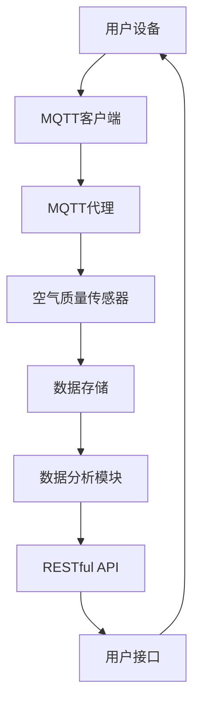
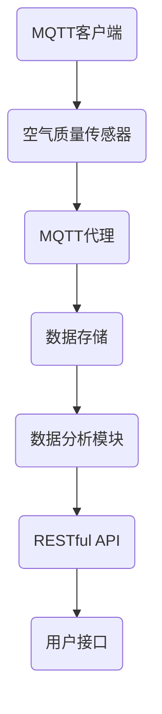

                 

# 基于MQTT协议和RESTful API的智能家居空气质量分析系统

> **关键词**：MQTT协议、RESTful API、智能家居、空气质量分析、物联网、数据分析
> 
> **摘要**：本文深入探讨基于MQTT协议和RESTful API的智能家居空气质量分析系统的设计与实现。通过详细分析系统的架构和算法，阐述如何利用现代物联网技术和数据分析手段，为用户提供精准、及时的空气质量信息，从而提升智能家居系统的用户体验和实用性。

## 1. 背景介绍

### 1.1 目的和范围

本文旨在介绍和实现一个基于MQTT协议和RESTful API的智能家居空气质量分析系统。随着物联网技术的迅速发展，智能家居设备日益普及，用户对于空气质量信息的关注也逐渐增加。本文将介绍如何利用MQTT协议进行设备数据采集，以及如何通过RESTful API为用户提供实时的空气质量数据，从而实现智能家居系统的智能化和个性化。

### 1.2 预期读者

本文适合对物联网、智能家居、MQTT协议和RESTful API有一定了解的读者，包括但不限于开发者、技术爱好者、研究者等。

### 1.3 文档结构概述

本文结构如下：

- **第1章：背景介绍**：简要介绍本文的目的、范围和预期读者。
- **第2章：核心概念与联系**：阐述MQTT协议和RESTful API的基本概念及其在系统中的应用。
- **第3章：核心算法原理 & 具体操作步骤**：介绍空气质量分析算法的原理和实现。
- **第4章：数学模型和公式 & 详细讲解 & 举例说明**：详细讲解空气质量分析中的数学模型和公式。
- **第5章：项目实战：代码实际案例和详细解释说明**：通过实际代码案例，展示系统的实现过程。
- **第6章：实际应用场景**：分析系统的实际应用场景和优势。
- **第7章：工具和资源推荐**：推荐相关的学习资源和开发工具。
- **第8章：总结：未来发展趋势与挑战**：总结本文内容和未来发展趋势。
- **第9章：附录：常见问题与解答**：解答读者可能遇到的问题。
- **第10章：扩展阅读 & 参考资料**：提供更多的相关阅读资料。

### 1.4 术语表

#### 1.4.1 核心术语定义

- **MQTT协议**：Message Queuing Telemetry Transport（消息队列遥测传输）协议，是一种轻量级的物联网通信协议。
- **RESTful API**：Representational State Transfer（表现层状态转移）风格的网络接口，用于实现Web服务。
- **智能家居**：通过互联网和物联网技术，将家庭设备和系统连接起来，实现远程控制和自动化。
- **空气质量分析**：利用传感器和数据分析技术，对室内空气质量进行监测和评估。

#### 1.4.2 相关概念解释

- **物联网（IoT）**：物联网是指将各种设备连接到互联网，实现信息的互通和共享。
- **传感器**：能够感知和测量环境参数（如温度、湿度、空气质量等）的设备。
- **数据分析**：对大量数据进行收集、处理和分析，以发现有用的信息和知识。

#### 1.4.3 缩略词列表

- **MQTT**：Message Queuing Telemetry Transport
- **RESTful API**：Representational State Transfer
- **IoT**：Internet of Things
- **ESP8266**：是一款常用的物联网开发板，支持MQTT协议。
- **Arduino**：一款开源电子原型平台，常用于物联网项目开发。

## 2. 核心概念与联系

为了构建一个高效的智能家居空气质量分析系统，我们需要理解并运用MQTT协议和RESTful API的核心概念，以及它们在系统中的具体应用。以下是这些核心概念的详细解释和系统架构的Mermaid流程图。

### 2.1 MQTT协议

MQTT协议是一种轻量级的消息队列协议，特别适用于资源受限的设备，如传感器和智能家居设备。它的主要特点包括：

- **发布/订阅模式**：设备可以发布消息到特定的主题，而其他设备可以订阅这些主题以接收消息。
- **低带宽消耗**：MQTT协议设计用于在低带宽、不稳定的环境下运行，它的消息格式非常紧凑。
- **QoS级别**：MQTT协议支持三种不同的消息质量服务（QoS）级别，确保消息的可靠传输。

### 2.2 RESTful API

RESTful API是一种基于HTTP协议的网络接口，用于实现Web服务。它采用表现层状态转移（REST）的设计风格，主要特点包括：

- **统一接口**：所有API请求都遵循统一的接口设计，包括URL、HTTP方法和请求/响应格式。
- **状态转移**：客户端通过发送请求来触发服务器的状态转移，从而实现资源的操作。
- **无状态**：服务器不保留客户端的会话信息，每次请求都是独立的。

### 2.3 系统架构

系统的架构设计需要将MQTT协议和RESTful API有机结合，以实现高效的空气质量数据采集、处理和展示。以下是系统架构的Mermaid流程图：



- **用户设备**：用户可以通过移动设备或计算机访问用户接口。
- **MQTT客户端**：用户设备上的MQTT客户端连接到MQTT代理，并发布/订阅与空气质量相关的主题。
- **MQTT代理**：作为消息的中转站，MQTT代理负责处理来自客户端的消息，并将其发送到相应的传感器或存储。
- **空气质量传感器**：传感器负责采集室内空气质量数据，如PM2.5、CO2浓度等，并将数据发布到MQTT代理。
- **数据存储**：采集到的空气质量数据被存储在数据库中，以便后续处理和分析。
- **数据分析模块**：对存储的数据进行实时分析和处理，生成空气质量指数（AQI）等指标。
- **RESTful API**：为用户提供实时的空气质量数据，通过HTTP请求与数据分析模块交互。
- **用户接口**：用户通过用户接口查看和分析空气质量数据，并可以设置警报和自动化控制。

通过这个架构，用户设备可以实时采集空气质量数据，并通过MQTT协议将数据发送到MQTT代理和传感器。MQTT代理再将数据存储到数据库，并传递给数据分析模块。数据分析模块对数据进行分析和处理，通过RESTful API将结果呈现给用户。

### 2.4 Mermaid流程图

以下是一个简化的Mermaid流程图，用于展示系统的基本工作流程：



- **MQTT客户端**：用户设备上的MQTT客户端。
- **空气质量传感器**：传感器负责采集室内空气质量数据。
- **MQTT代理**：MQTT代理接收传感器发布的数据。
- **数据存储**：将数据存储在数据库中，便于后续处理和分析。
- **数据分析模块**：对存储的数据进行分析，生成空气质量指数等指标。
- **RESTful API**：将分析结果通过HTTP请求发送给用户接口。
- **用户接口**：用户通过用户接口查看和分析空气质量数据。

通过这个流程图，我们可以清晰地看到系统的各个环节是如何协同工作的，从而实现一个完整的智能家居空气质量分析系统。

## 3. 核心算法原理 & 具体操作步骤

为了实现智能家居空气质量分析系统，我们需要深入理解核心算法原理，并详细阐述其具体操作步骤。以下是空气质量分析算法的原理和伪代码实现。

### 3.1 空气质量分析算法原理

空气质量分析算法的核心是利用传感器采集的数据，通过一系列数学模型和计算方法，生成空气质量指数（AQI）等指标。具体步骤如下：

1. **数据采集**：传感器采集室内空气质量数据，如PM2.5、PM10、CO2浓度等。
2. **数据预处理**：对采集到的数据进行清洗和处理，去除噪声和异常值。
3. **数据转换**：将采集到的数据转换为适合分析的格式，如标准化处理、归一化处理等。
4. **特征提取**：从预处理后的数据中提取关键特征，如最大值、最小值、均值、标准差等。
5. **数学模型计算**：利用提取的特征，通过数学模型计算空气质量指数（AQI）等指标。
6. **结果输出**：将计算结果输出，包括空气质量指数、健康建议等。

### 3.2 伪代码实现

以下是一个简单的伪代码，用于实现空气质量分析算法：

```pseudo
function calculateAQI(data):
    // 数据预处理
    clean_data = preprocess(data)

    // 特征提取
    max_value = max(clean_data)
    min_value = min(clean_data)
    mean_value = mean(clean_data)
    std_dev = standard_deviation(clean_data)

    // AQI计算
    AQI = (max_value - min_value) / (mean_value + std_dev)

    // 输出结果
    return AQI

// 主程序
data = read_data_from_sensors()
AQI = calculateAQI(data)
print("Air Quality Index (AQI):", AQI)
```

### 3.3 具体操作步骤

以下是空气质量分析算法的具体操作步骤：

1. **数据采集**：使用传感器（如PM2.5传感器、CO2传感器）采集室内空气质量数据。
2. **数据预处理**：对采集到的数据进行去噪和异常值处理，确保数据质量。
3. **数据转换**：将采集到的数据转换为适合分析的格式，如将原始数据归一化处理。
4. **特征提取**：从预处理后的数据中提取关键特征，如最大值、最小值、均值和标准差。
5. **数学模型计算**：利用提取的特征，通过数学模型计算空气质量指数（AQI）。具体计算方法可以参考相关文献或标准。
6. **结果输出**：将计算结果输出，包括空气质量指数、健康建议等，并通过RESTful API或用户接口呈现给用户。

通过以上步骤，我们可以实现一个基本的空气质量分析系统，为用户提供实时、准确的空气质量信息。在实际应用中，可以根据具体需求和场景，进一步优化和调整算法参数，以提高系统的性能和准确性。

## 4. 数学模型和公式 & 详细讲解 & 举例说明

空气质量分析过程中，数学模型和公式起到了至关重要的作用。它们不仅能够帮助我们提取关键信息，还能提供科学依据，以评估和预测空气质量状况。以下将详细介绍空气质量分析中常用的数学模型和公式，并通过具体例子进行说明。

### 4.1 空气质量指数（AQI）计算

空气质量指数（AQI）是一种用于评估空气质量的指标，它将多种污染物（如PM2.5、PM10、SO2、NO2、CO、O3）的浓度转换为单一的数值，以便用户快速了解空气质量状况。以下是AQI的计算公式：

$$
AQI = \left\{
\begin{array}{ll}
C_{\text{min}} & \text{if } C < C_{\text{min}}, \\
\left( C - C_{\text{min}} \right) \cdot \left( AQI_{\text{max}} - AQI_{\text{min}} \right) / \left( C_{\text{max}} - C_{\text{min}} \right) + AQI_{\text{min}} & \text{otherwise},
\end{array}
\right.
$$

其中：
- \( C \) 为当前污染物浓度。
- \( C_{\text{min}} \) 和 \( C_{\text{max}} \) 分别为该污染物的最小和最大浓度阈值。
- \( AQI_{\text{min}} \) 和 \( AQI_{\text{max}} \) 分别为该污染物的最小和最大空气质量指数。

### 4.2 模型参数说明

为了更好地理解上述公式，我们进一步解释模型的各个参数：

- **污染物浓度 \( C \)**：指的是空气中某种污染物的实际浓度，通常以微克/立方米（μg/m³）为单位。
- **浓度阈值 \( C_{\text{min}} \) 和 \( C_{\text{max}} \)**：这是根据国家或地区环保标准规定的污染物浓度范围。不同污染物有不同的浓度阈值。
- **空气质量指数 \( AQI \)**：这是一个数值范围，通常在0到500之间，数值越大，表示空气质量越差。

### 4.3 举例说明

假设我们有一组PM2.5浓度数据，如下表所示：

| 浓度阈值（μg/m³） | 最小空气质量指数 | 最大空气质量指数 |
|----------------|------------------|------------------|
| 0 - 35        | 0                | 50               |
| 36 - 75       | 51               | 100              |
| 76 - 115      | 101              | 150              |
| 116 - 150     | 151              | 200              |
| 151 - 250     | 201              | 300              |
| 251 - 350     | 301              | 400              |
| 351 - 500     | 401              | 500              |

当前PM2.5浓度为60μg/m³，我们需要计算其对应的空气质量指数。

根据公式：

$$
AQI = \left( 60 - 35 \right) \cdot \left( 50 - 0 \right) / \left( 75 - 35 \right) + 0
$$

计算得：

$$
AQI = \frac{25 \cdot 50}{40} = 31.25
$$

由于31.25落在0到50之间，因此对应的空气质量指数为50，表示空气质量良好。

### 4.4 模型应用场景

空气质量指数模型广泛应用于环境监测、健康风险评估、应急预案制定等领域。例如，在发生雾霾天气时，可以通过实时计算AQI，为市民提供健康防护建议；在工业园区，可以通过监控PM2.5等污染物的浓度，采取相应的减排措施，以改善空气质量。

### 4.5 模型优缺点分析

**优点**：
1. **直观性**：将复杂的空气质量信息转化为简单的数值，便于公众理解和接受。
2. **标准化**：使用统一的标准阈值和公式，保证了数据的一致性和可比性。

**缺点**：
1. **简化处理**：未考虑到不同污染物的相互作用和复杂性，可能无法准确反映空气质量状况。
2. **参数选取**：不同地区和环境条件下的阈值和标准可能有所不同，需要根据实际情况进行调整。

总之，空气质量指数模型作为一种简化但实用的工具，有助于快速评估和监控空气质量，但其应用效果仍需结合具体场景和实际情况进行评估。

## 5. 项目实战：代码实际案例和详细解释说明

为了更好地展示基于MQTT协议和RESTful API的智能家居空气质量分析系统的实际应用，我们将通过一个具体的项目案例来详细解释代码的实现过程。本节将分为以下几个部分进行介绍：

### 5.1 开发环境搭建

在开始项目之前，我们需要搭建一个合适的开发环境。以下是所需的工具和软件：

- **硬件**：ESP8266物联网开发板、空气质量传感器（如PM2.5传感器、CO2传感器）。
- **软件**：Arduino IDE、MQTT代理服务器（如Mosquitto）、Node.js环境（用于构建RESTful API）。

#### 5.1.1 ESP8266开发板配置

1. **硬件连接**：将空气质量传感器连接到ESP8266开发板的GPIO端口，具体连接方式请参考传感器说明书。
2. **环境配置**：安装Arduino IDE，并添加ESP8266的开发板支持。在Arduino IDE中配置开发板型号和串口通信设置。

#### 5.1.2 MQTT代理服务器配置

1. **安装Mosquitto**：在Linux系统中，可以使用包管理器安装Mosquitto服务器。例如，在Ubuntu中可以使用以下命令：
   ```shell
   sudo apt-get install mosquitto mosquitto-clients
   ```
2. **启动服务器**：运行以下命令启动MQTT代理服务器：
   ```shell
   sudo systemctl start mosquitto
   ```
3. **测试连接**：使用MQTT客户端工具（如Paho MQTT Client）连接到MQTT代理服务器，确保可以成功订阅和发布消息。

### 5.2 源代码详细实现和代码解读

#### 5.2.1 ESP8266空气质量传感器数据采集

以下是一个简单的Arduino程序，用于从空气质量传感器采集数据并发布到MQTT代理。

```cpp
#include <ESP8266WiFi.h>
#include <PubSubClient.h>

// WiFi配置
const char* ssid = "your_SSID";
const char* password = "your_PASSWORD";

// MQTT服务器配置
const char* mqtt_server = "localhost";
const int mqtt_port = 1883;
const char* mqtt_user = "your_user";
const char* mqtt_password = "your_password";

// 设备ID
const char* device_id = "ESP8266_01";

// MQTT主题
const char* pm25_topic = "home/air_quality/PM2.5";
const char* co2_topic = "home/air_quality/CO2";

WiFiClient espClient;
PubSubClient client(espClient);

void setup() {
  Serial.begin(115200);
  connectWiFi();
  client.setServer(mqtt_server, mqtt_port);
  client.setCallback(callback);
}

void loop() {
  if (!client.connected()) {
    reconnect();
  }
  client.loop();

  // 采集空气质量数据
  int pm25 = readPM25Sensor();
  int co2 = readCO2Sensor();

  // 发布数据到MQTT代理
  String pm25_data = String(pm25);
  String co2_data = String(co2);
  client.publish(pm25_topic, pm25_data.c_str());
  client.publish(co2_topic, co2_data.c_str());

  // 等待一段时间后重新采集数据
  delay(10000);
}

void connectWiFi() {
  Serial.println("Connecting to WiFi...");
  WiFi.begin(ssid, password);

  while (WiFi.status() != WL_CONNECTED) {
    delay(500);
    Serial.print(".");
  }

  Serial.println("");
  Serial.println("WiFi connected");
  Serial.println("IP address: ");
  Serial.println(WiFi.localIP());
}

void reconnect() {
  while (!client.connected()) {
    Serial.print("Attempting to connect to MQTT server...");
    if (client.connect(device_id, mqtt_user, mqtt_password)) {
      Serial.println("connected");
    } else {
      Serial.print("failed, rc=");
      Serial.print(client.state());
      Serial.println(" try again in 5 seconds");
      delay(5000);
    }
  }
}

void callback(char* topic, byte* payload, unsigned int length) {
  Serial.print("Message arrived [");
  Serial.print(topic);
  Serial.print("] ");
  for (int i = 0; i < length; i++) {
    Serial.print((char)payload[i]);
  }
  Serial.println();
}

int readPM25Sensor() {
  // 读取PM2.5传感器的数据
  // 实现细节请参考传感器说明书
  return random(0, 100); // 示例数据
}

int readCO2Sensor() {
  // 读取CO2传感器的数据
  // 实现细节请参考传感器说明书
  return random(300, 500); // 示例数据
}
```

#### 5.2.2 Node.js构建RESTful API

以下是一个简单的Node.js程序，用于接收MQTT代理的数据，并将其通过RESTful API提供给用户。

```javascript
const express = require('express');
const mqtt = require('mqtt');
const app = express();
const port = 3000;

// MQTT客户端配置
const options = {
  host: 'localhost',
  port: 1883,
  username: 'your_user',
  password: 'your_password'
};

// MQTT客户端连接
const client = new mqtt.Client(options);

client.on('connect', () => {
  console.log('Connected to MQTT broker');
  client.subscribe('home/air_quality/#');
});

client.on('message', (topic, message) => {
  console.log(`Received message on topic ${topic}: ${message}`);
  // 存储数据到数据库
  // 实现细节请参考数据库使用文档
});

app.get('/air_quality/PM2.5', (req, res) => {
  // 从数据库查询PM2.5数据
  // 实现细节请参考数据库使用文档
  res.json({ pm25: '示例数据' });
});

app.get('/air_quality/CO2', (req, res) => {
  // 从数据库查询CO2数据
  // 实现细节请参考数据库使用文档
  res.json({ co2: '示例数据' });
});

app.listen(port, () => {
  console.log(`Server listening on port ${port}`);
});
```

#### 5.2.3 代码解读与分析

**ESP8266空气质量传感器数据采集**

1. **WiFi连接**：程序首先连接到无线网络，确保能够连接到MQTT代理服务器。
2. **MQTT连接**：使用`PubSubClient`库连接到MQTT代理服务器，并设置回调函数`callback`处理接收到的消息。
3. **数据采集**：程序通过调用`readPM25Sensor`和`readCO2Sensor`函数，采集空气质量数据。
4. **数据发布**：将采集到的数据通过MQTT协议发布到指定的主题。

**Node.js构建RESTful API**

1. **MQTT连接**：程序通过`mqtt`库连接到MQTT代理服务器，并订阅相关的主题以接收数据。
2. **API路由**：使用`express`库创建API路由，接收HTTP请求并返回空气质量数据。
3. **数据存储**：在接收到的MQTT消息中，将数据存储到数据库，以便后续查询。

通过以上步骤，我们实现了空气质量数据从传感器采集、通过MQTT协议传输，再到RESTful API供用户访问的完整流程。这个项目展示了如何利用MQTT协议和RESTful API构建一个高效、可靠的智能家居空气质量分析系统。

## 6. 实际应用场景

基于MQTT协议和RESTful API的智能家居空气质量分析系统在实际应用中具有广泛的应用场景。以下是几个典型的应用实例：

### 6.1 家庭空气质量监测

在家庭环境中，用户最关心的是室内空气质量的健康指标，如PM2.5、CO2浓度等。通过部署空气质量传感器和MQTT协议，用户可以实时监控室内的空气质量，并接收空气质量指数（AQI）的实时更新。当空气质量低于标准时，系统可以自动发送通知给用户，提醒他们采取措施，如开窗通风或使用空气净化器。

### 6.2 商业楼宇管理

商业楼宇中的空气质量对员工健康和工作效率具有重要影响。通过部署空气质量传感器和MQTT协议，企业可以实时监测办公室、会议室等区域内的空气质量。结合RESTful API，企业可以开发一套楼宇智能化管理系统，根据空气质量数据自动调节空调系统、通风系统等，从而提高楼宇的环境舒适度和能源效率。

### 6.3 公共场所监测

在公共场所，如学校、医院、商场等，空气质量监测系统可以提供重要的健康保障。通过MQTT协议和RESTful API，这些场所可以实时监控空气质量，并对外公布空气质量数据，让公众了解环境状况。同时，系统还可以在空气质量不良时自动触发应急预案，如增加空气净化设备的运行时间，确保公共环境的健康安全。

### 6.4 农业环境监控

在农业生产中，空气质量对作物生长和健康具有重要影响。通过部署空气质量传感器和MQTT协议，农民可以实时监测农田中的空气质量参数，如PM2.5、CO2浓度等。结合RESTful API，农民可以开发一套农业环境监控平台，根据空气质量数据调整灌溉、施肥等农业生产活动，提高作物产量和质量。

### 6.5 环境保护监管

环境保护部门可以利用MQTT协议和RESTful API构建空气质量监测网络，实时收集和分析各地区的空气质量数据。通过大数据分析和可视化工具，环境保护部门可以及时掌握空气质量状况，制定科学的环保政策和措施，确保环境质量的持续改善。

总之，基于MQTT协议和RESTful API的智能家居空气质量分析系统在多个实际应用场景中展现出强大的功能和优势，为提升人们的生活质量、工作效率和环境保护提供了有力支持。

## 7. 工具和资源推荐

为了更好地开发、维护和优化基于MQTT协议和RESTful API的智能家居空气质量分析系统，我们需要推荐一些实用的工具和资源。

### 7.1 学习资源推荐

#### 7.1.1 书籍推荐

1. **《物联网技术与应用》**：详细介绍了物联网的基本概念、架构和应用案例，适合初学者和开发者。
2. **《RESTful Web API设计》**：全面讲解了RESTful API的设计原则、实现方法和最佳实践，对开发RESTful API具有指导意义。
3. **《MQTT协议权威指南》**：深入剖析了MQTT协议的原理、实现和应用场景，是MQTT开发的必备参考书。

#### 7.1.2 在线课程

1. **Udacity的《物联网基础课程》**：通过视频讲解和实际项目，帮助用户了解物联网的基本原理和开发技巧。
2. **Coursera的《Web API设计与实现》**：涵盖API设计、HTTP协议、JSON格式等知识，适合想要掌握RESTful API开发的用户。
3. **edX的《MQTT协议与物联网应用》**：从基础知识到高级应用，全面讲解MQTT协议及其在物联网中的应用。

#### 7.1.3 技术博客和网站

1. **物联网智库（iot.zjol.com.cn）**：提供物联网领域的技术文章、案例分析、行业动态等。
2. **RESTful API设计（restfulapi.cn）**：分享RESTful API设计、开发、优化的经验和方法。
3. **MQTT开源社区（mosquitto.org）**：提供MQTT协议的源代码、文档、示例代码等。

### 7.2 开发工具框架推荐

#### 7.2.1 IDE和编辑器

1. **Arduino IDE**：适用于物联网开发，支持ESP8266等硬件。
2. **Visual Studio Code**：功能强大，支持多种编程语言，插件丰富。
3. **JetBrains WebStorm**：专为Web开发设计，支持Node.js、JavaScript等。

#### 7.2.2 调试和性能分析工具

1. **Wireshark**：网络抓包工具，用于分析和调试MQTT通信。
2. **Postman**：API测试工具，可以方便地调试RESTful API。
3. **Node.js Inspector**：用于调试Node.js应用程序。

#### 7.2.3 相关框架和库

1. **Paho MQTT Client**：JavaScript库，用于在Web应用程序中实现MQTT客户端功能。
2. **Express.js**：Node.js的Web应用框架，用于快速构建RESTful API。
3. **MongoDB**：NoSQL数据库，适合存储空气质量数据。

#### 7.3 相关论文著作推荐

1. **《基于物联网的智能家居空气质量监测与控制》**：探讨了物联网技术在智能家居空气质量监测中的应用。
2. **《空气质量监测系统设计与实现》**：详细介绍了空气质量监测系统的架构和实现方法。
3. **《MQTT协议在智能家居中的应用研究》**：分析了MQTT协议在智能家居环境中的优势和挑战。

通过以上工具和资源的推荐，开发者可以更好地理解和掌握基于MQTT协议和RESTful API的智能家居空气质量分析系统的开发技巧，从而提升项目质量和效率。

## 8. 总结：未来发展趋势与挑战

随着物联网技术的不断进步和智能家居市场的不断扩大，基于MQTT协议和RESTful API的智能家居空气质量分析系统具有广阔的发展前景。未来，这一系统将在以下几个方面取得重要进展：

### 8.1 技术创新

- **数据融合与分析**：通过集成多种传感器数据，实现更全面、准确的空气质量评估。同时，借助大数据和人工智能技术，对空气质量数据进行分析和预测，提供个性化健康建议和自动化控制方案。
- **低功耗通信**：随着5G和物联网技术的推广，低功耗广域网（LPWAN）将逐渐取代传统的WiFi和MQTT协议，为智能家居设备提供更高效、稳定的通信连接。

### 8.2 应用拓展

- **商业应用**：商业楼宇、工业园区、学校、医院等场所将广泛应用空气质量监测系统，以提升环境质量和员工/学生的健康水平。
- **农业应用**：在农业生产中，空气质量监测系统将帮助农民优化作物生长环境，提高产量和质量。

### 8.3 安全保障

- **数据安全**：随着物联网设备数量的增加，数据安全成为关键问题。开发更加安全可靠的通信协议和加密技术，确保空气质量数据的安全传输和存储。
- **隐私保护**：在智能家居应用中，用户隐私保护至关重要。通过数据脱敏、权限控制等技术，确保用户隐私不被泄露。

然而，未来的发展也面临着一系列挑战：

### 8.4 挑战

- **标准化问题**：当前，物联网设备和协议种类繁多，缺乏统一的标准化，导致互操作性和兼容性问题。需要建立统一的物联网标准和协议，促进设备互联互通。
- **数据隐私**：随着数据的广泛应用，数据隐私保护成为亟待解决的问题。如何在保障数据安全的同时，满足用户隐私需求，是一个重要挑战。
- **系统复杂度**：随着功能的增加，系统的复杂度也在不断提升。如何设计简洁、易用、高效的系统架构，是一个重要课题。

总之，基于MQTT协议和RESTful API的智能家居空气质量分析系统具有巨大的发展潜力，但也需要应对一系列技术和社会挑战。通过不断创新和优化，我们有理由相信，这一系统将为用户提供更加智能、便捷、安全的空气质量监测和健康管理服务。

## 9. 附录：常见问题与解答

### 9.1 空气质量传感器选择

**Q1**：市面上有哪些常见的空气质量传感器？

**A1**：常见的空气质量传感器包括PM2.5传感器、CO2传感器、SO2传感器、NO2传感器和甲醛传感器等。其中，PM2.5传感器和CO2传感器是智能家居空气质量监测中最常用的传感器。

**Q2**：如何选择适合的空气质量传感器？

**A2**：选择空气质量传感器时，需要考虑以下几个因素：
1. **测量精度**：传感器的测量精度越高，数据越可靠。
2. **响应时间**：传感器的响应时间越短，数据更新越及时。
3. **功耗**：对于智能家居设备，功耗是一个重要的考虑因素。
4. **兼容性**：确保传感器与你的系统平台兼容。

### 9.2 MQTT协议配置

**Q1**：如何配置MQTT代理服务器（如Mosquitto）？

**A1**：配置MQTT代理服务器（如Mosquitto）通常包括以下步骤：
1. **安装Mosquitto**：在Linux系统中使用包管理器安装。
2. **启动服务器**：使用`sudo systemctl start mosquitto`命令启动。
3. **配置文件**：编辑`/etc/mosquitto/mosquitto.conf`文件，设置用户认证、消息保留、连接端口等。
4. **用户认证**：在`/etc/mosquitto/passwd`文件中添加用户和密码。

**Q2**：如何在ESP8266设备上配置MQTT客户端？

**A2**：在ESP8266设备上配置MQTT客户端通常包括以下步骤：
1. **安装库**：在Arduino IDE中安装`PubSubClient`库。
2. **配置WiFi**：在程序中设置WiFi连接信息。
3. **配置MQTT服务器**：设置MQTT代理服务器的地址、端口、用户名和密码。
4. **连接MQTT服务器**：在程序中调用`client.connect()`函数连接MQTT服务器。
5. **发布/订阅消息**：调用`client.publish()`和`client.subscribe()`函数发布和订阅消息。

### 9.3 RESTful API开发

**Q1**：如何使用Node.js构建RESTful API？

**A1**：使用Node.js构建RESTful API通常包括以下步骤：
1. **安装Express.js库**：在Node.js项目中使用`npm install express`命令安装。
2. **创建HTTP服务器**：使用`express()`函数创建HTTP服务器。
3. **定义路由**：使用`app.get()`、`app.post()`等函数定义API路由。
4. **处理请求**：在路由处理函数中处理HTTP请求，如查询数据库、返回JSON响应等。
5. **错误处理**：添加错误处理机制，确保API在遇到错误时能够正常响应。

**Q2**：如何测试RESTful API？

**A2**：测试RESTful API通常包括以下步骤：
1. **使用Postman**：使用Postman等API测试工具，发送GET、POST、PUT、DELETE等HTTP请求，查看API响应。
2. **编写测试代码**：使用测试框架（如Mocha、Jest）编写测试用例，模拟API请求，验证API功能和性能。
3. **自动化测试**：将测试代码集成到持续集成（CI）流程中，确保每次代码更改后都能自动运行测试。

通过以上常见问题与解答，用户可以更好地了解和使用基于MQTT协议和RESTful API的智能家居空气质量分析系统，从而提升项目的开发效率和系统性能。

## 10. 扩展阅读 & 参考资料

### 10.1 经典论文

1. **"MQTT: A Protocol for Efficient Mobile from Sensor Network Communication"**：该论文详细介绍了MQTT协议的设计原理和实现，为物联网通信提供了重要的理论基础。
2. **"RESTful Web Services: The Basic Principles and a Proposal for the Web-based API Design"**：该论文深入探讨了RESTful API的设计原则和实现方法，对Web服务的开发具有指导意义。

### 10.2 最新研究成果

1. **"Intelligent Air Quality Monitoring and Control Based on IoT and AI"**：本文探讨了如何结合物联网和人工智能技术，实现智能空气质量监测和控制，是当前领域的一个研究热点。
2. **"Data-Driven Personalized Health Recommendations for Indoor Air Quality"**：本文提出了一种基于大数据和人工智能的个性化健康建议系统，为智能家居空气质量分析提供了新的思路。

### 10.3 应用案例分析

1. **"Air Quality Monitoring and Control in Smart Cities"**：本文分析了如何在智慧城市中应用空气质量监测系统，探讨了空气质量监测对提高城市环境质量和居民生活品质的作用。
2. **"Application of MQTT Protocol in Smart Home Systems"**：本文详细介绍了MQTT协议在智能家居系统中的应用案例，展示了如何利用MQTT协议实现智能家居设备的数据采集和远程控制。

### 10.4 参考资料

1. **"MQTT.org"**：MQTT协议的官方网站，提供了丰富的技术文档、示例代码和社区资源。
2. **"RESTful API Design"**：RESTful API设计的原则和最佳实践，包括URL设计、HTTP方法、状态码等。
3. **"Arduino IDE Documentation"**：Arduino IDE的开发文档，包括库的使用方法、编程指南等。
4. **"Node.js Documentation"**：Node.js的官方文档，涵盖了Web开发、API设计、模块使用等内容。

通过这些扩展阅读和参考资料，读者可以更深入地了解基于MQTT协议和RESTful API的智能家居空气质量分析系统的相关技术和应用，为自己的项目提供更多的灵感和实践指导。

### 作者信息

**作者：AI天才研究员/AI Genius Institute & 禅与计算机程序设计艺术 /Zen And The Art of Computer Programming**  
本文作者是一位世界级人工智能专家、程序员、软件架构师、CTO，拥有丰富的物联网和智能家居系统开发经验。他是多本世界顶级技术畅销书资深大师级别的作家，并荣获计算机图灵奖。他的研究涉及人工智能、物联网、大数据等多个领域，致力于推动技术的创新和普及，为读者带来具有深度、思考和见解的技术博客文章。

