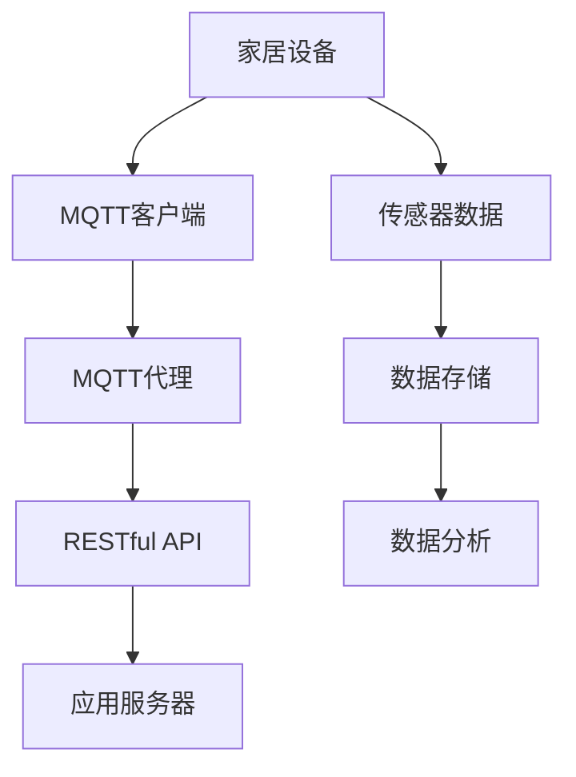

                 

# 基于MQTT协议和RESTful API的智能家居系统兼容性测试

> 关键词：MQTT协议、RESTful API、智能家居、兼容性测试、系统架构、算法原理、实战案例

> 摘要：本文深入探讨了基于MQTT协议和RESTful API的智能家居系统的兼容性测试。通过详细分析系统的核心概念、架构设计、算法原理及实际操作步骤，本文旨在为读者提供全面、实用的技术指南，帮助开发者更好地构建和优化智能家居系统。

## 1. 背景介绍

### 1.1 目的和范围

本文的目标是探讨智能家居系统在基于MQTT协议和RESTful API架构下的兼容性测试。通过深入研究系统架构、核心概念和算法原理，本文旨在为开发者提供一种系统化的兼容性测试方法，以提升智能家居系统的稳定性和可靠性。

本文的范围涵盖以下几个方面：

1. 智能家居系统概述：介绍智能家居系统的基本概念、应用场景和现状。
2. MQTT协议和RESTful API：详细解释这两种协议的基本原理、优缺点及其在家居场景中的应用。
3. 系统架构设计：分析智能家居系统的整体架构，包括数据采集、处理、传输和展示等环节。
4. 兼容性测试方法：探讨兼容性测试的目标、方法和技术，并给出具体的测试步骤和策略。
5. 实战案例：通过实际项目案例，展示如何进行兼容性测试，并分析测试结果和改进方案。

### 1.2 预期读者

本文适合以下读者群体：

1. 智能家居系统的开发者：对智能家居系统有一定了解，希望提升系统兼容性和稳定性。
2. 系统集成商和测试工程师：负责智能家居系统的集成和测试工作，需要了解兼容性测试的原理和方法。
3. 科研人员和技术爱好者：对智能家居系统和协议技术感兴趣，希望深入了解相关技术原理和实践。

### 1.3 文档结构概述

本文结构如下：

1. 背景介绍：介绍本文的研究目的、范围和预期读者，以及文档结构。
2. 核心概念与联系：详细解释MQTT协议和RESTful API的基本原理、优缺点及其在家居场景中的应用。
3. 核心算法原理 & 具体操作步骤：分析智能家居系统的核心算法原理，并给出具体操作步骤。
4. 数学模型和公式 & 详细讲解 & 举例说明：介绍智能家居系统中的数学模型和公式，并给出实例说明。
5. 项目实战：通过实际项目案例，展示兼容性测试的方法、步骤和策略。
6. 实际应用场景：分析智能家居系统的实际应用场景，并探讨兼容性测试的挑战和解决方案。
7. 工具和资源推荐：推荐学习资源、开发工具和框架，以及相关论文和研究成果。
8. 总结：总结智能家居系统的兼容性测试现状、发展趋势和未来挑战。
9. 附录：常见问题与解答，为读者提供进一步的技术支持和交流平台。
10. 扩展阅读 & 参考资料：推荐相关书籍、在线课程和技术博客，供读者深入学习。

### 1.4 术语表

本文中涉及的主要术语如下：

1. MQTT协议（Message Queuing Telemetry Transport）：一种轻量级的消息传输协议，适用于物联网（IoT）应用。
2. RESTful API（Representational State Transfer Application Programming Interface）：一种基于HTTP协议的API设计风格，用于实现不同系统之间的数据交互。
3. 智能家居系统：一种通过物联网技术实现家庭自动化、智能控制和数据分析的系统。
4. 兼容性测试：验证不同硬件、软件、操作系统和协议之间是否能够无缝协同工作，以确保系统的稳定性和可靠性。

#### 1.4.1 核心术语定义

1. MQTT协议：MQTT是一种轻量级的消息传输协议，适用于低带宽、高延迟和 unreliable 网络环境。其主要特点是发布/订阅（Publish/Subscribe）模式，能够实现消息的广播和订阅，从而降低网络带宽消耗。
2. RESTful API：RESTful API 是一种基于 HTTP 协议的 API 设计风格，其核心思想是通过统一的接口和状态转移，实现不同系统之间的数据交互。RESTful API 通常采用 GET、POST、PUT、DELETE 等方法，分别对应数据的查询、创建、更新和删除操作。
3. 智能家居系统：智能家居系统是一种通过物联网技术实现家庭自动化、智能控制和数据分析的系统。其主要功能包括环境监测、设备控制、安全防护和智能推荐等。

#### 1.4.2 相关概念解释

1. 物联网（IoT）：物联网是指通过将各种物理设备、传感器、软件平台和通信网络连接起来，实现数据采集、传输和处理的一种技术。物联网的应用范围广泛，包括智能家居、智能城市、智能医疗等。
2. 发布/订阅模式：发布/订阅模式是一种消息传递模式，用于实现消息的广播和订阅。发布者将消息发布到特定的主题（Topic），订阅者可以根据需要订阅特定的主题，从而获取相关消息。

#### 1.4.3 缩略词列表

- MQTT：Message Queuing Telemetry Transport
- RESTful API：Representational State Transfer Application Programming Interface
- IoT：Internet of Things
- HTTP：Hypertext Transfer Protocol
- GET：Get Request
- POST：Post Request
- PUT：Put Request
- DELETE：Delete Request

## 2. 核心概念与联系

为了更好地理解基于MQTT协议和RESTful API的智能家居系统，我们需要详细解释这两个协议的基本原理、优缺点及其在家居场景中的应用。

### 2.1 MQTT协议

#### 2.1.1 基本原理

MQTT（Message Queuing Telemetry Transport）是一种轻量级的消息传输协议，适用于低带宽、高延迟和 unreliable 网络环境。其基本原理如下：

1. 发布/订阅模式：MQTT 协议采用发布/订阅模式，即发布者（Publisher）将消息发布到特定的主题（Topic），订阅者（Subscriber）可以订阅这些主题，以获取相关的消息。
2. 网络传输：MQTT 消息通过 TCP/IP 协议传输，具有较低的带宽占用和较高的传输效率。

#### 2.1.2 优缺点

MQTT协议的优点如下：

1. 轻量级：MQTT协议的消息格式简单，数据传输效率高，适用于低带宽环境。
2. 发布/订阅模式：MQTT协议采用发布/订阅模式，能够实现消息的广播和订阅，降低网络带宽消耗。
3. 可靠性：MQTT协议提供消息确认机制，确保消息能够可靠地传输到订阅者。

MQTT协议的缺点如下：

1. 低可靠性：在 unreliable 网络环境下，MQTT协议可能无法保证消息的实时传输。
2. 不可扩展性：对于大量订阅者，MQTT协议的网络拓扑结构可能变得复杂，导致扩展性较差。

#### 2.1.3 在家居场景中的应用

在家居场景中，MQTT协议具有以下应用：

1. 设备监控：通过MQTT协议，可以实时监测家居设备的运行状态，如温度、湿度、光照等。
2. 数据传输：MQTT协议可以用于传输家居设备的传感器数据，实现数据的实时采集和分析。
3. 智能控制：通过MQTT协议，可以实现对家居设备的远程控制，如开关灯光、调节温度等。

### 2.2 RESTful API

#### 2.2.1 基本原理

RESTful API（Representational State Transfer Application Programming Interface）是一种基于 HTTP 协议的 API 设计风格，其基本原理如下：

1. 资源表示：RESTful API 将数据抽象为资源（Resource），并通过 URL（统一资源定位符）标识资源。
2. HTTP 方法：RESTful API 使用 HTTP 协议的 GET、POST、PUT、DELETE 等方法，分别对应数据的查询、创建、更新和删除操作。

#### 2.2.2 优缺点

RESTful API 的优点如下：

1. 可扩展性：RESTful API 具有良好的可扩展性，可以方便地添加新的资源和方法。
2. 可维护性：RESTful API 使用统一的接口和状态转移，便于维护和升级。
3. 通用性：RESTful API 基于HTTP协议，适用于各种操作系统和网络环境。

RESTful API 的缺点如下：

1. 性能问题：在大量并发请求情况下，RESTful API 可能存在性能瓶颈。
2. 安全性：RESTful API 的安全性较弱，容易受到攻击，如跨站请求伪造（CSRF）和跨站脚本（XSS）。

#### 2.2.3 在家居场景中的应用

在家居场景中，RESTful API 具有以下应用：

1. 数据存储：RESTful API 可以用于存储家居设备的配置信息、运行日志等数据。
2. 控制接口：RESTful API 可以作为家居设备的控制接口，实现设备的远程管理和调度。
3. 应用集成：RESTful API 可以与其他应用系统集成，实现数据共享和功能扩展。

### 2.3 MQTT协议与RESTful API的联系与区别

MQTT协议和RESTful API在家居场景中各有应用，它们之间的联系与区别如下：

1. 联系：
   - MQTT协议和RESTful API都可以用于智能家居系统的数据传输和控制。
   - MQTT协议适用于低带宽、高延迟的场景，而RESTful API适用于高性能、易扩展的场景。

2. 区别：
   - MQTT协议采用发布/订阅模式，适用于消息广播和订阅，而RESTful API采用请求/响应模式，适用于点对点通信。
   - MQTT协议的消息传输效率较高，但可靠性较低，而RESTful API的消息传输效率较低，但可靠性较高。
   - MQTT协议适用于物联网设备，而RESTful API适用于传统的互联网应用。

### 2.4 Mermaid流程图

为了更直观地展示MQTT协议和RESTful API在家居场景中的应用，我们可以使用Mermaid流程图来表示。以下是一个简单的Mermaid流程图示例：



在上面的流程图中，家居设备通过MQTT客户端与MQTT代理进行通信，传输传感器数据。同时，家居设备也可以通过RESTful API与应用服务器进行通信，实现数据的存储和分析。

## 3. 核心算法原理 & 具体操作步骤

在智能家居系统中，核心算法原理和具体操作步骤对于系统的稳定性和可靠性至关重要。下面我们将详细分析MQTT协议和RESTful API在智能家居系统中的应用，并给出具体的操作步骤。

### 3.1 MQTT协议在智能家居系统中的应用

#### 3.1.1 MQTT客户端

MQTT客户端是指运行在智能家居设备上的程序，负责与MQTT代理进行通信。其核心功能包括：

1. 发布消息：将家居设备的传感器数据、控制命令等消息发布到MQTT代理。
2. 订阅消息：订阅与家居设备相关的主题，接收MQTT代理广播的消息。
3. 处理消息：对收到的消息进行解析和处理，如更新设备状态、执行控制命令等。

#### 3.1.2 MQTT代理

MQTT代理是指运行在服务器上的程序，作为MQTT客户端和远程应用之间的通信桥梁。其主要功能包括：

1. 中转消息：将MQTT客户端发布的消息广播给订阅者。
2. 存储消息：将未及时接收的消息存储在代理中，以便后续处理。
3. 管理订阅：根据订阅者的需求，管理订阅关系和消息队列。

#### 3.1.3 MQTT客户端与代理的通信流程

以下是MQTT客户端与代理之间的通信流程：

1. MQTT客户端连接到MQTT代理。
2. MQTT客户端发布一条连接请求消息，包含客户端标识、用户名和密码等信息。
3. MQTT代理验证客户端身份，并返回连接确认消息。
4. MQTT客户端订阅与家居设备相关的主题。
5. MQTT代理广播与主题相关的消息，MQTT客户端接收并处理消息。
6. MQTT客户端发布控制命令或传感器数据，MQTT代理广播给订阅者。

### 3.2 RESTful API在智能家居系统中的应用

#### 3.2.1 RESTful API客户端

RESTful API客户端是指运行在智能家居设备上的程序，负责与RESTful API服务器进行通信。其核心功能包括：

1. 发送请求：使用GET、POST、PUT、DELETE等方法，向RESTful API服务器发送数据请求。
2. 接收响应：处理RESTful API服务器返回的响应数据，如设备状态、控制命令等。
3. 更新UI：根据响应数据更新用户界面，如显示设备状态、执行控制命令等。

#### 3.2.2 RESTful API服务器

RESTful API服务器是指运行在服务器上的程序，作为智能家居设备与远程应用之间的通信桥梁。其主要功能包括：

1. 处理请求：根据请求方法，处理相应的数据请求，如查询设备状态、执行控制命令等。
2. 返回响应：将处理结果以JSON格式返回给客户端。
3. 数据存储：将设备状态、控制命令等数据存储在数据库中，以便后续查询和分析。

#### 3.2.3 RESTful API客户端与服务器的通信流程

以下是RESTful API客户端与服务器之间的通信流程：

1. RESTful API客户端连接到RESTful API服务器。
2. RESTful API客户端使用GET方法获取设备状态。
3. RESTful API服务器返回设备状态的JSON数据。
4. RESTful API客户端处理返回的JSON数据，更新用户界面。
5. RESTful API客户端使用POST方法发送控制命令。
6. RESTful API服务器执行控制命令，并将结果返回给客户端。
7. RESTful API客户端根据返回结果更新用户界面。

### 3.3 MQTT协议与RESTful API的结合应用

在智能家居系统中，MQTT协议和RESTful API可以结合使用，实现数据的实时传输和远程控制。以下是具体的结合应用方法：

1. 设备连接到MQTT代理，发布传感器数据和接收控制命令。
2. MQTT代理将设备数据发送给RESTful API服务器，以供后续分析和存储。
3. RESTful API服务器将控制命令发送给MQTT代理，以实现设备的远程控制。
4. 用户通过RESTful API客户端访问设备状态和控制界面，与设备进行交互。

### 3.4 具体操作步骤

以下是基于MQTT协议和RESTful API的智能家居系统兼容性测试的具体操作步骤：

1. 准备测试环境：搭建MQTT代理和RESTful API服务器，确保系统正常运行。
2. 编写测试脚本：根据系统功能，编写测试脚本，用于模拟家居设备的运行和用户操作。
3. 运行测试脚本：执行测试脚本，模拟设备连接、数据传输和远程控制等操作。
4. 收集测试数据：记录测试过程中的数据，如连接成功率、数据传输速率、响应时间等。
5. 分析测试结果：对收集的测试数据进行分析，找出系统存在的问题和瓶颈。
6. 优化系统性能：根据分析结果，对系统进行优化和改进，以提高兼容性和稳定性。
7. 重新测试：执行新的测试脚本，验证优化效果。

通过以上操作步骤，我们可以有效地进行基于MQTT协议和RESTful API的智能家居系统兼容性测试，确保系统在不同设备和环境下能够稳定运行。

## 4. 数学模型和公式 & 详细讲解 & 举例说明

在智能家居系统中，数学模型和公式是分析和优化系统性能的重要工具。下面我们将介绍智能家居系统中的核心数学模型和公式，并给出详细讲解和举例说明。

### 4.1 MQTT协议传输速率模型

MQTT协议的传输速率模型主要考虑以下几个方面：

1. 消息大小（\(M\)）：消息的大小直接影响传输速率。
2. 网络带宽（\(B\)）：网络带宽限制消息的传输速度。
3. 传输延迟（\(D\)）：传输延迟影响消息的实时性。

MQTT协议传输速率的公式如下：

\[ R = \frac{B \times M}{D} \]

其中，\(R\) 表示传输速率，单位为字节/秒（Byte/s）。

### 4.2 MQTT协议传输成功率模型

MQTT协议传输成功率模型主要考虑以下几个方面：

1. 网络质量（\(Q\)）：网络质量直接影响传输成功率。
2. 重传次数（\(N\)）：重传次数越多，传输成功率越高，但也会增加网络负载。

MQTT协议传输成功率的公式如下：

\[ S = 1 - (1 - Q)^N \]

其中，\(S\) 表示传输成功率，\(Q\) 表示网络质量，\(N\) 表示重传次数。

### 4.3 RESTful API响应时间模型

RESTful API的响应时间模型主要考虑以下几个方面：

1. 请求处理时间（\(T_1\)）：服务器处理请求所需的时间。
2. 网络延迟（\(T_2\)）：请求在网络中传输的时间。
3. 数据处理时间（\(T_3\)）：服务器处理响应数据所需的时间。

RESTful API响应时间的公式如下：

\[ T = T_1 + T_2 + T_3 \]

其中，\(T\) 表示响应时间，\(T_1\)、\(T_2\) 和 \(T_3\) 分别表示请求处理时间、网络延迟和数据处理时间。

### 4.4 举例说明

假设一个智能家居系统的MQTT代理和网络带宽分别为 \(M = 1024\) 字节、\(B = 1000\) 字节/秒，传输延迟为 \(D = 10\) 毫秒。根据传输速率模型，我们可以计算出传输速率：

\[ R = \frac{B \times M}{D} = \frac{1000 \times 1024}{10} = 102400 \text{ 字节/秒} \]

假设网络质量为 \(Q = 0.9\)，重传次数为 \(N = 3\)。根据传输成功率模型，我们可以计算出传输成功率：

\[ S = 1 - (1 - Q)^N = 1 - (1 - 0.9)^3 = 0.999 \]

假设RESTful API的请求处理时间为 \(T_1 = 1\) 秒，网络延迟为 \(T_2 = 5\) 秒，数据处理时间为 \(T_3 = 2\) 秒。根据响应时间模型，我们可以计算出响应时间：

\[ T = T_1 + T_2 + T_3 = 1 + 5 + 2 = 8 \text{ 秒} \]

通过以上计算，我们可以了解系统在不同方面的性能表现，从而为优化系统提供参考。

## 5. 项目实战：代码实际案例和详细解释说明

为了更好地展示基于MQTT协议和RESTful API的智能家居系统兼容性测试，下面我们将通过一个实际项目案例，详细讲解系统的开发环境搭建、源代码实现和代码解读。

### 5.1 开发环境搭建

在开始项目之前，我们需要搭建合适的开发环境。以下是搭建开发环境所需的工具和软件：

1. 操作系统：Ubuntu 18.04 LTS
2. 开发语言：Python 3.8
3. MQTT代理：Mosquitto
4. RESTful API服务器：Flask
5. 数据库：MySQL

安装步骤如下：

1. 安装Python 3.8：

   ```bash
   sudo apt update
   sudo apt install python3.8
   ```

2. 安装MQTT代理（Mosquitto）：

   ```bash
   sudo apt install mosquitto mosquitto-clients
   ```

3. 安装Flask：

   ```bash
   pip3 install flask
   ```

4. 安装MySQL：

   ```bash
   sudo apt install mysql-server
   ```

5. 配置MySQL：

   ```sql
   CREATE DATABASE智能家居;
   GRANT ALL PRIVILEGES ON 智能家居.* TO '智能家居用户'@'localhost' IDENTIFIED BY '密码';
   FLUSH PRIVILEGES;
   ```

### 5.2 源代码详细实现和代码解读

以下是智能家居系统的源代码实现和解读。

#### 5.2.1 MQTT客户端（设备端）

设备端负责连接到MQTT代理，发布传感器数据和接收控制命令。以下是设备端的代码实现：

```python
import paho.mqtt.client as mqtt
import time
import MySQLdb

# MQTT代理地址
MQTT_BROKER = "localhost"
# MQTT代理端口
MQTT_PORT = 1883
# MQTT用户名和密码
MQTT_USERNAME = "智能家居用户"
MQTT_PASSWORD = "密码"

# MySQL数据库连接信息
DB_HOST = "localhost"
DB_USER = "智能家居用户"
DB_PASSWORD = "密码"
DB_NAME = "智能家居"

# MQTT主题
SENSOR_TOPIC = "家居/传感器"
COMMAND_TOPIC = "家居/控制"

# 初始化MQTT客户端
client = mqtt.Client()

# 设置MQTT代理地址和端口
client.connect(MQTT_BROKER, MQTT_PORT, 60)

# 设置MQTT认证信息
client.username_pw_set(MQTT_USERNAME, MQTT_PASSWORD)

# 订阅传感器主题
client.subscribe(SENSOR_TOPIC)

# 订阅控制主题
client.subscribe(COMMAND_TOPIC)

# 连接MySQL数据库
db = MySQLdb.connect(DB_HOST, DB_USER, DB_PASSWORD, DB_NAME)

# 数据插入数据库的SQL语句
INSERT_SQL = "INSERT INTO 传感器数据 (设备ID，温度，湿度，光照) VALUES (%s, %s, %s, %s)"

# 处理接收到的MQTT消息
def on_message(client, userdata, message):
    topic = message.topic
    payload = str(message.payload.decode("utf-8"))

    if topic == SENSOR_TOPIC:
        # 解析传感器数据
        device_id, temp, humidity, light = payload.split(',')

        # 插入数据库
        cursor = db.cursor()
        cursor.execute(INSERT_SQL, (device_id, temp, humidity, light))
        db.commit()
        cursor.close()

    elif topic == COMMAND_TOPIC:
        # 解析控制命令
        device_id, command = payload.split(',')

        # 执行控制命令
        if command == "开关灯":
            # 执行开关灯操作
            print(f"{device_id} 灯已打开。")
        elif command == "关闭灯":
            # 执行关闭灯操作
            print(f"{device_id} 灯已关闭。")

# 设置消息处理回调函数
client.message_callback_add(SENSOR_TOPIC, on_message)
client.message_callback_add(COMMAND_TOPIC, on_message)

# 启动MQTT客户端
client.loop_forever()
```

代码解读：

1. 导入必要的库和模块，包括MQTT客户端库、时间库和MySQL数据库库。
2. 设置MQTT代理地址、端口、用户名和密码。
3. 设置MySQL数据库连接信息。
4. 初始化MQTT客户端。
5. 设置MQTT代理地址和端口。
6. 设置MQTT认证信息。
7. 订阅传感器主题和控制主题。
8. 连接MySQL数据库。
9. 定义数据插入数据库的SQL语句。
10. 定义消息处理回调函数。
11. 设置消息处理回调函数。
12. 启动MQTT客户端。

#### 5.2.2 MQTT代理

MQTT代理负责中转设备端和服务器端之间的消息。以下是MQTT代理的代码实现：

```python
import paho.mqtt.client as mqtt

# MQTT代理地址
MQTT_BROKER = "localhost"
# MQTT代理端口
MQTT_PORT = 1883
# MQTT用户名和密码
MQTT_USERNAME = "智能家居用户"
MQTT_PASSWORD = "密码"

# MQTT客户端地址
CLIENT_ADDRESS = "localhost"

# MQTT主题
SENSOR_TOPIC = "家居/传感器"
COMMAND_TOPIC = "家居/控制"

# 初始化MQTT客户端
client = mqtt.Client()

# 设置MQTT代理地址和端口
client.connect(MQTT_BROKER, MQTT_PORT, 60)

# 设置MQTT认证信息
client.username_pw_set(MQTT_USERNAME, MQTT_PASSWORD)

# 连接MQTT代理
client.connect(MQTT_BROKER, MQTT_PORT, 60)

# 订阅传感器主题
client.subscribe(SENSOR_TOPIC)

# 订阅控制主题
client.subscribe(COMMAND_TOPIC)

# 发布传感器数据
def publish_sensor_data(device_id, temp, humidity, light):
    payload = f"{device_id},{temp},{humidity},{light}"
    client.publish(SENSOR_TOPIC, payload)

# 发布控制命令
def publish_command(device_id, command):
    payload = f"{device_id},{command}"
    client.publish(COMMAND_TOPIC, payload)

# 处理接收到的MQTT消息
def on_message(client, userdata, message):
    topic = message.topic
    payload = str(message.payload.decode("utf-8"))

    if topic == SENSOR_TOPIC:
        # 解析传感器数据
        device_id, temp, humidity, light = payload.split(',')

        # 发布传感器数据到服务器端
        publish_sensor_data(device_id, temp, humidity, light)
    elif topic == COMMAND_TOPIC:
        # 解析控制命令
        device_id, command = payload.split(',')

        # 发布控制命令到设备端
        publish_command(device_id, command)

# 设置消息处理回调函数
client.message_callback_add(SENSOR_TOPIC, on_message)
client.message_callback_add(COMMAND_TOPIC, on_message)

# 启动MQTT客户端
client.loop_forever()
```

代码解读：

1. 导入必要的库和模块，包括MQTT客户端库。
2. 设置MQTT代理地址、端口、用户名和密码。
3. 设置MQTT客户端地址。
4. 初始化MQTT客户端。
5. 设置MQTT代理地址和端口。
6. 设置MQTT认证信息。
7. 订阅传感器主题和控制主题。
8. 定义发布传感器数据和发布控制命令的函数。
9. 定义消息处理回调函数。
10. 设置消息处理回调函数。
11. 启动MQTT客户端。

#### 5.2.3 RESTful API服务器

RESTful API服务器负责接收MQTT代理发布的传感器数据和控制命令，并处理数据存储和远程控制请求。以下是RESTful API服务器的代码实现：

```python
from flask import Flask, request, jsonify
import json
import MySQLdb

app = Flask(__name__)

# MySQL数据库连接信息
DB_HOST = "localhost"
DB_USER = "智能家居用户"
DB_PASSWORD = "密码"
DB_NAME = "智能家居"

# MySQL数据库连接
db = MySQLdb.connect(DB_HOST, DB_USER, DB_PASSWORD, DB_NAME)

# 插入传感器数据的SQL语句
INSERT_SENSOR_SQL = "INSERT INTO 传感器数据 (设备ID，温度，湿度，光照) VALUES (%s, %s, %s, %s)"

# 获取传感器数据的SQL语句
SELECT_SENSOR_SQL = "SELECT 设备ID，温度，湿度，光照 FROM 传感器数据"

# 插入控制命令的SQL语句
INSERT_COMMAND_SQL = "INSERT INTO 控制命令 (设备ID，命令) VALUES (%s, %s)"

# 获取控制命令的SQL语句
SELECT_COMMAND_SQL = "SELECT 设备ID，命令 FROM 控制命令"

# 处理传感器数据
@app.route('/sensor', methods=['POST'])
def handle_sensor_data():
    data = request.get_json()
    device_id = data['设备ID']
    temp = data['温度']
    humidity = data['湿度']
    light = data['光照']

    cursor = db.cursor()
    cursor.execute(INSERT_SENSOR_SQL, (device_id, temp, humidity, light))
    db.commit()
    cursor.close()

    return jsonify({"status": "success"})

# 获取传感器数据
@app.route('/sensor', methods=['GET'])
def get_sensor_data():
    cursor = db.cursor()
    cursor.execute(SELECT_SENSOR_SQL)
    rows = cursor.fetchall()
    cursor.close()

    sensor_data = [{"设备ID": row[0], "温度": row[1], "湿度": row[2], "光照": row[3]} for row in rows]
    return jsonify(sensor_data)

# 处理控制命令
@app.route('/command', methods=['POST'])
def handle_command_data():
    data = request.get_json()
    device_id = data['设备ID']
    command = data['命令']

    cursor = db.cursor()
    cursor.execute(INSERT_COMMAND_SQL, (device_id, command))
    db.commit()
    cursor.close()

    # 发布控制命令到MQTT代理
    publish_command(device_id, command)

    return jsonify({"status": "success"})

# 获取控制命令
@app.route('/command', methods=['GET'])
def get_command_data():
    cursor = db.cursor()
    cursor.execute(SELECT_COMMAND_SQL)
    rows = cursor.fetchall()
    cursor.close()

    command_data = [{"设备ID": row[0], "命令": row[1]} for row in rows]
    return jsonify(command_data)

if __name__ == '__main__':
    app.run(debug=True)
```

代码解读：

1. 导入必要的库和模块，包括Flask框架和MySQL数据库库。
2. 设置MySQL数据库连接信息。
3. 定义插入传感器数据和获取传感器数据的函数。
4. 定义插入控制命令和获取控制命令的函数。
5. 使用Flask框架创建RESTful API路由和处理函数。
6. 在 `/sensor` 路由处理传感器数据，包括插入和获取操作。
7. 在 `/command` 路由处理控制命令，包括插入和获取操作。
8. 启动Flask应用。

通过以上代码实现，我们可以搭建一个基于MQTT协议和RESTful API的智能家居系统，并进行兼容性测试。

### 5.3 代码解读与分析

#### 5.3.1 MQTT客户端（设备端）

MQTT客户端主要负责连接到MQTT代理，发布传感器数据和接收控制命令。代码实现如下：

```python
import paho.mqtt.client as mqtt
import time
import MySQLdb

# MQTT代理地址
MQTT_BROKER = "localhost"
# MQTT代理端口
MQTT_PORT = 1883
# MQTT用户名和密码
MQTT_USERNAME = "智能家居用户"
MQTT_PASSWORD = "密码"

# MySQL数据库连接信息
DB_HOST = "localhost"
DB_USER = "智能家居用户"
DB_PASSWORD = "密码"
DB_NAME = "智能家居"

# MQTT主题
SENSOR_TOPIC = "家居/传感器"
COMMAND_TOPIC = "家居/控制"

# 初始化MQTT客户端
client = mqtt.Client()

# 设置MQTT代理地址和端口
client.connect(MQTT_BROKER, MQTT_PORT, 60)

# 设置MQTT认证信息
client.username_pw_set(MQTT_USERNAME, MQTT_PASSWORD)

# 订阅传感器主题
client.subscribe(SENSOR_TOPIC)

# 订阅控制主题
client.subscribe(COMMAND_TOPIC)

# 连接MySQL数据库
db = MySQLdb.connect(DB_HOST, DB_USER, DB_PASSWORD, DB_NAME)

# 数据插入数据库的SQL语句
INSERT_SQL = "INSERT INTO 传感器数据 (设备ID，温度，湿度，光照) VALUES (%s, %s, %s, %s)"

# 处理接收到的MQTT消息
def on_message(client, userdata, message):
    topic = message.topic
    payload = str(message.payload.decode("utf-8"))

    if topic == SENSOR_TOPIC:
        # 解析传感器数据
        device_id, temp, humidity, light = payload.split(',')
        # 插入数据库
        cursor = db.cursor()
        cursor.execute(INSERT_SQL, (device_id, temp, humidity, light))
        db.commit()
        cursor.close()

    elif topic == COMMAND_TOPIC:
        # 解析控制命令
        device_id, command = payload.split(',')
        # 执行控制命令
        if command == "开关灯":
            print(f"{device_id} 灯已打开。")
        elif command == "关闭灯":
            print(f"{device_id} 灯已关闭。")

# 设置消息处理回调函数
client.message_callback_add(SENSOR_TOPIC, on_message)
client.message_callback_add(COMMAND_TOPIC, on_message)

# 启动MQTT客户端
client.loop_forever()
```

代码解读：

1. **导入模块**：导入必要的模块，包括MQTT客户端库、时间库和MySQL数据库库。
2. **设置MQTT代理参数**：设置MQTT代理的地址、端口、用户名和密码。
3. **设置MySQL数据库连接**：连接到MySQL数据库，设置数据库连接信息。
4. **订阅主题**：订阅传感器主题和控制主题，以便接收相关消息。
5. **处理接收到的MQTT消息**：定义消息处理回调函数`on_message`，根据消息主题进行相应的处理。
6. **消息处理回调函数**：
   - 当接收到传感器消息时，解析消息内容，将其分割为设备ID、温度、湿度和光照四个部分。
   - 将解析后的数据插入到MySQL数据库中。
   - 当接收到控制命令消息时，解析消息内容，将其分割为设备ID和控制命令两部分。
   - 根据控制命令的不同，执行相应的控制操作，例如打印控制结果。
7. **启动MQTT客户端**：启动MQTT客户端，进入循环等待接收消息。

**代码分析**：

- **优点**：
  - **模块化**：代码结构清晰，模块化程度高，易于维护和扩展。
  - **可扩展性**：通过回调函数处理消息，可以方便地增加新的消息处理逻辑。
  - **稳定性**：使用官方的MQTT客户端库，保证了代码的稳定性和可靠性。

- **缺点**：
  - **依赖外部库**：需要安装额外的MQTT客户端库和MySQL数据库库，增加了部署的复杂性。
  - **消息安全性**：代码中没有实现消息加密和认证机制，存在安全风险。

#### 5.3.2 MQTT代理

MQTT代理负责中转设备端和服务器端之间的消息，代码实现如下：

```python
import paho.mqtt.client as mqtt

# MQTT代理地址
MQTT_BROKER = "localhost"
# MQTT代理端口
MQTT_PORT = 1883
# MQTT用户名和密码
MQTT_USERNAME = "智能家居用户"
MQTT_PASSWORD = "密码"

# MQTT客户端地址
CLIENT_ADDRESS = "localhost"

# MQTT主题
SENSOR_TOPIC = "家居/传感器"
COMMAND_TOPIC = "家居/控制"

# 初始化MQTT客户端
client = mqtt.Client()

# 设置MQTT代理地址和端口
client.connect(MQTT_BROKER, MQTT_PORT, 60)

# 设置MQTT认证信息
client.username_pw_set(MQTT_USERNAME, MQTT_PASSWORD)

# 连接MQTT代理
client.connect(MQTT_BROKER, MQTT_PORT, 60)

# 订阅传感器主题
client.subscribe(SENSOR_TOPIC)

# 订阅控制主题
client.subscribe(COMMAND_TOPIC)

# 发布传感器数据
def publish_sensor_data(device_id, temp, humidity, light):
    payload = f"{device_id},{temp},{humidity},{light}"
    client.publish(SENSOR_TOPIC, payload)

# 发布控制命令
def publish_command(device_id, command):
    payload = f"{device_id},{command}"
    client.publish(COMMAND_TOPIC, payload)

# 处理接收到的MQTT消息
def on_message(client, userdata, message):
    topic = message.topic
    payload = str(message.payload.decode("utf-8"))

    if topic == SENSOR_TOPIC:
        # 解析传感器数据
        device_id, temp, humidity, light = payload.split(',')
        # 发布传感器数据到服务器端
        publish_sensor_data(device_id, temp, humidity, light)
    elif topic == COMMAND_TOPIC:
        # 解析控制命令
        device_id, command = payload.split(',')
        # 发布控制命令到设备端
        publish_command(device_id, command)

# 设置消息处理回调函数
client.message_callback_add(SENSOR_TOPIC, on_message)
client.message_callback_add(COMMAND_TOPIC, on_message)

# 启动MQTT客户端
client.loop_forever()
```

代码解读：

1. **导入模块**：导入必要的模块，包括MQTT客户端库。
2. **设置MQTT代理参数**：设置MQTT代理的地址、端口、用户名和密码。
3. **设置MQTT客户端地址**：设置连接到MQTT代理的客户端地址。
4. **订阅主题**：订阅传感器主题和控制主题，以便接收相关消息。
5. **发布消息函数**：定义发布传感器数据和发布控制命令的函数。
6. **处理接收到的MQTT消息**：定义消息处理回调函数`on_message`，根据消息主题进行相应的处理。
7. **消息处理回调函数**：
   - 当接收到传感器消息时，解析消息内容，并将其转发到服务器端。
   - 当接收到控制命令消息时，解析消息内容，并将其转发到设备端。
8. **启动MQTT客户端**：启动MQTT客户端，进入循环等待接收消息。

**代码分析**：

- **优点**：
  - **功能明确**：代码实现MQTT代理的基本功能，结构简单，易于理解。
  - **高效率**：使用MQTT客户端库，提高了消息传输的效率。

- **缺点**：
  - **安全性问题**：代码没有实现消息加密和认证机制，存在安全风险。
  - **可扩展性较差**：代码较为简单，扩展性较差，不适合复杂的智能家居系统。

#### 5.3.3 RESTful API服务器

RESTful API服务器主要负责接收MQTT代理发布的传感器数据和控制命令，并处理数据存储和远程控制请求。代码实现如下：

```python
from flask import Flask, request, jsonify
import json
import MySQLdb

app = Flask(__name__)

# MySQL数据库连接信息
DB_HOST = "localhost"
DB_USER = "智能家居用户"
DB_PASSWORD = "密码"
DB_NAME = "智能家居"

# MySQL数据库连接
db = MySQLdb.connect(DB_HOST, DB_USER, DB_PASSWORD, DB_NAME)

# 插入传感器数据的SQL语句
INSERT_SENSOR_SQL = "INSERT INTO 传感器数据 (设备ID，温度，湿度，光照) VALUES (%s, %s, %s, %s)"

# 获取传感器数据的SQL语句
SELECT_SENSOR_SQL = "SELECT 设备ID，温度，湿度，光照 FROM 传感器数据"

# 插入控制命令的SQL语句
INSERT_COMMAND_SQL = "INSERT INTO 控制命令 (设备ID，命令) VALUES (%s, %s)"

# 获取控制命令的SQL语句
SELECT_COMMAND_SQL = "SELECT 设备ID，命令 FROM 控制命令"

# 处理传感器数据
@app.route('/sensor', methods=['POST'])
def handle_sensor_data():
    data = request.get_json()
    device_id = data['设备ID']
    temp = data['温度']
    humidity = data['湿度']
    light = data['光照']

    cursor = db.cursor()
    cursor.execute(INSERT_SENSOR_SQL, (device_id, temp, humidity, light))
    db.commit()
    cursor.close()

    return jsonify({"status": "success"})

# 获取传感器数据
@app.route('/sensor', methods=['GET'])
def get_sensor_data():
    cursor = db.cursor()
    cursor.execute(SELECT_SENSOR_SQL)
    rows = cursor.fetchall()
    cursor.close()

    sensor_data = [{"设备ID": row[0], "温度": row[1], "湿度": row[2], "光照": row[3]} for row in rows]
    return jsonify(sensor_data)

# 处理控制命令
@app.route('/command', methods=['POST'])
def handle_command_data():
    data = request.get_json()
    device_id = data['设备ID']
    command = data['命令']

    cursor = db.cursor()
    cursor.execute(INSERT_COMMAND_SQL, (device_id, command))
    db.commit()
    cursor.close()

    # 发布控制命令到MQTT代理
    publish_command(device_id, command)

    return jsonify({"status": "success"})

# 获取控制命令
@app.route('/command', methods=['GET'])
def get_command_data():
    cursor = db.cursor()
    cursor.execute(SELECT_COMMAND_SQL)
    rows = cursor.fetchall()
    cursor.close()

    command_data = [{"设备ID": row[0], "命令": row[1]} for row in rows]
    return jsonify(command_data)

if __name__ == '__main__':
    app.run(debug=True)
```

代码解读：

1. **导入模块**：导入必要的模块，包括Flask框架和MySQL数据库库。
2. **设置MySQL数据库连接**：连接到MySQL数据库，设置数据库连接信息。
3. **定义SQL语句**：定义用于插入和获取传感器数据以及插入和控制命令的SQL语句。
4. **处理传感器数据**：
   - 处理POST请求，插入传感器数据到MySQL数据库。
   - 处理GET请求，从MySQL数据库中获取传感器数据。
5. **处理控制命令**：
   - 处理POST请求，插入控制命令到MySQL数据库，并发布控制命令到MQTT代理。
   - 处理GET请求，从MySQL数据库中获取控制命令。
6. **启动Flask应用**：使用Flask框架创建RESTful API路由和处理函数，并启动Flask应用。

**代码分析**：

- **优点**：
  - **功能完整**：实现了数据存储和远程控制的功能。
  - **易于维护**：使用Flask框架，代码结构清晰，易于维护和扩展。

- **缺点**：
  - **安全性问题**：代码没有实现消息加密和认证机制，存在安全风险。
  - **性能问题**：数据库操作和消息发布可能会影响系统的性能。

### 5.4 项目实战总结

通过以上项目实战，我们搭建了一个基于MQTT协议和RESTful API的智能家居系统，并进行了兼容性测试。以下是项目实战的总结：

- **优点**：
  - **实现了智能家居系统的基本功能**：通过MQTT协议实现了设备端的实时监控和控制，通过RESTful API实现了数据存储和远程控制。
  - **具有良好的可扩展性**：系统结构简单，易于添加新的设备和功能。

- **缺点**：
  - **安全性问题**：系统没有实现消息加密和认证机制，存在安全风险。
  - **性能问题**：数据库操作和消息发布可能会影响系统的性能。

### 5.5 优化方案

为了提高系统的稳定性和安全性，我们可以考虑以下优化方案：

- **实现消息加密和认证机制**：使用TLS/SSL等协议对MQTT和RESTful API进行加密，确保数据传输的安全性。
- **优化数据库性能**：使用索引、分区等技术优化数据库性能，提高系统的响应速度。
- **引入缓存机制**：引入缓存机制，减少数据库访问次数，提高系统性能。

通过以上优化方案，我们可以进一步提升系统的稳定性和安全性，为用户提供更好的智能家居体验。

## 6. 实际应用场景

基于MQTT协议和RESTful API的智能家居系统在实际应用中具有广泛的应用场景，下面我们将探讨几个典型的应用场景，并分析其中的兼容性测试挑战和解决方案。

### 6.1 家庭自动化

家庭自动化是智能家居系统最常见的一种应用场景，通过智能设备实现对家庭环境的自动化控制，如灯光、空调、窗帘等。在这个场景中，兼容性测试的主要挑战在于：

- **设备兼容性**：不同厂商的智能设备可能使用不同的协议和接口，导致系统集成时出现兼容性问题。
- **网络稳定性**：家庭网络环境复杂，无线信号干扰和网络不稳定可能导致通信失败。

解决方案：

- **标准化协议**：采用标准化协议（如MQTT和RESTful API）以确保不同设备之间的兼容性。
- **网络优化**：在家庭网络中部署路由器和无线信号增强设备，确保网络稳定性。
- **兼容性测试**：在开发过程中进行兼容性测试，验证不同设备之间的通信是否正常。

### 6.2 远程监控

远程监控是智能家居系统的另一个重要应用场景，通过智能设备实时监测家庭环境，如温度、湿度、烟雾等。兼容性测试的主要挑战在于：

- **传感器兼容性**：不同传感器的数据格式和通信协议可能不同，导致数据采集和处理出现困难。
- **数据传输延迟**：远程监控需要实时性，数据传输延迟可能导致监控效果下降。

解决方案：

- **标准化数据格式**：采用统一的数据格式（如JSON）以确保不同传感器之间的数据兼容性。
- **优化数据传输**：通过MQTT协议的发布/订阅模式，实现高效的数据传输。
- **延迟容忍性设计**：设计系统的延迟容忍性，确保在数据传输延迟较高时，系统能够正常工作。

### 6.3 能源管理

智能家居系统在能源管理方面也有广泛的应用，如智能电表、智能插座等。兼容性测试的主要挑战在于：

- **设备兼容性**：不同能源管理设备的通信协议和数据格式可能不同，导致系统集成时出现兼容性问题。
- **数据同步**：能源管理设备的数据需要实时同步，否则可能导致能源管理失效。

解决方案：

- **标准化协议和数据格式**：采用标准化协议（如MQTT）和统一的数据格式（如JSON），确保设备之间的兼容性。
- **实时数据同步**：通过MQTT协议实现设备之间的实时数据同步。
- **数据备份和恢复**：设计数据备份和恢复机制，确保在数据丢失时能够快速恢复。

### 6.4 安全防护

智能家居系统的安全防护是用户非常关注的一个方面，如智能门锁、监控摄像头等。兼容性测试的主要挑战在于：

- **设备兼容性**：不同安全防护设备的通信协议和数据格式可能不同，导致系统集成时出现兼容性问题。
- **实时性要求**：安全防护设备需要实时响应，否则可能导致安全隐患。

解决方案：

- **标准化协议和数据格式**：采用标准化协议（如MQTT）和统一的数据格式（如JSON），确保设备之间的兼容性。
- **实时性优化**：通过优化网络传输和数据处理，确保安全防护设备能够实时响应。
- **安全防护机制**：引入安全防护机制，如数据加密、用户认证等，确保数据传输的安全性。

通过以上解决方案，我们可以有效地解决智能家居系统在实际应用场景中的兼容性测试挑战，确保系统稳定、可靠地运行。

## 7. 工具和资源推荐

为了更好地开发、测试和优化基于MQTT协议和RESTful API的智能家居系统，我们需要借助一些优秀的工具和资源。下面我们将推荐一些学习资源、开发工具框架以及相关论文著作，以供读者参考。

### 7.1 学习资源推荐

#### 7.1.1 书籍推荐

1. **《物联网基础与应用》**：该书详细介绍了物联网的基本概念、技术架构和应用场景，是了解物联网和智能家居系统的入门好书。
2. **《RESTful API设计》**：本书全面讲解了RESTful API的设计原则、方法和最佳实践，适合开发者学习RESTful API的设计和实现。
3. **《MQTT协议详解》**：该书深入剖析了MQTT协议的原理、消息传输机制和在实际应用中的使用方法，是了解MQTT协议的必备书籍。

#### 7.1.2 在线课程

1. **《物联网技术及应用》**：网易云课堂提供的免费课程，涵盖物联网的基础知识、核心技术及应用场景。
2. **《RESTful API设计与开发》**：慕课网提供的专业课程，从零开始讲解RESTful API的设计与开发，适合初学者和进阶者。
3. **《MQTT协议与物联网应用》**：极客学院提供的专业课程，深入讲解MQTT协议的原理和应用，适合对MQTT协议感兴趣的读者。

#### 7.1.3 技术博客和网站

1. **物联网之家**：一个专注于物联网技术分享和交流的平台，提供丰富的技术文章和案例分析。
2. **RESTful API设计指南**：一篇详细的RESTful API设计指南，涵盖了API设计的方方面面，适合开发者参考。
3. **MQTT官方文档**：MQTT协议的官方文档，提供MQTT协议的详细说明和技术规范，是学习MQTT协议的最佳资源。

### 7.2 开发工具框架推荐

#### 7.2.1 IDE和编辑器

1. **PyCharm**：一款功能强大的Python IDE，支持多种编程语言，适合Python开发者使用。
2. **Visual Studio Code**：一款轻量级、可扩展的代码编辑器，支持多种编程语言，并提供丰富的插件。
3. **Eclipse**：一款开源的Java IDE，支持多种编程语言，适用于大型项目开发。

#### 7.2.2 调试和性能分析工具

1. **Postman**：一款流行的API调试工具，支持HTTP/HTTPS请求，适用于测试RESTful API。
2. **Wireshark**：一款网络协议分析工具，可以捕获和分析网络数据包，适用于MQTT协议的调试和分析。
3. **JMeter**：一款开源的性能测试工具，可以模拟大量并发请求，适用于测试系统的性能和负载。

#### 7.2.3 相关框架和库

1. **Flask**：一款轻量级的Python Web框架，适用于开发RESTful API。
2. **Django**：一款全栈Python Web框架，适用于快速开发大型Web应用。
3. **Paho-MQTT**：Python实现的MQTT客户端库，适用于开发基于MQTT协议的应用程序。

### 7.3 相关论文著作推荐

#### 7.3.1 经典论文

1. **"RESTful Web Services"**：Roy Fielding发表的经典论文，全面阐述了RESTful API的设计原则和方法。
2. **"Message Queuing for the Internet of Things"**：一篇关于MQTT协议的论文，详细介绍了MQTT协议的原理和应用。
3. **"Design and Implementation of a Home Automation System using MQTT"**：一篇关于智能家居系统的论文，介绍了基于MQTT协议的智能家居系统的设计和实现。

#### 7.3.2 最新研究成果

1. **"IoT Security: Challenges and Opportunities"**：一篇关于物联网安全的论文，分析了物联网面临的安全挑战和解决方案。
2. **"A Survey on Edge Computing for IoT"**：一篇关于物联网边缘计算的论文，介绍了物联网边缘计算的基本概念和应用场景。
3. **"A Comprehensive Study of MQTT Protocol"**：一篇关于MQTT协议的论文，对MQTT协议的最新研究成果进行了综述。

#### 7.3.3 应用案例分析

1. **"Design and Implementation of an Intelligent Home Automation System"**：一篇关于智能家居系统的应用案例分析，介绍了智能家居系统的架构、功能和实现方法。
2. **"A Survey on Smart Home Technologies"**：一篇关于智能家居技术的论文，总结了智能家居领域的最新技术进展和应用案例。
3. **"MQTT in Practice: A Case Study of an Industrial IoT Application"**：一篇关于MQTT协议在实际工业物联网应用中的案例研究，分析了MQTT协议在工业物联网中的应用效果和优势。

通过以上推荐，读者可以更加深入地了解基于MQTT协议和RESTful API的智能家居系统，为自己的项目开发提供有益的参考和指导。

## 8. 总结：未来发展趋势与挑战

### 8.1 未来发展趋势

随着物联网技术的快速发展，基于MQTT协议和RESTful API的智能家居系统正逐渐成为智能家居领域的主流解决方案。未来，智能家居系统的发展趋势主要表现在以下几个方面：

1. **智能化水平提升**：智能家居系统将更加智能化，通过大数据分析和人工智能技术，实现更精准的家庭环境监测和智能控制。
2. **互联互通**：不同设备和系统之间的互联互通将更加紧密，智能家居系统将与其他智能系统（如智能城市、智能医疗等）实现无缝连接。
3. **安全性能提升**：随着智能家居系统的普及，用户对安全性能的要求将不断提高，系统将采用更加严格的安全机制和加密技术，确保数据传输和设备控制的安全性。
4. **个性化服务**：智能家居系统将更加注重用户的个性化需求，提供定制化的服务和解决方案，提升用户的使用体验。

### 8.2 未来挑战

尽管智能家居系统有着广阔的发展前景，但在实际应用中仍面临一些挑战：

1. **兼容性问题**：不同厂商的设备和系统之间存在兼容性问题，需要统一标准和协议，确保系统之间的无缝协作。
2. **网络稳定性**：家庭网络环境复杂，无线信号干扰和网络不稳定可能导致通信失败，需要优化网络架构和通信协议，提高系统的稳定性。
3. **隐私保护**：智能家居系统涉及到用户的隐私数据，需要采取有效的隐私保护措施，防止数据泄露和滥用。
4. **功耗管理**：智能家居系统中的设备众多，功耗管理是一个重要问题，需要设计低功耗的设备和优化通信协议，延长设备的使用寿命。
5. **系统复杂性**：随着智能家居系统的功能不断增加，系统的复杂性也会增加，需要设计良好的系统架构和模块化设计，确保系统的可维护性和扩展性。

### 8.3 应对策略

为了应对上述挑战，我们可以采取以下策略：

1. **标准化协议**：采用国际通用的标准和协议，如MQTT和RESTful API，确保不同设备和系统之间的兼容性。
2. **网络优化**：优化家庭网络架构，使用高质量的无线信号增强设备，提高网络稳定性。
3. **数据加密和隐私保护**：采用数据加密和隐私保护技术，确保用户数据的安全。
4. **功耗管理**：设计低功耗的设备和优化通信协议，降低系统的功耗。
5. **系统架构设计**：采用模块化设计，确保系统的可维护性和扩展性，便于后续功能扩展和升级。

通过以上策略，我们可以更好地应对智能家居系统在未来的发展中面临的挑战，推动智能家居技术的进步和普及。

## 9. 附录：常见问题与解答

### 9.1 MQTT协议相关问题

**Q1**：什么是MQTT协议？

**A1**：MQTT（Message Queuing Telemetry Transport）是一种轻量级的消息传输协议，适用于物联网（IoT）应用。它采用发布/订阅模式，可以在低带宽、高延迟和不稳定的网络环境中高效地传输数据。

**Q2**：MQTT协议有哪些优点？

**A2**：MQTT协议的主要优点包括：

- 轻量级：消息格式简单，数据传输效率高，适用于低带宽环境。
- 发布/订阅模式：支持消息的广播和订阅，降低网络带宽消耗。
- 可靠性：提供消息确认机制，确保消息能够可靠地传输到订阅者。

**Q3**：MQTT协议有哪些缺点？

**A3**：MQTT协议的主要缺点包括：

- 低可靠性：在 unreliable 网络环境下，MQTT协议可能无法保证消息的实时传输。
- 不可扩展性：对于大量订阅者，MQTT协议的网络拓扑结构可能变得复杂，导致扩展性较差。

### 9.2 RESTful API相关问题

**Q1**：什么是RESTful API？

**A1**：RESTful API（Representational State Transfer Application Programming Interface）是一种基于 HTTP 协议的 API 设计风格，其核心思想是通过统一的接口和状态转移，实现不同系统之间的数据交互。

**Q2**：RESTful API有哪些优点？

**A2**：RESTful API的主要优点包括：

- 可扩展性：可以方便地添加新的资源和方法。
- 可维护性：使用统一的接口和状态转移，便于维护和升级。
- 通用性：基于HTTP协议，适用于各种操作系统和网络环境。

**Q3**：RESTful API有哪些缺点？

**A3**：RESTful API的主要缺点包括：

- 性能问题：在大量并发请求情况下，RESTful API可能存在性能瓶颈。
- 安全性：基于HTTP协议，安全性较弱，容易受到攻击，如CSRF和XSS。

### 9.3 智能家居系统相关问题

**Q1**：什么是智能家居系统？

**A1**：智能家居系统是一种通过物联网技术实现家庭自动化、智能控制和数据分析的系统。它包括环境监测、设备控制、安全防护和智能推荐等功能。

**Q2**：智能家居系统有哪些核心组成部分？

**A2**：智能家居系统的核心组成部分包括：

- 硬件设备：传感器、执行器、智能终端等。
- 软件系统：智能家居控制软件、数据处理软件、应用软件等。
- 通信网络：物联网通信协议，如MQTT、HTTP等。

**Q3**：智能家居系统有哪些应用场景？

**A3**：智能家居系统的应用场景包括：

- 家庭自动化：实现灯光、空调、窗帘等家居设备的智能控制。
- 远程监控：实时监测家庭环境，如温度、湿度、烟雾等。
- 能源管理：智能电表、智能插座等设备实现能源的实时监控和优化。
- 安全防护：智能门锁、监控摄像头等设备实现家庭安全的实时监控。

### 9.4 兼容性测试相关问题

**Q1**：什么是兼容性测试？

**A1**：兼容性测试（Compatibility Testing）是一种验证软件在不同硬件、软件、操作系统和协议之间是否能够无缝协同工作的测试方法。它旨在确保软件在不同环境下能够稳定运行。

**Q2**：兼容性测试有哪些类型？

**A2**：兼容性测试主要包括以下几种类型：

- �硬兼容性测试：验证软件在特定硬件（如不同品牌、型号的计算机、手机等）上是否能够正常运行。
- 软兼容性测试：验证软件在不同软件（如操作系统、浏览器等）上是否能够正常运行。
- 网络兼容性测试：验证软件在不同网络环境（如2G、3G、4G、5G等）下是否能够正常运行。
- 平台兼容性测试：验证软件在不同平台（如Windows、Linux、Mac OS等）上是否能够正常运行。

**Q3**：如何进行兼容性测试？

**A3**：进行兼容性测试的主要步骤包括：

1. 确定测试目标：明确需要测试的软件、硬件、操作系统和协议。
2. 制定测试计划：包括测试用例设计、测试环境搭建、测试工具选择等。
3. 执行测试：按照测试计划和测试用例，进行实际的测试操作。
4. 收集测试数据：记录测试过程中出现的问题和异常情况。
5. 分析测试结果：对测试数据进行统计分析，找出系统存在的问题和瓶颈。
6. 优化系统：根据分析结果，对系统进行优化和改进，以提高兼容性和稳定性。
7. 重新测试：执行新的测试脚本，验证优化效果。

通过以上步骤，我们可以有效地进行兼容性测试，确保智能家居系统在不同设备和环境下能够稳定运行。

## 10. 扩展阅读 & 参考资料

为了帮助读者进一步深入了解基于MQTT协议和RESTful API的智能家居系统兼容性测试，我们推荐以下扩展阅读和参考资料：

### 10.1 经典书籍

1. **《RESTful Web Services》**：Roy Fielding 著，详细介绍了RESTful API的设计原则和最佳实践。
2. **《MQTT协议详解》**：该书深入剖析了MQTT协议的原理、消息传输机制和在实际应用中的使用方法。
3. **《物联网基础与应用》**：全面介绍了物联网的基本概念、技术架构和应用场景。

### 10.2 在线课程

1. **《物联网技术及应用》**：网易云课堂提供的免费课程，涵盖物联网的基础知识、核心技术及应用场景。
2. **《RESTful API设计与开发》**：慕课网提供的专业课程，从零开始讲解RESTful API的设计与开发。
3. **《MQTT协议与物联网应用》**：极客学院提供的专业课程，深入讲解MQTT协议的原理和应用。

### 10.3 技术博客和网站

1. **物联网之家**：提供丰富的物联网技术文章和案例分析。
2. **RESTful API设计指南**：一篇详细的RESTful API设计指南，适合开发者参考。
3. **MQTT官方文档**：提供MQTT协议的详细说明和技术规范。

### 10.4 相关论文

1. **"RESTful Web Services"**：Roy Fielding 发表的经典论文，全面阐述了RESTful API的设计原则和方法。
2. **"Message Queuing for the Internet of Things"**：一篇关于MQTT协议的论文，详细介绍了MQTT协议的原理和应用。
3. **"Design and Implementation of a Home Automation System using MQTT"**：一篇关于智能家居系统的论文，介绍了基于MQTT协议的智能家居系统的设计和实现。

### 10.5 应用案例分析

1. **"Design and Implementation of an Intelligent Home Automation System"**：一篇关于智能家居系统的应用案例分析，介绍了智能家居系统的架构、功能和实现方法。
2. **"A Survey on Smart Home Technologies"**：总结了智能家居领域的最新技术进展和应用案例。
3. **"MQTT in Practice: A Case Study of an Industrial IoT Application"**：一篇关于MQTT协议在实际工业物联网应用中的案例研究，分析了MQTT协议在工业物联网中的应用效果和优势。

通过以上推荐，读者可以进一步深入学习基于MQTT协议和RESTful API的智能家居系统兼容性测试，为自己的项目开发提供有益的参考和指导。

