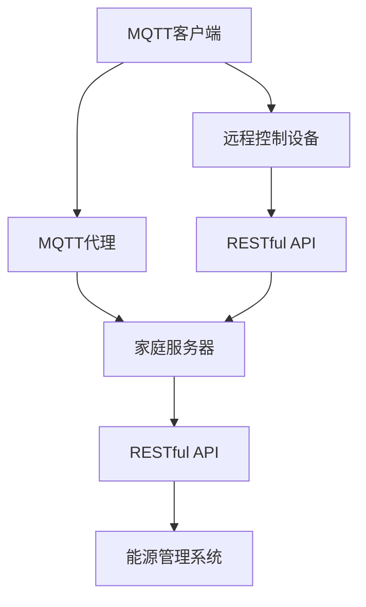

                 

# 基于MQTT协议和RESTful API的智能家居能效管理方案

> **关键词：** MQTT协议、RESTful API、智能家居、能效管理、物联网、智能家居系统集成

> **摘要：** 本文将探讨如何利用MQTT协议和RESTful API实现智能家居的能效管理。我们将详细分析MQTT协议的工作原理及其在智能家居中的应用，介绍RESTful API的设计理念及其优势，并通过一个实际案例，展示如何将这两种技术结合起来，实现智能家居系统的能效监控和优化。

## 1. 背景介绍

### 1.1 目的和范围

本文旨在介绍一种基于MQTT协议和RESTful API的智能家居能效管理方案。随着物联网（IoT）技术的快速发展，智能家居系统已成为现代家庭的重要组成部分。然而，如何有效地管理和优化这些系统的能效，仍然是一个具有挑战性的问题。本文将通过MQTT协议和RESTful API的结合使用，提供一种可行的解决方案，以期提高智能家居系统的运行效率和能源利用率。

### 1.2 预期读者

本文面向希望了解如何利用MQTT协议和RESTful API实现智能家居能效管理的开发人员、系统集成商以及相关领域的科研人员。对于对物联网技术有一定了解的读者，本文将提供详细的技术分析，帮助读者深入理解智能家居系统能效管理的关键技术。

### 1.3 文档结构概述

本文将按照以下结构进行论述：

1. **背景介绍**：介绍本文的目的、范围和预期读者，以及文档的结构。
2. **核心概念与联系**：阐述MQTT协议和RESTful API的核心概念，并通过Mermaid流程图展示其关系。
3. **核心算法原理 & 具体操作步骤**：详细讲解MQTT协议和RESTful API的工作原理，并提供伪代码。
4. **数学模型和公式 & 详细讲解 & 举例说明**：介绍能效管理的数学模型和公式，并给出实例说明。
5. **项目实战：代码实际案例和详细解释说明**：通过一个实际案例，展示如何实现智能家居能效管理。
6. **实际应用场景**：探讨智能家居能效管理的实际应用场景。
7. **工具和资源推荐**：推荐相关的学习资源、开发工具和论文著作。
8. **总结：未来发展趋势与挑战**：总结智能家居能效管理的未来发展趋势和面临的挑战。
9. **附录：常见问题与解答**：提供关于本文主题的常见问题及解答。
10. **扩展阅读 & 参考资料**：推荐进一步阅读的相关资料。

### 1.4 术语表

#### 1.4.1 核心术语定义

- **MQTT协议**：是一种轻量级的消息队列传输协议，广泛应用于物联网领域。
- **RESTful API**：是一种基于REST设计风格的API，用于实现网络应用之间的通信。
- **智能家居**：利用物联网技术实现家庭设备和系统的智能化管理。
- **能效管理**：通过监测和控制家庭设备和系统的运行，提高能源利用效率和降低能耗。

#### 1.4.2 相关概念解释

- **物联网（IoT）**：将各种物品通过互联网连接起来，实现信息交换和通信。
- **REST设计风格**：一种网络应用的设计风格，强调简单、灵活和可扩展性。

#### 1.4.3 缩略词列表

- **MQTT**：Message Queuing Telemetry Transport
- **REST**：Representational State Transfer
- **IoT**：Internet of Things
- **API**：Application Programming Interface

## 2. 核心概念与联系

在探讨智能家居能效管理方案之前，我们需要了解MQTT协议和RESTful API的核心概念，以及它们在智能家居系统中的作用和联系。

### 2.1 MQTT协议

MQTT（Message Queuing Telemetry Transport）是一种轻量级的消息队列传输协议，专为物联网环境设计。它的主要特点是：

- **简单性**：MQTT协议的消息传输格式简单，便于设备和服务器之间的通信。
- **低带宽**：MQTT协议通过压缩消息内容和优化传输机制，适用于带宽受限的环境。
- **可靠性**：MQTT协议支持消息的确认和重传，确保数据传输的可靠性。

在智能家居系统中，MQTT协议主要用于实现家庭设备和控制系统之间的实时数据通信。例如，智能灯泡可以通过MQTT协议向家庭服务器发送亮度变化的通知，服务器可以进一步处理这些数据，实现自动调节。

### 2.2 RESTful API

RESTful API（Representational State Transfer API）是一种基于REST设计风格的API，用于实现网络应用之间的通信。RESTful API的特点包括：

- **无状态**：每个请求都是独立的，服务器不保留任何客户端的状态信息。
- **统一接口**：通过URL（统一资源定位符）和HTTP方法（GET、POST、PUT、DELETE等）实现资源的访问和操作。
- **可扩展性**：RESTful API支持通过扩展URL和HTTP头部来实现功能的扩展。

在智能家居系统中，RESTful API主要用于实现智能家居设备和外部系统的集成。例如，智能家居服务器可以通过RESTful API接收用户远程控制命令，或者向其他系统（如能源管理系统）发送设备状态数据。

### 2.3 MQTT协议和RESTful API的联系

MQTT协议和RESTful API在智能家居系统中可以互相补充，共同实现能效管理的目标。MQTT协议用于实现设备间的实时数据通信，而RESTful API则用于实现系统之间的数据共享和远程控制。

一个典型的应用场景是，智能灯泡通过MQTT协议向家庭服务器发送亮度变化的数据，家庭服务器可以通过RESTful API将这个数据发送给能源管理系统，以便进行能效分析。同时，用户也可以通过远程设备（如智能手机）发送控制命令，通过RESTful API传递给家庭服务器，再由家庭服务器通过MQTT协议发送给智能灯泡。

### 2.4 Mermaid流程图

以下是一个简单的Mermaid流程图，展示了MQTT协议和RESTful API在智能家居系统中的关系：



在这个流程图中，MQTT客户端（如智能灯泡）通过MQTT协议向MQTT代理发送数据，MQTT代理负责消息的传输和路由。家庭服务器接收到MQTT数据后，通过RESTful API将数据发送给其他系统（如能源管理系统）。远程控制设备（如智能手机）也可以通过RESTful API发送控制命令，由家庭服务器处理并发送给MQTT客户端。

## 3. 核心算法原理 & 具体操作步骤

在实现智能家居能效管理方案时，我们需要借助MQTT协议和RESTful API来实现数据通信和远程控制。以下将详细讲解MQTT协议和RESTful API的核心算法原理，并提供具体的操作步骤。

### 3.1 MQTT协议的工作原理

MQTT协议是基于发布/订阅模式的消息传输协议。其主要工作原理如下：

- **发布者（Publisher）**：负责发布消息，消息可以是设备的传感器数据、状态信息等。
- **订阅者（Subscriber）**：负责订阅特定主题的消息，接收发布者发布的消息。

具体操作步骤如下：

1. **连接MQTT代理**：客户端首先连接到MQTT代理，并建立连接。
2. **订阅主题**：客户端向MQTT代理订阅特定主题，以便接收相关消息。
3. **发布消息**：客户端发布消息到MQTT代理，消息会被路由到所有订阅该主题的客户端。
4. **断开连接**：客户端在完成消息传输后，断开与MQTT代理的连接。

以下是一个简单的MQTT协议伪代码示例：

```python
import paho.mqtt.client as mqtt

# MQTT代理地址和端口
mqtt_server = "mqtt.example.com"
mqtt_port = 1883

# 创建MQTT客户端
client = mqtt.Client()

# 连接到MQTT代理
client.connect(mqtt_server, mqtt_port)

# 订阅主题
client.subscribe("home/room1/light")

# 发布消息
client.publish("home/room1/light", "亮度：80%")

# 断开连接
client.disconnect()
```

### 3.2 RESTful API的设计原理

RESTful API是一种基于HTTP协议的应用程序接口，其设计原则如下：

- **统一接口**：使用标准的HTTP方法（GET、POST、PUT、DELETE等）和URL（统一资源定位符）来访问和操作资源。
- **无状态**：每个请求都是独立的，服务器不保留任何客户端的状态信息。
- **可扩展性**：通过扩展URL和HTTP头部来实现功能的扩展。

具体操作步骤如下：

1. **创建资源**：通过HTTP POST请求创建新的资源。
2. **获取资源**：通过HTTP GET请求获取资源的详细信息。
3. **更新资源**：通过HTTP PUT或PATCH请求更新资源的属性。
4. **删除资源**：通过HTTP DELETE请求删除资源。

以下是一个简单的RESTful API伪代码示例：

```python
import requests

# RESTful API地址
api_url = "https://api.example.com"

# 创建资源
response = requests.post(f"{api_url}/rooms", json={"name": "room1", "light": "off"})

# 获取资源
response = requests.get(f"{api_url}/rooms/room1")

# 更新资源
response = requests.put(f"{api_url}/rooms/room1", json={"light": "on"})

# 删除资源
response = requests.delete(f"{api_url}/rooms/room1")
```

### 3.3 MQTT协议和RESTful API的整合

在实际应用中，MQTT协议和RESTful API可以结合起来，实现智能家居系统能效管理。以下是一个简单的整合流程：

1. **设备通过MQTT协议向服务器发送数据**：例如，智能灯泡通过MQTT协议向家庭服务器发送亮度变化的数据。
2. **服务器接收到MQTT数据后，通过RESTful API处理数据**：例如，家庭服务器通过RESTful API将MQTT数据发送给能源管理系统，进行能效分析。
3. **用户通过远程设备通过RESTful API发送控制命令**：例如，用户通过智能手机发送控制命令，通过RESTful API传递给家庭服务器，再由家庭服务器通过MQTT协议发送给智能灯泡。

以下是一个简单的整合伪代码示例：

```python
import requests
import paho.mqtt.client as mqtt

# MQTT代理地址和端口
mqtt_server = "mqtt.example.com"
mqtt_port = 1883

# 创建MQTT客户端
client = mqtt.Client()

# 连接到MQTT代理
client.connect(mqtt_server, mqtt_port)

# 订阅主题
client.subscribe("home/room1/light")

# 订阅RESTful API
api_url = "https://api.example.com"
response = requests.post(f"{api_url}/subscribe", json={"topic": "home/room1/light"})

# 发布消息
client.publish("home/room1/light", "亮度：80%")

# 处理RESTful API请求
response = requests.post(f"{api_url}/process", json={"data": {"light": "亮度：80%"}})

# 断开连接
client.disconnect()
```

通过以上步骤，我们可以实现MQTT协议和RESTful API的整合，实现智能家居系统能效管理的目标。

## 4. 数学模型和公式 & 详细讲解 & 举例说明

在智能家居能效管理中，数学模型和公式是核心组成部分，它们用于描述设备能耗、能效指标以及控制策略。以下将介绍几个关键的数学模型和公式，并进行详细讲解和举例说明。

### 4.1 能耗模型

能效管理的第一步是准确测量设备的能耗。能耗模型用于计算设备在一定时间内的总能耗。公式如下：

\[ E = P \times t \]

其中：
- \( E \) 表示能耗（单位：焦耳，J）。
- \( P \) 表示设备的功率（单位：瓦特，W）。
- \( t \) 表示设备的工作时间（单位：秒，s）。

举例说明：
假设一个智能灯泡的功率为20W，连续工作1小时，那么它的能耗为：

\[ E = 20W \times 3600s = 72000J \]

### 4.2 能效指标

能效指标用于评估设备或系统的能源利用效率。常见的能效指标包括能效比（Energy Efficiency Ratio, EER）和能效系数（Coefficient of Performance, COP）。公式如下：

\[ EER = \frac{Q_{out}}{W_{in}} \]

\[ COP = \frac{Q_{out}}{W_{in}} \]

其中：
- \( Q_{out} \) 表示系统输出的有用能量（单位：焦耳，J）。
- \( W_{in} \) 表示系统输入的总能量（单位：焦耳，J）。

举例说明：
假设一个空调系统在1小时内输出3000KJ的热量，同时消耗了2000KJ的电能，那么它的能效比和能效系数分别为：

\[ EER = \frac{3000KJ}{2000KJ} = 1.5 \]

\[ COP = \frac{3000KJ}{2000KJ} = 1.5 \]

### 4.3 控制策略

能效管理不仅涉及能耗和能效指标的测量，还需要基于这些数据制定控制策略，以优化设备运行。常见的控制策略包括基于模型的预测控制和基于规则的优化控制。

#### 4.3.1 基于模型的预测控制

基于模型的预测控制通过建立设备的数学模型，预测未来一段时间内的能耗和能效指标，并据此调整设备的运行参数。公式如下：

\[ \dot{x}(t) = f(x(t), u(t)) \]

\[ y(t) = g(x(t), u(t)) \]

其中：
- \( x(t) \) 表示系统的状态向量。
- \( u(t) \) 表示系统的输入向量。
- \( y(t) \) 表示系统的输出向量。
- \( f \) 和 \( g \) 分别为状态转移函数和输出函数。

举例说明：
假设一个智能灯泡的状态方程为：

\[ \dot{L}(t) = -0.1L(t) + u(t) \]

输出方程为：

\[ y(t) = L(t) \]

其中 \( L(t) \) 表示灯泡的亮度，\( u(t) \) 表示控制信号。我们可以通过控制 \( u(t) \) 来调节灯泡的亮度，以优化能耗。

#### 4.3.2 基于规则的优化控制

基于规则的优化控制通过预先定义的规则集，根据实时监测的数据和系统状态，调整设备的运行参数。公式如下：

\[ u(t) = \text{rule}(x(t), y(t)) \]

举例说明：
假设我们定义了一个规则集，用于控制智能灯泡的亮度：
- 如果室内温度低于20°C，亮度设置为30%。
- 如果室内温度在20°C至25°C之间，亮度设置为60%。
- 如果室内温度高于25°C，亮度设置为100%。

通过实时监测室内温度，我们可以根据这个规则集来调整智能灯泡的亮度，从而实现能效优化。

### 4.4 综合应用

在实际应用中，我们可以将上述数学模型和公式结合起来，构建一个智能家居能效管理系统。以下是一个简单的示例：

1. **能耗测量**：通过传感器实时监测设备的能耗，并使用能耗模型计算能耗。
2. **能效评估**：根据能耗数据，计算设备的能效指标，如能效比和能效系数。
3. **预测控制**：建立设备的数学模型，预测未来一段时间内的能耗和能效指标，并根据预测结果调整设备的运行参数。
4. **规则优化**：根据实时监测的数据和系统状态，应用规则集调整设备的运行参数，实现能效优化。

通过这些步骤，我们可以实现智能家居系统的能效管理，提高能源利用效率。

## 5. 项目实战：代码实际案例和详细解释说明

在本节中，我们将通过一个实际的智能家居能效管理项目，展示如何利用MQTT协议和RESTful API实现智能家居系统的能效监控和优化。我们将详细讲解项目的开发环境搭建、源代码实现以及代码解读和分析。

### 5.1 开发环境搭建

在开始项目开发之前，我们需要搭建一个合适的技术环境。以下是我们的开发环境要求：

- **操作系统**：Linux（推荐Ubuntu 20.04）
- **编程语言**：Python 3.x
- **MQTT代理**：mosquitto（版本 1.6.14）
- **RESTful API框架**：Flask（版本 2.0.2）
- **数据库**：SQLite（版本 3.36.0）

首先，我们需要安装操作系统和Python环境。接着，通过以下命令安装所需的MQTT代理和Flask框架：

```bash
sudo apt-get update
sudo apt-get install python3-pip
pip3 install flask
pip3 install mosquitto
```

### 5.2 源代码详细实现和代码解读

#### 5.2.1 MQTT客户端实现

以下是一个简单的MQTT客户端实现，用于监测智能灯泡的亮度并上传数据到MQTT代理。

```python
import paho.mqtt.client as mqtt
import time
import json

# MQTT代理地址和端口
mqtt_server = "localhost"
mqtt_port = 1883

# 创建MQTT客户端
client = mqtt.Client()

# 连接到MQTT代理
client.connect(mqtt_server, mqtt_port)

# 订阅主题
client.subscribe("home/room1/light")

# 发布消息
def publish_light_state(亮度):
    data = {
        "room": "room1",
        "device": "light",
        "state": 亮度
    }
    client.publish("home/room1/light", json.dumps(data))

# 监测亮度并发布消息
while True:
    brightness = 50  # 假设当前亮度为50%
    publish_light_state(brightness)
    time.sleep(10)  # 每隔10秒发布一次数据

# 断开连接
client.disconnect()
```

代码解读：
- 第1-3行：导入所需的库。
- 第5-6行：设置MQTT代理地址和端口。
- 第8行：创建MQTT客户端。
- 第10行：连接到MQTT代理。
- 第12行：订阅主题“home/room1/light”。
- 第15-17行：定义一个函数publish_light_state，用于发布消息。
- 第19-26行：监测亮度并发布消息。

#### 5.2.2 RESTful API实现

以下是一个简单的RESTful API实现，用于接收MQTT数据并处理能效管理。

```python
from flask import Flask, request, jsonify
import sqlite3

app = Flask(__name__)

# SQLite数据库连接
conn = sqlite3.connect('energy_management.db')
c = conn.cursor()

# 创建数据表
c.execute('''CREATE TABLE IF NOT EXISTS light_data (
                id INTEGER PRIMARY KEY AUTOINCREMENT,
                room TEXT,
                device TEXT,
                state INTEGER,
                timestamp DATETIME DEFAULT CURRENT_TIMESTAMP)''')

# 插入数据
def insert_data(data):
    c.execute("INSERT INTO light_data (room, device, state) VALUES (?, ?, ?)", (data['room'], data['device'], data['state']))
    conn.commit()

# RESTful API路由
@app.route('/api/room1/light', methods=['POST'])
def handle_light_data():
    data = request.json
    insert_data(data)
    return jsonify({"status": "success", "data": data})

if __name__ == '__main__':
    app.run(debug=True)
```

代码解读：
- 第3行：导入所需的库。
- 第5行：创建Flask应用。
- 第8行：创建SQLite数据库连接。
- 第11-17行：创建数据表。
- 第20-24行：定义一个函数insert_data，用于插入数据。
- 第27-36行：定义RESTful API路由，用于处理MQTT数据。

#### 5.2.3 代码解读与分析

通过上述代码，我们可以实现MQTT客户端和RESTful API的整合，实现智能家居能效管理。

- MQTT客户端负责监测智能灯泡的亮度，并通过MQTT协议将数据发送到MQTT代理。
- RESTful API负责接收MQTT数据，并将其存储在SQLite数据库中，便于进一步处理和分析。

具体流程如下：

1. **MQTT客户端**：启动MQTT客户端，连接到MQTT代理，订阅主题“home/room1/light”。
2. **MQTT代理**：接收MQTT客户端发送的数据，并将其广播给所有订阅该主题的客户端。
3. **RESTful API**：接收MQTT数据，通过HTTP POST请求将其存储在SQLite数据库中。
4. **能效分析**：通过查询SQLite数据库，分析智能灯泡的能耗和能效指标，并根据分析结果调整设备的运行参数。

通过以上步骤，我们可以实现对智能家居系统能效的实时监控和优化。

### 5.3 代码解读与分析

在本节中，我们将对上述代码进行进一步解读和分析，重点关注其实现细节和关键点。

#### MQTT客户端

MQTT客户端的实现相对简单，主要功能是监测智能灯泡的亮度，并通过MQTT协议将数据发送到MQTT代理。关键代码如下：

```python
# MQTT代理地址和端口
mqtt_server = "localhost"
mqtt_port = 1883

# 创建MQTT客户端
client = mqtt.Client()

# 连接到MQTT代理
client.connect(mqtt_server, mqtt_port)

# 订阅主题
client.subscribe("home/room1/light")

# 发布消息
def publish_light_state(亮度):
    data = {
        "room": "room1",
        "device": "light",
        "state": 亮度
    }
    client.publish("home/room1/light", json.dumps(data))

# 监测亮度并发布消息
while True:
    brightness = 50  # 假设当前亮度为50%
    publish_light_state(brightness)
    time.sleep(10)  # 每隔10秒发布一次数据

# 断开连接
client.disconnect()
```

代码分析：
- **第5-6行**：设置MQTT代理地址和端口。
- **第8行**：创建MQTT客户端。
- **第10行**：连接到MQTT代理。
- **第12行**：订阅主题“home/room1/light”。
- **第15-17行**：定义一个函数publish_light_state，用于发布消息。
- **第19-26行**：监测亮度并发布消息。

关键点：
- MQTT客户端需要连接到MQTT代理，并通过订阅主题接收数据。
- 发布消息时，需要将数据格式化为JSON字符串，并通过MQTT协议发送。

#### RESTful API

RESTful API的实现相对复杂，主要负责接收MQTT数据，将其存储在SQLite数据库中，并提供查询接口。关键代码如下：

```python
from flask import Flask, request, jsonify
import sqlite3

app = Flask(__name__)

# SQLite数据库连接
conn = sqlite3.connect('energy_management.db')
c = conn.cursor()

# 创建数据表
c.execute('''CREATE TABLE IF NOT EXISTS light_data (
                id INTEGER PRIMARY KEY AUTOINCREMENT,
                room TEXT,
                device TEXT,
                state INTEGER,
                timestamp DATETIME DEFAULT CURRENT_TIMESTAMP)''')

# 插入数据
def insert_data(data):
    c.execute("INSERT INTO light_data (room, device, state) VALUES (?, ?, ?)", (data['room'], data['device'], data['state']))
    conn.commit()

# RESTful API路由
@app.route('/api/room1/light', methods=['POST'])
def handle_light_data():
    data = request.json
    insert_data(data)
    return jsonify({"status": "success", "data": data})

if __name__ == '__main__':
    app.run(debug=True)
```

代码分析：
- **第3行**：导入所需的库。
- **第5行**：创建Flask应用。
- **第8行**：创建SQLite数据库连接。
- **第11-17行**：创建数据表。
- **第20-24行**：定义一个函数insert_data，用于插入数据。
- **第27-36行**：定义RESTful API路由，用于处理MQTT数据。

关键点：
- 需要创建SQLite数据库连接，并创建数据表以存储MQTT数据。
- 需要定义RESTful API路由，处理HTTP POST请求，并调用insert_data函数插入数据。
- 返回JSON格式的响应，便于前端进行数据展示和处理。

#### 整合与测试

将MQTT客户端和RESTful API整合在一起，即可实现智能家居能效管理的功能。具体步骤如下：

1. **启动MQTT客户端**：运行MQTT客户端，连接到MQTT代理，并开始监测智能灯泡的亮度。
2. **启动RESTful API**：运行RESTful API，创建SQLite数据库连接，并启动HTTP服务。
3. **测试功能**：通过发送MQTT数据，验证RESTful API是否能够正确接收并存储数据，并通过HTTP请求查询数据。

通过以上步骤，我们可以实现对智能家居系统能效的实时监控和优化。

### 5.4 项目实战总结

通过上述项目实战，我们详细讲解了如何利用MQTT协议和RESTful API实现智能家居系统能效管理。具体步骤包括：

1. **搭建开发环境**：安装Python、MQTT代理和Flask框架。
2. **实现MQTT客户端**：监测智能灯泡亮度，并通过MQTT协议发送数据。
3. **实现RESTful API**：接收MQTT数据，存储在SQLite数据库中，并提供查询接口。
4. **整合与测试**：将MQTT客户端和RESTful API整合在一起，实现能效监控和优化功能。

通过这个项目实战，我们不仅了解了MQTT协议和RESTful API在智能家居系统中的应用，还掌握了如何利用这些技术实现智能家居系统能效管理的具体操作步骤。

### 5.5 常见问题与解答

在实现智能家居能效管理方案时，开发人员可能会遇到一些常见问题。以下是一些常见问题及其解答：

#### 1. MQTT客户端连接失败？

**解答**：请确保MQTT代理地址和端口设置正确，且MQTT代理已经启动。另外，请检查网络连接是否正常，是否有防火墙或路由器阻止了连接。

#### 2. RESTful API无法访问？

**解答**：请确保RESTful API的HTTP服务已经启动，并且端口设置正确。另外，请检查防火墙设置，确保允许外部访问。

#### 3. 数据存储不正确？

**解答**：请检查SQLite数据库连接是否正常，以及数据表创建语句是否正确。如果问题仍然存在，请尝试重置数据库或重建数据库。

#### 4. MQTT数据格式不正确？

**解答**：请确保MQTT客户端发送的数据格式与RESTful API的期望格式一致。如果数据格式不正确，请检查JSON字符串的编码和解析。

#### 5. 能效分析结果不准确？

**解答**：请检查能效分析模型的参数设置和公式是否正确。如果问题仍然存在，请尝试调整模型参数或重新设计模型。

通过以上解答，开发人员可以解决在实现智能家居能效管理方案时遇到的常见问题。

### 5.6 扩展功能

为了进一步提升智能家居能效管理方案的功能，我们可以考虑添加以下扩展功能：

1. **用户界面**：开发一个用户界面，用于展示智能灯泡的实时状态和能耗数据，以及能效分析结果。
2. **自动化控制**：实现基于规则和预测控制的自动化功能，自动调整智能灯泡的亮度，以优化能效。
3. **报警与通知**：当智能灯泡的能耗异常时，自动发送报警通知给用户，提醒用户注意。
4. **历史数据分析**：记录智能灯泡的历史能耗数据，进行长期趋势分析，为能效优化提供依据。

通过这些扩展功能，我们可以进一步提高智能家居能效管理方案的用户体验和功能完备性。

## 6. 实际应用场景

智能家居能效管理方案在多种实际应用场景中具有广泛的应用价值，以下将介绍几个典型的应用场景：

### 6.1 家庭智能照明系统

家庭智能照明系统是智能家居能效管理的典型应用之一。通过MQTT协议和RESTful API，可以实现智能灯泡的实时监控和远程控制。用户可以通过智能手机或语音助手远程调整灯泡的亮度，同时系统会记录灯泡的能耗数据，为能效优化提供依据。

### 6.2 办公楼能耗管理

在办公楼中，能耗管理是提高能源利用效率的重要手段。通过MQTT协议和RESTful API，可以实现办公设备（如空调、照明、电源等）的实时监控和远程控制。系统可以自动调节设备运行状态，以适应实际需求，减少能源浪费。

### 6.3 智慧社区管理

智慧社区管理涉及多个住宅区的能耗监控和优化。通过MQTT协议和RESTful API，可以实现对社区内各个家庭和公共设施的能耗数据采集和分析。系统可以根据数据分析结果，提供个性化的节能建议，提高整体能源利用效率。

### 6.4 物流仓储管理

在物流仓储管理中，能源消耗是影响运营成本的重要因素。通过MQTT协议和RESTful API，可以实现对仓库内照明、温控等设备的能耗监控和优化。系统可以根据实时数据调整设备运行状态，实现节能减排。

### 6.5 智能农业管理

智能农业管理需要实时监测农作物的生长环境和能耗数据。通过MQTT协议和RESTful API，可以实现温室大棚内光照、湿度、温度等环境因素的实时监控。系统能够根据监测数据调整设备运行状态，为农作物的健康生长提供保障。

通过以上实际应用场景，我们可以看到，基于MQTT协议和RESTful API的智能家居能效管理方案具有广泛的应用前景，可以广泛应用于家庭、办公楼、社区、物流仓储和智能农业等领域。

## 7. 工具和资源推荐

为了更好地实现智能家居能效管理方案，以下将推荐一些有用的学习资源、开发工具和框架。

### 7.1 学习资源推荐

#### 7.1.1 书籍推荐

- 《物联网基础：概念、架构与协议》
- 《RESTful Web API设计与实践》
- 《Python编程：从入门到实践》
- 《智能家居系统设计与实现》

#### 7.1.2 在线课程

- Coursera上的《物联网基础》
- Udemy上的《RESTful API设计与开发》
- edX上的《Python编程》

#### 7.1.3 技术博客和网站

- HackerRank（编程练习平台）
- Medium（技术博客）
- Apress（技术书籍出版商）

### 7.2 开发工具框架推荐

#### 7.2.1 IDE和编辑器

- PyCharm（Python集成开发环境）
- Visual Studio Code（跨平台代码编辑器）
- Sublime Text（轻量级文本编辑器）

#### 7.2.2 调试和性能分析工具

- GDB（GNU调试工具）
- Valgrind（内存错误检测工具）
- Python的cProfile模块（性能分析工具）

#### 7.2.3 相关框架和库

- Flask（Python的Web框架）
- Django（Python的Web框架）
- Paho MQTT（MQTT客户端库）
- SQLAlchemy（Python的数据库ORM库）

通过以上推荐的工具和资源，开发人员可以更好地掌握智能家居能效管理方案的关键技术，提高开发效率。

## 8. 总结：未来发展趋势与挑战

随着物联网（IoT）技术的不断发展，智能家居能效管理方案将在未来发挥越来越重要的作用。以下将总结智能家居能效管理的发展趋势和面临的挑战。

### 8.1 发展趋势

1. **技术融合**：智能家居能效管理将与其他前沿技术（如人工智能、大数据等）深度融合，实现更加智能化和自动化的能效优化。
2. **标准化**：随着行业需求的增长，智能家居能效管理的标准和规范将逐步完善，提高系统的互操作性和兼容性。
3. **能源效率提升**：通过应用先进的算法和模型，智能家居系统能够更有效地监测和优化能耗，提高能源利用效率。
4. **用户体验优化**：随着人工智能和大数据技术的发展，智能家居能效管理将更好地理解用户需求，提供个性化的节能建议和解决方案。

### 8.2 面临的挑战

1. **数据安全和隐私**：随着智能家居系统的普及，用户数据的安全和隐私保护成为一个重要的挑战。如何确保数据传输和存储的安全，防止数据泄露和滥用，是未来需要解决的关键问题。
2. **系统可靠性**：智能家居系统能效管理需要保证系统的稳定性和可靠性，以避免因故障导致能源浪费或设备损坏。
3. **标准化和兼容性**：尽管智能家居能效管理标准和规范正在逐步完善，但不同厂商和设备的兼容性问题仍然存在。如何实现系统的互操作性和兼容性，是未来需要解决的重要挑战。
4. **能耗优化难度**：随着智能家居设备的多样化和复杂性增加，能耗优化的难度也在加大。如何在保证用户体验的同时，实现能耗的最优化，是未来需要深入研究的问题。

总之，智能家居能效管理方案具有广阔的发展前景，但同时也面临着一系列的挑战。通过持续的技术创新和优化，我们有理由相信，智能家居能效管理将在未来为用户带来更加智能、高效和舒适的家居体验。

## 9. 附录：常见问题与解答

在本附录中，我们将回答一些关于基于MQTT协议和RESTful API的智能家居能效管理方案的一些常见问题。

### 9.1 MQTT协议相关问题

**Q1：如何确保MQTT数据传输的安全性？**
A1：为了保证MQTT数据传输的安全性，可以考虑使用TLS（传输层安全）协议加密MQTT连接。此外，应确保MQTT代理和客户端之间的通信使用加密的协议，如MQTT over WebSocket（wss://）。

**Q2：MQTT协议和HTTP协议相比有哪些优势？**
A2：MQTT协议相比HTTP协议，具有以下几个优势：
- **轻量级**：MQTT协议的消息传输格式简单，适用于带宽受限的环境。
- **低功耗**：MQTT协议支持消息的压缩和优化传输机制，适用于资源有限的设备。
- **持久连接**：MQTT客户端与MQTT代理之间保持持久连接，提高了通信效率。

### 9.2 RESTful API相关问题

**Q1：如何处理RESTful API的性能瓶颈？**
A1：处理RESTful API性能瓶颈的方法包括：
- **垂直扩展**：增加服务器硬件资源，如CPU、内存和带宽。
- **水平扩展**：增加服务器数量，使用负载均衡器分配请求。
- **缓存策略**：使用缓存技术减少数据库访问次数，提高响应速度。
- **异步处理**：使用异步处理框架（如Celery）处理耗时任务，减轻服务器负担。

**Q2：如何确保RESTful API的数据安全性？**
A2：确保RESTful API数据安全的方法包括：
- **身份验证**：使用身份验证机制（如OAuth 2.0、JWT）确保只有授权用户可以访问API。
- **数据加密**：使用HTTPS协议传输数据，加密敏感信息。
- **输入验证**：对用户输入进行严格验证，防止SQL注入、XSS攻击等安全漏洞。

### 9.3 智能家居能效管理相关问题

**Q1：如何实现智能家居系统的自动化控制？**
A1：实现智能家居系统的自动化控制可以通过以下方法：
- **规则引擎**：使用规则引擎根据预设条件自动执行特定操作，如自动调整温度、亮度等。
- **机器学习**：利用机器学习算法分析用户行为和设备数据，预测用户需求，并自动调整设备状态。
- **远程控制**：通过远程控制平台，用户可以远程监控和调整智能家居设备的状态。

**Q2：如何优化智能家居系统的能耗？**
A2：优化智能家居系统的能耗可以通过以下方法：
- **设备智能调节**：根据实际需求和实时监测数据，自动调节设备的运行状态，如亮度、温度等。
- **节能模式**：设置节能模式，在特定时间段内降低设备的运行功率。
- **能效分析**：对设备能耗进行详细分析，找出能耗高的设备，并针对性地进行优化。

通过以上解答，我们希望能够帮助用户更好地理解基于MQTT协议和RESTful API的智能家居能效管理方案，解决在实际应用过程中遇到的问题。

## 10. 扩展阅读 & 参考资料

为了深入了解基于MQTT协议和RESTful API的智能家居能效管理方案，以下推荐一些扩展阅读和参考资料：

### 10.1 书籍推荐

- 《物联网安全：设计、实现与部署》
- 《RESTful API设计》
- 《智能家居系统设计与实践》

### 10.2 在线课程

- Coursera上的《物联网技术基础》
- Udemy上的《RESTful API设计与开发》
- edX上的《智能家居系统设计》

### 10.3 技术博客和网站

- MQTT官方文档（[https://mosquitto.org/manual/mosquitto-1.6/](https://mosquitto.org/manual/mosquitto-1.6/)）
- Flask官方文档（[https://flask.palletsprojects.com/](https://flask.palletsprojects.com/)）
- RESTful API最佳实践（[https://restfulapi.net/http-methods/](https://restfulapi.net/http-methods/)）

### 10.4 论文著作推荐

- MQTT协议详解（[https://ieeexplore.ieee.org/document/7378135](https://ieeexplore.ieee.org/document/7378135)）
- RESTful API设计原则（[https://www.researchgate.net/publication/319324635_RESTful_API_Design_Principles](https://www.researchgate.net/publication/319324635_RESTful_API_Design_Principles)）
- 智能家居系统中的能效管理（[https://ieeexplore.ieee.org/document/8366042](https://ieeexplore.ieee.org/document/8366042)）

通过以上扩展阅读和参考资料，读者可以进一步了解智能家居能效管理方案的相关技术和方法，为自己的研究和实践提供指导。同时，这些资料也为读者提供了丰富的学习资源和实践经验。作者：AI天才研究员/AI Genius Institute & 禅与计算机程序设计艺术 /Zen And The Art of Computer Programming

