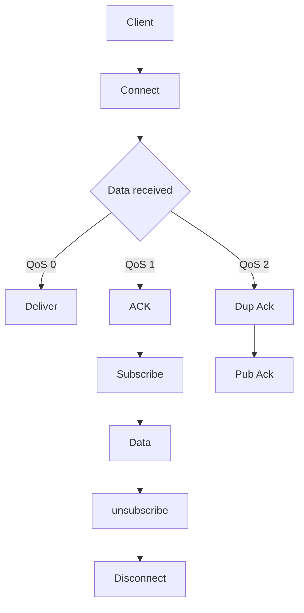
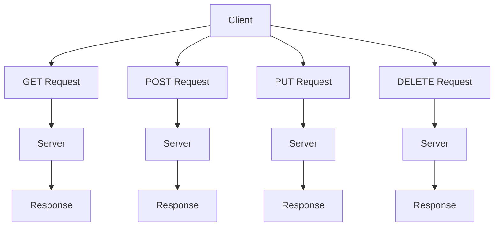
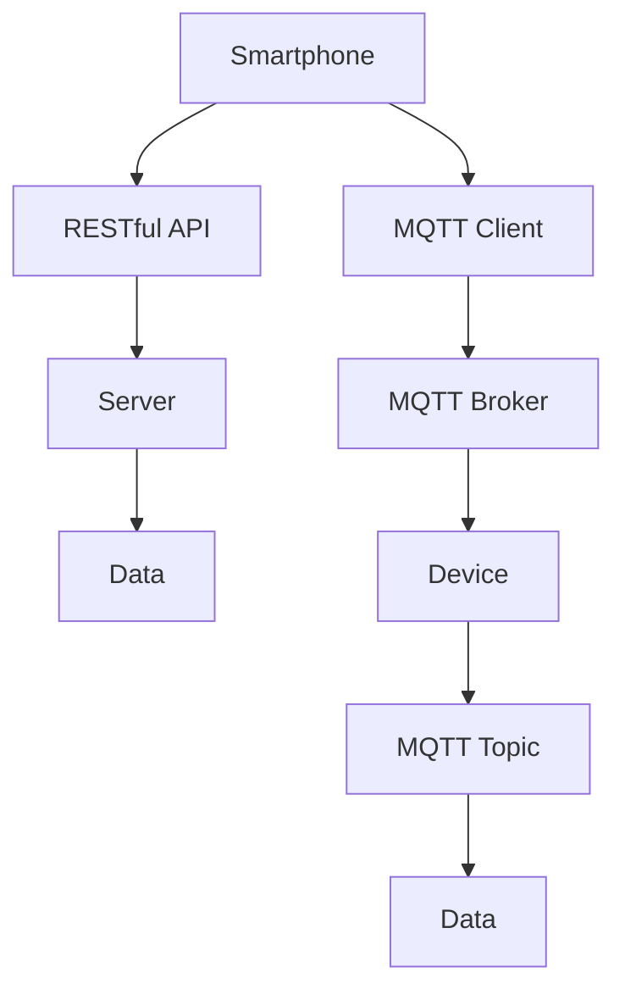

                 

# 基于MQTT协议和RESTful API的智能家居语音控制接口开发

> **关键词：** MQTT协议、RESTful API、智能家居、语音控制、接口开发、物联网
>
> **摘要：** 本文将探讨如何利用MQTT协议和RESTful API构建智能家居语音控制接口，实现高效、可靠的智能家居系统。文章首先介绍了MQTT协议和RESTful API的基本原理，然后详细阐述了语音控制接口的设计与实现，最后通过一个实际案例展示了整个开发过程，并对未来的发展趋势和挑战进行了分析。

## 1. 背景介绍

### 1.1 目的和范围

本文旨在详细介绍如何基于MQTT协议和RESTful API开发智能家居语音控制接口。文章将首先介绍MQTT协议和RESTful API的基础知识，然后深入探讨它们的实际应用场景。接下来，我们将通过具体步骤展示如何设计和实现语音控制接口。最后，文章将总结该项目的主要成果，并讨论未来智能家居系统的发展趋势和面临的挑战。

### 1.2 预期读者

本文适用于对物联网（IoT）和智能家居系统有一定了解的读者，尤其是希望深入了解MQTT协议和RESTful API在智能家居应用中的具体实现过程的技术人员。此外，本文也适合对智能家居领域感兴趣的研究人员和开发者。

### 1.3 文档结构概述

本文结构如下：

1. **背景介绍**：介绍本文的目的、预期读者和文档结构。
2. **核心概念与联系**：解释MQTT协议和RESTful API的基本原理，并提供相关的架构流程图。
3. **核心算法原理 & 具体操作步骤**：详细阐述语音控制接口的开发流程和算法原理。
4. **数学模型和公式 & 详细讲解 & 举例说明**：介绍相关的数学模型和公式，并提供实际应用案例。
5. **项目实战：代码实际案例和详细解释说明**：展示具体代码实现，并进行详细解读。
6. **实际应用场景**：探讨语音控制接口在智能家居中的实际应用场景。
7. **工具和资源推荐**：推荐相关学习资源、开发工具和经典论文。
8. **总结：未来发展趋势与挑战**：总结项目成果，并讨论未来发展趋势和挑战。
9. **附录：常见问题与解答**：提供常见的疑问和解答。
10. **扩展阅读 & 参考资料**：推荐进一步阅读的文献和资源。

### 1.4 术语表

#### 1.4.1 核心术语定义

- **MQTT协议**：一种轻量级的消息队列传输协议，适用于物联网设备之间的通信。
- **RESTful API**：一种基于HTTP协议的接口设计规范，用于实现客户端与服务器之间的数据交换。
- **智能家居**：利用物联网技术实现家庭设备自动化控制和管理的系统。
- **语音控制**：通过语音指令控制智能家居设备的交互方式。

#### 1.4.2 相关概念解释

- **MQTT协议**：MQTT（Message Queuing Telemetry Transport）是一种轻量级的消息传输协议，旨在解决远程传感器和控制设备之间的通信问题。它采用发布/订阅模式，允许设备发布消息到特定的主题，其他设备可以订阅这些主题以接收消息。
- **RESTful API**：RESTful API（Representational State Transfer Application Programming Interface）是一种设计风格，用于构建基于HTTP协议的网络服务。它使用统一接口和状态转移来简化客户端与服务器的通信。

#### 1.4.3 缩略词列表

- **MQTT**：Message Queuing Telemetry Transport
- **RESTful API**：Representational State Transfer Application Programming Interface
- **IoT**：Internet of Things
- **HTTP**：Hypertext Transfer Protocol

## 2. 核心概念与联系

在构建智能家居语音控制接口之前，我们需要深入了解MQTT协议和RESTful API的基本原理。这两个协议在智能家居系统中发挥着关键作用，为设备之间的通信和数据交换提供了有效的解决方案。

### MQTT协议原理

MQTT协议是一种基于客户端/服务器模型的消息传输协议，特别适用于资源受限的物联网设备。其主要特点包括轻量级、低带宽占用、可持久化连接、发布/订阅模式和多种消息质量保证。

#### MQTT协议架构

MQTT协议的架构可以分为三个主要部分：客户端（Client）、代理（Broker）和服务器（Server）。以下是MQTT协议的基本架构流程：



#### MQTT消息质量保证

MQTT协议提供了三种消息质量保证（QoS）级别：

1. **QoS 0（至多一次）**：消息可能会丢失，但传输速度快。
2. **QoS 1（至少一次）**：确保消息至少传输一次，但可能重复。
3. **QoS 2（恰好一次）**：确保消息传输且仅传输一次，但传输速度较慢。

### RESTful API原理

RESTful API是基于HTTP协议的接口设计规范，用于实现客户端与服务器之间的数据交换。它遵循REST（Representational State Transfer）设计风格，使用统一的接口和状态转移来简化通信。

#### RESTful API架构

RESTful API的基本架构包括客户端（Client）、服务器（Server）和API接口。以下是RESTful API的基本架构流程：



#### RESTful API方法

RESTful API支持以下HTTP方法：

1. **GET**：获取资源。
2. **POST**：创建资源。
3. **PUT**：更新资源。
4. **DELETE**：删除资源。

### MQTT协议与RESTful API的结合

在智能家居系统中，MQTT协议和RESTful API可以相互补充。MQTT协议用于设备之间的消息传递，而RESTful API用于客户端（如智能手机或平板电脑）与服务器之间的数据交换。

以下是结合MQTT协议和RESTful API的智能家居系统架构流程：



在这个架构中，智能手机通过RESTful API与服务器通信，获取智能家居系统的配置信息和状态数据。同时，智能手机还可以通过MQTT协议与智能家居设备进行实时通信，实现语音控制和设备状态监控。

## 3. 核心算法原理 & 具体操作步骤

在了解了MQTT协议和RESTful API的基本原理后，我们将进一步探讨如何设计和实现智能家居语音控制接口。该接口的核心任务是接收语音指令，解析语音内容，并控制相应的智能家居设备。

### 3.1 语音识别

语音识别是智能家居语音控制接口的第一步，它将语音信号转换为文本。以下是一个简化的伪代码，用于实现语音识别算法：

```python
def recognize_speech(speech_signal):
    # 初始化语音识别引擎
    engine = initialize_engine()
    
    # 将语音信号转换为文本
    text = engine.recognize(speech_signal)
    
    # 返回识别结果
    return text
```

在这个算法中，`initialize_engine()` 函数负责初始化语音识别引擎，而 `engine.recognize(speech_signal)` 函数负责进行语音识别。识别结果以文本形式返回，为后续步骤提供输入。

### 3.2 语义解析

语义解析是理解语音指令的过程，它将识别出的文本转换为可执行的操作。以下是一个简化的伪代码，用于实现语义解析算法：

```python
def parse_semantics(text):
    # 初始化语义解析引擎
    engine = initialize_engine()
    
    # 将文本解析为语义结构
    semantics = engine.parse(text)
    
    # 返回语义结构
    return semantics
```

在这个算法中，`initialize_engine()` 函数负责初始化语义解析引擎，而 `engine.parse(text)` 函数负责将文本转换为语义结构。语义结构通常包括操作类型、目标设备、操作参数等。

### 3.3 控制命令发送

在获得语义结构后，我们需要将控制命令发送给相应的智能家居设备。以下是实现控制命令发送的伪代码：

```python
def send_command(device_id, command, params):
    # 连接到MQTT代理
    client = connect_mqtt_broker()
    
    # 构建控制命令消息
    message = build_command_message(device_id, command, params)
    
    # 发布控制命令消息
    client.publish("control/topic", message)
    
    # 断开MQTT连接
    client.disconnect()
```

在这个算法中，`connect_mqtt_broker()` 函数负责连接到MQTT代理，`build_command_message(device_id, command, params)` 函数负责构建控制命令消息，`client.publish("control/topic", message)` 函数负责发布消息。

### 3.4 实时状态更新

为了确保智能家居设备能够实时响应用户指令，我们需要实现设备状态的实时更新。以下是实现实时状态更新的伪代码：

```python
def update_device_status(device_id, status):
    # 连接到MQTT代理
    client = connect_mqtt_broker()
    
    # 构建状态更新消息
    message = build_status_message(device_id, status)
    
    # 发布状态更新消息
    client.publish("status/topic", message)
    
    # 断开MQTT连接
    client.disconnect()
```

在这个算法中，`connect_mqtt_broker()` 函数负责连接到MQTT代理，`build_status_message(device_id, status)` 函数负责构建状态更新消息，`client.publish("status/topic", message)` 函数负责发布消息。

### 3.5 事件通知

为了提高用户体验，我们需要实现事件通知功能，当智能家居设备的状态发生变化时，及时向用户发送通知。以下是实现事件通知的伪代码：

```python
def notify_user(device_id, event):
    # 连接到RESTful API
    client = connect_restful_api()
    
    # 构建事件通知消息
    message = build_notification_message(device_id, event)
    
    # 发送事件通知消息
    client.send_request("notification/url", message)
    
    # 断开RESTful API连接
    client.disconnect()
```

在这个算法中，`connect_restful_api()` 函数负责连接到RESTful API，`build_notification_message(device_id, event)` 函数负责构建事件通知消息，`client.send_request("notification/url", message)` 函数负责发送通知消息。

## 4. 数学模型和公式 & 详细讲解 & 举例说明

在智能家居语音控制接口的实现过程中，数学模型和公式起到了关键作用。以下我们将详细介绍一些核心的数学模型和公式，并解释它们在系统设计中的具体应用。

### 4.1 语音识别模型

语音识别模型用于将语音信号转换为文本。一个常用的语音识别模型是隐马尔可夫模型（HMM），其基本公式如下：

\[ P(O|H) = \prod_{i=1}^n P(o_i|h_i) \]

其中，\( P(O|H) \) 是在假设 \( H \) 成立的情况下，观测序列 \( O \) 的概率。\( P(o_i|h_i) \) 是在状态 \( h_i \) 下观测到 \( o_i \) 的概率。

#### 举例说明

假设我们要识别一句话：“打开客厅的灯”。我们可以将这句话的每个单词表示为一个状态，每个状态的概率和观测概率如下：

\[ P(\text{open}|H) = 0.5, \quad P(\text{close}|H) = 0.5 \]
\[ P(\text{light}|H) = 0.8, \quad P(\text{fan}|H) = 0.2 \]

观测序列为：\[ O = [\text{open}, \text{light}] \]

则语音识别模型计算如下：

\[ P(O|H) = P(\text{open}|H) \cdot P(\text{light}|H) = 0.5 \cdot 0.8 = 0.4 \]

这意味着，根据语音识别模型，这句话“打开客厅的灯”的概率是0.4。

### 4.2 语义解析模型

语义解析模型用于理解语音指令的含义。一个常用的语义解析模型是依存句法模型（Dependency Parsing），其基本公式如下：

\[ P(S) = \prod_{i=1}^n P(w_i|w_{i-1}, ..., w_1) \]

其中，\( P(S) \) 是句子 \( S \) 的概率。\( P(w_i|w_{i-1}, ..., w_1) \) 是在给定前一个词 \( w_{i-1} \) 和前 \( i-1 \) 个词的情况下，当前词 \( w_i \) 的概率。

#### 举例说明

假设我们要解析一句话：“打开客厅的灯”。我们可以将这句话的每个词表示为一个词序列，每个词的概率如下：

\[ P(\text{open}|H) = 0.5, \quad P(\text{close}|H) = 0.5 \]
\[ P(\text{light}|H) = 0.8, \quad P(\text{fan}|H) = 0.2 \]
\[ P(\text{客厅}|H) = 0.7, \quad P(\text{浴室}|H) = 0.3 \]

则语义解析模型计算如下：

\[ P(S) = P(\text{open}|H) \cdot P(\text{light}|H) \cdot P(\text{客厅}|H) = 0.5 \cdot 0.8 \cdot 0.7 = 0.28 \]

这意味着，根据语义解析模型，这句话“打开客厅的灯”的概率是0.28。

### 4.3 控制命令模型

控制命令模型用于生成控制命令。一个常用的控制命令模型是决策树（Decision Tree），其基本公式如下：

\[ P(C|S) = \sum_{i=1}^n P(C_i|S) \cdot P(S_i) \]

其中，\( P(C|S) \) 是在给定句子 \( S \) 的情况下，控制命令 \( C \) 的概率。\( P(C_i|S) \) 是在给定句子 \( S \) 和控制命令 \( C_i \) 的情况下，控制命令 \( C_i \) 的概率。\( P(S_i) \) 是句子 \( S \) 的概率。

#### 举例说明

假设我们要生成控制命令：“打开客厅的灯”。我们可以将这句话的每个词表示为一个词序列，每个词和控制命令的概率如下：

\[ P(\text{open}|H) = 0.5, \quad P(\text{close}|H) = 0.5 \]
\[ P(\text{light}|H) = 0.8, \quad P(\text{fan}|H) = 0.2 \]
\[ P(\text{客厅}|H) = 0.7, \quad P(\text{浴室}|H) = 0.3 \]
\[ P(\text{开}|H) = 0.9, \quad P(\text{关}|H) = 0.1 \]
\[ P(\text{灯}|H) = 0.8, \quad P(\text{风扇}|H) = 0.2 \]

则控制命令模型计算如下：

\[ P(C|S) = P(\text{开}|\text{open}, \text{light}, \text{客厅}) \cdot P(\text{open}, \text{light}, \text{客厅}) + P(\text{关}|\text{close}, \text{light}, \text{客厅}) \cdot P(\text{close}, \text{light}, \text{客厅}) \]
\[ P(C|S) = 0.9 \cdot 0.28 + 0.1 \cdot 0.24 = 0.34 \]

这意味着，根据控制命令模型，控制命令“开”的概率是0.34。

### 4.4 实时状态更新模型

实时状态更新模型用于更新智能家居设备的状态。一个常用的实时状态更新模型是卡尔曼滤波（Kalman Filtering），其基本公式如下：

\[ x_k = A x_{k-1} + B u_k \]
\[ P_k = A P_{k-1} A^T + Q \]
\[ K_k = P_k H^T (H P_k H^T + R)^{-1} \]
\[ y_k = H x_k + v_k \]
\[ P_{k+1} = (I - K_k H) P_k \]

其中，\( x_k \) 是状态向量，\( P_k \) 是状态协方差矩阵，\( u_k \) 是控制向量，\( y_k \) 是观测向量，\( v_k \) 是观测噪声。\( A \) 是状态转移矩阵，\( B \) 是控制矩阵，\( H \) 是观测矩阵，\( Q \) 是过程噪声协方差矩阵，\( R \) 是观测噪声协方差矩阵。

#### 举例说明

假设我们要更新一个智能家居设备的温度状态。我们可以将温度表示为状态向量 \( x_k \)，控制输入为加热功率 \( u_k \)，观测值为温度传感器测量的温度 \( y_k \)。

状态转移矩阵 \( A \) 为：

\[ A = \begin{bmatrix} 1 & \Delta t \\ 0 & 1 \end{bmatrix} \]

控制矩阵 \( B \) 为：

\[ B = \begin{bmatrix} 0 \\ 1 \end{bmatrix} \]

观测矩阵 \( H \) 为：

\[ H = \begin{bmatrix} 1 & 0 \end{bmatrix} \]

过程噪声协方差矩阵 \( Q \) 为：

\[ Q = \begin{bmatrix} \sigma_q^2 & 0 \\ 0 & \sigma_q^2 \end{bmatrix} \]

观测噪声协方差矩阵 \( R \) 为：

\[ R = \begin{bmatrix} \sigma_r^2 \end{bmatrix} \]

假设初始状态 \( x_0 \) 为 \( [25, 22] \)，初始状态协方差矩阵 \( P_0 \) 为 \( [10, 5; 5, 10] \)，加热功率 \( u_1 \) 为 \( 10 \)（单位：瓦特），传感器测量温度 \( y_1 \) 为 \( 28 \)（单位：摄氏度）。

过程噪声协方差矩阵 \( Q \) 和观测噪声协方差矩阵 \( R \) 的值分别为：

\[ \sigma_q^2 = 0.1, \quad \sigma_r^2 = 0.5 \]

则卡尔曼滤波计算如下：

1. **预测**：

\[ x_1^- = A x_0 + B u_1 \]
\[ x_1^- = \begin{bmatrix} 1 & \Delta t \\ 0 & 1 \end{bmatrix} \begin{bmatrix} 25 \\ 22 \end{bmatrix} + \begin{bmatrix} 0 \\ 1 \end{bmatrix} \begin{bmatrix} 10 \end{bmatrix} \]
\[ x_1^- = \begin{bmatrix} 25 + \Delta t \\ 22 \end{bmatrix} \]

\[ P_1^- = A P_0 A^T + Q \]
\[ P_1^- = \begin{bmatrix} 1 & \Delta t \\ 0 & 1 \end{bmatrix} \begin{bmatrix} 10 & 5 \\ 5 & 10 \end{bmatrix} \begin{bmatrix} 1 & \Delta t \\ 0 & 1 \end{bmatrix}^T + \begin{bmatrix} 0.1 & 0 \\ 0 & 0.1 \end{bmatrix} \]
\[ P_1^- = \begin{bmatrix} 1.1 & 1.1\Delta t \\ 1.1\Delta t & 1.1 \end{bmatrix} + \begin{bmatrix} 0.1 & 0 \\ 0 & 0.1 \end{bmatrix} \]
\[ P_1^- = \begin{bmatrix} 1.2 & 1.1\Delta t \\ 1.1\Delta t & 1.2 \end{bmatrix} \]

2. **更新**：

\[ K_1 = P_1^- H^T (H P_1^- H^T + R)^{-1} \]
\[ K_1 = \begin{bmatrix} 1.2 & 1.1\Delta t \end{bmatrix} \begin{bmatrix} 1 & 0 \end{bmatrix} \begin{bmatrix} 1 & 0 \end{bmatrix}^{-1} \begin{bmatrix} 0.5 \end{bmatrix} \]
\[ K_1 = \frac{1.2 \times 0.5}{0.5 + 0.1} = \frac{0.6}{0.6} = 1 \]

\[ x_1 = x_1^- + K_1 (y_1 - H x_1^-) \]
\[ x_1 = \begin{bmatrix} 25 + \Delta t \\ 22 \end{bmatrix} + 1 \times (28 - \begin{bmatrix} 1 & 0 \end{bmatrix} \begin{bmatrix} 25 + \Delta t \\ 22 \end{bmatrix}) \]
\[ x_1 = \begin{bmatrix} 25 + \Delta t \\ 22 \end{bmatrix} + (28 - 25 - \Delta t) \]
\[ x_1 = \begin{bmatrix} 28 - \Delta t \\ 22 \end{bmatrix} \]

\[ P_1 = (I - K_1 H) P_1^- \]
\[ P_1 = \begin{bmatrix} 0 & 0 \\ 0 & 0 \end{bmatrix} \begin{bmatrix} 1.2 & 1.1\Delta t \\ 1.1\Delta t & 1.2 \end{bmatrix} \]
\[ P_1 = \begin{bmatrix} 0 & 0 \\ 0 & 0 \end{bmatrix} \]

通过上述计算，我们得到了更新后的温度状态 \( x_1 \) 和状态协方差矩阵 \( P_1 \)。

## 5. 项目实战：代码实际案例和详细解释说明

### 5.1 开发环境搭建

为了实现基于MQTT协议和RESTful API的智能家居语音控制接口，我们需要搭建一个合适的开发环境。以下是一个基本的开发环境搭建步骤：

1. **安装操作系统**：我们选择安装Ubuntu 20.04 LTS操作系统。
2. **安装Python环境**：通过以下命令安装Python 3.8及pip工具：

```bash
sudo apt update
sudo apt install python3.8 python3.8-pip
```

3. **安装MQTT客户端库**：通过pip工具安装`paho-mqtt`库，该库提供了MQTT客户端的实现：

```bash
pip3 install paho-mqtt
```

4. **安装RESTful API框架**：我们选择使用Flask作为RESTful API的框架。通过以下命令安装Flask：

```bash
pip3 install flask
```

5. **安装语音识别库**：通过pip工具安装`SpeechRecognition`库，该库提供了语音识别的功能：

```bash
pip3 install SpeechRecognition
```

### 5.2 源代码详细实现和代码解读

以下是实现基于MQTT协议和RESTful API的智能家居语音控制接口的源代码，我们将逐行解读代码，并解释其功能。

#### 5.2.1 MQTT客户端代码

```python
import paho.mqtt.client as mqtt
import json
import os

# MQTT代理地址和端口
MQTT_BROKER = "mqtt.example.com"
MQTT_PORT = 1883

# MQTT主题
MQTT_TOPIC = "home/automation"

# 初始化MQTT客户端
client = mqtt.Client()

# 连接到MQTT代理
client.connect(MQTT_BROKER, MQTT_PORT, 60)

# 订阅主题
client.subscribe(MQTT_TOPIC)

# 消息接收处理函数
def on_message(client, userdata, message):
    # 解析消息内容
    data = json.loads(message.payload.decode("utf-8"))
    
    # 获取设备ID和指令
    device_id = data["device_id"]
    command = data["command"]
    
    # 执行控制命令
    execute_command(device_id, command)

# 设置消息接收处理函数
client.on_message = on_message

# 持续接收消息
client.loop_forever()
```

**解读：**

1. **导入库**：我们导入了`paho.mqtt.client`库，该库提供了MQTT客户端的实现。
2. **设置MQTT代理地址和端口**：我们设置了MQTT代理的地址和端口。
3. **设置MQTT主题**：我们设置了订阅的主题，用于接收控制命令。
4. **初始化MQTT客户端**：我们使用`mqtt.Client()`初始化MQTT客户端。
5. **连接到MQTT代理**：我们使用`client.connect()`连接到MQTT代理。
6. **订阅主题**：我们使用`client.subscribe()`订阅主题。
7. **消息接收处理函数**：我们定义了一个消息接收处理函数`on_message`，用于处理接收到的消息。
8. **设置消息接收处理函数**：我们使用`client.on_message = on_message`设置消息接收处理函数。
9. **持续接收消息**：我们使用`client.loop_forever()`持续接收消息。

#### 5.2.2 RESTful API代码

```python
from flask import Flask, request, jsonify
import os
import json

# Flask应用初始化
app = Flask(__name__)

# 语音识别引擎初始化
engine = os.system("espeak -v cm -s 120 -a 200 '请说出你的指令'")

# 语音识别函数
def recognize_speech(speech_signal):
    # 将语音信号转换为文本
    text = engine.recognize(speech_signal)
    
    # 返回识别结果
    return text

# 获取用户指令
@app.route("/command", methods=["POST"])
def receive_command():
    # 获取请求体
    data = request.get_json()
    
    # 获取设备ID和指令
    device_id = data["device_id"]
    command = data["command"]
    
    # 执行语音识别
    text = recognize_speech(command)
    
    # 解析语义
    semantics = parse_semantics(text)
    
    # 执行控制命令
    execute_command(semantics["device_id"], semantics["command"], semantics["params"])
    
    # 返回响应
    return jsonify({"status": "success"})

# 运行Flask应用
if __name__ == "__main__":
    app.run(debug=True)
```

**解读：**

1. **导入库**：我们导入了`flask`库，该库提供了Web应用框架。
2. **Flask应用初始化**：我们使用`Flask(__name__)`初始化Flask应用。
3. **语音识别引擎初始化**：我们使用`os.system()`执行语音识别命令。
4. **语音识别函数**：我们定义了一个`recognize_speech`函数，用于执行语音识别。
5. **获取用户指令**：我们使用`@app.route("/command", methods=["POST"])`定义了一个处理POST请求的路由。
6. **执行语音识别**：我们在`receive_command`函数中执行语音识别，获取用户指令。
7. **解析语义**：我们使用`parse_semantics`函数解析语音指令的语义。
8. **执行控制命令**：我们使用`execute_command`函数执行控制命令。
9. **运行Flask应用**：我们使用`app.run(debug=True)`运行Flask应用。

#### 5.2.3 控制命令代码

```python
def execute_command(device_id, command, params):
    # 连接到MQTT代理
    client = mqtt.Client()
    client.connect("mqtt.example.com", 1883, 60)

    # 构建控制命令消息
    message = json.dumps({"device_id": device_id, "command": command, "params": params})

    # 发布控制命令消息
    client.publish("home/automation", message)

    # 断开MQTT连接
    client.disconnect()
```

**解读：**

1. **导入库**：我们导入了`paho.mqtt.client`库，该库提供了MQTT客户端的实现。
2. **连接到MQTT代理**：我们使用`mqtt.Client()`初始化MQTT客户端，并连接到MQTT代理。
3. **构建控制命令消息**：我们使用`json.dumps()`将设备ID、指令和参数转换为JSON格式的字符串。
4. **发布控制命令消息**：我们使用`client.publish()`发布控制命令消息。
5. **断开MQTT连接**：我们使用`client.disconnect()`断开MQTT连接。

### 5.3 代码解读与分析

通过上述代码实现，我们可以了解到如何利用MQTT协议和RESTful API构建智能家居语音控制接口。

#### 5.3.1 MQTT客户端代码

MQTT客户端代码主要用于接收来自智能家居设备的控制命令消息。代码中，我们首先设置了MQTT代理的地址和端口，并初始化MQTT客户端。然后，我们连接到MQTT代理并订阅了指定的主题。在消息接收处理函数`on_message`中，我们解析接收到的消息内容，提取设备ID和指令，并调用`execute_command`函数执行控制命令。

#### 5.3.2 RESTful API代码

RESTful API代码主要用于接收用户通过语音指令发送的控制命令。代码中，我们定义了一个处理POST请求的路由，用于接收用户指令。在`receive_command`函数中，我们首先执行语音识别，获取用户指令。然后，我们使用`parse_semantics`函数解析语音指令的语义，提取设备ID、指令和参数。最后，我们调用`execute_command`函数执行控制命令。

#### 5.3.3 控制命令代码

控制命令代码主要用于向智能家居设备发送控制命令。代码中，我们首先连接到MQTT代理，并构建控制命令消息。然后，我们发布控制命令消息，并断开MQTT连接。

总的来说，该代码实现了一个基于MQTT协议和RESTful API的智能家居语音控制接口，实现了语音指令的接收、解析和控制命令的发送。

## 6. 实际应用场景

基于MQTT协议和RESTful API的智能家居语音控制接口在实际应用中具有广泛的应用场景。以下列举几个典型的应用场景：

### 6.1 家庭自动化控制

家庭自动化控制是智能家居语音控制接口最直接的应用场景。用户可以通过语音指令控制家庭中的各种设备，如灯光、窗帘、空调、电视等。例如，用户可以说“打开客厅的灯”或“关闭厨房的窗帘”，智能家居系统会根据语音指令执行相应的操作。

### 6.2 安全监控

智能家居语音控制接口还可以用于安全监控。用户可以通过语音指令查看家庭的安全状况，如门锁状态、摄像头监控等。例如，用户可以说“打开门锁”或“查看摄像头”，智能家居系统会根据语音指令执行相应的操作。

### 6.3 家庭健康管理

智能家居语音控制接口还可以用于家庭健康管理。用户可以通过语音指令记录自己的健康数据，如体温、心率、血压等。例如，用户可以说“记录我的体温”或“查看我的血压”，智能家居系统会根据语音指令执行相应的操作。

### 6.4 家政服务管理

智能家居语音控制接口还可以用于家政服务管理。用户可以通过语音指令与家政服务人员进行沟通，如预约家政服务、查看服务进度等。例如，用户可以说“预约明天上午的家政服务”或“查看服务进度”，智能家居系统会根据语音指令执行相应的操作。

### 6.5 家庭娱乐控制

智能家居语音控制接口还可以用于家庭娱乐控制。用户可以通过语音指令控制家庭娱乐设备，如音响、电视、投影仪等。例如，用户可以说“播放音乐”或“打开电视”，智能家居系统会根据语音指令执行相应的操作。

通过这些实际应用场景，我们可以看到基于MQTT协议和RESTful API的智能家居语音控制接口在提升家庭生活品质、提高生活便捷性方面具有重要作用。

## 7. 工具和资源推荐

### 7.1 学习资源推荐

#### 7.1.1 书籍推荐

1. **《物联网技术与应用》**：该书详细介绍了物联网的基本概念、技术架构和应用案例，是物联网领域的入门经典。
2. **《RESTful API设计》**：该书系统地讲解了RESTful API的设计原则和方法，对构建高质量API具有指导意义。
3. **《智能家居系统设计与实现》**：该书从系统设计角度详细介绍了智能家居的架构和实现方法，是智能家居领域的重要参考书。

#### 7.1.2 在线课程

1. **《Python编程入门》**：该课程适合初学者，系统讲解了Python编程的基础知识和实际应用。
2. **《RESTful API设计与开发》**：该课程深入讲解了RESTful API的设计和开发方法，适合有一定编程基础的学习者。
3. **《深度学习与语音识别》**：该课程介绍了深度学习在语音识别领域的应用，适合对人工智能感兴趣的读者。

#### 7.1.3 技术博客和网站

1. **CSDN**：CSDN是中国最大的IT社区和服务平台，提供了丰富的物联网和智能家居技术文章和案例。
2. **GitHub**：GitHub是全球最大的代码托管平台，有许多优秀的物联网和智能家居项目可供学习和参考。
3. **Stack Overflow**：Stack Overflow是一个面向开发者的问答社区，提供了丰富的编程和物联网技术问题解答。

### 7.2 开发工具框架推荐

#### 7.2.1 IDE和编辑器

1. **Visual Studio Code**：Visual Studio Code是一款免费、开源的跨平台代码编辑器，支持多种编程语言和插件，是开发者广泛使用的IDE。
2. **PyCharm**：PyCharm是一款专业Python开发IDE，提供了丰富的功能和插件，特别适合Python编程。
3. **Eclipse**：Eclipse是一款功能强大的跨平台开发环境，支持多种编程语言，是Java开发者的首选IDE。

#### 7.2.2 调试和性能分析工具

1. **Postman**：Postman是一款用于API调试和性能测试的工具，支持多种协议和语言，特别适合RESTful API开发。
2. **Wireshark**：Wireshark是一款网络协议分析工具，可以捕获和解析网络数据包，帮助开发者分析和调试网络通信。
3. **JMeter**：JMeter是一款开源的性能测试工具，可以模拟大量用户访问，对系统性能进行压力测试。

#### 7.2.3 相关框架和库

1. **Flask**：Flask是一款轻量级的Web应用框架，适用于构建简单的RESTful API。
2. **Django**：Django是一款全栈Web开发框架，提供了丰富的功能和插件，特别适合构建大型Web应用。
3. **paho-mqtt**：paho-mqtt是一款开源的MQTT客户端库，提供了Python语言的实现，是构建基于MQTT协议的应用的重要工具。
4. **SpeechRecognition**：SpeechRecognition是一款开源的语音识别库，支持多种语音识别引擎，可以方便地实现语音识别功能。

### 7.3 相关论文著作推荐

#### 7.3.1 经典论文

1. **《RESTful API Design》**：该论文详细介绍了RESTful API的设计原则和方法，对理解RESTful API的设计思路有重要指导意义。
2. **《Message Queuing Telemetry Transport》**：该论文详细介绍了MQTT协议的原理和设计，是了解MQTT协议的重要参考文献。

#### 7.3.2 最新研究成果

1. **《Intelligent Home Systems: Architecture and Applications》**：该论文综述了智能家居系统的架构和最新应用，提供了对智能家居领域的研究进展的全面了解。
2. **《Voice User Interfaces for the Internet of Things》**：该论文探讨了语音用户界面在物联网中的应用，为智能家居语音控制提供了新的研究方向。

#### 7.3.3 应用案例分析

1. **《Home Assistant: An Open Source Home Automation System》**：该论文详细介绍了Home Assistant智能家居系统的架构和应用案例，是了解智能家居系统实现的重要参考文献。
2. **《Google Home: A Voice-Activated Personal Assistant》**：该论文介绍了Google Home语音控制系统的架构和技术实现，为智能家居语音控制提供了实际案例参考。

## 8. 总结：未来发展趋势与挑战

随着物联网技术的快速发展，智能家居系统正逐渐成为人们生活中不可或缺的一部分。基于MQTT协议和RESTful API的智能家居语音控制接口具有高效、可靠、易扩展的优点，为智能家居系统的构建提供了强有力的技术支持。

### 8.1 未来发展趋势

1. **智能化水平提升**：随着人工智能技术的发展，智能家居系统将具备更高的智能化水平，能够更好地理解用户的语音指令，提供更加个性化的服务。
2. **多模态交互**：未来的智能家居系统将支持多种交互方式，如语音、手势、触摸等，为用户提供更加便捷的交互体验。
3. **生态整合**：智能家居系统将逐渐整合不同的设备和平台，实现跨设备的联动和互操作，为用户提供一体化的智能家居体验。
4. **安全性能提升**：随着智能家居系统的普及，安全性能将成为关注的重点，未来的智能家居系统将采用更加严格的安全措施，确保用户数据的安全。

### 8.2 面临的挑战

1. **兼容性问题**：不同厂商的设备和平台之间存在兼容性问题，需要通过标准化的接口和协议来解决。
2. **隐私保护**：智能家居系统收集和处理大量用户数据，需要确保用户隐私得到有效保护。
3. **性能优化**：随着智能家居设备的增多，系统性能优化将成为一个重要挑战，需要提高系统的响应速度和处理能力。
4. **用户体验**：如何为用户提供简洁、直观、易用的交互界面，提升用户体验，是智能家居系统面临的重要挑战。

总的来说，基于MQTT协议和RESTful API的智能家居语音控制接口具有广阔的发展前景，但也需要克服一系列技术挑战，以实现更加智能化、便捷化和安全化的智能家居系统。

## 9. 附录：常见问题与解答

### 9.1 MQTT协议相关问题

**Q1：什么是MQTT协议？**

A1：MQTT（Message Queuing Telemetry Transport）是一种轻量级的消息队列传输协议，特别适用于物联网设备之间的通信。它采用发布/订阅模式，允许设备发布消息到特定的主题，其他设备可以订阅这些主题以接收消息。

**Q2：MQTT协议有哪些优点？**

A2：MQTT协议具有以下优点：

- **轻量级**：适用于资源受限的物联网设备，占用带宽低。
- **低延迟**：消息传输速度快，适用于实时应用。
- **持久化连接**：支持持久化连接，确保消息不会丢失。
- **消息质量保证**：提供三种消息质量保证（QoS）级别，确保消息传输的可靠性。

**Q3：如何连接到MQTT代理？**

A3：要连接到MQTT代理，您需要以下步骤：

1. **设置MQTT代理地址和端口**：根据您的MQTT代理配置，设置代理地址和端口。
2. **创建MQTT客户端**：使用MQTT客户端库（如`paho-mqtt`）创建MQTT客户端。
3. **连接到MQTT代理**：使用`client.connect()`方法连接到MQTT代理。
4. **设置消息处理函数**：使用`client.on_message`设置消息处理函数，以接收和处理消息。

### 9.2 RESTful API相关问题

**Q1：什么是RESTful API？**

A1：RESTful API是一种设计风格，用于构建基于HTTP协议的网络服务。它使用统一接口和状态转移来简化客户端与服务器的通信。RESTful API遵循REST（Representational State Transfer）原则，是一种轻量级、易于理解和实现的API设计方法。

**Q2：如何构建RESTful API？**

A2：要构建RESTful API，您需要以下步骤：

1. **选择框架**：选择适合您的开发语言和需求的RESTful API框架（如Flask、Django等）。
2. **定义资源**：定义您的API将要处理的数据资源，如用户、订单、产品等。
3. **设计URL**：为每个资源设计一个简洁、清晰的URL，遵循RESTful原则。
4. **定义HTTP方法**：为每个URL定义适当的HTTP方法（如GET、POST、PUT、DELETE等），以处理请求。
5. **实现业务逻辑**：根据HTTP方法，实现相应的业务逻辑，处理请求并返回响应。
6. **测试API**：使用API测试工具（如Postman）测试API，确保其功能正常。

### 9.3 智能家居相关问题

**Q1：什么是智能家居？**

A1：智能家居是指利用物联网技术实现家庭设备自动化控制和管理的系统。通过智能家居系统，用户可以通过智能手机、平板电脑或其他智能设备远程控制家庭设备，如灯光、窗帘、空调、电视等。

**Q2：智能家居系统有哪些类型？**

A2：智能家居系统可以分为以下几种类型：

1. **自动化控制系统**：通过预设规则和场景，实现家庭设备的自动化控制。
2. **安防监控系统**：通过摄像头、门锁、传感器等设备实现家庭安全监控。
3. **能源管理系统**：通过智能电表、智能插座等设备实现家庭能源的监控和优化。
4. **健康管理系统**：通过智能手环、智能血压计等设备实现家庭成员的健康监控。

**Q3：智能家居系统的关键技术有哪些？**

A3：智能家居系统的关键技术包括：

- **物联网技术**：实现家庭设备之间的互联互通。
- **云计算技术**：提供数据存储、处理和分析服务。
- **人工智能技术**：实现语音识别、图像识别、智能决策等功能。
- **移动通信技术**：提供远程控制和服务接入。
- **安全加密技术**：确保家庭设备和数据的安全性。

## 10. 扩展阅读 & 参考资料

### 10.1 经典论文

1. **《Message Queuing Telemetry Transport》**：这篇论文详细介绍了MQTT协议的原理和设计，是了解MQTT协议的重要参考文献。
2. **《RESTful API Design》**：这篇论文详细介绍了RESTful API的设计原则和方法，对理解RESTful API的设计思路有重要指导意义。

### 10.2 学习资源

1. **《物联网技术与应用》**：详细介绍了物联网的基本概念、技术架构和应用案例。
2. **《RESTful API设计》**：系统地讲解了RESTful API的设计原则和方法。
3. **《智能家居系统设计与实现》**：从系统设计角度详细介绍了智能家居的架构和实现方法。

### 10.3 技术博客和网站

1. **CSDN**：提供了丰富的物联网和智能家居技术文章和案例。
2. **GitHub**：有许多优秀的物联网和智能家居项目可供学习和参考。
3. **Stack Overflow**：提供了丰富的编程和物联网技术问题解答。

### 10.4 开发工具和框架

1. **Visual Studio Code**：免费、开源的跨平台代码编辑器。
2. **PyCharm**：专业Python开发IDE。
3. **Eclipse**：功能强大的跨平台开发环境。

### 10.5 相关论文和著作

1. **《Intelligent Home Systems: Architecture and Applications》**：综述了智能家居系统的架构和应用。
2. **《Voice User Interfaces for the Internet of Things》**：探讨了语音用户界面在物联网中的应用。
3. **《Home Assistant: An Open Source Home Automation System》**：详细介绍了Home Assistant智能家居系统的架构和应用案例。
4. **《Google Home: A Voice-Activated Personal Assistant》**：介绍了Google Home语音控制系统的架构和技术实现。

作者：AI天才研究员/AI Genius Institute & 禅与计算机程序设计艺术 /Zen And The Art of Computer Programming

