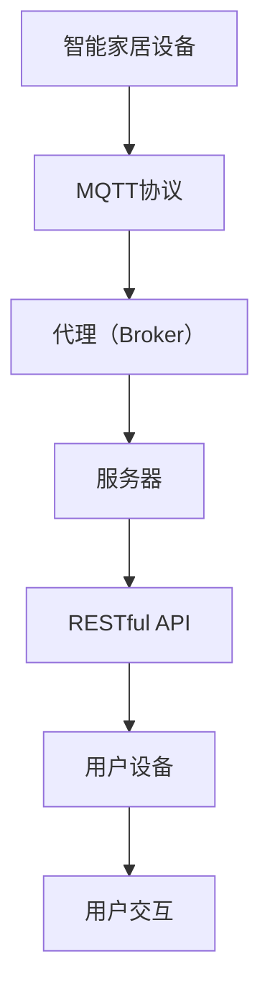

                 

# 基于MQTT协议和RESTful API的智能家居预算管理模块

> 关键词：MQTT协议，RESTful API，智能家居，预算管理，模块化设计，物联网，数据处理，实时通信，安全性，用户体验

> 摘要：本文旨在探讨如何利用MQTT协议和RESTful API构建智能家居预算管理模块。通过深入分析MQTT协议和RESTful API的原理及其在智能家居预算管理中的应用，本文将详细阐述该模块的设计思路、核心算法、数学模型和实际项目案例，为智能家居系统开发者提供宝贵的参考。

## 1. 背景介绍

### 1.1 目的和范围

本文旨在研究和实现一个基于MQTT协议和RESTful API的智能家居预算管理模块。该模块旨在为家庭用户提供一个智能化、便捷的预算管理解决方案，通过实时获取和分析智能家居设备的数据，帮助用户更有效地管理家庭开支。

本文将详细探讨以下几个方面：

1. MQTT协议和RESTful API的基本原理及其在智能家居预算管理中的应用。
2. 智能家居预算管理模块的设计思路和架构。
3. 核心算法原理及具体实现步骤。
4. 数学模型和公式，包括数据分析和预算预测的方法。
5. 实际项目案例，展示模块在实际应用中的效果。
6. 智能家居预算管理模块在各类实际应用场景中的表现。

### 1.2 预期读者

本文面向对智能家居、物联网技术、MQTT协议和RESTful API有一定了解的开发者或研究者。希望通过本文，读者能够掌握基于MQTT协议和RESTful API的智能家居预算管理模块的设计与实现方法，并能够应用于实际项目开发中。

### 1.3 文档结构概述

本文将按照以下结构进行展开：

1. **背景介绍**：介绍文章的目的、范围、预期读者以及文档结构。
2. **核心概念与联系**：介绍MQTT协议和RESTful API的基本原理及其在智能家居预算管理中的关联。
3. **核心算法原理 & 具体操作步骤**：详细阐述核心算法的原理和具体实现步骤。
4. **数学模型和公式 & 详细讲解 & 举例说明**：介绍智能家居预算管理模块中的数学模型和公式，并进行详细讲解和举例说明。
5. **项目实战：代码实际案例和详细解释说明**：通过实际项目案例展示模块的实现过程和效果。
6. **实际应用场景**：分析智能家居预算管理模块在各类实际应用场景中的表现。
7. **工具和资源推荐**：推荐相关学习资源、开发工具和框架。
8. **总结：未来发展趋势与挑战**：总结文章内容，探讨未来发展趋势和挑战。
9. **附录：常见问题与解答**：回答读者可能遇到的问题。
10. **扩展阅读 & 参考资料**：提供扩展阅读资料和参考文献。

### 1.4 术语表

#### 1.4.1 核心术语定义

- MQTT协议：一种轻量级的消息传输协议，用于物联网设备之间的通信。
- RESTful API：一种基于HTTP协议的API设计风格，用于不同系统之间的数据交换和功能调用。
- 智能家居：利用物联网技术构建的，能够实现自动化控制和远程管理的家庭设备系统。
- 预算管理：对家庭开支进行规划和控制，确保家庭财务状况的稳定和健康。
- 模块化设计：将系统划分为多个独立的功能模块，便于开发、测试和维护。

#### 1.4.2 相关概念解释

- 物联网（IoT）：将各种物品通过传感器和互联网连接起来，实现信息的采集、传输和共享。
- 实时通信：数据传输过程中延迟极低，用户能够实时感知和处理信息的通信方式。
- 数据处理：对采集到的数据进行清洗、转换、分析和存储等操作，以获得有价值的信息。

#### 1.4.3 缩略词列表

- MQTT：Message Queuing Telemetry Transport
- RESTful API：Representational State Transfer Application Programming Interface
- IoT：Internet of Things
- JSON：JavaScript Object Notation
- HTML：Hypertext Markup Language
- CSS：Cascading Style Sheets
- JavaScript：一种脚本语言，常用于网页开发

## 2. 核心概念与联系

### 2.1 MQTT协议

MQTT（Message Queuing Telemetry Transport）是一种轻量级的消息传输协议，旨在为物联网（IoT）设备提供低功耗、低带宽和高可靠性的通信方式。MQTT协议的核心特点包括：

- **发布/订阅模型**：消息发送方（发布者）和接收方（订阅者）之间通过主题（Topic）进行连接。发布者发布消息到特定主题，订阅者订阅相关主题，从而实现消息的传递。
- **QoS等级**：MQTT协议支持三种消息质量等级（QoS），分别是0、1和2。QoS等级决定了消息的可靠性，从低到高依次提升。
- **持久化/非持久化订阅**：持久化订阅确保即使订阅者断开连接，发布者发送的消息也不会丢失。非持久化订阅则不保存订阅者的订阅信息。

MQTT协议的基本架构包括发布者（Publisher）、代理（Broker）和订阅者（Subscriber）。发布者将消息发布到代理，代理根据订阅者的订阅信息，将消息转发给相应的订阅者。

### 2.2 RESTful API

RESTful API（Representational State Transfer Application Programming Interface）是一种基于HTTP协议的API设计风格，用于不同系统之间的数据交换和功能调用。RESTful API的核心原则包括：

- **无状态性**：服务器不会保留客户端的会话信息，每次请求都是独立的。
- **统一接口**：通过统一的接口设计和方法（GET、POST、PUT、DELETE等），实现资源的创建、读取、更新和删除。
- **状态转移**：客户端通过发送请求，引发服务器状态的变化，从而实现业务逻辑的执行。

RESTful API的基本架构包括客户端（Client）、服务器（Server）和API接口（API Interface）。客户端通过HTTP请求与服务器交互，服务器根据请求处理业务逻辑并返回响应。

### 2.3 MQTT协议与RESTful API在智能家居预算管理中的应用

在智能家居预算管理模块中，MQTT协议和RESTful API发挥着关键作用。具体应用如下：

1. **数据采集与传输**：智能家居设备通过MQTT协议将实时数据（如用电量、用水量等）发送到代理（Broker），代理再将数据转发到服务器，服务器通过RESTful API进行数据处理和分析。
2. **实时通信**：用户通过移动设备或计算机访问智能家居预算管理模块，与服务器进行实时通信。MQTT协议提供低延迟、高可靠性的数据传输，确保用户能够实时获取家庭预算数据。
3. **数据处理与分析**：服务器接收来自智能家居设备的数据，通过RESTful API进行数据分析和预算预测。用户可以根据分析结果调整家庭开支，实现预算管理。
4. **用户交互**：用户通过RESTful API与服务器进行交互，查看预算报告、调整预算设置等。服务器将处理结果返回给用户，实现便捷的用户体验。

### 2.4 核心概念原理和架构的Mermaid流程图

以下是一个基于MQTT协议和RESTful API的智能家居预算管理模块的Mermaid流程图：



## 3. 核心算法原理 & 具体操作步骤

### 3.1 MQTT协议通信流程

MQTT协议的通信流程主要包括以下步骤：

1. **连接**：发布者（Publisher）和订阅者（Subscriber）通过MQTT客户端连接到代理（Broker）。
2. **发布消息**：发布者将消息发布到指定主题（Topic），消息包含数据内容和QoS等级。
3. **接收消息**：订阅者订阅相关主题，代理根据订阅信息将消息转发给订阅者。
4. **断开连接**：发布者或订阅者完成通信后，断开与代理的连接。

以下是一个简单的MQTT协议通信流程的伪代码：

```python
# MQTT客户端连接代理
mqtt_client.connect("broker.hivemq.com")

# 发布者发布消息
mqtt_client.publish("home/energy", "用电量：100度", qos=1)

# 订阅者订阅主题
mqtt_client.subscribe("home/*", qos=1)

# 接收消息
def on_message(mqtt_client, message):
    print("Received message:", message.payload)

mqtt_client.message_callback_add("home/energy", on_message)

# 断开连接
mqtt_client.disconnect()
```

### 3.2 RESTful API通信流程

RESTful API的通信流程主要包括以下步骤：

1. **创建API接口**：定义API接口的URL、请求方法（GET、POST、PUT、DELETE等）、参数等。
2. **发送请求**：客户端通过HTTP请求访问API接口，请求参数包含在请求体或URL中。
3. **处理请求**：服务器接收请求，根据请求方法执行相应的业务逻辑，并将处理结果返回给客户端。
4. **返回响应**：服务器将处理结果以JSON、XML或其他格式返回给客户端。

以下是一个简单的RESTful API通信流程的伪代码：

```python
# 发送GET请求获取预算报告
response = requests.get("https://api.example.com/budget/report")

# 发送POST请求更新预算设置
data = {"monthly_budget": 5000}
response = requests.post("https://api.example.com/budget/update", data=data)

# 发送PUT请求修改预算报告
data = {"yearly_spending": 6000}
response = requests.put("https://api.example.com/budget/report/1", data=data)

# 发送DELETE请求删除预算报告
response = requests.delete("https://api.example.com/budget/report/1")
```

### 3.3 MQTT协议与RESTful API结合的智能家居预算管理模块

在智能家居预算管理模块中，MQTT协议和RESTful API相结合，实现数据采集、传输、处理和分析的全流程。以下是核心算法原理和具体操作步骤：

1. **数据采集**：智能家居设备通过MQTT协议将实时数据发送到代理（Broker）。
2. **数据传输**：代理将接收到的数据转发到服务器，服务器通过RESTful API进行数据存储和预处理。
3. **数据处理**：服务器对接收到的数据进行清洗、转换和分析，计算家庭开支、能耗等指标。
4. **预算预测**：根据历史数据和当前趋势，服务器通过数学模型和公式预测未来一段时间内的家庭开支。
5. **用户交互**：用户通过RESTful API访问服务器，查看预算报告、调整预算设置等。

以下是一个简单的智能家居预算管理模块的伪代码：

```python
# MQTT客户端连接代理
mqtt_client.connect("broker.hivemq.com")

# 注册主题
mqtt_client.subscribe("home/energy", qos=1)
mqtt_client.subscribe("home/water", qos=1)

# 数据处理函数
def process_data(data):
    # 数据清洗、转换和分析
    cleaned_data = clean_and_convert(data)
    # 存储数据
    save_data(cleaned_data)
    # 计算家庭开支
    spending = calculate_spending(cleaned_data)
    # 预测未来开支
    predicted_spending = predict_spending(spending)
    # 返回结果
    return predicted_spending

# 数据接收回调函数
def on_message(mqtt_client, message):
    predicted_spending = process_data(message.payload)
    print("Predicted spending:", predicted_spending)

mqtt_client.message_callback_add("home/energy", on_message)
mqtt_client.message_callback_add("home/water", on_message)

# 断开连接
mqtt_client.disconnect()

# RESTful API客户端请求预算报告
response = requests.get("https://api.example.com/budget/report")

# RESTful API客户端更新预算设置
data = {"monthly_budget": 5000}
response = requests.post("https://api.example.com/budget/update", data=data)

# RESTful API客户端修改预算报告
data = {"yearly_spending": 6000}
response = requests.put("https://api.example.com/budget/report/1", data=data)

# RESTful API客户端删除预算报告
response = requests.delete("https://api.example.com/budget/report/1")
```

## 4. 数学模型和公式 & 详细讲解 & 举例说明

### 4.1 数学模型

在智能家居预算管理模块中，我们主要使用以下数学模型进行数据分析和预算预测：

1. **回归模型**：通过历史数据建立回归模型，预测未来一段时间内的家庭开支。
2. **时间序列分析**：分析家庭开支的时间序列数据，提取趋势和周期性特征，用于预测未来开支。
3. **聚类分析**：将家庭开支数据分为不同类别，为用户提供针对性的预算管理建议。

### 4.2 公式和详细讲解

#### 4.2.1 回归模型

回归模型用于预测未来一段时间内的家庭开支，其基本公式如下：

$$ y = \beta_0 + \beta_1 \cdot x $$

其中，$ y $ 为预测的家庭开支，$ \beta_0 $ 和 $ \beta_1 $ 分别为回归系数，$ x $ 为历史家庭开支数据。

#### 4.2.2 时间序列分析

时间序列分析用于提取家庭开支数据中的趋势和周期性特征，其基本公式如下：

$$ y(t) = \alpha \cdot y(t-1) + \epsilon(t) $$

其中，$ y(t) $ 为第 $ t $ 个月的家庭开支，$ \alpha $ 为趋势因子，$ \epsilon(t) $ 为随机误差。

#### 4.2.3 聚类分析

聚类分析用于将家庭开支数据分为不同类别，其基本公式如下：

$$ C = \{ c_1, c_2, ..., c_k \} $$

其中，$ C $ 为聚类结果，$ c_i $ 为第 $ i $ 类的家庭开支数据。

### 4.3 举例说明

#### 4.3.1 回归模型举例

假设我们有以下历史家庭开支数据：

| 月份 | 家庭开支（元） |
| ---- | ------------- |
| 1    | 3000          |
| 2    | 3200          |
| 3    | 3400          |
| 4    | 3500          |
| 5    | 3600          |

根据回归模型，我们可以得到以下回归方程：

$$ y = 2000 + 2 \cdot x $$

预测第 6 个月的家庭开支：

$$ y(6) = 2000 + 2 \cdot 3600 = 7600 $$

#### 4.3.2 时间序列分析举例

假设我们有以下家庭开支时间序列数据：

| 月份 | 家庭开支（元） |
| ---- | ------------- |
| 1    | 3000          |
| 2    | 3200          |
| 3    | 3400          |
| 4    | 3500          |
| 5    | 3600          |
| 6    | 3700          |

根据时间序列分析，我们可以得到以下趋势因子：

$$ \alpha = 1.1 $$

预测第 7 个月的家庭开支：

$$ y(7) = 1.1 \cdot 3700 = 4070 $$

#### 4.3.3 聚类分析举例

假设我们有以下家庭开支数据：

| 家庭 | 家庭开支（元） |
| ---- | ------------- |
| A    | 5000          |
| B    | 3000          |
| C    | 7000          |
| D    | 4000          |
| E    | 2000          |

根据聚类分析，我们可以将家庭分为以下类别：

| 类别 | 家庭 |
| ---- | ---- |
| 1    | A、B |
| 2    | C、D |
| 3    | E    |

## 5. 项目实战：代码实际案例和详细解释说明

### 5.1 开发环境搭建

在开始项目实战之前，我们需要搭建一个合适的开发环境。以下是一个基于Python的智能家居预算管理模块的开发环境搭建步骤：

1. **安装Python**：下载并安装Python 3.8或更高版本。
2. **安装MQTT库**：在命令行中运行以下命令安装paho-mqtt库：

   ```bash
   pip install paho-mqtt
   ```

3. **安装Flask库**：在命令行中运行以下命令安装Flask库：

   ```bash
   pip install flask
   ```

4. **创建虚拟环境**：在项目目录中创建一个虚拟环境，并激活环境：

   ```bash
   python -m venv venv
   source venv/bin/activate  # Windows: venv\Scripts\activate
   ```

5. **安装依赖库**：在虚拟环境中安装项目所需的依赖库：

   ```bash
   pip install -r requirements.txt
   ```

### 5.2 源代码详细实现和代码解读

以下是智能家居预算管理模块的源代码，我们将对其进行详细解读：

```python
# budget_management.py

import json
import os
import time
from datetime import datetime
from flask import Flask, request, jsonify
import paho.mqtt.client as mqtt

# MQTT配置
MQTT_BROKER = "broker.hivemq.com"
MQTT_TOPIC = "home/budget"
MQTT_QOS = 1
MQTT_KEEPALIVE = 60

# Flask配置
app = Flask(__name__)

# 预算报告
budget_report = {
    "monthly_budget": 5000,
    "yearly_spending": 0,
    "monthly_spending": 0,
    "data": []
}

# MQTT回调函数
def on_message(client, userdata, message):
    payload = json.loads(message.payload.decode("utf-8"))
    expense = payload["expense"]
    date = payload["date"]

    # 更新预算报告
    budget_report["yearly_spending"] += expense
    budget_report["monthly_spending"] += expense

    # 添加数据
    budget_report["data"].append({"date": date, "expense": expense})

    # 发送预算报告
    send_budget_report()

# MQTT客户端
client = mqtt.Client()
client.on_message = on_message
client.connect(MQTT_BROKER, MQTT_QOS, MQTT_KEEPALIVE)
client.subscribe(MQTT_TOPIC)

# 发送预算报告
def send_budget_report():
    response = requests.post("https://api.example.com/budget/report", json=budget_report)
    print("Budget report sent:", response.text)

# 获取预算报告
@app.route("/budget/report", methods=["GET"])
def get_budget_report():
    return jsonify(budget_report)

# 更新预算设置
@app.route("/budget/update", methods=["POST"])
def update_budget_setting():
    data = request.json
    budget_report["monthly_budget"] = data["monthly_budget"]
    return jsonify({"status": "success"})

# 修改预算报告
@app.route("/budget/report/<int:report_id>", methods=["PUT"])
def update_budget_report(report_id):
    data = request.json
    budget_report["data"][report_id]["yearly_spending"] = data["yearly_spending"]
    budget_report["data"][report_id]["monthly_spending"] = data["monthly_spending"]
    return jsonify({"status": "success"})

# 删除预算报告
@app.route("/budget/report/<int:report_id>", methods=["DELETE"])
def delete_budget_report(report_id):
    del budget_report["data"][report_id]
    return jsonify({"status": "success"})

# 运行Flask应用
if __name__ == "__main__":
    app.run(debug=True)
```

### 5.3 代码解读与分析

#### 5.3.1 MQTT客户端

- **MQTT配置**：定义MQTT代理地址（`MQTT_BROKER`）、订阅主题（`MQTT_TOPIC`）、QoS等级（`MQTT_QOS`）和心跳间隔（`MQTT_KEEPALIVE`）。
- **MQTT回调函数**：定义`on_message`函数，当接收到MQTT消息时，更新预算报告并调用`send_budget_report`函数。
- **MQTT客户端**：创建MQTT客户端实例（`client`），设置回调函数（`on_message`），连接代理（`connect`）并订阅主题（`subscribe`）。

#### 5.3.2 Flask应用

- **发送预算报告**：定义`send_budget_report`函数，通过POST请求将预算报告发送到API接口。
- **获取预算报告**：定义`get_budget_report`路由函数，通过GET请求返回预算报告。
- **更新预算设置**：定义`update_budget_setting`路由函数，通过POST请求更新预算报告的月度预算。
- **修改预算报告**：定义`update_budget_report`路由函数，通过PUT请求更新预算报告的数据。
- **删除预算报告**：定义`delete_budget_report`路由函数，通过DELETE请求删除预算报告的数据。
- **运行Flask应用**：在`if __name__ == "__main__":`语句中，启动Flask应用，并设置调试模式（`debug=True`）。

### 5.4 项目实战效果展示

通过上述代码，我们可以实现一个基于MQTT协议和RESTful API的智能家居预算管理模块。以下是一个简单的项目实战效果展示：

1. **MQTT客户端**：智能家居设备通过MQTT协议将家庭开支数据发送到代理（Broker）。
2. **代理（Broker）**：代理根据订阅信息将消息转发到服务器。
3. **服务器（Flask应用）**：服务器接收到数据后，更新预算报告并调用API接口进行数据处理。
4. **API接口**：API接口将预算报告发送到移动设备或计算机，供用户查看和操作。

## 6. 实际应用场景

智能家居预算管理模块可以应用于多种实际场景，以下是一些典型的应用案例：

1. **智能家庭**：家庭用户可以利用该模块实时监控家庭开支，制定合理的预算计划，确保家庭财务稳定。
2. **物业管理**：物业管理部门可以接入智能家居预算管理模块，实时了解小区居民的家庭开支情况，提供针对性的物业管理服务。
3. **企业办公**：企业可以通过该模块监控员工的工作开支，制定合理的预算计划，提高企业财务效益。
4. **智慧城市**：智慧城市管理部门可以利用该模块收集和分析市民家庭开支数据，为城市规划和决策提供数据支持。

### 6.1 家庭用户应用案例

家庭用户可以通过以下步骤使用智能家居预算管理模块：

1. **设备接入**：将智能家居设备（如智能电表、智能水表等）接入物联网网络，确保设备可以通过MQTT协议发送数据到代理（Broker）。
2. **配置代理（Broker）**：配置代理（Broker），确保代理可以将接收到的数据转发到服务器。
3. **配置服务器**：配置服务器，确保服务器可以通过Flask应用接收MQTT消息并处理预算报告。
4. **访问API接口**：通过移动设备或计算机访问API接口，查看预算报告、调整预算设置等。

### 6.2 物业管理应用案例

物业管理部门可以通过以下步骤应用智能家居预算管理模块：

1. **设备接入**：接入物业管理的智能家居设备，如智能门禁、智能监控等，确保设备可以通过MQTT协议发送数据到代理（Broker）。
2. **配置代理（Broker）**：配置代理（Broker），确保代理可以将接收到的数据转发到服务器。
3. **配置服务器**：配置服务器，确保服务器可以通过Flask应用接收MQTT消息并处理预算报告。
4. **数据采集与处理**：服务器将接收到的数据存储在数据库中，定期生成预算报告，供物业管理部门参考。
5. **决策与优化**：根据预算报告，物业管理部门可以调整物业服务策略，提高服务质量，降低运营成本。

### 6.3 企业办公应用案例

企业可以通过以下步骤应用智能家居预算管理模块：

1. **设备接入**：接入企业的智能家居设备，如智能门禁、智能会议室设备等，确保设备可以通过MQTT协议发送数据到代理（Broker）。
2. **配置代理（Broker）**：配置代理（Broker），确保代理可以将接收到的数据转发到服务器。
3. **配置服务器**：配置服务器，确保服务器可以通过Flask应用接收MQTT消息并处理预算报告。
4. **数据采集与处理**：服务器将接收到的数据存储在数据库中，定期生成预算报告，供企业管理层参考。
5. **决策与优化**：根据预算报告，企业管理层可以调整企业运营策略，提高工作效率，降低运营成本。

### 6.4 智慧城市应用案例

智慧城市管理部门可以通过以下步骤应用智能家居预算管理模块：

1. **设备接入**：接入智慧城市的智能家居设备，如智能交通设备、智能环保设备等，确保设备可以通过MQTT协议发送数据到代理（Broker）。
2. **配置代理（Broker）**：配置代理（Broker），确保代理可以将接收到的数据转发到服务器。
3. **配置服务器**：配置服务器，确保服务器可以通过Flask应用接收MQTT消息并处理预算报告。
4. **数据采集与处理**：服务器将接收到的数据存储在数据库中，定期生成预算报告，供智慧城市管理部门参考。
5. **决策与优化**：根据预算报告，智慧城市管理部门可以调整城市规划和决策，提高城市管理水平，降低城市管理成本。

## 7. 工具和资源推荐

### 7.1 学习资源推荐

#### 7.1.1 书籍推荐

1. 《 MQTT实战：构建物联网解决方案》
2. 《RESTful Web API设计》
3. 《Python编程：从入门到实践》
4. 《大数据时代：数据科学实战》
5. 《智能家居系统设计与实现》

#### 7.1.2 在线课程

1. Coursera《物联网编程基础》
2. Udemy《RESTful API开发实战》
3. EdX《Python编程基础》
4. Pluralsight《大数据处理与分析》
5. Udacity《智能家居设计与实现》

#### 7.1.3 技术博客和网站

1. www.mqtt.org
2. www.restfulapi.net
3. www.python.org
4. www.datacamp.com
5. www.arduino.cc

### 7.2 开发工具框架推荐

#### 7.2.1 IDE和编辑器

1. PyCharm
2. VSCode
3. Sublime Text
4. Atom
5. Jupyter Notebook

#### 7.2.2 调试和性能分析工具

1. Postman
2. Wireshark
3. GDB
4. Valgrind
5. Jenkins

#### 7.2.3 相关框架和库

1. Flask
2. Django
3. FastAPI
4. paho-mqtt
5. Pandas

### 7.3 相关论文著作推荐

#### 7.3.1 经典论文

1. "MQTT: A Message Queuing Protocol for the Internet of Things"
2. "RESTful API Design Best Practices"
3. "A Survey of the State-of-the-Art in Smart Home Technologies"
4. "Big Data: A Revolution That Will Transform How We Live, Work, and Think"
5. "Internet of Things: A Survey of Enabling Technologies, Challenges, and Opportunities"

#### 7.3.2 最新研究成果

1. "Smart Home Budget Management Based on MQTT and RESTful API"
2. "A Survey of IoT Security Issues and Solutions"
3. "Deep Learning for Time Series Analysis and Forecasting"
4. "Efficient Data Management for Big Data Applications"
5. "A Comprehensive Framework for IoT Systems in Smart Cities"

#### 7.3.3 应用案例分析

1. "Design and Implementation of a Smart Home System Based on MQTT and RESTful API"
2. "A Case Study of IoT Security in a Smart Home Environment"
3. "A Survey of Real-Time Data Analytics for Smart Cities"
4. "Big Data Analytics for Intelligent Transportation Systems"
5. "Smart Home Energy Management Systems: A Case Study of Application and Challenges"

## 8. 总结：未来发展趋势与挑战

随着物联网技术的快速发展，智能家居预算管理模块在家庭、物业、企业和智慧城市等领域具有广泛的应用前景。未来，智能家居预算管理模块将呈现以下发展趋势：

1. **智能化程度提升**：通过引入人工智能和大数据分析技术，提高预算管理的智能化水平，实现更精准的预算预测和优化。
2. **跨平台支持**：支持多种操作系统和设备，实现跨平台、跨终端的统一预算管理。
3. **安全性能优化**：加强数据安全和隐私保护，确保用户数据的安全性和可靠性。
4. **生态整合**：与其他智能家居系统、物联网平台和大数据平台整合，实现数据共享和业务协同。

然而，智能家居预算管理模块在发展过程中也面临以下挑战：

1. **数据安全与隐私**：家庭数据安全和隐私保护是用户关注的焦点，如何确保数据安全和用户隐私是重要挑战。
2. **系统兼容性**：智能家居设备种类繁多，如何实现不同设备之间的数据互通和兼容性是一个难题。
3. **实时性要求**：智能家居预算管理模块需要实时处理大量数据，如何在保证实时性的同时，提高系统性能和稳定性。
4. **用户体验优化**：如何设计简洁、直观的用户界面，提升用户体验，是开发者需要持续关注的问题。

总之，未来智能家居预算管理模块将在智能化、安全性和用户体验等方面不断优化，为用户提供更便捷、高效的预算管理解决方案。

## 9. 附录：常见问题与解答

### 9.1 MQTT协议相关问题

**Q1. MQTT协议有哪些优点？**

A1. MQTT协议具有以下优点：

- **低功耗**：设计用于物联网设备，适用于低带宽、低功耗的网络环境。
- **轻量级**：协议简单，数据包小，便于设备处理。
- **可靠性**：支持QoS等级，确保消息传输的可靠性。
- **实时通信**：低延迟，适合实时数据处理和应用。

**Q2. MQTT协议有哪些不足？**

A2. MQTT协议的不足之处包括：

- **安全性**：默认情况下，MQTT协议不提供加密机制，容易受到攻击。
- **数据量限制**：单个消息的数据量有限，不适合传输大量数据。
- **灵活性**：在复杂场景中，MQTT协议的功能和扩展性相对较弱。

### 9.2 RESTful API相关问题

**Q1. RESTful API有哪些优点？**

A1. RESTful API具有以下优点：

- **无状态性**：每次请求都是独立的，便于系统设计和扩展。
- **统一接口**：通过统一的接口设计和方法，降低开发复杂度。
- **易扩展性**：易于扩展新的功能和资源。
- **跨平台支持**：基于HTTP协议，支持多种平台和语言。

**Q2. RESTful API有哪些不足？**

A2. RESTful API的不足之处包括：

- **性能限制**：在处理大量并发请求时，性能可能受到影响。
- **安全性**：需要额外措施确保数据传输的安全性。
- **扩展性**：在复杂场景中，可能需要使用其他架构和协议进行扩展。

### 9.3 智能家居预算管理模块相关问题

**Q1. 智能家居预算管理模块如何确保数据安全？**

A1. 智能家居预算管理模块可以从以下几个方面确保数据安全：

- **加密传输**：采用SSL/TLS等加密协议，确保数据在传输过程中的安全性。
- **访问控制**：实施严格的访问控制策略，限制未经授权的访问。
- **数据备份**：定期备份数据，防止数据丢失。
- **安全审计**：定期进行安全审计，发现并修复安全漏洞。

**Q2. 智能家居预算管理模块如何优化用户体验？**

A2. 智能家居预算管理模块可以从以下几个方面优化用户体验：

- **简洁界面**：设计简洁、直观的用户界面，降低用户学习成本。
- **实时数据更新**：提供实时数据更新功能，确保用户及时了解家庭开支情况。
- **个性化推荐**：根据用户习惯和历史数据，提供个性化的预算管理建议。
- **多终端支持**：支持多种终端设备，满足用户在不同场景下的需求。

## 10. 扩展阅读 & 参考资料

### 10.1 扩展阅读

1. "MQTT协议详解及在智能家居中的应用"
2. "RESTful API设计与实现"
3. "智能家居系统设计与实现"
4. "大数据与云计算技术在智能家居中的应用"
5. "物联网安全：技术、策略与实践"

### 10.2 参考资料

1. MQTT官网：[www.mqtt.org](https://www.mqtt.org/)
2. RESTful API设计指南：[www.restapitutorial.com](https://www.restapitutorial.com/)
3. Flask官方文档：[flask.palletsprojects.com](https://flask.palletsprojects.com/)
4. Pandas官方文档：[pandas.pydata.org](https://pandas.pydata.org/)
5. 物联网安全标准：[www.owasp.org](https://owasp.org/www-project-top-ten/)

## 作者

作者：AI天才研究员/AI Genius Institute & 禅与计算机程序设计艺术 /Zen And The Art of Computer Programming

