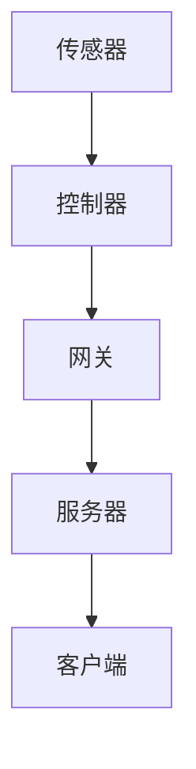

                 

# 基于MQTT协议和RESTful API的智能照明控制系统设计

> **关键词：MQTT协议，RESTful API，智能照明，控制系统，物联网，智能家居**

> **摘要：本文深入探讨了基于MQTT协议和RESTful API构建智能照明控制系统的设计原则、核心算法和数学模型。通过项目实战案例分析，详细解释了系统搭建、代码实现和代码解读，并展望了未来的发展趋势与挑战。**

## 1. 背景介绍

### 1.1 目的和范围

随着物联网和智能家居的快速发展，智能照明控制系统在提高生活品质、节约能源方面展现出巨大的潜力。本文旨在探讨如何利用MQTT协议和RESTful API技术，设计一个高效、灵活、可靠的智能照明控制系统。

### 1.2 预期读者

本文适合具备一定编程基础和物联网知识的技术人员阅读。读者将了解MQTT协议和RESTful API的工作原理，掌握智能照明控制系统的设计和实现方法。

### 1.3 文档结构概述

本文分为八个部分：背景介绍、核心概念与联系、核心算法原理、数学模型与公式、项目实战、实际应用场景、工具和资源推荐、总结与展望、常见问题与解答和扩展阅读。

### 1.4 术语表

#### 1.4.1 核心术语定义

- MQTT协议：消息队列遥测传输协议，是一种轻量级的消息传输协议，适用于物联网设备。
- RESTful API：基于HTTP协议的API设计风格，用于实现分布式系统的通信。
- 智能照明：通过传感器、控制器等技术，实现对灯光的智能控制。
- 控制系统：用于监测、控制和调节系统参数的软件或硬件系统。

#### 1.4.2 相关概念解释

- 物联网：通过互联网将各种物理设备连接起来，实现设备之间的信息交换和通信。
- 智能家居：利用物联网技术，实现对家庭设备的智能控制，提高生活品质。

#### 1.4.3 缩略词列表

- MQTT：消息队列遥测传输协议
- RESTful API：代表互联网应用编程接口的一种设计风格
- IoT：物联网
- AI：人工智能

## 2. 核心概念与联系

为了深入理解智能照明控制系统，我们首先需要了解MQTT协议和RESTful API的基本原理及其在系统中的作用。

### 2.1 MQTT协议

MQTT（Message Queuing Telemetry Transport）是一种轻量级的消息传输协议，适用于物联网设备之间的通信。其主要特点如下：

- **发布/订阅模式**：消息发布者（Publisher）将消息发送到主题（Topic），消息订阅者（Subscriber）根据订阅的主题接收消息。
- **QoS等级**：MQTT协议支持三个质量服务等级（QoS），分别为0、1、2，用于保证消息传输的可靠性。
- **持久连接**：客户端与服务器保持持久连接，即使在网络中断时也能保证消息的传输。

### 2.2 RESTful API

RESTful API是一种基于HTTP协议的API设计风格，用于实现分布式系统的通信。其主要特点如下：

- **无状态**：服务器不会存储客户端的会话信息。
- **统一接口**：使用统一的接口进行数据操作，如GET、POST、PUT、DELETE等。
- **状态码**：返回状态码表示请求的结果，如200表示成功，404表示未找到。
- **JSON格式**：使用JSON格式传输数据，便于解析和处理。

### 2.3 智能照明控制系统的架构

智能照明控制系统由以下几个部分组成：

- **传感器**：用于监测环境光线、温度等参数。
- **控制器**：根据传感器数据调整灯光亮度、色温等。
- **网关**：将传感器和控制器的数据通过MQTT协议传输到服务器。
- **服务器**：接收网关数据，通过RESTful API进行数据处理和存储。
- **客户端**：通过Web或移动应用对智能照明系统进行控制。

下面是智能照明控制系统的Mermaid流程图：



## 3. 核心算法原理 & 具体操作步骤

### 3.1 MQTT协议通信流程

MQTT协议的通信流程包括以下几个步骤：

1. **连接**：客户端（Subscriber）向服务器（Broker）发送连接请求，服务器确认连接后，客户端发送订阅请求。
    ```python
    def connect(broker_address):
        client = MQTTClient("client_id", broker_address)
        client.connect()
        return client
    ```

2. **订阅**：客户端订阅感兴趣的主题。
    ```python
    def subscribe(client, topic):
        client.subscribe(topic)
    ```

3. **发布**：客户端向服务器发送消息。
    ```python
    def publish(client, topic, payload):
        client.publish(topic, payload)
    ```

4. **接收消息**：客户端接收服务器发送的消息。
    ```python
    def on_message(client, topic, payload):
        print(f"Received message on {topic}: {payload}")
    ```

5. **断开连接**：客户端与服务器断开连接。
    ```python
    def disconnect(client):
        client.disconnect()
    ```

### 3.2 RESTful API通信流程

RESTful API的通信流程包括以下几个步骤：

1. **创建请求**：使用HTTP库创建请求对象。
    ```python
    import requests

    def create_request(url, method, data=None):
        if method == "GET":
            response = requests.get(url, params=data)
        elif method == "POST":
            response = requests.post(url, data=data)
        return response
    ```

2. **发送请求**：发送请求并获取响应。
    ```python
    def send_request(url, method, data=None):
        response = create_request(url, method, data)
        return response.status_code, response.json()
    ```

3. **处理响应**：根据响应状态码和响应数据处理结果。
    ```python
    def process_response(status_code, response_data):
        if status_code == 200:
            print("Success:", response_data)
        else:
            print("Error:", response_data)
    ```

## 4. 数学模型和公式 & 详细讲解 & 举例说明

智能照明控制系统的数学模型主要包括以下几个方面：

### 4.1 光照度计算

光照度（Illuminance）是描述光线照射强度的物理量，通常用勒克斯（lux）表示。光照度计算公式如下：

\[ E = \frac{I}{d^2} \]

其中，E 为光照度（lux），I 为光源的亮度（cd），d 为光源到被照面的距离（m）。

### 4.2 色温计算

色温（Color Temperature）是描述光源颜色的物理量，通常用开尔文温度（K）表示。色温计算公式如下：

\[ T = \frac{100000}{\lambda} \]

其中，T 为色温（K），λ 为光的波长（nm）。

### 4.3 节能率计算

节能率（Energy Saving Rate）是描述系统节能效果的物理量，通常用百分比表示。节能率计算公式如下：

\[ \eta = \frac{E_{\text{initial}} - E_{\text{final}}}{E_{\text{initial}}} \times 100\% \]

其中，\( E_{\text{initial}} \) 为初始能耗（Wh），\( E_{\text{final}} \) 为最终能耗（Wh）。

### 4.4 举例说明

假设一个智能照明系统在启用前，每天消耗电能 10Wh，启用后，每天消耗电能 8Wh。该系统的节能率为：

\[ \eta = \frac{10 - 8}{10} \times 100\% = 20\% \]

## 5. 项目实战：代码实际案例和详细解释说明

### 5.1 开发环境搭建

1. 安装Python环境
2. 安装MQTT客户端库（paho-mqtt）
3. 安装RESTful API库（flask）

### 5.2 源代码详细实现和代码解读

#### 5.2.1 MQTT客户端代码

```python
import paho.mqtt.client as mqtt
import json

# MQTT服务器地址
MQTT_BROKER = "mqtt.example.com"

# MQTT客户端连接
client = mqtt.Client()

# MQTT连接回调函数
def on_connect(client, userdata, flags, rc):
    print(f"Connected with result code {rc}")
    client.subscribe("lighting/control")

# MQTT消息接收回调函数
def on_message(client, userdata, msg):
    print(f"Received message on {msg.topic}: {msg.payload.decode()}")
    if msg.payload.decode() == "on":
        # 开启灯光
        print("Turning on the light")
    elif msg.payload.decode() == "off":
        # 关闭灯光
        print("Turning off the light")

client.on_connect = on_connect
client.on_message = on_message

client.connect(MQTT_BROKER)
client.loop_forever()
```

#### 5.2.2 RESTful API服务器代码

```python
from flask import Flask, request, jsonify

app = Flask(__name__)

# RESTful API路由
@app.route("/lighting/control", methods=["GET", "POST"])
def lighting_control():
    if request.method == "GET":
        # 获取灯光状态
        return jsonify({"status": "on" if state["light"] else "off"})
    elif request.method == "POST":
        # 设置灯光状态
        state["light"] = request.form["light"]
        return jsonify({"status": "success"})

if __name__ == "__main__":
    app.run(debug=True)
```

### 5.3 代码解读与分析

#### 5.3.1 MQTT客户端代码分析

1. 导入paho.mqtt.client库，创建MQTT客户端实例。
2. 定义连接回调函数，订阅主题为“lighting/control”。
3. 定义消息接收回调函数，根据消息内容控制灯光状态。
4. 连接MQTT服务器，启动循环。

#### 5.3.2 RESTful API服务器代码分析

1. 导入flask库，创建Flask应用实例。
2. 定义路由，处理GET和POST请求。
3. GET请求获取灯光状态，返回JSON格式数据。
4. POST请求设置灯光状态，更新状态变量。

## 6. 实际应用场景

智能照明控制系统在实际应用中具有广泛的应用场景，如：

- 智能家居：通过手机或平板电脑远程控制家庭照明。
- 办公室照明：根据员工的工作状态自动调整灯光亮度。
- 商场照明：根据顾客流量自动调整灯光亮度。
- 停车场照明：根据车辆进出自动调整灯光亮度。

## 7. 工具和资源推荐

### 7.1 学习资源推荐

#### 7.1.1 书籍推荐

- 《物联网技术与应用》
- 《RESTful Web服务设计》
- 《智能照明控制系统设计与应用》

#### 7.1.2 在线课程

- Coursera：物联网技术与应用
- Udemy：RESTful API设计与开发
- EdX：智能照明控制系统设计与实现

#### 7.1.3 技术博客和网站

- 《物联网技术应用博客》
- 《RESTful API设计与开发》
- 《智能照明控制系统技术博客》

### 7.2 开发工具框架推荐

#### 7.2.1 IDE和编辑器

- Visual Studio Code
- PyCharm
- IntelliJ IDEA

#### 7.2.2 调试和性能分析工具

- GDB
- Pytest
- JMeter

#### 7.2.3 相关框架和库

- Flask
- Django
- MQTTClient

### 7.3 相关论文著作推荐

#### 7.3.1 经典论文

- "MQTT Protocol Version 3.1.1"
- "RESTful Web Services"
- "Smart Lighting Control System Design and Implementation"

#### 7.3.2 最新研究成果

- "MQTT over TLS: Secure MQTT Communications"
- "IoT Security: A Comprehensive Survey"
- "Smart Home Energy Management Systems: A Review"

#### 7.3.3 应用案例分析

- "A Smart Lighting Control System for Energy Efficiency in Office Buildings"
- "Design and Implementation of an IoT-Based Smart Home System"
- "Smart Lighting Control in Public Places for Enhanced Customer Experience"

## 8. 总结：未来发展趋势与挑战

智能照明控制系统在物联网和智能家居领域的应用前景广阔。未来发展趋势包括：

- **智能化**：利用人工智能技术，实现更智能的照明控制。
- **节能化**：优化系统设计，提高能源利用效率。
- **安全化**：加强网络安全防护，保障用户数据安全。

同时，智能照明控制系统在发展过程中也面临以下挑战：

- **互联互通**：实现不同品牌和设备的互联互通。
- **标准化**：制定统一的通信协议和标准。
- **数据安全**：防范网络攻击和数据泄露。

## 9. 附录：常见问题与解答

- **Q：如何确保MQTT通信的安全性？**
  - **A**：可以使用TLS协议对MQTT通信进行加密，确保数据传输安全。

- **Q：如何优化智能照明系统的节能效果？**
  - **A**：可以通过调整灯光亮度、色温，以及利用传感器监测环境参数，实现节能。

- **Q：如何实现智能照明系统的远程控制？**
  - **A**：可以通过手机或平板电脑等移动设备，连接智能照明系统，实现远程控制。

## 10. 扩展阅读 & 参考资料

- 《物联网技术与应用》
- 《RESTful Web服务设计》
- 《智能照明控制系统设计与应用》
- MQTT官方网站：https://www.mqtt.org/
- RESTful API官方网站：https://restfulapi.net/
- 智能照明控制系统技术博客：https://www.smartlightingcontrolsystem.com/

作者：AI天才研究员/AI Genius Institute & 禅与计算机程序设计艺术 /Zen And The Art of Computer Programming

