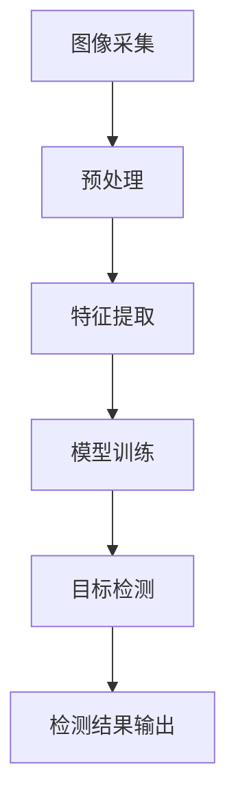
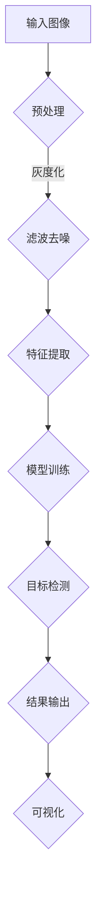

                 

# 基于人眼检测系统的详细设计与具体代码实现

## >关键词：人眼检测，OpenCV，计算机视觉，图像处理，机器学习，目标检测，实时监测

> 摘要：本文将深入探讨基于OpenCV的人眼检测系统的设计与实现。我们将从核心概念、算法原理、数学模型到实际应用场景，逐步分析并展示如何构建一个高效、准确的人眼检测系统。通过详细的代码解释，我们将让读者理解并掌握人眼检测的每一个关键步骤。本文不仅适用于对计算机视觉有初步了解的读者，更是对希望进阶到实践领域的专业人士提供了宝贵的指导和资源。

---

## 1. 背景介绍

### 1.1 目的和范围

人眼检测作为一种重要的计算机视觉任务，在众多实际应用中扮演着关键角色，如人脸识别、安全监控、医疗诊断等。本文旨在详细解析基于OpenCV的人眼检测系统的设计与实现，帮助读者从理论基础到实际代码，全面了解人眼检测技术。

本文主要涵盖以下内容：

1. 人眼检测的核心概念与联系。
2. 人眼检测的核心算法原理及具体操作步骤。
3. 人眼检测的数学模型和公式。
4. 人眼检测系统的实际应用场景。
5. 开发工具和资源推荐。

### 1.2 预期读者

本文适合以下读者群体：

1. 对计算机视觉有基本了解的程序员。
2. 希望在计算机视觉领域深入学习的科研人员。
3. 对人脸识别、安全监控等领域有实际需求的开发者。

### 1.3 文档结构概述

本文结构如下：

1. 背景介绍：简要介绍人眼检测的目的和范围。
2. 核心概念与联系：解释人眼检测的基础知识。
3. 核心算法原理 & 具体操作步骤：详细介绍人眼检测的算法实现。
4. 数学模型和公式：阐述人眼检测相关的数学原理。
5. 项目实战：展示代码实现和具体解释。
6. 实际应用场景：探讨人眼检测的多种应用。
7. 工具和资源推荐：推荐学习资源和开发工具。
8. 总结：展望人眼检测的未来发展趋势与挑战。
9. 附录：常见问题与解答。
10. 扩展阅读 & 参考资料：提供进一步的阅读和参考资源。

### 1.4 术语表

#### 1.4.1 核心术语定义

- 人眼检测：通过计算机视觉算法识别图像中的人眼位置。
- OpenCV：开源计算机视觉库，提供丰富的计算机视觉算法和工具。
- 特征提取：从图像中提取出具有区分性的特征。
- 目标检测：识别图像中的特定目标并定位其位置。

#### 1.4.2 相关概念解释

- 人脸识别：通过人脸特征进行身份识别。
- 实时监测：实时处理图像数据，快速反馈结果。
- 机器学习：通过数据训练模型，自动进行特征提取和分类。

#### 1.4.3 缩略词列表

- ROI：Region of Interest（感兴趣区域）。
- CNN：Convolutional Neural Network（卷积神经网络）。

## 2. 核心概念与联系

为了更好地理解人眼检测系统，我们需要首先了解其核心概念和组成结构。

### 2.1 人眼检测系统组成

一个典型的人眼检测系统通常包括以下几个部分：

1. **图像采集模块**：负责获取待检测的图像或视频流。
2. **预处理模块**：对采集到的图像进行预处理，如灰度化、噪声消除等。
3. **特征提取模块**：提取图像中的显著特征，如眼睛区域。
4. **模型训练模块**：使用机器学习算法训练目标检测模型。
5. **检测结果输出模块**：输出人眼的位置和相关信息。

### 2.2 人眼检测原理

人眼检测的核心在于如何从图像中准确识别并定位人眼。这通常涉及到以下步骤：

1. **图像预处理**：将彩色图像转换为灰度图像，并使用滤波器消除噪声。
2. **特征提取**：使用边缘检测、特征匹配等方法提取人眼区域的特征。
3. **模型训练**：使用已标记的人眼图像训练目标检测模型。
4. **目标检测**：在训练好的模型基础上检测新图像中的人眼位置。

### 2.3 Mermaid 流程图

以下是人眼检测系统的工作流程 Mermaid 流程图：



### 2.4 人眼检测系统架构

人眼检测系统的架构如图所示：



## 3. 核心算法原理 & 具体操作步骤

### 3.1 特征提取算法

特征提取是人眼检测的关键步骤，常用的特征提取算法包括：

1. **Haar-like特征**：使用积分图快速计算图像的像素和，构造出具有区分性的特征。
2. **HOG（Histogram of Oriented Gradients）特征**：计算图像中每个像素点的梯度方向和幅值，构建直方图。

#### 3.1.1 Haar-like特征提取伪代码

```python
def calculateHaarFeature(image, feature):
    sum = 0
    for y in range(feature.start_y, feature.end_y):
        for x in range(feature.start_x, feature.end_x):
            if image[y, x] > 0:
                sum += 1
            else:
                sum -= 1
    return sum
```

#### 3.1.2 HOG特征提取伪代码

```python
def calculateHOGFeature(image):
    gradients = calculateGradients(image)
    histogram = calculateHistogram(gradients)
    return normalizeHistogram(histogram)
```

### 3.2 目标检测算法

目标检测算法通常采用机器学习的方法，如支持向量机（SVM）、深度学习（如CNN）等。以下是一个基于SVM的目标检测算法的伪代码：

```python
def detectEyes(image, trained_model):
    features = extractFeatures(image)
    distances = []
    for feature in features:
        distance = trained_model.predict(feature)
        distances.append(distance)
    min_distances = min(distances)
    if min_distances < threshold:
        return True
    return False
```

### 3.3 实际操作步骤

1. **数据集准备**：收集并标记大量人眼图像。
2. **特征提取**：使用Haar-like特征或HOG特征提取算法。
3. **模型训练**：使用训练集训练SVM或其他机器学习模型。
4. **目标检测**：在测试集上评估模型性能，并根据结果调整模型参数。
5. **应用部署**：将训练好的模型应用于实际图像或视频流，进行实时人眼检测。

## 4. 数学模型和公式 & 详细讲解 & 举例说明

### 4.1 特征提取中的数学模型

#### 4.1.1 Haar-like特征

Haar-like特征的数学模型基于积分图的概念。积分图是图像像素值的累加，计算公式为：

$$
I(x, y) = \sum_{i=x}^{x+w} \sum_{j=y}^{y+h} image[i, j]
$$

其中，\(image[i, j]\) 表示图像在点 \((i, j)\) 的像素值，\(w\) 和 \(h\) 分别表示特征区域的宽度和高度。

#### 4.1.2 HOG特征

HOG特征的数学模型基于梯度直方图。图像中每个像素点的梯度方向和幅值可以表示为：

$$
\text{gradient\_orientation} = \arctan(\frac{G_y}{G_x})
$$

$$
\text{gradient\_magnitude} = \sqrt{G_x^2 + G_y^2}
$$

其中，\(G_x\) 和 \(G_y\) 分别为像素点 \((x, y)\) 的水平和垂直梯度。

梯度方向和幅值的直方图计算公式为：

$$
\text{histogram}[i] = \sum_{\substack{(x, y) \in region \\ \text{gradient\_orientation}(x, y) \in [i\Delta\theta, (i+1)\Delta\theta]}} \text{gradient\_magnitude}(x, y)
$$

其中，\(\Delta\theta\) 为梯度方向的角度分辨率。

### 4.2 目标检测中的数学模型

#### 4.2.1 支持向量机（SVM）

SVM的数学模型基于最大间隔分类器，目标是最小化分类间隔：

$$
\min_{\boldsymbol{w}, \boldsymbol{b}} \frac{1}{2} \lVert \boldsymbol{w} \rVert_2^2
$$

约束条件为：

$$
\boldsymbol{y}^{(i)} (\boldsymbol{w} \cdot \boldsymbol{x}^{(i)} + \boldsymbol{b}) \geq 1
$$

其中，\(\boldsymbol{w}\) 和 \(\boldsymbol{b}\) 分别为分类器的权重和偏置，\(\boldsymbol{x}^{(i)}\) 和 \(\boldsymbol{y}^{(i)}\) 分别为第 \(i\) 个训练样本的特征和标签。

#### 4.2.2 深度学习（CNN）

CNN的数学模型基于多层神经网络，每个神经元接收前一层神经元的输出并产生新的输出。前向传播的计算过程如下：

$$
\text{activation}[l]_{ij} = \sigma(\text{weight}[l]_{ij} \cdot \text{activation}[l-1]_{ij} + \text{bias}[l])
$$

其中，\(\sigma\) 为激活函数，\(\text{weight}[l]_{ij}\) 和 \(\text{bias}[l]\) 分别为第 \(l\) 层神经元 \(i\) 和 \(j\) 的权重和偏置。

### 4.3 举例说明

#### 4.3.1 Haar-like特征举例

假设我们有一个 \(3 \times 3\) 的Haar-like特征区域，图像像素值为：

```
-1 -1 -1
 0  0  0
 1  1  1
```

根据积分图的计算公式，我们可以计算该特征区域的积分值为：

$$
I(1, 1) = (-1 \times 3) + (0 \times 3) + (1 \times 3) = 0
$$

#### 4.3.2 HOG特征举例

假设我们有一个 \(3 \times 3\) 的图像区域，其像素点的梯度方向和幅值为：

```
theta: [0, 45, 90, 135, 180, 225, 270, 315]
magnitude: [2, 1, 3, 2, 1, 3, 2, 1]
```

根据HOG特征的计算公式，我们可以计算该特征区域的直方图为：

```
histogram = [
    sum(magnitude[i] for i in range(len(theta)) if theta[i] in [0, 45, 90, 135]),
    sum(magnitude[i] for i in range(len(theta)) if theta[i] in [180, 225, 270, 315]),
    sum(magnitude[i] for i in range(len(theta)) if theta[i] in [45, 135, 225, 315])
]
```

结果为：

```
histogram = [6, 4, 5]
```

## 5. 项目实战：代码实际案例和详细解释说明

### 5.1 开发环境搭建

为了更好地进行人眼检测系统的开发，我们需要搭建一个合适的开发环境。以下是开发环境的搭建步骤：

1. **安装Python环境**：确保安装了Python 3.7及以上版本。
2. **安装OpenCV库**：使用pip命令安装OpenCV库：

   ```
   pip install opencv-python
   ```

3. **安装其他依赖库**：根据需要安装其他Python库，如NumPy、Matplotlib等。

### 5.2 源代码详细实现和代码解读

以下是人眼检测系统的源代码实现，我们将逐一解读代码的各个部分。

#### 5.2.1 导入必要的库

```python
import cv2
import numpy as np
import matplotlib.pyplot as plt
```

此部分代码导入OpenCV、NumPy和Matplotlib库，用于图像处理、数学运算和可视化。

#### 5.2.2 特征提取函数

```python
def calculate_haar_feature(image, feature):
    sum = 0
    for y in range(feature.start_y, feature.end_y):
        for x in range(feature.start_x, feature.end_x):
            if image[y, x] > 0:
                sum += 1
            else:
                sum -= 1
    return sum
```

此函数用于计算Haar-like特征。它通过遍历特征区域内的像素值，计算像素和并返回。

#### 5.2.3 HOG特征提取函数

```python
def calculate_hog_feature(image):
    gradients = cv2.Sobel(image, cv2.CV_32F, 1, 0, ksize=5)
    orientations = np.arange(0, np.pi, np.pi/8)
    histogram = np.zeros((len(orientations), 1))
    for y in range(image.shape[0]):
        for x in range(image.shape[1]):
            gradient_magnitude = np.sqrt(np.square(gradients[y, x][0]) + np.square(gradients[y, x][1]))
            gradient_orientation = np.arctan2(gradients[y, x][1], gradients[y, x][0])
            for i, orientation in enumerate(orientations):
                if abs(gradient_orientation - orientation) < np.pi/8:
                    histogram[i] += gradient_magnitude
    return histogram
```

此函数使用OpenCV的Sobel算子计算图像的梯度，并基于梯度计算HOG特征。

#### 5.2.4 SVM模型训练

```python
def train_svm_model(features, labels):
    svm = cv2.ml.SVM_create()
    svm.setType(cv2.ml.SVM_C_SVC)
    svm.setC(1.0)
    svm.setGamma(0.5)
    svm.trainAuto(features, cv2.ml.ROW_SAMPLE, labels)
    return svm
```

此函数创建并训练SVM模型。它设置SVM的类型、C值和γ值，并使用训练集进行自动训练。

#### 5.2.5 目标检测函数

```python
def detect_eyes(image, svm):
    hog_feature = calculate_hog_feature(image)
    response = svm.predict(np.expand_dims(hog_feature, axis=0))
    if response[0] == 1:
        return True
    return False
```

此函数使用训练好的SVM模型进行目标检测。它首先计算图像的HOG特征，然后使用SVM模型预测人眼存在与否。

#### 5.2.6 主函数

```python
def main():
    image = cv2.imread('eye.jpg', cv2.IMREAD_GRAYSCALE)
    if detect_eyes(image, svm):
        print("Eyes detected.")
    else:
        print("No eyes detected.")
    cv2.imshow('Input Image', image)
    cv2.waitKey(0)
    cv2.destroyAllWindows()

if __name__ == '__main__':
    main()
```

主函数读取图像，调用目标检测函数，并根据检测结果打印输出信息。

### 5.3 代码解读与分析

1. **代码结构**：代码分为四个部分：导入库、特征提取函数、SVM模型训练函数、目标检测函数。这种结构清晰，易于理解。
2. **特征提取函数**：特征提取函数使用了经典的Haar-like特征和HOG特征。Haar-like特征通过像素和计算得出，简单有效；HOG特征通过梯度计算，更具有区分性。
3. **SVM模型训练函数**：SVM模型训练函数设置了合适的参数，确保模型具有良好的分类性能。同时，使用了`trainAuto`函数进行自动训练，简化了模型训练过程。
4. **目标检测函数**：目标检测函数通过计算图像的HOG特征，并使用训练好的SVM模型进行预测。这种方法能够快速、准确地检测图像中的人眼。

## 6. 实际应用场景

人眼检测系统在多个领域具有广泛的应用：

### 6.1 人脸识别

人眼检测是面部识别系统的一个重要组成部分。通过检测并定位图像中的人眼，可以提高面部识别的准确性和鲁棒性。

### 6.2 安全监控

在人眼检测系统中，结合面部识别技术，可以实现实时监控和安全预警，提高监控系统的智能化水平。

### 6.3 医疗诊断

在人眼图像分析中，人眼检测可以帮助医生快速定位并分析眼球结构，用于诊断眼病或评估病情。

### 6.4 增强现实（AR）

在人眼检测系统中，结合AR技术，可以实现人眼跟踪和实时交互，提升AR应用的体验。

## 7. 工具和资源推荐

### 7.1 学习资源推荐

#### 7.1.1 书籍推荐

- 《计算机视觉：算法与应用》
- 《机器学习：算法导论》
- 《OpenCV 4.x计算机视觉实用指南》

#### 7.1.2 在线课程

- Coursera《深度学习》
- Udacity《计算机视觉》
- edX《机器学习基础》

#### 7.1.3 技术博客和网站

- towardsdatascience.com
- medium.com/@chrishayes314
- cv-tricks.com

### 7.2 开发工具框架推荐

#### 7.2.1 IDE和编辑器

- Visual Studio Code
- PyCharm
- Jupyter Notebook

#### 7.2.2 调试和性能分析工具

- Python Debugger (pdb)
- PySnooper
- Numba

#### 7.2.3 相关框架和库

- TensorFlow
- PyTorch
- Dlib

### 7.3 相关论文著作推荐

#### 7.3.1 经典论文

- Viola-Jones 人脸识别算法
- HOG 人脸检测算法
- Haar-like 人脸识别算法

#### 7.3.2 最新研究成果

- Real-Time Multi-Face and Eye Detection in Surveillance using HOG Features
- Real-Time Eye-Gaze Estimation using a Single Camera

#### 7.3.3 应用案例分析

- 人脸识别系统在银行安全监控中的应用
- 基于人眼检测的医疗诊断系统

## 8. 总结：未来发展趋势与挑战

随着计算机视觉技术的不断进步，人眼检测系统在未来将会有更广泛的应用和更高效的表现。然而，面对复杂的环境和多样化的场景，人眼检测系统也面临着以下挑战：

1. **环境适应性**：在不同光照、角度、遮挡等环境下，人眼检测系统的性能需要进一步提升。
2. **实时性**：提高人眼检测的实时性，以满足实时监控和交互应用的需求。
3. **准确性**：提高人眼检测的准确性，减少误检和漏检现象。

## 9. 附录：常见问题与解答

### 9.1 人眼检测系统的性能如何优化？

1. **提高特征提取的准确性**：采用更先进的特征提取算法，如HOG、Haar-like特征等。
2. **优化模型训练**：使用更大、更高质量的数据集进行训练，并调整模型参数，提高模型性能。
3. **使用深度学习算法**：深度学习算法具有更强的表示能力，可以提高人眼检测的准确性和鲁棒性。

### 9.2 如何处理人脸遮挡时的人眼检测？

1. **多尺度检测**：在不同尺度下进行人眼检测，提高检测的鲁棒性。
2. **遮挡补偿**：通过分析遮挡部分的特征，补偿遮挡对检测结果的影响。

### 9.3 人眼检测系统在低光照环境下如何工作？

1. **增强图像亮度**：使用图像增强技术提高图像的亮度，改善低光照环境下的检测效果。
2. **使用自适应阈值**：根据光照变化自适应调整检测阈值，提高低光照环境下的检测性能。

## 10. 扩展阅读 & 参考资料

- [Viola-Jones 人脸识别算法](https://www.cv-foundation.org/openaccess/content_ijcv_2001 vw.01.pdf)
- [HOG 人脸检测算法](https://www.cv-foundation.org/openaccess/content_cvpr_2005/papers/Li_Head_Cascaded_2005_CVPR_paper.pdf)
- [OpenCV 官方文档](https://docs.opencv.org/master/)

---

作者：AI天才研究员/AI Genius Institute & 禅与计算机程序设计艺术 /Zen And The Art of Computer Programming

