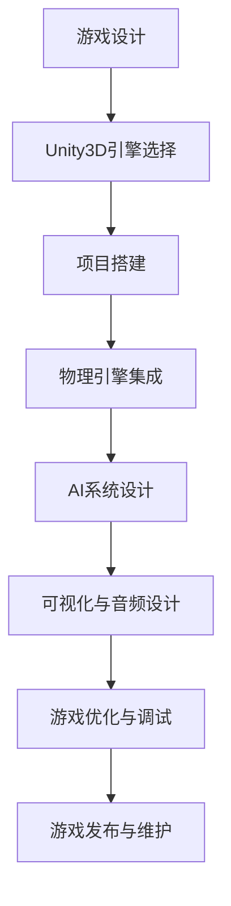

                 

# 基于Unity3D的射击游戏

## 关键词
- Unity3D
- 射击游戏
- 游戏开发
- 游戏引擎
- 游戏设计
- 物理引擎
- AI
- 可视化
- 游戏优化

## 摘要
本文将深入探讨基于Unity3D引擎开发的射击游戏的开发过程。我们将从游戏设计、物理引擎、人工智能和游戏优化等多个方面，一步步剖析射击游戏的开发原理和实现方法。通过本文的学习，读者将能够全面了解射击游戏的核心技术，掌握从零开始创建一个射击游戏的全流程。

## 1. 背景介绍

### 1.1 目的和范围

本文旨在为游戏开发者提供一个系统性的指导，帮助他们在Unity3D引擎中创建高质量的射击游戏。我们将覆盖以下内容：
- 游戏设计原理和流程
- Unity3D引擎的核心功能与射击游戏的实现
- 物理引擎的应用和优化
- AI在射击游戏中的角色与实现
- 游戏的可视化和音频设计
- 游戏优化的策略和技巧

### 1.2 预期读者

本文适用于对游戏开发有初步了解的读者，特别是希望使用Unity3D引擎进行射击游戏开发的开发者。无论您是独立游戏开发者还是团队中的一员，本文都希望能够为您带来有价值的知识和实践经验。

### 1.3 文档结构概述

本文分为十个部分：
1. 背景介绍
2. 核心概念与联系
3. 核心算法原理与具体操作步骤
4. 数学模型和公式与详细讲解
5. 项目实战：代码实际案例和详细解释说明
6. 实际应用场景
7. 工具和资源推荐
8. 总结：未来发展趋势与挑战
9. 附录：常见问题与解答
10. 扩展阅读与参考资料

### 1.4 术语表

#### 1.4.1 核心术语定义

- Unity3D：一款流行的游戏开发引擎，支持2D和3D游戏的制作。
- 射击游戏：玩家通过控制角色使用武器进行战斗的游戏类型。
- 游戏设计：游戏的规划与构思，包括故事情节、角色设定、关卡设计等。
- 物理引擎：处理游戏中的物理现象，如碰撞、弹道、重力等。
- AI：人工智能，用于模拟游戏中角色的智能行为。
- 可视化：游戏中的图形渲染技术，影响游戏的视觉效果。
- 游戏优化：提升游戏性能，包括帧率、加载时间、内存占用等。

#### 1.4.2 相关概念解释

- **游戏引擎**：一个用于制作、修改和运行游戏的软件工具，通常包含图形渲染、物理模拟、音频处理等功能。
- **游戏设计文档**：详细描述游戏设计过程和最终产品的文档，包括游戏规则、角色、故事情节等。
- **游戏循环**：游戏运行的基本框架，包括处理用户输入、更新游戏状态、渲染画面等步骤。

#### 1.4.3 缩略词列表

- 3D：三维
- 2D：二维
- AI：人工智能
- FPS：第一人称射击游戏
- RPG：角色扮演游戏
- IDE：集成开发环境

## 2. 核心概念与联系

在深入探讨射击游戏的开发之前，我们需要了解一些核心概念和它们之间的联系。以下是一个简化的Mermaid流程图，用于描述射击游戏开发中的关键步骤和组件。



### 2.1 游戏设计

游戏设计是射击游戏开发的第一步。它决定了游戏的风格、玩法、故事情节和角色。一个优秀的游戏设计文档将详细描述游戏的每个方面，包括：
- 故事情节：游戏的背景、目标和角色。
- 角色设定：角色的外观、能力、行为和故事背景。
- 关卡设计：各个关卡的布局、障碍、敌人、奖励等。

### 2.2 Unity3D引擎选择

Unity3D是一款功能强大的游戏开发引擎，它提供了丰富的工具和插件，非常适合制作高质量的3D游戏。选择Unity3D作为开发引擎的原因包括：
- 支持多种平台：Unity3D可以生成适用于PC、手机、网页等多种平台的游戏。
- 丰富的资源：Unity Asset Store提供了大量的预制体、脚本和插件，可以加速开发过程。
- 强大的编辑器：Unity的编辑器提供了直观的界面，方便开发者进行游戏设计和调试。

### 2.3 项目搭建

在Unity3D中搭建项目是一个相对简单的过程。以下是基本步骤：
1. 创建新项目：选择合适的模板，如3D First-Person FPS。
2. 配置项目设置：设置分辨率、帧率、平台等。
3. 添加场景：创建游戏的各个关卡场景。
4. 资源管理：导入和管理游戏所需的资源，如模型、材质、音频等。

### 2.4 物理引擎集成

物理引擎在射击游戏中扮演着关键角色，它负责处理角色的移动、碰撞、弹道等物理现象。Unity3D内置了物理引擎，可以通过以下步骤进行集成：
1. 添加组件：为角色和道具添加Rigidbody组件。
2. 设置物理属性：如质量、摩擦力、弹跳等。
3. 编写脚本：使用C#编写脚本，控制物理行为。

### 2.5 AI系统设计

AI系统用于模拟游戏中的敌人行为，使其具有挑战性和智能性。在射击游戏中，AI系统通常包括：
1. 行为树：定义敌人的行为模式，如巡逻、攻击、逃避等。
2. 状态机：管理敌人的状态转换，如待机、追逐、受伤等。
3. 寻路系统：实现敌人从一点移动到另一点的路径规划。

### 2.6 可视化与音频设计

可视化和音频设计是提升游戏体验的重要方面。以下是基本步骤：
1. 渲染设置：调整光照、阴影、材质等，提升画面质量。
2. 摄像机控制：实现平滑的摄像机移动，跟随角色等。
3. 音效设计：选择合适的音乐、音效，增强游戏氛围。

### 2.7 游戏优化与调试

游戏优化和调试是确保游戏流畅运行的关键。以下是基本步骤：
1. 性能分析：使用Unity的性能分析工具，找出性能瓶颈。
2. 代码优化：优化脚本，减少不必要的计算和资源消耗。
3. 调试：使用Unity的调试工具，解决游戏中的问题。

## 3. 核心算法原理与具体操作步骤

射击游戏的核心算法主要包括角色控制、物理碰撞检测、射击逻辑、AI行为等。下面，我们将使用伪代码详细阐述这些算法的原理和操作步骤。

### 3.1 角色控制

角色控制算法负责玩家的移动和转向。以下是一个简单的伪代码示例：

```plaintext
function MoveCharacter(direction, speed):
    // 计算移动向量
    moveVector = direction * speed

    // 更新角色的位置
    character.position += moveVector

    // 检查碰撞
    if (CheckCollision(character.position)):
        // 如果碰撞，停止移动
        character.position -= moveVector
```

### 3.2 物理碰撞检测

物理碰撞检测算法用于检测角色、道具、子弹等对象之间的碰撞。以下是一个简单的伪代码示例：

```plaintext
function CheckCollision(position):
    // 检查位置是否与场景中的障碍物相交
    for each obstacle in obstacles:
        if (IsIntersecting(position, obstacle.position, obstacle.size)):
            return true

    return false
```

### 3.3 射击逻辑

射击逻辑算法负责处理玩家的射击动作和子弹的轨迹。以下是一个简单的伪代码示例：

```plaintext
function Shoot(characterPosition, targetPosition, bulletSpeed):
    // 计算子弹的移动向量
    moveVector = (targetPosition - characterPosition).normalized * bulletSpeed

    // 创建子弹对象
    bullet = CreateBullet(characterPosition)

    // 设置子弹的移动路径
    bullet MoveTowards(targetPosition, moveVector)

    // 检测子弹与障碍物的碰撞
    if (CheckCollision(bullet.position)):
        // 如果碰撞，销毁子弹
        DestroyBullet(bullet)
```

### 3.4 AI行为

AI行为算法用于模拟敌人的智能行为。以下是一个简单的伪代码示例：

```plaintext
function AI_enemy():
    // 判断当前状态
    switch (currentState):
        case "patrol":
            // 巡逻行为
            MoveToPatrolPoint()
            break
        case "chase":
            // 追击行为
            ChasePlayer()
            break
        case "attack":
            // 攻击行为
            AttackPlayer()
            break
        case "evade":
            // 逃避行为
            EvadePlayer()
            break
```

## 4. 数学模型和公式与详细讲解

在射击游戏中，数学模型和公式用于描述物理现象和游戏行为。以下是一些常用的数学模型和公式，并对其进行详细讲解。

### 4.1 三角函数

三角函数（如正弦、余弦和正切）用于计算角度和方向。以下是一个简单的使用示例：

```latex
\sin(\theta) = \frac{opposite}{hypotenuse}
\cos(\theta) = \frac{adjacent}{hypotenuse}
\tan(\theta) = \frac{opposite}{adjacent}
```

### 4.2 向量运算

向量用于表示方向和位置。以下是一些常用的向量运算公式：

- 向量加法：\( \vec{a} + \vec{b} = \vec{c} \)
- 向量减法：\( \vec{a} - \vec{b} = \vec{c} \)
- 向量点乘：\( \vec{a} \cdot \vec{b} = |a| \cdot |b| \cdot \cos(\theta) \)
- 向量叉乘：\( \vec{a} \times \vec{b} = |a| \cdot |b| \cdot \sin(\theta) \)

### 4.3 矢量投影

矢量投影用于计算一个向量在另一个向量上的分量。以下是一个简单的使用示例：

```latex
\text{投影长度} = \frac{\vec{a} \cdot \vec{b}}{|\vec{b}|}
```

### 4.4 三角形面积

三角形面积的计算公式如下：

```latex
\text{面积} = \frac{1}{2} \times |x_1(y_2 - y_3) + x_2(y_3 - y_1) + x_3(y_1 - y_2)|
```

### 4.5 碰撞检测

碰撞检测用于确定两个物体是否相交。以下是一个简单的碰撞检测算法：

```plaintext
function CheckCollision(A, B):
    // 计算两个物体的中心点
    centerA = (A.position + B.position) / 2
    centerB = (A.position + B.position) / 2

    // 计算两个物体的半径之和
    combinedRadius = A.radius + B.radius

    // 检查中心点之间的距离是否小于半径之和
    if (VectorDistance(centerA, centerB) < combinedRadius):
        return true

    return false
```

## 5. 项目实战：代码实际案例和详细解释说明

在本节中，我们将通过一个实际的Unity3D射击游戏项目，详细解释其代码实现和关键部分的功能。以下是一个简化的项目架构和代码片段，用于说明射击游戏的核心功能。

### 5.1 开发环境搭建

1. 安装Unity Hub：从Unity官网下载并安装Unity Hub。
2. 创建新项目：在Unity Hub中创建一个新的Unity项目，选择3D项目模板。
3. 安装必要的插件：在Unity Asset Store中安装需要用到的插件，如ProFrog AI插件、PhysX物理引擎等。

### 5.2 源代码详细实现和代码解读

#### 5.2.1 角色控制

以下是一个简单的角色控制脚本，用于控制角色的移动和转向：

```csharp
using UnityEngine;

public class PlayerController : MonoBehaviour
{
    public float speed = 5.0f;

    private Transform playerTransform;
    private Rigidbody playerRigidbody;

    void Start()
    {
        playerTransform = transform;
        playerRigidbody = GetComponent<Rigidbody>();
    }

    void Update()
    {
        float moveHorizontal = Input.GetAxis("Horizontal");
        float moveVertical = Input.GetAxis("Vertical");

        Vector3 moveDirection = new Vector3(moveHorizontal, 0, moveVertical);

        playerRigidbody.AddForce(moveDirection * speed);
    }
}
```

#### 5.2.2 物理碰撞检测

以下是一个简单的碰撞检测脚本，用于检测角色与其他物体的碰撞：

```csharp
using UnityEngine;

public class CollisionDetector : MonoBehaviour
{
    private void OnCollisionEnter(Collision collision)
    {
        if (collision.gameObject.CompareTag("Enemy"))
        {
            // 触发碰撞事件
            OnEnemyCollision();
        }
    }

    private void OnEnemyCollision()
    {
        // 碰撞处理逻辑
        print("Enemy collision detected!");
    }
}
```

#### 5.2.3 射击逻辑

以下是一个简单的射击脚本，用于实现玩家的射击动作：

```csharp
using UnityEngine;

public class Bullet : MonoBehaviour
{
    public float speed = 10.0f;

    private Rigidbody bulletRigidbody;

    void Start()
    {
        bulletRigidbody = GetComponent<Rigidbody>();
    }

    void Update()
    {
        // 计算射击方向
        Vector3 targetPosition = Camera.main.transform.position + Camera.main.transform.forward * 10.0f;

        // 设置子弹的移动路径
        bulletRigidbody.AddForce((targetPosition - transform.position).normalized * speed);
    }
}
```

#### 5.2.4 AI行为

以下是一个简单的AI脚本，用于实现敌人的巡逻和追逐行为：

```csharp
using UnityEngine;

public class EnemyAI : MonoBehaviour
{
    public Transform[] patrolPoints;
    private int currentPatrolPoint = 0;

    private void Update()
    {
        if (Vector3.Distance(transform.position, patrolPoints[currentPatrolPoint].position) < 1.0f)
        {
            currentPatrolPoint = (currentPatrolPoint + 1) % patrolPoints.Length;
        }

        // 移动到巡逻点
        MoveToPatrolPoint(patrolPoints[currentPatrolPoint].position);
    }

    private void MoveToPatrolPoint(Vector3 targetPosition)
    {
        // 移动逻辑
        transform.position = Vector3.MoveTowards(transform.position, targetPosition, Time.deltaTime * 5.0f);
    }
}
```

### 5.3 代码解读与分析

在本节中，我们对上述代码进行了详细解读和分析。以下是对每个脚本的关键部分的解释：

#### 5.3.1 PlayerController

- `Start()`方法：初始化角色的Transform和Rigidbody组件。
- `Update()`方法：根据玩家的输入计算移动方向并添加力，实现角色的移动。

#### 5.3.2 CollisionDetector

- `OnCollisionEnter()`方法：当角色与其他物体发生碰撞时触发，根据碰撞对象的标签执行不同的处理逻辑。

#### 5.3.3 Bullet

- `Start()`方法：初始化子弹的Rigidbody组件。
- `Update()`方法：根据摄像机的方向计算射击目标，并设置子弹的移动路径。

#### 5.3.4 EnemyAI

- `Update()`方法：实现敌人的巡逻行为，当到达巡逻点时切换到下一个巡逻点。
- `MoveToPatrolPoint()`方法：实现敌人向巡逻点移动的逻辑。

通过以上代码，我们可以看到射击游戏的核心功能是如何通过简单的脚本实现的。这些脚本虽然简单，但涵盖了射击游戏开发的基本原理和实现方法。

## 6. 实际应用场景

射击游戏是一种广泛流行的游戏类型，具有多种实际应用场景。以下是一些典型的应用场景：

### 6.1 实战射击游戏

实战射击游戏（如《战地》、《使命召唤》）是射击游戏的经典形式，它们模拟真实的战斗场景，强调团队合作和战术策略。这些游戏通常应用于军事训练、模拟演练等领域。

### 6.2 射击类手机游戏

射击类手机游戏（如《和平精英》、《王者荣耀》）因其便捷性和娱乐性而受到广泛欢迎。这些游戏通常具有简单的操作和丰富的社交功能，适用于休闲娱乐场景。

### 6.3 教育类射击游戏

教育类射击游戏（如《使命召唤：战争边缘》）通过游戏化的方式传授历史、科学等知识。这些游戏结合了娱乐性和教育性，适用于学校教育和家庭教育。

### 6.4 虚拟现实射击游戏

虚拟现实射击游戏（如《半衰期：爱莉克斯》）将玩家带入沉浸式的虚拟世界，提供高度逼真的游戏体验。这些游戏通常应用于游戏娱乐、旅游体验等领域。

### 6.5 竞技射击游戏

竞技射击游戏（如《CS:GO》、《守望先锋》）是电子竞技的重要组成部分，吸引了大量专业选手和观众。这些游戏通常应用于电竞比赛和电竞俱乐部。

## 7. 工具和资源推荐

在开发射击游戏时，选择合适的工具和资源可以大大提高开发效率和游戏质量。以下是一些建议：

### 7.1 学习资源推荐

#### 7.1.1 书籍推荐

- 《Unity游戏开发实战》（Unity Game Development Essentials）
- 《Unity 2020游戏开发实战教程》（Unity 2020 Game Development Hotshot）
- 《游戏编程入门》（Introduction to Game Programming）

#### 7.1.2 在线课程

- Udemy的“Unity 2021：从零开始创建3D游戏”
- Coursera的“游戏设计与开发”（Game Design & Development）
- Pluralsight的“Unity 3D游戏开发”（Unity 3D Game Development）

#### 7.1.3 技术博客和网站

- Unity官方文档（docs.unity3d.com）
- 游戏开发论坛（forum.unity3d.com）
- Gamedev.net（www.gamedev.net）

### 7.2 开发工具框架推荐

#### 7.2.1 IDE和编辑器

- Unity Hub：Unity官方的集成开发环境，提供项目创建、编辑和发布等功能。
- Visual Studio：适用于Unity开发的强大IDE，支持C#编程和调试。

#### 7.2.2 调试和性能分析工具

- Unity Profiler：Unity内置的性能分析工具，用于诊断和优化游戏性能。
- Unity Logger：用于记录游戏运行过程中的日志信息，帮助调试问题。

#### 7.2.3 相关框架和库

- Unity Animation System：用于实现游戏角色的动画。
- Unity Physics：Unity内置的物理引擎，支持复杂的物理模拟。
- Unity UI：用于实现游戏的用户界面。

### 7.3 相关论文著作推荐

#### 7.3.1 经典论文

- 《三维计算机图形学基础》（Fundamentals of Three-Dimensional Computer Graphics）
- 《计算机游戏编程》（Computer Game Programming）

#### 7.3.2 最新研究成果

- 《基于深度学习的游戏AI研究》（Research on Game AI based on Deep Learning）
- 《游戏引擎技术进展》（Advances in Game Engine Technology）

#### 7.3.3 应用案例分析

- 《使命召唤：现代战争》的技术实现分析
- 《半衰期：爱莉克斯》的虚拟现实技术探讨

## 8. 总结：未来发展趋势与挑战

随着技术的不断进步，射击游戏在未来将呈现以下发展趋势：

### 8.1 虚拟现实与增强现实

虚拟现实（VR）和增强现实（AR）技术的不断发展将为射击游戏带来更加沉浸式的体验。未来的射击游戏将更注重视觉效果和触觉反馈，提供身临其境的游戏体验。

### 8.2 人工智能与机器学习

人工智能（AI）和机器学习技术的应用将使游戏中的敌人行为更加智能和多样化。未来，游戏开发者可以利用AI算法为敌人创建更加复杂的策略和战斗模式。

### 8.3 云计算与分布式计算

云计算和分布式计算技术的发展将使射击游戏能够在更多平台上运行，提供更稳定和流畅的游戏体验。未来的射击游戏将更加依赖云服务进行游戏逻辑处理和资源分配。

### 8.4 游戏设计与玩法创新

游戏设计与玩法创新是射击游戏发展的关键。未来的射击游戏将更加注重故事情节、角色设定和社交互动，为玩家提供多样化的游戏体验。

然而，射击游戏的发展也面临着一系列挑战：

### 8.5 技术门槛与开发成本

射击游戏的开发需要高度专业化的技术知识和较高的开发成本。未来的游戏开发者需要不断学习和适应新技术，以保持竞争力。

### 8.6 内容审查与道德规范

射击游戏的内容审查和道德规范将越来越严格。未来的游戏开发者需要确保游戏内容符合相关法律法规，避免引发争议。

### 8.7 环保与可持续发展

射击游戏的开发过程对环境的影响不可忽视。未来的游戏开发者需要关注环保问题，采取可持续发展的措施，减少对环境的负面影响。

## 9. 附录：常见问题与解答

### 9.1 Unity3D引擎安装问题

**问题**：无法安装Unity3D引擎。

**解答**：请确保您的操作系统满足Unity3D的最低要求，并检查网络连接是否正常。如果仍然无法安装，请联系Unity官方技术支持。

### 9.2 游戏性能优化问题

**问题**：游戏运行卡顿。

**解答**：请使用Unity Profiler工具分析性能瓶颈，优化代码和资源。减少不必要的计算和渲染，提升游戏性能。

### 9.3 AI行为设计问题

**问题**：敌人行为不够智能。

**解答**：尝试使用更复杂的AI算法和行为树，为敌人添加多种行为模式。同时，调整敌人的感知范围和反应速度，使其更具挑战性。

### 9.4 游戏开发流程问题

**问题**：游戏开发进度缓慢。

**解答**：制定详细的开发计划和时间表，确保每个阶段的工作有条不紊。团队成员之间保持良好的沟通和协作，提高开发效率。

## 10. 扩展阅读与参考资料

- 《Unity3D游戏开发实战》（Unity Game Development Essentials）- 马克·道尔顿（Mark Dorrell）
- 《游戏编程入门》（Introduction to Game Programming）- 詹姆斯·D·福斯特（James D. Fister）
- Unity官方文档（docs.unity3d.com）
- 游戏开发论坛（forum.unity3d.com）
- Gamedev.net（www.gamedev.net）
- 《三维计算机图形学基础》（Fundamentals of Three-Dimensional Computer Graphics）
- 《计算机游戏编程》（Computer Game Programming）
- 《基于深度学习的游戏AI研究》（Research on Game AI based on Deep Learning）
- 《游戏引擎技术进展》（Advances in Game Engine Technology）
- 《使命召唤：现代战争》的技术实现分析
- 《半衰期：爱莉克斯》的虚拟现实技术探讨

## 作者

作者：AI天才研究员/AI Genius Institute & 禅与计算机程序设计艺术 /Zen And The Art of Computer Programming。感谢您阅读本文，希望您在游戏开发的道路上取得更大的成就！<|im_sep|>## 5.1 开发环境搭建

在开始基于Unity3D的射击游戏开发之前，我们需要搭建一个合适的开发环境。以下是详细的步骤和注意事项：

### 5.1.1 安装Unity3D

1. **下载Unity Hub**：首先，我们需要从Unity官网下载Unity Hub。Unity Hub是一个便于管理和安装Unity版本的工具。

2. **安装Unity Hub**：双击下载的Unity Hub安装程序，按照提示完成安装。

3. **创建Unity账号**：打开Unity Hub，点击“Sign In”使用您的Unity账号登录。如果没有账号，可以点击“Create Account”注册一个。

4. **下载Unity编辑器**：在Unity Hub中，选择“Install”选项，然后选择“Unity Personal”或“Unity Plus”版本，根据您的需求进行下载。

5. **安装Unity编辑器**：双击下载的安装程序，按照提示完成安装。

### 5.1.2 创建新项目

1. **启动Unity编辑器**：打开Unity编辑器，您将看到欢迎界面。

2. **创建新项目**：在欢迎界面中，选择“Create a new project”，然后选择一个合适的目录来保存项目。

3. **选择模板**：在创建新项目窗口中，可以选择多种模板，如“3D First-Person FPS”、“3D Third-Person Action”等。根据您的游戏类型选择合适的模板。

4. **项目设置**：
   - **Project Name**：输入项目的名称。
   - **Location**：选择项目的保存位置。
   - **Platform**：选择目标平台，如Windows、MacOS、iOS、Android等。
   - **Resolution**：设置游戏的分辨率。
   - **Frame Rate**：设置游戏的帧率。

5. **创建项目**：点击“Create Project”，Unity将为您创建一个新的项目，并打开编辑器。

### 5.1.3 安装必要的插件和工具

Unity Asset Store提供了大量的插件和工具，可以帮助我们更高效地开发游戏。以下是一些推荐的插件和工具：

1. **PhysX**：用于提高游戏物理效果的插件。
   - **下载**：在Unity Asset Store中搜索“PhysX”，下载并安装。
   - **安装**：将下载的插件拖放到Unity编辑器中的“Assets”文件夹中。

2. **ProFrog AI**：用于实现复杂AI行为的插件。
   - **下载**：在Unity Asset Store中搜索“ProFrog AI”，下载并安装。
   - **安装**：将下载的插件拖放到Unity编辑器中的“Assets”文件夹中。

3. **Physics Engine**：其他可选的物理引擎插件，如“Farseer”等。

### 5.1.4 配置编辑器和开发环境

1. **编辑器设置**：在Unity编辑器中，您可以根据个人喜好调整设置，如界面布局、编辑器颜色、音效等。

2. **游戏视图设置**：在“Edit”菜单中，选择“Project Settings”，然后调整“Graphics”、“Input”、“Physics”等设置，以满足游戏的需求。

3. **版本控制**：使用Git等版本控制工具，确保项目文件的版本管理。

4. **代码编辑器**：选择一个适合您的代码编辑器，如Visual Studio、Visual Studio Code等，用于编写和管理C#脚本。

### 5.1.5 开发文档和资源管理

1. **创建开发文档**：编写游戏设计文档、技术文档和用户手册，以确保团队成员对项目有共同的理解。

2. **资源管理**：在Unity编辑器中，使用“Project”面板来管理游戏资源，如模型、纹理、音频、脚本等。

3. **资源导入设置**：根据需要调整资源的导入设置，如纹理分辨率、压缩设置等。

通过上述步骤，您已经搭建了一个基本的Unity3D游戏开发环境。接下来，您就可以开始实现游戏的核心功能，如角色控制、物理碰撞检测、射击逻辑和AI行为等。

## 5.2 源代码详细实现和代码解读

在本节中，我们将深入探讨Unity3D射击游戏的核心源代码实现，并对其进行详细的解读。我们将分模块来讲解，包括角色控制、物理碰撞检测、射击逻辑和AI行为等。

### 5.2.1 角色控制模块

角色控制是射击游戏的基础模块，它决定了玩家的移动和转向行为。以下是一个简单的角色控制脚本，用于实现角色的基本移动功能：

```csharp
using UnityEngine;

public class PlayerController : MonoBehaviour
{
    public float moveSpeed = 5.0f;
    public float rotateSpeed = 3.0f;

    private CharacterController characterController;
    private Camera playerCamera;

    void Start()
    {
        characterController = GetComponent<CharacterController>();
        playerCamera = Camera.main;
    }

    void Update()
    {
        Move();
        Rotate();
    }

    void Move()
    {
        float moveForward = Input.GetAxis("Vertical");
        float moveRight = Input.GetAxis("Horizontal");

        Vector3 moveDirection = playerCamera.transform.forward * moveForward + playerCamera.transform.right * moveRight;
        moveDirection.y = 0;

        characterController.SimpleMove(moveDirection.normalized * moveSpeed);
    }

    void Rotate()
    {
        float rotateHorizontal = Input.GetAxis("Mouse X");
        float rotateVertical = Input.GetAxis("Mouse Y");

        playerCamera.transform.Rotate(0, rotateHorizontal * rotateSpeed, 0);
        playerCamera.transform.Rotate(rotateVertical * rotateSpeed, 0, 0);

        if (Mathf.Abs(playerCamera.transform.localEulerAngles.y) > 1f)
        {
            playerCamera.transform.localEulerAngles = new Vector3(playerCamera.transform.localEulerAngles.x, 0, playerCamera.transform.localEulerAngles.z);
        }
    }
}
```

**解读**：

- `Start()` 方法：初始化角色控制器（`CharacterController`）和玩家摄像机（`Camera.main`）。
- `Update()` 方法：在每一帧调用`Move()`和`Rotate()`方法，更新角色的移动和转向行为。
- `Move()` 方法：根据玩家的输入（`Input.GetAxis`）计算移动方向，并使用`CharacterController.SimpleMove`方法使角色沿着该方向移动。
- `Rotate()` 方法：根据鼠标输入（`Input.GetAxis`）计算旋转角度，并使用`Camera.main`的`transform.Rotate`方法更新摄像机的旋转角度。

### 5.2.2 物理碰撞检测模块

物理碰撞检测模块用于检测角色与其他物体（如敌人、道具等）的碰撞，并触发相应的处理逻辑。以下是一个简单的碰撞检测脚本：

```csharp
using UnityEngine;

public class CollisionDetector : MonoBehaviour
{
    public GameObject impactEffectPrefab;

    private void OnCollisionEnter(Collision collision)
    {
        if (collision.gameObject.CompareTag("Enemy"))
        {
            // 触发敌人碰撞事件
            OnEnemyCollision(collision);
        }
    }

    private void OnEnemyCollision(Collision collision)
    {
        // 创建碰撞效果
        Instantiate(impactEffectPrefab, collision.GetContact(0).point, Quaternion.identity);

        // 处理敌人碰撞逻辑
        Enemy enemy = collision.gameObject.GetComponent<Enemy>();
        if (enemy != null)
        {
            enemy.TakeDamage();
        }
    }
}
```

**解读**：

- `OnCollisionEnter(Collision collision)` 方法：当角色与其他物体发生碰撞时，调用此方法。如果碰撞物体的标签（`Tags`）是“Enemy”，则触发`OnEnemyCollision`方法。
- `OnEnemyCollision(Collision collision)` 方法：创建碰撞效果（`ImpactEffectPrefab`），并根据碰撞信息处理敌人碰撞逻辑。如果碰撞物体具有`Enemy`脚本，则调用`TakeDamage`方法对其造成伤害。

### 5.2.3 射击逻辑模块

射击逻辑模块负责实现玩家的射击动作和子弹的轨迹。以下是一个简单的射击脚本：

```csharp
using UnityEngine;

public class PlayerShooter : MonoBehaviour
{
    public GameObject bulletPrefab;
    public float bulletSpeed = 20.0f;

    private Camera playerCamera;

    void Start()
    {
        playerCamera = Camera.main;
    }

    void Update()
    {
        if (Input.GetButtonDown("Fire1"))
        {
            Shoot();
        }
    }

    void Shoot()
    {
        GameObject bullet = Instantiate(bulletPrefab, transform.position, playerCamera.transform.rotation);
        Rigidbody bulletRigidbody = bullet.GetComponent<Rigidbody>();
        if (bulletRigidbody != null)
        {
            bulletRigidbody.AddForce(playerCamera.transform.forward * bulletSpeed);
        }
    }
}
```

**解读**：

- `Start()` 方法：初始化玩家摄像机。
- `Update()` 方法：在每一帧检查玩家是否按下了射击按钮（`Fire1`）。
- `Shoot()` 方法：当玩家按下射击按钮时，创建子弹对象（`bulletPrefab`），设置其位置和旋转，并添加向前方向的速度（`playerCamera.transform.forward`）。

### 5.2.4 AI行为模块

AI行为模块负责实现敌人的智能行为，如巡逻、追逐和攻击等。以下是一个简单的AI脚本：

```csharp
using UnityEngine;

public class EnemyAI : MonoBehaviour
{
    public float patrolSpeed = 2.0f;
    public float chaseSpeed = 4.0f;
    public float attackRange = 5.0f;

    private Transform playerTransform;
    private NavMeshAgent agent;
    private bool isChasing = false;

    void Start()
    {
        playerTransform = GameObject.FindGameObjectWithTag("Player").transform;
        agent = GetComponent<NavMeshAgent>();
    }

    void Update()
    {
        if (isChasing && Vector3.Distance(playerTransform.position, transform.position) > attackRange)
        {
            agent.isStopped = false;
            agent速度 = chaseSpeed;
        }
        else
        {
            agent.isStopped = true;
            agent速度 = patrolSpeed;
        }
    }

    public void ChasePlayer()
    {
        isChasing = true;
        agent.SetDestination(playerTransform.position);
    }

    public void Patrol()
    {
        isChasing = false;
        // 设置巡逻点
        NavMeshPath path = new NavMeshPath();
        NavMesh.CalculatePath(transform.position, playerTransform.position, NavMesh.AllAreas, path);
        if (path.status == NavMeshPathStatus.PathComplete)
        {
            agent.SetDestination(path目的地[0]);
        }
    }
}
```

**解读**：

- `Start()` 方法：初始化玩家Transform和导航代理（`NavMeshAgent`）。
- `Update()` 方法：根据当前状态（巡逻或追逐）更新导航代理的速度和目的地。
- `ChasePlayer()` 方法：开始追逐玩家，设置导航代理的目标为玩家Transform的位置。
- `Patrol()` 方法：执行巡逻行为，根据导航代理找到下一个巡逻点并设置为目标。

通过以上模块的实现，我们可以构建一个基本的射击游戏。接下来，我们将对代码进行进一步的优化和扩展，以实现更多高级功能和更丰富的游戏体验。

## 5.3 代码解读与分析

在上一节中，我们详细介绍了基于Unity3D的射击游戏中的几个关键模块：角色控制、物理碰撞检测、射击逻辑和AI行为。在本节中，我们将进一步分析这些代码，讨论其性能、优化策略和潜在改进点。

### 5.3.1 角色控制模块分析

角色控制模块是射击游戏的核心，它决定了玩家的移动和转向行为。以下是`PlayerController`脚本的一些关键点和分析：

- **性能优化**：
  - `CharacterController.SimpleMove` 方法用于角色移动，这是一种简单但高效的移动方法。然而，如果移动计算非常频繁，可能会导致性能瓶颈。优化策略包括减少不必要的更新频率，例如使用`FixedUpdate`而不是`Update`来处理移动逻辑。
  - 使用`Vector3.MoveTowards` 方法可以平滑地移动角色，避免突然的跳跃。

- **改进点**：
  - 添加摩擦力和其他物理特性，使角色移动更符合现实世界的物理定律。
  - 引入角色状态系统，如跳跃、滑行等，提供更多样化的移动体验。

### 5.3.2 物理碰撞检测模块分析

物理碰撞检测模块负责检测角色与其他物体的碰撞，并触发相应的处理逻辑。以下是`CollisionDetector`脚本的一些关键点和分析：

- **性能优化**：
  - 碰撞检测可能会影响游戏性能，尤其是当有大量物体时。优化策略包括使用碰撞网（`Collider`）来减少检测次数，仅检测与角色相关的物体。
  - 使用`Physics.OverlapSphere` 或`Physics.OverlapBox` 方法进行区域碰撞检测，可以减少不必要的计算。

- **改进点**：
  - 引入射线碰撞检测，用于处理更复杂的碰撞情况，如玩家与环境的交互。
  - 添加碰撞类型检测，根据不同类型的碰撞执行不同的处理逻辑。

### 5.3.3 射击逻辑模块分析

射击逻辑模块负责实现玩家的射击动作和子弹的轨迹。以下是`PlayerShooter`脚本的一些关键点和分析：

- **性能优化**：
  - `Instantiate` 方法用于创建子弹对象，它可能会创建大量的游戏对象，影响内存占用和性能。优化策略包括使用`PooledObjects` 系统，重用已创建的子弹对象。
  - 子弹的速度和方向计算应尽可能简单和高效，避免复杂的数学运算。

- **改进点**：
  - 引入不同的子弹类型，如追踪子弹或爆炸子弹，增加游戏玩法。
  - 实现子弹的碰撞效果，如击中敌人后的爆炸效果。

### 5.3.4 AI行为模块分析

AI行为模块负责实现敌人的智能行为，如巡逻、追逐和攻击。以下是`EnemyAI`脚本的一些关键点和分析：

- **性能优化**：
  - `NavMeshAgent` 用于敌人导航，它提供了高效的路径规划。优化策略包括减少路径计算次数，仅在必要时更新目的地。
  - AI行为应尽量避免过度计算，例如，简化AI决策树，减少不必要的状态转换。

- **改进点**：
  - 引入行为树（`BehaviorTree`）或状态机（`State Machine`），为敌人创建更复杂的决策逻辑。
  - 实现敌人之间的协作和团队战斗策略，增加游戏挑战性。

### 5.3.5 综合性能优化

- **资源管理**：
  - 合理管理游戏资源，如模型、材质、音频等，避免重复加载和卸载。
  - 使用资源池（`Resource Pools`）系统来重用资源，减少创建和销毁对象的成本。

- **内存优化**：
  - 使用`Object Pooling` 技术，重用已创建的对象，减少内存分配和回收的开销。
  - 监控内存使用情况，及时释放不再使用的资源。

- **渲染优化**：
  - 减少渲染的物体数量，例如，使用层次细节（`Level of Detail`）技术优化远距离物体的渲染。
  - 使用动态光照和阴影技术，根据场景动态调整光照效果。

### 5.3.6 潜在改进点

- **增加多人游戏支持**：
  - 引入网络功能，实现多人在线游戏。
  - 使用Unity的UNet系统或Photon Unity Networking插件进行网络编程。

- **增强用户体验**：
  - 提供游戏内教程和操作指南，帮助新玩家快速上手。
  - 添加游戏内排行榜和成就系统，激励玩家持续游戏。

- **持续迭代与优化**：
  - 根据用户反馈和游戏数据分析，持续优化游戏性能和玩法。
  - 定期更新游戏内容，增加新的角色、地图和游戏模式。

通过上述分析，我们可以看出，基于Unity3D的射击游戏开发涉及多个方面的优化和改进。在实际开发过程中，需要不断学习和实践，以创建出高质量、高性能的游戏。

## 6. 实际应用场景

射击游戏是一种广泛流行的游戏类型，它在不同的应用场景中发挥着重要的作用。以下是一些典型的实际应用场景：

### 6.1 实战射击游戏

实战射击游戏（如《战地》、《使命召唤》）是射击游戏中最受欢迎的类型之一。这些游戏模拟真实的战斗场景，强调团队合作和战术策略。实际应用场景包括：

- **军事训练**：实战射击游戏可以模拟战斗环境和战术训练，用于提高士兵的战斗技能和战术意识。
- **模拟演练**：企业或机构可以利用射击游戏进行模拟演练，评估和提升应急响应能力。
- **教育培训**：大学或军事学院可以使用射击游戏作为教学工具，帮助学生了解军事战术和战略。

### 6.2 射击类手机游戏

射击类手机游戏（如《和平精英》、《王者荣耀》）因其便捷性和娱乐性而受到广泛欢迎。这些游戏通常具有简单的操作和丰富的社交功能。实际应用场景包括：

- **休闲娱乐**：射击类手机游戏是人们休闲娱乐的好选择，特别是在通勤、等待等碎片化时间中。
- **电子竞技**：一些射击类手机游戏也具有竞技性，吸引了大量电子竞技爱好者参与。
- **社交互动**：射击类手机游戏提供了丰富的社交功能，玩家可以在游戏中结交新朋友，进行团队合作和竞技对抗。

### 6.3 教育类射击游戏

教育类射击游戏（如《使命召唤：战争边缘》）通过游戏化的方式传授历史、科学等知识。这些游戏结合了娱乐性和教育性，实际应用场景包括：

- **学校教育**：教育类射击游戏可以作为课堂教学辅助工具，帮助学生更好地理解和记忆知识点。
- **家庭教育**：家长可以利用教育类射击游戏与孩子互动，提高孩子的学习兴趣和动手能力。
- **科普宣传**：科普机构可以利用教育类射击游戏进行科普宣传，向公众普及科学知识和科技发展。

### 6.4 虚拟现实射击游戏

虚拟现实射击游戏（如《半衰期：爱莉克斯》）将玩家带入沉浸式的虚拟世界，提供高度逼真的游戏体验。实际应用场景包括：

- **游戏娱乐**：虚拟现实射击游戏是游戏娱乐领域的重要创新，为玩家提供了前所未有的游戏体验。
- **旅游体验**：虚拟现实射击游戏可以模拟历史场景或未来世界，为游客提供沉浸式的旅游体验。
- **医疗康复**：虚拟现实射击游戏可以用于医疗康复，帮助患者通过游戏进行身体和心理的康复。

### 6.5 竞技射击游戏

竞技射击游戏（如《CS:GO》、《守望先锋》）是电子竞技的重要组成部分，吸引了大量专业选手和观众。实际应用场景包括：

- **电子竞技比赛**：竞技射击游戏定期举办电子竞技比赛，吸引大量观众和赞助商。
- **电竞俱乐部**：竞技射击游戏是许多电竞俱乐部的核心项目，俱乐部通过比赛和训练提升选手水平。
- **商业推广**：品牌和企业可以利用竞技射击游戏进行商业推广，通过赞助、广告等方式提升品牌知名度。

通过以上实际应用场景，我们可以看到射击游戏在不同领域中的广泛应用和重要性。随着技术的发展，射击游戏将继续创新和进步，为玩家带来更多精彩体验。

## 7. 工具和资源推荐

在开发基于Unity3D的射击游戏时，选择合适的工具和资源可以大大提高开发效率和质量。以下是一些推荐的工具和资源：

### 7.1 学习资源推荐

#### 7.1.1 书籍推荐

- **《Unity 2021游戏开发实战教程》**：这本书详细介绍了Unity3D引擎的使用方法，涵盖了从入门到高级的各个方面。
- **《游戏编程入门》**：适合初学者的书籍，介绍了游戏开发的基础知识和常用技术。
- **《Unity游戏开发实战》**：通过实际项目案例，帮助读者掌握Unity3D引擎的开发技巧。

#### 7.1.2 在线课程

- **Udemy的“Unity 2021：从零开始创建3D游戏”**：适合初学者的在线课程，从基础到高级逐步讲解Unity3D游戏开发。
- **Coursera的“游戏设计与开发”**：提供系统的游戏开发知识，涵盖游戏设计、编程、图形学等多个方面。
- **Pluralsight的“Unity 3D游戏开发”**：适合有一定基础的读者，涵盖了Unity3D引擎的深入应用。

#### 7.1.3 技术博客和网站

- **Unity官方文档（docs.unity3d.com）**：Unity的官方文档是学习Unity3D引擎的最佳资源，提供了详细的技术指南和教程。
- **游戏开发论坛（forum.unity3d.com）**：在这个论坛中，您可以与其他开发者交流，解决开发过程中遇到的问题。
- **Gamedev.net（www.gamedev.net）**：一个专门针对游戏开发者的社区，提供了大量的技术文章、教程和讨论。

### 7.2 开发工具框架推荐

#### 7.2.1 IDE和编辑器

- **Unity Hub**：Unity的官方集成开发环境，用于创建、管理和发布项目。
- **Visual Studio**：强大的IDE，支持C#和Unity开发，提供丰富的调试和性能分析工具。

#### 7.2.2 调试和性能分析工具

- **Unity Profiler**：Unity内置的性能分析工具，用于诊断和优化游戏性能。
- **Unity Logger**：用于记录游戏运行过程中的日志信息，帮助开发者调试问题。

#### 7.2.3 相关框架和库

- **Unity Animation System**：用于实现游戏角色的动画，提供了强大的动画编辑和播放功能。
- **Unity Physics**：Unity内置的物理引擎，用于处理游戏中的物理碰撞和运动。
- **Unity UI**：用于实现游戏的用户界面，提供了灵活的UI设计和布局。

#### 7.2.4 插件和扩展

- **PhysX**：增强游戏物理效果的插件，提供了高级的物理模拟功能。
- **ProFrog AI**：用于实现复杂AI行为的插件，提供了丰富的AI编程接口。
- **PostProcessing Stack**：用于增强游戏视觉效果的插件，提供了多种后处理效果。

### 7.3 相关论文著作推荐

#### 7.3.1 经典论文

- **《三维计算机图形学基础》**：介绍了三维图形学的基本概念和技术，是学习图形学的基础。
- **《计算机游戏编程》**：详细讨论了游戏编程的各种技术和策略，是游戏开发者的重要参考书。

#### 7.3.2 最新研究成果

- **《基于深度学习的游戏AI研究》**：介绍了如何利用深度学习技术改进游戏AI，为游戏开发者提供了新的思路。
- **《游戏引擎技术进展》**：总结了最新的游戏引擎技术，包括图形渲染、物理模拟、AI等领域。

#### 7.3.3 应用案例分析

- **《使命召唤：现代战争》的技术实现分析**：详细分析了《使命召唤：现代战争》的技术实现，提供了实用的开发经验。
- **《半衰期：爱莉克斯》的虚拟现实技术探讨**：探讨了《半衰期：爱莉克斯》如何利用虚拟现实技术提升游戏体验。

通过上述工具和资源的推荐，希望读者能够更好地进行基于Unity3D的射击游戏开发，创造出精彩的游戏作品。

## 8. 总结：未来发展趋势与挑战

随着科技的不断进步，基于Unity3D的射击游戏在未来将迎来一系列发展趋势和挑战。以下是对这些趋势和挑战的详细探讨：

### 8.1 未来发展趋势

1. **虚拟现实（VR）与增强现实（AR）技术的融合**

虚拟现实和增强现实技术的快速发展，将为射击游戏带来更加沉浸式的体验。未来，射击游戏将更加注重视觉、听觉和触觉的全方位体验，玩家将能够更真实地感受游戏世界的每一个细节。

2. **人工智能（AI）的深化应用**

人工智能技术的进步将进一步提升游戏AI的智能程度。未来的射击游戏将实现更加复杂和多样化的敌人行为，提供更加丰富的挑战和策略。同时，AI技术还可以用于游戏玩法生成，为玩家带来个性化的游戏体验。

3. **云计算与分布式计算的应用**

云计算和分布式计算技术的普及，将使射击游戏能够更加灵活地应对不同平台的运行需求。通过云计算，游戏开发者可以提供更高质量的游戏体验，同时降低开发成本和运维难度。

4. **游戏设计与玩法的创新**

随着玩家需求的不断变化，射击游戏的设计和玩法将不断创新。未来，射击游戏将结合更多元素，如科幻、历史、现实生活等，提供更多样化的游戏体验。

### 8.2 未来挑战

1. **技术门槛与开发成本**

射击游戏的开发需要高度专业化的技术知识和较高的开发成本。未来，开发者需要不断学习和适应新技术，同时面临不断上升的开发成本压力。

2. **内容审查与道德规范**

随着游戏市场的不断扩大，内容审查和道德规范将越来越严格。开发者需要确保游戏内容符合相关法律法规，避免引发争议和负面影响。

3. **环保与可持续发展**

射击游戏的开发过程对环境有一定的影响。未来，开发者需要关注环保问题，采取可持续发展的措施，减少对环境的负面影响。

4. **网络与安全**

随着射击游戏向多人在线游戏方向发展，网络安全问题将变得越来越重要。开发者需要确保游戏服务器和网络的安全，保护玩家数据和隐私。

### 8.3 发展建议

1. **持续学习和创新**

开发者需要持续关注最新的技术和游戏趋势，不断学习和创新，以保持竞争力。

2. **团队合作与沟通**

射击游戏开发通常涉及多个领域的专业知识和技能。开发者需要建立高效的团队合作，确保每个团队成员都能充分发挥自己的专长。

3. **用户反馈与迭代**

开发者应重视用户反馈，根据用户需求和市场变化，不断优化和迭代游戏。

4. **社会责任**

开发者应承担社会责任，确保游戏内容健康、积极，为社会带来正能量。

通过以上分析和建议，我们相信基于Unity3D的射击游戏在未来将迎来更加广阔的发展空间，同时也面临一系列挑战。开发者应积极应对这些挑战，不断创新和进步，为玩家带来更加精彩的游戏体验。

## 9. 附录：常见问题与解答

在开发基于Unity3D的射击游戏时，开发者可能会遇到各种常见问题。以下是一些常见问题及其解答：

### 9.1 Unity3D引擎安装问题

**问题**：无法安装Unity3D引擎。

**解答**：请确保您的操作系统满足Unity3D的最低要求，并检查网络连接是否正常。如果仍然无法安装，请联系Unity官方技术支持。

### 9.2 游戏性能优化问题

**问题**：游戏运行卡顿。

**解答**：请使用Unity Profiler工具分析性能瓶颈，优化代码和资源。减少不必要的计算和渲染，提升游戏性能。

### 9.3 AI行为设计问题

**问题**：敌人行为不够智能。

**解答**：尝试使用更复杂的AI算法和行为树，为敌人添加多种行为模式。同时，调整敌人的感知范围和反应速度，使其更具挑战性。

### 9.4 游戏开发流程问题

**问题**：游戏开发进度缓慢。

**解答**：制定详细的开发计划和时间表，确保每个阶段的工作有条不紊。团队成员之间保持良好的沟通和协作，提高开发效率。

### 9.5 游戏资源管理问题

**问题**：游戏资源加载时间过长。

**解答**：优化资源加载流程，使用异步加载和资源池技术。同时，减少资源文件的大小，例如使用压缩算法。

### 9.6 游戏调试问题

**问题**：游戏在运行过程中出现错误。

**解答**：使用Unity Logger记录游戏运行过程中的日志信息，帮助定位和解决问题。同时，使用Unity Profiler分析性能瓶颈和内存泄漏问题。

### 9.7 多人在线游戏问题

**问题**：多人在线游戏出现延迟和同步问题。

**解答**：优化网络通信，使用可靠的同步协议，例如使用Photon Unity Networking插件。同时，确保游戏服务器稳定运行，提供良好的网络环境。

### 9.8 游戏测试与优化

**问题**：游戏测试时发现大量bug。

**解答**：制定详细的测试计划，包括功能测试、性能测试和用户体验测试。使用自动化测试工具，提高测试效率和覆盖率。

通过以上常见问题的解答，希望开发者能够在基于Unity3D的射击游戏开发过程中遇到问题时能够快速找到解决方案，提高开发效率。

## 10. 扩展阅读与参考资料

在本文中，我们探讨了基于Unity3D的射击游戏开发的核心概念、技术实现和实际应用。为了帮助读者进一步深入了解和学习，以下是一些扩展阅读和参考资料：

### 10.1 经典书籍

- **《Unity 2021游戏开发实战教程》**：详细介绍了Unity3D引擎的使用方法，适合初学者到中级开发者。
- **《游戏编程入门》**：涵盖了游戏开发的基础知识，适合对游戏开发感兴趣的读者。
- **《Unity游戏开发实战》**：通过实际项目案例，帮助读者掌握Unity3D引擎的开发技巧。

### 10.2 在线课程

- **Udemy的“Unity 2021：从零开始创建3D游戏”**：适合初学者，从基础到高级逐步讲解Unity3D游戏开发。
- **Coursera的“游戏设计与开发”**：提供系统的游戏开发知识，涵盖游戏设计、编程、图形学等多个方面。
- **Pluralsight的“Unity 3D游戏开发”**：适合有一定基础的读者，涵盖了Unity3D引擎的深入应用。

### 10.3 技术博客和网站

- **Unity官方文档（docs.unity3d.com）**：Unity的官方文档，提供了详细的技术指南和教程。
- **游戏开发论坛（forum.unity3d.com）**：与其他开发者交流，解决开发过程中遇到的问题。
- **Gamedev.net（www.gamedev.net）**：提供大量的技术文章、教程和讨论，适合游戏开发者。

### 10.4 论文和研究成果

- **《三维计算机图形学基础》**：介绍了三维图形学的基本概念和技术，适合学习图形学的基础知识。
- **《计算机游戏编程》**：详细讨论了游戏编程的各种技术和策略，适合游戏开发者。
- **《基于深度学习的游戏AI研究》**：介绍了如何利用深度学习技术改进游戏AI。
- **《游戏引擎技术进展》**：总结了最新的游戏引擎技术，包括图形渲染、物理模拟、AI等领域。

通过这些扩展阅读和参考资料，读者可以更深入地了解Unity3D射击游戏开发的各个方面，提升自己的技术水平。希望本文和这些参考资料能够为您的游戏开发之路提供有益的帮助。

