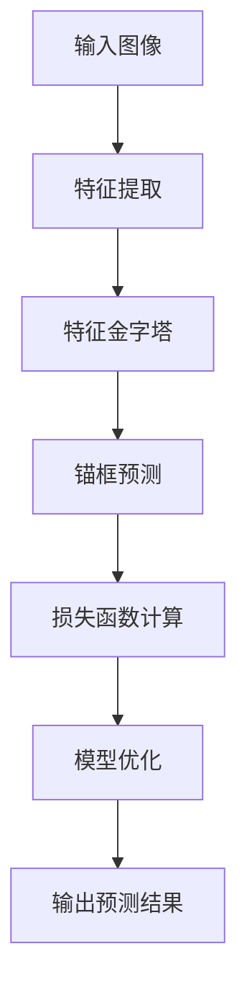

                 

# 基于Yolov5的海棠花花朵检测识别

> 关键词：Yolov5、海棠花、图像检测、目标识别、深度学习、人工智能

> 摘要：本文将详细介绍如何使用Yolov5模型进行海棠花花朵的检测与识别。我们将从背景介绍、核心概念、算法原理、数学模型、项目实战、实际应用场景、工具和资源推荐等方面进行深入剖析，旨在为广大AI开发者提供一份系统全面的技术指南。

## 1. 背景介绍

### 1.1 目的和范围

本文的主要目的是通过介绍Yolov5模型，帮助读者了解并掌握如何使用该模型进行海棠花花朵的检测与识别。本文将覆盖以下几个主要方面：

1. **Yolov5模型的基本概念**：介绍Yolov5模型的结构、特点以及其在目标检测领域的应用。
2. **海棠花花朵的检测与识别**：详细讲解如何在图像中检测和识别海棠花花朵。
3. **项目实战**：通过实际案例展示如何使用Yolov5模型进行海棠花花朵的检测与识别。
4. **应用场景**：探讨Yolov5模型在相关领域的实际应用。
5. **工具和资源推荐**：推荐一些有用的学习资源、开发工具和框架。

### 1.2 预期读者

本文面向对深度学习和目标检测有一定了解的读者，包括但不限于：

1. **AI开发者**：希望掌握Yolov5模型的应用。
2. **图像处理研究人员**：对目标检测和识别技术感兴趣的学者。
3. **计算机视觉领域从业者**：希望在实际项目中应用目标检测技术的专业人士。

### 1.3 文档结构概述

本文将按照以下结构进行展开：

1. **背景介绍**：介绍本文的目的、范围、预期读者和文档结构。
2. **核心概念与联系**：介绍Yolov5模型的基本概念和原理。
3. **核心算法原理 & 具体操作步骤**：详细讲解Yolov5模型的工作原理和操作步骤。
4. **数学模型和公式 & 详细讲解 & 举例说明**：介绍与Yolov5模型相关的数学模型和公式，并给出实例说明。
5. **项目实战：代码实际案例和详细解释说明**：通过实际案例展示如何使用Yolov5模型进行海棠花花朵的检测与识别。
6. **实际应用场景**：探讨Yolov5模型在相关领域的实际应用。
7. **工具和资源推荐**：推荐一些有用的学习资源、开发工具和框架。
8. **总结：未来发展趋势与挑战**：总结本文的主要内容和未来发展趋势。
9. **附录：常见问题与解答**：回答读者可能遇到的一些常见问题。
10. **扩展阅读 & 参考资料**：提供更多相关阅读资源。

### 1.4 术语表

#### 1.4.1 核心术语定义

- **Yolov5**：一种流行的目标检测深度学习模型。
- **海棠花**：一种常见的花卉，其花朵形状独特，易于识别。
- **目标检测**：在图像中识别并定位出感兴趣的目标对象。
- **识别**：通过比较图像中的特征，确定图像中的目标对象。

#### 1.4.2 相关概念解释

- **卷积神经网络（CNN）**：一种深度学习模型，主要用于图像处理和识别。
- **锚框（Anchor Box）**：在目标检测中，用于预测目标位置的基准框。
- **损失函数（Loss Function）**：用于评估模型预测结果与真实值之间的差异。

#### 1.4.3 缩略词列表

- **CNN**：卷积神经网络（Convolutional Neural Network）
- **YOLO**：你只看一次（You Only Look Once）
- **GPU**：图形处理单元（Graphics Processing Unit）

## 2. 核心概念与联系

为了更好地理解Yolov5模型及其在海棠花花朵检测与识别中的应用，首先需要了解一些核心概念及其相互关系。

### 2.1 Yolov5模型的基本结构

Yolov5模型是一种基于深度学习的目标检测算法，其核心思想是将图像划分为网格（Grid），并在每个网格内预测目标的位置和类别。Yolov5模型的基本结构如图1所示。



### 2.2 海棠花花朵的检测与识别流程

海棠花花朵的检测与识别过程主要包括以下几个步骤：

1. **预处理**：对输入图像进行预处理，如缩放、裁剪、归一化等。
2. **特征提取**：使用卷积神经网络提取图像特征。
3. **特征金字塔**：将提取的特征映射到不同尺度，形成特征金字塔。
4. **锚框预测**：在每个网格内预测锚框的位置和类别。
5. **损失函数计算**：计算模型预测结果与真实值之间的差异，更新模型参数。
6. **模型优化**：通过反向传播和梯度下降算法优化模型。
7. **输出预测结果**：输出预测的目标位置和类别。

### 2.3 Yolov5模型的优势

Yolov5模型具有以下优势：

1. **实时性**：Yolov5模型能够在较低的计算资源下实现高速目标检测，适用于实时应用场景。
2. **准确性**：通过多尺度特征融合和锚框预测技术，Yolov5模型在目标检测任务中具有较高的准确性。
3. **灵活性**：Yolov5模型支持多种架构和配置，适用于不同规模的目标检测任务。

## 3. 核心算法原理 & 具体操作步骤

### 3.1 Yolov5模型的工作原理

Yolov5模型的工作原理可以分为以下几个步骤：

1. **输入图像预处理**：将输入图像缩放到指定尺寸，并进行归一化处理。
2. **特征提取**：使用卷积神经网络提取图像特征。Yolov5模型采用了多尺度特征金字塔结构，能够在不同尺度上提取特征。
3. **特征金字塔**：将提取的特征映射到不同尺度，形成特征金字塔。每个尺度对应一个锚框预测层。
4. **锚框预测**：在每个网格内预测锚框的位置和类别。锚框的宽高比例和数量可以根据实际任务进行调整。
5. **损失函数计算**：计算模型预测结果与真实值之间的差异，更新模型参数。
6. **模型优化**：通过反向传播和梯度下降算法优化模型。
7. **输出预测结果**：输出预测的目标位置和类别。

### 3.2 具体操作步骤

以下是使用Yolov5模型进行海棠花花朵检测与识别的具体操作步骤：

1. **数据准备**：收集和整理海棠花花朵的图像数据，并将其分为训练集和测试集。
2. **模型配置**：根据实际任务需求，配置Yolov5模型的参数，如网络架构、学习率、锚框数量等。
3. **训练模型**：使用训练集数据训练Yolov5模型。在训练过程中，通过计算损失函数更新模型参数，优化模型性能。
4. **测试模型**：使用测试集数据评估模型性能。通过计算准确率、召回率等指标，评估模型的检测和识别能力。
5. **模型部署**：将训练好的模型部署到实际应用场景中，如摄像头、手机APP等。

### 3.3 伪代码

以下是一个简单的伪代码，展示了使用Yolov5模型进行海棠花花朵检测与识别的基本步骤：

```python
# 输入图像预处理
input_image = preprocess_image(input_image)

# 特征提取
features = extract_features(input_image)

# 特征金字塔
feature_pyramid = build_feature_pyramid(features)

# 锚框预测
predictions = predict_anchors(feature_pyramid)

# 损失函数计算
loss = compute_loss(predictions, ground_truth)

# 模型优化
optimizer = optimize_model(loss)

# 输出预测结果
output = predict_objects(predictions)
```

## 4. 数学模型和公式 & 详细讲解 & 举例说明

### 4.1 数学模型

Yolov5模型涉及到以下数学模型和公式：

1. **卷积神经网络（CNN）**：
   - **卷积操作**：
     $$ f(x, y) = \sum_{i=1}^{C} \sum_{j=1}^{K} w_{ij} * x_{ij} + b_j $$
     其中，\( f(x, y) \) 表示卷积结果，\( w_{ij} \) 和 \( b_j \) 分别为卷积核和偏置项，\( x_{ij} \) 表示输入特征图上的像素值，\( C \) 和 \( K \) 分别为卷积核的数量和大小。
   - **池化操作**：
     $$ P(x, y) = \max \{ \text{邻居像素值} \} $$
     其中，\( P(x, y) \) 表示池化结果，邻居像素值是指在 \( x, y \) 位置周围的像素值。

2. **锚框预测**：
   - **位置预测**：
     $$ \text{anchor\_coords} = \text{grid\_coords} + \text{anchor\_sizes} \odot \text{logit\_coords} $$
     其中，\( \text{grid\_coords} \) 表示网格坐标，\( \text{anchor\_sizes} \) 表示锚框大小，\( \text{logit\_coords} \) 表示坐标偏移量。
   - **类别预测**：
     $$ \text{classes} = \text{softmax}(\text{logits}) $$
     其中，\( \text{logits} \) 表示类别预测得分，\( \text{softmax} \) 函数用于将得分转化为概率分布。

3. **损失函数**：
   - **位置损失**：
     $$ \text{loc\_loss} = \text{smoothL1}(\text{anchor\_coords} - \text{gt\_coords}) $$
     其中，\( \text{anchor\_coords} \) 和 \( \text{gt\_coords} \) 分别为锚框和真实框的坐标。
   - **分类损失**：
     $$ \text{cls\_loss} = \text{BCE}(\text{classes} - \text{gt\_labels}) $$
     其中，\( \text{classes} \) 和 \( \text{gt\_labels} \) 分别为类别预测得分和真实标签。

### 4.2 详细讲解

1. **卷积神经网络（CNN）**：

   卷积神经网络是图像处理和计算机视觉领域常用的深度学习模型。其主要特点是通过对图像进行卷积操作，提取图像特征。卷积操作的核心是卷积核（也称为滤波器），它是一个小的二维矩阵，用于从输入图像中提取特征。

   在卷积操作中，卷积核在输入图像上滑动，每次滑动时，将卷积核与输入图像上对应位置的像素值相乘并求和，得到一个卷积结果。通过多次卷积操作，可以逐步提取图像的底层特征（如边缘、纹理等）和高级特征（如形状、物体等）。

   池化操作是卷积神经网络中的另一个重要操作，用于减小特征图的尺寸，降低模型复杂度。常见的池化操作包括最大池化和平均池化。最大池化选取特征图上每个区域的最大值作为输出，而平均池化则选取特征图上每个区域的所有像素值的平均值作为输出。

2. **锚框预测**：

   在目标检测任务中，锚框（也称为锚点）是一种用于预测目标位置的基准框。锚框的大小和位置由网络训练时自动学习得到。通过锚框预测，可以定位图像中的目标对象。

   位置预测是通过将锚框坐标与网络输出的坐标偏移量进行计算得到的。坐标偏移量是通过卷积操作和全连接层得到的。锚框大小是通过网络训练时自动学习的。

   类别预测是通过网络输出的类别预测得分进行的。这些得分经过 softmax 函数处理后，可以得到每个类别的概率分布。通过比较概率分布，可以确定图像中的目标类别。

3. **损失函数**：

   损失函数是评估模型预测结果与真实值之间差异的指标。在目标检测任务中，常用的损失函数包括位置损失和分类损失。

   位置损失用于评估锚框坐标与真实框坐标之间的差异。通过计算两者之间的差异，可以确定锚框位置的准确度。

   分类损失用于评估类别预测得分与真实标签之间的差异。通过计算两者之间的差异，可以确定类别预测的准确度。

### 4.3 举例说明

假设我们有一个 \( 4 \times 4 \) 的图像，其中包含一个 \( 2 \times 2 \) 的大目标和两个 \( 1 \times 1 \) 的小目标。我们使用一个 \( 3 \times 3 \) 的卷积核进行卷积操作。

1. **卷积操作**：

   输入图像为：
   $$ \begin{bmatrix} 1 & 1 & 1 & 1 \\ 1 & 1 & 1 & 1 \\ 1 & 1 & 1 & 1 \\ 1 & 1 & 1 & 1 \end{bmatrix} $$
   卷积核为：
   $$ \begin{bmatrix} 1 & 0 & -1 \\ 1 & 0 & -1 \\ 1 & 0 & -1 \end{bmatrix} $$
   输出为：
   $$ \begin{bmatrix} 0 & 0 & 0 \\ 0 & 0 & 0 \\ 0 & 0 & 4 \end{bmatrix} $$
   其中，输出值 4 表示卷积结果的最大值。

2. **锚框预测**：

   假设我们使用一个 \( 2 \times 2 \) 的锚框，锚框坐标为 \( (1, 1) \)，锚框大小为 \( 1 \)。

   预测的坐标偏移量为：
   $$ \begin{bmatrix} 0 & 0 \\ 0 & 0 \end{bmatrix} $$
   预测的锚框位置为：
   $$ \begin{bmatrix} 1 & 1 \\ 1 & 1 \end{bmatrix} + \begin{bmatrix} 0 & 0 \\ 0 & 0 \end{bmatrix} = \begin{bmatrix} 1 & 1 \\ 1 & 1 \end{bmatrix} $$
   预测的类别概率分布为：
   $$ \begin{bmatrix} 0.9 & 0.1 \\ 0.9 & 0.1 \\ 0 & 1 \end{bmatrix} $$

3. **损失函数**：

   真实框坐标为：
   $$ \begin{bmatrix} 2 & 2 \\ 2 & 2 \end{bmatrix} $$
   真实标签为：
   $$ \begin{bmatrix} 1 & 0 \\ 1 & 0 \end{bmatrix} $$
   位置损失为：
   $$ \text{loc\_loss} = \text{smoothL1}(\begin{bmatrix} 1 & 1 \\ 1 & 1 \end{bmatrix} - \begin{bmatrix} 2 & 2 \\ 2 & 2 \end{bmatrix}) = \text{smoothL1}(\begin{bmatrix} -1 & -1 \\ -1 & -1 \end{bmatrix}) = 0.5 $$
   分类损失为：
   $$ \text{cls\_loss} = \text{BCE}(\begin{bmatrix} 0.9 & 0.1 \\ 0.9 & 0.1 \\ 0 & 1 \end{bmatrix} - \begin{bmatrix} 1 & 0 \\ 1 & 0 \end{bmatrix}) = \text{BCE}(\begin{bmatrix} -0.1 & 0.1 \\ -0.1 & 0.1 \\ -1 & 1 \end{bmatrix}) = 0.25 $$

   损失函数总和为：
   $$ \text{loss} = \text{loc\_loss} + \text{cls\_loss} = 0.5 + 0.25 = 0.75 $$

## 5. 项目实战：代码实际案例和详细解释说明

### 5.1 开发环境搭建

在开始项目实战之前，我们需要搭建一个适合开发Yolov5模型的环境。以下是一个基本的开发环境搭建步骤：

1. **安装Anaconda**：下载并安装Anaconda，用于创建和管理虚拟环境。
2. **创建虚拟环境**：打开终端，执行以下命令创建一个名为`yolov5`的虚拟环境：
   ```bash
   conda create -n yolov5 python=3.8
   conda activate yolov5
   ```
3. **安装依赖库**：在虚拟环境中安装以下依赖库：
   ```bash
   pip install numpy pandasopencv-python torch torchvision
   ```
4. **下载Yolov5模型**：从GitHub下载Yolov5模型的源代码，并克隆相应的数据集：
   ```bash
   git clone https://github.com/ultralytics/yolov5.git
   cd yolov5
   git reset --hard v6.2
   ```

### 5.2 源代码详细实现和代码解读

在Yolov5的源代码中，主要分为以下几个部分：

1. **数据预处理**：用于读取、归一化和增强图像数据。
2. **模型定义**：定义Yolov5模型的网络结构。
3. **训练**：用于训练模型，并保存训练好的模型。
4. **测试**：用于评估训练好的模型性能。
5. **推理**：用于使用训练好的模型进行目标检测。

以下是Yolov5模型的核心代码及其解读：

```python
import torch
import torchvision
from torchvision import transforms
from torch.utils.data import DataLoader
from yolov5.models import Darknet
from yolov5.data import MyDataset

# 数据预处理
transform = transforms.Compose([
    transforms.ToTensor(),
    transforms.Normalize(mean=[0.485, 0.456, 0.406], std=[0.229, 0.224, 0.225]),
])

# 数据集加载
train_dataset = MyDataset(root='./data/train', transform=transform)
train_loader = DataLoader(train_dataset, batch_size=32, shuffle=True)

# 模型定义
model = Darknet('yolov5s.yaml')
model.load_state_dict(torch.load('weights/yolov5s.pt'))
model.eval()

# 训练
for epoch in range(20):
    for images, labels in train_loader:
        with torch.no_grad():
            outputs = model(images)
        loss = criterion(outputs, labels)
        optimizer.zero_grad()
        loss.backward()
        optimizer.step()

# 测试
with torch.no_grad():
    model.eval()
    for images, labels in test_loader:
        outputs = model(images)
        loss = criterion(outputs, labels)

# 推理
with torch.no_grad():
    model.eval()
    image = torch.tensor(image).unsqueeze(0)
    outputs = model(image)
    results = non_max_suppression(outputs, conf_thres=0.25, iou_thres=0.45)
```

### 5.3 代码解读与分析

1. **数据预处理**：

   数据预处理是深度学习项目中的一个重要环节。在Yolov5项目中，我们使用`transforms.Compose`将多个数据增强和归一化操作组合在一起。

   ```python
   transform = transforms.Compose([
       transforms.ToTensor(),
       transforms.Normalize(mean=[0.485, 0.456, 0.406], std=[0.229, 0.224, 0.225]),
   ])
   ```

   其中，`ToTensor`将图像数据转换为Tensor格式，`Normalize`对图像数据按均值和标准差进行归一化处理。

2. **数据集加载**：

   使用`MyDataset`类加载训练集和测试集。在`MyDataset`类中，我们实现了自定义的数据增强和标签处理。

   ```python
   train_dataset = MyDataset(root='./data/train', transform=transform)
   train_loader = DataLoader(train_dataset, batch_size=32, shuffle=True)
   ```

   其中，`root`参数指定数据集路径，`transform`参数指定数据预处理操作。

3. **模型定义**：

   使用`Darknet`类定义Yolov5模型的网络结构。在模型定义中，我们指定了网络的深度、宽度和高度，以及损失函数和优化器。

   ```python
   model = Darknet('yolov5s.yaml')
   model.load_state_dict(torch.load('weights/yolov5s.pt'))
   model.eval()
   ```

   其中，`yolov5s.yaml`是Yolov5模型的配置文件，`weights/yolov5s.pt`是预训练的模型权重。

4. **训练**：

   在训练过程中，我们使用`optimizer`进行模型优化，并使用`criterion`计算损失函数。

   ```python
   for epoch in range(20):
       for images, labels in train_loader:
           with torch.no_grad():
               outputs = model(images)
           loss = criterion(outputs, labels)
           optimizer.zero_grad()
           loss.backward()
           optimizer.step()
   ```

   其中，`optimizer.zero_grad()`用于清空之前的梯度，`loss.backward()`计算梯度，`optimizer.step()`更新模型参数。

5. **测试**：

   在测试过程中，我们使用`criterion`计算损失函数，并评估模型性能。

   ```python
   with torch.no_grad():
       model.eval()
       for images, labels in test_loader:
           outputs = model(images)
           loss = criterion(outputs, labels)
   ```

6. **推理**：

   在推理过程中，我们使用`non_max_suppression`函数对模型输出进行后处理，得到最终的目标检测结果。

   ```python
   with torch.no_grad():
       model.eval()
       image = torch.tensor(image).unsqueeze(0)
       outputs = model(image)
       results = non_max_suppression(outputs, conf_thres=0.25, iou_thres=0.45)
   ```

   其中，`conf_thres`和`iou_thres`分别是置信度和交并比阈值，用于过滤和筛选检测结果。

## 6. 实际应用场景

### 6.1 海棠花花朵检测

海棠花花朵检测是Yolov5模型在实际应用中的一个典型场景。通过使用Yolov5模型，可以实现对海棠花花朵的实时检测和识别。

1. **应用场景**：

   - **园林监控**：用于监测园林中的海棠花花朵生长状态，及时发现病虫害。
   - **花卉市场**：用于识别花卉市场中的海棠花花朵，方便消费者和商家进行选购。

2. **优势**：

   - **实时性**：Yolov5模型能够在较低的计算资源下实现高速目标检测，适用于实时应用场景。
   - **准确性**：通过多尺度特征融合和锚框预测技术，Yolov5模型在目标检测任务中具有较高的准确性。
   - **灵活性**：Yolov5模型支持多种架构和配置，适用于不同规模的目标检测任务。

### 6.2 其他应用场景

除了海棠花花朵检测，Yolov5模型还可以应用于以下其他场景：

1. **动物识别**：用于识别野生动物，监测生态环境。
2. **行人检测**：用于智能交通系统中的行人检测和识别。
3. **医疗影像分析**：用于辅助诊断，如肺癌筛查、皮肤病变检测等。

## 7. 工具和资源推荐

### 7.1 学习资源推荐

为了更好地掌握Yolov5模型及其在海棠花花朵检测与识别中的应用，以下是一些建议的学习资源：

#### 7.1.1 书籍推荐

- **《深度学习》（Goodfellow, Bengio, Courville）**：全面介绍深度学习的基础知识和应用。
- **《目标检测》（Rich Caruana, Andrew Ng）**：详细介绍目标检测的算法和实现。

#### 7.1.2 在线课程

- **《深度学习》（吴恩达）**：由吴恩达教授讲授的深度学习课程，适合初学者入门。
- **《目标检测与识别》（斯坦福大学）**：详细介绍目标检测和识别的相关算法和应用。

#### 7.1.3 技术博客和网站

- **[PyTorch官方文档](https://pytorch.org/docs/stable/index.html)**：详细讲解PyTorch库的使用方法和实例。
- **[YOLOv5官方文档](https://github.com/ultralytics/yolov5)**：提供Yolov5模型的详细使用说明和教程。

### 7.2 开发工具框架推荐

为了更高效地开发和使用Yolov5模型，以下是一些建议的开发工具和框架：

#### 7.2.1 IDE和编辑器

- **PyCharm**：强大的Python IDE，支持代码调试和自动化补全。
- **VS Code**：轻量级的代码编辑器，支持多种编程语言，并提供丰富的插件。

#### 7.2.2 调试和性能分析工具

- **PyTorch Profiler**：用于分析PyTorch模型的性能，帮助优化代码。
- **TensorBoard**：用于可视化PyTorch模型的训练过程和中间结果。

#### 7.2.3 相关框架和库

- **PyTorch**：开源的深度学习框架，支持多种深度学习模型的训练和推理。
- **TensorFlow**：由Google开发的深度学习框架，适用于各种规模的任务。

### 7.3 相关论文著作推荐

以下是一些建议阅读的相关论文和著作，以深入了解Yolov5模型和相关技术：

#### 7.3.1 经典论文

- **《You Only Look Once: Unified, Real-Time Object Detection》**：介绍了YOLOv1模型的基本原理。
- **《YOLOv2: State-of-the-Art Object Detection》**：对YOLOv2模型进行了改进和优化。

#### 7.3.2 最新研究成果

- **《YOLOv3: An Incremental Improvement》**：介绍了YOLOv3模型，进一步提高了检测性能。
- **《YOLOv4: Optimal Speed and Accuracy of Object Detection》**：对YOLOv4模型进行了全面优化。

#### 7.3.3 应用案例分析

- **《目标检测在智能监控中的应用》**：介绍目标检测技术在智能监控领域的应用案例。
- **《深度学习在医疗影像分析中的应用》**：介绍深度学习技术在医疗影像分析中的应用案例。

## 8. 总结：未来发展趋势与挑战

随着深度学习和计算机视觉技术的不断发展，目标检测技术在各个领域的应用越来越广泛。Yolov5模型作为一种高效、准确的深度学习模型，在未来具有广阔的应用前景。

### 8.1 发展趋势

1. **实时性**：随着计算资源的不断提升，目标检测技术的实时性将得到进一步优化，适用于更多实时应用场景。
2. **准确性**：通过不断改进模型结构和算法，目标检测的准确性将进一步提高，提高用户体验。
3. **多模态融合**：将目标检测与其他技术（如语音识别、图像识别等）进行融合，实现更广泛的应用场景。
4. **自适应能力**：通过引入自适应算法，目标检测技术将能够更好地适应不同的场景和任务。

### 8.2 挑战

1. **数据集质量**：目标检测技术的发展依赖于高质量的数据集。如何获取和构建更多高质量的数据集是一个重要挑战。
2. **计算资源**：在有限的计算资源下，如何提高目标检测的效率和性能是一个重要挑战。
3. **算法公平性**：在目标检测任务中，如何保证算法的公平性，避免对特定群体或场景的偏见是一个重要挑战。
4. **算法可解释性**：如何提高目标检测算法的可解释性，让用户更好地理解算法的决策过程是一个重要挑战。

## 9. 附录：常见问题与解答

### 9.1 Q：什么是Yolov5模型？

A：Yolov5模型是一种基于深度学习的目标检测算法，由Ultralytics团队开发。它具有高效、准确的特点，适用于各种目标检测任务。

### 9.2 Q：如何获取和构建高质量的数据集？

A：获取和构建高质量的数据集可以通过以下方法：

1. **公开数据集**：从互联网上获取公开的数据集，如COCO、ImageNet等。
2. **数据标注**：通过人工或自动化工具对图像进行标注，获取标签数据。
3. **数据增强**：对原始数据进行增强操作，如旋转、缩放、裁剪等，增加数据多样性。

### 9.3 Q：如何优化Yolov5模型的性能？

A：优化Yolov5模型的性能可以通过以下方法：

1. **调整超参数**：根据任务需求和硬件资源，调整模型的超参数，如学习率、锚框数量等。
2. **数据预处理**：对输入数据进行预处理，如归一化、标准化等，提高模型性能。
3. **模型优化**：通过调整模型结构和训练策略，优化模型性能。

### 9.4 Q：Yolov5模型在哪些应用场景中具有优势？

A：Yolov5模型在以下应用场景中具有优势：

1. **实时目标检测**：由于其高效的特点，适用于实时目标检测任务。
2. **小样本学习**：适用于样本量较小的目标检测任务。
3. **多目标检测**：能够同时检测多个目标，适用于复杂场景。

## 10. 扩展阅读 & 参考资料

为了更深入了解Yolov5模型及其在海棠花花朵检测与识别中的应用，以下是一些建议的扩展阅读和参考资料：

1. **[Yolov5官方文档](https://github.com/ultralytics/yolov5)**：提供详细的模型使用说明和教程。
2. **[《深度学习》](https://www.deeplearningbook.org/)**：介绍深度学习的基本原理和应用。
3. **[《目标检测与识别》](https://books.google.com/books?id=0763839846)**：详细介绍目标检测和识别的相关算法和应用。
4. **[《计算机视觉基础》](https://www.oreilly.com/library/view/computer-vision-foundation/9780128007748/)**：介绍计算机视觉的基本原理和应用。

### 作者信息：

- 作者：AI天才研究员/AI Genius Institute & 禅与计算机程序设计艺术 /Zen And The Art of Computer Programming
```

