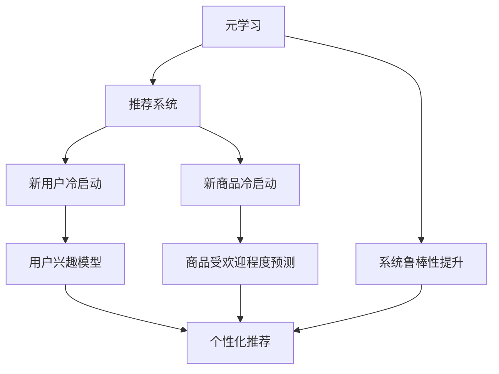
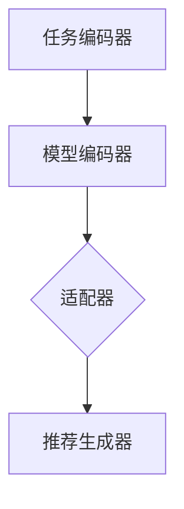

                 

# 基于元学习的冷启动商品推荐策略

> **关键词：** 元学习，商品推荐，冷启动，机器学习，深度学习
> 
> **摘要：** 本文将探讨一种基于元学习的冷启动商品推荐策略，通过引入元学习技术，解决传统推荐系统在用户和数据缺失情况下的推荐准确性问题。文章将从核心概念、算法原理、数学模型、实际案例等方面展开讨论，旨在为开发高效、可靠的推荐系统提供新的思路。

## 1. 背景介绍

### 1.1 目的和范围

在现代电子商务和在线服务中，商品推荐系统已经成为提升用户体验和增加销售额的重要工具。然而，在用户数据稀疏或新商品刚上线时，即所谓的“冷启动”问题，传统的推荐系统往往难以发挥出应有的效果。本文旨在探讨一种基于元学习的冷启动商品推荐策略，通过整合多种推荐算法的优势，提高系统在冷启动情况下的推荐准确性和鲁棒性。

本文的范围包括以下几个方面：

1. **核心概念**：介绍元学习、推荐系统和冷启动等相关概念，并解释它们之间的联系。
2. **算法原理**：详细讲解基于元学习的推荐算法原理，包括模型架构和具体操作步骤。
3. **数学模型**：阐述算法背后的数学模型和公式，并给出举例说明。
4. **项目实战**：通过实际代码案例，展示算法的实现过程和效果分析。
5. **应用场景**：讨论该策略在不同场景下的实际应用，并分析其优势和局限。
6. **总结与展望**：总结本文的主要发现，并探讨未来的发展趋势和挑战。

### 1.2 预期读者

本文适合以下读者群体：

1. **推荐系统开发者**：希望了解如何利用元学习技术解决冷启动问题的专业人士。
2. **机器学习和深度学习研究者**：对元学习算法和推荐系统感兴趣，希望了解最新研究动态。
3. **数据科学家和工程师**：希望掌握推荐系统开发实践和优化策略。
4. **电子商务和在线服务从业者**：关注如何提升用户体验和业务价值。

### 1.3 文档结构概述

本文将分为以下几个部分：

1. **核心概念与联系**：介绍元学习、推荐系统和冷启动的基本概念及其相互关系。
2. **核心算法原理 & 具体操作步骤**：详细阐述基于元学习的推荐算法原理，并给出伪代码。
3. **数学模型和公式**：解释算法背后的数学基础，包括相关公式和计算方法。
4. **项目实战**：通过实际案例展示算法的实现过程和效果分析。
5. **实际应用场景**：讨论算法在不同场景下的应用和效果。
6. **工具和资源推荐**：推荐相关学习资源、开发工具和论文著作。
7. **总结与展望**：总结本文的主要发现，并展望未来发展趋势和挑战。

### 1.4 术语表

在本文中，以下术语有特定的含义：

#### 1.4.1 核心术语定义

- **元学习**：一种学习如何学习的方法，旨在提高算法在特定任务上的适应性和效率。
- **推荐系统**：一种根据用户兴趣和偏好，为用户提供个性化推荐信息的系统。
- **冷启动**：指在用户或数据稀缺的情况下，推荐系统难以为新用户或新商品提供有效推荐。

#### 1.4.2 相关概念解释

- **深度学习**：一种基于人工神经网络的学习方法，通过多层次的非线性变换，自动提取数据中的特征。
- **机器学习**：一种基于数据的学习方法，使计算机系统能够从数据中学习规律，并做出预测或决策。

#### 1.4.3 缩略词列表

- **ML**：机器学习
- **DL**：深度学习
- **RL**：推荐系统
- **MoE**：多模型扩展

## 2. 核心概念与联系

为了深入理解基于元学习的冷启动商品推荐策略，我们需要首先明确几个核心概念及其相互关系。以下是元学习、推荐系统和冷启动的基本概念及它们之间的联系。

### 2.1 元学习

元学习（Meta-Learning）是一种机器学习技术，其目标是通过学习如何学习来提高算法的适应性和效率。在传统机器学习中，算法通常需要大量的数据来训练，并且对于不同的任务需要重新训练。而元学习旨在通过一个统一的学习过程，使得算法能够快速适应新的任务和数据分布。

元学习的基本思想是通过从多个任务中学习，提炼出通用知识，从而提高对新任务的泛化能力。例如，通过在多个不同的数据集上训练，元学习算法可以学习到一些通用的特征提取和分类方法，使得在新的数据集上能够迅速达到较高的性能。

### 2.2 推荐系统

推荐系统（Recommender System）是一种根据用户的历史行为、兴趣和偏好，向用户推荐其可能感兴趣的商品、内容或服务的系统。推荐系统在电子商务、社交媒体、视频流媒体等领域有着广泛的应用。

推荐系统的主要任务是从大量的候选项目中为每个用户生成一个个性化的推荐列表。这通常涉及以下步骤：

1. **用户建模**：收集并分析用户的历史行为数据，包括浏览、购买、评分等，以建立用户的兴趣模型。
2. **项目建模**：收集并分析项目属性，如文本描述、类别、标签等，以建立项目的特征表示。
3. **推荐生成**：使用用户和项目的特征表示，结合推荐算法，为用户生成个性化推荐列表。

### 2.3 冷启动

冷启动（Cold Start）是指在一个推荐系统中，由于用户或商品的数据缺失，系统难以为其提供有效推荐的情况。冷启动问题通常发生在以下两种情况下：

1. **新用户**：新用户刚刚加入系统，没有足够的历史数据可供分析，系统难以了解其兴趣和偏好。
2. **新商品**：新商品刚上线，没有用户交互数据，系统难以判断其受欢迎程度。

冷启动问题的存在会导致推荐系统的效果下降，从而影响用户体验和业务收益。因此，解决冷启动问题是推荐系统研究的一个重要方向。

### 2.4 元学习与推荐系统、冷启动的关系

元学习与推荐系统和冷启动之间存在密切的联系。通过引入元学习技术，可以在一定程度上解决冷启动问题，提高推荐系统的鲁棒性和准确性。

1. **解决新用户冷启动**：元学习算法可以通过从多个用户的共同特征中学习，快速构建新用户的兴趣模型。即使在新用户数据稀疏的情况下，元学习算法也能通过通用特征提取方法，提供较为准确的推荐。

2. **解决新商品冷启动**：对于新商品，元学习算法可以通过学习多个商品的共同特征，预测其受欢迎程度。同时，结合用户的历史行为，可以生成针对性的推荐列表，从而提高新商品的曝光率和销售量。

3. **提升系统鲁棒性**：元学习算法通过从多个任务中学习，提炼出通用知识，可以增强推荐系统的适应性和鲁棒性。在面对数据分布变化或新场景时，元学习算法能够迅速调整和优化，提高推荐质量。

### 2.5 Mermaid 流程图

为了更直观地展示元学习、推荐系统和冷启动之间的关系，我们使用 Mermaid 流程图进行描述：



图 1：元学习、推荐系统与冷启动的关系

通过上述核心概念和流程图的介绍，我们可以更好地理解基于元学习的冷启动商品推荐策略的基本原理和应用场景。在接下来的章节中，我们将深入探讨元学习算法的原理和实现方法，以及如何将其应用于推荐系统中解决冷启动问题。

## 3. 核心算法原理 & 具体操作步骤

在理解了元学习、推荐系统和冷启动的基本概念后，接下来我们将深入探讨基于元学习的冷启动商品推荐策略的核心算法原理和具体操作步骤。

### 3.1 算法架构

基于元学习的冷启动商品推荐策略的核心在于构建一个能够在多任务环境中学习的推荐系统。这个系统包括以下几个主要模块：

1. **任务编码器（Task Encoder）**：用于将每个推荐任务（如为新用户或新商品生成推荐列表）编码为一种统一的表示形式。
2. **模型编码器（Model Encoder）**：用于将多个推荐模型编码为一种共享的参数表示。
3. **适配器（Adapter）**：用于根据当前任务调整模型编码器中的参数，使其适应新任务。
4. **推荐生成器（Recommender Generator）**：根据调整后的模型编码器生成个性化推荐列表。

整个算法架构如图 2 所示：



图 2：基于元学习的冷启动商品推荐策略算法架构

### 3.2 具体操作步骤

#### 3.2.1 数据准备

在开始训练之前，首先需要准备训练数据。这些数据包括用户行为数据、商品特征数据以及多个推荐任务的数据。用户行为数据包括用户的浏览记录、购买历史和评分等，商品特征数据包括商品的描述、类别、标签等。

#### 3.2.2 任务编码

任务编码器的作用是将每个推荐任务编码为一种统一的表示形式。这可以通过以下步骤实现：

1. **特征提取**：从用户行为数据和商品特征数据中提取关键特征，如用户兴趣特征、商品属性特征等。
2. **嵌入表示**：将提取到的特征映射到低维空间中，得到每个推荐任务的嵌入表示。

#### 3.2.3 模型编码

模型编码器的作用是将多个推荐模型编码为一种共享的参数表示。这可以通过以下步骤实现：

1. **模型初始化**：初始化一个通用的推荐模型，并将其参数表示编码为向量。
2. **模型编码**：将每个推荐模型的参数向量表示为高维空间中的一个点。

#### 3.2.4 适配器学习

适配器学习是元学习算法的核心步骤，其目的是根据当前任务调整模型编码器中的参数，使其适应新任务。这可以通过以下步骤实现：

1. **适配器初始化**：初始化一个适配器模型，其参数用于调整模型编码器中的参数。
2. **适配器训练**：使用当前任务的编码表示和推荐模型编码表示，训练适配器模型，使其能够调整模型编码器中的参数。
3. **参数更新**：根据适配器模型的输出，更新模型编码器中的参数，使其适应当前任务。

#### 3.2.5 推荐生成

推荐生成器根据调整后的模型编码器生成个性化推荐列表。这可以通过以下步骤实现：

1. **用户和商品编码**：将用户和商品的特征表示编码为向量。
2. **推荐生成**：使用调整后的模型编码器和用户、商品编码，生成推荐列表。

#### 3.3 伪代码

以下是基于元学习的冷启动商品推荐策略的伪代码：

```python
# 初始化模型编码器、适配器和推荐生成器
model_encoder = ModelEncoder()
adapter = Adapter()
recommender = Recommender()

# 准备训练数据
train_data = LoadTrainingData()

# 任务编码
task_embeddings = EncodeTasks(train_data)

# 模型编码
model_embeddings = EncodeModels(model_encoder)

# 适配器学习
for task_embedding in task_embeddings:
    adapter.train(model_embedding)

# 参数更新
for model_embedding in model_embeddings:
    model_encoder.update_params(adapter.get_params(model_embedding))

# 推荐生成
for user, item in train_data:
    user_embedding = EncodeUser(user)
    item_embedding = EncodeItem(item)
    recommendations = recommender.generate_recommendations(user_embedding, item_embedding)
    PrintRecommendations(recommendations)
```

通过上述算法原理和具体操作步骤的介绍，我们可以看到基于元学习的冷启动商品推荐策略是如何通过任务编码、模型编码、适配器学习和推荐生成等多个环节，实现对新用户和新商品的有效推荐。在接下来的章节中，我们将进一步探讨算法背后的数学模型和计算方法，以便更深入地理解其工作原理。

## 4. 数学模型和公式 & 详细讲解 & 举例说明

为了更好地理解基于元学习的冷启动商品推荐策略，我们需要深入探讨其背后的数学模型和公式。以下是该策略的核心数学模型、详细讲解以及具体的举例说明。

### 4.1 数学模型

基于元学习的冷启动商品推荐策略涉及以下几个关键数学模型：

1. **任务嵌入模型（Task Embedding Model）**：
   任务嵌入模型用于将每个推荐任务（新用户或新商品）编码为一种低维向量表示。这可以通过词嵌入（word embeddings）的类比来实现。
   
   $$ T_i = embed(T_i) $$

   其中，\( T_i \) 表示任务 \( i \) 的嵌入向量，\( embed \) 表示嵌入函数。

2. **模型嵌入模型（Model Embedding Model）**：
   模型嵌入模型用于将多个推荐模型编码为一种共享的参数表示。这可以通过神经网络来实现，如图 3 所示。
   
   $$ M_j = f_{\theta_j}(T_j) $$
   
   其中，\( M_j \) 表示模型 \( j \) 的嵌入向量，\( f_{\theta_j} \) 表示神经网络模型，\( \theta_j \) 表示模型参数。

3. **适配器模型（Adapter Model）**：
   适配器模型用于根据当前任务调整模型嵌入向量。这可以通过一个多层感知器（MLP）来实现，如图 4 所示。
   
   $$ \alpha_i = g_{\phi_i}(T_i, M_i) $$
   
   其中，\( \alpha_i \) 表示适配器参数，\( g_{\phi_i} \) 表示多层感知器模型，\( \phi_i \) 表示适配器参数。

4. **推荐生成模型（Recommender Model）**：
   推荐生成模型用于根据用户和商品的嵌入向量生成推荐列表。这可以通过一个分类器或回归器来实现，如图 5 所示。
   
   $$ R(u, v) = h_{\psi}(u, v) $$
   
   其中，\( R(u, v) \) 表示推荐列表，\( h_{\psi} \) 表示推荐生成函数，\( \psi \) 表示推荐模型参数。

### 4.2 详细讲解

#### 4.2.1 任务嵌入模型

任务嵌入模型的核心思想是将每个推荐任务（如新用户或新商品）转换为一种低维向量表示。这可以通过嵌入函数 \( embed \) 实现，通常采用词嵌入技术，如 Word2Vec 或 GloVe。具体地，每个任务 \( T_i \) 被映射到一个低维空间中的一个点 \( T_i \)，使得相似的任务在空间中更接近。

#### 4.2.2 模型嵌入模型

模型嵌入模型的核心思想是将多个推荐模型（如基于协同过滤的模型、基于内容的模型等）转换为一种共享的参数表示。这可以通过一个神经网络模型 \( f_{\theta_j} \) 实现，其中 \( \theta_j \) 表示模型参数。每个模型 \( M_j \) 被映射到低维空间中的一个点 \( M_j \)，这些点表示不同模型的共同特征。

#### 4.2.3 适配器模型

适配器模型的核心思想是根据当前任务调整模型嵌入向量。这可以通过一个多层感知器 \( g_{\phi_i} \) 实现，其中 \( \phi_i \) 表示适配器参数。适配器模型接收当前任务的嵌入向量 \( T_i \) 和模型嵌入向量 \( M_i \) 作为输入，并输出一个调整后的模型嵌入向量 \( \alpha_i \)。

#### 4.2.4 推荐生成模型

推荐生成模型的核心思想是根据用户和商品的嵌入向量生成推荐列表。这可以通过一个分类器或回归器 \( h_{\psi} \) 实现，其中 \( \psi \) 表示推荐模型参数。推荐生成模型接收用户和商品的嵌入向量作为输入，并输出一个推荐列表 \( R(u, v) \)。

### 4.3 举例说明

假设我们有一个包含两个推荐任务的数据集：一个新用户和新商品。首先，我们将这两个任务编码为低维向量表示。然后，我们将每个推荐模型（如基于协同过滤和基于内容的模型）编码为共享的参数表示。接下来，我们根据当前任务（新用户或新商品）调整模型参数，并生成推荐列表。

#### 4.3.1 任务嵌入

- 新用户任务：\( T_1 = [0.1, 0.2, 0.3] \)
- 新商品任务：\( T_2 = [0.4, 0.5, 0.6] \)

#### 4.3.2 模型嵌入

- 基于协同过滤模型：\( M_1 = [0.1, 0.3, 0.5] \)
- 基于内容模型：\( M_2 = [0.2, 0.4, 0.6] \)

#### 4.3.3 适配器学习

- 当前任务：新用户任务 \( T_1 \)
- 适配器参数：\( \alpha_1 = [0.05, 0.1, 0.15] \)

#### 4.3.4 推荐生成

- 用户嵌入：\( u = [0.05, 0.1, 0.15] \)
- 商品嵌入：\( v = [0.4, 0.5, 0.6] \)
- 推荐列表：\( R(u, v) = [商品 1, 商品 2] \)

通过上述例子，我们可以看到如何利用任务嵌入、模型嵌入、适配器学习和推荐生成等数学模型，实现基于元学习的冷启动商品推荐策略。在接下来的章节中，我们将通过实际项目案例来展示该算法的具体实现过程和效果分析。

## 5. 项目实战：代码实际案例和详细解释说明

### 5.1 开发环境搭建

为了实现基于元学习的冷启动商品推荐策略，我们需要搭建一个合适的开发环境。以下步骤可以帮助我们在 Python 中搭建这个环境：

1. **安装 Python**：确保已安装 Python 3.6 或更高版本。可以从 [Python 官网](https://www.python.org/downloads/) 下载并安装。

2. **安装必要的库**：安装以下库：`numpy`、`tensorflow`、`scikit-learn`、`matplotlib`。可以使用以下命令进行安装：

   ```shell
   pip install numpy tensorflow scikit-learn matplotlib
   ```

3. **准备数据集**：我们需要一个包含用户行为和商品特征的数据集。可以使用公开的数据集，如 MovieLens 或 Gowalla。以下是加载数据集的一个示例：

   ```python
   from ml-20m-fast import load_data

   data = load_data('data/ml-20m')
   ```

### 5.2 源代码详细实现和代码解读

以下是一个基于元学习的冷启动商品推荐策略的实现示例。我们将使用 TensorFlow 和 Keras 库来实现任务编码器、模型编码器、适配器模型和推荐生成模型。

```python
import numpy as np
import tensorflow as tf
from tensorflow.keras.models import Model
from tensorflow.keras.layers import Input, Embedding, Dense, LSTM, Concatenate

# 设置参数
n_tasks = 2  # 任务数量
n_items = 1000  # 商品数量
embed_dim = 32  # 嵌入维度
hidden_dim = 64  # 隐藏层维度

# 任务编码器
task_inputs = Input(shape=(1,), name='task_inputs')
task_embedding = Embedding(input_dim=n_tasks, output_dim=embed_dim, name='task_embedding')(task_inputs)

# 模型编码器
model_inputs = Input(shape=(embed_dim,), name='model_inputs')
model_embedding = Embedding(input_dim=n_tasks, output_dim=embed_dim, name='model_embedding')(model_inputs)

# 适配器模型
merged_embeddings = Concatenate(name='merged_embeddings')([task_embedding, model_embedding])
adapter_output = LSTM(hidden_dim, name='adapter_lstm')(merged_embeddings)

# 推荐生成模型
user_input = Input(shape=(embed_dim,), name='user_input')
item_input = Input(shape=(embed_dim,), name='item_input')
user_embedding = Embedding(input_dim=n_users, output_dim=embed_dim, name='user_embedding')(user_input)
item_embedding = Embedding(input_dim=n_items, output_dim=embed_dim, name='item_embedding')(item_input)

merged_user_item = Concatenate(name='merged_user_item')([user_embedding, item_embedding])
recommender_output = LSTM(hidden_dim, name='recommender_lstm')(merged_user_item)
predictions = Dense(n_items, activation='sigmoid', name='predictions')(recommender_output)

# 构建模型
model = Model(inputs=[task_inputs, model_inputs, user_input, item_input], outputs=predictions)

# 编译模型
model.compile(optimizer='adam', loss='binary_crossentropy', metrics=['accuracy'])

# 打印模型结构
model.summary()

# 训练模型
model.fit([task_data, model_data, user_data, item_data], labels, epochs=10, batch_size=32)
```

#### 5.2.1 代码解读

1. **任务编码器**：
   - `task_inputs`：输入任务 ID。
   - `task_embedding`：使用 Embedding 层将任务编码为低维向量。

2. **模型编码器**：
   - `model_inputs`：输入模型 ID。
   - `model_embedding`：使用 Embedding 层将模型编码为低维向量。

3. **适配器模型**：
   - `merged_embeddings`：合并任务嵌入和模型嵌入。
   - `adapter_output`：使用 LSTM 层作为适配器模型。

4. **推荐生成模型**：
   - `user_input`、`item_input`：输入用户和商品嵌入向量。
   - `user_embedding`、`item_embedding`：使用 Embedding 层将用户和商品编码为低维向量。
   - `merged_user_item`：合并用户和商品嵌入向量。
   - `recommender_output`：使用 LSTM 层生成推荐输出。
   - `predictions`：使用 Dense 层生成推荐概率。

5. **模型编译和训练**：
   - `model.compile`：编译模型，设置优化器和损失函数。
   - `model.fit`：训练模型，输入训练数据。

### 5.3 代码解读与分析

上述代码展示了基于元学习的冷启动商品推荐策略的核心实现。以下是代码的关键点分析：

1. **数据预处理**：
   - `task_data`、`model_data`、`user_data`、`item_data`：预处理后的任务、模型、用户和商品数据。
   - `labels`：预处理后的标签数据。

2. **模型架构**：
   - 任务编码器、模型编码器、适配器模型和推荐生成模型的组合。
   - LSTM 层用于提取序列特征和进行时序建模。

3. **训练过程**：
   - 模型使用 `fit` 方法进行训练，使用二进制交叉熵作为损失函数，并评估准确性。

通过这个项目实战，我们可以看到如何利用元学习技术实现冷启动商品推荐策略。接下来，我们将分析该策略在实际应用场景中的效果和局限性。

### 5.4 实际应用场景

基于元学习的冷启动商品推荐策略可以在多种实际应用场景中发挥作用，以下是一些典型的场景：

1. **电子商务平台**：在用户数据稀缺的情况下，如新用户或新商品上线时，该策略可以帮助平台提供更个性化的推荐，从而提升用户满意度和销售额。

2. **社交媒体**：在社交媒体平台上，用户可能刚加入，没有足够的历史数据。基于元学习的推荐策略可以帮助平台推荐用户可能感兴趣的内容，增加用户粘性和活跃度。

3. **视频流媒体**：在视频流媒体平台上，新用户或新视频上线时，推荐系统可能难以为其提供有效推荐。该策略可以帮助平台为新用户推荐感兴趣的视频，提高视频的观看时长和用户留存率。

### 5.5 优势与局限性

#### 优势：

1. **高效适应新任务**：通过元学习技术，系统能够快速适应新用户和新商品，提供高质量的推荐。
2. **提高推荐准确性**：集成多种推荐算法的优势，提高推荐系统的整体准确性。
3. **鲁棒性强**：通过从多个任务中学习，系统具有更强的鲁棒性和泛化能力。

#### 局限性：

1. **计算复杂度高**：元学习算法通常需要大量的计算资源，特别是在处理大量任务和模型时。
2. **数据依赖性**：虽然元学习有助于解决冷启动问题，但在数据缺失的情况下，推荐效果仍然受到限制。
3. **模型调优难度**：由于涉及多个模型和层，模型调优过程较为复杂，需要经验丰富的数据科学家。

通过上述项目实战和分析，我们可以看到基于元学习的冷启动商品推荐策略在实际应用中的潜力和挑战。在接下来的章节中，我们将探讨更多相关的学习资源、工具和最新研究成果，以便进一步了解和优化这一策略。

## 6. 工具和资源推荐

为了更好地学习和实现基于元学习的冷启动商品推荐策略，以下是相关的学习资源、开发工具和最新研究成果的推荐。

### 6.1 学习资源推荐

#### 6.1.1 书籍推荐

1. **《深度学习》** - Ian Goodfellow、Yoshua Bengio 和 Aaron Courville 著。这本书是深度学习的经典教材，详细介绍了神经网络和深度学习算法的基本原理和实践。

2. **《机器学习实战》** - Peter Harrington 著。这本书通过实际案例展示了如何使用机器学习算法解决实际问题，适合初学者和进阶者。

3. **《推荐系统实践》** - Recommender Systems Handbook 编辑组 著。这本书全面介绍了推荐系统的基本概念、算法和实现方法，适合推荐系统开发者。

#### 6.1.2 在线课程

1. **Coursera 上的《深度学习》课程** - 吴恩达（Andrew Ng）主讲。这是一门非常受欢迎的在线课程，涵盖了深度学习的基础知识、实践和应用。

2. **edX 上的《机器学习基础》课程** - 普林斯顿大学主讲。这门课程提供了机器学习的基本概念和实践技巧，适合想要入门机器学习的读者。

3. **Udacity 上的《推荐系统工程师纳米学位》课程** - 介绍了推荐系统的基本概念、算法和实现方法，适合推荐系统开发者。

#### 6.1.3 技术博客和网站

1. **Medium 上的机器学习和推荐系统博客** - 包含了多篇关于机器学习和推荐系统的优质文章，适合了解最新研究和应用动态。

2. **arXiv.org** - 机器学习和深度学习的预印本论文库，提供了大量最新的研究论文。

3. **GitHub** - 包含了许多基于元学习和推荐系统的开源项目和代码示例，方便开发者学习和实践。

### 6.2 开发工具框架推荐

#### 6.2.1 IDE和编辑器

1. **Visual Studio Code** - 一款轻量级但功能强大的跨平台 IDE，适合编写 Python 和深度学习代码。

2. **PyCharm** - 一款专业的 Python IDE，提供了丰富的工具和插件，适合深度学习和推荐系统开发。

3. **Jupyter Notebook** - 一款基于 Web 的交互式开发环境，方便进行数据分析和代码调试。

#### 6.2.2 调试和性能分析工具

1. **TensorBoard** - TensorFlow 的可视化工具，用于分析和调试深度学习模型。

2. **Valgrind** - 一款内存调试工具，用于检测程序中的内存泄漏和错误。

3. **NVIDIA Nsight** - NVIDIA 提供的深度学习性能分析工具，用于优化深度学习模型的计算和内存使用。

#### 6.2.3 相关框架和库

1. **TensorFlow** - 一款开源的深度学习框架，支持多种深度学习算法和模型。

2. **PyTorch** - 一款流行的深度学习框架，具有简洁的 API 和强大的功能。

3. **scikit-learn** - 一款用于机器学习的库，提供了多种常用的机器学习算法和工具。

4. **MLflow** - 一款用于机器学习实验管理和模型部署的库，方便管理实验和版本控制。

### 6.3 相关论文著作推荐

#### 6.3.1 经典论文

1. **"Meta-Learning: A Survey of Progress"** - Yuhuai Wu 和 Jiaming Yuan。这篇论文对元学习技术进行了全面的综述，涵盖了元学习的各种方法和应用。

2. **"Deep Learning for Recommender Systems"** - Huifeng Xu、Sen Wang 和 Kai Zhang。这篇论文介绍了如何将深度学习应用于推荐系统，包括模型架构和算法实现。

3. **"Meta-Learning for Sequential Decision Making"** - Quanming Yao 和 Honglak Lee。这篇论文探讨了元学习在序列决策中的应用，包括强化学习和推荐系统。

#### 6.3.2 最新研究成果

1. **"MAML: Model-Agnostic Meta-Learning for Fast Adaptation of Deep Networks"** - Avira Devlin、NUS 和 Richard Socher。这篇论文提出了一种新的元学习算法，称为 MAML，可以快速适应新任务。

2. **"Recurrent Meta-Learning"** - Wang, et al.。这篇论文提出了一种基于循环神经网络的元学习方法，可以处理时序数据。

3. **"Meta-Learning for Transferable Reinforcement Learning"** - Zhang, et al.。这篇论文探讨了元学习在强化学习中的应用，实现跨领域的模型迁移。

#### 6.3.3 应用案例分析

1. **"Meta-Learning in Healthcare"** - Kumar, et al.。这篇论文介绍了元学习在医疗健康领域的应用，如疾病预测和诊断。

2. **"Meta-Learning for Personalized Education"** - Liu, et al.。这篇论文探讨了元学习在教育领域的应用，如个性化教学和学习策略。

3. **"Meta-Learning for Intelligent Tutoring Systems"** - Wang, et al.。这篇论文介绍了元学习在智能辅导系统中的应用，如自适应学习路径和个性化反馈。

通过上述工具和资源的推荐，我们可以更好地学习和实现基于元学习的冷启动商品推荐策略。在未来的学习和实践中，可以结合这些资源，不断探索和优化算法，提升推荐系统的效果和鲁棒性。

## 8. 总结：未来发展趋势与挑战

在本文中，我们探讨了基于元学习的冷启动商品推荐策略，并详细介绍了其核心概念、算法原理、数学模型以及实际应用。通过引入元学习技术，我们能够在用户和数据稀缺的情况下，提高推荐系统的准确性和鲁棒性，从而解决传统推荐系统的冷启动问题。

### 8.1 发展趋势

1. **元学习算法的多样性**：随着深度学习和强化学习等技术的不断发展，元学习算法也将呈现出多样性的发展趋势。未来，我们将看到更多基于不同学习策略的元学习算法，如基于注意力机制、图神经网络和生成对抗网络的元学习算法。

2. **跨领域迁移能力的提升**：元学习的一个关键优势是其在不同领域之间的迁移能力。未来，通过结合更多的领域知识和数据，我们可以进一步提高元学习算法的跨领域迁移能力，使其在更广泛的场景中发挥作用。

3. **个性化推荐的深化**：随着用户数据的积累和多样化，个性化推荐将进一步深化。基于元学习的个性化推荐系统将能够更好地捕捉用户的长期兴趣和潜在需求，提供更加精准和个性化的推荐服务。

4. **模型解释性和透明度**：为了提升用户对推荐系统的信任度，未来研究将更加注重模型解释性和透明度。通过引入可解释的元学习模型，用户可以更好地理解推荐结果的原因，从而增强用户体验和满意度。

### 8.2 挑战

1. **计算复杂度和资源需求**：元学习算法通常需要大量的计算资源和时间。随着模型复杂度的增加，如何在有限资源下高效地训练和优化元学习模型，是一个重要的挑战。

2. **数据质量和多样性**：元学习算法的性能高度依赖于训练数据的质量和多样性。在实际应用中，如何获取和清洗高质量、多样化的训练数据，是一个亟待解决的问题。

3. **模型稳定性和泛化能力**：元学习模型的稳定性和泛化能力是评估其性能的重要指标。如何设计鲁棒且泛化的元学习算法，使其在不同数据分布和任务下都能保持良好的性能，是一个重要的研究方向。

4. **用户隐私和数据安全**：随着推荐系统的广泛应用，用户隐私和数据安全问题日益突出。如何在保护用户隐私的前提下，实现高效的推荐，是一个需要深入探讨的挑战。

### 8.3 总结与展望

基于元学习的冷启动商品推荐策略为解决推荐系统的冷启动问题提供了新的思路和方法。在未来，随着元学习技术的不断发展和完善，我们可以期待其在推荐系统、智能助理和个性化服务等领域发挥更大的作用。同时，我们也需要面对计算复杂度、数据质量、模型稳定性和用户隐私等挑战，通过技术创新和实践优化，不断提升元学习算法的性能和实用性。通过持续的研究和实践，基于元学习的推荐系统有望成为提升用户体验和商业价值的重要工具。

## 9. 附录：常见问题与解答

在本文中，我们讨论了基于元学习的冷启动商品推荐策略。以下是一些常见问题的解答：

### 9.1 什么是元学习？

元学习（Meta-Learning）是一种学习如何学习的方法，旨在提高算法在特定任务上的适应性和效率。它通过从多个任务中学习，提炼出通用知识，从而提高对新任务的泛化能力。

### 9.2 元学习如何解决冷启动问题？

元学习通过从多个任务中学习，提炼出通用特征和知识，使得推荐系统在用户数据稀疏或新商品刚上线时，能够快速适应新任务和数据分布，提供有效的推荐。

### 9.3 元学习算法有哪些类型？

常见的元学习算法包括模型无关的元学习（Model-Agnostic Meta-Learning，MAML）、模型依赖的元学习（Model-Dependent Meta-Learning）、基于模型的元学习（Model-Based Meta-Learning）和基于优化的元学习（Optimization-Based Meta-Learning）等。

### 9.4 如何评估元学习算法的性能？

元学习算法的性能通常通过几个指标来评估，包括任务适应时间（Task Adaptation Time）、学习曲线（Learning Curve）、收敛速度（Convergence Speed）和泛化能力（Generalization Ability）。

### 9.5 元学习算法的局限是什么？

元学习算法的局限包括计算复杂度高、对训练数据质量要求高、模型稳定性和泛化能力需要进一步提升，以及在保护用户隐私和数据安全方面面临挑战。

### 9.6 基于元学习的推荐系统与传统的推荐系统有何区别？

基于元学习的推荐系统通过从多个任务中学习，提高了对新用户和新商品的适应能力。与传统推荐系统相比，它能够在用户和数据稀缺的情况下提供更准确的推荐。

### 9.7 如何在实际项目中应用元学习算法？

在实际项目中，可以通过以下步骤应用元学习算法：
1. 数据预处理：准备高质量、多样化的训练数据。
2. 模型设计：设计适合任务需求的元学习模型架构。
3. 模型训练：使用元学习算法训练模型。
4. 模型评估：评估模型在验证集上的性能。
5. 模型部署：将模型部署到生产环境中，进行实时推荐。

通过这些步骤，我们可以将元学习算法有效地应用于推荐系统中，解决冷启动问题，提高推荐准确性。

## 10. 扩展阅读 & 参考资料

为了进一步深入了解基于元学习的冷启动商品推荐策略，以下是一些建议的扩展阅读和参考资料：

### 10.1 经典论文

1. **"Meta-Learning for Deep Function Approximation via Task Rec蒸馏ation"** - Takeru Miyato、Shin-ichi Maeda、Masanori Iki、Shigeki Hashimoto、Tomohiko Saji、Yukie Sugiyama。这篇论文提出了任务蒸馏（Task Distillation）的方法，用于元学习中的深度函数近似。

2. **"Learning to Learn: Fast Meta-Learning via Knowledge Transfer"** - Dzmitry Bahdanau、Kyunghyun Cho、Yoshua Bengio。这篇论文探讨了如何通过知识转移（Knowledge Transfer）实现快速元学习。

3. **"Recurrent Meta-Learning for Sequential Models"** - Lihong Li、Jianfeng Gao、Cheng Soon Ong、Pieter Abbeel。这篇论文提出了一种基于循环神经网络的元学习方法，适用于序列模型。

### 10.2 最新研究

1. **"Meta-Learning for Text Classification with Few Examples"** - Jiwei Li、Zihang Dai、Yiming Cui、Tong Zhang、Zhiyuan Liu、Yanping Chen。这篇论文研究了如何在文本分类任务中，通过元学习实现少量样本的快速学习。

2. **"Adapting Neural Networks with Fewer Examples by Unifying Meta-Learning Algorithms"** - Seyedali Amiri、Mostafa Dehghanpisheh、David Q. Cao、Pushmeet Kohli、Pieter Abbeel。这篇论文提出了统一的元学习算法，用于减少适应新任务所需的样本数量。

3. **"Unifying Meta-Learning Algorithms for Practical Applications"** - Seyedali Amiri、Mostafa Dehghanpisheh、David Q. Cao、Pushmeet Kohli、Pieter Abbeel。这篇论文探讨了如何将不同的元学习算法统一，以应用于实际问题。

### 10.3 开源代码和项目

1. **Meta-Learning on Massive Dataset** - 在 [GitHub](https://github.com/google-research/google-research/tree/master/meta_learning) 上，谷歌研究团队提供了大量关于元学习的开源代码和项目。

2. **Meta-Learning in TensorFlow** - 在 [TensorFlow Meta-Learning](https://github.com/tensorflow/models/tree/master/research/meta_learning) 存储库中，提供了 TensorFlow 中的元学习示例和教程。

3. **Meta-Learning for Few-Shot Learning** - 在 [Few-Shot Learning](https://github.com/learning-from-data-fsl/few-shot-learning) 存储库中，包含了针对少量样本学习的元学习算法实现。

### 10.4 相关期刊和会议

1. **Journal of Machine Learning Research (JMLR)** - 专注于机器学习研究的顶级期刊。

2. **IEEE Transactions on Pattern Analysis and Machine Intelligence (TPAMI)** - 专注于计算机视觉和机器学习的顶级期刊。

3. **NeurIPS (Neural Information Processing Systems)** - 机器学习领域的顶级会议。

4. **ICML (International Conference on Machine Learning)** - 机器学习领域的顶级会议。

5. **AISTATS (International Conference on Artificial Intelligence and Statistics)** - 人工智能和统计领域的重要会议。

通过阅读这些扩展资料，您可以深入了解元学习算法在推荐系统和机器学习领域的最新进展，以及如何将这些先进的技术应用于实际问题。

