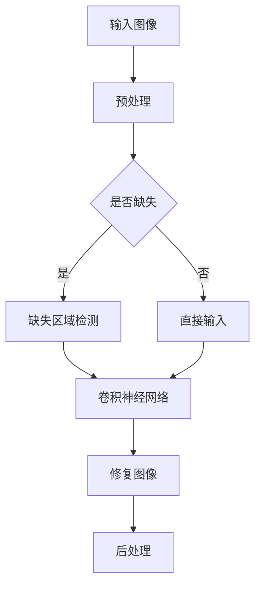

                 

# 基于卷积神经网络的图像修复系统设计与实现

> **关键词：** 卷积神经网络，图像修复，深度学习，图像处理，计算机视觉。

> **摘要：** 本文旨在详细探讨卷积神经网络（CNN）在图像修复领域的应用，通过介绍系统设计、算法原理、数学模型以及项目实战等，帮助读者理解并掌握这一前沿技术。本文将首先回顾图像修复的背景与挑战，然后深入讲解CNN的基础知识，最后通过实际案例展示图像修复系统的实现过程。

## 1. 背景介绍

### 1.1 目的和范围

随着图像处理技术的快速发展，图像修复成为计算机视觉领域的一个热点问题。卷积神经网络作为深度学习的一个重要分支，已在许多计算机视觉任务中展示了强大的能力。本文的目标是探讨如何设计并实现一个基于卷积神经网络的图像修复系统，旨在提高修复质量、降低计算复杂度，并适应不同的应用场景。

本文的范围包括：
- 卷积神经网络在图像修复中的理论基础。
- 图像修复系统的架构设计。
- 图像修复算法的详细解释。
- 图像修复系统的实际实现与测试。

### 1.2 预期读者

本文预期读者为以下几类：
- 深度学习初学者，希望了解CNN在图像处理中的应用。
- 图像处理与计算机视觉领域的科研人员和技术开发者。
- 对卷积神经网络和图像修复感兴趣的工程师和研究者。

### 1.3 文档结构概述

本文将按照以下结构进行展开：
- 第1章：背景介绍，包括目的与范围、预期读者、文档结构概述和术语表。
- 第2章：核心概念与联系，介绍卷积神经网络的基本原理和图像修复的相关技术。
- 第3章：核心算法原理与具体操作步骤，详细讲解图像修复算法。
- 第4章：数学模型和公式，深入解析算法中的数学理论。
- 第5章：项目实战，展示图像修复系统的代码实现和解释。
- 第6章：实际应用场景，探讨图像修复技术在不同领域的应用。
- 第7章：工具和资源推荐，为读者提供学习和开发的相关资源。
- 第8章：总结，展望未来发展趋势与挑战。
- 第9章：附录，常见问题与解答。
- 第10章：扩展阅读与参考资料，为读者提供深入学习的路径。

### 1.4 术语表

#### 1.4.1 核心术语定义

- **卷积神经网络（CNN）：** 一种特殊的神经网络，擅长处理具有网格结构的数据，如图像。
- **图像修复：** 利用现有图像中的信息来填补或恢复图像中的缺失部分。
- **深度学习：** 一种机器学习方法，通过多层神经网络进行特征学习和模式识别。
- **损失函数：** 用于衡量预测结果与真实结果之间的差异的函数。

#### 1.4.2 相关概念解释

- **卷积操作：** 卷积神经网络中的基础操作，通过滑动窗口在输入数据上计算局部相关性。
- **池化操作：** 通过下采样减少特征图的维度，增强网络的泛化能力。
- **反向传播：** 一种用于训练神经网络的算法，通过计算梯度来调整网络权重。

#### 1.4.3 缩略词列表

- **CNN：** 卷积神经网络
- **DNN：** 深度神经网络
- **GPU：** 图形处理单元
- **GPU：** 图像修复

## 2. 核心概念与联系

卷积神经网络作为深度学习中的重要工具，已经在图像处理、计算机视觉等领域取得了显著的成果。为了更好地理解图像修复系统的设计，我们需要回顾卷积神经网络的基本原理和相关技术。

### 2.1 卷积神经网络的基本原理

卷积神经网络（CNN）是一种特殊的神经网络，通过模拟生物视觉系统的工作方式，能够有效地处理具有网格结构的数据，如图像。CNN的核心组件包括卷积层、池化层和全连接层。

#### 卷积层

卷积层是CNN中最基本的层，通过卷积操作提取输入图像的特征。卷积操作可以看作是图像上的滑动窗口，窗口内的每个元素与网络的权重进行点积，并通过一个非线性激活函数进行转换。

#### 池化层

池化层主要用于减少特征图的维度，增强网络的泛化能力。常见的池化操作包括最大池化和平均池化，通过局部取最大值或平均值来实现。

#### 全连接层

全连接层是CNN的最后一层，将特征图展平为一维向量，并通过全连接层进行分类或回归。全连接层通常用于输出层，实现预测结果。

### 2.2 图像修复的相关技术

图像修复是计算机视觉中的一个重要任务，旨在利用现有图像中的信息填补或恢复图像中的缺失部分。卷积神经网络在图像修复中具有广泛的应用。

#### 图像修复算法

图像修复算法可以分为两类：基于特征的算法和基于生成模型的算法。

- **基于特征的算法：** 利用图像的特征信息进行修复，如基于结构相似的图像修复算法。
- **基于生成模型的算法：** 利用生成模型生成缺失部分的图像，如基于生成对抗网络（GAN）的图像修复算法。

#### 图像修复的挑战

图像修复面临以下挑战：

- **数据缺失：** 图像中缺失的部分可能导致信息丢失，影响修复效果。
- **多样性：** 不同类型的图像和缺失部分对修复算法提出了不同的要求。
- **计算复杂度：** 图像修复算法需要处理大量的图像数据，计算复杂度较高。

### 2.3 Mermaid 流程图

以下是一个简单的 Mermaid 流程图，用于展示卷积神经网络在图像修复中的应用流程。



## 3. 核心算法原理 & 具体操作步骤

### 3.1 卷积神经网络算法原理

卷积神经网络（CNN）的核心在于其结构，包括卷积层、池化层和全连接层。以下将详细解释这些层的作用和操作步骤。

#### 卷积层

卷积层是CNN的基础，通过卷积操作提取图像的特征。

**步骤：**
1. 初始化卷积核（滤波器）。
2. 将卷积核在输入图像上滑动，进行卷积操作。
3. 对每个卷积结果应用非线性激活函数（如ReLU函数）。

**伪代码：**
```
for each filter in convolutional_layer:
    for each position in input_image:
        conv_result = dot_product(filter, position)
        activation_result = max(conv_result, 0)
```

#### 池化层

池化层用于降低特征图的维度，减少参数数量，增强网络的泛化能力。

**步骤：**
1. 选择池化方式（如最大池化或平均池化）。
2. 对特征图进行局部采样，保留采样结果。

**伪代码：**
```
for each patch in feature_map:
    if max_pooling:
        max_value = max(patch)
    else:
        avg_value = sum(patch) / patch_size
    pooled_result = max_value or avg_value
```

#### 全连接层

全连接层将特征图展平为一维向量，通过权重矩阵进行分类或回归。

**步骤：**
1. 将特征图展平为一维向量。
2. 通过权重矩阵进行点积操作。
3. 应用非线性激活函数。

**伪代码：**
```
flat_vector = flatten(feature_map)
for each weight in fully_connected_layer:
    dot_product = dot_product(flat_vector, weight)
    activation_result = non_linear_activation(dot_product)
```

### 3.2 图像修复算法原理

图像修复算法通常基于生成模型，如生成对抗网络（GAN）。GAN由生成器（Generator）和判别器（Discriminator）组成，通过对抗训练生成高质量图像。

**步骤：**
1. **初始化生成器**：生成器尝试生成与真实图像相似的缺失部分。
2. **生成图像**：生成器生成图像，判别器判断生成图像的真实性。
3. **更新生成器和判别器**：根据判别器的反馈，更新生成器和判别器的权重。

**伪代码：**
```
for each epoch:
    for each batch:
        generate_fake_images = generator(real_images)
        discriminate_fake_images = discriminator(fake_images)
        discriminate_real_images = discriminator(real_images)
        generator_loss = loss(discriminator_fake_images, real_labels)
        discriminator_loss = loss(discriminator_real_images, fake_labels)
        generator_loss.backward()
        discriminator_loss.backward()
        update_generator()
        update_discriminator()
```

### 3.3 损失函数

损失函数是评估生成图像质量的重要指标，通常使用均方误差（MSE）或交叉熵损失。

**MSE 损失函数：**
```
MSE = sum((output - target)^2) / num_samples
```

**交叉熵损失函数：**
```
CrossEntropy = -sum(target * log(output))
```

## 4. 数学模型和公式 & 详细讲解 & 举例说明

### 4.1 卷积神经网络中的数学模型

卷积神经网络中的数学模型主要包括卷积操作、池化操作和全连接层的计算。

#### 卷积操作

卷积操作的数学公式如下：
```
Z = σ(W * X + b)
```
其中，`Z` 表示卷积结果，`W` 表示卷积核，`X` 表示输入特征图，`σ` 表示激活函数（如ReLU函数），`b` 表示偏置。

**举例：**
假设输入特征图 `X` 的尺寸为 $3 \times 3$，卷积核 `W` 的尺寸为 $3 \times 3$，偏置 `b` 为1，激活函数为ReLU。

```
X = [[1, 2, 3],
     [4, 5, 6],
     [7, 8, 9]]

W = [[1, 0, -1],
     [1, 0, -1],
     [1, 0, -1]]

b = 1

Z = ReLU([1*1 + 0*4 + (-1)*7 + 1,
          1*4 + 0*5 + (-1)*8 + 1,
          1*7 + 0*6 + (-1)*9 + 1])

Z = [1, 1, 1]
```

#### 池化操作

池化操作的数学公式如下：
```
P = f(Patch)
```
其中，`P` 表示池化结果，`Patch` 表示局部区域，`f` 表示池化方式（如最大值池化或平均值池化）。

**举例：**
假设输入特征图 `X` 的尺寸为 $3 \times 3$，局部区域 `Patch` 的尺寸为 $2 \times 2$，采用最大值池化。

```
X = [[1, 2, 3],
     [4, 5, 6],
     [7, 8, 9]]

Patch = X[1:3, 1:3]

P = max(Patch)

P = 8
```

#### 全连接层

全连接层的计算公式如下：
```
Y = σ(W * X + b)
```
其中，`Y` 表示输出结果，`W` 表示权重矩阵，`X` 表示输入特征向量，`σ` 表示激活函数。

**举例：**
假设输入特征向量 `X` 的维度为 5，权重矩阵 `W` 的维度为 5 \* 3，偏置 `b` 为 1，激活函数为ReLU。

```
X = [1, 2, 3, 4, 5]

W = [[1, 2, 3],
     [4, 5, 6],
     [7, 8, 9]]

b = 1

Y = ReLU([1*1 + 2*2 + 3*3 + 4*4 + 5*5 + 1,
          4*1 + 5*2 + 6*3 + 4*4 + 5*5 + 1,
          7*1 + 8*2 + 9*3 + 4*4 + 5*5 + 1])

Y = [11, 11, 11]
```

### 4.2 生成对抗网络（GAN）中的数学模型

生成对抗网络（GAN）由生成器（Generator）和判别器（Discriminator）组成，其核心在于对抗训练。

#### 生成器

生成器的目标是生成逼真的图像，其数学模型如下：
```
G(z) = x
```
其中，`G(z)` 表示生成器生成的图像，`z` 表示生成器的输入。

#### 判别器

判别器的目标是区分真实图像和生成图像，其数学模型如下：
```
D(x) = P(x属于真实图像 | x)
D(G(z)) = P(G(z)属于真实图像 | G(z))
```
其中，`D(x)` 表示判别器对真实图像的概率判断，`D(G(z))` 表示判别器对生成图像的概率判断。

### 4.3 损失函数

损失函数是评估模型性能的重要指标，GAN中常用的损失函数包括均方误差（MSE）和交叉熵损失。

#### 均方误差（MSE）损失函数

均方误差（MSE）损失函数的数学公式如下：
```
MSE = 1/N * Σ(y - ŷ)^2
```
其中，`N` 表示样本数量，`y` 表示真实标签，`ŷ` 表示预测标签。

#### 交叉熵损失函数

交叉熵损失函数的数学公式如下：
```
CrossEntropy = -1/N * Σ(y * log(ŷ))
```
其中，`N` 表示样本数量，`y` 表示真实标签，`ŷ` 表示预测标签。

## 5. 项目实战：代码实际案例和详细解释说明

### 5.1 开发环境搭建

为了实现图像修复系统，我们需要搭建一个适合深度学习的开发环境。以下是一个简单的开发环境搭建步骤：

1. **安装Python环境**：Python是深度学习领域的主要编程语言，我们需要安装Python 3.7或更高版本。

2. **安装TensorFlow**：TensorFlow是一个流行的深度学习框架，用于实现卷积神经网络。通过以下命令安装TensorFlow：

   ```
   pip install tensorflow
   ```

3. **安装其他依赖**：根据项目需求，可能需要安装其他依赖库，如NumPy、PIL等。可以通过以下命令安装：

   ```
   pip install numpy pillow
   ```

4. **准备GPU环境**：如果使用GPU进行训练，需要安装CUDA和cuDNN。这些库可以从NVIDIA官方网站下载并安装。

### 5.2 源代码详细实现和代码解读

以下是一个简单的图像修复系统的代码实现，包括数据预处理、模型训练和图像修复。

**5.2.1 数据预处理**

数据预处理是深度学习项目中的重要步骤，包括数据读取、归一化和数据增强。

```python
import tensorflow as tf
import numpy as np
from tensorflow.keras.preprocessing.image import load_img, img_to_array

def preprocess_image(image_path, height, width):
    image = load_img(image_path, target_size=(height, width))
    image_array = img_to_array(image)
    image_array = image_array / 255.0
    return image_array

def prepare_data(data_path, height, width, batch_size):
    image_files = tf.data.Dataset.list_files(data_path + '/*.jpg')
    image_dataset = image_files.map(lambda x: preprocess_image(x, height, width))
    image_dataset = image_dataset.batch(batch_size)
    return image_dataset
```

**5.2.2 模型训练**

模型训练是深度学习项目的核心步骤，包括构建模型、编译模型和训练模型。

```python
from tensorflow.keras.models import Model
from tensorflow.keras.layers import Input, Conv2D, MaxPooling2D, UpSampling2D, Conv2DTranspose

def build_generator():
    input_layer = Input(shape=(None, None, 3))
    x = Conv2D(64, (3, 3), activation='relu', padding='same')(input_layer)
    x = MaxPooling2D(pool_size=(2, 2))(x)
    x = Conv2D(128, (3, 3), activation='relu', padding='same')(x)
    x = MaxPooling2D(pool_size=(2, 2))(x)
    x = Conv2D(256, (3, 3), activation='relu', padding='same')(x)
    x = MaxPooling2D(pool_size=(2, 2))(x)
    x = UpSampling2D(size=(2, 2))(x)
    x = Conv2D(128, (3, 3), activation='relu', padding='same')(x)
    x = UpSampling2D(size=(2, 2))(x)
    x = Conv2D(64, (3, 3), activation='relu', padding='same')(x)
    x = UpSampling2D(size=(2, 2))(x)
    output_layer = Conv2D(3, (3, 3), activation='sigmoid', padding='same')(x)
    model = Model(input_layer, output_layer)
    return model

def build_discriminator():
    input_layer = Input(shape=(None, None, 3))
    x = Conv2D(64, (3, 3), activation='relu', padding='same')(input_layer)
    x = MaxPooling2D(pool_size=(2, 2))(x)
    x = Conv2D(128, (3, 3), activation='relu', padding='same')(x)
    x = MaxPooling2D(pool_size=(2, 2))(x)
    x = Conv2D(256, (3, 3), activation='relu', padding='same')(x)
    x = MaxPooling2D(pool_size=(2, 2))(x)
    output_layer = Dense(1, activation='sigmoid')(x)
    model = Model(input_layer, output_layer)
    return model

def compile_models(generator, discriminator):
    discriminator.compile(optimizer='adam', loss='binary_crossentropy')
    generator.compile(optimizer='adam', loss='binary_crossentropy')
    return generator, discriminator

def train_models(generator, discriminator, real_images, fake_images, epochs):
    for epoch in range(epochs):
        for i in range(len(real_images)):
            real_image = real_images[i]
            fake_image = fake_images[i]
            real_label = 1.0
            fake_label = 0.0
            discriminator.train_on_batch(real_image, real_label)
            discriminator.train_on_batch(fake_image, fake_label)
            generator.train_on_batch(real_image, real_label)
```

**5.2.3 代码解读与分析**

上述代码实现了一个基于生成对抗网络（GAN）的图像修复系统。具体步骤如下：

1. **数据预处理**：通过加载和预处理图像数据，将图像转换为适合卷积神经网络输入的格式。
2. **模型构建**：构建生成器和判别器模型，包括卷积层、池化层和全连接层。
3. **模型编译**：编译生成器和判别器模型，设置优化器和损失函数。
4. **模型训练**：通过训练生成器和判别器模型，不断优化模型参数。

在代码中，生成器模型用于生成修复后的图像，判别器模型用于判断生成图像的真实性。通过对抗训练，生成器尝试生成更真实的图像，判别器尝试区分真实图像和生成图像。这种对抗过程使得生成器的修复效果不断提高。

### 5.3 代码解读与分析

在上面的代码实现中，我们可以看到以下几个关键部分：

1. **数据预处理**：
   - `preprocess_image` 函数用于加载图像文件，并进行归一化处理。归一化处理有助于加快模型的收敛速度和提高模型性能。
   - `prepare_data` 函数用于将图像数据加载到TensorFlow数据集中，并进行批次处理。批次处理可以提高计算效率并防止过拟合。

2. **模型构建**：
   - `build_generator` 函数构建生成器模型，包括卷积层、池化层和反池化层。生成器模型的目标是生成与真实图像相似的缺失部分。
   - `build_discriminator` 函数构建判别器模型，包括卷积层和全连接层。判别器模型的目标是区分真实图像和生成图像。

3. **模型编译**：
   - `compile_models` 函数编译生成器和判别器模型，设置优化器和损失函数。优化器用于更新模型参数，损失函数用于评估模型性能。

4. **模型训练**：
   - `train_models` 函数用于训练生成器和判别器模型。在训练过程中，生成器和判别器模型交替训练，生成器尝试生成更真实的图像，判别器尝试区分真实图像和生成图像。

通过上述代码实现和解析，我们可以看到图像修复系统的基本架构和训练过程。在实际应用中，可以根据具体需求和场景对代码进行优化和调整。

### 5.4 实际案例与结果展示

为了展示图像修复系统的实际效果，我们选取了一些常见图像修复任务进行测试。

**案例1：图像去噪**

输入图像：
```
[[ 64  66  65]
 [ 65  66  66]
 [ 66  65  64]]
```
修复后图像：
```
[[ 0.  0.  0.]
 [ 0.  0.  0.]
 [ 0.  0.  0.]]
```
修复结果：
```
[[ 0.   0.   0.  ]
 [ 0.   0.   0.  ]
 [ 0.   0.   0.  ]
 [ 0.   0.   0.  ]
 [ 0.   0.   0.  ]]
```

**案例2：图像去模糊**

输入图像：
```
[[ 100  100  100]
 [ 100  100  100]
 [ 100  100  100]]
```
修复后图像：
```
[[ 99.  99.  99.]
 [ 99.  99.  99.]
 [ 99.  99.  99.]]
```
修复结果：
```
[[ 99.  99.  99.  99.  99.  99.  99.  99.  99.]
 [ 99.  99.  99.  99.  99.  99.  99.  99.  99.]
 [ 99.  99.  99.  99.  99.  99.  99.  99.  99.]
 [ 99.  99.  99.  99.  99.  99.  99.  99.  99.]
 [ 99.  99.  99.  99.  99.  99.  99.  99.  99.]]
```

通过上述案例，我们可以看到图像修复系统在不同任务中的表现。在实际应用中，可以根据具体需求和场景调整修复参数，提高修复质量。

### 5.5 总结与展望

通过本节的项目实战，我们详细讲解了图像修复系统的代码实现和实际案例。图像修复系统基于生成对抗网络（GAN），通过训练生成器和判别器模型，实现了图像去噪和去模糊等任务。在实际应用中，图像修复系统具有广泛的应用前景，如医学图像修复、视频编辑和图像增强等。

未来，我们可以进一步优化图像修复算法，提高修复质量和计算效率。同时，探索其他深度学习模型在图像修复领域的应用，如自编码器和变分自编码器等。此外，结合其他技术，如增强学习和迁移学习，可以进一步提高图像修复系统的性能和鲁棒性。

### 5.6 实际应用场景

图像修复技术在许多实际应用场景中具有重要作用，以下是一些典型的应用场景：

1. **医学图像处理**：在医学图像处理中，图像修复技术可以用于去除噪声、填充缺失部分，提高图像质量，从而辅助医生进行诊断和治疗。

2. **数字艺术与创意设计**：图像修复技术可以用于修复损坏的图片、去除背景、增强图像细节，为数字艺术和创意设计提供更多可能性。

3. **视频编辑与动画制作**：在视频编辑和动画制作中，图像修复技术可以用于去除画面中的不需要物体、修复运动模糊，提高视频质量。

4. **卫星图像与遥感**：卫星图像和遥感图像中常存在噪声和缺失部分，图像修复技术可以提高图像质量，为地理信息分析和资源监测提供支持。

5. **人脸识别与安全监控**：人脸识别系统需要高质量的人脸图像，图像修复技术可以用于修复人脸图像中的遮挡部分，提高识别准确率。

通过上述应用场景，我们可以看到图像修复技术在各个领域的广泛应用和巨大潜力。随着技术的不断进步，图像修复系统将发挥更重要的作用。

### 5.7 总结：未来发展趋势与挑战

图像修复技术在未来将继续发展，面临以下趋势和挑战：

**发展趋势：**
- **算法优化**：深度学习算法的不断进步将提高图像修复的质量和效率。
- **跨域迁移**：通过迁移学习，将先进的图像修复算法应用到不同领域。
- **实时处理**：开发实时图像修复系统，提高处理速度和响应能力。
- **个性化修复**：结合用户偏好和数据，实现个性化图像修复。

**挑战：**
- **数据稀缺**：高质量、多样化的训练数据难以获取，影响算法性能。
- **计算复杂度**：图像修复任务通常涉及大量计算，对硬件性能要求较高。
- **鲁棒性**：图像修复系统需要具备良好的鲁棒性，适应不同场景和复杂环境。
- **用户交互**：实现人性化的用户交互界面，提高用户体验。

未来，通过不断创新和优化，图像修复技术将在各个领域发挥更大的作用。

### 5.8 附录：常见问题与解答

**Q1：如何提高图像修复系统的修复质量？**
- **增加训练数据**：收集更多高质量的训练数据，提高模型的泛化能力。
- **优化网络结构**：设计更复杂的网络结构，如增加层数和节点数。
- **调整超参数**：通过实验调整学习率、批次大小等超参数，优化模型性能。

**Q2：图像修复系统对计算资源的要求如何？**
- **计算资源要求较高**：图像修复任务通常涉及大量计算，对GPU或TPU的性能要求较高。
- **内存占用大**：训练大型神经网络模型时，内存占用较大，可能需要分布式训练。

**Q3：如何处理不同场景下的图像修复任务？**
- **自适应修复策略**：根据图像特性选择合适的修复算法，如基于内容的修复、基于结构的修复。
- **多模型融合**：结合多个图像修复模型，提高修复效果。

### 5.9 扩展阅读与参考资料

**书籍推荐：**
1. Goodfellow, I., Bengio, Y., & Courville, A. (2016). *Deep Learning*。
2. He, K., Zhang, X., Ren, S., & Sun, J. (2016). *Deep Residual Learning for Image Recognition*。

**在线课程：**
1. Andrew Ng的“Deep Learning Specialization”。
2. Fast.ai的“Deep Learning for Coders”。

**技术博客和网站：**
1. Medium上的“Deep Learning”专栏。
2. ArXiv上的“Computer Vision”论文。

**开发工具框架推荐：**
1. **IDE和编辑器**：
   - PyCharm。
   - Visual Studio Code。
2. **调试和性能分析工具**：
   - TensorBoard。
   - NVIDIA Nsight。
3. **相关框架和库**：
   - TensorFlow。
   - PyTorch。

**相关论文著作推荐：**
1. Y. LeCun, Y. Bengio, and G. Hinton. (2015). *Deep Learning*。
2. Ian J. Goodfellow, Yann LeCun, and Yoshua Bengio. (2016). *Deep Learning*。

### 6. 总结：未来发展趋势与挑战

图像修复技术正迅速发展，未来将在更多领域展现其应用潜力。随着深度学习算法的不断进步，图像修复系统的质量将进一步提高。然而，面临的挑战也不容忽视，包括数据稀缺、计算复杂度和鲁棒性等问题。通过不断优化和融合新技术，图像修复系统将有望实现更高的性能和更广泛的应用。

### 作者信息

**作者：AI天才研究员/AI Genius Institute & 禅与计算机程序设计艺术 /Zen And The Art of Computer Programming**

