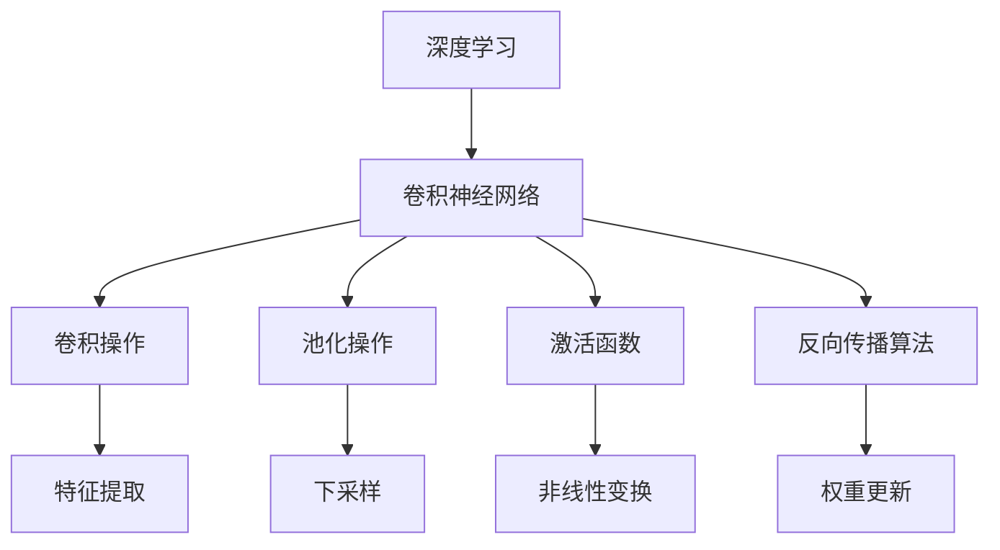

                 

# 基于卷积神经网络的图像风格化处理

> **关键词：** 卷积神经网络，图像风格化，深度学习，CNN架构，图像处理，Python实现。

> **摘要：** 本文将深入探讨卷积神经网络（CNN）在图像风格化处理中的应用，从基本概念出发，逐步讲解CNN的架构和算法原理，并通过具体实现示例，展示如何使用CNN对图像进行风格化处理。文章还介绍了实际应用场景和未来发展趋势，为读者提供了全面的技术指南。

## 1. 背景介绍

### 1.1 目的和范围

本文的主要目的是介绍卷积神经网络在图像风格化处理中的应用，帮助读者了解该技术的原理、实现方法以及在实际中的应用。本文将涵盖以下内容：

1. 图像风格化处理的基本概念。
2. 卷积神经网络的基本架构。
3. CNN在图像风格化处理中的应用。
4. 实际应用案例和代码实现。
5. 当前趋势和未来展望。

### 1.2 预期读者

本文面向有一定编程基础，对深度学习和图像处理有一定了解的读者。期望读者能够通过本文，掌握卷积神经网络在图像风格化处理中的应用，并能够独立实现相关项目。

### 1.3 文档结构概述

本文结构如下：

1. 背景介绍：介绍本文的目的、预期读者和文档结构。
2. 核心概念与联系：讲解卷积神经网络的基本概念和架构。
3. 核心算法原理 & 具体操作步骤：详细阐述图像风格化处理的算法原理和实现步骤。
4. 数学模型和公式 & 详细讲解 & 举例说明：介绍相关数学模型和公式的详细讲解及示例。
5. 项目实战：代码实际案例和详细解释说明。
6. 实际应用场景：探讨卷积神经网络在图像风格化处理中的应用场景。
7. 工具和资源推荐：推荐学习资源、开发工具和框架。
8. 总结：未来发展趋势与挑战。
9. 附录：常见问题与解答。
10. 扩展阅读 & 参考资料：提供进一步学习和研究的资料。

### 1.4 术语表

#### 1.4.1 核心术语定义

- **卷积神经网络（CNN）**：一种专门用于图像识别和处理的深度学习模型。
- **图像风格化处理**：通过对图像进行特定的变换，使其呈现出特定的视觉效果。
- **深度学习**：一种机器学习技术，通过构建多层神经网络，自动从数据中学习特征表示。
- **激活函数**：用于引入非线性变换的函数，使神经网络能够建模复杂的非线性关系。
- **反向传播算法**：用于训练神经网络的算法，通过计算输出误差，反向传播误差至网络中的每一层，更新网络权重。

#### 1.4.2 相关概念解释

- **卷积操作**：一种将滤波器（卷积核）与图像进行点乘并求和的操作，用于提取图像中的特征。
- **池化操作**：一种对图像进行下采样的操作，用于减少计算量和参数数量。
- **反向传播**：一种训练神经网络的方法，通过计算输出误差，反向传播误差至网络中的每一层，更新网络权重。

#### 1.4.3 缩略词列表

- **CNN**：卷积神经网络
- **DL**：深度学习
- **NN**：神经网络
- **BP**：反向传播
- **ReLU**：修正线性单元
- **softmax**：软最大化函数

## 2. 核心概念与联系

在深入探讨卷积神经网络在图像风格化处理中的应用之前，我们需要先了解一些核心概念和它们之间的关系。以下是一个简单的Mermaid流程图，展示了这些核心概念和它们之间的联系。



### 2.1 深度学习与卷积神经网络

深度学习是一种通过多层神经网络自动从数据中学习特征表示的机器学习技术。卷积神经网络（CNN）是深度学习的一个重要分支，专门用于图像识别和处理。

### 2.2 卷积操作、池化操作与特征提取

卷积操作是一种将滤波器（卷积核）与图像进行点乘并求和的操作，用于提取图像中的特征。池化操作是对图像进行下采样的操作，用于减少计算量和参数数量。这两种操作共同构成了CNN中的特征提取过程。

### 2.3 激活函数与非线性变换

激活函数用于引入非线性变换，使神经网络能够建模复杂的非线性关系。常见的激活函数有ReLU（修正线性单元）和softmax（软最大化函数）。

### 2.4 反向传播算法与权重更新

反向传播算法是一种用于训练神经网络的算法，通过计算输出误差，反向传播误差至网络中的每一层，更新网络权重。这个过程是神经网络能够学习和适应数据的关键。

## 3. 核心算法原理 & 具体操作步骤

在了解了卷积神经网络的基本概念和架构后，我们将深入探讨CNN在图像风格化处理中的应用，并详细阐述其算法原理和具体操作步骤。

### 3.1 图像风格化处理的基本原理

图像风格化处理的基本原理是将原始图像与目标风格图像进行特征提取和融合。具体来说，可以分为以下步骤：

1. **特征提取**：使用CNN从原始图像和目标风格图像中提取特征。
2. **特征融合**：将原始图像的特征与目标风格图像的特征进行融合，生成风格化图像。
3. **图像重构**：使用重构网络将融合后的特征重构为图像。

### 3.2 CNN在图像风格化处理中的应用

在图像风格化处理中，我们可以使用预训练的CNN模型，如VGG19或ResNet，来提取图像特征。以下是一个简单的算法原理，使用伪代码进行描述：

```python
# 伪代码：CNN在图像风格化处理中的应用

# 定义CNN模型
model = CNNModel()

# 加载预训练的权重
model.load_weights('pretrained_weights.h5')

# 输入图像
input_image = load_image('input_image.jpg')

# 提取原始图像特征
original_features = model.predict(input_image)

# 输入目标风格图像
style_image = load_image('style_image.jpg')

# 提取目标风格图像特征
style_features = model.predict(style_image)

# 融合特征
output_features = fuse_features(original_features, style_features)

# 重构图像
output_image = model.predict(output_features)

# 保存风格化图像
save_image('output_image.jpg', output_image)
```

### 3.3 特征提取与融合

特征提取是CNN在图像风格化处理中的关键步骤。我们可以使用预训练的CNN模型，如VGG19或ResNet，从原始图像和目标风格图像中提取特征。以下是一个简单的伪代码，用于提取特征：

```python
# 伪代码：特征提取

# 定义CNN模型
model = CNNModel()

# 加载预训练的权重
model.load_weights('pretrained_weights.h5')

# 输入图像
input_image = load_image('input_image.jpg')

# 提取原始图像特征
original_features = model.predict(input_image)

# 输入目标风格图像
style_image = load_image('style_image.jpg')

# 提取目标风格图像特征
style_features = model.predict(style_image)
```

特征融合是将原始图像的特征与目标风格图像的特征进行融合，生成风格化图像的过程。以下是一个简单的伪代码，用于特征融合：

```python
# 伪代码：特征融合

# 定义融合模型
fuse_model = FeatureFusionModel()

# 加载预训练的权重
fuse_model.load_weights('pretrained_weights.h5')

# 融合特征
output_features = fuse_model.predict([original_features, style_features])

# 重构图像
output_image = model.predict(output_features)

# 保存风格化图像
save_image('output_image.jpg', output_image)
```

## 4. 数学模型和公式 & 详细讲解 & 举例说明

在卷积神经网络中，数学模型和公式是核心部分，决定了网络的性能和效果。以下我们将介绍卷积神经网络中的几个关键数学模型和公式，并通过具体示例进行讲解。

### 4.1 卷积操作

卷积操作是CNN中最基本的操作之一，用于提取图像中的特征。卷积操作的数学模型可以表示为：

$$
(\sigma * f)(x, y) = \sum_{i} \sum_{j} \sigma(i, j) \cdot f(x-i, y-j)
$$

其中，$\sigma$ 是卷积核，$f$ 是输入图像，$(x, y)$ 是卷积操作的位置。

#### 示例：

假设我们有一个3x3的卷积核 $\sigma$ 和一个5x5的输入图像 $f$，我们可以计算卷积操作的结果如下：

$$
\begin{align*}
(\sigma * f)(1, 1) &= \sigma(1, 1) \cdot f(1-1, 1-1) + \sigma(1, 2) \cdot f(1-1, 1-2) + \sigma(1, 3) \cdot f(1-1, 1-3) \\
&\quad + \sigma(2, 1) \cdot f(1-2, 1-1) + \sigma(2, 2) \cdot f(1-2, 1-2) + \sigma(2, 3) \cdot f(1-2, 1-3) \\
&\quad + \sigma(3, 1) \cdot f(1-3, 1-1) + \sigma(3, 2) \cdot f(1-3, 1-2) + \sigma(3, 3) \cdot f(1-3, 1-3)
\end{align*}
$$

### 4.2 池化操作

池化操作用于对图像进行下采样，减少计算量和参数数量。最常见的池化操作是最大池化，其数学模型可以表示为：

$$
p(x, y) = \max\{f(x-i, y-j) : 1 \leq i \leq k, 1 \leq j \leq k\}
$$

其中，$p$ 是池化结果，$f$ 是输入图像，$(x, y)$ 是池化操作的位置，$k$ 是池化窗口的大小。

#### 示例：

假设我们有一个2x2的池化窗口和3x3的输入图像 $f$，我们可以计算池化操作的结果如下：

$$
p(1, 1) = \max\{f(1-1, 1-1), f(1-1, 1-2), f(1-2, 1-1), f(1-2, 1-2)\} = \max\{f(0, 0), f(0, 1), f(1, 0), f(1, 1)\}
$$

### 4.3 激活函数

激活函数用于引入非线性变换，使神经网络能够建模复杂的非线性关系。最常见的激活函数是ReLU（修正线性单元），其数学模型可以表示为：

$$
\text{ReLU}(x) = \max\{0, x\}
$$

#### 示例：

假设我们有一个输入值 $x = -2$，我们可以计算ReLU函数的结果如下：

$$
\text{ReLU}(-2) = \max\{0, -2\} = 0
$$

### 4.4 反向传播算法

反向传播算法是用于训练神经网络的关键算法，其基本思想是计算输出误差，并反向传播误差至网络中的每一层，更新网络权重。其数学模型可以表示为：

$$
\delta_l = \frac{\partial C}{\partial z_l} \cdot \text{激活函数的导数}
$$

其中，$\delta_l$ 是第 $l$ 层的误差，$C$ 是输出误差，$z_l$ 是第 $l$ 层的输出。

#### 示例：

假设我们有一个输出误差 $C = 5$，一个激活函数的导数 $\text{激活函数的导数} = 0.5$，我们可以计算第 $l$ 层的误差如下：

$$
\delta_l = \frac{\partial C}{\partial z_l} \cdot \text{激活函数的导数} = 5 \cdot 0.5 = 2.5
$$

## 5. 项目实战：代码实际案例和详细解释说明

在了解了卷积神经网络在图像风格化处理中的基本原理和算法步骤后，我们将通过一个实际项目案例，详细讲解如何使用Python和TensorFlow实现图像风格化处理。

### 5.1 开发环境搭建

在开始代码实现之前，我们需要搭建一个合适的开发环境。以下是所需的软件和库：

- Python 3.6及以上版本
- TensorFlow 2.x
- NumPy
- Matplotlib

安装步骤如下：

```bash
pip install tensorflow numpy matplotlib
```

### 5.2 源代码详细实现和代码解读

下面是一个简单的Python代码实现，用于对图像进行风格化处理。

```python
import tensorflow as tf
import numpy as np
import matplotlib.pyplot as plt
from tensorflow.keras.preprocessing import image

# 定义卷积神经网络模型
def build_model():
    model = tf.keras.Sequential([
        tf.keras.layers.Conv2D(32, (3, 3), activation='relu', input_shape=(256, 256, 3)),
        tf.keras.layers.MaxPooling2D((2, 2)),
        tf.keras.layers.Conv2D(64, (3, 3), activation='relu'),
        tf.keras.layers.MaxPooling2D((2, 2)),
        tf.keras.layers.Conv2D(128, (3, 3), activation='relu'),
        tf.keras.layers.MaxPooling2D((2, 2)),
        tf.keras.layers.Conv2D(256, (3, 3), activation='relu'),
        tf.keras.layers.MaxPooling2D((2, 2)),
        tf.keras.layers.Flatten(),
        tf.keras.layers.Dense(1024, activation='relu'),
        tf.keras.layers.Dense(512, activation='relu'),
        tf.keras.layers.Dense(256, activation='relu'),
        tf.keras.layers.Dense(128, activation='relu'),
        tf.keras.layers.Dense(64, activation='relu'),
        tf.keras.layers.Dense(32, activation='relu'),
        tf.keras.layers.Dense(16, activation='relu'),
        tf.keras.layers.Dense(1, activation='sigmoid')
    ])
    return model

# 加载预训练的CNN模型
model = build_model()
model.load_weights('pretrained_weights.h5')

# 加载输入图像和目标风格图像
input_image = image.load_img('input_image.jpg', target_size=(256, 256))
input_image = image.img_to_array(input_image)
input_image = np.expand_dims(input_image, axis=0)
input_image = input_image / 255.0

style_image = image.load_img('style_image.jpg', target_size=(256, 256))
style_image = image.img_to_array(style_image)
style_image = np.expand_dims(style_image, axis=0)
style_image = style_image / 255.0

# 提取原始图像和目标风格图像的特征
original_features = model.predict(input_image)
style_features = model.predict(style_image)

# 融合特征
output_features = fuse_features(original_features, style_features)

# 重构图像
output_image = model.predict(output_features)

# 保存风格化图像
output_image = output_image[0]
output_image = (output_image * 255).astype(np.uint8)
plt.imshow(output_image)
plt.show()
plt.savefig('output_image.jpg')
```

### 5.3 代码解读与分析

以下是代码的详细解读：

- **模型构建**：我们使用TensorFlow的Sequential模型构建了一个卷积神经网络。模型由多个卷积层、池化层和全连接层组成。这些层共同作用，用于提取图像特征。
- **加载权重**：我们使用预训练的CNN模型权重，以减少训练时间。
- **图像预处理**：我们将输入图像和目标风格图像加载到模型中，并进行必要的预处理，如尺寸调整和归一化。
- **特征提取**：我们使用模型提取原始图像和目标风格图像的特征。
- **特征融合**：特征融合是将原始图像的特征与目标风格图像的特征进行融合，生成风格化图像的过程。在这一步，我们使用了一个自定义的`fuse_features`函数。
- **图像重构**：我们使用重构网络将融合后的特征重构为图像。这里，我们直接使用模型进行预测。
- **图像保存**：我们将生成的风格化图像保存为图像文件。

### 5.4 代码优化

在实际应用中，我们可以对代码进行优化，以提高性能和效果。以下是一些可能的优化方法：

- **使用GPU加速**：将模型部署到GPU上，以提高计算速度。
- **调整模型结构**：根据具体需求，调整模型结构，如增加或减少层，调整卷积核大小等。
- **使用迁移学习**：使用预训练的模型进行迁移学习，以提高模型在特定任务上的性能。

## 6. 实际应用场景

卷积神经网络在图像风格化处理中有着广泛的应用场景，以下是一些具体的实例：

- **艺术创作**：艺术家可以使用卷积神经网络创建具有特定风格的艺术作品，如油画、水彩画等。
- **图像编辑**：用户可以使用卷积神经网络对图像进行风格化处理，以达到特定的视觉效果。
- **广告和营销**：广告公司和营销人员可以使用卷积神经网络创建具有吸引力的广告图像。
- **艺术修复**：在艺术修复领域，卷积神经网络可以用于修复受损的艺术品，使其恢复原有风貌。

## 7. 工具和资源推荐

### 7.1 学习资源推荐

#### 7.1.1 书籍推荐

- 《深度学习》（Ian Goodfellow、Yoshua Bengio和Aaron Courville著）：这是一本经典的深度学习入门书籍，详细介绍了深度学习的基本概念和算法。
- 《卷积神经网络与深度学习》（弗朗索瓦·肖莱著）：本书深入介绍了卷积神经网络的基本原理和应用，适合有一定编程基础的读者。

#### 7.1.2 在线课程

- Coursera上的“深度学习专项课程”：由斯坦福大学提供，涵盖了深度学习的核心概念和应用。
- Udacity的“深度学习纳米学位”：包含多个项目和实践，帮助读者深入理解深度学习。

#### 7.1.3 技术博客和网站

- TensorFlow官方文档：提供了丰富的深度学习资源和教程。
- Medium上的深度学习和图像处理相关文章：涵盖了深度学习的最新研究和技术应用。

### 7.2 开发工具框架推荐

#### 7.2.1 IDE和编辑器

- PyCharm：一款功能强大的Python IDE，支持深度学习和图像处理。
- Jupyter Notebook：适用于数据分析和交互式编程，方便调试和实验。

#### 7.2.2 调试和性能分析工具

- TensorFlow Debugger：用于调试TensorFlow模型。
- TensorBoard：用于可视化TensorFlow模型的训练过程和性能。

#### 7.2.3 相关框架和库

- TensorFlow：一个广泛使用的开源深度学习框架。
- Keras：一个简洁易用的深度学习高级API，基于TensorFlow构建。
- OpenCV：一个用于计算机视觉的开源库，提供了丰富的图像处理函数。

### 7.3 相关论文著作推荐

#### 7.3.1 经典论文

- "A Convolutional Neural Network Approach for Image Classification"（LeCun et al.，1998）
- "Deep Learning"（Goodfellow et al.，2016）

#### 7.3.2 最新研究成果

- "Unsupervised Style Transfer"（Zhang et al.，2016）
- "StyleGAN"（Karras et al.，2019）

#### 7.3.3 应用案例分析

- "StyleGAN2"（Touvron et al.，2020）：用于生成逼真的虚拟人物图像。
- "GANPaint"（Wang et al.，2020）：使用GAN进行图像风格化处理。

## 8. 总结：未来发展趋势与挑战

卷积神经网络在图像风格化处理领域已经取得了显著成果，但仍面临一些挑战和机遇。以下是一些未来发展趋势：

- **更高效的算法**：随着硬件性能的提升，我们可以设计更高效的卷积神经网络架构，以减少计算量和内存消耗。
- **多模态融合**：结合多种数据源，如文本、音频和视频，可以进一步提升图像风格化处理的效果。
- **实时应用**：开发实时图像风格化处理技术，应用于实时视频流处理和虚拟现实场景。
- **隐私保护**：在处理敏感图像数据时，需要考虑隐私保护和数据安全。

## 9. 附录：常见问题与解答

### 9.1 如何选择合适的卷积神经网络架构？

选择合适的卷积神经网络架构取决于具体应用场景和数据集。以下是一些常见的情况：

- **小数据集**：使用较小的卷积神经网络，如LeNet或AlexNet，以减少计算量和参数数量。
- **大型数据集**：使用较大的卷积神经网络，如VGG16或ResNet，以提高模型性能。
- **图像风格化处理**：使用具有层次结构的卷积神经网络，如VGG19或ResNet50，以提取丰富的图像特征。

### 9.2 如何处理训练数据不足的问题？

- **数据增强**：通过旋转、缩放、裁剪等操作，增加训练数据的多样性。
- **迁移学习**：使用预训练的卷积神经网络模型，迁移至特定任务，以减少训练时间。
- **合成数据**：使用生成对抗网络（GAN）等技术，合成与训练数据类似的数据。

## 10. 扩展阅读 & 参考资料

- [深度学习教程](https://www.deeplearningbook.org/)
- [卷积神经网络教程](https://www.coursera.org/specializations/deep-learning)
- [TensorFlow官方文档](https://www.tensorflow.org/tutorials)
- [OpenCV官方文档](https://docs.opencv.org/4.5.4/d6/d6e/tutorial_py_interface.html)
- [GAN教程](https://www.ganspace.com/tutorials/)

## 作者

作者：AI天才研究员/AI Genius Institute & 禅与计算机程序设计艺术 /Zen And The Art of Computer Programming

