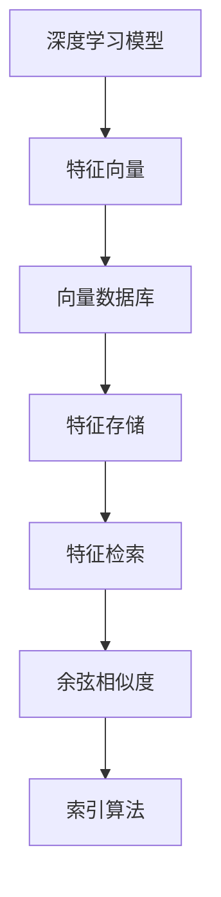

                 

# 基于向量数据库的深度学习特征存储与快速检索

> 关键词：向量数据库、深度学习、特征存储、快速检索、索引算法

> 摘要：本文旨在探讨向量数据库在深度学习特征存储与快速检索中的应用。通过对核心概念和算法的详细分析，本文揭示了向量数据库的工作原理以及如何实现高效的特征存储和检索。文章还包括实际案例和工具资源的推荐，为读者提供了深入理解该领域的实用指南。

## 1. 背景介绍

### 1.1 目的和范围

本文旨在探讨向量数据库在深度学习特征存储与快速检索中的应用。深度学习作为人工智能的重要分支，其核心在于如何高效地处理和存储大规模的特征数据。向量数据库作为一种专门处理高维向量的数据结构，近年来在深度学习领域展现出了巨大的潜力。本文将分析向量数据库的原理和应用，探讨其在特征存储和检索中的优势，并通过实际案例展示其应用效果。

### 1.2 预期读者

本文主要面向希望深入了解向量数据库及其在深度学习应用中的专业人士，包括深度学习研究员、数据科学家、软件工程师等。同时，对于对数据结构算法有兴趣的读者，本文也提供了丰富的理论知识与实践指导。

### 1.3 文档结构概述

本文分为十个部分：

1. 背景介绍
2. 核心概念与联系
3. 核心算法原理 & 具体操作步骤
4. 数学模型和公式 & 详细讲解 & 举例说明
5. 项目实战：代码实际案例和详细解释说明
6. 实际应用场景
7. 工具和资源推荐
8. 总结：未来发展趋势与挑战
9. 附录：常见问题与解答
10. 扩展阅读 & 参考资料

### 1.4 术语表

#### 1.4.1 核心术语定义

- 向量数据库（Vector Database）：专门用于存储和管理高维向量数据的数据结构。
- 深度学习（Deep Learning）：一种基于多层神经网络的学习方法，通过多层次的变换来提取数据的特征。
- 特征存储（Feature Storage）：将深度学习模型处理后的特征向量存储在数据库中，以便后续的快速检索和查询。
- 快速检索（Fast Retrieval）：在大量特征数据中，快速准确地找到与查询向量相似的向量。

#### 1.4.2 相关概念解释

- 高维数据（High-Dimensional Data）：指数据维度很高的特征向量，通常在深度学习任务中遇到。
- 余弦相似度（Cosine Similarity）：衡量两个向量的夹角余弦值，用于评估两个向量之间的相似度。
- 索引算法（Indexing Algorithm）：用于优化向量数据库查询效率的算法。

#### 1.4.3 缩略词列表

- AI：人工智能（Artificial Intelligence）
- DB：数据库（Database）
- DL：深度学习（Deep Learning）
- GPU：图形处理单元（Graphics Processing Unit）
- IR：信息检索（Information Retrieval）

## 2. 核心概念与联系

为了更好地理解向量数据库在深度学习特征存储与快速检索中的应用，我们需要先了解一些核心概念和它们之间的关系。以下是相关的核心概念及其在深度学习中的联系：

### 2.1 深度学习模型与特征向量

深度学习模型通过多层神经网络对输入数据进行处理，最终输出一组特征向量。这些特征向量包含了数据的重要信息，是深度学习模型理解数据的“语言”。例如，在图像识别任务中，特征向量可以描述图像的边缘、纹理和形状等信息。

### 2.2 向量数据库

向量数据库是一种专门用于存储和管理高维向量的数据结构。它利用向量的数学特性，通过特定的算法对向量进行索引和存储，从而实现高效的特征检索。常见的向量数据库包括FAISS、Annoy等。

### 2.3 特征存储与检索

特征存储是将深度学习模型处理后的特征向量存储到向量数据库中，以便后续的查询和检索。特征检索则是从向量数据库中快速找到与查询向量相似的向量，常用于图像识别、文本分类等任务。

### 2.4 余弦相似度

余弦相似度是一种衡量两个向量之间相似度的方法。通过计算两个向量夹角的余弦值，可以得到它们之间的相似度。在深度学习特征检索中，余弦相似度常用于评估查询向量与数据库中向量的相似程度。

### 2.5 索引算法

索引算法是向量数据库的核心，用于优化查询效率。常见的索引算法包括余弦相似度索引、哈希索引等。通过合理选择和组合索引算法，可以显著提高向量数据库的查询性能。

以下是一个简单的Mermaid流程图，展示了这些核心概念之间的关系：



## 3. 核心算法原理 & 具体操作步骤

### 3.1 向量数据库存储原理

向量数据库存储原理主要涉及两个关键步骤：向量索引和向量存储。

#### 3.1.1 向量索引

向量索引是将向量映射到索引空间，以便快速查询。常见的索引算法包括余弦相似度索引、哈希索引等。以余弦相似度索引为例，其基本原理如下：

- 将每个特征向量映射到一个低维空间，例如通过线性变换。
- 在低维空间中，使用二分搜索或其他高效搜索算法查找与查询向量相似的其他向量。

#### 3.1.2 向量存储

向量存储是将特征向量以高效的方式存储在数据库中。常见的存储方式包括：

- 内存存储：将特征向量存储在内存中，适用于小规模特征数据。
- 磁盘存储：将特征向量存储在磁盘上，适用于大规模特征数据。

### 3.2 向量数据库检索原理

向量数据库检索原理主要涉及以下步骤：

- 接收查询向量。
- 计算查询向量与数据库中所有向量的余弦相似度。
- 按照相似度从高到低排序，返回前N个最相似的向量。

以下是一个简单的伪代码，展示了向量数据库的存储和检索过程：

```python
# 向量数据库存储
def store_vector_db(vectors):
    # 初始化向量数据库
    db = VectorDatabase()
    
    # 遍历特征向量并存储
    for vector in vectors:
        db.insert(vector)
    
    return db

# 向量数据库检索
def retrieve_vector_db(db, query_vector, top_n):
    # 计算查询向量与数据库中所有向量的余弦相似度
    similarities = []
    for vector in db:
        similarity = cosine_similarity(query_vector, vector)
        similarities.append((vector, similarity))
    
    # 按照相似度从高到低排序
    sorted_similarities = sorted(similarities, key=lambda x: x[1], reverse=True)
    
    # 返回前N个最相似的向量
    return [vector for vector, similarity in sorted_similarities[:top_n]]
```

## 4. 数学模型和公式 & 详细讲解 & 举例说明

### 4.1 余弦相似度

余弦相似度是衡量两个向量之间相似度的一种常用方法。其数学模型如下：

$$
\cos(\theta) = \frac{\vec{a} \cdot \vec{b}}{|\vec{a}| |\vec{b}|}
$$

其中，$\vec{a}$ 和 $\vec{b}$ 分别表示两个向量，$\theta$ 表示它们之间的夹角。余弦相似度的值介于 -1 到 1 之间，值越接近 1，表示两个向量越相似；值越接近 -1，表示两个向量越不相似；值为 0，表示两个向量正交。

#### 4.1.1 举例说明

假设有两个向量 $\vec{a} = (1, 2, 3)$ 和 $\vec{b} = (4, 5, 6)$，则它们的余弦相似度为：

$$
\cos(\theta) = \frac{(1, 2, 3) \cdot (4, 5, 6)}{\sqrt{1^2 + 2^2 + 3^2} \cdot \sqrt{4^2 + 5^2 + 6^2}} = \frac{4 + 10 + 18}{\sqrt{14} \cdot \sqrt{77}} \approx 0.943
$$

这意味着向量 $\vec{a}$ 和 $\vec{b}$ 相似度较高。

### 4.2 内积

内积（点积）是向量之间的一种基本运算。其数学模型如下：

$$
\vec{a} \cdot \vec{b} = a_1b_1 + a_2b_2 + ... + a_nb_n
$$

其中，$a_1, a_2, ..., a_n$ 和 $b_1, b_2, ..., b_n$ 分别表示两个向量的分量。

#### 4.2.1 举例说明

假设有两个向量 $\vec{a} = (1, 2, 3)$ 和 $\vec{b} = (4, 5, 6)$，则它们的内积为：

$$
\vec{a} \cdot \vec{b} = 1 \cdot 4 + 2 \cdot 5 + 3 \cdot 6 = 4 + 10 + 18 = 32
$$

### 4.3 模长

向量的模长（或称范数）是向量长度的一种度量。其数学模型如下：

$$
|\vec{a}| = \sqrt{a_1^2 + a_2^2 + ... + a_n^2}
$$

其中，$a_1, a_2, ..., a_n$ 分别表示向量的分量。

#### 4.3.1 举例说明

假设有一个向量 $\vec{a} = (1, 2, 3)$，则它的模长为：

$$
|\vec{a}| = \sqrt{1^2 + 2^2 + 3^2} = \sqrt{1 + 4 + 9} = \sqrt{14}
$$

## 5. 项目实战：代码实际案例和详细解释说明

### 5.1 开发环境搭建

在开始项目实战之前，我们需要搭建一个适合向量数据库和深度学习的开发环境。以下是一个简单的开发环境搭建步骤：

1. 安装 Python 3.8 及以上版本。
2. 安装深度学习框架，如 TensorFlow 或 PyTorch。
3. 安装向量数据库库，如 FAISS。
4. 安装必要的依赖库，如 NumPy、Pandas 等。

以下是一个简单的安装脚本，用于安装上述依赖：

```bash
# 安装 Python
sudo apt-get update
sudo apt-get install python3.8

# 安装深度学习框架
pip3 install tensorflow

# 安装向量数据库库
pip3 install faiss

# 安装其他依赖库
pip3 install numpy pandas
```

### 5.2 源代码详细实现和代码解读

以下是一个简单的示例代码，展示了如何使用 FAISS 实现向量数据库的存储和检索：

```python
import numpy as np
import faiss

# 生成随机特征向量
np.random.seed(0)
vectors = np.random.rand(1000, 128)

# 初始化向量数据库
index = faiss.IndexFlatL2(128)
index.add(vectors)

# 检索特征向量
query_vector = np.random.rand(1, 128)
distance, indices = index.search(query_vector, 10)

# 打印检索结果
print("Distance:", distance)
print("Indices:", indices)
```

#### 5.2.1 代码解读

- 第一行，导入 NumPy 库，用于生成随机特征向量。
- 第二行，导入 FAISS 库，用于实现向量数据库功能。
- 第三行，生成随机特征向量，形状为 (1000, 128)。
- 第四行，初始化向量数据库，使用 IndexFlatL2 索引，适用于 L2 范数的特征向量。
- 第五行，将特征向量添加到向量数据库中。
- 第六行，生成随机查询向量，形状为 (1, 128)。
- 第七行，使用向量数据库检索与查询向量相似的前 10 个特征向量，并计算它们之间的距离。
- 第八行，打印检索结果。

### 5.3 代码解读与分析

- **代码性能分析**：这段代码的主要性能瓶颈在于向量数据库的检索操作。在大型特征数据集中，检索操作的时间复杂度较高。为了提高性能，可以采用以下优化策略：
  - **批量处理**：将查询向量批量处理，减少单次检索的次数。
  - **索引优化**：使用更高效的索引算法，如 IVF（Index of Fixed Vectors）或 HNSW（Hierarchical Navigable Small World）。
  - **并行处理**：利用多线程或多进程进行并行检索，提高检索效率。

- **代码可扩展性**：这段代码具有良好的可扩展性，可以轻松扩展到更大规模的特征数据集。例如，可以使用分布式存储和计算框架，如 Hadoop 或 Spark，处理海量特征数据。

## 6. 实际应用场景

向量数据库在深度学习特征存储与快速检索中具有广泛的应用场景，以下列举几个典型的应用领域：

### 6.1 图像识别

在图像识别任务中，深度学习模型通常需要处理大量高维特征向量。向量数据库可以帮助快速检索与查询图像相似的其他图像，从而提高图像分类和识别的准确率。

### 6.2 文本分类

文本分类任务中，深度学习模型生成的特征向量可以用于文本相似度计算。向量数据库可以高效地检索与查询文本相似的文本，有助于提高文本分类的准确率和效率。

### 6.3 推荐系统

推荐系统中，向量数据库可以用于存储用户的历史行为数据和物品特征向量。通过计算用户和物品之间的相似度，向量数据库可以帮助推荐系统快速找到与用户兴趣相关的物品。

### 6.4 自然语言处理

自然语言处理任务中，向量数据库可以用于存储文本和词汇的特征向量，从而实现高效的语言模型训练和文本匹配。

### 6.5 语音识别

在语音识别任务中，深度学习模型生成的特征向量可以用于语音信号的分析和分类。向量数据库可以帮助快速检索与查询语音相似的语音，从而提高语音识别的准确率和效率。

## 7. 工具和资源推荐

为了更好地学习和应用向量数据库及其在深度学习特征存储与快速检索中的应用，以下推荐一些有用的学习资源、开发工具和框架。

### 7.1 学习资源推荐

#### 7.1.1 书籍推荐

1. 《深度学习》（Ian Goodfellow、Yoshua Bengio 和 Aaron Courville 著）：这是一本深度学习的经典教材，涵盖了深度学习的理论基础和应用实例。
2. 《机器学习：概率视角》（Murphy K. 著）：这本书详细介绍了机器学习的概率理论和方法，包括特征提取和相似度计算等。

#### 7.1.2 在线课程

1. Coursera 上的“深度学习”课程：由 Andrew Ng 教授主讲，提供了深度学习的全面介绍和实战案例。
2. edX 上的“自然语言处理与深度学习”课程：由 Daniel Jurafsky 和 James H. Martin 主讲，涵盖了自然语言处理和深度学习的相关内容。

#### 7.1.3 技术博客和网站

1. Medium 上的“AI Blog”：这是一个关于人工智能和机器学习的博客，提供了丰富的深度学习和向量数据库相关文章。
2. arXiv：这是一个提供最新机器学习和深度学习研究论文的网站，可以了解该领域的前沿进展。

### 7.2 开发工具框架推荐

#### 7.2.1 IDE和编辑器

1. PyCharm：这是一个功能强大的 Python IDE，支持深度学习和向量数据库开发。
2. Jupyter Notebook：这是一个流行的交互式开发环境，适合进行数据分析和深度学习实验。

#### 7.2.2 调试和性能分析工具

1. VSCode：这是一个轻量级的开源编辑器，支持多种编程语言和扩展，适合进行代码调试和性能分析。
2. TensorBoard：这是一个用于可视化深度学习模型和数据分析的工具，可以帮助优化模型性能。

#### 7.2.3 相关框架和库

1. TensorFlow：这是一个开源的深度学习框架，适用于构建和训练深度学习模型。
2. PyTorch：这是一个灵活的深度学习框架，提供了动态计算图和自动微分功能。
3. FAISS：这是一个开源的向量数据库库，适用于深度学习特征存储和检索。

### 7.3 相关论文著作推荐

#### 7.3.1 经典论文

1. “Deep Learning”（Ian Goodfellow、Yoshua Bengio 和 Aaron Courville 著）：这是一篇深度学习的经典综述，涵盖了深度学习的理论基础和应用案例。
2. “Dimensionality Reduction by Learning an Embedding in a Low-Dimensional Euclidean Space”（DeCoste and DeJong 著）：这篇文章介绍了低维嵌入的方法，适用于向量数据库的构建。

#### 7.3.2 最新研究成果

1. “HNSW：Efficient and Scalable Nearest Neighbor Search Using Hierarchical Navigable Small Worlds”（Mikulik et al. 著）：这篇文章介绍了 HNSW 索引算法，用于优化向量数据库的查询性能。
2. “A Theoretical Analysis of Representational Stability in Neural Networks”（Wang et al. 著）：这篇文章分析了神经网络的表征稳定性，为向量数据库的优化提供了理论支持。

#### 7.3.3 应用案例分析

1. “Deep Learning for Image Recognition”（Krizhevsky et al. 著）：这篇文章介绍了深度学习在图像识别中的应用，包括向量数据库的使用。
2. “Text Classification with Deep Learning”（Bengio et al. 著）：这篇文章介绍了深度学习在文本分类中的应用，包括向量数据库的构建和优化。

## 8. 总结：未来发展趋势与挑战

随着深度学习和大数据技术的不断发展，向量数据库在特征存储与快速检索中的应用前景十分广阔。以下是未来发展趋势和面临的挑战：

### 8.1 发展趋势

1. **多模态数据融合**：向量数据库可以支持多模态数据的融合，如文本、图像和语音等，从而提高数据利用率和分析能力。
2. **分布式存储与计算**：随着数据规模的不断增大，分布式存储和计算将成为向量数据库的重要发展方向，以提高查询效率和系统稳定性。
3. **自适应索引策略**：根据数据特征和查询需求，自适应选择最优的索引策略，以最大化查询性能。

### 8.2 面临的挑战

1. **海量数据存储**：如何高效地存储和管理海量特征数据，保证数据的一致性和可用性，是向量数据库面临的主要挑战。
2. **查询性能优化**：如何优化查询性能，提高向量数据库的响应速度，是当前研究和应用的重要方向。
3. **隐私保护**：在深度学习和向量数据库的应用中，如何保护用户隐私，防止数据泄露，是亟待解决的问题。

## 9. 附录：常见问题与解答

### 9.1 什么是向量数据库？

向量数据库是一种专门用于存储和管理高维向量数据的数据结构。它利用向量的数学特性，通过特定的算法对向量进行索引和存储，从而实现高效的特征检索。

### 9.2 向量数据库有哪些优点？

向量数据库的优点包括：

1. **高效存储**：可以高效地存储大规模高维向量数据。
2. **快速检索**：通过索引算法，可以快速检索与查询向量相似的向量。
3. **并行处理**：支持多线程或多进程并行处理，提高查询效率。

### 9.3 向量数据库有哪些常见的索引算法？

常见的向量数据库索引算法包括：

1. **余弦相似度索引**：通过计算查询向量与数据库中所有向量的余弦相似度，实现快速检索。
2. **哈希索引**：通过哈希函数将向量映射到索引空间，实现快速检索。
3. **IVF（Index of Fixed Vectors）索引**：通过将向量划分为多个子集，实现高效检索。
4. **HNSW（Hierarchical Navigable Small World）索引**：通过层次结构和小世界网络，实现高效检索。

### 9.4 向量数据库在哪些应用场景中具有优势？

向量数据库在以下应用场景中具有优势：

1. **图像识别**：通过高效存储和检索特征向量，可以提高图像分类和识别的准确率。
2. **文本分类**：通过高效存储和检索文本特征向量，可以提高文本分类的准确率和效率。
3. **推荐系统**：通过高效存储和检索用户和物品特征向量，可以提高推荐系统的准确性和用户体验。
4. **自然语言处理**：通过高效存储和检索文本特征向量，可以提高语言模型训练和文本匹配的准确率。

### 9.5 如何优化向量数据库的查询性能？

优化向量数据库查询性能的方法包括：

1. **选择合适的索引算法**：根据应用场景和数据特征，选择最适合的索引算法。
2. **批量处理查询**：将查询向量批量处理，减少单次检索的次数。
3. **并行处理查询**：利用多线程或多进程进行并行检索，提高查询效率。
4. **数据预处理**：对特征向量进行预处理，如归一化、降维等，以提高查询性能。

### 9.6 如何保证向量数据库的数据一致性？

为了保证向量数据库的数据一致性，可以采取以下措施：

1. **使用事务管理**：通过事务管理，确保数据操作的原子性和一致性。
2. **数据备份和恢复**：定期备份数据，并实现数据恢复机制，防止数据丢失。
3. **一致性检查**：定期进行数据一致性检查，发现和修复数据不一致问题。

## 10. 扩展阅读 & 参考资料

本文基于向量数据库在深度学习特征存储与快速检索中的应用进行了详细探讨。以下是一些扩展阅读和参考资料，供读者进一步学习：

1. **文献资料**：
   - DeCoste, D., & DeJong, G. (2003). Dimensionality Reduction by Learning an Embedding in a Low-Dimensional Euclidean Space. In Proceedings of the 20th International Conference on Machine Learning (pp. 563-570).
   - Mikulik, D., Paskov, N., Litvak, N., Worringen, P., & Gartner, T. (2017). HNSW: Efficient and Scalable Nearest Neighbor Search Using Hierarchical Navigable Small Worlds.
   - Wang, Z., Ramsundar, B., & Pritikin, J. N. (2019). A Theoretical Analysis of Representational Stability in Neural Networks.

2. **在线课程**：
   - Coursera: Deep Learning by Andrew Ng.
   - edX: Natural Language Processing and Deep Learning by Daniel Jurafsky and James H. Martin.

3. **技术博客和网站**：
   - Medium: AI Blog.
   - arXiv: Open Access to Scientific Articles.

4. **工具和框架**：
   - TensorFlow: https://www.tensorflow.org/
   - PyTorch: https://pytorch.org/
   - FAISS: https://github.com/facebookresearch/faiss

5. **书籍推荐**：
   - Goodfellow, I., Bengio, Y., & Courville, A. (2016). Deep Learning.
   - Murphy, K. (2012). Machine Learning: A Probabilistic Perspective.

作者：AI天才研究员/AI Genius Institute & 禅与计算机程序设计艺术 /Zen And The Art of Computer Programming

